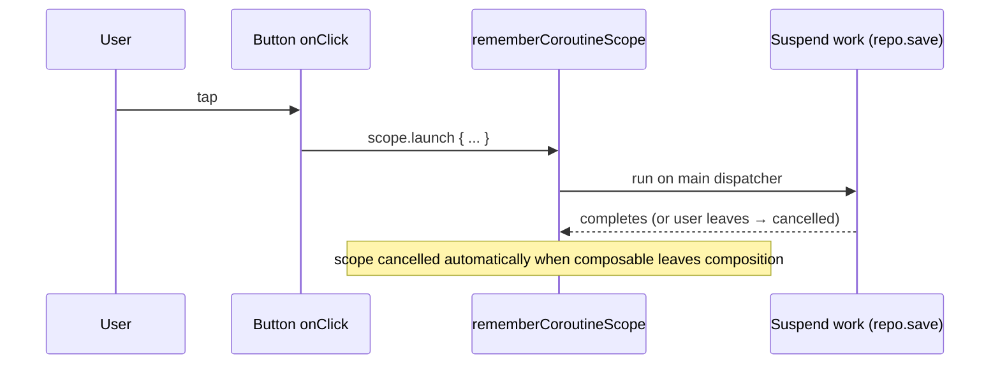
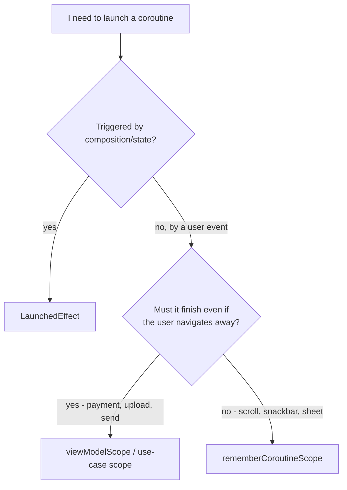

# Lesson 03 — `rememberCoroutineScope`

> After this lesson you can launch coroutines in response to user events (clicks, gestures) — not composition — using a scope that lives exactly as long as the composable, and you know precisely when to reach for it instead of `LaunchedEffect`.

**Module:** 06 · **Lesson:** 03 · **Level:** 🟢🟡🔴 · **Est. time:** 60–75 min

---

## 1. Concept

### 🟢 For beginners — *what is it and why do I care?*

`LaunchedEffect` (Lesson 02) starts a coroutine **when the screen appears**. But sometimes you want to start a coroutine **when the user does something** — taps a button, swipes a card, pulls to refresh. You can't put suspend work directly in an `onClick`, because `onClick` is an ordinary lambda, not a coroutine.

`rememberCoroutineScope` gives you a **`CoroutineScope`** you can call `.launch { … }` on from inside event handlers:

```kotlin
val scope = rememberCoroutineScope()

Button(onClick = {
    scope.launch {
        snackbarHostState.showSnackbar("Saved!")   // suspend call, now legal
    }
}) { Text("Save") }
```

The scope is **tied to this composable's lifetime**: when the composable leaves the screen, any coroutines you launched in it are **automatically cancelled**. So you get the "launch from an event" power of a coroutine scope, with the leak-safety of Compose's lifecycle.

The mental split is simple:

- **Effect happens because the screen is in a certain state** → `LaunchedEffect`.
- **Effect happens because the user did something** → `rememberCoroutineScope` + `scope.launch`.

### 🟡 For intermediate devs — *the mechanism*

`rememberCoroutineScope()` returns a `CoroutineScope` that is **`remember`ed** for the call site and **cancelled when that call site leaves composition**. Its `CoroutineContext` uses the composition's monotonic main dispatcher by default, so launched coroutines start on the main thread (switch with `withContext` for blocking work).

Key properties:

- It's created **once** and the *same scope instance* persists across recompositions — you don't get a new scope each frame.
- Unlike `LaunchedEffect`, it **does not auto-launch anything**; you decide when to `launch` (typically from a callback).
- Unlike `LaunchedEffect`, it has **no keys** and therefore **no restart behavior** — coroutines you launch run until they finish or the scope is cancelled.

```kotlin
@Composable
fun NoteEditor(note: Note, repo: NoteRepository) {
    val scope = rememberCoroutineScope()
    Button(onClick = {
        scope.launch { repo.save(note) }     // launched by the click, not by composition
    }) { Text("Save") }
}
```

When *should* you use it vs. `LaunchedEffect`? If the trigger is **a user action or any imperative callback** (a `LazyListState.animateScrollToItem`, a `ModalBottomSheet` dismissal, a pager `animateScrollToPage`), use `rememberCoroutineScope`. If the trigger is **"this state/param is now true/changed,"** use `LaunchedEffect`.

### 🔴 For senior devs — *trade-offs, edges, internals*

`rememberCoroutineScope` implements `RememberObserver`: it creates a scope whose `Job` is cancelled in `onForgotten` (when the call site leaves composition or is discarded). The scope's context is `recomposeCoroutineContext + Job()` — it inherits the composition's dispatcher but gets its **own `Job`**, so cancelling the composable cancels its launches, but one failing launch doesn't tear down the composition.

The subtleties seniors must own:

- **Scope lifetime ≠ work lifetime you may want.** The scope dies when the composable leaves. If the user taps "Upload" and immediately navigates away, the upload is **cancelled mid-flight**. For a button press that must complete regardless of navigation (payment, upload, "send"), launch in `viewModelScope` (or a use-case scope), not the composition scope. `rememberCoroutineScope` is correct for **UI-coupled** actions (scroll, snackbar, expand/collapse) whose value evaporates when the screen is gone.
- **It's not a place for `collect` / long-running subscriptions.** A `scope.launch { flow.collect { … } }` started from an event will keep collecting until the screen leaves, but you have no key-based restart and it's easy to start **duplicate collectors** (every click launches another). Continuous observation belongs in `LaunchedEffect`/`produceState`/`collectAsStateWithLifecycle`.
- **Click handlers that launch are re-entrant.** Two fast taps launch two coroutines. If the action isn't idempotent (double save, double navigation), debounce or guard with a state flag / disable the button while in flight. The scope won't dedupe for you.
- **Exception handling is on you.** An uncaught exception in a `scope.launch` propagates to the scope's `Job` and can cancel sibling launches in the same scope. Wrap risky work in `try/catch` (re-throwing `CancellationException`) or attach a `CoroutineExceptionHandler`; otherwise a failed save can silently kill an unrelated in-flight coroutine launched from the same scope.
- **Don't capture the scope and store it.** Passing the scope to a long-lived object (a singleton, a callback retained beyond the screen) leaks the composition-scoped `Job`'s intent and can run code against a dead UI. Keep it local.

### Analogy

`LaunchedEffect` is a **motion-sensor light**: it turns on by itself when you enter the room. `rememberCoroutineScope` is the **light switch on the wall**: nothing happens until *you* flip it — but the wiring (the scope) is still tied to the house's power, so when the house is demolished (composable leaves), the circuit is cut and the light can't stay on. You get manual control with automatic safety.

### Mental model

> **`rememberCoroutineScope` is a launch button wired to the screen's life. You decide when to press it (from a callback); Compose decides when to cut the power (when the screen leaves). For work that must survive the screen, use a `ViewModel` scope instead.**

### Real-world example

A **chat screen**: tapping "Send" calls `scope.launch { repo.send(message) }` and then `listState.animateScrollToItem(last)`. A **bottom sheet**: the confirm button does `scope.launch { sheetState.hide(); onConfirmed() }` because `hide()` is a suspend animation. A **list**: a "scroll to top" FAB does `scope.launch { listState.animateScrollToItem(0) }`.

---

## 2. Visual Learning

**ASCII — who pulls the trigger:**
```text
   LaunchedEffect            rememberCoroutineScope
   ───────────────           ───────────────────────
   composition/state          user event / callback
        │ (automatic)              │ (you call .launch)
        ▼                          ▼
   coroutine starts          scope.launch { suspend work }
        │                          │
   key change → restart       (no keys, no restart)
        │                          │
   leave screen → cancel      leave screen → scope cancelled → launches cancelled
```

**Mermaid — event-driven launch lifecycle:**


**Mermaid — decision: which scope?**


**Illustration prompt (paste into an image generator):**
```text
Illustration: a clean control panel mounted on a wall labeled "Composable". On it, a big
physical PUSH BUTTON labeled "onClick" is wired by a glowing cable to a small engine labeled
"scope.launch". The cable runs back into the wall to a power box labeled "composition
lifecycle" with a breaker switch. A ghosted figure walks out a door labeled "leave screen",
and at that instant the breaker trips and the engine powers down. Caption:
"You press it; the screen powers it." Modern, vibrant, technical-but-friendly, clear labels.
```

---

## 3. Code

### 🟢 Beginner — show a snackbar from a click

```kotlin
@Composable
fun SaveBar(onSaved: () -> Unit) {
    val scope = rememberCoroutineScope()
    val snackbar = remember { SnackbarHostState() }

    Scaffold(snackbarHost = { SnackbarHost(snackbar) }) { padding ->
        Button(
            onClick = {
                scope.launch {                       // launched by the tap
                    snackbar.showSnackbar("Saved!")  // suspend animation
                    onSaved()
                }
            },
            modifier = Modifier.padding(padding),
        ) { Text("Save") }
    }
}
```

**Explanation.** `showSnackbar` is a suspend function (it suspends until the snackbar is dismissed). It can't be called in `onClick` directly, so we `scope.launch` it. The scope is remembered once and cancelled when `SaveBar` leaves the screen.

**Common mistakes.**
```kotlin
// ❌ Calling a suspend function directly in onClick → won't compile.
Button(onClick = { snackbar.showSnackbar("Saved!") }) { Text("Save") }

// ❌ Creating a scope by hand → not tied to composition; leaks.
val scope = CoroutineScope(Dispatchers.Main)   // never cancelled by Compose
```
A hand-rolled `CoroutineScope` isn't cancelled when the screen leaves — its coroutines can outlive the UI and leak.

**Best practices.**
- Use `rememberCoroutineScope()` for suspend calls triggered by events; never construct your own scope in a composable.
- Keep the launched block short and UI-coupled (snackbars, scrolls, animations).

---

### 🟡 Intermediate — animate a list and guard double-taps

```kotlin
@Composable
fun MessageList(messages: List<Message>, onSend: (String) -> Unit) {
    val scope = rememberCoroutineScope()
    val listState = rememberLazyListState()
    var sending by remember { mutableStateOf(false) }
    var draft by remember { mutableStateOf("") }

    Column {
        LazyColumn(state = listState, modifier = Modifier.weight(1f)) {
            items(messages, key = { it.id }) { MessageRow(it) }
        }
        Row {
            TextField(value = draft, onValueChange = { draft = it }, modifier = Modifier.weight(1f))
            Button(
                enabled = draft.isNotBlank() && !sending,     // guard re-entrant taps
                onClick = {
                    val text = draft
                    draft = ""
                    sending = true
                    scope.launch {
                        try {
                            onSend(text)
                            listState.animateScrollToItem(messages.size)  // UI-coupled animation
                        } finally {
                            sending = false
                        }
                    }
                },
            ) { Text("Send") }
        }
    }
}
```

**Explanation.** The click launches a coroutine that performs the send and then animates the scroll — both UI-coupled, so the composition scope is the right home. A `sending` flag disables the button while in flight, preventing the double-tap-double-send bug. `finally` resets the flag even on cancellation.

**Common mistakes.**
```kotlin
// ❌ No guard: two fast taps launch two coroutines → double send + janky double scroll.
onClick = { scope.launch { onSend(draft); listState.animateScrollToItem(messages.size) } }
```
`rememberCoroutineScope` doesn't dedupe launches; rapid taps stack coroutines. Guard with a flag or debounce.

**Best practices.**
- Disable or debounce buttons whose action isn't idempotent while a launch is in flight.
- Use `finally` to reset in-flight flags so cancellation (navigating away) doesn't leave the UI stuck.

---

### 🔴 Production — the right scope for "must complete" work

```kotlin
@Composable
fun CheckoutBar(
    vm: CheckoutViewModel = viewModel(),
) {
    val uiScope = rememberCoroutineScope()       // for UI-coupled feedback only
    val snackbar = remember { SnackbarHostState() }
    val state by vm.state.collectAsStateWithLifecycle()

    Button(
        enabled = !state.isSubmitting,
        onClick = {
            // ✅ The PAYMENT runs in viewModelScope so it survives navigation/rotation.
            vm.submitOrder()
            // ✅ Only the transient UI feedback uses the composition scope.
            uiScope.launch { snackbar.showSnackbar("Placing your order…") }
        },
    ) { Text(if (state.isSubmitting) "Submitting…" else "Place order") }

    SnackbarHost(snackbar)
}

class CheckoutViewModel(private val repo: OrderRepository) : ViewModel() {
    private val _state = MutableStateFlow(CheckoutState())
    val state = _state.asStateFlow()

    fun submitOrder() {
        if (_state.value.isSubmitting) return            // idempotency guard
        _state.update { it.copy(isSubmitting = true) }
        viewModelScope.launch {                          // survives screen leave / rotation
            val result = runCatching { repo.placeOrder() }
            _state.update { it.copy(isSubmitting = false, lastResult = result.toUiResult()) }
        }
    }
}
```

**Explanation.** The distinction every senior must make: the **payment must not be cancelled if the user rotates or briefly leaves**, so it runs in `viewModelScope`. The **snackbar** is pure UI sugar — fine to cancel with the screen — so it uses `rememberCoroutineScope`. The ViewModel guards against double-submit. This is `rememberCoroutineScope` used *only* for what it's good at: ephemeral, UI-coupled feedback.

**Common mistakes.**
```kotlin
// ❌ Critical work in the composition scope: navigating away mid-payment cancels it.
onClick = {
    rememberScope.launch { repo.placeOrder() }   // user leaves → payment cancelled → lost order
}
```
The composition scope dies with the screen. Anything whose completion matters regardless of navigation must live in a longer-lived scope.

**Best practices.**
- Put **must-complete** actions (payment, upload, send) in `viewModelScope`/a domain scope; use `rememberCoroutineScope` only for **UI-coupled, disposable** work.
- Guard non-idempotent actions in the ViewModel, not just in the UI.
- Never start a continuous `collect` from a click in the composition scope — that's a subscription, not an event.

---

## 4. Interview Questions

**🟢 Beginner**

1. *Why can't you call a suspend function directly inside a `Button`'s `onClick`?*
   > `onClick` is an ordinary lambda, not a coroutine, so it can't call suspend functions. You need a `CoroutineScope` to `launch` the suspend work — `rememberCoroutineScope` gives you one tied to the composable.
2. *What's the difference between `LaunchedEffect` and `rememberCoroutineScope`?*
   > `LaunchedEffect` auto-launches a coroutine driven by composition/state and restarts on key change. `rememberCoroutineScope` gives you a scope to launch coroutines yourself from events/callbacks, with no keys and no restart.

**🟡 Intermediate**

3. *What is the lifetime of the scope returned by `rememberCoroutineScope`, and what happens to its coroutines when the composable leaves?*
   > The scope lives as long as the call site is in composition; the same instance persists across recompositions. When the composable leaves composition (or is discarded), the scope's `Job` is cancelled, cancelling all coroutines launched in it.
4. *You launch a coroutine on every button tap. What bug can rapid taps cause and how do you prevent it?*
   > Each tap launches a separate coroutine, so non-idempotent actions (save, send, navigate) can fire multiple times. Prevent it by disabling/debouncing the control while in flight, or guarding with an in-flight flag (ideally in the ViewModel).

**🔴 Senior**

5. *A user taps "Upload" then immediately navigates back. With `rememberCoroutineScope`, what happens to the upload, and how should you fix it if the upload must finish?*
   > The composition scope is cancelled on navigation, so the upload is cancelled mid-flight and may be lost. If it must complete regardless of navigation, launch it in `viewModelScope` (survives config changes) or hand it to WorkManager (survives process death) — not the composition scope.
6. *Why is `rememberCoroutineScope` a poor place to start a Flow `collect`, and what should you use instead?*
   > It has no key-based lifecycle, so each event that launches a `collect` can create duplicate, overlapping collectors, and there's no clean restart semantics. Continuous observation belongs in `LaunchedEffect`, `produceState`, or `collectAsStateWithLifecycle`, which are tied to composition/lifecycle.
7. *How does an uncaught exception in one `scope.launch` affect other coroutines launched from the same `rememberCoroutineScope`?*
   > They share the scope's `Job`, so an uncaught exception cancels the scope and can tear down sibling launches. Isolate risky work with `try/catch` (re-throwing `CancellationException`), a `SupervisorJob`/`supervisorScope`, or a `CoroutineExceptionHandler`.

---

## 5. AI Assistant

**Prompt example (event-driven coroutine):**
```text
In Compose, I have a "Send" button. On click I need to (1) call a suspend repo.send(text),
then (2) animateScrollToItem to the bottom of a LazyColumn. Use rememberCoroutineScope,
guard against double-taps while in flight, and reset the guard in a finally. Explain why this
work belongs in the composition scope and NOT viewModelScope. Target: Compose 2026, Kotlin 2.x.
```

**AI workflow — where it helps on *this* topic.**
- ✅ Good for: wiring `scope.launch` from callbacks, snackbar/scroll/sheet animations, the in-flight guard pattern.
- ⚠️ Watch: models often put **must-complete** work (payment/upload) in the composition scope, start **collectors** from clicks, omit the **double-tap guard**, and forget exception isolation.

**Review workflow — map to this lesson's *Common Mistakes*:**
- Is the launched work genuinely **UI-coupled and disposable**? If it must survive navigation, did it move to `viewModelScope`?
- Is there a **guard/debounce** for non-idempotent actions?
- Did it avoid starting a `collect`/subscription from an event handler?
- Is a hand-rolled `CoroutineScope(...)` avoided (use `rememberCoroutineScope`)?

**Validation workflow — prove it actually works:**
1. **Compile & run.** Tap the action; confirm the suspend work and any animation execute.
2. **Double-tap fast.** Confirm the action fires **once** (guard works).
3. **Trigger then navigate away** mid-flight. For UI-coupled work, confirm clean cancellation (no crash). For must-complete work, confirm it **still finishes** (because you moved it to `viewModelScope`).
4. **Force an error** in the launched block; confirm it doesn't silently cancel unrelated launches (exception isolation in place).

> **AI drafts, you decide.** The model can launch the coroutine; *you* decide which scope owns it — composition for ephemeral UI, ViewModel for work that must outlive the screen.

---

## Recap / Key takeaways

- `rememberCoroutineScope` gives a **composition-scoped `CoroutineScope`** to launch coroutines from **events/callbacks**, not composition.
- The scope persists across recompositions and is **cancelled when the composable leaves** — leak-safe by construction.
- It has **no keys / no restart**; you control when to `launch`.
- Use it for **UI-coupled, disposable** work (snackbar, scroll, sheet); move **must-complete** work (payment, upload) to `viewModelScope`/WorkManager.
- **Guard non-idempotent** actions against rapid taps, and **isolate exceptions** so one failed launch doesn't cancel siblings.

➡️ Next: **[Lesson 04 — `DisposableEffect`](04-disposableeffect.md)** — registering and *cleaning up* listeners, observers, and resources when a composable leaves.
