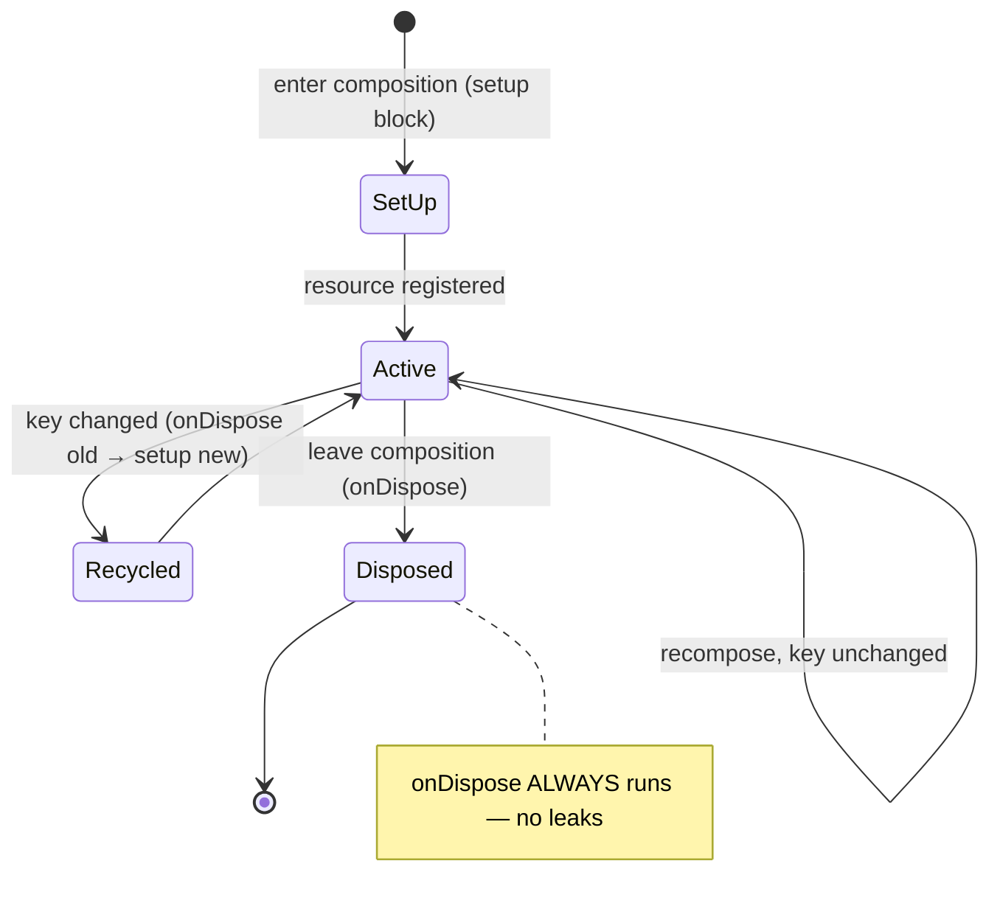
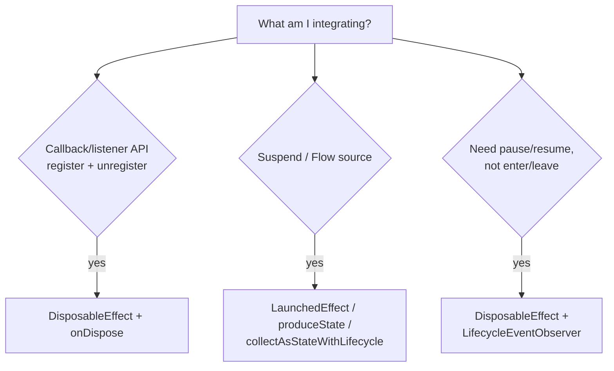

# Lesson 04 — `DisposableEffect`

> After this lesson you can register a listener, observer, or external resource when a composable enters and **guarantee it's cleaned up** when the composable leaves or its key changes — with no leaks.

**Module:** 06 · **Lesson:** 04 · **Level:** 🟢🟡🔴 · **Est. time:** 70–85 min

---

## 1. Concept

### 🟢 For beginners — *what is it and why do I care?*

Some things you set up **must be torn down**. If you register a listener, you must unregister it. If you start observing the device's location, you must stop. If you open a connection, you must close it. Forget the teardown and you get a **leak**: the listener keeps firing into a screen that's gone, holding it in memory.

`DisposableEffect` is the API for exactly this **setup → teardown** pair. You give it two halves:

```kotlin
DisposableEffect(Unit) {
    // SETUP: runs when the composable enters
    sensorManager.registerListener(listener, sensor, RATE)

    onDispose {
        // TEARDOWN: runs when the composable leaves
        sensorManager.unregisterListener(listener)
    }
}
```

The rule that makes it foolproof: **every `DisposableEffect` must end with an `onDispose { }` block.** It won't compile without one. So Compose *forces* you to write the cleanup, right next to the setup. When the composable leaves the screen, `onDispose` runs automatically.

Use `DisposableEffect` whenever you'd otherwise say *"register/add/subscribe now, and remember to unregister/remove/unsubscribe later."*

### 🟡 For intermediate devs — *the mechanism*

`DisposableEffect(keys) { setup; onDispose { teardown } }` behaves like `LaunchedEffect`, but for **non-coroutine** resources that need explicit disposal:

1. **On enter** (first composition with these keys): the setup block runs.
2. **On key change**: the **old** `onDispose` runs, then the **new** setup runs. (Teardown-then-setup — the resource is rebuilt for the new key.)
3. **On leave** (composable removed/discarded): the `onDispose` runs.

The keys mean the same thing as in `LaunchedEffect`: "the identity of the thing being set up." If you register a callback for a specific `lifecycleOwner`, key on `lifecycleOwner` so that when it changes, the old registration is disposed and a new one is created.

```kotlin
DisposableEffect(lifecycleOwner) {
    val observer = LifecycleEventObserver { _, event -> /* … */ }
    lifecycleOwner.lifecycle.addObserver(observer)
    onDispose { lifecycleOwner.lifecycle.removeObserver(observer) }
}
```

The difference from `LaunchedEffect`: `DisposableEffect`'s block is **not** a coroutine (no `suspend`), and its defining feature is the **mandatory cleanup**. Reach for it when the work is **register/unregister**, **add/remove**, **acquire/release** — anything with a symmetric teardown.

### 🔴 For senior devs — *trade-offs, edges, internals*

`DisposableEffect` is `remember` of a `DisposableEffectImpl` that implements `RememberObserver`: setup runs in `onRemembered`, and your `onDispose` runs in `onForgotten`. The teardown is guaranteed for any committed composition — it fires on removal, on key change, and when the whole composition is disposed. The subtleties:

- **Key choice determines re-registration cost.** Each key change does a full teardown+setup cycle. Keying on an **unstable** value (lambda, fresh object) re-registers your listener **every recomposition** — expensive and bug-prone (you can briefly have zero or duplicate registrations). Key on stable identities only. If setup should happen exactly once for the composable's life, use `DisposableEffect(Unit)` (but see the lifecycle caveat below).
- **`onDispose` must be cheap and non-suspending.** It runs synchronously during the apply/dispose phase. You cannot `delay` or do long I/O in it. If teardown needs suspension (rare), launch it in an external scope from within `onDispose` and accept that it's fire-and-forget — but prefer designing resources with synchronous `close()`.
- **`DisposableEffect` vs `LaunchedEffect` for subscriptions.** A callback-based API (sensor, `BroadcastReceiver`, `LocationManager`, a third-party SDK listener) maps naturally to `DisposableEffect`. A *suspend/Flow* source maps to `LaunchedEffect`/`produceState`/`collectAsStateWithLifecycle`. Don't wrap a Flow in `DisposableEffect`; don't wrap a raw listener in `LaunchedEffect` (you'd have no clean unregister point — though `callbackFlow` bridges the two, see Lesson 06/08).
- **Lifecycle awareness isn't automatic.** `DisposableEffect(Unit)` setup happens on **enter composition**, not on `ON_START`, and teardown on **leave composition**, not `ON_STOP`. If you need start/stop semantics (e.g. register a camera only while the screen is *resumed*), observe the `Lifecycle` explicitly inside the effect (the `LifecycleEventObserver` pattern) or use `androidx.lifecycle.compose`'s lifecycle helpers. A composable can remain in composition while the app is backgrounded.
- **Exceptions in setup.** If the setup block throws, `onDispose` for *that* effect won't have been registered, so you can leak a half-acquired resource. Acquire defensively and make setup as close to atomic as possible; release in the same block if a later step fails.
- **Ordering with sibling effects is defined.** Multiple effects in one composable set up top-to-bottom and dispose **in reverse order** — rely on this when one resource depends on another.

### Analogy

Renting a **boat**. When you arrive at the dock (enter composition) you sign for the boat and get the keys (setup). The rental contract **requires** you to return it and settle up when you leave (the mandatory `onDispose`). If you want a **different boat** (key change), you must return the current one first, then check out the new one. There is no version of this where you walk away still holding the keys — the dock makes you hand them back. That enforced return is why you never "leak a boat."

### Mental model

> **`DisposableEffect` = "set this up on enter; the `onDispose` is a contract to tear it down on leave or key change." If you register/add/acquire anything, its `onDispose` is non-negotiable.**

### Real-world example

A **map screen** registers a `LocationListener` on enter and removes it on leave (otherwise GPS keeps draining the battery into a dead screen). A **video player** acquires an `ExoPlayer` and `release()`s it in `onDispose`. A **keyboard-visibility** feature adds a `ViewTreeObserver.OnGlobalLayoutListener` and removes it on dispose. Any screen that **observes the `Lifecycle`** (pause/resume analytics, refresh on resume) uses the `LifecycleEventObserver` + `DisposableEffect` pattern.

---

## 2. Visual Learning

**ASCII — the symmetric setup/teardown:**
```text
   enter composition
        │
        ▼
   DisposableEffect(key) ── SETUP ──▶ register listener / acquire resource
        │
   recompose, key unchanged ── nothing happens (resource stays) ──┐
        │                                                          │
   recompose, key changed ── onDispose (old) ──▶ SETUP (new)       │ symmetric
        │                                                          │
   leave composition ── onDispose ──▶ unregister / release ────────┘
```

**Mermaid — lifecycle with mandatory cleanup:**


**Mermaid — DisposableEffect vs LaunchedEffect:**


**Illustration prompt (paste into an image generator):**
```text
Illustration: a boat-rental dock. A person at a kiosk labeled "DisposableEffect" receives
boat keys labeled "register listener / acquire resource" as they step onto the dock
(arrow: "enter composition"). A bold sign reads "RETURN REQUIRED — onDispose". As the person
leaves through a turnstile labeled "leave composition", they drop the keys into a return slot
that glows "unregister / release". A second lane shows someone swapping to a different boat:
they must return the old keys first. Caption: "You can't walk away holding the keys."
Modern, vibrant, friendly, clear labels.
```

---

## 3. Code

### 🟢 Beginner — add and remove a back-press / listener

```kotlin
@Composable
fun NetworkStatusBanner(connectivity: ConnectivityManager) {
    var online by remember { mutableStateOf(true) }

    DisposableEffect(Unit) {                          // set up once on enter
        val callback = object : ConnectivityManager.NetworkCallback() {
            override fun onAvailable(n: Network) { online = true }
            override fun onLost(n: Network) { online = false }
        }
        connectivity.registerDefaultNetworkCallback(callback)

        onDispose {                                   // MANDATORY teardown on leave
            connectivity.unregisterNetworkCallback(callback)
        }
    }

    if (!online) Banner("You're offline")
}
```

**Explanation.** On enter, we register a network callback that flips `online` state. The `onDispose` unregisters it when the banner leaves the screen. Without `onDispose`, the callback would keep firing into a removed composable — a leak. Note the compiler *requires* the `onDispose`.

**Common mistakes.**
```kotlin
// ❌ No DisposableEffect: registered in composition, never unregistered → leak + crashes.
@Composable
fun NetworkStatusBanner(connectivity: ConnectivityManager) {
    connectivity.registerDefaultNetworkCallback(callback)   // runs every recomposition, never removed
    /* ... */
}
```
Registering in the composition body re-registers on every recomposition and never cleans up — the textbook leak this API prevents.

**Best practices.**
- Any `register*`/`add*Listener` call belongs in `DisposableEffect`, with the matching `unregister*`/`remove*` in `onDispose`.
- Keep setup and teardown **symmetric** and adjacent so they're easy to verify in review.

---

### 🟡 Intermediate — observe the Activity `Lifecycle`

```kotlin
@Composable
fun AnalyticsOnResume(screenName: String) {
    val lifecycleOwner = LocalLifecycleOwner.current

    DisposableEffect(lifecycleOwner) {               // key on the owner identity
        val observer = LifecycleEventObserver { _, event ->
            if (event == Lifecycle.Event.ON_RESUME) {
                Analytics.logScreenView(screenName)
            }
        }
        lifecycleOwner.lifecycle.addObserver(observer)
        onDispose { lifecycleOwner.lifecycle.removeObserver(observer) }
    }
}
```

**Explanation.** `DisposableEffect(Unit)` fires on enter/leave composition, which is **not** the same as resume/pause. To log on every resume (including returning from background), we observe the `Lifecycle` and react to `ON_RESUME`. Keying on `lifecycleOwner` rebuilds the observer if the owner ever changes; `onDispose` removes it.

**Common mistakes.**
```kotlin
// ❌ Treating enter-composition as ON_START/ON_RESUME.
DisposableEffect(Unit) {
    Analytics.logScreenView(screenName)   // fires once on enter; misses background→foreground resumes
    onDispose { }
}
```
Enter-composition ≠ resume. If you need resume/pause semantics, observe the `Lifecycle`; otherwise you'll miss or double-count events.

**Best practices.**
- For start/stop/resume/pause behavior, use a `LifecycleEventObserver` inside `DisposableEffect` (or the `LifecycleResumeEffect`/`LifecycleStartEffect` helpers from `androidx.lifecycle.compose`).
- Key on the `lifecycleOwner` so the observer is re-bound correctly if it changes.

---

### 🔴 Production — own an external resource, re-bind on key, lifecycle-aware

```kotlin
@Composable
fun VideoPlayer(
    mediaUrl: String,
    modifier: Modifier = Modifier,
) {
    val context = LocalContext.current
    val lifecycleOwner = LocalLifecycleOwner.current

    // Acquire/release the player; re-create only when the URL changes.
    val player = remember(mediaUrl) {
        ExoPlayer.Builder(context).build().apply {
            setMediaItem(MediaItem.fromUri(mediaUrl))
            prepare()
        }
    }

    // Pause on background, resume on foreground — and ALWAYS release on leave/url-change.
    DisposableEffect(lifecycleOwner, player) {
        val observer = LifecycleEventObserver { _, event ->
            when (event) {
                Lifecycle.Event.ON_PAUSE  -> player.pause()
                Lifecycle.Event.ON_RESUME -> player.play()
                else -> Unit
            }
        }
        lifecycleOwner.lifecycle.addObserver(observer)

        onDispose {
            lifecycleOwner.lifecycle.removeObserver(observer)
            player.release()                          // critical: free codecs/surface
        }
    }

    AndroidView(
        factory = { PlayerView(it).apply { this.player = player } },
        modifier = modifier,
    )
}
```

**Explanation.** The `ExoPlayer` is `remember(mediaUrl)`'d so a new URL builds a new player. `DisposableEffect(lifecycleOwner, player)` adds a lifecycle observer to pause/resume with the app and, crucially, `release()`s the player in `onDispose` — on screen leave **and** on URL change (key change disposes the old effect first). Failing to release leaks codecs and the rendering surface, a classic battery/memory bug. Keying the effect on `player` too ensures the observer always references the current instance.

**Common mistakes.**
```kotlin
// ❌ Player remembered but never released → codec/surface leak; eventually playback fails app-wide.
val player = remember { ExoPlayer.Builder(context).build() }
// (no DisposableEffect / no release)

// ❌ Releasing in a LaunchedEffect's body instead of onDispose → release never runs on leave.
LaunchedEffect(player) { /* ... */ }   // no disposal hook for a non-coroutine resource
```
Media players, sockets, and native handles **must** be released in `onDispose`; a `LaunchedEffect` has no teardown hook for them.

**Best practices.**
- Pair every `acquire`/`build` with a `release`/`close` in `onDispose`; key the effect on the resource and its owner.
- Re-create the resource via `remember(key)` when the underlying identity (URL, id) changes; the `DisposableEffect` key change releases the old one.
- For media/camera/sensors, also wire **lifecycle** pause/resume so you don't hold hardware while backgrounded.

---

## 4. Interview Questions

**🟢 Beginner**

1. *What is `DisposableEffect` for, and what must every `DisposableEffect` contain?*
   > It runs setup when a composable enters and **cleanup** when it leaves — for resources that need explicit teardown (listeners, observers, connections). Every `DisposableEffect` must end with an `onDispose { }` block (it won't compile otherwise).
2. *Give an example of something that needs `DisposableEffect`.*
   > Registering a `BroadcastReceiver`/sensor/network callback, adding a lifecycle observer, or acquiring a media player — anything you must later unregister/remove/release to avoid a leak.

**🟡 Intermediate**

3. *What happens to a `DisposableEffect` when one of its keys changes?*
   > The old `onDispose` runs first (tearing down the existing resource), then the setup block runs again for the new key — a full teardown-then-setup cycle. This re-binds the resource to the new identity.
4. *Why is registering a listener directly in the composable body (no effect) a bug?*
   > It re-registers on every recomposition and never unregisters, leaking the listener and the composable it captures, and often causing duplicate callbacks. `DisposableEffect` registers once and guarantees removal.

**🔴 Senior**

5. *`DisposableEffect(Unit)` setup runs on enter-composition, not on `ON_START`/`ON_RESUME`. When does that distinction matter, and how do you handle resume/pause semantics?*
   > It matters whenever a composable stays in composition while the app is backgrounded (you'd hold a camera/sensor while not visible, or miss background→foreground transitions). Handle it by observing the `Lifecycle` with a `LifecycleEventObserver` inside the effect (or `LifecycleResumeEffect`/`LifecycleStartEffect`) and react to the specific events.
6. *Why shouldn't `onDispose` contain suspend/long-running work, and what do you do if cleanup is inherently async?*
   > `onDispose` runs synchronously during the dispose phase; suspending or blocking there stalls disposal and isn't supported (no coroutine). Prefer resources with synchronous `close()`; if cleanup must be async, fire it into an external (e.g. application/use-case) scope from `onDispose` as best-effort, understanding it's no longer tied to this composition.
7. *When do you choose `DisposableEffect` over `LaunchedEffect` for integrating an external source?*
   > Use `DisposableEffect` for **callback/listener** APIs that require explicit unregister/release (the cleanup is the point). Use `LaunchedEffect`/`produceState`/`collectAsStateWithLifecycle` for **suspend/Flow** sources. To turn a listener into a Flow, bridge with `callbackFlow` and then collect it — but the raw register/unregister still belongs in a disposable boundary.

---

## 5. AI Assistant

**Prompt example (leak-safe integration):**
```text
Integrate Android's ConnectivityManager NetworkCallback into a Compose composable that exposes
an `online: Boolean` state. Use DisposableEffect with a mandatory onDispose that unregisters the
callback. Key it correctly so it registers once per screen. Then add a variant that observes the
Activity Lifecycle to also refresh on ON_RESUME. Target: Compose 2026 BOM, Kotlin 2.x.
```

**AI workflow — where it helps on *this* topic.**
- ✅ Good for: the register/unregister boilerplate, the `LifecycleEventObserver` pattern, ExoPlayer acquire/release scaffolding.
- ⚠️ Watch: models sometimes **omit `onDispose`'s actual teardown** (empty block), key on `Unit` when a `lifecycleOwner`/id key is needed, conflate enter-composition with resume, or forget `release()` for media/native resources.

**Review workflow — map to this lesson's *Common Mistakes*:**
- Does every `register/add/acquire` have a **matching** `unregister/remove/release` in `onDispose` (not an empty block)?
- Is the **key** a stable identity (owner/id/resource), not a lambda or fresh object?
- If resume/pause behavior is intended, is the **`Lifecycle` observed** (not just enter/leave)?
- Are media/camera/native handles **released** in `onDispose`?

**Validation workflow — prove it actually works:**
1. **Compile & run.** Confirm setup happens once (log in setup) and cleanup happens on leave (log in `onDispose`).
2. **Navigate away and back** repeatedly. Confirm registrations don't accumulate (count stays at 1) — a growing count is a leak.
3. **Background/foreground** the app. Confirm pause/resume behavior fires if you wired the lifecycle; confirm hardware (camera/GPS/codec) is released when expected.
4. **Use LeakCanary / the Memory Profiler** to verify the composable and its listener are collected after leaving the screen.

> **AI drafts, you decide.** An empty `onDispose { }` compiles but leaks. The whole reason to use `DisposableEffect` is the teardown — verify it actually tears down.

---

## Recap / Key takeaways

- `DisposableEffect` pairs **setup on enter** with **mandatory `onDispose` teardown** on leave/key-change — the API for register/unregister, acquire/release.
- A **key change** runs the old `onDispose` then the new setup (teardown-then-setup).
- **Enter-composition ≠ resume**; for start/stop/resume/pause use a `LifecycleEventObserver` (or the lifecycle effect helpers).
- Keep `onDispose` **synchronous and cheap**; key on **stable identities**, not lambdas.
- Always **release** media/camera/native resources in `onDispose` — an empty cleanup block is a leak that compiles.

➡️ Next: **[Lesson 05 — `SideEffect` & `rememberUpdatedState`](05-sideeffect-and-rememberupdatedstate.md)** — publishing Compose values to non-Compose code, and capturing the latest value without restarting an effect.
