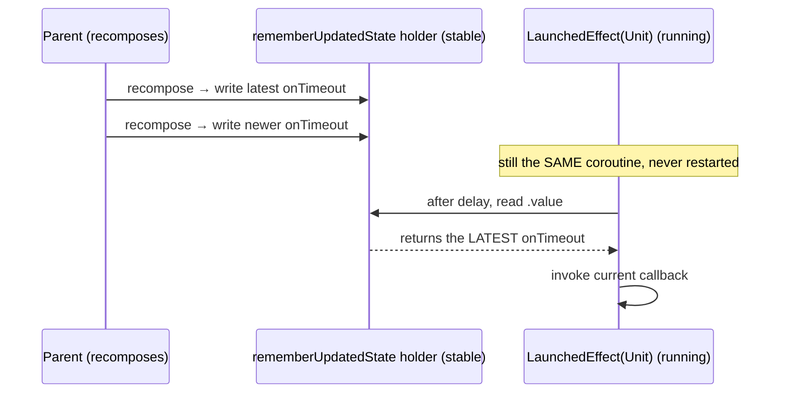
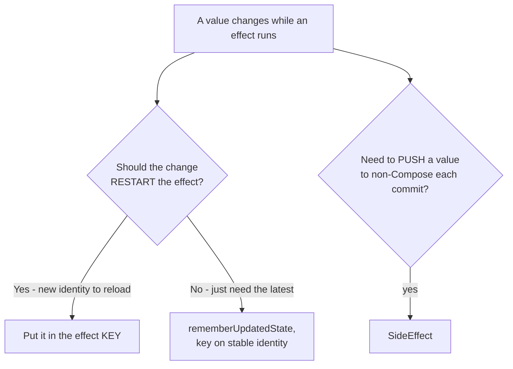

# Lesson 05 — `SideEffect` & `rememberUpdatedState`

> After this lesson you can publish Compose state to non-Compose code after every successful composition with `SideEffect`, and capture the latest value of a changing parameter inside a long-running effect **without** restarting it, using `rememberUpdatedState`.

**Module:** 06 · **Lesson:** 05 · **Level:** 🟢🟡🔴 · **Est. time:** 70–85 min

---

## 1. Concept

These two APIs are small, frequently confused, and solve opposite-feeling problems. We treat them together because they're the two "glue" effects: one **pushes** Compose values *out*, the other **pulls** the latest value *into* a running effect.

### 🟢 For beginners — *what is it and why do I care?*

**`SideEffect`** runs a block **after every successful recomposition**. Use it when some **non-Compose object** needs to be told about your current Compose state — every time that state settles.

```kotlin
SideEffect {
    analytics.setCurrentScreen(screenName)   // keep an external object in sync with Compose
}
```

Think: *"after Compose finishes drawing the new state, tell the outside world what that state is."*

**`rememberUpdatedState`** solves a sneaky timing problem. Imagine a `LaunchedEffect` that runs for 10 seconds and, at the end, calls a callback `onTimeout`. If the parent passes a **new** `onTimeout` halfway through, your effect is still holding the *old* one (closures capture the value at launch). You don't want to **restart** the 10-second timer just to pick up the new callback. `rememberUpdatedState` lets the effect always see the **latest** value while never restarting:

```kotlin
val latestOnTimeout by rememberUpdatedState(onTimeout)
LaunchedEffect(Unit) {            // never restarts
    delay(10_000)
    latestOnTimeout()             // calls the CURRENT onTimeout, not the one captured at launch
}
```

### 🟡 For intermediate devs — *the mechanism*

**`SideEffect`** is the simplest effect: it has **no keys** and runs its block **on every composition that successfully commits**. It does **not** run for compositions that are abandoned. Use it to publish state to objects that live outside Compose and aren't snapshot-aware:

- updating a non-Compose controller (`window.statusBarColor`, an analytics screen name, a third-party SDK's "current context"),
- syncing a value into a plain object every time the UI settles.

It is **not** for one-time work (use `LaunchedEffect(Unit)`), and **not** for coroutines (it's synchronous, no suspend). If it runs too often for your taste, that's a signal you want a *keyed* effect instead.

**`rememberUpdatedState(value)`** returns a `State<T>` that is **re-assigned to the newest `value` on every recomposition** but keeps the **same `State` object identity**. The trick: a long-lived effect (`LaunchedEffect(Unit)`, `DisposableEffect`) closes over the stable `State` holder, and reads `.value` to get whatever the latest value is — *without* having that value as a key (which would restart the effect).

```kotlin
@Composable
fun OnLifecycleResume(onResume: () -> Unit) {
    val current by rememberUpdatedState(onResume)          // always the latest onResume
    val owner = LocalLifecycleOwner.current
    DisposableEffect(owner) {                               // keyed on owner, NOT on onResume
        val obs = LifecycleEventObserver { _, e ->
            if (e == Lifecycle.Event.ON_RESUME) current()   // calls the freshest callback
        }
        owner.lifecycle.addObserver(obs)
        onDispose { owner.lifecycle.removeObserver(obs) }
    }
}
```

The pattern is always: **key the effect on stable identity; read changing values through `rememberUpdatedState`.**

### 🔴 For senior devs — *trade-offs, edges, internals*

- **`SideEffect` runs in the apply phase, after the composition is committed.** It's effectively "publish committed state to the world." Because it runs on *every* commit, putting expensive work there is a performance trap — it fires as often as the composable recomposes. If the publish should only happen when a value changes, gate it yourself or use a keyed `DisposableEffect`/`LaunchedEffect`. `SideEffect` deliberately has no keys precisely because its contract is "every commit."
- **`SideEffect` vs `LaunchedEffect(value) { }` for publishing.** `SideEffect` is synchronous and unkeyed — good for "set this property to the current value now." `LaunchedEffect(value)` is keyed and coroutine-based — good for "when this value changes, do suspend work." Don't use `SideEffect` to launch coroutines (it can't suspend) and don't use `LaunchedEffect` for a trivial synchronous setter that must reflect *every* commit.
- **Why closures go stale (the core of `rememberUpdatedState`).** A `LaunchedEffect(Unit)` captures its lambda parameters **by value at launch time**. On recomposition the composable re-executes and creates *new* lambda instances, but the still-running coroutine holds the originals. Keying the effect on the lambda would fix staleness but **restart** the work (Lesson 02). `rememberUpdatedState` decouples "latest value" from "restart trigger": the value updates in place; the effect's keys stay stable.
- **`rememberUpdatedState` does not make a value snapshot-observable in a useful new way** — it *writes* the new value into a `MutableState` on each recomposition. Reading it **inside a coroutine** simply yields the most recent write at read time; it does **not** suspend or re-trigger on change. If you need to *react* to changes, that's `snapshotFlow` (Lesson 08), not `rememberUpdatedState`.
- **Subtle correctness with multiple captured callbacks.** If an effect captures several frequently-changing lambdas, wrap each in its own `rememberUpdatedState` (or bundle them in a remembered holder). Mixing "keyed" and "updated-state" captures in the same effect is where stale-vs-restart bugs hide.
- **Don't overuse `rememberUpdatedState`.** If a value *should* restart the effect (e.g. a different `userId`), keying on it is correct — wrapping it in `rememberUpdatedState` would make the effect silently use the new id without re-running the load, a real bug. The decision tree: *should a change restart the effect?* Yes → key. No, but the effect must see the latest → `rememberUpdatedState`.

### Analogy

**`SideEffect`** is a **scoreboard operator**: every time a play finishes (each commit), they update the external scoreboard to match the official score (Compose state). They don't change the game; they reflect it outward, every time.

**`rememberUpdatedState`** is a **live phone line into a long mission**. An astronaut (the running effect) launched hours ago with a mission plan. You don't recall and re-launch the rocket every time mission control updates a detail — you just call them on the always-open line and they read the *latest* instruction. The rocket keeps flying (no restart); the instruction is always current.

### Mental model

> **`SideEffect`: "after every commit, push current state to the outside world." `rememberUpdatedState`: "let a long-running effect read the latest value through a stable phone line, without hanging up and redialing (restarting)."**

### Real-world example

`SideEffect` keeps a **non-Compose analytics SDK** told of the current screen, or sets a **legacy View controller's** property from Compose state each commit. `rememberUpdatedState` powers any **timer/observer with a callback that can change**: a `LaunchedEffect` countdown that fires the *current* `onFinished`, a lifecycle observer that calls the *latest* `onResume`, a long poll that reports to the *freshest* `onUpdate`.

---

## 2. Visual Learning

**ASCII — push out vs. pull latest:**
```text
   SideEffect (push OUT, every commit)         rememberUpdatedState (pull LATEST in)
   ──────────────────────────────────          ─────────────────────────────────────
   composition commits                          recompose → newValue written to State
        │                                              │ (same State object identity)
        ▼ runs block synchronously                     ▼
   externalObject.set(currentState)            long effect reads state.value when needed
        │ (every commit)                              │ (effect NEVER restarts)
   ───────────────────────────────             ─────────────────────────────────────
   for non-Compose consumers                    for stale-closure avoidance
```

**Mermaid — `rememberUpdatedState` keeps the line open:**


**Mermaid — key vs. updated-state decision:**


**Illustration prompt (paste into an image generator):**
```text
Illustration, split panel. LEFT: a scoreboard operator labeled "SideEffect" updating a giant
external scoreboard to match a glowing "Compose state" panel after every whistle (commit),
arrows pointing OUTWARD. RIGHT: a rocket labeled "LaunchedEffect (running)" high in the sky,
connected by a glowing always-open phone line to a mission control desk labeled
"rememberUpdatedState" that keeps swapping the latest instruction card; the rocket never turns
back. Caption left: "Publish out, every commit." Caption right: "Latest value, no relaunch."
Modern, vibrant, clear labels, soft gradients.
```

---

## 3. Code

### 🟢 Beginner — `SideEffect` to sync a non-Compose object

```kotlin
@Composable
fun ScreenWithAnalytics(screenName: String, analytics: AnalyticsClient) {
    // After every successful composition, tell the (non-Compose) analytics SDK our screen.
    SideEffect {
        analytics.setCurrentScreen(screenName)
    }
    // … rest of the screen (pure description) …
    Text(screenName, style = MaterialTheme.typography.titleLarge)
}
```

**Explanation.** `analytics` is a plain object that isn't snapshot-aware, so it can't "observe" `screenName`. `SideEffect` pushes the current value to it after each commit, keeping the SDK in sync with what's actually on screen.

**Common mistakes.**
```kotlin
// ❌ Calling the SDK directly in the body: runs during composition (may be discarded),
//    possibly off the expected phase, and for abandoned compositions too.
@Composable
fun ScreenWithAnalytics(screenName: String, analytics: AnalyticsClient) {
    analytics.setCurrentScreen(screenName)   // wrong phase; runs even if composition is abandoned
    Text(screenName)
}
```
Direct calls in the body run in the composition phase and even for compositions that never commit. `SideEffect` runs only after a **successful** commit.

**Best practices.**
- Use `SideEffect` to publish committed Compose state to non-Compose, snapshot-unaware objects.
- Keep the block a cheap setter; it runs on **every** commit.

---

### 🟡 Intermediate — `rememberUpdatedState` for a changing callback

```kotlin
@Composable
fun AutoDismiss(
    visibleFor: Duration = 4.seconds,
    onDismiss: () -> Unit,           // parent may pass a new lambda on each recomposition
) {
    val currentOnDismiss by rememberUpdatedState(onDismiss)   // stable holder, latest value

    LaunchedEffect(Unit) {            // start the timer ONCE — do not restart on new onDismiss
        delay(visibleFor)
        currentOnDismiss()            // fire the freshest callback
    }

    // … the transient UI (snackbar/toast/banner) …
}
```

**Explanation.** The timer must run exactly once; we don't want a new `onDismiss` lambda to reset it. `rememberUpdatedState(onDismiss)` keeps `currentOnDismiss` pointing at the latest lambda while `LaunchedEffect(Unit)` never restarts. At the end of the delay, the *current* callback fires.

**Common mistakes.**
```kotlin
// ❌ Keying on the callback → the timer restarts every time the parent recomposes.
LaunchedEffect(onDismiss) { delay(visibleFor); onDismiss() }   // never reaches the end if parent recomposes often

// ❌ No updated-state and no key → stale callback captured at launch.
LaunchedEffect(Unit) { delay(visibleFor); onDismiss() }        // calls the ORIGINAL onDismiss only
```
Keying restarts the timer (it may never complete); not keying captures a stale lambda. `rememberUpdatedState` is the middle path.

**Best practices.**
- For "run once, but call the latest callback," combine `LaunchedEffect(Unit)` + `rememberUpdatedState`.
- Reserve effect **keys** for values whose change *should* restart the work.

---

### 🔴 Production — both, in a lifecycle-aware repeating observer

```kotlin
/**
 * Polls a status endpoint every [interval] while the screen is RESUMED, reporting each
 * result to the LATEST onStatus without restarting the loop when onStatus changes.
 */
@Composable
fun StatusPoller(
    deviceId: String,
    interval: Duration = 5.seconds,
    repo: StatusRepository,
    onStatus: (DeviceStatus) -> Unit,
) {
    val currentOnStatus by rememberUpdatedState(onStatus)      // latest callback, no restart
    val owner = LocalLifecycleOwner.current

    // Publish the polled device to a non-Compose diagnostics bus on every commit.
    SideEffect { Diagnostics.bus.currentDevice = deviceId }

    // Loop is keyed on deviceId (a NEW device SHOULD restart polling) and the owner;
    // it is NOT keyed on onStatus (that must not restart the loop).
    DisposableEffect(owner, deviceId) {
        val job = owner.lifecycleScope.launch {
            owner.repeatOnLifecycle(Lifecycle.State.RESUMED) {  // poll only while resumed
                while (isActive) {
                    val status = runCatching { repo.fetch(deviceId) }.getOrNull()
                    if (status != null) currentOnStatus(status) // freshest callback
                    delay(interval)
                }
            }
        }
        onDispose { job.cancel() }
    }
}
```

**Explanation.** Three ideas combine. `rememberUpdatedState(onStatus)` ensures each poll reports to the **current** callback even though the loop never restarts for callback changes. The loop **is** keyed on `deviceId` (a different device legitimately restarts polling) and `owner`. `repeatOnLifecycle(RESUMED)` makes it lifecycle-aware (no polling while backgrounded). `SideEffect` publishes the active device to a non-Compose diagnostics bus on every commit. The whole thing tears down via `onDispose`.

**Common mistakes.**
```kotlin
// ❌ Keying the loop on onStatus → polling restarts whenever the parent recomposes,
//    resetting the interval and hammering the endpoint.
DisposableEffect(owner, deviceId, onStatus) { … }

// ❌ Using rememberUpdatedState for deviceId → a new device does NOT restart polling
//    (it keeps polling the old device with a "latest id" read that the loop ignores at the wrong time).
val currentDeviceId by rememberUpdatedState(deviceId)   // wrong: identity change should restart
```
Choose per value: **callback → updated-state** (no restart); **identity that defines the work → key** (restart). Swapping them is the classic bug.

**Best practices.**
- In one effect, key on identities that should restart it; read change-but-don't-restart values via `rememberUpdatedState`.
- Make repeating observers **lifecycle-aware** (`repeatOnLifecycle`) so they pause when not visible.
- Use `SideEffect` only for cheap, every-commit publishing to non-Compose consumers.

---

## 4. Interview Questions

**🟢 Beginner**

1. *What does `SideEffect` do and when do you use it?*
   > It runs a block after every successful composition (commit). Use it to publish current Compose state to a non-Compose, snapshot-unaware object — e.g. telling an analytics SDK the current screen.
2. *In one sentence, what problem does `rememberUpdatedState` solve?*
   > It lets a long-running effect read the **latest** value of a parameter/callback without restarting the effect, avoiding the stale-closure capture you'd otherwise get.

**🟡 Intermediate**

3. *Why does a `LaunchedEffect(Unit)` capture a stale callback, and how does `rememberUpdatedState` fix it without keying on the callback?*
   > The coroutine captures the lambda by value at launch; later recompositions create new lambdas the running coroutine doesn't see. `rememberUpdatedState` writes the newest value into a stable `State` each recomposition; the effect reads `.value` to get the current callback, while its keys stay constant so it never restarts.
4. *`SideEffect` vs `LaunchedEffect(value) { }` — when each?*
   > `SideEffect` is synchronous, unkeyed, and runs on every commit — for "set this external property to the current value now." `LaunchedEffect(value)` is coroutine-based and keyed — for "when `value` changes, run suspend work." Use the right tool for sync-publish vs. keyed-async.

**🔴 Senior**

5. *When is using `rememberUpdatedState` actually the wrong choice?*
   > When a value's change *should* restart the effect (e.g. a different `userId` that needs a fresh load). Wrapping it in `rememberUpdatedState` makes the effect silently use the new value without re-running, producing stale work. Such values belong in the effect **key**.
6. *Does reading a `rememberUpdatedState` value inside a coroutine let you react to its changes?*
   > No. It yields the most recent write at read time but doesn't suspend or re-trigger on change. To *react* to Compose state changes inside a coroutine, use `snapshotFlow` (Lesson 08), which emits on change.
7. *Why can't `SideEffect` be used to launch coroutines or do one-time work, and what are the alternatives?*
   > `SideEffect` is synchronous (no suspend) and runs on **every** commit, so it's neither a coroutine host nor "once." Use `LaunchedEffect`/`rememberCoroutineScope` for coroutines and `LaunchedEffect(Unit)` for one-time work.

---

## 5. AI Assistant

**Prompt example (avoiding stale callbacks):**
```text
I have a Compose composable AutoDismiss(onDismiss) that should wait 4 seconds and then call
onDismiss. The parent recomposes often and passes a new onDismiss lambda each time. Write it so
the timer runs ONCE (never restarts) but always calls the LATEST onDismiss, using
rememberUpdatedState + LaunchedEffect(Unit). Then add a SideEffect that reports the current
screen name to a non-Compose analytics client. Target: Compose 2026 BOM, Kotlin 2.x.
```

**AI workflow — where it helps on *this* topic.**
- ✅ Good for: the `rememberUpdatedState` + `LaunchedEffect(Unit)` pattern, simple `SideEffect` setters, lifecycle observer scaffolds.
- ⚠️ Watch: models often **key on the callback** (restart bug) or **omit `rememberUpdatedState`** (stale callback); misuse `SideEffect` for one-time work or coroutines; and wrap *identity* values in `rememberUpdatedState` that should be keys.

**Review workflow — map to this lesson's *Common Mistakes*:**
- For a long effect calling a changing callback: is the callback read via `rememberUpdatedState` and **not** in the key?
- For values that should restart the effect (ids): are they **keys**, not updated-state?
- Is `SideEffect` used only for cheap, every-commit publishing — not for one-time work or coroutines?
- Are repeating observers **lifecycle-aware** rather than polling while backgrounded?

**Validation workflow — prove it actually works:**
1. **Compile & run.** Confirm the one-shot effect (timer) reaches its end exactly once even while the parent recomposes (add a temporary launch counter).
2. **Swap the callback** mid-flight (change parent state that produces a new lambda) and confirm the **latest** callback fires — not the original (log an id inside each lambda).
3. **Change an identity key** (e.g. `deviceId`) and confirm the effect **does** restart.
4. For `SideEffect`, recompose repeatedly and confirm the external object reflects the **current** value each commit; ensure it isn't doing expensive work.

> **AI drafts, you decide.** The key-vs-updated-state choice is a correctness decision. If the model keys on a callback or wraps an id in `rememberUpdatedState`, fix it — those are exactly the bugs this lesson exists to prevent.

---

## Recap / Key takeaways

- **`SideEffect`** runs after **every successful commit** — publish committed Compose state to non-Compose, snapshot-unaware objects; it's synchronous and unkeyed.
- **`rememberUpdatedState`** gives a long-running effect the **latest** value through a stable holder, **without restarting** it.
- The decision: *should a change restart the effect?* **Yes → key it. No, but needs latest → `rememberUpdatedState`.**
- `rememberUpdatedState` does **not** let you *react* to changes inside a coroutine — that's `snapshotFlow` (Lesson 08).
- Don't use `SideEffect` for one-time work or coroutines (use `LaunchedEffect`/`rememberCoroutineScope`).

➡️ Next: **[Lesson 06 — `produceState`](06-producestate.md)** — turning callbacks, Flows, and other async sources into a Compose `State` your UI can read directly.
