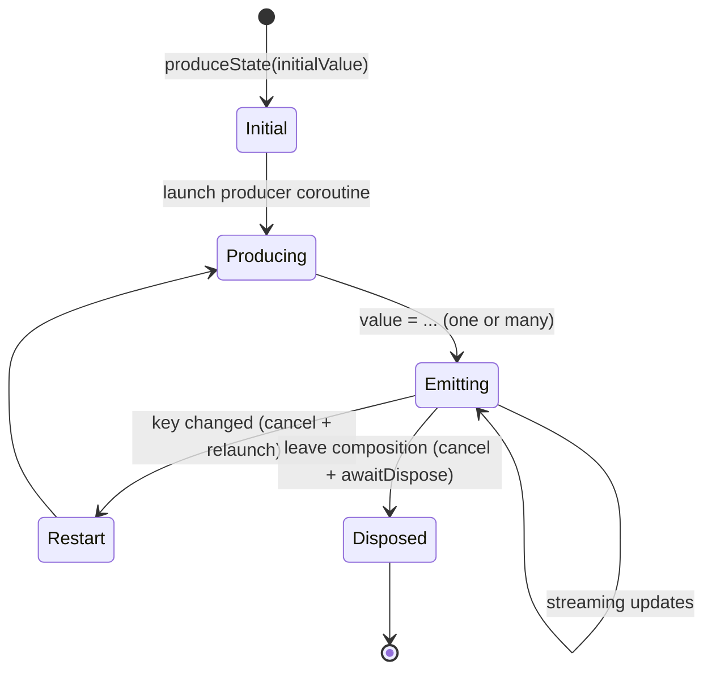
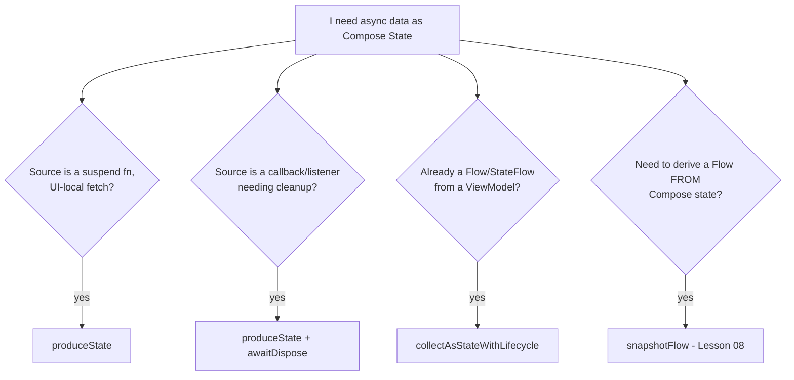

# Lesson 06 — `produceState`

> After this lesson you can turn any asynchronous source — a suspend call, a Flow, a callback API — into a Compose `State<T>` your UI reads directly, with loading/error handling and automatic cleanup.

**Module:** 06 · **Lesson:** 06 · **Level:** 🟢🟡🔴 · **Est. time:** 70–85 min

---

## 1. Concept

### 🟢 For beginners — *what is it and why do I care?*

You often have data that arrives **later** — from the network, a database, or a sensor — but your composable needs a value **now** to display. `produceState` bridges that gap: it gives you a `State<T>` immediately (with an initial value), launches a coroutine to fetch the real data, and **pushes the result into that `State`** when it arrives. Compose then recomposes to show it.

```kotlin
@Composable
fun userProfile(userId: String, repo: ProfileRepository): State<Profile?> =
    produceState<Profile?>(initialValue = null, userId) {
        value = repo.loadProfile(userId)   // when the call finishes, the State updates
    }
```

Read it like any other state:

```kotlin
val profile by userProfile(userId, repo)
if (profile == null) LoadingSpinner() else ProfileCard(profile)
```

Think of it as **"`LaunchedEffect` that returns a `State`."** You launch async work *and* get a state holder to write results into — in one call. The coroutine is auto-cancelled when the composable leaves (no leaks), and it restarts if a key changes.

### 🟡 For intermediate devs — *the mechanism*

`produceState(initialValue, vararg keys) { producer }` does three things:

1. **`remember`s a `MutableState`** seeded with `initialValue` and returns it as a read-only `State<T>`.
2. **Launches the `producer` coroutine** (a `ProduceStateScope`) tied to composition — exactly like `LaunchedEffect`. Inside, you set `value = …` to emit.
3. **Restarts** (cancel + relaunch) when any key changes; **cancels** on leave.

Inside the producer you can write `value` as many times as you like — perfect for modeling **loading → success/error** or **streaming** updates:

```kotlin
val ui by produceState<ProfileUi>(ProfileUi.Loading, userId) {
    value = ProfileUi.Loading
    value = runCatching { repo.loadProfile(userId) }
        .fold({ ProfileUi.Ready(it) }, { ProfileUi.Error(it.message) })
}
```

`produceState` also gives an `awaitDispose { }` hook for **callback-based** sources that need cleanup (register in the producer, unregister in `awaitDispose`) — making it a one-stop bridge for suspend, Flow, and listener APIs.

When to use it vs. alternatives:

- **`produceState`** — you want async work *and* a `State`, contained in the composable (no ViewModel).
- **`collectAsStateWithLifecycle`** — you already have a `Flow`/`StateFlow` (usually from a ViewModel); prefer this for app data.
- **`LaunchedEffect` + your own `mutableStateOf`** — equivalent, but more boilerplate; `produceState` is the idiomatic shorthand.

### 🔴 For senior devs — *trade-offs, edges, internals*

- **`produceState` is `LaunchedEffect` + `remember { mutableStateOf(initial) }`, packaged.** Same launch/cancel/restart semantics, same key rules (unstable keys → restart loops), same cancellation discipline (re-throw `CancellationException`). Everything you learned in Lesson 02 about keys applies verbatim.
- **It returns Compose `State`, which is screen-scoped and *not* lifecycle-collection-aware the way `collectAsStateWithLifecycle` is.** A `produceState` collecting a Flow keeps collecting while the composable is in composition even if the app is backgrounded (composition can outlive visibility). For app data you usually want the **lifecycle-aware** collector instead, or wrap the collection in `repeatOnLifecycle` inside the producer. Use `produceState` for **UI-local** async (a screen-specific fetch, an image decode, a one-off computation), not as a substitute for proper Flow plumbing from a ViewModel.
- **`awaitDispose` is the cleanup hook for callbacks.** For a `LocationManager`/SDK listener, register in the producer and `awaitDispose { unregister() }` — the producer *suspends* at `awaitDispose` until cancellation, then runs the cleanup. Forgetting it leaks the listener, exactly like a missing `onDispose` (Lesson 04). If your source is a `Flow`, just `.collect { value = it }`; if it's a callback, use `awaitDispose`.
- **Initial value and stability.** The `initialValue` is what the UI renders for the first frame(s) before the producer emits. Choose a type that makes "not loaded yet" explicit (nullable or a sealed `Loading`) so the UI can't mistake "empty result" for "still loading." The returned `State<T>`'s `T` should be **stable** to keep recomposition skippable.
- **It does not survive configuration changes or process death.** On rotation the composition rebuilds and the producer re-runs (re-fetching). For data that should survive rotation, expose it from a `ViewModel` as a `StateFlow` and collect with `collectAsStateWithLifecycle`. `produceState` is convenient but **screen-ephemeral**.
- **Error handling lives in the producer.** Unlike a `StateFlow` where errors terminate the flow, `produceState`'s producer is your code — model errors as values (`value = Error(...)`), and re-throw `CancellationException`. Don't let an exception escape the producer uncaught (it cancels the producer coroutine and leaves the last value stuck).

### Analogy

A **pizza tracker**. The moment you order, the screen shows a value *now*: "Order received" (the `initialValue`). Behind the scenes the kitchen works (the producer coroutine). As progress happens, the tracker **updates in place** — "Preparing," "Baking," "Out for delivery" — each a new `value`. You never refresh the page; the tracker pushes states to you. If you cancel the order (leave the screen), the kitchen ticket is pulled (coroutine cancelled). `produceState` is that tracker: an immediate placeholder that fills itself in as reality unfolds.

### Mental model

> **`produceState` = "give me a `State` right now, and let a cancellable coroutine fill it in (once or repeatedly) as data arrives." It's `LaunchedEffect` that hands you a state holder.**

### Real-world example

A **weather widget** uses `produceState(Loading, location) { value = fetchWeather(location) }` — instant placeholder, fills in on load, refetches when `location` changes. An **avatar** decodes an image off-thread and emits the bitmap into state. A **device-sensor readout** registers a callback in the producer and `awaitDispose`s it, streaming readings into `State`.

---

## 2. Visual Learning

**ASCII — initial value, then producer fills it:**
```text
   frame 0:  produceState(initial = Loading) ──▶ State = Loading   (UI shows spinner)
                     │ launches producer coroutine
                     ▼
              value = fetch(key)        (suspends…)
                     │ result arrives
                     ▼
   frame N:  State = Ready(data)  ──▶ recomposition ──▶ UI shows data
                     │
   key changes ─▶ cancel producer ─▶ relaunch ─▶ State = Loading → …
   leave screen ─▶ cancel producer ─▶ (awaitDispose cleanup if any)
```

**Mermaid — producer lifecycle:**


**Mermaid — which async-to-State tool?**


**Illustration prompt (paste into an image generator):**
```text
Illustration: a food-delivery tracker on a glowing phone screen. A progress bar shows stages
"Received → Preparing → Baking → Delivered", with the current stage lit. Behind the phone, a
small kitchen labeled "producer coroutine" works the order. A thin pipe pushes each new status
INTO the phone's status field labeled "Compose State". A cancel button at the side, when pressed
(labeled "leave screen"), pulls the kitchen ticket. Caption: "Immediate placeholder, fills itself
in." Modern, vibrant, clear labels, soft gradients.
```

---

## 3. Code

### 🟢 Beginner — one suspend fetch into State

```kotlin
@Composable
fun WeatherLabel(city: String, repo: WeatherRepository) {
    val tempC by produceState<Int?>(initialValue = null, city) {
        value = repo.currentTempC(city)        // fills in when the call returns
    }

    Text(
        text = tempC?.let { "$it°C in $city" } ?: "Loading $city…",
        style = MaterialTheme.typography.titleMedium,
    )
}
```

**Explanation.** `produceState(null, city)` returns a `State<Int?>` immediately as `null` (UI shows "Loading"). The producer fetches the temperature and assigns `value`, triggering recomposition. Changing `city` cancels the old fetch and starts a new one.

**Common mistakes.**
```kotlin
// ❌ Constant key when data depends on `city` → never refetches when city changes.
val tempC by produceState<Int?>(null) { value = repo.currentTempC(city) }

// ❌ Using a non-nullable initial that looks like real data → UI can't tell "loading" from "0°C".
val tempC by produceState(0, city) { value = repo.currentTempC(city) }   // 0 is ambiguous
```
A constant key freezes the data; an ambiguous initial value hides the loading state.

**Best practices.**
- Key `produceState` on the inputs the fetch depends on (here, `city`).
- Pick an `initialValue` that unambiguously means "not loaded" (nullable or a `Loading` sentinel).

---

### 🟡 Intermediate — model loading/success/error explicitly

```kotlin
sealed interface ArticleUi {
    data object Loading : ArticleUi
    data class Ready(val article: Article) : ArticleUi
    data class Error(val message: String) : ArticleUi
}

@Composable
fun rememberArticleUi(slug: String, repo: ArticleRepository): State<ArticleUi> =
    produceState<ArticleUi>(initialValue = ArticleUi.Loading, slug) {
        value = ArticleUi.Loading                       // reset on (re)start
        value = try {
            ArticleUi.Ready(repo.fetch(slug))
        } catch (e: CancellationException) {
            throw e                                     // never swallow cancellation
        } catch (e: Exception) {
            ArticleUi.Error(e.message ?: "Failed to load")
        }
    }

@Composable
fun ArticleScreen(slug: String, repo: ArticleRepository) {
    val ui by rememberArticleUi(slug, repo)
    when (val s = ui) {
        ArticleUi.Loading  -> CircularProgressIndicator()
        is ArticleUi.Ready -> ArticleContent(s.article)
        is ArticleUi.Error -> ErrorBanner(s.message)
    }
}
```

**Explanation.** The producer emits `Loading` first (so re-runs show a spinner), then `Ready` or `Error`. `CancellationException` is re-thrown so a key change/leave doesn't surface as a fake error. The sealed `ArticleUi` makes the three states mutually exclusive — the UI can't render an impossible combination.

**Common mistakes.**
```kotlin
// ❌ Letting the exception escape the producer → coroutine cancels; State stuck on Loading forever.
produceState<ArticleUi>(ArticleUi.Loading, slug) { value = ArticleUi.Ready(repo.fetch(slug)) }

// ❌ catch (e: Exception) without re-throwing CancellationException → key changes flash an error.
```
An uncaught throw freezes the state on its last value; swallowing cancellation flashes spurious errors.

**Best practices.**
- Emit `Loading` at the top of the producer so restarts visibly reload.
- Catch real errors into an `Error` state but **re-throw `CancellationException`**.
- Use a sealed result type so loading/success/error can't contradict.

---

### 🔴 Production — bridge a callback source with `awaitDispose`

```kotlin
/**
 * Streams the device's location into Compose State. Registers a LocationListener in the
 * producer and unregisters it in awaitDispose — no leaks. Restarts if the request changes.
 */
@Composable
fun rememberLocation(
    request: LocationRequest,
    locationManager: LocationManager,
): State<LocationState> =
    produceState<LocationState>(initialValue = LocationState.Searching, request) {
        // Permission is assumed granted by the caller (checked upstream).
        val listener = LocationListener { loc ->
            value = LocationState.Fix(loc.latitude, loc.longitude, loc.accuracy)
        }

        try {
            locationManager.requestLocationUpdates(
                LocationManager.FUSED_PROVIDER,
                request.intervalMillis,
                request.minMeters,
                listener,
                Looper.getMainLooper(),
            )
        } catch (e: SecurityException) {
            value = LocationState.PermissionDenied
        }

        // Suspend here until the producer is cancelled, then clean up (like onDispose).
        awaitDispose {
            locationManager.removeUpdates(listener)
        }
    }

sealed interface LocationState {
    data object Searching : LocationState
    data object PermissionDenied : LocationState
    data class Fix(val lat: Double, val lng: Double, val accuracyM: Float) : LocationState
}
```

**Explanation.** This bridges a **callback** API into `State`. The producer registers a `LocationListener` that writes each fix into `value`, then **suspends at `awaitDispose`** until cancellation, at which point it removes updates. Keying on `request` restarts (re-registers) when the request parameters change; leaving the screen cancels and cleans up. This is the `produceState` analogue of `DisposableEffect` for streaming sources.

**Common mistakes.**
```kotlin
// ❌ No awaitDispose → the listener is never removed; GPS keeps running into a dead screen (leak + battery).
produceState<LocationState>(LocationState.Searching, request) {
    locationManager.requestLocationUpdates(/* … */, listener, Looper.getMainLooper())
    // producer returns immediately; listener leaks
}

// ❌ Collecting a hot location Flow with produceState while backgrounded (no lifecycle gate)
//    → keeps consuming GPS even when not visible. Wrap in repeatOnLifecycle or use a lifecycle collector.
```
Without `awaitDispose`, the producer returns immediately and the listener leaks. Without a lifecycle gate, streaming sources run while backgrounded.

**Best practices.**
- For callback sources, register in the producer and **always** `awaitDispose { unregister() }`.
- Model permission/searching/fix as a sealed state; handle `SecurityException` as a value.
- For battery-/visibility-sensitive streams, gate with `repeatOnLifecycle` or prefer a lifecycle-aware Flow collector.

---

## 4. Interview Questions

**🟢 Beginner**

1. *What does `produceState` give you that `LaunchedEffect` alone doesn't?*
   > It returns a `State<T>` *and* launches a coroutine to fill it — combining "run async work" with "expose a state holder" in one call. With `LaunchedEffect` you'd manage a separate `mutableStateOf` yourself.
2. *Why pass an `initialValue` to `produceState`?*
   > Because the UI needs a value to render immediately, before the async work completes. The initial value is what's shown for the first frame(s) (e.g. `null`/`Loading`).

**🟡 Intermediate**

3. *How do you model loading → success → error with `produceState`?*
   > Use a sealed result type; in the producer, set `value = Loading` first, then assign `Ready(data)` or `Error(msg)` in a try/catch. Re-throw `CancellationException` so restarts/leaves don't surface as errors.
4. *When should you prefer `collectAsStateWithLifecycle` over `produceState`?*
   > When you already have a `Flow`/`StateFlow` (typically from a ViewModel) carrying app data. `collectAsStateWithLifecycle` is lifecycle-aware (pauses when backgrounded). `produceState` is best for UI-local async owned by the composable.

**🔴 Senior**

5. *You bridge a callback API into `State` with `produceState`. What's the mandatory piece that prevents a leak, and how does it behave?*
   > `awaitDispose { … }`. The producer registers the callback, then **suspends at `awaitDispose`** until the coroutine is cancelled (leave/key change), at which point the cleanup runs to unregister. Omitting it leaks the listener, like a missing `DisposableEffect` `onDispose`.
6. *Does `produceState` survive configuration changes, and what are the implications?*
   > No — on rotation the composition rebuilds and the producer re-runs (re-fetching). For data that must survive rotation/process death, expose it from a `ViewModel` as a `StateFlow` and collect lifecycle-aware. `produceState` is screen-ephemeral.
7. *A `produceState` that collects a hot Flow keeps consuming it while the app is backgrounded. Why, and how do you fix it?*
   > Because `produceState` runs while the composable is in **composition**, which can persist while the app isn't visible — it isn't lifecycle-collection-aware by itself. Gate the collection with `repeatOnLifecycle(STARTED)` inside the producer, or collect via `collectAsStateWithLifecycle` instead.

---

## 5. AI Assistant

**Prompt example (async → State with proper states):**
```text
Write a Compose `produceState` helper that loads an Article by slug from a suspend repo and
exposes State<ArticleUi> where ArticleUi is a sealed Loading/Ready/Error. Emit Loading first,
re-throw CancellationException, and key on slug so changing it reloads. Then add a second helper
that bridges a callback LocationListener into State<LocationState> using awaitDispose to
unregister. Target: Compose 2026 BOM, Kotlin 2.x.
```

**AI workflow — where it helps on *this* topic.**
- ✅ Good for: the `produceState` + sealed-state scaffold, the `awaitDispose` callback bridge, the loading/error flow.
- ⚠️ Watch: models drop `awaitDispose` (leaks), use a constant key when the fetch depends on a param (stale data), let exceptions escape the producer, swallow `CancellationException`, and use `produceState` where `collectAsStateWithLifecycle` is the right tool.

**Review workflow — map to this lesson's *Common Mistakes*:**
- Is the **key** the input the fetch depends on (not `Unit`)?
- Is the **initial value** unambiguously "not loaded" (nullable / `Loading`)?
- For callback sources, is there an **`awaitDispose`** that unregisters?
- Is `CancellationException` **re-thrown**, and do exceptions **not** escape the producer?
- Should this actually be `collectAsStateWithLifecycle` (existing Flow / lifecycle-sensitive)?

**Validation workflow — prove it actually works:**
1. **Compile & run.** Confirm the placeholder shows first, then the real value.
2. **Change the key** (city/slug). Confirm it reloads (shows `Loading` then new data) and the old request is cancelled.
3. **Leave the screen** mid-load and for callback sources confirm `awaitDispose` runs (log in cleanup) and no callback fires afterward.
4. **Background the app** (for streaming sources) and confirm it pauses if you gated with `repeatOnLifecycle`; check the Memory Profiler/LeakCanary for a retained listener.

> **AI drafts, you decide.** A `produceState` without `awaitDispose` for a callback source compiles but leaks. Verify cleanup and keys before trusting the draft.

---

## Recap / Key takeaways

- `produceState` = **`LaunchedEffect` that returns a `State`**: immediate `initialValue`, a cancellable producer that writes `value`, restart on key change.
- Model **loading/success/error** by emitting a sealed state; emit `Loading` first; **re-throw `CancellationException`**.
- For **callback** sources, register in the producer and **`awaitDispose { unregister() }`** to avoid leaks.
- It's **screen-ephemeral** and not lifecycle-collection-aware — for app data from a Flow, prefer `collectAsStateWithLifecycle`.
- Key on the inputs the fetch depends on; choose an **unambiguous initial value**.

➡️ Next: **[Lesson 07 — `derivedStateOf`](07-derivedstateof.md)** — computing state from other state *without* triggering extra recompositions.
