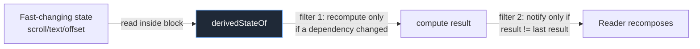

# Lesson 07 — `derivedStateOf`

> After this lesson you can compute a value from other state so that readers only recompose when the *computed result* changes — not every time an input changes — and you know exactly when `derivedStateOf` earns its keep versus when a plain calculation is better.

**Module:** 06 · **Lesson:** 07 · **Level:** 🟢🟡🔴 · **Est. time:** 75–90 min

---

## 1. Concept

### 🟢 For beginners — *what is it and why do I care?*

Sometimes a piece of UI depends not on raw state, but on a **conclusion drawn from it**. Example: a "scroll to top" button that should appear only once you've scrolled past the first item.

The raw state is the scroll position — it changes on **every pixel** of scrolling, dozens of times per second. But the thing you care about is a **boolean**: "are we past item 0, yes or no?" That boolean changes **twice** in a whole scroll (false→true once, true→false once).

If you compute the boolean inline, your composable recomposes on every pixel (because it reads the fast-changing position). `derivedStateOf` fixes this: it computes the boolean from the position but only **notifies readers when the boolean flips**, not when the position twitches.

```kotlin
val showButton by remember {
    derivedStateOf { listState.firstVisibleItemIndex > 0 }
}
```

Now the button's composable recomposes ~twice per scroll instead of hundreds of times. **`derivedStateOf` turns a fast-changing input into a slow-changing result, and only recomposes on the result.**

### 🟡 For intermediate devs — *the mechanism*

`derivedStateOf { … }` creates a `State<T>` whose value is **computed lazily** from other snapshot state reads inside the block. The runtime tracks which states the block read; it **recomputes only when one of those reads changes**, and — crucially — it **only notifies its own readers when the computed result is different** (by the result's `equals`).

So there are two filters:

1. **Dependency tracking** — recompute only when an *input* it actually read changes.
2. **Result equality** — invalidate downstream readers only when the *output* changes.

That second filter is the whole point. It's the difference between "input changed 200 times" and "output changed twice."

You almost always wrap it in `remember` (you want one derived-state instance across recompositions):

```kotlin
val isFormValid by remember {
    derivedStateOf { email.contains("@") && password.length >= 8 }
}
```

The canonical use case: **a frequently-changing state (scroll position, text being typed, a drag offset) feeds a result that changes rarely (a boolean, a bucket, a clamped value).** If the input and output change at the *same* rate, `derivedStateOf` adds overhead for no benefit — a plain calculation is better.

### 🔴 For senior devs — *trade-offs, edges, internals*

- **`derivedStateOf` is a cache with snapshot-aware invalidation.** It memoizes the last computed value and the set of dependencies. On read, if no dependency changed since last compute, it returns the cached value without re-running the block; if a dependency changed, it recomputes and compares the result. This is why it can absorb high-frequency input changes into low-frequency output changes.
- **The decisive question: do input and output change at different frequencies?** Use `derivedStateOf` **only** when the output changes *less often* than the inputs. For `firstVisibleItemIndex > 0` (fast in, rare flip out) it's perfect. For `fullName = "$first $last"` where both inputs and the output change together, it's pure overhead — just compute it (optionally `remember(first, last)` it). Misapplied `derivedStateOf` is a common "cargo-cult" smell in reviews.
- **`derivedStateOf` vs `remember(key)`.** They solve different problems. `remember(key)` recomputes when the **key changes by `equals`** — you must *name* the keys, and it recomputes whenever they change, regardless of whether the result differs. `derivedStateOf` **auto-tracks** dependencies (no key list) and additionally **filters by result equality**. Use `remember(key)` for "recompute this pure value when these explicit inputs change"; use `derivedStateOf` for "observe these (often many/fast) states but only emit when the conclusion changes." For a *list filtered by a query*, `remember(query, list) { list.filter … }` is usually the right tool (the result changes whenever inputs do); `derivedStateOf` would add caching you don't benefit from.
- **It must read *snapshot* state to track dependencies.** Reading a plain `var` or a non-snapshot value inside the block won't be tracked — the derived state won't update when that value changes. Inputs must be `State`/`MutableState`/`StateFlow`-backed snapshot reads.
- **Result equality is your lever (and footgun).** Downstream invalidation uses the result's `equals`. If the result is an **unstable** type with poor equality (e.g. a freshly-allocated list whose contents are equal but identity differs), you may over-notify. Return stable, value-like results. You can also supply a custom `SnapshotMutationPolicy` via the `derivedStateOf(policy) { }` overload when default structural equality isn't what you want.
- **Don't put side effects or heavy work in the block.** It can run during composition/snapshot reads and may run more than you expect; keep it a **pure, cheap** computation. Expensive derivations should be precomputed (e.g. in a ViewModel) or memoized differently.
- **Reading a derived state still subscribes the reader** like any state read (Module 03). The win is *fewer* invalidations, not zero — the reader recomposes exactly when the derived result changes.

### Analogy

A **thermostat with a deadband**. The temperature sensor reports a constantly wiggling number (the fast input). But the furnace only cares about a coarse decision — "too cold: turn on / warm enough: turn off" — and it deliberately ignores tiny fluctuations, acting only when the decision actually flips. `derivedStateOf` is that deadband: it watches a jittery signal and only "fires" when the meaningful conclusion changes, sparing everything downstream from reacting to noise.

### Mental model

> **`derivedStateOf` watches fast-changing state and only wakes its readers when the *conclusion* changes. Use it only when the output changes less often than the inputs — otherwise it's overhead.**

### Real-world example

A **"scroll to top" FAB** appears past item 0 (`derivedStateOf { listState.firstVisibleItemIndex > 0 }`). A **"send" button** enables only when a long message form is valid (many fields in, one boolean out). An **elevation/shadow** on a top app bar toggles when the list is scrolled (`derivedStateOf { listState.firstVisibleItemScrollOffset > 0 }`). A **progress bucket** (`derivedStateOf { (scroll / total * 10).toInt() }`) updates ten times across a long scroll instead of continuously.

---

## 2. Visual Learning

**ASCII — fast input, filtered output:**
```text
   scroll offset (input):   0 1 2 5 9 14 20 27 ... (changes every frame)
                               │
                               ▼  derivedStateOf { offset > 0 }
   derived result (output): false ───────▶ true            (changes ONCE)
                               │
                               ▼  only this transition invalidates readers
   FAB recomposition:       (hidden) ─────▶ (shown)         (recomposes ONCE, not per frame)
```

**Mermaid — the two filters:**


**Mermaid — derivedStateOf vs remember(key):**
```mermaid
graph TD
    A[Compute a value from other state] --> B{Do inputs change MUCH more<br/>often than the output?}
    B -->|Yes - scroll→boolean| C[derivedStateOf<br/>auto-tracks deps + result-equality filter]
    B -->|No - inputs & output change together| D[remember key1, key2 { compute }<br/>or just compute inline]
    A --> E{Filtering a list by a query?}
    E -->|usually| D
```

**Illustration prompt (paste into an image generator):**
```text
Illustration: a thermostat with a clearly drawn "deadband" zone. A jittery temperature line
wiggles rapidly across a graph (labeled "fast input: scroll offset"). A second, much calmer
line below it labeled "derived result" stays flat and only steps up ONCE when the jittery line
crosses a threshold. A furnace icon labeled "Reader (FAB)" switches on exactly at that single
step, ignoring all the wiggles. Caption: "Ignore the noise; react to the decision."
Modern, vibrant, clear labels, soft gradients.
```

---

## 3. Code

### 🟢 Beginner — show a FAB only after scrolling

```kotlin
@Composable
fun ScrollToTopList(items: List<String>) {
    val listState = rememberLazyListState()

    // Recomputes as you scroll, but only flips the boolean once → FAB recomposes ~twice.
    val showFab by remember {
        derivedStateOf { listState.firstVisibleItemIndex > 0 }
    }

    Box {
        LazyColumn(state = listState) {
            items(items) { Text(it, Modifier.padding(16.dp)) }
        }
        if (showFab) {
            FloatingActionButton(onClick = { /* scroll to top */ }, Modifier.align(Alignment.BottomEnd)) {
                Icon(Icons.Filled.KeyboardArrowUp, contentDescription = "Scroll to top")
            }
        }
    }
}
```

**Explanation.** `listState.firstVisibleItemIndex` changes constantly while scrolling. Wrapping the comparison in `derivedStateOf` means the surrounding scope only recomposes when the boolean *changes* — when you cross item 0 — not on every scroll frame.

**Common mistakes.**
```kotlin
// ❌ Reading the fast state directly → recomposes on EVERY scroll frame.
@Composable
fun ScrollToTopList(items: List<String>) {
    val listState = rememberLazyListState()
    val showFab = listState.firstVisibleItemIndex > 0   // direct read of a fast-changing state
    /* ... recomposes continuously while scrolling ... */
}
```
Reading `firstVisibleItemIndex` directly subscribes the composable to a value that changes every frame — janky, wasteful recomposition.

**Best practices.**
- When a value derives from **fast-changing** state but yields a **rarely-changing** result, wrap it in `remember { derivedStateOf { … } }`.
- Always `remember` the `derivedStateOf` so it's one instance across recompositions.

---

### 🟡 Intermediate — form validity from many fields

```kotlin
@Composable
fun SignUpForm() {
    var email by remember { mutableStateOf("") }
    var password by remember { mutableStateOf("") }
    var accepted by remember { mutableStateOf(false) }

    // Many fast-ish inputs (keystrokes) → one boolean. Submit recomposes only when validity flips.
    val canSubmit by remember {
        derivedStateOf {
            email.contains("@") && password.length >= 8 && accepted
        }
    }

    Column {
        OutlinedTextField(email, { email = it }, label = { Text("Email") })
        OutlinedTextField(password, { password = it }, label = { Text("Password") })
        Row { Checkbox(accepted, { accepted = it }); Text("I accept the terms") }
        Button(enabled = canSubmit, onClick = { /* submit */ }) { Text("Create account") }
    }
}
```

**Explanation.** Each keystroke updates `email`/`password`, but `canSubmit` only flips a couple of times (when the form crosses the validity threshold). The `Button` reads `canSubmit`, so it recomposes only on those flips — not on every character.

**Common mistakes.**
```kotlin
// ❌ derivedStateOf where input and output change together → no benefit, just overhead.
val greeting by remember { derivedStateOf { "Hello, $name" } }   // changes exactly when name changes
// ✅ Prefer: val greeting = "Hello, $name"  (or remember(name) { ... } if construction is costly)
```
If the derived result changes every time an input changes, `derivedStateOf` adds caching machinery with nothing to cache. Compute it directly.

**Best practices.**
- Use `derivedStateOf` when **many/fast inputs collapse to a rarely-changing output** (here, multiple fields → one boolean).
- Don't use it for 1:1 transformations; use a plain expression or `remember(key)`.

---

### 🔴 Production — derived UI state, correct tool selection, stable result

```kotlin
@Composable
fun ChatScreen(messages: List<Message>, listState: LazyListState = rememberLazyListState()) {
    // 1) derivedStateOf: fast scroll position → rare boolean. Good fit.
    val atBottom by remember {
        derivedStateOf {
            val layout = listState.layoutInfo
            val last = layout.visibleItemsInfo.lastOrNull()?.index ?: 0
            last >= messages.lastIndex && messages.isNotEmpty()
        }
    }

    // 2) remember(key): result changes whenever inputs change → NOT a derivedStateOf case.
    val unreadCount = remember(messages) { messages.count { !it.read } }

    Box {
        LazyColumn(state = listState) {
            items(messages, key = { it.id }) { MessageRow(it) }
        }
        // "Jump to latest" appears only when NOT at the bottom (flips rarely).
        if (!atBottom) {
            JumpToLatestChip(unread = unreadCount, modifier = Modifier.align(Alignment.BottomCenter))
        }
    }
}
```

**Explanation.** Two derived values, two **different** tools — and choosing correctly is the senior skill. `atBottom` depends on the **fast** scroll/layout info but yields a **rare** boolean → `derivedStateOf`. `unreadCount` changes **exactly when** `messages` changes → `remember(messages)`, *not* `derivedStateOf` (there's nothing to filter). Mixing these up either wastes cycles or fails to skip recompositions. The derived boolean returns a stable `Boolean`, so result-equality filtering works cleanly.

**Common mistakes.**
```kotlin
// ❌ derivedStateOf for unreadCount: it changes 1:1 with `messages`, so the filter never helps —
//    pure overhead, and it re-runs the count inside snapshot machinery unnecessarily.
val unreadCount by remember { derivedStateOf { messages.count { !it.read } } }

// ❌ Forgetting remember → a new derivedStateOf each recomposition loses its cache/dependencies.
val atBottom by derivedStateOf { /* ... */ }   // re-created every recomposition
```
Using `derivedStateOf` for a 1:1 value is overhead; forgetting `remember` discards the cache every recomposition (defeating the purpose).

**Best practices.**
- Reach for `derivedStateOf` **only** when output frequency < input frequency; otherwise `remember(key)` or inline.
- Always `remember` the derived state; keep the block **pure and cheap**.
- Return **stable** results so downstream result-equality filtering is reliable.

---

## 4. Interview Questions

**🟢 Beginner**

1. *What does `derivedStateOf` do?*
   > It computes a value from other snapshot state and only notifies its readers when the **computed result** changes — not every time an input changes. This avoids recomposing on every tick of a fast-changing input.
2. *Give a classic use case.*
   > A "scroll to top" button shown when `listState.firstVisibleItemIndex > 0`: the scroll position changes constantly, but the boolean flips rarely, so the button recomposes only on the flip.

**🟡 Intermediate**

3. *Why do you almost always wrap `derivedStateOf` in `remember`?*
   > So there's a single derived-state instance (with its cache and tracked dependencies) across recompositions. Without `remember`, a new one is created each recomposition, discarding the cache and defeating the optimization.
4. *When is `derivedStateOf` the wrong tool?*
   > When the output changes at the same rate as the inputs (e.g. `"$first $last"`, or counting a list each time it changes). There's nothing to filter, so it's pure overhead — compute inline or use `remember(key)`.

**🔴 Senior**

5. *Explain the two filters `derivedStateOf` applies and why the second one is the point.*
   > First, dependency tracking: it recomputes only when a snapshot state it actually read changes. Second, result equality: it invalidates downstream readers only when the computed result differs by `equals`. The second filter is what collapses many input changes into few output changes — the entire performance benefit.
6. *`derivedStateOf` vs `remember(key1, key2)` — how do you choose?*
   > `remember(key)` recomputes when explicitly-named keys change (you list them) and always propagates the new value. `derivedStateOf` auto-tracks dependencies and additionally suppresses propagation unless the result changes. Use `remember(key)` for a pure value tied to explicit inputs that change at the result's rate (e.g. filtering a list by a query); use `derivedStateOf` when fast/many inputs collapse to a rarely-changing result.
7. *What happens if the `derivedStateOf` block reads a non-snapshot value, or returns an unstable result?*
   > Reading a non-snapshot value (plain `var`) isn't tracked, so the derived state won't update when it changes — a correctness bug. Returning an unstable result with poor `equals` (e.g. a new list each compute) defeats result-equality filtering and can over-notify; return stable, value-like results or supply a custom `SnapshotMutationPolicy`.

---

## 5. AI Assistant

**Prompt example (correct tool selection):**
```text
In this Compose screen I show a "scroll to top" FAB when scrolled past the first item and an
unread count derived from a messages list. For EACH derived value, choose between derivedStateOf
and remember(key) and justify it by comparing input vs output change frequency. Wrap
derivedStateOf in remember and keep blocks pure. Target: Compose 2026 BOM, Kotlin 2.x.
[paste code]
```

**AI workflow — where it helps on *this* topic.**
- ✅ Good for: writing the `derivedStateOf { listState.firstVisibleItemIndex > 0 }` pattern, form-validity booleans, scroll-driven UI toggles.
- ⚠️ Watch: models **over-apply** `derivedStateOf` to 1:1 values (overhead), **forget `remember`**, read non-snapshot values inside the block, and confuse it with `remember(key)` for list filtering.

**Review workflow — map to this lesson's *Common Mistakes*:**
- Does the output change **less often** than the inputs? If not, should it be `remember(key)`/inline?
- Is the `derivedStateOf` wrapped in `remember`?
- Does the block read **snapshot** state only (no plain `var`)?
- Is the result **stable** with sensible equality?

**Validation workflow — prove it actually works:**
1. **Compile & run.** Scroll/type and confirm the UI updates at the right moments.
2. **Layout Inspector → recomposition counts.** Confirm the reader recomposes only when the *result* changes (e.g. FAB ~2 counts per scroll), not per frame. Compare against the direct-read version to *see* the difference.
3. **Remove `remember`** temporarily and observe the count climb — proof the cache matters.
4. For a misapplied case, swap `derivedStateOf` for `remember(key)` and confirm identical behavior with less machinery.

> **AI drafts, you decide.** `derivedStateOf` is correct *only* when output frequency < input frequency. If the model sprinkles it on 1:1 values, replace it — measure recomposition counts to settle the argument.

---

## Recap / Key takeaways

- `derivedStateOf` computes from other snapshot state and **notifies readers only when the result changes** — collapsing fast inputs into a rarely-changing output.
- It applies **two filters**: recompute on dependency change, propagate on **result** change. The second filter is the whole benefit.
- Use it **only when output changes less often than inputs** (scroll→boolean); for 1:1 values use `remember(key)` or inline.
- Always **`remember`** it; keep the block **pure and cheap**; read **snapshot** state; return **stable** results.
- It's distinct from `remember(key)`: auto-tracked dependencies + result-equality vs. explicit keys that always propagate.

➡️ Next: **[Lesson 08 — `snapshotFlow`](08-snapshotflow.md)** — going the other direction: observing Compose state *as a Flow* so you can debounce, distinct, and combine it with coroutine operators.
