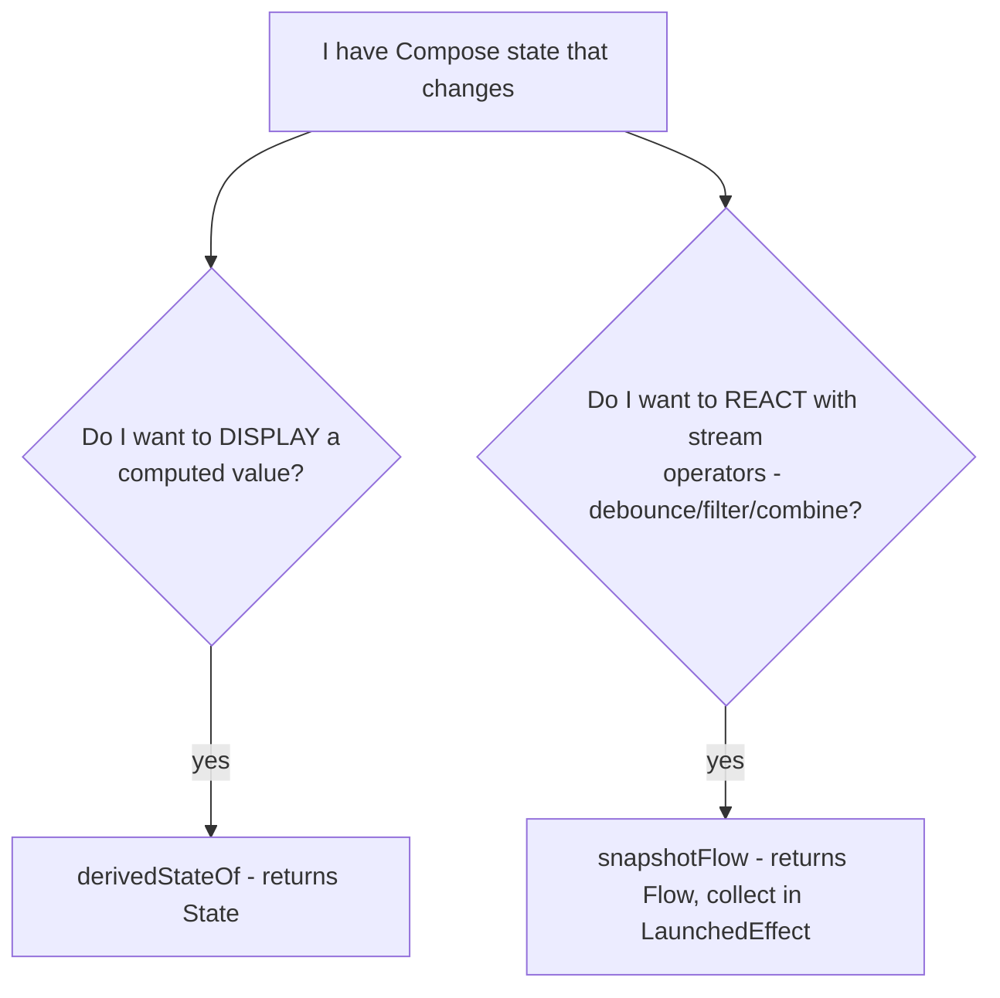

# Lesson 08 — `snapshotFlow`

> After this lesson you can observe Compose state *as a cold `Flow`*, so you can apply coroutine operators — `debounce`, `distinctUntilChanged`, `filter`, `combine` — to UI state and react to its changes off the recomposition path.

**Module:** 06 · **Lesson:** 08 · **Level:** 🟢🟡🔴 · **Est. time:** 75–90 min

---

## 1. Concept

### 🟢 For beginners — *what is it and why do I care?*

Compose state and Kotlin Flows are two ways of representing "a value that changes over time." `snapshotFlow` is the **bridge from Compose state → Flow**. (Lesson 06's `produceState` and `collectAsStateWithLifecycle` go the other way, Flow → state.)

Why would you want a Flow of Compose state? Because Flows have **powerful operators** that recomposition doesn't:

- **`debounce`** — wait until the user stops typing before searching.
- **`distinctUntilChanged`** — ignore repeats.
- **`filter`** — react only when a condition holds.
- **`combine`** — merge several changing values into one stream.

Classic example — a search box that fires a query only after the user pauses:

```kotlin
LaunchedEffect(Unit) {
    snapshotFlow { query }                  // observe the Compose `query` state as a Flow
        .debounce(300.milliseconds)         // wait for a pause
        .distinctUntilChanged()             // skip duplicates
        .collect { q -> viewModel.search(q) }
}
```

`snapshotFlow { query }` emits a new value **every time `query` changes**, and now you can pipe it through coroutine operators. That's the whole idea: **read Compose state inside `snapshotFlow { … }`, get a Flow you can transform.**

### 🟡 For intermediate devs — *the mechanism*

`snapshotFlow { block }` returns a **cold `Flow`** that:

1. Runs `block`, recording which **snapshot state** it read (just like `derivedStateOf`).
2. **Emits the block's result** to the collector.
3. Re-runs `block` whenever any state it read changes, emitting the new result — but only if it **differs from the previous emission** (it has built-in `distinctUntilChanged`-like behavior on the produced value).

It's *cold*: nothing happens until you `collect` it, and collection must run inside a coroutine — almost always a `LaunchedEffect` (so it's tied to composition lifecycle) or a `rememberCoroutineScope` launch.

```kotlin
val listState = rememberLazyListState()
LaunchedEffect(listState) {
    snapshotFlow { listState.firstVisibleItemIndex }
        .filter { it >= 10 }
        .collect { analytics.log("reached_item_10") }
}
```

Use it when you need to **react** to Compose-state changes with **stream semantics** (debounce/throttle/combine/buffer), or to **observe** something (scroll position, selection) and trigger side effects. If you only need to *display* a derived value, that's `derivedStateOf` (Lesson 07), not `snapshotFlow`.

### 🔴 For senior devs — *trade-offs, edges, internals*

- **`snapshotFlow` reads the snapshot system, so dependency tracking is identical to `derivedStateOf`.** It tracks states read in the block and re-evaluates on their change. The difference is the *output*: `derivedStateOf` produces a `State` (for **reading/displaying** with result-equality skipping); `snapshotFlow` produces a `Flow` (for **reacting** with operators). Choosing between them: *do I want to show a value (State) or run logic on change (Flow)?*
- **It conflates emissions.** `snapshotFlow` evaluates the block when the snapshot is **applied** and emits only when the produced value changed. Multiple state writes within one frame collapse into (at most) one emission. This is desirable (you react per settled value, not per intermediate write) but means you can't observe every transient write — only committed, distinct values.
- **Collection must be lifecycle-correct.** Collecting in `LaunchedEffect(Unit)` ties it to composition, **not** to STARTED/RESUMED. For work that should pause when backgrounded (analytics, network), wrap the collection in `repeatOnLifecycle(STARTED)` or collect via a lifecycle-aware mechanism — otherwise you keep reacting while the app isn't visible. This is the same caveat as Lesson 06.
- **Key the `LaunchedEffect` correctly.** If the `snapshotFlow` block reads a captured parameter (not just a remembered state), changing that parameter requires restarting collection — key the `LaunchedEffect` on it, or read the latest via `rememberUpdatedState` (Lesson 05) depending on whether a change should restart the pipeline. Typically you key on the **owner** (e.g. `listState`) and read remembered states inside.
- **Cold and per-collector.** Each `collect` re-runs the block from scratch and maintains its own state tracking. Don't collect the same `snapshotFlow` in multiple places expecting sharing; if you need fan-out, `shareIn`/`stateIn` it in a scope.
- **It's the idiomatic input side of "Compose state → business logic."** The debounced-search pattern (this module's project) is the canonical case: the UI owns the `query` as Compose state (great for the TextField), and `snapshotFlow` + `debounce` feeds it into the search pipeline without the ViewModel needing to know about Compose. Alternatively, hoist `query` into a `MutableStateFlow` in the ViewModel — both are valid; `snapshotFlow` keeps the text state local to the UI.
- **Don't use it to mirror a value you could pass directly.** If a `ViewModel` already exposes a `StateFlow`, don't round-trip it through Compose state and back via `snapshotFlow` — collect the `StateFlow` directly. `snapshotFlow` is for state that genuinely *originates* in Compose (scroll, focus, text, drag, selection).

### Analogy

A **stenographer at a live event**. The event (Compose state) unfolds continuously, but the stenographer (`snapshotFlow`) produces a clean, **timestamped transcript stream** you can process later: highlight only the important lines (`filter`), ignore immediate repeats (`distinctUntilChanged`), wait for a natural pause before summarizing (`debounce`). The event doesn't change because it's being transcribed — the transcript is just a **Flow view** of it that downstream tools can manipulate.

### Mental model

> **`snapshotFlow { state }` turns Compose state into a cold Flow you collect in a coroutine — so you can `debounce`/`filter`/`combine` UI changes. Use it to *react* to Compose state; use `derivedStateOf` to *display* a value computed from it.**

### Real-world example

A **debounced search** (`snapshotFlow { query }.debounce(...).collect { search(it) }`). **Pagination**: `snapshotFlow { listState.layoutInfo.visibleItemsInfo.lastOrNull()?.index }` to load more near the end. **Analytics**: emit a "scrolled 50%" event once via `filter`. **Autosave**: `snapshotFlow { draft }.debounce(2.seconds).collect { repo.save(it) }`. **Form syncing**: `combine` two `snapshotFlow`s of separate fields.

---

## 2. Visual Learning

**ASCII — Compose state into a transformable stream:**
```text
   Compose state (query):  "h" "he" "hel" "hell" "hello" ........ (every keystroke)
                              │  snapshotFlow { query }
                              ▼
   cold Flow emissions:    "h" "he" "hel" "hell" "hello"
                              │  .debounce(300ms)         (wait for a pause)
                              ▼
   after debounce:                                 "hello"   (one emission)
                              │  .distinctUntilChanged()
                              ▼
   collect:                                        search("hello")
```

**Mermaid — the bridge directions:**
```mermaid
graph LR
    subgraph Compose state -> Flow
      S1[Compose State<br/>query, scroll, focus] -->|snapshotFlow| F1[cold Flow]
      F1 -->|debounce / filter / combine| L1[collect: run logic]
    end
    subgraph Flow -> Compose state
      F2[Flow / StateFlow] -->|collectAsStateWithLifecycle / produceState| S2[Compose State to display]
    end
```

**Mermaid — snapshotFlow vs derivedStateOf:**


**Illustration prompt (paste into an image generator):**
```text
Illustration: a live stage event on the left (labeled "Compose state: typing, scrolling") with
a stenographer at a machine labeled "snapshotFlow" producing a glowing ribbon of text that flows
rightward. The ribbon passes through three labeled filter gates: "debounce (hourglass)",
"distinctUntilChanged (dedupe)", "filter (sieve)". What exits is a single clean card that drops
into a slot labeled "collect → search()". Caption: "Compose state, as a stream you can shape."
Modern, vibrant, clear labels, soft gradients.
```

---

## 3. Code

### 🟢 Beginner — react when scrolling passes a threshold

```kotlin
@Composable
fun ScrollMilestone(listState: LazyListState) {
    LaunchedEffect(listState) {
        snapshotFlow { listState.firstVisibleItemIndex }   // Compose state → Flow
            .filter { it >= 10 }                           // only past item 10
            .collect { Log.d("scroll", "Reached item 10+") }
    }
}
```

**Explanation.** `snapshotFlow { listState.firstVisibleItemIndex }` emits each time the first visible index changes. `filter` keeps only emissions at/after item 10, and `collect` reacts. Collecting inside `LaunchedEffect(listState)` ties the observation to the composable's lifetime.

**Common mistakes.**
```kotlin
// ❌ Collecting outside a coroutine → won't compile (collect is suspend).
snapshotFlow { listState.firstVisibleItemIndex }.collect { /* ... */ }

// ❌ Reading the state directly in the composable body to "observe" it → recomposes every frame,
//    and you still can't debounce/filter it.
val idx = listState.firstVisibleItemIndex
```
`collect` is suspend (needs a coroutine), and a direct read just causes recomposition — it gives you no stream operators.

**Best practices.**
- Collect `snapshotFlow` inside a `LaunchedEffect` (or scope launch), never in the composition body.
- Use it when you want to **react** with operators, not merely display.

---

### 🟡 Intermediate — the debounced search (this module's project)

```kotlin
@Composable
fun SearchScreen(viewModel: SearchViewModel = viewModel()) {
    var query by remember { mutableStateOf("") }              // text state lives in the UI
    val results by viewModel.results.collectAsStateWithLifecycle()

    // Observe `query` as a Flow; debounce; feed the pipeline.
    LaunchedEffect(Unit) {
        snapshotFlow { query }
            .debounce(300.milliseconds)                       // wait for the user to pause
            .distinctUntilChanged()                           // ignore no-op changes
            .filter { it.isNotBlank() }                       // don't search empty
            .collect { q -> viewModel.search(q) }
    }

    Column {
        OutlinedTextField(
            value = query,
            onValueChange = { query = it },
            label = { Text("Search") },
            modifier = Modifier.fillMaxWidth(),
        )
        SearchResults(results)
    }
}
```

**Explanation.** The `TextField` updates `query` on every keystroke (instant, responsive UI). `snapshotFlow { query }` turns that into a Flow; `debounce(300ms)` waits for a pause so you don't fire a request per character; `distinctUntilChanged` and `filter` cut redundant/empty queries. The actual search runs in the ViewModel. This is the canonical "type → debounce → query → results" pipeline.

**Common mistakes.**
```kotlin
// ❌ Searching directly in onValueChange → one network call PER keystroke (no debounce).
OutlinedTextField(value = query, onValueChange = { query = it; viewModel.search(it) })

// ❌ debounce without distinctUntilChanged → re-searches when text returns to a prior value
//    after the debounce window (e.g. delete + retype the same thing).
```
Searching per keystroke hammers the backend; missing `distinctUntilChanged` causes redundant queries.

**Best practices.**
- Keep `query` as Compose state for the field; pipe it via `snapshotFlow` + `debounce` + `distinctUntilChanged` into search.
- Do the real work in the ViewModel; let the UI own only the text state.

---

### 🔴 Production — lifecycle-aware, combined fields, pagination

```kotlin
@Composable
fun ProductSearchRoute(vm: ProductSearchViewModel = viewModel()) {
    var query by remember { mutableStateOf("") }
    var category by remember { mutableStateOf(Category.All) }
    val listState = rememberLazyListState()
    val owner = LocalLifecycleOwner.current
    val ui by vm.state.collectAsStateWithLifecycle()

    // 1) Combine two Compose-state fields into one search trigger — lifecycle-aware.
    LaunchedEffect(owner) {
        owner.repeatOnLifecycle(Lifecycle.State.STARTED) {          // pause when backgrounded
            combine(
                snapshotFlow { query }.debounce(300.milliseconds),
                snapshotFlow { category },
            ) { q, cat -> SearchInput(q.trim(), cat) }
                .distinctUntilChanged()
                .collectLatest { input -> vm.search(input) }        // cancel stale search
        }
    }

    // 2) Pagination: load more as the last visible item nears the end.
    LaunchedEffect(listState, owner) {
        owner.repeatOnLifecycle(Lifecycle.State.STARTED) {
            snapshotFlow { listState.layoutInfo.visibleItemsInfo.lastOrNull()?.index ?: 0 }
                .map { it >= ui.items.lastIndex - PREFETCH_DISTANCE }
                .distinctUntilChanged()
                .filter { it }                                      // only when we cross the threshold
                .collect { vm.loadNextPage() }
        }
    }

    SearchContent(query, { query = it }, category, { category = it }, ui, listState)
}

private const val PREFETCH_DISTANCE = 5
```

**Explanation.** Two `snapshotFlow` pipelines, both **lifecycle-gated** with `repeatOnLifecycle(STARTED)` so they pause when the app is backgrounded. The first **combines** the debounced `query` with `category` into one `SearchInput`, `distinctUntilChanged`s it, and uses `collectLatest` so a new input **cancels** an in-flight search. The second drives **pagination**: it maps the last-visible index to a "near the end?" boolean, dedupes it, and loads the next page only when the threshold is crossed (not on every scroll frame). This is `snapshotFlow` at production strength: combine, debounce, distinct, lifecycle-aware, cancellation-correct.

**Common mistakes.**
```kotlin
// ❌ No repeatOnLifecycle → both pipelines keep reacting while the app is backgrounded
//    (wasted searches, battery, stale results applied on return).
LaunchedEffect(Unit) { snapshotFlow { query }.debounce(300.ms).collect { vm.search(it) } }

// ❌ collect instead of collectLatest for search → overlapping requests; the slower stale one
//    can land after the newer one and overwrite fresh results.

// ❌ Emitting page loads on the raw index (no distinct/threshold) → loadNextPage() spams per frame.
```
Without lifecycle gating you react while invisible; without `collectLatest` stale searches overwrite fresh ones; without a deduped threshold pagination fires every frame.

**Best practices.**
- Gate `snapshotFlow` collection with `repeatOnLifecycle(STARTED)` for anything that shouldn't run while backgrounded.
- Use `collectLatest` for searches/cancellable work; `combine` to merge multiple Compose-state inputs.
- For pagination, map to a boolean threshold and `distinctUntilChanged` so you load **once** per crossing.

---

## 4. Interview Questions

**🟢 Beginner**

1. *What does `snapshotFlow` do?*
   > It converts Compose state into a cold `Flow`: the block reads Compose state, and the Flow emits a new value whenever that state changes (skipping duplicates). You collect it in a coroutine to apply Flow operators.
2. *Give a use case for `snapshotFlow`.*
   > A debounced search: `snapshotFlow { query }.debounce(300ms).collect { search(it) }` fires a query only after the user pauses, instead of on every keystroke.

**🟡 Intermediate**

3. *Where must you collect a `snapshotFlow`, and why?*
   > Inside a coroutine — typically a `LaunchedEffect` — because `collect` is a suspend function and you want the collection tied to the composable's lifecycle (started on enter, cancelled on leave). You can't collect it in the composition body.
4. *`snapshotFlow` vs `derivedStateOf` — when each?*
   > Both track snapshot state reads. `derivedStateOf` returns a `State` for **displaying** a computed value (with result-equality skipping). `snapshotFlow` returns a `Flow` for **reacting** to changes with stream operators (`debounce`, `filter`, `combine`). Display → `derivedStateOf`; react with operators → `snapshotFlow`.

**🔴 Senior**

5. *Does `snapshotFlow` emit every intermediate write to a state? Explain.*
   > No. It evaluates the block when the snapshot is applied and emits only when the produced value **differs** from the previous emission, conflating multiple writes within a frame into at most one distinct emission. You observe committed, distinct values — not every transient write.
6. *A `snapshotFlow`-based search keeps running while the app is backgrounded. Why, and how do you fix it?*
   > Collecting in `LaunchedEffect(Unit)` ties the collection to **composition**, which can persist while the app isn't visible — it isn't STARTED/RESUMED-aware by itself. Wrap the collection in `repeatOnLifecycle(STARTED)` (or use a lifecycle-aware collector) so it pauses when backgrounded.
7. *When should you NOT use `snapshotFlow`, and what's the alternative?*
   > When the value already exists as a `Flow`/`StateFlow` (e.g. from a ViewModel). Round-tripping it through Compose state and back via `snapshotFlow` is wasteful — collect the `StateFlow` directly (`collectAsStateWithLifecycle`). Reserve `snapshotFlow` for state that genuinely originates in Compose (scroll, focus, text, drag, selection).

---

## 5. AI Assistant

**Prompt example (debounced search pipeline):**
```text
Build a Compose search screen where the TextField holds `query` as Compose state. Use snapshotFlow
to observe `query`, debounce 300ms, distinctUntilChanged, filter out blanks, and collect to call
viewModel.search(q). Collect inside repeatOnLifecycle(STARTED) so it pauses when backgrounded, and
use collectLatest to cancel stale searches. Also add pagination via snapshotFlow on the
LazyListState's last visible index. Target: Compose 2026 BOM, Kotlin 2.x.
```

**AI workflow — where it helps on *this* topic.**
- ✅ Good for: the `snapshotFlow + debounce + distinctUntilChanged` pipeline, `combine`d fields, pagination scaffolding.
- ⚠️ Watch: models often **omit `repeatOnLifecycle`** (runs while backgrounded), use `collect` instead of `collectLatest` for searches (overlapping/stale requests), forget `distinctUntilChanged`, search per-keystroke in `onValueChange`, or use `snapshotFlow` to mirror an existing `StateFlow`.

**Review workflow — map to this lesson's *Common Mistakes*:**
- Is collection inside a coroutine (`LaunchedEffect`), and **lifecycle-gated** if it shouldn't run backgrounded?
- For searches, is it `collectLatest` (cancels stale) with `debounce` + `distinctUntilChanged`?
- For pagination, does it map to a **threshold boolean** + `distinctUntilChanged` (load once per crossing)?
- Is `snapshotFlow` observing state that truly **originates in Compose** (not a round-tripped `StateFlow`)?

**Validation workflow — prove it actually works:**
1. **Compile & run.** Type quickly; confirm the search fires **once** after you pause, not per keystroke (log each `search()` call).
2. **Delete + retype the same text**; confirm `distinctUntilChanged` suppresses a redundant search.
3. **Background the app** mid-typing; confirm the pipeline **pauses** (no searches) and resumes on return (proves `repeatOnLifecycle`).
4. **Scroll to the end**; confirm `loadNextPage()` fires **once** per threshold crossing, not every frame (Layout Inspector / logs).

> **AI drafts, you decide.** The debounced-search pipeline is easy to get subtly wrong (no lifecycle gate, `collect` vs `collectLatest`). Validate emissions with logs before trusting it.

---

## Recap / Key takeaways

- `snapshotFlow { state }` bridges **Compose state → cold `Flow`**, so you can apply `debounce`/`distinctUntilChanged`/`filter`/`combine` to UI changes.
- **Collect it in a coroutine** (`LaunchedEffect`); it emits on change and **conflates** writes (distinct, committed values only).
- Gate collection with **`repeatOnLifecycle(STARTED)`** so it pauses when backgrounded; use **`collectLatest`** to cancel stale work.
- Use `snapshotFlow` to **react** to Compose state; use `derivedStateOf` to **display** a computed value; use `collectAsStateWithLifecycle` for an existing Flow.
- Don't round-trip an existing `StateFlow` through Compose state — collect it directly.

That completes Module 06. You can now quarantine every side effect from the composition path, pick the right effect API for each job, key it correctly, and bridge Compose state to and from Flows and callbacks without leaks — the foundation the rest of the course builds on.

➡️ Next: **[Module 07 — CompositionLocal](../module-07-compositionlocal/README.md)** — passing implicit dependencies down the tree without prop-drilling, and knowing exactly when *not* to.
