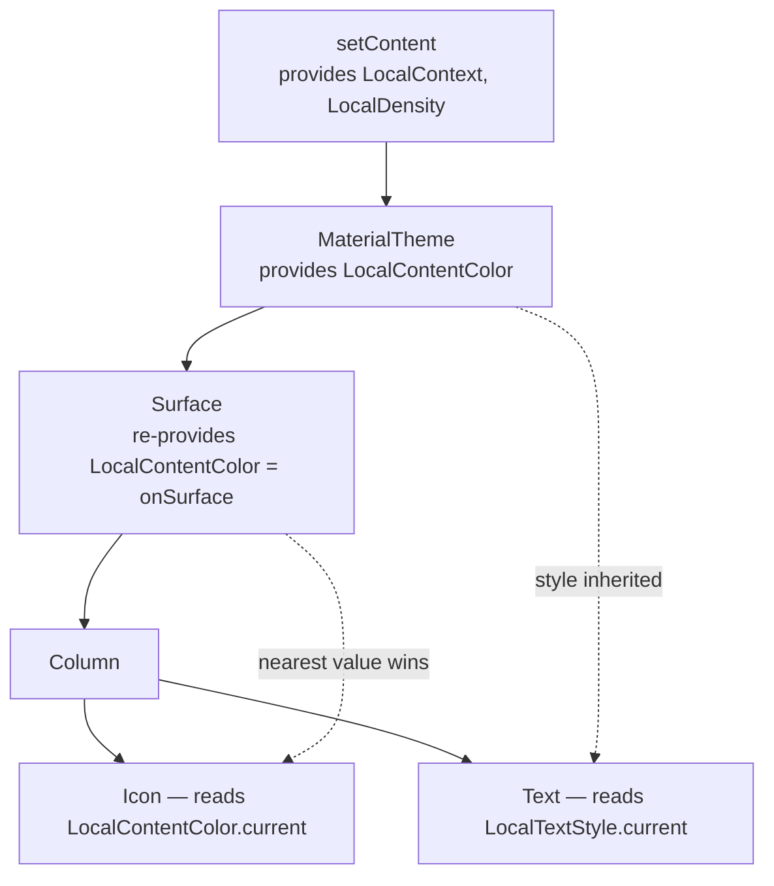

# Lesson 01 — Built-in CompositionLocals

> After this lesson you can read ambient values like context, density, and content color from anywhere in the tree without passing them as parameters — and explain what a CompositionLocal actually *is*.

**Module:** 07 · **Lesson:** 01 · **Level:** 🟢🟡🔴 · **Est. time:** 60–75 min

---

## 1. Concept

### 🟢 For beginners — *what is it and why do I care?*

Some values are needed *everywhere* in your UI, but it would be miserable to pass them to every single composable by hand. The current screen **density** (how many pixels are in one `dp`), the Android **`Context`**, the current **text color** for the surface you're on — almost every composable might need one of these, but threading them through 12 function calls just to reach a leaf is painful and noisy.

**A CompositionLocal is a value that's available implicitly to everything below a certain point in the UI tree.** You don't pass it down; you *reach up* and grab it. Compose ships with a bunch of these already wired up. You read one with `.current`:

```kotlin
val context = LocalContext.current      // the Android Context, here, no parameters
val density = LocalDensity.current      // the screen's pixel density
```

Think of it like the air in a room. You don't hand each person a tank of air; it's just *there*, ambient, and anyone in the room can breathe it. CompositionLocals are the ambient values of the Compose tree.

The naming convention is the tell: anything starting with **`Local…`** (and read via `.current`) is a CompositionLocal. `LocalContext`, `LocalDensity`, `LocalConfiguration`, `LocalContentColor`, `LocalLayoutDirection` — these are all built in and you'll use them constantly.

### 🟡 For intermediate devs — *the mechanism*

A `CompositionLocal<T>` is a **key**, not a value. The actual value is *provided* somewhere up the tree (Compose's setup, or `MaterialTheme`, or your own `CompositionLocalProvider`) and *consumed* lower down via `.current`. The lookup walks **up the composition** — not the layout, not the file structure — until it finds the nearest provider for that key.

```kotlin
@Composable
fun PriceTag(priceCents: Int) {
    // .current resolves the nearest provided value for this key, walking up the composition.
    val density = LocalDensity.current
    val context = LocalContext.current

    // Convert a px threshold to dp using the *real* device density — not a guess.
    val minWidth = with(density) { 120.toDp() }
    val formatted = remember(priceCents) { formatCurrency(context, priceCents) }

    Text(formatted, modifier = Modifier.widthIn(min = minWidth))
}
```

The most common built-ins you'll meet:

| CompositionLocal | What it gives you | Typical use |
|---|---|---|
| `LocalContext` | the Android `Context` | resources, `Toast`, intents, `getSystemService` |
| `LocalDensity` | `Density` (px↔dp, sp scaling) | manual px/dp conversion, `Canvas`, gestures |
| `LocalConfiguration` | `Configuration` | screen size, orientation, locale, night mode |
| `LocalLayoutDirection` | `Ltr` / `Rtl` | mirroring, manual offsets, padding logic |
| `LocalContentColor` | the current foreground color | icons/text that adapt to their surface |
| `LocalTextStyle` | the ambient text style | inherited typography for `Text` |
| `LocalLifecycleOwner` | the `LifecycleOwner` | `collectAsStateWithLifecycle`, lifecycle effects |
| `LocalView` | the host Android `View` | window insets, `performHapticFeedback`, autofill |
| `LocalInspectionMode` | `true` inside `@Preview`/Layout Inspector | swap live data for fakes in previews |

A key point: reading `.current` **subscribes you to that value** when it comes from a *dynamic* local (the kind built with `compositionLocalOf`). If the provided value changes, the readers recompose. We dissect that distinction in [Lesson 02](02-compositionlocalof-vs-static.md); for now, know that `LocalContentColor` changing (because you entered a darker surface) will recompose the `Text` that reads it — automatically.

### 🔴 For senior devs — *trade-offs, edges, internals*

Three things separate "I can call `.current`" from "I understand the system":

- **Resolution is by composition position, not call stack or file.** The provider that wins is the nearest one *above the reader in the composition tree*. This is why a composable's behavior can change depending on *where it's hosted*, not how it's written — powerful, and occasionally a debugging trap. There is no compile-time guarantee a non-default provider exists; if none does, you get the local's **default value** (or a crash, for locals whose default throws — see below).

- **Some built-ins have no sensible default and throw if read outside their host.** `LocalContext`, `LocalView`, `LocalLifecycleOwner`, and friends are provided by `setContent`/`ComposeView`. Read them in a pure unit test with no host and you'll hit *"CompositionLocal … not present."* That's by design — they're declared with a default lambda that throws, because a fake "empty Context" would be worse than a clear error.

- **`LocalConfiguration` vs the new window-size APIs.** `LocalConfiguration` still works, but for responsive layout in 2026 you usually want `currentWindowAdaptiveInfo()` / `WindowSizeClass` (Material 3 adaptive) rather than eyeballing `configuration.screenWidthDp`. Reach for `LocalConfiguration` for things it's actually authoritative on — `uiMode` (night), `fontScale`, `locales` — and prefer the adaptive APIs for breakpoints.

Also worth internalizing now: **`.current` is a read like any other state read.** A `staticCompositionLocalOf` read is *not* tracked (changing it re-runs the whole provided subtree); a `compositionLocalOf` read *is* tracked (only readers recompose). The built-ins are deliberately split across both kinds — `LocalContext` is static (it never changes for a given host), `LocalContentColor` is dynamic (it changes as you nest surfaces). That asymmetry is the entire subject of the next lesson, and it's a top interview question.

### Analogy

**Ambient room conditions.** Walk into any room in a building and there's a temperature, a light level, an air supply — you don't carry them in, they're *provided* by the room you're standing in. Move to a different room (a different part of the tree) and the conditions can differ. A CompositionLocal is exactly that: an ambient condition supplied by your surroundings in the composition, read on demand, no parameter passing.

### Mental model

> **`Local…current` reaches up the composition for the nearest provided value.** You consume ambient context instead of threading it through every function signature.

### Real-world example

A reusable `Icon` in Material 3 has no `color` parameter set by you most of the time — it reads `LocalContentColor.current`. Put that icon inside a `Button` and it's white; put the same icon on a `Card` and it's the on-surface color. The icon never changed; its **ambient content color** did. That's a built-in CompositionLocal making one component look correct in every context automatically.

---

## 2. Visual Learning

**ASCII — `.current` walks *up* the composition for a provider:**
```text
   setContent { ... }                         ← provides LocalContext, LocalDensity, …
        │
        ▼
   MaterialTheme { ... }                       ← provides LocalContentColor, LocalTextStyle
        │
        ▼
   Surface { ... }                             ← UPDATES LocalContentColor (onSurface)
        │
        ▼
   Column { ... }
        │
        ▼
   Icon()  ── reads LocalContentColor.current ─┐
                                               │  "nearest provider above me?"
        ▲──────────────────────────────────────┘  → Surface's value wins
```

**Mermaid — provide high, consume low:**


**Illustration prompt (paste into an image generator):**
```text
Illustration: a cutaway of a modern multi-story building, each floor a glowing labeled
panel — top floor "setContent: Context + Density", next "MaterialTheme: ContentColor",
next "Surface: onSurface color". A small character (a Composable icon) stands on a lower
floor and a thin beam of light travels UPWARD past floors until it reaches the nearest
floor that supplies the value it needs, which lights up. Other floors stay dim.
Caption: ".current reaches up for the nearest provider." Clean, vibrant, soft gradients,
clear labels, isometric style.
```

---

## 3. Code

### 🟢 Beginner — read a built-in instead of passing a parameter

```kotlin
@Composable
fun WelcomeBanner() {
    // Grab the Context ambiently — no parameter, no plumbing.
    val context = LocalContext.current
    val appName = context.getString(R.string.app_name)

    Text("Welcome to $appName")
}
```

**Explanation.** `LocalContext.current` hands you the host `Context` wherever this composable is rendered. You didn't add a `context: Context` parameter and you didn't pass one from the caller — the value is ambient, provided by `setContent` above you.

**Common mistakes.**
```kotlin
// ❌ Manually threading Context through every layer just to reach a leaf.
@Composable
fun Screen(context: Context) {
    Header(context); Body(context); Footer(context)  // noise; LocalContext already exists
}
```
This is the exact prop-drilling CompositionLocals exist to remove. The Context is already available via `LocalContext.current` at any depth.

**Best practices.**
- Read built-in ambients (`LocalContext`, `LocalDensity`, …) directly where you need them.
- Don't add a parameter for something the framework already provides ambiently.

---

### 🟡 Intermediate — density-correct conversions and content color

```kotlin
@Composable
fun DensityAwareDot(diameterPx: Float) {
    val density = LocalDensity.current
    // Convert raw pixels to dp using the *device's* density — never hard-code a ratio.
    val diameterDp = with(density) { diameterPx.toDp() }

    Box(
        Modifier
            .size(diameterDp)
            .background(LocalContentColor.current, CircleShape) // adapts to the surface
    )
}

@Composable
fun ContentColorDemo() {
    Surface(color = MaterialTheme.colorScheme.primary) {
        // Inside a primary Surface, LocalContentColor is automatically onPrimary,
        // so both the label and the dot are legible without us setting a color.
        Row(verticalAlignment = Alignment.CenterVertically) {
            DensityAwareDot(diameterPx = 24f)
            Spacer(Modifier.width(8.dp))
            Text("On primary")  // inherits content color + text style
        }
    }
}
```

**Explanation.** `with(LocalDensity.current) { px.toDp() }` is the canonical way to cross the px↔dp boundary, because density varies per device. And because `Surface` *re-provides* `LocalContentColor` as the matching "on" color, anything inside renders legibly with zero color parameters from you.

**Common mistakes.**
```kotlin
// ❌ Inventing a density. Wrong on every screen that isn't ~xhdpi.
val diameterDp = (diameterPx / 3f).dp

// ❌ Calling toDp() with no Density in scope — won't compile / needs the receiver.
val bad = diameterPx.toDp()
```
- Hard-coding a px→dp divisor ignores real device density (and font scale for `sp`).
- Forgetting that `toDp()`/`toPx()` are extensions on `Density`, so you need `with(LocalDensity.current) { … }`.

**Best practices.**
- Always convert px/dp/sp through `LocalDensity.current`.
- Let `Surface`/`MaterialTheme` drive `LocalContentColor`; only override it deliberately.

---

### 🔴 Production — preview-safe, lifecycle-aware, inspection-aware

```kotlin
@Composable
fun UserAvatar(
    userId: String,
    viewModel: AvatarViewModel = hiltViewModel(),
    modifier: Modifier = Modifier,
) {
    // In a @Preview or Layout Inspector there's no real data source — branch on it.
    if (LocalInspectionMode.current) {
        PlaceholderAvatar(modifier)   // deterministic art for tooling
        return
    }

    // Lifecycle-aware collection uses the ambient LocalLifecycleOwner under the hood.
    val state by viewModel.avatar(userId).collectAsStateWithLifecycle()

    when (val s = state) {
        AvatarUiState.Loading -> ShimmerAvatar(modifier)
        is AvatarUiState.Error -> InitialsAvatar(s.fallbackInitials, modifier)
        is AvatarUiState.Ready -> AsyncImage(model = s.url, contentDescription = null, modifier = modifier)
    }
}

@Composable
private fun PlaceholderAvatar(modifier: Modifier = Modifier) {
    Box(modifier.size(40.dp).background(LocalContentColor.current.copy(alpha = 0.2f), CircleShape))
}
```

**Explanation.** Three built-ins do real work here. `LocalInspectionMode.current` lets the component render instantly in previews/Layout Inspector without a live ViewModel or network — the single most useful trick for making components previewable. `collectAsStateWithLifecycle()` relies on the ambient `LocalLifecycleOwner` so collection pauses in the background. And the placeholder reuses `LocalContentColor` so it's legible on any surface.

**Common mistakes.**
```kotlin
// ❌ Reading a host-only local in a unit test with no Compose host → crash.
@Test fun broken() {
    composeTestRule.setContent { Text(LocalContext.current.packageName) } // ok here…
}
// …but calling a composable that reads LocalLifecycleOwner with NO setContent host
// throws "CompositionLocal LocalLifecycleOwner not present."

// ❌ Forgetting LocalInspectionMode → previews try to hit the network and render blank/red.
@Composable fun Avatar() { val s by vm.flow.collectAsStateWithLifecycle(); /* dies in @Preview */ }
```
- Host-provided locals (`LocalContext`, `LocalView`, `LocalLifecycleOwner`) throw when read with no host. Provide a fake in tests, or read them only inside a hosted composition.
- Skipping `LocalInspectionMode` makes data-driven components un-previewable.

**Best practices.**
- Guard data-driven UI with `if (LocalInspectionMode.current)` so previews are instant and deterministic.
- Treat throwing locals as a *feature*: a loud, specific error beats a silent wrong default.
- Prefer `collectAsStateWithLifecycle` (uses `LocalLifecycleOwner`) over `collectAsState` on Android.

---

## 4. Interview Questions

**🟢 Beginner**

1. *What is a CompositionLocal, in one sentence?*
   > An implicit value provided high in the composition tree and read lower down via `.current`, so you don't pass it through every composable as a parameter.
2. *How do you read the current Android `Context` in a composable?*
   > `val context = LocalContext.current`. It's provided by `setContent`, so it's available at any depth without a parameter.

**🟡 Intermediate**

3. *Why use `LocalDensity` instead of a hard-coded px-to-dp ratio?*
   > Density varies per device, and font scaling affects `sp`. `with(LocalDensity.current) { px.toDp() }` converts using the *actual* device metrics, so sizes are correct everywhere; a fixed divisor is only right by accident on one density bucket.
4. *How does `Icon` know what color to be without you setting one?*
   > It reads `LocalContentColor.current`. `Surface`/`MaterialTheme` re-provide that local as the appropriate "on" color for the current surface, so the icon adapts automatically as you nest surfaces.

**🔴 Senior**

5. *Why do `LocalContext`/`LocalLifecycleOwner` throw when read outside a host, while `LocalContentColor` doesn't?*
   > Host-bound locals are declared with a default that *throws*, because there is no meaningful "empty" Context/LifecycleOwner — a loud error is safer than a fake. `LocalContentColor` has a sane neutral default, so reading it without a provider returns that default rather than crashing. The choice is deliberate per local.
6. *Resolution walks "up" — up what, exactly, and why does that matter?*
   > Up the **composition tree** (the call hierarchy of composables at runtime), not the source file or the layout. The nearest enclosing provider wins. It matters because a composable's resolved ambient values depend on *where it's hosted*, so the same function can behave differently in different parents — great for theming, occasionally a debugging trap when a value isn't what you expected.

---

## 5. AI Assistant

**Prompt example (replacing prop-drilling with a built-in):**
```text
This Compose code passes `context: Context` and `density: Density` through five composables
just to reach a leaf. Refactor to read LocalContext.current and LocalDensity.current at the
leaf instead, removing the parameters from the intermediate functions. Target Compose 2026,
Material 3, Kotlin 2.x. Keep everything else identical.
[paste code]
```

**AI workflow — where it helps on *this* topic.**
- ✅ Great for: listing the right built-in for a need ("how do I get night-mode state? → `LocalConfiguration.current.uiMode`"), converting parameter-threading into ambient reads, and adding `LocalInspectionMode` guards for previews.
- ⚠️ Not for: deciding *whether* something should be a CompositionLocal at all (that's [Lesson 04](04-compositionlocal-vs-di-vs-params.md)). Models will happily reach for a local where a plain parameter is clearer.

**Review workflow — check AI output against this lesson's *Common Mistakes*:**
- Did it convert px/dp through `LocalDensity` rather than a magic number?
- Does any composable that reads `LocalContext`/`LocalView`/`LocalLifecycleOwner` actually run under a host (or get a fake in tests)?
- Did it guard data-driven UI with `LocalInspectionMode` so previews don't hit the network?
- Did it use `.current` (a read), not some made-up `LocalContext.get()`?

**Validation workflow — prove it actually works:**
1. **Compile & preview**: a `@Preview` should render instantly; if it goes blank/red, you likely skipped `LocalInspectionMode`.
2. Run on **two density emulators** (e.g. hdpi + xxhdpi); density-based sizes should look identical, not 1.5× off.
3. Toggle **dark theme** and nest the component in different `Surface`s; `LocalContentColor` readers should stay legible.
4. In a unit test, wrap under `composeTestRule.setContent { … }` (a host) before reading host-bound locals; assert no "CompositionLocal not present" crash.

> **AI drafts, you decide.** If the model adds a parameter for something the framework already provides ambiently — or invents an API like `LocalContext.get()` — trust the built-in surface, not the hallucination.

---

## Recap / Key takeaways

- A **CompositionLocal** is an ambient value: provided high in the tree, read low via **`.current`**, no parameter threading.
- The lookup walks **up the composition** for the nearest provider; absent one, you get the local's **default** (or a deliberate crash for host-bound locals).
- Know the workhorses: `LocalContext`, `LocalDensity`, `LocalConfiguration`, `LocalContentColor`, `LocalLayoutDirection`, `LocalLifecycleOwner`, `LocalView`, `LocalInspectionMode`.
- Convert px/dp/sp through **`LocalDensity`**; let `Surface`/`MaterialTheme` drive **`LocalContentColor`**; guard data UI with **`LocalInspectionMode`**.
- Some built-ins are **static** (never change) and some are **dynamic** (recompose readers on change) — exactly the distinction Lesson 02 unpacks.

➡️ Next: **[Lesson 02 — `compositionLocalOf` vs `staticCompositionLocalOf`](02-compositionlocalof-vs-static.md)** — the recomposition-scope trade-off that decides which factory you reach for.
