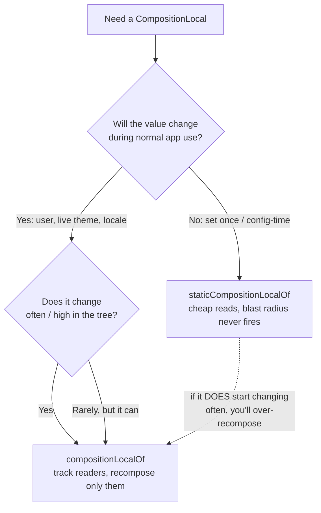

# Lesson 02 — `compositionLocalOf` vs `staticCompositionLocalOf`

> After this lesson you can choose the right CompositionLocal factory by reasoning about *who recomposes when the value changes* — and explain the read-tracking trade-off that separates the two.

**Module:** 07 · **Lesson:** 02 · **Level:** 🟢🟡🔴 · **Est. time:** 70–90 min

---

## 1. Concept

### 🟢 For beginners — *what is it and why do I care?*

When you make your *own* CompositionLocal (next lesson), you pick one of two factory functions:

```kotlin
val LocalSpacing = staticCompositionLocalOf { Spacing() }   // one choice
val LocalUser    = compositionLocalOf { AnonymousUser }     // the other choice
```

They look almost identical and they're used identically (`LocalSpacing.current`). The difference is **what happens when the provided value changes**:

- **`compositionLocalOf`** (call it *dynamic*) — only the composables that actually *read* the value recompose. Surgical.
- **`staticCompositionLocalOf`** (call it *static*) — Compose doesn't track who read it, so when the value changes it recomposes the **entire chunk of UI** where you provided it. Blunt, but cheaper to *read*.

The rule of thumb you can carry today: **if the value basically never changes, use `static`. If it changes during normal use, use dynamic (`compositionLocalOf`).** A design system's spacing scale? Static. The signed-in user, who can switch accounts? Dynamic.

### 🟡 For intermediate devs — *the mechanism*

The split comes down to **read tracking**.

- A **dynamic** local (`compositionLocalOf`) behaves like ordinary snapshot state: every `.current` read **subscribes** that recomposition scope. Provide a new value and Compose invalidates *exactly the readers*. The cost: it maintains a tracking structure, and the read is slightly more expensive.

- A **static** local (`staticCompositionLocalOf`) is **not** tracked. Reading `.current` is just a fast lookup — no subscription is recorded. The consequence is that Compose has no list of readers to invalidate, so if the provided value changes, it has to **recompose the whole content lambda passed to that `CompositionLocalProvider`**, on the assumption that anything inside *might* have read it.

```text
                    value changes →  who recomposes?
compositionLocalOf  ───────────────  only the .current readers      (tracked)
staticComposition…  ───────────────  the entire provided subtree    (untracked, fast read)
```

So the trade is **read speed vs. write blast radius**:

| | `compositionLocalOf` (dynamic) | `staticCompositionLocalOf` (static) |
|---|---|---|
| Read cost | slightly higher (tracked) | minimal (plain lookup) |
| On change | recomposes **only readers** | recomposes **whole provided subtree** |
| Best when | value **changes at runtime** | value is **constant / rarely changes** |
| Examples | current user, live theme toggle, locale | density, spacing tokens, an event logger |

If a static local's value never actually changes after it's provided, its "recompose everything" downside **never fires** — you get the cheap reads for free. That's why infrastructure-y, set-once values (`LocalContext` is static under the hood) use it.

### 🔴 For senior devs — *trade-offs, edges, internals*

The senior-level reasoning:

- **"Static" does not mean immutable or final.** You *can* provide a new value to a `staticCompositionLocalOf`. The word "static" refers to **read-tracking being off**, not to the value being constant. If you provide a `staticCompositionLocalOf` with a value that flips frequently, you've built a performance footgun: every flip recomposes the entire subtree under that provider. The bug is silent — it compiles, it works, it's just needlessly expensive. Profilers (recomposition counts) are how you catch it.

- **The choice interacts with `MutableState` inside the value.** A subtle but important pattern: you can put a *dynamic-feeling* value behind a *static* local by making the **value itself** hold snapshot state. e.g. provide a stable `ThemeController` object (via `static`) whose `controller.isDark: MutableState<Boolean>` is what composables read. Now the *object reference* never changes (so static's blast radius never triggers), but reads of `controller.isDark` are tracked *as ordinary state reads*. This is exactly how `MaterialTheme` gives you cheap static reads of `LocalColorScheme`/`LocalTextStyle` while still re-skinning live when the theme changes — the provided object changes, and because color scheme is provided dynamically it invalidates only readers. Knowing *which* layer carries the change is the senior skill.

- **Default value is computed lazily and must be safe to call with no provider.** Both factories take a `defaultFactory: () -> T`. For dynamic locals the default is only used when no provider exists; for many built-ins the default lambda deliberately `error(...)`s. Don't put expensive or side-effecting work in a default factory.

- **Equality still gates dynamic invalidation.** A `compositionLocalOf` uses a structural-equality policy by default (you can pass a custom `SnapshotMutationPolicy`). Re-providing an `==` value won't invalidate readers — same rule as `mutableStateOf`. With unstable types that have surprising `equals`, you can get over- or under-recomposition.

- **Provider nesting cost.** Every `CompositionLocalProvider` that supplies a static local creates a boundary that, on change, re-runs its whole child lambda. Providing many static locals that change together is fine (one boundary); providing a *frequently changing* static local high in the tree is how you accidentally recompose half the app.

### Analogy

**A building intercom vs. a fire alarm.**
- **Dynamic (`compositionLocalOf`)** is a targeted **intercom**: it knows exactly which rooms subscribed to a channel and pages only those. Precise, but it maintains a directory of who's listening.
- **Static (`staticCompositionLocalOf`)** is the **fire alarm**: there's no directory of who cares, so when it goes off, *the whole floor* responds. Dirt-cheap to install and to "read" (no directory), but every trigger evacuates everyone. You only want it for the alarm that essentially never rings.

### Mental model

> **Dynamic tracks readers and pages only them; static skips the directory and recomposes the whole subtree.** Reach for static when the value won't change, dynamic when it will.

### Real-world example

A design system exposes `LocalSpacing` (a fixed 4/8/16/24 dp scale) and the app exposes `LocalCurrentUser`. Spacing is `static` — it's set once at the theme root and never changes, so reads stay cheap and the "recompose everything" path never triggers. The current user is `compositionLocalOf` — switching accounts must re-render avatars, greetings, and permission-gated buttons, but *only* those, so it's dynamic and surgical.

---

## 2. Visual Learning

**ASCII — same change, two blast radii:**
```text
provide NEW value ─────────────────────────────────────────────┐
                                                                │
compositionLocalOf (dynamic)            staticCompositionLocalOf (static)
   Provider                                Provider
   ├─ A (reads .current)  ✅ recomposes     ├─ A (reads .current)  ✅ recomposes
   ├─ B (no read)         ⏭️ skipped        ├─ B (no read)         ✅ recomposes (!)
   └─ C                                     └─ C
        └─ D (reads)      ✅ recomposes          └─ D (reads)      ✅ recomposes
   → only readers run                       → the ENTIRE subtree runs
```

**Mermaid — decision flow:**


**Illustration prompt (paste into an image generator):**
```text
Illustration: a split-screen comparison, same office-building cross-section on each side.
LEFT panel titled "compositionLocalOf (dynamic)": a switchboard operator with glowing wires
running ONLY to three specific lit rooms; the rest of the building stays dark. Label "pages
only subscribers."
RIGHT panel titled "staticCompositionLocalOf (static)": a red fire-alarm bell at the top and
the ENTIRE floor lit up and evacuating. Label "no directory → whole subtree recomposes."
Bottom caption: "Read speed vs. write blast radius." Modern, vibrant, clear labels, soft
gradients, isometric.
```

---

## 3. Code

### 🟢 Beginner — declare one of each and read them

```kotlin
// Static: a spacing scale that's fixed for the app's lifetime → cheap reads.
data class Spacing(val small: Dp = 4.dp, val medium: Dp = 8.dp, val large: Dp = 16.dp)
val LocalSpacing = staticCompositionLocalOf { Spacing() }

// Dynamic: the signed-in user can change at runtime → only readers should recompose.
data class CurrentUser(val name: String, val isPremium: Boolean)
val LocalCurrentUser = compositionLocalOf { CurrentUser(name = "Guest", isPremium = false) }

@Composable
fun Greeting() {
    val user = LocalCurrentUser.current   // tracked read (dynamic)
    val spacing = LocalSpacing.current    // untracked read (static)
    Text("Hi, ${user.name}", Modifier.padding(spacing.medium))
}
```

**Explanation.** Both are read the same way. The *only* difference is behavior on change: re-provide `LocalCurrentUser` and just `Greeting` (a reader) recomposes; re-provide `LocalSpacing` and the whole subtree under its provider recomposes — which is fine, because spacing never changes.

**Common mistakes.**
```kotlin
// ❌ A value that changes at runtime declared as static → whole subtree recomposes on every change.
val LocalCurrentUser = staticCompositionLocalOf { CurrentUser("Guest", false) }
```
If the user can switch accounts, `static` makes *every account switch* recompose the entire provided subtree instead of just the avatar/greeting that read it.

**Best practices.**
- Pick the factory by one question: *does this change during normal use?* No → static. Yes → dynamic.
- Name and document the choice; the next dev can't tell `static` from dynamic at the call site.

---

### 🟡 Intermediate — *see* the blast-radius difference

```kotlin
val LocalAccent = compositionLocalOf { Color(0xFF6750A4) }
val LocalAccentStatic = staticCompositionLocalOf { Color(0xFF6750A4) }

@Composable
fun BlastRadiusDemo() {
    var accent by remember { mutableStateOf(Color(0xFF6750A4)) }

    Column {
        Button(onClick = { accent = randomColor() }) { Text("Change accent") }

        // DYNAMIC provider: only ReaderChip recomposes when accent changes.
        CompositionLocalProvider(LocalAccent provides accent) {
            NonReader("dynamic-non-reader")    // ⏭️ skipped on change
            ReaderChip(useStatic = false)      // ✅ recomposes (it reads .current)
        }

        // STATIC provider: BOTH children recompose when accent changes.
        CompositionLocalProvider(LocalAccentStatic provides accent) {
            NonReader("static-non-reader")     // ✅ recomposes anyway (untracked)
            ReaderChip(useStatic = true)       // ✅ recomposes
        }
    }
}

@Composable
private fun NonReader(tag: String) {
    SideEffect { Log.d("recompose", "NonReader $tag ran") }  // temporary: watch the log
    Text(tag)
}

@Composable
private fun ReaderChip(useStatic: Boolean) {
    val color = if (useStatic) LocalAccentStatic.current else LocalAccent.current
    Box(Modifier.size(24.dp).background(color, CircleShape))
}
```

**Explanation.** `NonReader` never reads the local. Under the **dynamic** provider it is *not* invalidated when `accent` changes (no subscription). Under the **static** provider it *is* invalidated, because Compose can't know it didn't read the value, so it recomposes the entire provided lambda. Watch the Logcat lines to see it with your own eyes.

**Common mistakes.**
```kotlin
// ❌ Putting a frequently-changing value behind a static local HIGH in the tree.
CompositionLocalProvider(LocalAccentStatic provides liveAnimatedColor) {
    EntireScreen()   // recomposes EntireScreen every animation frame
}
```
A static local that changes every frame turns the whole subtree into per-frame recomposition — a classic jank source that profilers reveal.

**Best practices.**
- If you must observe the change, prefer dynamic so the blast radius matches the readers.
- Provide static locals as **low** as practical, so a (rare) change recomposes the smallest subtree.

---

### 🔴 Production — stable object + inner snapshot state (best of both)

```kotlin
// The OBJECT is stable (never replaced) → safe to expose via a static local.
@Stable
class ThemeController(initialDark: Boolean) {
    var isDark by mutableStateOf(initialDark)   // reads of THIS are tracked as state
        private set
    fun toggle() { isDark = !isDark }
}

// Static: the controller reference is set once; we never re-provide it.
val LocalThemeController = staticCompositionLocalOf<ThemeController> {
    error("No ThemeController provided")  // loud default — must be wired at the root
}

@Composable
fun AppRoot(content: @Composable () -> Unit) {
    val controller = remember { ThemeController(initialDark = false) }
    CompositionLocalProvider(LocalThemeController provides controller) {
        // Provide a DYNAMIC color scheme derived from the controller's tracked state.
        val scheme = if (controller.isDark) darkColorScheme() else lightColorScheme()
        MaterialTheme(colorScheme = scheme, content = content)
    }
}

@Composable
fun ThemeToggleButton() {
    // Reading controller.isDark is a tracked STATE read, even though the local is static:
    // the object reference is constant, so static's "recompose subtree" never fires here.
    val controller = LocalThemeController.current
    IconToggleButton(checked = controller.isDark, onCheckedChange = { controller.toggle() }) {
        Icon(
            imageVector = if (controller.isDark) Icons.Filled.DarkMode else Icons.Outlined.LightMode,
            contentDescription = if (controller.isDark) "Switch to light" else "Switch to dark",
        )
    }
}
```

**Explanation.** This is the senior pattern. The **static** local carries a **stable object** whose reference never changes — so static's whole-subtree recomposition path is never triggered. The *change* lives in `controller.isDark`, a `MutableState`, so reading it is a normal tracked state read and only the readers recompose. Meanwhile `MaterialTheme` re-provides the color scheme dynamically, re-skinning the app surgically. You get cheap static reads **and** precise updates — because each layer carries the right kind of change.

**Common mistakes.**
```kotlin
// ❌ Re-providing the static local with a NEW controller each toggle → recomposes whole subtree.
CompositionLocalProvider(LocalThemeController provides ThemeController(isDark)) { ... }

// ❌ Making the controller mutable from anywhere (public setter) → uncontrolled writes to your truth.
class ThemeController { var isDark = false }  // no snapshot state → reads aren't even tracked
```
- Re-creating/re-providing the static object defeats the whole pattern and reintroduces the blast radius.
- A plain `var` (not `mutableStateOf`) inside the object isn't observable — readers won't recompose at all.

**Best practices.**
- Carry the *stable identity* in the static local; carry the *changing value* in snapshot state inside it (or in a dynamic local).
- Mark such holders `@Stable`/`@Immutable` truthfully, and keep mutation funneled through methods.
- Give static locals that *require* a provider a throwing default, so a missing provider fails loudly at the root.

---

## 4. Interview Questions

**🟢 Beginner**

1. *What's the practical difference between `compositionLocalOf` and `staticCompositionLocalOf`?*
   > When the provided value changes, `compositionLocalOf` recomposes only the composables that read it; `staticCompositionLocalOf` recomposes the entire content under the provider. Static has cheaper reads; dynamic has a smaller change blast radius.
2. *Which would you pick for a fixed spacing scale, and why?*
   > `staticCompositionLocalOf` — spacing doesn't change at runtime, so the "recompose everything" downside never fires and you keep the cheaper reads.

**🟡 Intermediate**

3. *Why are reads of a static local "cheaper"?*
   > Static locals aren't read-tracked, so reading `.current` is a plain lookup with no subscription bookkeeping. The cost is moved to writes: with no reader directory, a change must recompose the whole provided subtree.
4. *You provided a value as `staticCompositionLocalOf` and notice the whole screen recomposes on every change. What happened and how do you fix it?*
   > The static local's value is actually changing at runtime, and because reads aren't tracked Compose recomposes the entire provided subtree. Fix by switching to `compositionLocalOf` (track readers), or keep the local static but make the *value* a stable object holding `mutableStateOf`, and read that state instead.

**🔴 Senior**

5. *Does "static" mean the value is immutable?*
   > No. "Static" means read-tracking is off, not that the value is constant. You can re-provide a new value to a static local; doing so just recomposes the whole subtree. Treating it as "set-once" is a convention to keep that path from firing, not a guarantee.
6. *How does `MaterialTheme` give cheap reads of color/typography while still re-skinning live?*
   > By carrying the *changing* data in dynamically-provided values (the color scheme is re-provided, invalidating only readers) and/or stable objects read as snapshot state — so the object identity stays put while the observed values change. The skill is putting the change in the layer that invalidates precisely, not in a static local's reference.
7. *What role does equality play for a dynamic local?*
   > A `compositionLocalOf` uses a structural-equality policy by default, so re-providing an `==` value won't invalidate readers — same gate as `mutableStateOf`. You can pass a custom `SnapshotMutationPolicy`; unstable types with surprising `equals` can cause over- or under-recomposition.

---

## 5. AI Assistant

**Prompt example (choosing the factory):**
```text
I'm creating a CompositionLocal for <X> in a Compose 2026 / Material 3 app. Here's how <X>
behaves at runtime: <does it change? how often? how high in the tree is it provided?>.
Recommend compositionLocalOf vs staticCompositionLocalOf, justify it in terms of read tracking
and recomposition blast radius, and show the declaration with a sensible default factory.
```

**AI workflow — where it helps on *this* topic.**
- ✅ Good for: drafting the two declarations, writing a recomposition-counting demo to *prove* the blast radius, and explaining why a profiler shows a wide recomposition.
- ⚠️ Watch: models often default to `compositionLocalOf` reflexively, or call a value "static" and then mutate it every frame. They rarely propose the "stable object + inner `mutableStateOf`" pattern unless asked.

**Review workflow — map to *Common Mistakes*:**
- Is a **runtime-changing** value wrongly declared `static`? (whole-subtree recomposition)
- Is a **set-once** value wrongly declared dynamic? (paying tracking cost for nothing — minor, but sloppy)
- For the stable-object pattern: is the object **re-created/re-provided** on change (defeating it)? Is the inner field actual `mutableStateOf`?
- Does the default factory do anything expensive or side-effecting?

**Validation workflow — prove it actually works:**
1. **Recomposition counts**: in Android Studio's Layout Inspector, change the value and confirm — dynamic recomposes only readers; a *correctly-used* static recomposes the (small, set-once) subtree and **not** on a hot path.
2. Drop a temporary `SideEffect { Log.d("recompose", "X ran") }` in a *non-reader* under each provider and watch which one fires on change.
3. For the stable-object pattern, toggle rapidly and confirm only the readers of the inner state recompose — the provider boundary should **not** re-run.
4. Remove temporary logging before committing.

> **AI drafts, you decide.** If the model picks a factory without naming the read-tracking trade-off, push back — the choice is *defined* by who recomposes on change.

---

## Recap / Key takeaways

- The factories differ in **read tracking**: `compositionLocalOf` tracks readers (recomposes only them); `staticCompositionLocalOf` doesn't (recomposes the whole provided subtree on change).
- Trade-off: **dynamic = cheaper writes / wider read cost**, **static = cheaper reads / wider write blast radius**.
- Choose by one question: **does the value change during normal use?** No → static. Yes → dynamic.
- **"Static" ≠ immutable.** Re-providing a changing value to a static local silently recomposes everything below — a profiler-only bug.
- Senior pattern: put **stable identity** in a static local and the **changing value** in snapshot state inside it (or a dynamic local) to get cheap reads *and* surgical updates.

➡️ Next: **[Lesson 03 — Creating & providing custom locals](03-creating-providing-custom-locals.md)** — `CompositionLocalProvider`, default values, and the `provides` / `providesDefault` / `providesComputed` infix functions.
