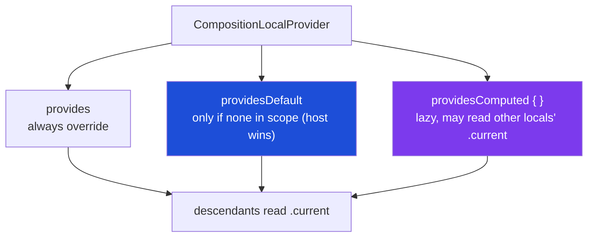

# Lesson 03 — Creating & providing custom locals

> After this lesson you can declare your own CompositionLocal, supply it with `CompositionLocalProvider`, choose a safe default, and use `provides` / `providesDefault` / `providesComputed` correctly.

**Module:** 07 · **Lesson:** 03 · **Level:** 🟢🟡🔴 · **Est. time:** 75–95 min

---

## 1. Concept

### 🟢 For beginners — *what is it and why do I care?*

Lesson 01 used built-in locals. Now you make your own. There are exactly **three steps**:

1. **Declare** the local (a key) with a default:
   ```kotlin
   val LocalSpacing = staticCompositionLocalOf { Spacing() }
   ```
2. **Provide** a value somewhere up the tree:
   ```kotlin
   CompositionLocalProvider(LocalSpacing provides Spacing(medium = 12.dp)) {
       content()   // everything in here sees the new spacing
   }
   ```
3. **Consume** it lower down:
   ```kotlin
   val spacing = LocalSpacing.current
   ```

That's the whole API. The little word `provides` is an **infix function** — `LocalSpacing provides value` is just a tidy way of writing "bind this key to this value for the block below." Anything outside the provider keeps seeing the default.

The mental shift: you're creating an **ambient channel** that any descendant can tune into, instead of adding yet another parameter to a dozen function signatures.

### 🟡 For intermediate devs — *the mechanism*

`CompositionLocalProvider` accepts one or more **`ProvidedValue`** entries (produced by the infix functions) and rebinds those keys for the duration of its `content` lambda. You can provide several at once:

```kotlin
CompositionLocalProvider(
    LocalSpacing provides compactSpacing,
    LocalElevation provides Elevation(card = 2.dp),
    LocalContentColor provides Color.White,   // you can re-provide built-ins too
) {
    DashboardContent()
}
```

Three infix functions, each with a distinct meaning:

| Infix | Meaning |
|---|---|
| `provides` | **Always** override the parent value for this subtree. |
| `providesDefault` | Provide a value **only if no ancestor already provided** this local. "Set a fallback, don't stomp." |
| `providesComputed` | Provide a **lambda** evaluated lazily *on each read*, which can reference *other* locals' `.current`. |

Choosing a **default** at declaration matters:

- A **safe neutral default** (e.g. `Spacing()`, `Color.Unspecified`) lets the local be read anywhere, even with no provider — convenient, but a missing provider fails *silently* (you get the default).
- A **throwing default** (`error("No X provided")`) makes the local **required**: forget the provider and you get a loud, specific crash at the read site. Use this for things that have no meaningful "empty" value (a repository, a controller, an analytics sink).

```kotlin
val LocalImageLoader = staticCompositionLocalOf<ImageLoader> {
    error("No ImageLoader provided. Wrap your content in CompositionLocalProvider(LocalImageLoader provides ...).")
}
```

### 🔴 For senior devs — *trade-offs, edges, internals*

- **`providesDefault` is for library authors.** If you ship a composable that reads `LocalX` and want to *seed* a default *only when the app didn't already set one*, `providesDefault` avoids clobbering the app's value. With plain `provides` you'd overwrite whatever the host configured. It compiles to a check: "is there already a provided value in scope? if so, keep it." This is the correct primitive for "sensible default, host wins."

- **`providesComputed` is lazy and composes locals.** A computed provider's lambda runs **at read time**, and inside it you can read *other* `.current` values. Example: `LocalContentAlpha providesComputed { if (LocalEnabled.current) 1f else 0.38f }`. The value is derived from sibling locals without you recomputing it at every provider site. It's the right tool when one local's value is *a function of* others; the trade-off is the computation runs per read, so keep it cheap.

- **Provider placement is an architecture decision.** Provide too high and a (dynamic) change recomposes more than necessary; too low and descendants that need it can't see it (they fall back to the default — often the source of "why is my spacing wrong here?" bugs). The instinct: provide at the **narrowest subtree that fully contains every consumer**.

- **Re-providing inside the tree is legal and useful.** Nested providers *shadow* outer ones for their subtree — exactly how `Surface` overrides `LocalContentColor`. But each provider boundary has a cost (especially for static locals on change), and deeply nested re-provisioning can make "what's the current value here?" hard to reason about. Keep the override points few and intentional.

- **Don't smuggle mutability badly.** A local can carry a `MutableState` or a controller object, which is powerful (Lesson 02's pattern) — but providing a *raw* `MutableState` and letting any descendant write it turns your ambient channel into a global mutable variable with worse discoverability. Expose read access; funnel writes through methods or events.

- **Type the local explicitly when the default is a subtype or throws.** `staticCompositionLocalOf<ImageLoader> { error(...) }` needs the explicit `<ImageLoader>` because the `error(...)` default is `Nothing`. Forgetting it yields a `CompositionLocal<Nothing>` you can't use.

### Analogy

**A thermostat zone in a house.** Declaring the local is installing the thermostat *system*; `CompositionLocalProvider(... provides ...)` is setting the temperature for one **zone** (a subtree). Rooms in that zone feel that setting. Put a second thermostat in the den (a nested provider) and the den overrides the house setting — but only for the den. `providesDefault` is the factory pre-set: it only applies if nobody set the zone manually. `providesComputed` is an *auto* mode that reads other sensors (humidity, occupancy) each time it's checked.

### Mental model

> **Declare a key with a default, `provides` it for a subtree, read it with `.current`.** Nested providers shadow outer ones; `providesDefault` yields to an existing value; `providesComputed` derives lazily from other locals.

### Real-world example

A theming layer declares `LocalAppColors`, `LocalAppTypography`, and `LocalSpacing`, then a single `AppTheme { … }` composable provides all three at the root. Screens read `LocalSpacing.current` for consistent padding. A special "compact density" section re-provides `LocalSpacing` with tighter values for just that subtree — a settings page that needs to fit more on screen — without touching any of the screens' code.

---

## 2. Visual Learning

**ASCII — declare → provide (with a nested override) → consume:**
```text
val LocalSpacing = staticCompositionLocalOf { Spacing() }     ← declare (default)

AppTheme
 └─ CompositionLocalProvider(LocalSpacing provides Spacing(medium = 12.dp))   ← provide (zone A)
     ├─ HomeScreen
     │    └─ Text(Modifier.padding(LocalSpacing.current.medium))  → 12.dp  ✅ consume
     └─ CompositionLocalProvider(LocalSpacing provides Spacing(medium = 4.dp))  ← nested override (zone B)
          └─ CompactList
               └─ Row(Modifier.padding(LocalSpacing.current.medium)) → 4.dp  ✅ shadowed value
```

**Mermaid — the three infix functions:**


**Illustration prompt (paste into an image generator):**
```text
Illustration: a house cross-section with a smart-thermostat theme. A central panel labeled
"declare: LocalSpacing default 8dp". A whole-house zone glows "provides 12dp". Inside it, one
room (the den) has its own small thermostat glowing "nested provides 4dp", overriding only that
room. A faint dashed thermostat in the hallway labeled "providesDefault (only if unset)". A tiny
gauge labeled "providesComputed: reads humidity + occupancy each check". Modern, vibrant, clear
labels, isometric, soft gradients.
```

---

## 3. Code

### 🟢 Beginner — declare, provide, consume

```kotlin
// 1) Declare with a safe default.
data class Spacing(val small: Dp = 4.dp, val medium: Dp = 8.dp, val large: Dp = 16.dp)
val LocalSpacing = staticCompositionLocalOf { Spacing() }

// 2) Provide for a subtree.
@Composable
fun CompactArea(content: @Composable () -> Unit) {
    CompositionLocalProvider(LocalSpacing provides Spacing(medium = 6.dp)) {
        content()
    }
}

// 3) Consume anywhere inside.
@Composable
fun Tag(text: String) {
    val spacing = LocalSpacing.current
    Surface(shape = MaterialTheme.shapes.small) {
        Text(text, Modifier.padding(horizontal = spacing.medium, vertical = spacing.small))
    }
}
```

**Explanation.** `Tag` never receives spacing as a parameter; it reads the ambient value. Inside `CompactArea`, the same `Tag` automatically uses the tighter `6.dp`. Outside it, `Tag` uses the default `8.dp`.

**Common mistakes.**
```kotlin
// ❌ Consuming with no provider AND expecting a custom value → you silently get the default.
@Composable fun Stray() { Text("hi", Modifier.padding(LocalSpacing.current.medium)) } // 8.dp, not 6.dp
```
If `Stray` is rendered *outside* any `CompositionLocalProvider`, it falls back to the declared default — a frequent "why is my spacing wrong here?" surprise.

**Best practices.**
- Give value-type locals a **safe neutral default** so reads never crash.
- Keep the provided object **immutable** (a `data class`) so descendants can't mutate shared truth.

---

### 🟡 Intermediate — multiple locals + `providesDefault`

```kotlin
val LocalElevation = staticCompositionLocalOf { Elevation() }
data class Elevation(val card: Dp = 1.dp, val dialog: Dp = 8.dp)

@Composable
fun AppTheme(
    spacing: Spacing = Spacing(),
    elevation: Elevation = Elevation(),
    content: @Composable () -> Unit,
) {
    CompositionLocalProvider(
        LocalSpacing provides spacing,
        LocalElevation provides elevation,
    ) {
        MaterialTheme(content = content)
    }
}

// A reusable component that SEEDS a default only if the host didn't set one.
@Composable
fun BrandedCard(content: @Composable ColumnScope.() -> Unit) {
    // providesDefault: if an ancestor already provided LocalElevation, keep it; else seed 2.dp.
    CompositionLocalProvider(LocalElevation providesDefault Elevation(card = 2.dp)) {
        Card(elevation = CardDefaults.cardElevation(LocalElevation.current.card)) {
            Column(Modifier.padding(LocalSpacing.current.medium), content = content)
        }
    }
}
```

**Explanation.** `AppTheme` provides several locals at once at the root. `BrandedCard` uses `providesDefault` so it ships a reasonable elevation **without overriding** an app that intentionally set its own — "sensible default, host wins." If `AppTheme` already provided `LocalElevation`, `BrandedCard`'s `providesDefault` is ignored.

**Common mistakes.**
```kotlin
// ❌ Using `provides` in a reusable component → you stomp the host's intentional value.
CompositionLocalProvider(LocalElevation provides Elevation(card = 2.dp)) { /* host override lost */ }
```
A library/component that *forces* a value with `provides` removes the host's ability to theme it. Use `providesDefault` for "fallback unless overridden."

**Best practices.**
- Provide related locals together at one well-named root (`AppTheme`).
- In **reusable components/libraries**, prefer `providesDefault` so the host stays in control.

---

### 🔴 Production — required dependency (throwing default) + `providesComputed`

```kotlin
// A required infrastructure dependency: no meaningful "empty" value → throwing default.
val LocalImageLoader = staticCompositionLocalOf<ImageLoader> {
    error("No ImageLoader provided. Wrap content in CompositionLocalProvider(LocalImageLoader provides ...).")
}

// A computed local derived from another local, evaluated lazily on read.
val LocalEnabled = compositionLocalOf { true }
val LocalContentAlpha = compositionLocalOf {  // dynamic so toggling LocalEnabled invalidates readers
    1f
}

@Composable
fun AppDependencies(
    imageLoader: ImageLoader,
    content: @Composable () -> Unit,
) {
    CompositionLocalProvider(
        LocalImageLoader provides imageLoader,
        // Alpha is a FUNCTION of LocalEnabled — compute it lazily, per read, from the other local.
        LocalContentAlpha providesComputed { if (LocalEnabled.current) 1f else 0.38f },
    ) {
        content()
    }
}

@Composable
fun DisableableIcon(imageVector: ImageVector, contentDescription: String?) {
    // Reads two locals: the loader-agnostic alpha (computed) and content color.
    val alpha = LocalContentAlpha.current
    Icon(
        imageVector = imageVector,
        contentDescription = contentDescription,
        tint = LocalContentColor.current.copy(alpha = alpha),
    )
}

@Composable
fun DisabledSection(content: @Composable () -> Unit) {
    // Flip LocalEnabled for a subtree; computed alpha updates wherever it's read.
    CompositionLocalProvider(LocalEnabled provides false) { content() }
}
```

**Explanation.** `LocalImageLoader` is **required**: its throwing default means a forgotten provider crashes loudly at the read with an actionable message, instead of silently using a fake. `LocalContentAlpha` is **computed**: its value is derived from `LocalEnabled` lazily at read time, so wrapping any subtree in `DisabledSection` dims every `DisableableIcon` inside it without each icon knowing about enabled-state — the derivation lives in one place. Because both `LocalEnabled` and `LocalContentAlpha` are dynamic, flipping enabled invalidates only the readers.

**Common mistakes.**
```kotlin
// ❌ Forgetting the explicit type → CompositionLocal<Nothing>, unusable.
val LocalImageLoader = staticCompositionLocalOf { error("…") }   // inferred T = Nothing

// ❌ Recomputing a derived value at every provider site by hand, instead of providesComputed.
CompositionLocalProvider(LocalContentAlpha provides (if (enabled) 1f else 0.38f)) { ... } // duplicated logic

// ❌ Providing a raw MutableState and letting descendants write it → hidden global mutable.
val LocalCounter = compositionLocalOf { mutableStateOf(0) } // any child can corrupt it
```
- A throwing default needs the explicit `<T>` because `error(...)` is `Nothing`.
- Hand-deriving a value at each call site duplicates logic and drifts; `providesComputed` centralizes it.
- Exposing a writable `MutableState` through a local is a global mutable variable with poor discoverability.

**Best practices.**
- Use a **throwing default** for required dependencies; include a fix-it message naming the provider.
- Use **`providesComputed`** when a local's value is a function of *other* locals; keep the lambda cheap.
- Type the local explicitly when the default is `Nothing` or a subtype.
- Keep provided objects read-mostly; funnel writes through methods/events, not raw `MutableState`.

---

## 4. Interview Questions

**🟢 Beginner**

1. *What are the three steps to use a custom CompositionLocal?*
   > Declare it with a default (`compositionLocalOf`/`staticCompositionLocalOf`), provide a value for a subtree with `CompositionLocalProvider(Local provides value)`, and read it with `Local.current`.
2. *What happens if you read a custom local with no provider around it?*
   > You get the local's **default** value. If the default throws (`error(...)`), you get a crash with that message instead.

**🟡 Intermediate**

3. *`provides` vs `providesDefault` — when do you use each?*
   > `provides` always overrides the parent value for the subtree. `providesDefault` only sets the value if no ancestor already provided this local — used in reusable components/libraries so a "sensible default" doesn't stomp a host's intentional configuration.
4. *When should a local's default throw instead of returning a neutral value?*
   > When there's no meaningful "empty" instance — e.g. a repository, image loader, or controller. A throwing default makes the local *required*, so a missing provider fails loudly and specifically at the read site rather than silently using a fake.

**🔴 Senior**

5. *What does `providesComputed` do that `provides` can't, and what's the cost?*
   > It supplies a lambda evaluated lazily *at read time* that can read *other* locals' `.current`, so a value can be derived from sibling locals in one place (e.g. alpha from an enabled flag). The cost is that the lambda runs per read, so it must stay cheap; and it must only depend on locals/state that are themselves observable.
6. *Where should you place a provider, and what goes wrong at the extremes?*
   > At the narrowest subtree that contains every consumer. Too high and a (dynamic) change recomposes more than needed and the value's scope is hard to reason about; too low and some consumers fall back to the default, producing "wrong value here" bugs. Nested providers shadow outer ones, which is fine when intentional and few.
7. *Why is exposing a raw `MutableState` through a CompositionLocal usually a bad idea?*
   > It becomes a global mutable variable: any descendant can write it, there's no single owner, and the data flow is invisible at call sites — the opposite of unidirectional. Expose read access (or a stable controller with methods) and route writes through events instead.

---

## 5. AI Assistant

**Prompt example (scaffolding a provider):**
```text
Create a CompositionLocal for a design-system Spacing scale in Compose 2026 / Material 3:
(1) declare it with a safe default, choosing static vs dynamic and justifying it;
(2) write an AppTheme composable that provides Spacing + Elevation together at the root;
(3) write a reusable BrandedCard that uses providesDefault so it doesn't override a host value;
(4) add a required LocalImageLoader with a throwing default and an actionable message.
Kotlin 2.x. Show the three infix functions where they fit and explain each choice.
```

**AI workflow — where it helps on *this* topic.**
- ✅ Good for: generating the declare/provide/consume boilerplate, the `AppTheme` root, and consistent `data class` value holders.
- ⚠️ Watch: models reach for `provides` in reusable components (should be `providesDefault`), forget the explicit `<T>` on throwing defaults, hand-derive values instead of `providesComputed`, and occasionally expose a raw `MutableState`.

**Review workflow — map to *Common Mistakes*:**
- Reusable/library code: is it `providesDefault` (host wins), not `provides`?
- Required dependency: throwing default **with the explicit type** and a fix-it message?
- Derived-from-other-locals value: is it `providesComputed`, not duplicated at every site?
- Provided objects: immutable/read-mostly — no raw writable `MutableState` leaking out?
- Provider placement: narrowest subtree covering all consumers?

**Validation workflow — prove it actually works:**
1. **Compile**; confirm a throwing-default local fails *loudly* with your message when the provider is missing (write a quick negative test).
2. **Preview** a consumer inside vs. outside the provider — values should differ (provided vs. default).
3. Nest a second provider; confirm the inner value **shadows** the outer only within its subtree.
4. For `providesComputed`, flip the source local in a `DisabledSection` and confirm dependent readers update — and that the lambda is cheap (no allocations in a hot path).

> **AI drafts, you decide.** If the model forces values with `provides` in a component, or hand-rolls a derivation `providesComputed` should own, route it back through this checklist before merging.

---

## Recap / Key takeaways

- Three steps: **declare** (with a default), **provide** (`CompositionLocalProvider(Local provides value)`), **consume** (`.current`).
- **`provides`** always overrides; **`providesDefault`** yields to an existing value (host wins — for libraries); **`providesComputed`** derives lazily from *other* locals.
- Pick the default deliberately: **neutral** for value types (read-anywhere), **throwing** for required dependencies (loud, specific failure).
- Keep provided objects **immutable/read-mostly**; never leak a raw writable `MutableState`.
- Provide at the **narrowest subtree** covering all consumers; nested providers **shadow** outer ones.

➡️ Next: **[Lesson 04 — CompositionLocal vs DI vs params](04-compositionlocal-vs-di-vs-params.md)** — the decision rule for *when* to use a local at all, and the hidden cost of implicit dependencies.
