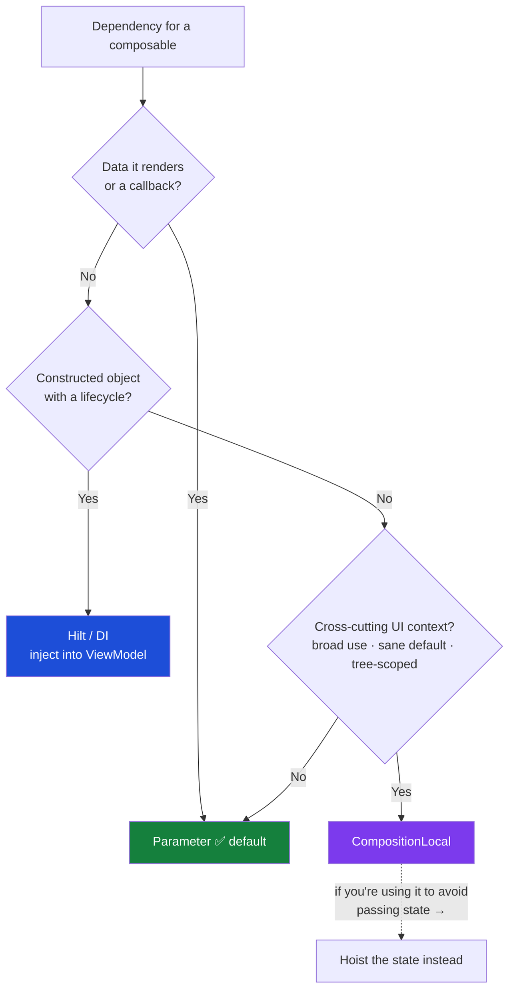
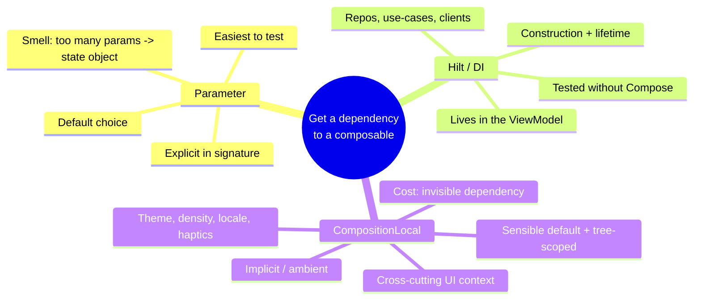

# Lesson 04 — CompositionLocal vs DI vs params

> After this lesson you can decide — defensibly — whether a dependency should be a parameter, injected with Hilt, or exposed as a CompositionLocal, and explain the hidden cost of implicit dependencies.

**Module:** 07 · **Lesson:** 04 · **Level:** 🟢🟡🔴 · **Est. time:** 75–95 min

---

## 1. Concept

### 🟢 For beginners — *what is it and why do I care?*

You now *can* put almost anything in a CompositionLocal. The grown-up question is **should you?** Most of the time the answer is **no** — a plain parameter is clearer. CompositionLocals are powerful precisely because they're *implicit*, and "implicit" is a double-edged sword: convenient to read, but invisible at the call site.

Three ways to get a dependency to a composable:

- **Parameter** — pass it in the function signature. Explicit, obvious, testable. The default.
- **Dependency Injection (Hilt)** — the framework constructs and supplies objects (repositories, use-cases) to ViewModels. The home for *business/data* dependencies.
- **CompositionLocal** — make it ambient for a subtree. For *cross-cutting UI context* that almost every composable might want and that's tedious to thread (theme, density, locale).

The instinct to build: **default to parameters; use DI for business dependencies; reserve CompositionLocal for genuinely ambient, UI-wide context.**

### 🟡 For intermediate devs — *the mechanism*

Each tool occupies a different layer:

| Tool | Lives at | Good for | Smell when misused |
|---|---|---|---|
| **Parameter** | the composable's signature | the data a component renders; callbacks | "20-parameter god composable" → group into a state object, not a local |
| **Hilt (DI)** | construction of VMs/objects | repositories, use-cases, network/db clients | injecting a *ViewModel* into a deep composable instead of hoisting state |
| **CompositionLocal** | the composition subtree | theme, density, locale, content color, an analytics/UI sink | passing *screen data* implicitly → invisible coupling |

The litmus question for CompositionLocal: **"Would nearly every composable in this subtree plausibly want this, and is it annoying to thread?"** Theme tokens: yes. The current user's *name to display on this one screen*: no — that's a parameter or comes from the screen's `UiState`.

A useful framing borrowed from the official guidance: a good CompositionLocal usually has a **sensible default**, is **tree-scoped** (not truly global), and is **cross-cutting** (used broadly, not by one consumer). If a value fails those, a parameter or DI is the better fit.

### 🔴 For senior devs — *trade-offs, edges, internals*

The senior calculus is about **coupling, testability, and traceability**:

- **CompositionLocals are implicit dependencies — the cost is invisibility.** A composable that reads `LocalFoo.current` has a dependency that **doesn't appear in its signature**. You can't tell from the call site what it needs; you can't satisfy the dependency by reading the parameters; and refactors that move the composable can silently change its behavior (different provider in scope). That invisibility is the entire reason to use locals *sparingly*. The function-signature contract is a feature you give up.

- **Testability diverges sharply.** A parameterized composable is trivially testable — pass fakes. A composable that reads several locals must have all of them **provided in the test harness**, or it crashes / uses defaults. It's doable (`CompositionLocalProvider` in the test), but it's friction, and it's easy to forget which locals a deep component needs. DI-supplied dependencies sit in the ViewModel, which you test *without Compose at all* — usually the easiest of the three.

- **DI vs CompositionLocal is not the same axis.** Hilt answers *"how is this object constructed and its lifetime managed?"*; CompositionLocal answers *"how is an already-existing value made ambient to a UI subtree?"* They compose: Hilt builds an `ImageLoader` once (singleton), and you *provide* that instance through a `LocalImageLoader` so deep composables read it without a parameter. Using a local to *construct* dependencies, or using DI field-injection deep in the UI, are both anti-patterns — each tool stays in its lane.

- **CompositionLocal is not service location.** It's tempting to treat `LocalEverything.current` as a global registry. Resist it: you lose explicitness, you make every reader untestable in isolation, and you reintroduce the hidden-singleton problems Compose's UDF model exists to kill. If you find yourself reaching for a local to avoid passing state, that's usually state that should be **hoisted** (Module 03), not made ambient.

- **Stability and recomposition still apply.** A dynamic local carrying an unstable type can widen recomposition; a static local carrying a changing value recomposes its subtree (Lesson 02). Parameters interact with **strong skipping**: a composable skips when its params are stable and unchanged — but reading a *changing* local inside it can still invalidate it. So locals can quietly defeat skipping if you're not deliberate.

- **The "implicit but justified" cases.** Theme (`MaterialTheme`), density, layout direction, content color, and a few app-wide UI services (haptics, an analytics/snackbar sink) are the canonical *justified* locals: cross-cutting, sensible defaults, tree-scoped. Almost everything else — screen data, single-screen callbacks, business objects — is better as a parameter or DI.

### Analogy

**Plumbing a building.** **Parameters** are handing someone a labeled water bottle — explicit, you see exactly what they got. **DI** is the municipal water utility deciding how water is produced and pressurized before it ever reaches the building — lifecycle and construction. **CompositionLocal** is the building's ambient supply on each floor (water, power, air): convenient, you just tap in — but if a room behaves oddly you now have to ask *which floor's supply is it tapping?*, because it's not written on the room's door. You'd never run *drinking water for one specific desk* through the building's ambient air system; you'd hand them a bottle.

### Mental model

> **Parameter by default; DI for business/data dependencies; CompositionLocal only for cross-cutting, sensibly-defaulted, tree-scoped UI context.** Implicit is convenient to read and expensive to trace.

### Real-world example

A media app: the `VideoRepository` and `AnalyticsClient` are **Hilt-injected** into ViewModels. A screen's `PlayerUiState` (position, buffering, title) is passed as a **parameter** to the stateless `PlayerScreen`. The app's theme, density, and a shared `LocalHapticFeedbackSink` are **CompositionLocals** — every control might trigger a haptic, and threading a haptics object through every button would be miserable. Three tools, three jobs, no overlap.

---

## 2. Visual Learning

**ASCII — the decision tree:**
```text
Need to get a dependency to a composable?
        │
        ├─ Is it the data this component renders, or a callback it fires?
        │        └─ YES → PARAMETER  (explicit, testable, default choice)
        │
        ├─ Is it a constructed object with a lifecycle (repo, use-case, client)?
        │        └─ YES → HILT / DI  (inject into the ViewModel; hoist state out)
        │
        └─ Is it cross-cutting UI context, used broadly, with a sensible default,
           scoped to a subtree (theme, density, locale, haptics/analytics sink)?
                 └─ YES → COMPOSITIONLOCAL
                 └─ NO  → go back up: it's probably a PARAMETER or hoisted STATE
```

**Mermaid — choosing the tool:**


**Mind map — the three tools at a glance:**


**Illustration prompt (paste into an image generator):**
```text
Illustration: a building-plumbing metaphor as a clean infographic with three labeled paths
into a single "Composable" room. Path 1 "Parameter": a hand passing a labeled water bottle
directly (explicit). Path 2 "Hilt / DI": a municipal water-treatment plant feeding pressurized
pipes (construction + lifecycle). Path 3 "CompositionLocal": ambient floor utilities (air vents,
power) the room taps into, with a small caption "convenient, but which floor supplies it?".
A signpost in the middle reads "Default: pass the bottle." Modern, vibrant, isometric, clearly
labeled, soft gradients.
```

---

## 3. Code

### 🟢 Beginner — parameter vs local for the *same* value

```kotlin
// ✅ Screen DATA → parameter. Explicit, obvious, testable.
@Composable
fun PriceLabel(priceText: String, modifier: Modifier = Modifier) {
    Text(priceText, modifier, style = MaterialTheme.typography.titleMedium)
}

// ✅ Cross-cutting UI context (theme tokens) → already a CompositionLocal (MaterialTheme).
@Composable
fun SectionHeader(title: String) {
    // colorScheme/typography come from ambient theme locals — you don't pass them in.
    Text(title, color = MaterialTheme.colorScheme.primary, style = MaterialTheme.typography.headlineSmall)
}
```

**Explanation.** The *price to show* is data this component renders → a parameter. The *theme* is cross-cutting context every component wants → an ambient local (Material provides it for you). Same mechanism could express both; the right *choice* differs.

**Common mistakes.**
```kotlin
// ❌ Screen data smuggled through a CompositionLocal → invisible coupling, hard to test.
val LocalPriceText = compositionLocalOf { "" }
@Composable fun PriceLabel() { Text(LocalPriceText.current) } // where does this come from? who knows.
```
Now `PriceLabel`'s input is invisible at the call site, and any test must remember to provide `LocalPriceText`. A parameter would've been clearer and trivially testable.

**Best practices.**
- If it's the data a component renders, it's a **parameter** — full stop.
- Lean on the built-in theme locals; don't reinvent ambient theming as ad-hoc locals.

---

### 🟡 Intermediate — DI for the object, parameter for the state

```kotlin
// Hilt constructs the repository (lifecycle/DI) and provides it to the ViewModel.
@HiltViewModel
class CatalogViewModel @Inject constructor(
    private val repo: CatalogRepository,    // ← DI: business dependency
) : ViewModel() {
    private val _state = MutableStateFlow(CatalogUiState())
    val state: StateFlow<CatalogUiState> = _state.asStateFlow()
    fun onEvent(e: CatalogEvent) { /* … */ }
}

@Composable
fun CatalogRoute(viewModel: CatalogViewModel = hiltViewModel()) {
    val state by viewModel.state.collectAsStateWithLifecycle()
    // State + events are PARAMETERS into the stateless screen — testable without Hilt or Compose plumbing.
    CatalogScreen(state = state, onEvent = viewModel::onEvent)
}

@Composable
fun CatalogScreen(state: CatalogUiState, onEvent: (CatalogEvent) -> Unit) {
    LazyColumn {
        items(state.products, key = { it.id }) { product ->
            ProductRow(product = product, onClick = { onEvent(CatalogEvent.Open(product.id)) })
        }
    }
}
```

**Explanation.** The *repository* is constructed and lifetime-managed by Hilt (DI's job). The *screen state* and *events* are plain parameters into a stateless `CatalogScreen` — so the screen is testable with a hand-built `CatalogUiState`, no Hilt, no providers. Each tool does the job it's best at.

**Common mistakes.**
```kotlin
// ❌ Reaching for a CompositionLocal to avoid passing state down two levels.
val LocalCatalogState = compositionLocalOf { CatalogUiState() }
@Composable fun ProductRow() { val s = LocalCatalogState.current /* … */ }  // that's hoisting, done wrong
```
```kotlin
// ❌ Field-injecting a repository deep in the UI instead of going through the ViewModel.
@Composable fun ProductRow(@Inject repo: CatalogRepository) { … }  // not how Compose DI works; couples UI to data
```
- Using a local to dodge passing state is mis-applied hoisting — pass the state (or hoist properly).
- Business dependencies belong in the ViewModel via DI, not field-injected into composables.

**Best practices.**
- DI supplies **objects** to ViewModels; parameters supply **state/events** to composables.
- Keep screens **stateless** and parameter-driven so they test without DI or providers.

---

### 🔴 Production — a justified CompositionLocal: an app-wide UI sink

```kotlin
// A cross-cutting UI service almost every control might use: haptics + snackbar.
@Stable
class UiEffects(
    val haptics: HapticFeedback,
    val snackbar: SnackbarHostState,
)

// Required → throwing default (no meaningful empty instance).
val LocalUiEffects = staticCompositionLocalOf<UiEffects> {
    error("No UiEffects provided. Wrap your app in ProvideUiEffects { … }.")
}

@Composable
fun ProvideUiEffects(content: @Composable () -> Unit) {
    val haptics = LocalHapticFeedback.current          // built-in local
    val snackbar = remember { SnackbarHostState() }
    val effects = remember(haptics, snackbar) { UiEffects(haptics, snackbar) }  // stable identity
    CompositionLocalProvider(LocalUiEffects provides effects) {
        Scaffold(snackbarHost = { SnackbarHost(snackbar) }) { padding ->
            Box(Modifier.padding(padding)) { content() }
        }
    }
}

@Composable
fun ConfirmButton(text: String, onConfirm: () -> Unit) {
    val effects = LocalUiEffects.current
    val scope = rememberCoroutineScope()
    Button(onClick = {
        effects.haptics.performHapticFeedback(HapticFeedbackType.Confirm)
        onConfirm()
        scope.launch { effects.snackbar.showSnackbar("Saved") }
    }) { Text(text) }
}
```

**Explanation.** Haptics + snackbar are genuinely cross-cutting: *any* button might fire them, and threading two objects through every control would be miserable — the textbook case for a CompositionLocal. It's **required** (throwing default), carries a **stable** object (so the static local's blast radius never triggers — Lesson 02), and is **tree-scoped** to the app. The *business* action stays an `onConfirm` **parameter**, so `ConfirmButton` is still explicit about what it *does*, even while ambiently sourcing *how it gives feedback*.

**Common mistakes.**
```kotlin
// ❌ Putting the business action in the local too → now the button's behavior is fully invisible.
val LocalOnConfirm = compositionLocalOf<() -> Unit> { {} }
@Composable fun ConfirmButton() { val onConfirm = LocalOnConfirm.current; /* what does this button do?? */ }

// ❌ Re-creating UiEffects on every recomposition → unstable identity, defeats static, churns providers.
val effects = UiEffects(haptics, SnackbarHostState())  // no remember → new object every time
```
- Making the *action* ambient erases the call-site contract entirely — keep behavior as parameters.
- Forgetting `remember` gives the local an unstable value, reintroducing recomposition cost.

**Best practices.**
- Use a local only for the **cross-cutting, default-able, tree-scoped** part; keep **behavior and screen data as parameters**.
- Carry a **stable** (`@Stable`/`remember`ed) object; make required locals fail loudly.
- Compose the tools: built-in local (`LocalHapticFeedback`) → your stable holder → provided once at the app root.

---

## 4. Interview Questions

**🟢 Beginner**

1. *What's the default way to give a composable a dependency, and why?*
   > A **parameter** — it's explicit in the signature, obvious at the call site, and trivial to test by passing a fake. Reach for anything fancier only when a parameter is genuinely awkward.
2. *Name one thing that's a good fit for a CompositionLocal and one that isn't.*
   > Good: theme/density/locale/content color — cross-cutting UI context with sensible defaults. Not good: a single screen's data or a button's click handler — those should be parameters.

**🟡 Intermediate**

3. *DI (Hilt) vs CompositionLocal — what different questions do they answer?*
   > Hilt answers *how an object is constructed and its lifetime managed* (repositories, clients) and supplies them to ViewModels. CompositionLocal answers *how an existing value is made ambient to a UI subtree*. They compose: inject the object, then provide that instance via a local if deep UI needs it.
4. *Your composable has 18 parameters. Is that a reason to use CompositionLocals?*
   > Usually no. It's a sign to **group related parameters into a state object** (or hoist them), not to hide them in ambient locals. Locals would trade an explicit-but-long signature for invisible dependencies and harder tests.

**🔴 Senior**

5. *What is the core cost of a CompositionLocal, and how does it affect testing and refactoring?*
   > Its dependency is **implicit** — invisible in the signature. Tests must provide every local the composable (transitively) reads or it crashes/uses defaults; you can't satisfy the dependency from parameters. Refactors that relocate the composable can silently change behavior because a different provider is in scope. That invisibility is exactly why locals are used sparingly.
6. *When is a CompositionLocal genuinely the right call over a parameter?*
   > When the value is **cross-cutting** (broadly used across the subtree), has a **sensible default**, and is **tree-scoped** rather than per-consumer — e.g. theme, density, layout direction, an app-wide haptics/analytics sink. If it fails any of those (especially "broadly used"), prefer a parameter or DI.
7. *How can CompositionLocals interact badly with strong skipping?*
   > A composable with stable, unchanged parameters can skip — but if it reads a *changing* dynamic local internally, that read invalidates it, defeating the skip. And a static local carrying a changing value recomposes its whole subtree regardless of parameter stability. So locals can quietly undermine the skipping you'd get from clean parameters if you're not deliberate about what changes.

---

## 5. AI Assistant

**Prompt example (deciding the tool):**
```text
For each dependency below in my Compose 2026 / Material 3 app, tell me whether it should be a
parameter, Hilt-injected into the ViewModel, or a CompositionLocal — and justify each using
(a) is it screen data/callback, (b) does it need construction/lifecycle, (c) is it cross-cutting
UI context with a sensible default and tree scope. Flag anything that's really hoisted state in
disguise. Dependencies: [list them].
```

**AI workflow — where it helps on *this* topic.**
- ✅ Good for: classifying a list of dependencies, refactoring a "god composable" into a state object, and wiring a justified local (stable holder + provider) once you've decided.
- ⚠️ Not for: making the *judgment call* unquestioned. Models over-use CompositionLocals to "clean up" parameter lists and will happily smuggle screen state or callbacks into locals. The decision is yours; use the model to enumerate options and trade-offs.

**Review workflow — map to *Common Mistakes*:**
- Is **screen data or a callback** hidden in a local? → make it a parameter.
- Is a **business object** field-injected into a composable instead of DI'd into a ViewModel?
- Is a local being used to **dodge hoisting** state? → hoist it properly.
- For a justified local: **stable** (`remember`/`@Stable`) value, **sensible/throwing default**, **tree-scoped**, used **broadly**?
- Could a changing local be **defeating strong skipping** on an otherwise-skippable composable?

**Validation workflow — prove it actually works:**
1. **Testability check**: can you test the composable by passing parameters only? If it needs a pile of `CompositionLocalProvider`s in the test, reconsider what's a local.
2. **Signature audit**: read the function signature alone — can a new dev tell what it depends on? Implicit deps shouldn't hide load-bearing inputs.
3. **Recomposition counts**: confirm a justified local isn't widening recomposition (Layout Inspector) versus the parameter version.
4. **Remove-the-provider test**: a required local with a throwing default should fail loudly with an actionable message when unprovided.

> **AI drafts, you decide.** The whole module lands here: locals are a sharp tool for *cross-cutting, default-able, tree-scoped* context. If the model reaches for one to tidy a parameter list, route it back through the decision tree — explicit beats implicit until implicit clearly wins.

---

## Recap / Key takeaways

- **Default to parameters.** They're explicit, testable, and obvious at the call site.
- **DI (Hilt)** is for *constructing and managing* business/data objects, supplied to ViewModels — a different axis from CompositionLocal.
- **CompositionLocal** is for **cross-cutting UI context** with a **sensible default**, used **broadly**, **scoped to a subtree** (theme, density, locale, haptics/analytics sinks).
- The cost of a local is **invisibility**: implicit dependencies are harder to test, trace, and refactor — so use them sparingly.
- A long parameter list means **group into a state object or hoist**, not "hide it in a local"; and watch that a changing local doesn't defeat **strong skipping**.

---

### 🏁 Module 07 complete

You can now read built-in ambients, choose `static` vs dynamic by recomposition blast radius, build and provide your own locals with the right default and infix function, and — most importantly — decide *when not to* reach for a CompositionLocal at all. Next, you leave the composition phase entirely and drop into the **draw phase**.

➡️ Next module: **[Module 08 — Compose Canvas & Graphics](../module-08-canvas-graphics/README.md)** — render custom visuals and charts efficiently with `DrawScope`, `graphicsLayer`, and deferred draw-phase reads.
