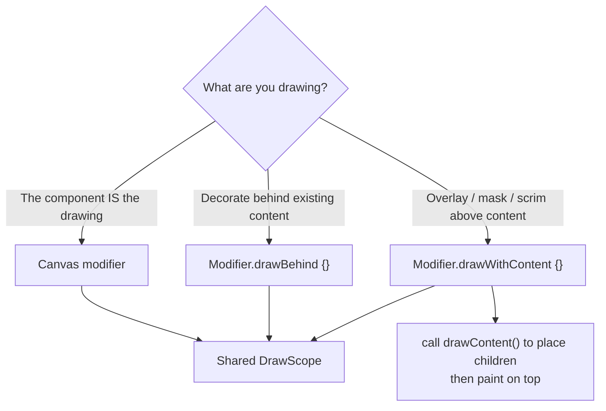

# Lesson 01 — The Draw Phase & DrawScope

> After this lesson you can drop into Compose's draw phase with `Canvas`, `Modifier.drawBehind`, and `Modifier.drawWithContent`, and explain why drawing in a lambda is a performance superpower.

**Module:** 08 · **Lesson:** 01 · **Level:** 🟢🟡🔴 · **Est. time:** 70–85 min

---

## 1. Concept

### 🟢 For beginners — *what is it and why do I care?*

Most of the time in Compose you arrange **components** — a `Text` here, an `Image` there, a `Column` to stack them. But sometimes there is no component for what you want: a progress ring, a sparkline, a custom badge shape, a signature pad. For those, you **draw the pixels yourself**.

Compose gives you a drawing surface called **`Canvas`**, and inside it a toolbox called **`DrawScope`**. `DrawScope` has methods like `drawCircle`, `drawLine`, `drawRect`, and `drawPath`. You give them a color, a position, and a size, and they paint onto the area your composable occupies.

```kotlin
Canvas(modifier = Modifier.size(100.dp)) {
    drawCircle(color = Color.Red)   // fills the 100×100 area with a red circle
}
```

The key beginner idea: **you are not creating widgets, you are painting.** There is no "circle object" you can later find and change. Every frame, Compose hands you a blank scope and you paint the current picture. Want the circle to move? Change the data the painting reads, and Compose re-runs your drawing.

### 🟡 For intermediate devs — *the mechanism*

Compose renders every frame in **three phases**, in this order:

1. **Composition** — *what* to show. Your `@Composable` functions run and build the UI tree.
2. **Layout** — *where* and *how big*. Each node is measured and placed.
3. **Draw** — *what it looks like*. Each node paints itself onto the canvas.

The draw phase is the last one, and it is where `DrawScope` lives. You can hook into it three ways:

| API | What it is | When to reach for it |
|---|---|---|
| `Canvas(modifier)` | A dedicated empty composable that *only* draws. | The drawing **is** the component (a chart, a ring). |
| `Modifier.drawBehind { }` | Draws **behind** a composable's content. | Decorate an existing composable (a background, an underline). |
| `Modifier.drawWithContent { }` | You control **when** content draws via `drawContent()`. | Overlays, scrims, masks — draw before *and* after the content. |

`Canvas` is literally implemented as `Spacer(modifier.drawBehind(onDraw))` — so all three share the same `DrawScope`. Learn the scope once, use it everywhere.

`DrawScope` exposes a coordinate system in **pixels** with the origin `(0, 0)` at the **top-left**, plus two properties you'll use constantly: `size` (the area you can paint, a `Size` in pixels) and `center` (a convenient `Offset`). It also gives you density-aware helpers: `10.dp.toPx()` converts dp to pixels inside the scope.

### 🔴 For senior devs — *trade-offs, edges, internals*

The single most important property of the draw phase: **the draw lambda is not part of composition.** When you write `drawBehind { ... }`, that lambda is stored and invoked during the draw phase — *after* composition and layout have finished. This has three consequences that separate seniors from juniors:

- **State reads inside a draw lambda only invalidate draw — not composition.** If you read an animated `Float` inside `drawBehind { }`, Compose re-runs *only the draw lambda* on each frame, skipping composition and layout entirely. This is the **deferred read** optimization and it is the foundation of cheap Compose animation. Reading the same value in the composable body would re-run the whole function 60–120 times per second. (Full phase treatment lives in [Module 11 — Performance](../module-11-performance/README.md).)

- **The draw phase runs on every frame for that node when invalidated, so it must be allocation-free.** A `Paint`, `Path`, or `Brush` created *inside* the lambda is allocated per frame and feeds the garbage collector, causing jank. Hoist and `remember` them. The draw lambda is your hottest loop — treat it like one.

- **`DrawScope` is a declarative façade over `Canvas`/`drawscope` primitives**, but it is *not* infinitely cheap. Each `drawX` call issues a draw command. Overdraw (painting the same pixel many times) and huge `Path`s still cost GPU time. For genuinely expensive, rarely-changing drawings, cache into a layer (`Modifier.graphicsLayer { }`, Lesson 03) or an offscreen `Picture`/`ImageBitmap`.

There's also a subtlety with `drawWithContent`: it lets you sequence `drawContent()` against your own commands, which is how you build masks (`BlendMode.Clear`), reveal animations, and scrims that sit *above* children. `drawBehind` can only paint underneath. Choosing the right hook is a correctness decision, not just style.

### Analogy

Think of an **animator's lightbox with onion-skinning**. Composition decides the *script* (which character is on stage). Layout decides *where* they stand and how big. Draw is the animator at the lightbox inking the actual frame. Crucially, to make the character blink, the animator doesn't rewrite the script — they just re-ink the frame. Re-inking (draw) is far cheaper than rewriting the script (composition). Reading animated state in the draw lambda is "only re-ink the frame."

### Mental model

> **Draw is a lambda that runs in the last phase. A value read inside it re-runs only the painting — not the function.** Keep the brush; repaint the picture.

### Real-world example

A **circular progress indicator** on a fitness app's "rings." The percentage animates from 0 to 0.8 over a second. If you read that animated float in `drawBehind { drawArc(...) }`, only the arc repaints each frame — the surrounding card, labels, and layout never recompose. That's how you get a buttery 120 Hz ring on a mid-range phone.

---

## 2. Visual Learning

**ASCII — the three phases and where draw sits:**
```text
   ┌─────────────┐      ┌──────────────┐      ┌───────────────────────┐
   │ COMPOSITION │ ───▶ │    LAYOUT    │ ───▶ │         DRAW          │
   │  what tree? │      │ measure+place│      │  DrawScope paints px  │
   └─────────────┘      └──────────────┘      └───────────────────────┘
        slow                 medium                 fast (per frame)
                                                       │
         read animated state HERE  ───────────────────┘  → only DRAW re-runs
         read it in the composable body  ─────────────────▶ COMPOSITION re-runs (expensive)
```

**ASCII — the DrawScope coordinate system:**
```text
 (0,0) ───────────── x = size.width ──▶
   │  ┌───────────────────────────┐
   │  │                           │
   │  │            • center       │   center = Offset(width/2, height/2)
   │  │                           │
   y  └───────────────────────────┘
   │  y = size.height
   ▼          (units are PIXELS, not dp — use 10.dp.toPx())
```

**Mermaid — choosing your draw hook:**


**Illustration prompt (paste into an image generator):**
```text
Illustration: a three-station assembly line for a single picture frame, left to right.
Station 1 labeled "COMPOSITION" shows a blueprint/script being chosen.
Station 2 labeled "LAYOUT" shows a ruler measuring and positioning an empty frame.
Station 3 labeled "DRAW" shows an artist's hand with a glowing brush inking the actual image inside the frame.
A bright looping arrow goes from a small "animated value" dial directly back to Station 3 only,
bypassing Stations 1 and 2, captioned "deferred read = repaint only".
Modern, vibrant, soft gradients, clear station labels, studio lighting.
```

---

## 3. Code

> All sizes inside `DrawScope` are **pixels**. Convert dp with `.toPx()`. We `remember` brushes/paths from the start — the draw lambda is a hot path.

### 🟢 Beginner — your first Canvas

```kotlin
@Composable
fun RedDot(modifier: Modifier = Modifier) {
    Canvas(modifier = modifier.size(120.dp)) {
        // Inside DrawScope: size, center, and drawX helpers are available.
        drawCircle(
            color = Color(0xFFE53935),
            radius = size.minDimension / 2f,   // fit the smaller side
            center = center,                    // provided by DrawScope
        )
    }
}
```

**Explanation.** `Canvas` creates a composable whose whole job is to draw. The lambda *is* a `DrawScope`, so `size`, `center`, and `drawCircle` are all in scope. `size.minDimension` is the smaller of width/height in pixels, so the circle always fits even on a non-square area.

**Common mistakes.**
```kotlin
// ❌ No size: Canvas has nothing to draw into → you see nothing.
Canvas(modifier = Modifier) { drawCircle(Color.Red) }

// ❌ Treating DrawScope units as dp: radius = 120 here means 120 *pixels*, not 120.dp.
Canvas(Modifier.size(120.dp)) { drawCircle(Color.Red, radius = 120f) } // overflows
```
A `Canvas` with no size constraint collapses to zero and paints nothing. And every number in `DrawScope` is a raw pixel — `radius = 120f` is 120 px regardless of screen density, which looks different on every device.

**Best practices.**
- Always give `Canvas` a size (via `Modifier.size`, `fillMaxSize`, `aspectRatio`, etc.).
- Convert design values with `.toPx()`: `radius = 40.dp.toPx()`.
- Use `size`, `center`, and `size.minDimension` instead of hard-coded numbers so the drawing scales.

---

### 🟡 Intermediate — decorate existing content with `drawBehind`

```kotlin
@Composable
fun UnderlinedLabel(
    text: String,
    accent: Color = MaterialTheme.colorScheme.primary,
    modifier: Modifier = Modifier,
) {
    val strokePx = with(LocalDensity.current) { 3.dp.toPx() }

    Text(
        text = text,
        modifier = modifier
            .drawBehind {
                // Paint an accent underline behind the text, full width, at the bottom.
                drawLine(
                    color = accent,
                    start = Offset(0f, size.height),
                    end = Offset(size.width, size.height),
                    strokeWidth = strokePx,
                    cap = StrokeCap.Round,
                )
            }
            .padding(bottom = 4.dp),
    )
}
```

**Explanation.** `drawBehind` paints *underneath* the `Text`'s own rendering, so the underline sits behind/below the glyphs without a second composable. The line spans `0 → size.width`, where `size` is the `Text`'s measured area in pixels. We compute `strokePx` **once** outside the lambda so we don't convert dp every frame.

**Common mistakes.**
```kotlin
// ❌ Converting dp inside the draw lambda runs the density math on every draw.
Modifier.drawBehind {
    drawLine(/*...*/, strokeWidth = 3.dp.toPx())  // toPx() needs density; cheaper to hoist
}

// ❌ Using drawBehind when you actually need to paint ON TOP of content.
Modifier.drawBehind { drawRect(scrimColor) }  // scrim ends up UNDER the text → invisible
```
`drawBehind` is *behind only*. For a scrim/overlay that covers content, you need `drawWithContent` (next tier). And while `dp.toPx()` inside the lambda compiles, hoisting it keeps the hot path clean.

**Best practices.**
- Reach for `drawBehind` to decorate a real composable (backgrounds, underlines, badges).
- Hoist dp→px conversions and any `Brush`/`Path` outside the lambda.
- Read animated/changing values *inside* the lambda so only draw re-runs (we lean on this in Lesson 03).

---

### 🔴 Production — an overlay mask with `drawWithContent`, allocation-free and accessible

```kotlin
/**
 * Fades the bottom edge of scrollable content so text doesn't hard-clip at the boundary.
 * The gradient is hoisted+remembered; nothing is allocated during draw.
 */
@Composable
fun BottomFadingEdge(
    fadeHeight: Dp = 32.dp,
    modifier: Modifier = Modifier,
    content: @Composable () -> Unit,
) {
    val fadePx = with(LocalDensity.current) { fadeHeight.toPx() }

    Box(
        modifier = modifier
            .drawWithContent {
                drawContent()                       // 1) draw the children first
                // 2) paint a transparent→opaque scrim over the bottom edge, ON TOP.
                drawRect(
                    brush = Brush.verticalGradient(
                        0f to Color.Transparent,
                        1f to Color.Black,
                        startY = size.height - fadePx,
                        endY = size.height,
                    ),
                    topLeft = Offset(0f, size.height - fadePx),
                    size = Size(size.width, fadePx),
                    blendMode = BlendMode.DstIn,     // keep dest where scrim is opaque → fades it out
                )
            }
            .graphicsLayer { }                       // isolate into a layer so BlendMode composites correctly
            .semantics { /* decorative: no contentDescription */ },
    ) {
        content()
    }
}
```

**Explanation.** `drawWithContent` hands you control over *ordering*: we call `drawContent()` to render the children, then paint a gradient **on top** using `BlendMode.DstIn`, which keeps the destination (the content) only where our scrim is opaque — producing a true alpha fade, not a black overlay. The `graphicsLayer { }` forces the content into its own offscreen layer so the blend composites against transparency instead of whatever is behind the `Box`. The gradient brush is computed from `size` each draw but allocates only a lightweight `Brush`; the dp conversion is hoisted. It's purely decorative, so it carries no semantics.

**Common mistakes.**
```kotlin
// ❌ Forgetting drawContent(): children never render — you get only your scrim.
Modifier.drawWithContent {
    drawRect(fadeBrush)   // where did my list go? you never called drawContent()
}

// ❌ Using a BlendMode without a layer: it blends against the parent's pixels, not transparency.
Modifier.drawWithContent {
    drawContent()
    drawRect(brush = fade, blendMode = BlendMode.DstIn)   // no graphicsLayer → wrong result
}
```
`drawWithContent` will draw **only** what you tell it — omit `drawContent()` and the children vanish. And alpha-compositing blend modes need an isolated layer (`graphicsLayer`) or they composite against the wrong backdrop.

**Best practices.**
- Use `drawWithContent` when ordering matters (overlays, masks, reveals); call `drawContent()` exactly where you want children to appear.
- Wrap blend-mode masking in a `graphicsLayer` so it composites against transparency.
- Mark decorative drawing as non-semantic; never hide meaningful content behind a fade for screen readers.
- Hoist brushes/paths/dp-conversions; keep the draw lambda allocation-free.

---

## 4. Interview Questions

**🟢 Beginner**

1. *What is `DrawScope` and where do you get one?*
   > `DrawScope` is the drawing receiver that exposes `drawCircle`, `drawLine`, `drawRect`, `drawPath`, plus `size` and `center`. You get one inside `Canvas { }`, `Modifier.drawBehind { }`, and `Modifier.drawWithContent { }`.
2. *What units does `DrawScope` use, and how do you convert from dp?*
   > Pixels, with origin at the top-left. Convert design dp values with `.toPx()` (e.g. `10.dp.toPx()`), since the scope is a `Density` receiver.

**🟡 Intermediate**

3. *`Canvas` vs `Modifier.drawBehind` vs `Modifier.drawWithContent` — when each?*
   > `Canvas` when the drawing *is* the component. `drawBehind` to paint **behind** an existing composable's content (backgrounds, underlines). `drawWithContent` when you must control ordering relative to children — you call `drawContent()` yourself, so you can paint before and/or after them (overlays, masks, scrims).
4. *Why is reading an animated value inside a draw lambda cheaper than reading it in the composable body?*
   > A draw lambda runs in the draw phase. A state read there invalidates **only draw**, so Compose repaints without re-running composition or layout. Reading it in the body invalidates composition, re-running the whole function (and layout) every frame.

**🔴 Senior**

5. *Why must the draw lambda be allocation-free, and what do you do about it?*
   > It can run on every frame when invalidated (e.g. during animation), so allocating a `Paint`, `Path`, or `Brush` inside it produces per-frame garbage and GC jank. Hoist and `remember` those objects outside the lambda; only cheap, value-type math (offsets, sizes) should happen inside.
6. *Why does a `BlendMode.DstIn` mask need a `graphicsLayer`, and what breaks without one?*
   > Alpha-compositing blend modes blend your draw command against the *destination buffer*. Without an isolated layer, the destination is the parent's already-painted pixels, so the mask composites against the wrong backdrop (e.g. a black rectangle instead of a fade). A `graphicsLayer` renders the content into its own offscreen buffer initialized to transparent, so the blend produces the intended alpha result.

---

## 5. AI Assistant

**Prompt example (generating a custom draw):**
```text
Write a Compose composable that draws a circular "battery ring": a light grey full circle
and a coloured arc from the top (12 o'clock) clockwise for a `progress: Float` (0f..1f).
Constraints: Compose 2026 BOM, Kotlin 2.x. Use DrawScope; read `progress` inside the draw
lambda so only the draw phase invalidates. Hoist any Stroke/Brush with remember. Sizes via
.toPx(). No Paint allocated inside the lambda. Add the stroke cap as Round.
```

**AI workflow — where it helps on *this* topic.**
- ✅ Great for: trig/geometry boilerplate (arc start angles, offsets), translating a design mock into `drawX` calls, generating the `drawWithContent` ordering for an overlay.
- ⚠️ Not yet: deciding *which hook* (`Canvas` vs `drawBehind` vs `drawWithContent`) fits the design intent, and judging whether a drawing is cheap enough — that's your call. Models also love to allocate `Paint`/`Path` inside the lambda.

**Review workflow — check AI output against this lesson's *Common Mistakes*:**
- Is every number a `.toPx()` conversion, not a raw dp value pasted as a float?
- Are `Brush`/`Path`/`Stroke`/`Paint` **hoisted + remembered**, not created inside the draw lambda?
- If it's an overlay/mask, did it call `drawContent()` and isolate blend modes in a `graphicsLayer`?
- Did it read changing values *inside* the lambda (deferred), not in the composable body?

**Validation workflow — prove it actually works:**
1. **Compile & preview** with a `@Preview`; eyeball the shape at a couple of sizes (square and non-square).
2. Drive any animated input and watch for jank; open **Layout Inspector → recomposition counts** and confirm the *composable* count stays flat while the drawing animates (proving the read is deferred to draw).
3. Run a quick **Macrobenchmark** frame-timing pass on the screen if it's in a scroll container; look for dropped frames from per-frame allocation.
4. Test on a high-density device to confirm `.toPx()` scaling looks right.

> **AI drafts, you decide.** If the generated draw lambda allocates or reads state too high, route it back through the hoist-and-defer checklist before merging.

---

## Recap / Key takeaways

- Compose renders in three phases — **Composition → Layout → Draw** — and `DrawScope` lives in the last one.
- Three doors into draw: **`Canvas`** (the drawing *is* the component), **`drawBehind`** (paint behind content), **`drawWithContent`** (control ordering; call `drawContent()` yourself).
- `DrawScope` works in **pixels** from a **top-left origin**; convert with **`.toPx()`** and use `size`/`center` to stay scale-correct.
- Reading changing state **inside the draw lambda** invalidates *only draw* — the deferred-read superpower behind cheap animation.
- The draw lambda is a **hot path**: hoist and `remember` brushes/paths/paints; keep it allocation-free.
- Blend-mode masks need a **`graphicsLayer`** to composite against transparency.

➡️ Next: **[Lesson 02 — Shapes, Paths & Text](02-shapes-paths-text.md)** — lines, arcs, building a `Path`, and drawing measured text with `TextMeasurer`.
