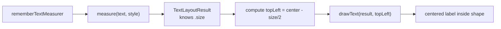
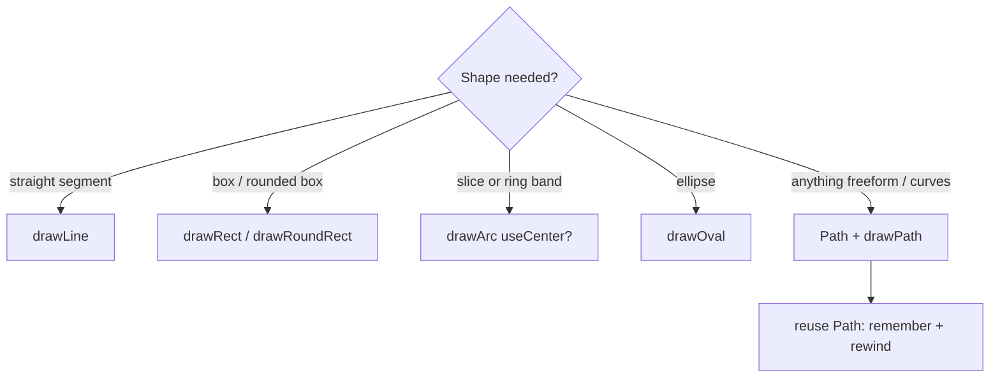

# Lesson 02 — Shapes, Paths & Text

> After this lesson you can draw lines, arcs, and rectangles, compose freeform `Path`s with Béziers, and render measured text inside the draw phase with `TextMeasurer`.

**Module:** 08 · **Lesson:** 02 · **Level:** 🟢🟡🔴 · **Est. time:** 80–95 min

---

## 1. Concept

### 🟢 For beginners — *what is it and why do I care?*

In [Lesson 01](01-draw-phase-drawscope.md) you painted simple shapes with `drawCircle`. But real visuals need more: a line for a divider, an arc for a progress ring, a rounded rectangle for a badge, and a wiggly curve for a sparkline. `DrawScope` has a primitive for each:

- `drawLine(start, end)` — a straight segment.
- `drawRect` / `drawRoundRect` — boxes, optionally with rounded corners.
- `drawArc` — a slice of a circle (think pie chart or progress ring).
- `drawOval` — an ellipse.
- `drawPath` — *anything else*: connect points, add curves, build a custom outline.

And often you want **words** inside your drawing — a percentage in the middle of a ring, a label on a bar. Drawing text is special, because the canvas needs to *measure* the text first (how wide and tall is "87%"?). That's what `TextMeasurer` is for.

The mental shift: a **`Path`** is like moving a pen on paper without lifting it. You `moveTo` a start point, then `lineTo` and `quadraticTo`/`cubicTo` to trace a shape, then optionally `close()` to join the end back to the start.

### 🟡 For intermediate devs — *the mechanism*

**Fill vs. stroke.** Every shape draws either *filled* (solid interior) or *stroked* (outline only). You choose with the `style` parameter: `Fill` (default) or `Stroke(width = ..., cap = ..., join = ...)`. `StrokeCap` controls line ends (`Butt`, `Round`, `Square`); `StrokeJoin` controls corners (`Miter`, `Round`, `Bevel`); `PathEffect` adds dashes/corners.

**`drawArc` geometry.** Angles are in **degrees**, `0°` points **right** (3 o'clock), and positive angles go **clockwise**. `startAngle` is where the arc begins; `sweepAngle` is how far it travels. `useCenter = true` draws a pie wedge (connects to center); `false` draws just the band — what you want for a progress ring.

**`Path` building.** A `Path` is an accumulator of segments:

```kotlin
val path = Path().apply {
    moveTo(x0, y0)              // lift pen, place it
    lineTo(x1, y1)             // straight segment
    quadraticTo(cx, cy, x2, y2) // one control point (gentle curve)
    cubicTo(c1x, c1y, c2x, c2y, x3, y3) // two control points (S-curves)
    close()                     // back to the start
}
drawPath(path, color, style = Stroke(2.dp.toPx()))
```

**Text.** You cannot just "draw a string" — you create (and `remember`) a `TextMeasurer` via `rememberTextMeasurer()`, call `measure(text, style)` to get a `TextLayoutResult` (which knows its `size`), then `drawText(layoutResult, topLeft = ...)`. Measuring is what lets you center text precisely inside a shape.

### 🔴 For senior devs — *trade-offs, edges, internals*

- **`Path` is mutable and expensive to allocate — reuse it.** Building a fresh `Path` every frame (e.g. a sparkline that animates) allocates and GCs. For animated paths, `remember` a single `Path` and `rewind()` it (cheaper than `reset()` — it keeps the backing memory) at the top of each draw, then re-emit segments. `rewind()` clears the verbs/points but retains capacity; `reset()` releases it. This is a real per-frame win on long paths.

- **`PathMeasure` unlocks "draw along a path."** Wrap a `Path` in a `PathMeasure` to get its total `length`, sample a position/tangent at any distance (`getPosition`, `getTangent`), or extract a sub-segment (`getSegment(start, stop, dst, true)`). Animating the `stop` distance from `0 → length` produces the classic "line draws itself" trace — and it's how animated vector strokes work (Lesson 05).

- **Text measurement is not free; cache by inputs.** `measure()` runs the text layout engine (font metrics, line breaking). For static labels, measure **once** and keep the `TextLayoutResult`. `TextMeasurer` itself has an internal cache keyed on the request, but you still shouldn't measure in a tight animated loop with changing strings. When the *string* changes every frame (a live counter), accept the cost or pre-render to an `ImageBitmap`.

- **Even-odd vs non-zero fill.** A self-intersecting or hole-containing `Path` fills according to its `PathFillType` (`NonZero` default, or `EvenOdd` for donut holes / overlap cut-outs). Getting a ring-with-hole "for free" is often a fill-type choice, not two draws.

- **`Path` combining.** `Path.op(a, b, PathOperation.Difference/Union/Intersect/Xor)` does boolean geometry on the CPU — great for masks and complex shapes, but it's a real computation; precompute and cache, never per frame.

### Analogy

A **plotter pen**. `moveTo` is "lift the pen and reposition." `lineTo` is "draw straight to here." `quadraticTo`/`cubicTo` are "curve toward this control magnet on the way." `close()` is "return to where you started." Filling vs stroking is whether you ink only the outline or flood the enclosed area. Text is a stamp you must size before you press it down so it lands centered.

### Mental model

> **A `Path` is a recorded pen journey; `drawArc` is a clock face in degrees (0° = 3 o'clock, clockwise). Text must be measured before it can be placed.** Reuse the pen and the ruler — don't buy new ones every frame.

### Real-world example

A **donut chart with a centered total**. The slices are `drawArc(useCenter = true)` calls with running start angles; the hole is an inner `drawCircle` in the background color (or an even-odd path). The "$1,240" in the middle is a measured `TextLayoutResult` placed at `center - size/2`. Every dashboard ships some version of this.

---

## 2. Visual Learning

**ASCII — arc angle geometry:**
```text
                90°  (6 o'clock, because y grows DOWN)
                 │
   180° ─────────┼───────── 0°   (3 o'clock = start of angles)
                 │
                270° (12 o'clock)

   drawArc(startAngle = -90f, sweepAngle = 270f, useCenter = false)
   ⟶ begins at 12 o'clock, sweeps 3/4 clockwise (typical "progress ring" setup)
```

**ASCII — a Path pen journey:**
```text
   moveTo(A) ●
              \  lineTo(B)
               \________●
               /        |
   quadraticTo(ctrl,C)  | control point • pulls the curve
      ●_______/         |
      C                 |
       \________________●  cubicTo(...) then close() ↺ back to A
```

**Mermaid — text rendering pipeline:**


**Mermaid — choosing a shape primitive:**


**Illustration prompt (paste into an image generator):**
```text
Illustration: a precise technical pen plotter on graph paper drawing a smooth curved path.
Show faint "control point" magnets pulling a Bézier curve, labeled moveTo / lineTo / cubicTo.
To the right, a clock-face overlay on a circle with degree ticks (0° at 3 o'clock, arrow sweeping clockwise) labeled "drawArc".
Bottom-centre, a ruler measuring the width of the word "87%" before a stamp presses it down, labeled "measure then place".
Modern technical-illustration style, clean lines, vibrant accents, clear labels.
```

---

## 3. Code

> Reuse paths and measurers via `remember`. Angles are degrees (0° = 3 o'clock, clockwise). All sizes are pixels — convert with `.toPx()`.

### 🟢 Beginner — a progress ring with `drawArc`

```kotlin
@Composable
fun ProgressRing(
    progress: Float,                 // 0f..1f
    modifier: Modifier = Modifier,
    trackColor: Color = Color(0xFFE0E0E0),
    fillColor: Color = Color(0xFF3F51B5),
    strokeWidth: Dp = 12.dp,
) {
    Canvas(modifier = modifier.size(120.dp)) {
        val stroke = Stroke(width = strokeWidth.toPx(), cap = StrokeCap.Round)
        val inset = strokeWidth.toPx() / 2f
        val arcSize = Size(size.width - inset * 2, size.height - inset * 2)
        val topLeft = Offset(inset, inset)

        // Full grey track…
        drawArc(trackColor, 0f, 360f, useCenter = false, topLeft, arcSize, style = stroke)
        // …then the coloured progress, starting at 12 o'clock (-90°), clockwise.
        drawArc(fillColor, -90f, 360f * progress.coerceIn(0f, 1f),
            useCenter = false, topLeft, arcSize, style = stroke)
    }
}
```

**Explanation.** Two arcs: a full grey ring, then a coloured arc whose `sweepAngle` is `360 * progress`. `useCenter = false` gives a band (not a pie wedge). We **inset** by half the stroke width so the thick stroke doesn't clip at the edges. `StrokeCap.Round` gives the rounded ends you see in modern UIs.

**Common mistakes.**
```kotlin
// ❌ No inset: half the stroke spills past the bounds and gets clipped flat.
drawArc(fillColor, -90f, 360f * progress, false, style = Stroke(strokeWidth.toPx()))

// ❌ Forgetting useCenter=false: you get a filled pie slice, not a ring.
drawArc(fillColor, -90f, 270f, useCenter = true, style = Stroke(...))
```
A stroked arc is centered on the geometric circle, so without an inset of `strokeWidth/2`, the outer half of the stroke clips against the canvas edge. And `useCenter = true` connects both ends to the center — a wedge, not a ring.

**Best practices.**
- Inset arc bounds by `strokeWidth / 2` so thick strokes don't clip.
- Use `useCenter = false` for rings/progress; `true` for pie wedges.
- `coerceIn(0f, 1f)` the progress so a bad input can't sweep past a full turn.

---

### 🟡 Intermediate — a sparkline with a reused `Path`

```kotlin
@Composable
fun Sparkline(
    data: ImmutableList<Float>,          // kotlinx.collections.immutable → stable
    modifier: Modifier = Modifier,
    lineColor: Color = MaterialTheme.colorScheme.primary,
) {
    val path = remember { Path() }       // reuse across frames; never reallocate

    Canvas(modifier = modifier) {
        if (data.size < 2) return@Canvas
        val maxV = data.max(); val minV = data.min()
        val range = (maxV - minV).takeIf { it != 0f } ?: 1f
        val stepX = size.width / (data.size - 1)

        path.rewind()                    // clear verbs/points, KEEP capacity
        data.forEachIndexed { i, v ->
            val x = i * stepX
            val y = size.height * (1f - (v - minV) / range)  // invert: y grows down
            if (i == 0) path.moveTo(x, y) else path.lineTo(x, y)
        }
        drawPath(path, color = lineColor, style = Stroke(width = 2.dp.toPx(), cap = StrokeCap.Round))
    }
}
```

**Explanation.** We map each data point into the canvas: `x` spreads points evenly across the width, `y` normalizes the value into `[0, height]` and **inverts** it (canvas y grows downward, so the max value should be near the top). The single `remember`ed `Path` is `rewind()`-ed each frame — clearing its contents but keeping its allocated capacity, so an animating sparkline doesn't churn the GC.

**Common mistakes.**
```kotlin
// ❌ Allocating a new Path every draw → per-frame garbage on a hot path.
Canvas(modifier) {
    val path = Path()                // reallocated every frame
    /* ... */
}

// ❌ Forgetting to invert Y → the chart is upside down.
val y = size.height * ((v - minV) / range)   // max value ends up at the BOTTOM
```
A fresh `Path()` per frame is the classic draw-phase allocation trap. And forgetting the `1f -` inversion is the single most common "why is my chart flipped?" bug, because screen y increases downward while charts read upward.

**Best practices.**
- `remember` one `Path` and `rewind()` it per frame instead of `Path()` each time.
- Normalize data to `[0,1]` then scale to `size`, and **invert y** for chart-up orientation.
- Take `ImmutableList` (`kotlinx.collections.immutable`) so the composable stays skippable (stability matters — Module 11).

---

### 🔴 Production — donut metric with centered measured text

```kotlin
@Composable
fun DonutMetric(
    fraction: Float,                       // 0f..1f, e.g. 0.72f
    centerLabel: String,                   // e.g. "72%"
    modifier: Modifier = Modifier,
    ringColor: Color = MaterialTheme.colorScheme.primary,
    trackColor: Color = MaterialTheme.colorScheme.surfaceVariant,
) {
    val measurer = rememberTextMeasurer()
    val labelStyle = MaterialTheme.typography.headlineSmall
    val accessibleDescription = "Progress: ${(fraction * 100).roundToInt()} percent"

    Canvas(
        modifier = modifier
            .size(160.dp)
            .semantics { contentDescription = accessibleDescription },  // one a11y node for the whole graphic
    ) {
        val strokePx = 20.dp.toPx()
        val stroke = Stroke(width = strokePx, cap = StrokeCap.Round)
        val inset = strokePx / 2f
        val arcSize = Size(size.width - inset * 2, size.height - inset * 2)
        val topLeft = Offset(inset, inset)

        drawArc(trackColor, 0f, 360f, false, topLeft, arcSize, style = stroke)
        drawArc(ringColor, -90f, 360f * fraction.coerceIn(0f, 1f), false, topLeft, arcSize, style = stroke)

        // Measure once per (text, style, constraints) — result is cached by the measurer.
        val layout = measurer.measure(text = centerLabel, style = labelStyle)
        drawText(
            textLayoutResult = layout,
            topLeft = Offset(
                x = center.x - layout.size.width / 2f,
                y = center.y - layout.size.height / 2f,
            ),
        )
    }
}
```

**Explanation.** A track arc, a progress arc, and a **measured, centered** label. `rememberTextMeasurer()` is created once; `measure()` returns a `TextLayoutResult` that knows its pixel `size`, which we use to center the text precisely at `center - size/2`. Critically, the entire graphic exposes **one semantic node** with a human-readable `contentDescription` — a screen reader announces "Progress: 72 percent," not a meaningless canvas. Stroke insetting and `coerceIn` carry over from the earlier tiers.

**Common mistakes.**
```kotlin
// ❌ Creating the TextMeasurer inside the draw lambda (or unremembered) → rebuilt constantly.
Canvas(modifier) {
    val m = TextMeasurer(/* font resolvers... */)   // do NOT construct here
    drawText(m, "72%")
}

// ❌ No semantics: the graphic is invisible to TalkBack — a real accessibility defect.
Canvas(Modifier.size(160.dp)) { /* draws a percentage no screen reader can read */ }
```
`TextMeasurer` must be obtained via `rememberTextMeasurer()` outside the draw lambda; constructing it per draw rebuilds the layout cache and font resolver. And a canvas with meaningful content but no `contentDescription` is unreadable to assistive tech — a frequent audit failure.

**Best practices.**
- `rememberTextMeasurer()` once; `measure()` for static labels is cached — don't re-measure changing strings in a tight loop.
- Center text with `center - layout.size / 2`; never eyeball offsets.
- Give data-bearing canvases **one** `contentDescription` summarizing the value.
- Keep stroke insets and `coerceIn` from the simpler tiers; production just adds text + a11y.

---

## 4. Interview Questions

**🟢 Beginner**

1. *How do you draw a curve (not just straight lines) in Compose?*
   > Build a `Path`: `moveTo` to start, then `lineTo` for straight segments and `quadraticTo`/`cubicTo` for curves (one or two control points), optionally `close()`. Then `drawPath(path, color, style)`.
2. *What's the difference between `Fill` and `Stroke` styles?*
   > `Fill` floods the shape's interior; `Stroke(width, cap, join)` paints only the outline at a given thickness. You pass one as the `style` parameter to `drawX`.

**🟡 Intermediate**

3. *Explain `drawArc`'s angle system. How do you draw a progress ring starting at the top?*
   > Angles are degrees, `0°` is at 3 o'clock, positive sweeps clockwise. For a top-starting ring use `startAngle = -90f`, `sweepAngle = 360f * progress`, and `useCenter = false` (band, not wedge). Inset the bounds by `strokeWidth / 2` so the stroke isn't clipped.
4. *How do you render text inside a `DrawScope`, and why can't you just pass a string?*
   > Text must be laid out first. Use `rememberTextMeasurer()`, call `measure(text, style)` to get a `TextLayoutResult` (which knows its `size`), then `drawText(result, topLeft)`. The measurement step is what lets you position/center it precisely.

**🔴 Senior**

5. *An animated path (e.g. a live sparkline) is causing jank. What's the likely cause and the fix?*
   > Re-allocating a `Path` (and possibly a `Brush`/`Stroke`) every frame on the draw hot path → GC churn. Fix: `remember` a single `Path` and call `rewind()` at the start of each draw (clears contents but **keeps** capacity, cheaper than `reset()`), reuse a hoisted `Stroke`, and read only value-type data inside the lambda.
6. *What is `PathMeasure` and when would you reach for it?*
   > It measures a `Path`'s total length and lets you sample positions/tangents along it or extract a sub-segment (`getSegment`). It powers "draw-on" trace animations (animate the extracted stop distance from 0 to `length`), placing labels along a curve, and animated vector strokes — all without recomputing the geometry each frame.

---

## 5. AI Assistant

**Prompt example (generating chart geometry):**
```text
Generate a Compose composable that draws a smoothed line chart from `data: ImmutableList<Float>`.
Requirements (Compose 2026, Kotlin 2.x): map points to the canvas with even X spacing and
inverted Y (chart-up); use Catmull-Rom→cubic Bézier for smoothing. Reuse ONE remembered Path
with rewind() per draw — never allocate a Path inside the lambda. Stroke 2.dp, round cap.
Also draw a measured "min"/"max" label using rememberTextMeasurer(). Return only the composable.
```

**AI workflow.**
- ✅ Good for: the math (point mapping, Bézier control-point formulas, arc angle conversions), and `TextMeasurer` boilerplate.
- ⚠️ Watch: models routinely **allocate a `Path` per frame**, forget to **invert Y**, construct a `TextMeasurer` inside draw, and skip the **stroke inset**, leaving clipped rings.

**Review workflow — map to *Common Mistakes*:**
- Is there **one** `remember`ed `Path` with `rewind()`, or a `Path()` created each draw?
- Is **Y inverted** (`1f - normalized`) so the chart isn't upside down?
- Is the `TextMeasurer` from `rememberTextMeasurer()` (outside the lambda), not constructed inline?
- Are arc bounds **inset by `strokeWidth/2`**? Is progress `coerceIn`-ed?
- Does a data-bearing canvas carry a single `contentDescription`?

**Validation workflow:**
1. **Preview** with 0, 1, 2, and many data points (guard the `< 2` case) and with `progress` at `0f`, `0.5f`, `1f`.
2. Animate the input; check **Layout Inspector** recomposition counts stay flat and watch for frame drops (path allocation shows up here).
3. Turn on **TalkBack** and confirm the graphic announces its value.
4. Snapshot-test the composable (Compose screenshot test) so geometry changes are caught in review.

> **AI drafts, you decide.** Generated chart math is a great starting point — but verify the Y-inversion, path reuse, and stroke insets against this lesson before trusting the curve.

---

## Recap / Key takeaways

- `DrawScope` gives you `drawLine`, `drawRect`/`drawRoundRect`, `drawArc`, `drawOval`, and `drawPath` — choose **`Fill`** or **`Stroke`** via `style`.
- **`drawArc`** uses degrees with `0°` at 3 o'clock, clockwise; use `useCenter = false` and a `strokeWidth/2` **inset** for clean rings.
- A **`Path`** is a recorded pen journey (`moveTo`/`lineTo`/`quadraticTo`/`cubicTo`/`close`); **reuse** one with `remember` + `rewind()` on animated paths.
- Drawing text requires **measuring** first: `rememberTextMeasurer()` → `measure()` → `drawText(topLeft)`; center with `center - size/2`.
- Advanced geometry — **`PathMeasure`** (trace/sample) and **`Path.op`** (booleans) — is powerful but compute it **once**, never per frame.
- Always give a data-bearing canvas a single **`contentDescription`**.

➡️ Next: **[Lesson 03 — graphicsLayer & Transforms](03-graphicslayer-transforms.md)** — scale, rotate, and fade in the draw phase, and why `graphicsLayer` is far cheaper than recomposition.
