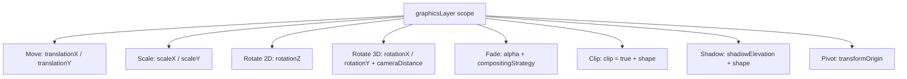
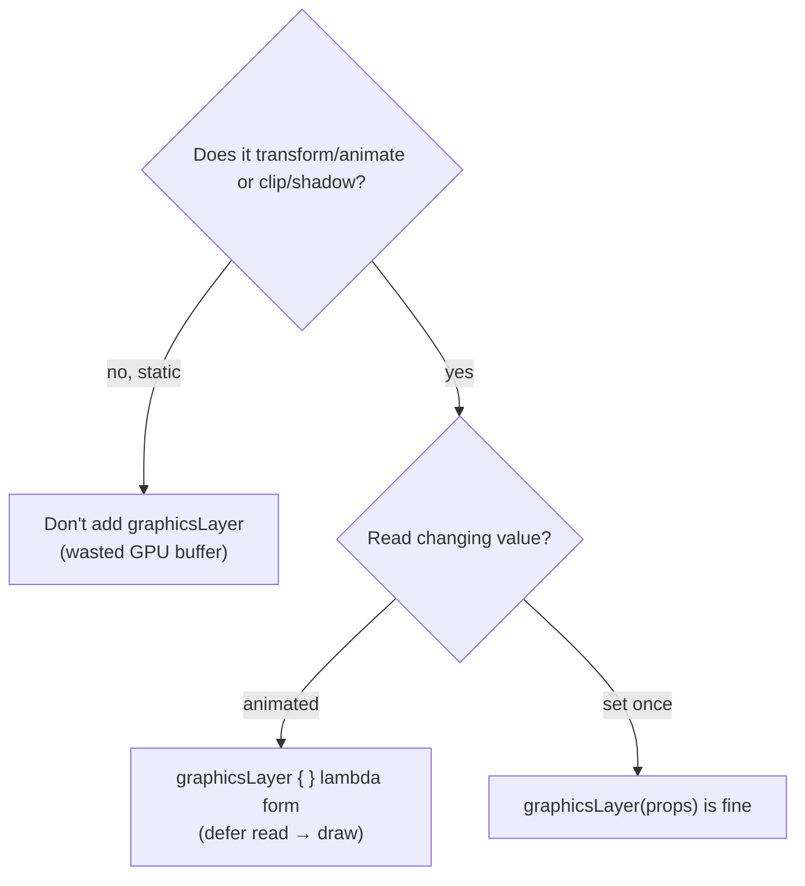

# Lesson 03 — graphicsLayer & Transforms

> After this lesson you can scale, rotate, translate, and fade composables with `Modifier.graphicsLayer`, and explain why the lambda form skips composition and layout entirely.

**Module:** 08 · **Lesson:** 03 · **Level:** 🟢🟡🔴 · **Est. time:** 75–90 min

---

## 1. Concept

### 🟢 For beginners — *what is it and why do I care?*

You have a composable on screen and you want to **move it, spin it, shrink it, or fade it** — without changing what it *is*, just how it *looks*. That's a **transform**, and the tool is `Modifier.graphicsLayer`.

```kotlin
Image(
    painter = logo,
    contentDescription = null,
    modifier = Modifier.graphicsLayer {
        rotationZ = 15f      // tilt 15 degrees
        scaleX = 1.2f        // 20% wider
        scaleY = 1.2f        // 20% taller
        alpha = 0.8f         // slightly transparent
    },
)
```

The magic: these changes are **purely visual and very cheap**. The logo doesn't get re-measured or re-laid-out; Compose just tells the GPU "draw the same picture, but tilted/scaled/faded." That's why almost every nice animation you see — a button that bounces, a card that fades in, a parallax header — runs through `graphicsLayer`.

The available knobs: `translationX/Y` (move), `scaleX/Y` (resize visually), `rotationZ` (spin in 2D), `rotationX/Y` (3D tilt), `alpha` (fade), `cameraDistance` (3D depth), `clip` + `shape` (round/clip), `shadowElevation` (drop shadow), and `transformOrigin` (the pivot point).

### 🟡 For intermediate devs — *the mechanism*

A **graphics layer** is an offscreen rendering buffer the GPU can re-composite with a transform applied. When you add `graphicsLayer`, Compose renders that subtree into a layer once, then applies your transform properties when compositing it onto the screen. Changing a property re-composites the *cached* layer — it does **not** re-run your draw code, let alone composition or layout.

There are **two overloads**, and the difference is the whole lesson:

```kotlin
// (A) Property form — reads happen in COMPOSITION.
Modifier.graphicsLayer(rotationZ = angle)          // angle read during composition

// (B) Lambda form — reads happen in the DRAW phase. PREFER THIS for animation.
Modifier.graphicsLayer { rotationZ = angle }        // angle read during draw
```

In form (A), `angle` is read while the composable function runs, so a new `angle` re-invokes composition. In form (B), the block is a `GraphicsLayerScope` lambda evaluated in the **layout/draw stage**, so reading `angle` there invalidates only that stage. For a 60–120 fps animation, that's the difference between re-running your function every frame and not.

`transformOrigin` controls the pivot: `TransformOrigin(0.5f, 0.5f)` (default) is the center; `TransformOrigin(0f, 0f)` is the top-left. `scaleX/Y` and `rotationZ` happen *around* this point.

### 🔴 For senior devs — *trade-offs, edges, internals*

- **`graphicsLayer` is the canonical "defer the read to a later phase" tool.** This is the same principle as drawing in a lambda (Lesson 01), generalized: the lambda overload reads its inputs during **layout** placement, so animating `translationX` there moves the element without invalidating composition. Reading animated state in the modifier *lambda* (or in `drawBehind`, or via `Modifier.offset { }`) instead of the composable body is the single highest-leverage Compose performance pattern. (Phases and read deferral get the full treatment in [Module 11 — Performance](../module-11-performance/README.md).)

- **A layer has real cost; don't add it for free.** Allocating an offscreen buffer consumes GPU memory and adds a composite step. For a large or full-screen element this is non-trivial. The win is only realized when the layer is **reused across frames** (animation, scrolling) — then you pay once and re-composite cheaply. A static element that never transforms gains nothing from a layer and just wastes memory.

- **`alpha < 1f` forces an offscreen layer** (the subtree must be flattened before the alpha multiply, or overlapping children would double-blend). So fading a complex subtree is more expensive than it looks. `compositingStrategy` lets you tune this: `CompositingStrategy.ModulateAlpha` skips the offscreen buffer when the content has no overlap, applying alpha per-draw-command instead — cheaper for simple content.

- **`clip = true` + `shape`** clips to a shape (rounded corners, circles) at the layer level, which is cheaper and crisper than masking by hand. But clipping also forces a layer; combine with the transforms you were already doing rather than stacking multiple clipping modifiers.

- **`shadowElevation` requires a `shape`** to cast a meaningful shadow, and on a transparent/odd-alpha layer shadows can look wrong — set `clip`/`shape` deliberately. Elevation shadows are rendered by the layer, so animating elevation is cheap, but animating it on a huge surface still triggers shadow re-rasterization.

- **`rotationX/rotationY` need `cameraDistance`** to look right; too small a distance produces extreme, fish-eye perspective. The default is usually fine, but for big 3D flips tune it.

- **`graphicsLayer` does not affect layout size.** A `scaleX = 2f` element still occupies its original measured bounds — siblings don't move. If you need the layout to actually reflow, that's a layout change, not a transform. This is a feature (cheap) but a common source of "why does it overlap?" confusion.

### Analogy

`graphicsLayer` is a **transparency sheet on an overhead projector**. You draw the slide once (render the subtree to a layer). Then you slide it, spin it, or dim the bulb (transform properties) to animate — without redrawing the slide. Redrawing the slide (composition) is slow; moving the sheet (compositing) is instant. The `alpha` knob is the projector's brightness dial; clipping is a frame mask over the lens.

### Mental model

> **`graphicsLayer { }` caches the picture once, then cheaply re-composites it with transforms — reading inputs in the *lambda* defers them to draw, so the function never re-runs.** Transform changes how it looks, never its size.

### Real-world example

A **collapsing toolbar with a parallax hero image**. As you scroll, the image's `translationY` and `alpha` are driven by scroll offset *inside a `graphicsLayer { }` lambda*. The image (and its expensive bitmap decode) renders into a layer once; scrolling just re-composites it with new translation/alpha. No recomposition per scroll pixel → silky scrolling even with a heavy header.

---

## 2. Visual Learning

**ASCII — property form vs lambda form (the cost difference):**
```text
  PROPERTY FORM                          LAMBDA FORM (preferred for animation)
  graphicsLayer(rotationZ = a)           graphicsLayer { rotationZ = a }

  a changes
     │ read in COMPOSITION                  a changes
     ▼                                         │ read in DRAW/LAYOUT
  Composition ▶ Layout ▶ Draw  (all 3!)        ▼
                                            Draw only  ✅  (skip Composition + Layout)
```

**ASCII — what a layer is:**
```text
   subtree ──render once──▶ ┌───────────────┐
                            │  cached layer │  (offscreen GPU buffer)
                            └───────┬───────┘
                                    │ apply transforms each frame:
        translationX/Y · scaleX/Y · rotationZ/X/Y · alpha · clip · shadow
                                    ▼
                              composite to screen   (cheap, no redraw)
```

**Mermaid — the transform property map:**


**Mermaid — decision: do I even need a layer?**


**Illustration prompt (paste into an image generator):**
```text
Illustration: an overhead projector metaphor. A single transparency slide (a colorful UI card) is drawn once and glowing.
Hands slide/rotate/tilt the transparency and turn a brightness dial — the projected image on the wall moves, spins, and fades
WITHOUT the slide being redrawn. Label the slide "rendered once → cached layer" and the controls
"translation / scale / rotation / alpha". Show a small dimmed side-path labeled "Composition (skipped)".
Modern, vibrant, clear labels, soft studio lighting, educational diagram style.
```

---

## 3. Code

> Prefer the **lambda** overload (`graphicsLayer { ... }`) whenever the value animates — it defers the read to draw. Only add a layer when something actually transforms, clips, or casts a shadow.

### 🟢 Beginner — a static tilt + fade

```kotlin
@Composable
fun TiltedBadge(modifier: Modifier = Modifier) {
    Box(
        modifier = modifier
            .size(80.dp)
            .graphicsLayer {
                rotationZ = -12f     // tilt
                alpha = 0.92f        // subtle fade
            }
            .background(Color(0xFFFF7043), shape = CircleShape),
    )
}
```

**Explanation.** A single `graphicsLayer` applies a fixed rotation and alpha. Because the badge never animates, the property/lambda choice doesn't matter for performance here — but using the lambda form is a harmless, future-proof default. The transform is purely visual: the box still occupies its 80×80 layout slot.

**Common mistakes.**
```kotlin
// ❌ Expecting siblings to reflow around the scaled element — they won't.
Row {
    Box(Modifier.size(40.dp).graphicsLayer { scaleX = 2f })   // visually 80 wide, LAYOUT still 40
    Box(Modifier.size(40.dp))                                  // sits as if neighbor were 40 → overlap
}
```
`graphicsLayer` transforms appearance, not measured size, so a scaled element overlaps neighbors. If you need real reflow, change the layout (size/weight), not the transform.

**Best practices.**
- Use `graphicsLayer` for *visual* changes (tilt, fade, scale); use layout modifiers for *size* changes.
- Remember transforms don't reserve extra space — leave padding if a scaled element would overlap.

---

### 🟡 Intermediate — an animated spinner (read deferred to draw)

```kotlin
@Composable
fun SpinningIcon(modifier: Modifier = Modifier) {
    val transition = rememberInfiniteTransition(label = "spin")
    val angle by transition.animateFloat(
        initialValue = 0f,
        targetValue = 360f,
        animationSpec = infiniteRepeatable(tween(1200, easing = LinearEasing)),
        label = "angle",
    )

    Icon(
        imageVector = Icons.Default.Refresh,
        contentDescription = "Loading",
        modifier = modifier.graphicsLayer {
            rotationZ = angle           // ✅ read inside the lambda → only DRAW invalidates
        },
    )
}
```

**Explanation.** The infinite transition produces a new `angle` every frame. By reading `angle` **inside** the `graphicsLayer { }` lambda, only the draw/layer-composite re-runs each frame — composition and layout are skipped. The icon's bitmap is rendered to a layer once and re-composited at the new rotation.

**Common mistakes.**
```kotlin
// ❌ Property form reads `angle` in COMPOSITION → whole composable re-runs 60–120×/sec.
Icon(
    Icons.Default.Refresh, "Loading",
    modifier = Modifier.graphicsLayer(rotationZ = angle),   // recomposes every frame
)

// ❌ Even worse: rotate via a layout modifier → invalidates layout every frame too.
Icon(Icons.Default.Refresh, "Loading", Modifier.rotate(angle)) // rotate() reads in composition
```
The property overload (and the convenience `Modifier.rotate(angle)`) read `angle` during composition, so an animated value re-invokes the function every frame. The lambda overload is the fix. (`Modifier.rotate` is fine for a *static* angle; for animation, prefer `graphicsLayer { }`.)

**Best practices.**
- For any **animated** transform, read the animated value **inside the `graphicsLayer { }` lambda**.
- Label transitions/animations (`label = ...`) so Animation Preview/Inspector is readable.
- Give the spinner a meaningful `contentDescription` (it conveys "loading").

---

### 🔴 Production — a 3D flip card with proper compositing & accessibility

```kotlin
@Composable
fun FlipCard(
    front: @Composable () -> Unit,
    back: @Composable () -> Unit,
    flipped: Boolean,
    modifier: Modifier = Modifier,
) {
    val rotation by animateFloatAsState(
        targetValue = if (flipped) 180f else 0f,
        animationSpec = tween(durationMillis = 400),
        label = "flip",
    )
    val density = LocalDensity.current

    Box(
        modifier = modifier
            .graphicsLayer {
                rotationY = rotation
                cameraDistance = 12f * density.density     // avoid fish-eye perspective
            }
            .semantics {
                stateDescription = if (flipped) "Showing back" else "Showing front"
            },
    ) {
        if (rotation <= 90f) {
            front()
        } else {
            // Past the midpoint we show the back, but counter-rotate so it isn't mirrored.
            Box(Modifier.graphicsLayer { rotationY = 180f }) { back() }
        }
    }
}
```

**Explanation.** `rotationY` flips the card around its vertical axis; `cameraDistance` (scaled by display density) keeps the perspective natural instead of fish-eyed. At the 90° midpoint we swap from `front()` to `back()`, and the back gets its own `graphicsLayer { rotationY = 180f }` so it reads correctly rather than mirror-imaged. `animateFloatAsState` drives the angle, and the read happens in the lambda so the flip animates without recomposing the card's children each frame. `stateDescription` tells assistive tech which face is showing.

**Common mistakes.**
```kotlin
// ❌ No cameraDistance: a 180° rotationY looks extreme/fish-eyed and clips weirdly.
Modifier.graphicsLayer { rotationY = rotation }    // perspective too aggressive

// ❌ Showing the back without counter-rotating → text on the back is mirror-imaged.
if (rotation > 90f) back()                          // back() appears flipped left-to-right
```
A 3D `rotationY` without a sane `cameraDistance` produces distorted perspective. And the far face of a flip is, geometrically, mirrored — you must counter-rotate it 180° so its content isn't backwards.

**Best practices.**
- Scale `cameraDistance` by `density.density` (its unit is pixels) for consistent 3D across devices.
- Counter-rotate the "back" face of a flip so content isn't mirrored.
- Drive the angle with `animateFloatAsState`/transitions and read it in the **lambda**.
- Expose `stateDescription` (or `contentDescription`) so the flip's meaning reaches screen readers.

---

## 4. Interview Questions

**🟢 Beginner**

1. *What does `Modifier.graphicsLayer` let you do, and name three properties.*
   > Apply visual transforms to a composable without changing what it is: e.g. `rotationZ` (spin), `scaleX`/`scaleY` (resize visually), `alpha` (fade), `translationX`/`translationY` (move), `clip`/`shape`, `shadowElevation`.
2. *Does scaling a composable with `graphicsLayer` change how much space it takes in the layout?*
   > No. Transforms are purely visual; the element keeps its measured size and can overlap neighbors. To change occupied space you must change the layout, not the transform.

**🟡 Intermediate**

3. *There are two `graphicsLayer` overloads. Which do you use for an animation and why?*
   > The **lambda** form, `graphicsLayer { rotationZ = angle }`. It reads its inputs during the draw/layout stage, so an animated value invalidates only draw — not composition. The property form `graphicsLayer(rotationZ = angle)` reads `angle` in composition, re-running the whole composable every frame.
4. *Why does `alpha < 1f` make a composable more expensive?*
   > It forces the subtree into an offscreen layer so it can be flattened before the alpha multiply (otherwise overlapping children would double-blend). You can opt into `CompositingStrategy.ModulateAlpha` to apply alpha per draw command and skip the buffer when content doesn't overlap.

**🔴 Senior**

5. *Explain how `graphicsLayer` relates to Compose's phase model and to deferred reads.*
   > The lambda overload evaluates in the layout/draw stage, so reading state there defers the read past composition — changes invalidate only the later phase. It's the same deferral principle as drawing in a lambda or `Modifier.offset { }`. This lets you animate transform/position/alpha at 120 fps without recomposing, which is the single biggest Compose perf lever (see Module 11).
6. *When is adding a `graphicsLayer` a net negative?*
   > When nothing transforms, clips, or casts a shadow on that node. A layer allocates an offscreen GPU buffer and adds a composite step; the cost only pays off if the layer is reused across frames (animation/scroll). On a large static element it just wastes GPU memory and can hurt. Add layers deliberately, where reuse justifies them.

---

## 5. AI Assistant

**Prompt example (animating a transform correctly):**
```text
Implement a Compose "pulse" effect on a heart Icon when `liked` becomes true: scale 1f → 1.3f → 1f
over 300ms with an overshoot. Constraints: Compose 2026 BOM, Kotlin 2.x. Drive the scale with an
animation and read it INSIDE a Modifier.graphicsLayer { } lambda so composition is NOT re-run each
frame. Don't use Modifier.scale() with an animated value. Keep contentDescription correct for liked/unliked.
```

**AI workflow.**
- ✅ Good for: wiring `animateFloatAsState`/`Animatable`/transitions to transform properties, picking sensible `tween`/`spring` specs, computing `cameraDistance` and `transformOrigin`.
- ⚠️ Watch: models frequently use the **property overload or `Modifier.rotate/scale/offset`** with animated values (recomposing every frame), add `graphicsLayer` to **static** nodes, and forget that transforms **don't reflow** layout.

**Review workflow — map to *Common Mistakes*:**
- Is the animated value read **inside `graphicsLayer { }`**, not in the property form or `Modifier.rotate/scale`?
- Is a layer added only where something actually transforms/clips/shadows (not on static content)?
- For 3D rotations, is `cameraDistance` set and density-scaled? Is the back face counter-rotated?
- Did it account for transforms **not** changing layout size (no accidental overlap)?
- Is `alpha`/`compositingStrategy` used intentionally, knowing alpha can force a layer?

**Validation workflow:**
1. **Layout Inspector → recomposition counts:** trigger the animation; the *composable* count must stay flat while it animates (proves the read is deferred). If it climbs each frame, the read is in composition — fix it.
2. **Animation Preview** in Android Studio to scrub the transform and verify origin/perspective.
3. Profile a scrolling screen with the transform (e.g. parallax header) via **Macrobenchmark**; confirm no dropped frames.
4. **TalkBack** check: the transformed control still announces correct state/description.

> **AI drafts, you decide.** Any animated transform from a model goes straight to the recomposition-count check — if it re-runs composition each frame, move the read into the `graphicsLayer { }` lambda.

---

## Recap / Key takeaways

- `Modifier.graphicsLayer` applies **visual transforms** — translate, scale, rotate (2D/3D), alpha, clip, shadow — by caching the subtree as a layer and re-compositing cheaply.
- The **lambda overload** (`graphicsLayer { }`) reads inputs in the **draw/layout** stage, so animated values invalidate **only draw** — never use the property form or `Modifier.rotate/scale/offset` with an animated value.
- Transforms **don't change layout size**; a scaled element keeps its slot and can overlap neighbors.
- A layer has real **GPU cost**; add it only where transform/clip/shadow reuse justifies it. `alpha < 1f` forces a layer — tune with `compositingStrategy`.
- 3D rotations need a sensible, density-scaled **`cameraDistance`**; counter-rotate flip back-faces.
- This is the same **deferred-read** principle as drawing in a lambda — the highest-leverage Compose performance pattern.

➡️ Next: **[Lesson 04 — Building a Custom Chart](04-custom-chart.md)** — mapping data to pixels, axes and gridlines, and assembling a real, interactive chart from everything so far.
