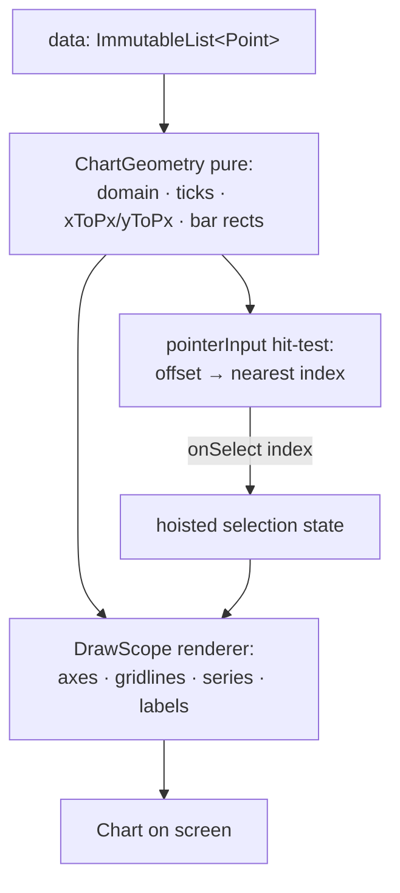
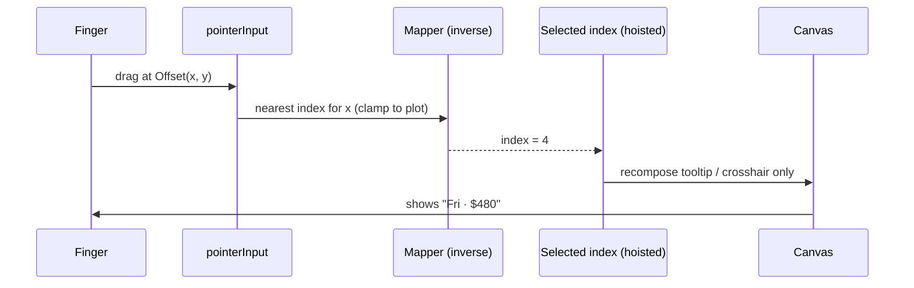

# Lesson 04 — Building a Custom Chart

> After this lesson you can design a chart from scratch: map a data domain to pixel space, draw axes and gridlines, lay out a bar/line chart, and make it interactive with drag-to-inspect.

**Module:** 08 · **Lesson:** 04 · **Level:** 🟢🟡🔴 · **Est. time:** 100–120 min

---

## 1. Concept

### 🟢 For beginners — *what is it and why do I care?*

A chart is just numbers turned into shapes. A bar chart is rectangles whose heights mean values. A line chart is points connected with a path. The hard part isn't the drawing — you already learned `drawRect`, `drawPath`, and `drawLine` in [Lesson 02](02-shapes-paths-text.md). The hard part is **mapping**: turning a value like `427` into a pixel position like `y = 183`.

Why build your own instead of using a library? Three reasons: (1) **control** — exact styling, animations, and gestures the design needs; (2) **size** — no heavy dependency for one chart; (3) **understanding** — once you can map data to pixels, every chart type is the same trick with different shapes.

The core idea you must internalize: a chart has a **data domain** (the range of your values, e.g. 0–500) and a **screen range** (the pixels available, e.g. 0–600 wide, top to bottom). A chart is a function that **scales** one onto the other.

### 🟡 For intermediate devs — *the mechanism*

The whole chart is built on **two linear mappings** (one per axis):

```text
pixelX = paddingLeft + (value - domainMinX) / (domainMaxX - domainMinX) * plotWidth
pixelY = paddingTop  + (1 - (value - domainMinY) / (domainMaxY - domainMinY)) * plotHeight
        ↑ note the (1 - …): screen Y grows DOWN, charts grow UP
```

Extract these into helper functions (`xToPx`, `yToPx`) and the rest is bookkeeping. Concretely a chart needs:

1. **Padding / insets** — reserve space for axis labels so bars/lines don't draw over them. The drawable area is the **plot rect** (canvas minus padding).
2. **Domain calculation** — find min/max of the data (often clamp `minY` to 0 for bars; add a little headroom).
3. **Axes & gridlines** — `drawLine` for the axis spines; evenly spaced gridlines at "nice" tick values; measured `drawText` labels.
4. **The series** — bars (`drawRect`), a line (`Path`), or area (closed `Path` filled).
5. **(Optional) interaction** — `pointerInput` to detect a touch, find the nearest data point, and draw a crosshair + tooltip.

State discipline carries over from Module 03: the chart is a **stateless** composable that takes immutable data in and emits selection events out. The *selected index* is hoisted, not owned inside the canvas.

### 🔴 For senior devs — *trade-offs, edges, internals*

- **Separate the math from the drawing.** A pure `ChartGeometry`/`ChartMapper` (data + plot rect → pixel coordinates, tick values, bar rects) that has **no `DrawScope` dependency** is unit-testable without a device and reusable across chart types. The `DrawScope` block becomes a thin renderer. This is the difference between a chart you can trust and one you eyeball.

- **"Nice" tick selection is a real algorithm.** Naively dividing the range into N gives ugly labels (0, 73.4, 146.8…). Use a *nice-number* rounding (round the raw step up to the nearest 1/2/5 × 10ⁿ) so ticks land on human values (0, 50, 100…). Cache the computed ticks; recomputing per frame is wasteful and, if it allocates, jank-inducing.

- **Animate by interpolating the domain mapping, not by mutating data.** To "grow" bars on load, animate a `progress: Float` 0→1 and multiply each bar's height by it, reading `progress` **inside the draw lambda** (Lesson 03's deferred read). Don't animate by emitting new data lists every frame — that recomposes and allocates. For per-bar staggering, offset each bar's progress.

- **Gesture math must invert the mapping.** Drag-to-inspect takes a touch `Offset` (pixels) and must find the nearest datapoint — i.e. run `xToPx` *backwards* (or just scan indices and compare pixel distance). Snap to the nearest index; clamp to the plot rect; debounce so a tiny finger jitter doesn't flicker the selection. Use `detectDragGestures`/`detectTapGestures` in `pointerInput`, and `awaitEachGesture` for finer control.

- **Stability and recomposition.** The data parameter must be a **stable** type or every parent recomposition re-runs the chart and re-derives the domain. Use `ImmutableList` (`kotlinx.collections.immutable`) or a `@Immutable`-annotated data holder. Memoize the geometry with `remember(data, plotSize)` so min/max/ticks aren't recomputed on unrelated recompositions.

- **Accessibility for data viz.** A canvas chart is invisible to screen readers unless you add semantics. At minimum a summary `contentDescription` ("Revenue, last 7 days, peak 480 on Friday"); better, expose per-bar semantics so users can explore values. This is frequently skipped and frequently fails audits.

- **Density & text.** Everything is pixels; a 7-px stroke is hairline on a 480-dpi phone and chunky on a tablet. Convert from dp. Reserve padding by *measuring* the widest axis label (via `TextMeasurer`), not by guessing, or labels clip on locales with longer number formats.

### Analogy

Building a chart is **cartography**. Your data is the territory (real distances in kilometers); the canvas is the paper map (centimeters). A map needs a **projection** (the scale that turns km→cm), a **legend and grid** (axes, gridlines, labels), and **you-are-here interaction** (tap the map, read the coordinate). Get the projection right and everything lands; get it wrong and the whole map is subtly off.

### Mental model

> **A chart is two linear scales (x and y) that project a data domain onto the plot rectangle — remembering screen-Y points down.** Keep the projection pure and testable; the canvas just paints what the projection computes.

### Real-world example

A **weekly revenue bar chart** on an analytics dashboard. Bars are 7 rectangles; the y-axis shows 0 / 250 / 500 with gridlines; on load the bars grow with a staggered animation; dragging a finger reveals a crosshair and a tooltip with the exact day and amount. Under the hood: a pure mapper computes bar rects and tick lines once, a `DrawScope` paints them, and `pointerInput` handles the drag.

---

## 2. Visual Learning

**ASCII — the plot rect and the mapping:**
```text
   canvas
   ┌────────────────────────────────────────────┐
   │ padTop                                      │
   │   ┌──────────── plot rect ───────────────┐  │
   │ y │  500 ┤····························     │  │ ← gridline + tick label
   │ a │      │     ▆        ▆                 │  │
   │ x │  250 ┤·····▆···▆····▆·····▆·········  │  │
   │ i │      │  ▆  ▆   ▆    ▆  ▆  ▆   ▆       │  │
   │ s │    0 ┼──┬──┬───┬────┬──┬──┬───┬────   │  │ ← x axis
   │   └──────Mon Tue Wed  Thu Fri Sat Sun─────┘  │
   │ padLeft (reserved for y labels)   padBottom  │
   └────────────────────────────────────────────┘

   value 250  ─xToPx/yToPx─▶  pixel (cx, cy) inside plot rect
```

**ASCII — the data → pixel pipeline:**
```text
  raw data ─▶ domain (min,max) ─▶ nice ticks ─▶ scale fns (xToPx,yToPx)
                                                      │
                              ┌───────────────────────┼───────────────────┐
                              ▼                       ▼                    ▼
                         draw gridlines          draw series         hit-test drags
                                                  (bars/line)       (invert mapping)
```

**Mermaid — chart architecture (pure math vs renderer vs interaction):**


**Mermaid — interaction flow (drag to inspect):**


**Illustration prompt (paste into an image generator):**
```text
Illustration: a cartographer's desk turning a landscape (data) into a clean grid map (chart).
Left: a small mountain range labeled "data domain (values)". An arrow labeled "projection / scale"
points right to a crisp bar chart on graph paper with a y-axis (0, 250, 500), gridlines, and day labels.
A magnifying glass / crosshair hovers over one bar with a tooltip "Fri · 480", labeled "drag to inspect".
Show a separate boxed-out 'pure math' gear labeled "xToPx / yToPx (testable)" feeding the drawing.
Modern infographic style, vibrant, clear labels, soft lighting.
```

---

## 3. Code

> The pattern: a **pure mapper** computes geometry; a **thin `DrawScope`** renders it; **hoisted state** + `pointerInput` add interaction. Everything pixel-side converts with `.toPx()`; data is `ImmutableList` for stability.

### 🟢 Beginner — a minimal bar chart

```kotlin
@Composable
fun SimpleBarChart(
    values: ImmutableList<Float>,
    modifier: Modifier = Modifier,
    barColor: Color = MaterialTheme.colorScheme.primary,
) {
    Canvas(modifier = modifier) {
        if (values.isEmpty()) return@Canvas
        val maxV = values.max().coerceAtLeast(1f)          // avoid /0; baseline at 0
        val gap = 8.dp.toPx()
        val barWidth = (size.width - gap * (values.size - 1)) / values.size

        values.forEachIndexed { i, v ->
            val barHeight = size.height * (v / maxV)        // value → height
            drawRect(
                color = barColor,
                topLeft = Offset(x = i * (barWidth + gap), y = size.height - barHeight),
                size = Size(barWidth, barHeight),           // grows UP from the baseline
            )
        }
    }
}
```

**Explanation.** Each value becomes a rectangle. The height is `height * (v / maxV)` — the core mapping. We draw from `y = size.height - barHeight` downward so bars grow **up** from the bottom (remember: screen y increases downward). Bar width is the leftover space after gaps, split evenly.

**Common mistakes.**
```kotlin
// ❌ Dividing by max without guarding zero/empty → NaN or crash on empty data.
val maxV = values.max()                       // empty list throws; all-zero gives /0 → NaN
val h = size.height * (v / maxV)

// ❌ Drawing from the top → bars hang down instead of growing up.
drawRect(barColor, topLeft = Offset(x, 0f), size = Size(barWidth, barHeight))
```
Empty or all-zero data must be guarded (`isEmpty` check, `coerceAtLeast(1f)`), or you get a crash/NaN. And anchoring at `y = 0` makes bars descend from the top — anchor at `size.height - barHeight`.

**Best practices.**
- Guard empty/zero domains before dividing.
- Anchor bars at the baseline (`size.height - barHeight`) so they grow upward.
- Spread bars with an explicit gap; compute bar width from remaining space.

---

### 🟡 Intermediate — axes, gridlines & a pure mapper

```kotlin
// ---- Pure geometry: no DrawScope, fully unit-testable ----
data class Plot(val left: Float, val top: Float, val width: Float, val height: Float) {
    val right get() = left + width
    val bottom get() = top + height
}

class ChartGeometry(
    private val maxY: Float,
    private val count: Int,
    private val plot: Plot,
) {
    fun xCenterFor(index: Int): Float =
        plot.left + (index + 0.5f) / count * plot.width

    fun yToPx(value: Float): Float =
        plot.bottom - (value / maxY) * plot.height          // invert: up = larger

    /** "Nice" ticks: 0..maxY in human steps (1/2/5 × 10ⁿ). */
    fun ticks(target: Int = 4): List<Float> {
        val rawStep = maxY / target
        val mag = 10.0.pow(floor(log10(rawStep.toDouble()))).toFloat()
        val norm = rawStep / mag
        val niceStep = when { norm <= 1f -> 1f; norm <= 2f -> 2f; norm <= 5f -> 5f; else -> 10f } * mag
        return generateSequence(0f) { it + niceStep }.takeWhile { it <= maxY + 1e-3f }.toList()
    }
}

@Composable
fun AxisBarChart(
    values: ImmutableList<Float>,
    modifier: Modifier = Modifier,
    barColor: Color = MaterialTheme.colorScheme.primary,
    gridColor: Color = MaterialTheme.colorScheme.outlineVariant,
) {
    val measurer = rememberTextMeasurer()
    val labelStyle = MaterialTheme.typography.labelSmall

    Canvas(modifier = modifier) {
        if (values.isEmpty()) return@Canvas
        val maxRaw = values.max().coerceAtLeast(1f)
        val maxY = maxRaw * 1.1f                              // 10% headroom
        val padLeft = 40.dp.toPx(); val padBottom = 4.dp.toPx()
        val plot = Plot(padLeft, 0f, size.width - padLeft, size.height - padBottom)
        val geo = remember(maxY, values.size, plot) { ChartGeometry(maxY, values.size, plot) }

        // Gridlines + y labels at nice ticks.
        geo.ticks().forEach { t ->
            val y = geo.yToPx(t)
            drawLine(gridColor, Offset(plot.left, y), Offset(plot.right, y), strokeWidth = 1.dp.toPx())
            val lbl = measurer.measure(t.toInt().toString(), labelStyle)
            drawText(lbl, topLeft = Offset(plot.left - lbl.size.width - 6.dp.toPx(), y - lbl.size.height / 2f))
        }

        // Bars.
        val barWidth = plot.width / values.size * 0.6f
        values.forEachIndexed { i, v ->
            val cx = geo.xCenterFor(i)
            val top = geo.yToPx(v)
            drawRect(barColor, Offset(cx - barWidth / 2f, top), Size(barWidth, plot.bottom - top))
        }
    }
}
```

**Explanation.** The `ChartGeometry` class is **pure**: given a domain and a plot rect it computes pixel coordinates and *nice* tick values — and it can be unit-tested with no device. The `DrawScope` becomes a thin renderer that asks the geometry where things go. `remember(maxY, values.size, plot)` memoizes the geometry so it isn't rebuilt on unrelated recompositions. Tick labels are measured (not guessed) and right-aligned in the reserved `padLeft` gutter.

**Common mistakes.**
```kotlin
// ❌ Recomputing geometry/ticks every frame inside the lambda → wasted work (+ alloc).
Canvas(modifier) {
    val ticks = ChartGeometry(maxY, n, plot).ticks()   // rebuilt every draw
}

// ❌ Naive ticks → ugly labels.
val ticks = (0..4).map { it * (maxY / 4) }             // 0, 117.5, 235 … unreadable
```
Rebuilding the geometry/ticks each draw is needless work on the hot path; memoize with `remember(keys)`. And evenly dividing the raw range yields non-human labels — round to nice numbers.

**Best practices.**
- Keep the **mapping pure** (no `DrawScope`) so it's testable and reusable.
- `remember(domain, plotSize)` the geometry; don't recompute per frame.
- Use **nice-number** ticks; **measure** labels to reserve padding instead of hard-coding.
- Add ~10% headroom so the tallest bar doesn't touch the top edge.

---

### 🔴 Production — animated, interactive, accessible chart

```kotlin
@Composable
fun RevenueChart(
    points: ImmutableList<DayValue>,                 // @Immutable data holder (day, amount)
    modifier: Modifier = Modifier,
    onSelect: (DayValue?) -> Unit = {},
    barColor: Color = MaterialTheme.colorScheme.primary,
    gridColor: Color = MaterialTheme.colorScheme.outlineVariant,
) {
    val measurer = rememberTextMeasurer()
    val labelStyle = MaterialTheme.typography.labelSmall
    var selected by remember { mutableIntStateOf(-1) }      // hoisted-able selection index

    // Grow-in animation: read `progress` INSIDE the draw lambda (deferred → draw only).
    val progress by animateFloatAsState(
        targetValue = if (points.isEmpty()) 0f else 1f,
        animationSpec = tween(600, easing = FastOutSlowInEasing),
        label = "grow",
    )

    val summary = remember(points) {
        points.maxByOrNull { it.amount }?.let { "Revenue chart, peak ${it.amount} on ${it.day}" } ?: "No data"
    }

    Canvas(
        modifier = modifier
            .semantics { contentDescription = summary }       // screen-reader summary
            .pointerInput(points) {                            // re-bind if data changes
                detectDragGesturesAfterLongPress(
                    onDragStart = { pos -> selected = nearestIndex(pos.x, points.size, size.width.toFloat()).also { onSelect(points.getOrNull(it)) } },
                    onDragEnd = { selected = -1; onSelect(null) },
                    onDragCancel = { selected = -1; onSelect(null) },
                    onDrag = { change, _ ->
                        selected = nearestIndex(change.position.x, points.size, size.width.toFloat())
                            .also { onSelect(points.getOrNull(it)) }
                    },
                )
            },
    ) {
        if (points.isEmpty()) return@Canvas
        val maxY = (points.maxOf { it.amount } * 1.1f).coerceAtLeast(1f)
        val padLeft = 44.dp.toPx()
        val plot = Plot(padLeft, 0f, size.width - padLeft, size.height - 18.dp.toPx())
        val geo = ChartGeometry(maxY, points.size, plot)      // (cheap; or remember on keys)

        // Gridlines + labels.
        geo.ticks().forEach { t ->
            val y = geo.yToPx(t)
            drawLine(gridColor, Offset(plot.left, y), Offset(plot.right, y), strokeWidth = 1.dp.toPx())
            val lbl = measurer.measure(t.toInt().toString(), labelStyle)
            drawText(lbl, topLeft = Offset(plot.left - lbl.size.width - 6.dp.toPx(), y - lbl.size.height / 2f))
        }

        // Bars, animated by `progress`, highlight the selected one.
        val barWidth = plot.width / points.size * 0.6f
        points.forEachIndexed { i, p ->
            val cx = geo.xCenterFor(i)
            val fullTop = geo.yToPx(p.amount)
            val animTop = plot.bottom - (plot.bottom - fullTop) * progress     // grow up
            drawRect(
                color = if (i == selected) barColor else barColor.copy(alpha = 0.6f),
                topLeft = Offset(cx - barWidth / 2f, animTop),
                size = Size(barWidth, plot.bottom - animTop),
            )
        }

        // Crosshair on the selected bar.
        if (selected in points.indices) {
            val cx = geo.xCenterFor(selected)
            drawLine(barColor, Offset(cx, plot.top), Offset(cx, plot.bottom),
                strokeWidth = 1.dp.toPx(), pathEffect = PathEffect.dashPathEffect(floatArrayOf(8f, 8f)))
        }
    }
}

/** Pure inverse mapping: pixel X → nearest data index. Unit-testable. */
private fun nearestIndex(x: Float, count: Int, width: Float): Int =
    if (count == 0) -1 else ((x / width) * count).toInt().coerceIn(0, count - 1)
```

**Explanation.** This is the full picture: a **stable** `ImmutableList<DayValue>` in; a pure `ChartGeometry` for mapping; gridlines + measured labels; bars that **grow** via an animated `progress` read *inside* the draw lambda (so only draw re-runs); a long-press **drag-to-inspect** that runs the mapping in reverse (`nearestIndex`) to pick the closest bar, highlight it, and draw a dashed **crosshair**; an `onSelect` callback hoisting the selection out; and a `contentDescription` summary for accessibility. The selection state is local here but is trivially hoistable (pass `selected`/`onSelect` in) per Module 03's pattern.

**Common mistakes.**
```kotlin
// ❌ Passing List<DayValue> (unstable) instead of ImmutableList → chart recomposes & re-derives constantly.
fun RevenueChart(points: List<DayValue>, ...)            // unstable param

// ❌ Animating by emitting new data each frame instead of one progress float.
LaunchedEffect(Unit) { repeat(60) { data = grow(data); delay(16) } }   // recompose storm + alloc

// ❌ pointerInput(Unit) when data changes → stale closure hit-tests against old size/data.
Modifier.pointerInput(Unit) { detectDragGestures { /* uses old points */ } }
```
An unstable `List` parameter defeats skipping, so the chart re-derives its domain on every parent recomposition. Animating by mutating data each frame triggers a recomposition storm and per-frame allocation — animate one `progress` float and read it in draw. And keying `pointerInput` on `Unit` captures stale `points`/`size`; key it on the data.

**Best practices.**
- Take a **stable** data type (`ImmutableList` / `@Immutable`); memoize geometry on `(data, plotSize)`.
- Animate via a single `progress`/`Animatable` read **inside** the draw lambda — never by re-emitting data.
- Key `pointerInput` on the data so the gesture closure stays fresh; clamp hit-tests to the plot.
- Hoist selection (`selected` + `onSelect`) so the chart is stateless and testable.
- Provide a **summary `contentDescription`** (ideally per-point semantics) for assistive tech.
- Keep the inverse mapping (`nearestIndex`) **pure** and unit-test it alongside `xToPx`/`yToPx`.

---

## 4. Interview Questions

**🟢 Beginner**

1. *At its core, what is a chart doing to turn a value into a bar height?*
   > A linear mapping from the data domain to the screen range: `height = plotHeight * (value / maxValue)`, drawn from the baseline upward (`y = bottom - height`), since screen Y grows downward.
2. *Why reserve padding around the plot area?*
   > To leave room for axis labels and ticks so the series doesn't draw over them. The drawable region (canvas minus padding) is the "plot rect" everything maps into.

**🟡 Intermediate**

3. *Why extract the data→pixel math into a pure class instead of doing it inside `DrawScope`?*
   > A pure mapper (no `DrawScope` dependency) is unit-testable without a device, reusable across chart types, and keeps the draw lambda thin. You can assert `yToPx(maxValue) == plotTop` in a plain JUnit test.
4. *How do you get readable axis labels instead of values like 73.4, 146.8…?*
   > Use a "nice number" tick algorithm: round the raw step (`range / targetTicks`) up to the nearest 1/2/5 × 10ⁿ so ticks land on human values (0, 50, 100). Measure label widths to reserve the correct gutter.

**🔴 Senior**

5. *How do you animate a chart "growing in" without causing a recomposition storm?*
   > Animate a single `progress: Float` (0→1) with `animateFloatAsState`/`Animatable`, and multiply each element's mapped extent by it **inside the draw lambda**. The read is deferred to draw, so only the draw phase re-runs each frame. Never animate by emitting new data lists every frame — that recomposes and allocates.
6. *Walk through making a canvas chart interactive with drag-to-inspect, including the gotchas.*
   > Add `pointerInput(data) { detectDragGestures… }`; on each drag, invert the x-mapping (`nearestIndex(x)`) to snap to the closest datapoint, clamp to the plot rect, hoist the selection via `onSelect`, and draw a crosshair/tooltip for the selected index. Gotchas: key `pointerInput` on the *data* (not `Unit`) to avoid stale closures; debounce/snap to prevent flicker; and ensure the data param is stable so the gesture and geometry don't churn.
7. *Why does the data parameter's stability matter for a chart, and how do you guarantee it?*
   > If the parameter is an unstable type (plain `List`), Compose can't skip the chart, so every parent recomposition re-runs it and re-derives the domain/ticks — wasteful and potentially janky. Guarantee stability with `kotlinx.collections.immutable` (`ImmutableList`) or a `@Immutable`/`@Stable`-annotated holder, and memoize derived geometry with `remember(data, plotSize)`.

---

## 5. AI Assistant

**Prompt example (scaffolding a chart):**
```text
Build a Compose bar chart, Compose 2026 BOM / Kotlin 2.x. Requirements:
1) A pure ChartGeometry(maxY, count, plotRect) with yToPx(), xCenterFor(index), and nice-number
   ticks() — NO DrawScope dependency, so I can unit-test it.
2) A thin Canvas renderer that draws gridlines + measured y-labels (rememberTextMeasurer) and bars.
3) Data param as kotlinx.collections.immutable ImmutableList for stability.
4) A grow-in animation via a single progress float read INSIDE the draw lambda (not by re-emitting data).
5) Drag-to-inspect with pointerInput keyed on the data; hoist selection via onSelect.
Add a summary contentDescription. Return the geometry class, the composable, and a couple of JUnit
tests for yToPx()/ticks().
```

**AI workflow.**
- ✅ Good for: the tick/nice-number algorithm, the linear mapping helpers, Bézier smoothing for line charts, and the `pointerInput` gesture skeleton.
- ⚠️ Watch: models commonly **bake the math into `DrawScope`** (untestable), use a plain **`List`** (unstable), **recompute ticks per frame**, **animate by mutating data**, key `pointerInput` on **`Unit`**, **flip Y**, and **skip accessibility**.

**Review workflow — map to *Common Mistakes*:**
- Is the mapping **pure** (no `DrawScope`) and **unit-tested** (`yToPx(maxY) == plotTop`)?
- Is the data param a **stable** type, and is geometry **memoized** on `(data, plotSize)`?
- Are ticks **nice-numbered** and computed **once**, with **measured** label gutters?
- Is the grow animation a **single `progress`** read in the draw lambda (not re-emitted data)?
- Is `pointerInput` keyed on **data**, hit-tests **clamped**, selection **hoisted**?
- Is **Y inverted**, and is there a **`contentDescription`**?

**Validation workflow:**
1. **Unit-test the geometry** (JUnit, no device): `yToPx(maxY) ≈ plotTop`, `yToPx(0) ≈ plotBottom`, ticks are monotonic and "nice," `nearestIndex` snaps correctly at edges.
2. **Preview** with empty / single / many points and extreme values (all equal, one huge outlier).
3. **Layout Inspector → recomposition counts** during the grow animation: the composable count stays flat (proves the deferred read); watch for dropped frames (allocation).
4. **TalkBack**: confirm the chart announces its summary; drag and verify selection callbacks fire.
5. **Screenshot test** the rendered chart so geometry regressions are caught in review.

> **AI drafts, you decide.** A generated chart is a starting skeleton — push the math into a pure, tested mapper and verify stability, Y-inversion, and deferred animation before it ships.

---

## Recap / Key takeaways

- A chart is **two linear scales** projecting a **data domain** onto the **plot rect** — and screen **Y points down**, so invert it.
- Reserve **padding** for labels; the drawable area is the **plot rect**.
- Keep the **mapping pure** (`ChartGeometry`, no `DrawScope`) — testable, reusable; render with a thin `DrawScope`.
- Use **nice-number ticks**, **measure** labels for gutters, and add headroom.
- **Animate** via a single `progress` read **inside the draw lambda** — never by re-emitting data.
- Make it **interactive** by inverting the mapping (`nearestIndex`) in a `pointerInput` keyed on the data; **hoist** the selection.
- Require a **stable** data type and **memoize** geometry; add a **`contentDescription`** for accessibility.

➡️ Next: **[Lesson 05 — Vector Graphics](05-vector-graphics.md)** — `ImageVector`, `painterResource`, and animated vector drawables for scalable, themable icons.
