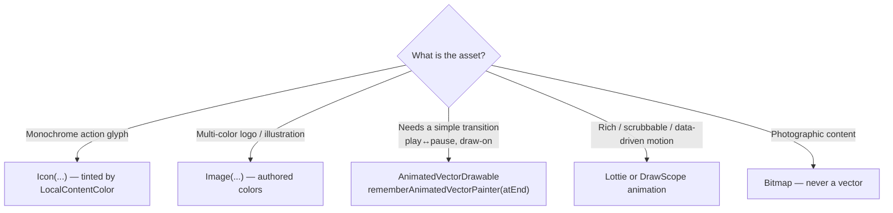
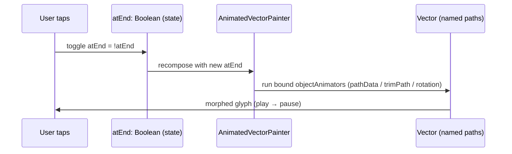

# Lesson 05 — Vector Graphics

> After this lesson you can use `ImageVector` and `painterResource`, build vectors in code, theme and tint them correctly, and animate them with `AnimatedVectorDrawable` / `rememberAnimatedVectorPainter`.

**Module:** 08 · **Lesson:** 05 · **Level:** 🟢🟡🔴 · **Est. time:** 75–90 min

---

## 1. Concept

### 🟢 For beginners — *what is it and why do I care?*

A **vector** image is described by **shapes and paths** ("draw a line from here to there, curve to this point"), not by a grid of pixels. The huge benefit: it scales to **any size with zero blur**. A vector icon looks razor-sharp on a tiny watch and a giant tablet from the *same* file. A `.png` (a bitmap) is fixed pixels — blow it up and it gets fuzzy; ship it at 5 densities and your app gets fat.

In Compose, the main ways you meet vectors:

- **`Icons.*`** — the built-in Material icon set (`Icons.Default.Favorite`), which are `ImageVector`s.
- **`painterResource(R.drawable.ic_logo)`** — load a vector drawable XML from `res/drawable`.
- **`Icon(...)` / `Image(...)`** — composables that render those painters/vectors.

You already learned to draw shapes by hand in Lessons 01–02. A vector is the same idea, but **packaged, reusable, and resolution-independent** — and often authored by a designer in Figma/SVG rather than written as `drawPath` calls.

### 🟡 For intermediate devs — *the mechanism*

Two distinct things are easy to confuse:

| Concept | What it is |
|---|---|
| **`ImageVector`** | An in-memory, immutable description of vector paths/groups (the *data*). |
| **`Painter`** | An object that knows how to *draw* something into a `DrawScope` (a `VectorPainter`, `BitmapPainter`, etc.). |

`Icon` takes either an `ImageVector` or a `Painter`. `painterResource(id)` returns a `Painter` for a drawable resource. `ImageVector.vectorResource(id)` / `rememberVectorPainter(imageVector)` bridge the two.

**`Icon` vs `Image` — a critical, often-missed difference:**
- **`Icon`** applies a **tint** (defaults to `LocalContentColor`) and is meant for **monochrome** glyphs. It recolors the whole vector. Perfect for action icons that should follow the theme.
- **`Image`** renders the vector **as authored** (multi-color), no automatic tint. Use it for logos/illustrations with intentional colors.

You can also build an `ImageVector` **in code** with the DSL:

```kotlin
val Check = ImageVector.Builder(name = "Check", defaultWidth = 24.dp, defaultHeight = 24.dp,
    viewportWidth = 24f, viewportHeight = 24f).apply {
    path(fill = SolidColor(Color.Black)) {
        moveTo(9f, 16.2f); lineTo(4.8f, 12f); lineTo(3.4f, 13.4f)
        lineTo(9f, 19f); lineTo(21f, 7f); lineTo(19.6f, 5.6f); close()
    }
}.build()
```

Note the **viewport** (the vector's internal coordinate grid, e.g. 24×24) is separate from the **rendered size** (dp). Compose scales the viewport to the size — that's the resolution independence.

### 🔴 For senior devs — *trade-offs, edges, internals*

- **Vector vs bitmap is a rendering-cost trade.** A vector is rasterized on the GPU/CPU each time it's drawn at a given size; a very complex vector (hundreds of path nodes, many groups) can be *more* expensive to draw than a cached bitmap. Compose caches the `VectorPainter`'s rasterization, but for ultra-complex art drawn repeatedly (e.g. in a fast list), measure — sometimes a pre-rasterized `ImageBitmap` wins. Conversely, never ship photographic content as a vector.

- **`rememberVectorPainter` and resource painters are cached, but in-code `ImageVector.Builder` is not free.** Building an `ImageVector` allocates the whole path tree; do it as a top-level `val` (computed once) or `remember` it — never rebuild per recomposition. The built-in `Icons.*` are lazily created top-level vals you can reference directly.

- **Tinting and theming.** `Icon` tints via `LocalContentColor`, which Material wires to the current content color (e.g. on a `Button`, the label color). This is why icons "just match" buttons. For theme-reactive multi-color vectors you generally re-author or use `tint` deliberately. Avoid baking brand colors into a drawable you also want to theme — you'll fight the tint.

- **AVD (Animated Vector Drawable) internals.** An `<animated-vector>` binds `<objectAnimator>`s to named paths/groups in a vector — animating `pathData` (morphing), `trimPathStart`/`trimPathEnd` (draw-on), rotation, alpha, etc. In Compose you render one with `rememberAnimatedVectorPainter(animatedImageVector, atEnd)`; flipping `atEnd` plays the transition. It's declarative and GPU-friendly but **one-directional per `atEnd` toggle** — you don't get arbitrary scrubbing. For complex, scrubbable, or data-driven motion, prefer **Lottie** (a separate library) or hand-drawn `DrawScope` animation (Lessons 02–04).

- **`trimPath` is the AVD version of `PathMeasure` draw-on.** The "self-drawing checkmark / loading-to-done" effect is `trimPathStart/End` animated 0→1 on a stroked path — the same concept you'd implement manually with `PathMeasure.getSegment` (Lesson 02). Knowing both lets you pick the cheaper authoring path.

- **Accessibility & RTL.** `Icon`/`Image` need a `contentDescription` (or explicit `null` for decorative). Directional icons (back arrows, chevrons) should mirror in RTL — vector drawables support `android:autoMirrored="true"`, and many `Icons.AutoMirrored.*` exist; prefer those over manually flipping.

### Analogy

A vector is a **recipe**; a bitmap is a **photograph of the finished dish**. The recipe ("2 cups flour, fold gently…") lets you cook the dish at any size — a cupcake or a wedding cake — always perfect. The photo is fixed: enlarge it and it pixelates; you'd need separate photos for each size. `Icon`'s tint is like cooking the recipe in whatever color the kitchen lighting (theme) calls for; `Image` serves the dish exactly as the recipe specifies its colors.

### Mental model

> **A vector is resolution-independent path *data* (`ImageVector`); a `Painter` draws it. `Icon` tints monochrome glyphs to the theme; `Image` shows authored colors.** Build vectors once; animate simple transitions with AVDs, reach for Lottie when motion gets rich.

### Real-world example

A **play/pause button that morphs** between the two glyphs, and a **like icon** that fills with a draw-on animation when tapped. Both are vector-based: the morph/draw-on is an `AnimatedVectorDrawable` rendered via `rememberAnimatedVectorPainter(atEnd = isPlaying)`. The same icons render crisply from the notification's tiny size up to the full-screen player — one asset, every density.

---

## 2. Visual Learning

**ASCII — vector vs bitmap under scaling:**
```text
   VECTOR (recipe)                         BITMAP (photo)
   path: M4 12 L9 17 L20 6                 fixed 24×24 grid of pixels
        scale ×8 ▼ (re-rasterized)              scale ×8 ▼ (stretched)
   ╱ still razor-sharp ╲                   ▓▒░ blocky / blurry ░▒▓
   one file, all sizes                     need mdpi…xxxhdpi copies
```

**ASCII — ImageVector → Painter → composable:**
```text
   res/drawable/ic.xml ─vectorResource()─▶ ImageVector ─rememberVectorPainter─▶ Painter
   painterResource(id) ───────────────────────────────────────────────────────▶ Painter
                                                                                   │
                                              Icon(painter, tint = …)  ◀───────────┤ monochrome + theme tint
                                              Image(painter)           ◀───────────┘ authored colors
```

**Mermaid — choosing how to render a vector:**


**Mermaid — AVD play flow:**


**Illustration prompt (paste into an image generator):**
```text
Illustration: split panel. Left half "VECTOR = recipe": a glowing icon path/blueprint being scaled
from tiny (smartwatch) to huge (tablet), staying perfectly crisp, labeled "one file, any size".
Right half "BITMAP = photo": the same icon as a pixel grid being stretched and going blocky/blurry,
labeled "needs many sizes, blurs when scaled". Bottom strip shows a play-icon smoothly morphing into a
pause-icon with a slider labeled "AnimatedVectorDrawable (atEnd)". Modern, vibrant, clear labels, soft lighting.
```

---

## 3. Code

> `Icon` = monochrome + theme tint; `Image` = authored colors. Build in-code `ImageVector`s **once**. Always handle `contentDescription`.

### 🟢 Beginner — render a vector with the right composable

```kotlin
@Composable
fun IconExamples() {
    Row(verticalAlignment = Alignment.CenterVertically) {
        // Monochrome action glyph → Icon, tinted to the theme's content color.
        Icon(
            imageVector = Icons.Default.Favorite,
            contentDescription = "Like",
            tint = MaterialTheme.colorScheme.primary,
        )

        Spacer(Modifier.width(16.dp))

        // Multi-color brand logo from res/drawable → Image, authored colors preserved.
        Image(
            painter = painterResource(R.drawable.ic_brand_logo),
            contentDescription = "Acme logo",
            modifier = Modifier.size(32.dp),
        )

        Spacer(Modifier.width(16.dp))

        // Decorative icon (conveys nothing) → null description so TalkBack skips it.
        Icon(Icons.Default.Star, contentDescription = null)
    }
}
```

**Explanation.** `Icon` is for single-color glyphs and applies a `tint` (here the theme primary; omit it and it follows `LocalContentColor`). `Image` renders the logo with its **own** colors — no tint. The decorative star passes `contentDescription = null` so screen readers ignore it.

**Common mistakes.**
```kotlin
// ❌ Using Icon for a multi-color logo → it gets flattened to one tint color.
Icon(painterResource(R.drawable.ic_brand_logo), contentDescription = "logo")  // logo turns monochrome

// ❌ Omitting contentDescription entirely (not even null) is a lint/a11y smell.
Icon(Icons.Default.Settings)   // is it meaningful or decorative? say so explicitly
```
`Icon` tints everything to one color, so a colorful logo loses its colors — use `Image`. And every `Icon`/`Image` should state its `contentDescription` (a real string *or* explicit `null`) so its accessibility intent is clear.

**Best practices.**
- `Icon` for monochrome/themed glyphs; `Image` for authored multi-color art.
- Always provide `contentDescription` — a label for meaningful icons, `null` for decorative.
- Prefer the built-in `Icons.*` (and `Icons.AutoMirrored.*` for directional ones) before shipping custom drawables.

---

### 🟡 Intermediate — an `ImageVector` built in code (once)

```kotlin
// Top-level val → built exactly once for the whole process, not per recomposition.
val CheckCircle: ImageVector by lazy {
    ImageVector.Builder(
        name = "CheckCircle",
        defaultWidth = 24.dp, defaultHeight = 24.dp,
        viewportWidth = 24f, viewportHeight = 24f,    // internal grid, scaled to size
    ).apply {
        path(fill = SolidColor(Color.White)) {
            moveTo(12f, 2f)
            arcToRelative(10f, 10f, 0f, true, true, -0.01f, 0f)   // circle
            close()
        }
        path(stroke = SolidColor(Color(0xFF2E7D32)), strokeLineWidth = 2f) {
            moveTo(7f, 12.5f); lineTo(10.5f, 16f); lineTo(17f, 8.5f)  // the tick
        }
    }.build()
}

@Composable
fun SuccessBadge(modifier: Modifier = Modifier) {
    Icon(
        imageVector = CheckCircle,
        contentDescription = "Success",
        modifier = modifier.size(40.dp),
        tint = Color.Unspecified,    // keep the vector's own colors (skip Icon's tinting)
    )
}
```

**Explanation.** The DSL builds an `ImageVector` from `path { }` blocks using the same `moveTo`/`lineTo`/`arcToRelative`/`close` vocabulary as `Path` (Lesson 02). It's a **top-level `by lazy` val**, so the path tree is allocated once for the whole app rather than every recomposition. `tint = Color.Unspecified` tells `Icon` *not* to recolor it, preserving the two-color authored look.

**Common mistakes.**
```kotlin
// ❌ Building the ImageVector inside the composable → rebuilt on every recomposition (alloc churn).
@Composable
fun SuccessBadge() {
    val v = ImageVector.Builder(/*...*/).build()   // new path tree every recomposition
    Icon(v, "Success")
}

// ❌ Mismatched viewport vs path coordinates → icon drawn tiny in a corner or clipped.
ImageVector.Builder(viewportWidth = 100f, viewportHeight = 100f)  // but paths use 0..24 coords
```
Constructing an `ImageVector` per recomposition rebuilds the entire path tree — hoist it to a top-level `val`/`remember`. And the `viewport*` must match the coordinate range your `path` commands use, or the art renders mis-scaled.

**Best practices.**
- Build in-code `ImageVector`s **once** (top-level `val`, `by lazy`, or `remember`).
- Keep `viewportWidth/Height` consistent with the path coordinate space.
- Use `tint = Color.Unspecified` when you want an `Icon` to keep authored colors.

---

### 🔴 Production — an animated vector (play ↔ pause) with state & a11y

```kotlin
@OptIn(ExperimentalAnimationGraphicsApi::class)
@Composable
fun PlayPauseButton(
    isPlaying: Boolean,
    onToggle: () -> Unit,
    modifier: Modifier = Modifier,
) {
    // One AVD authored to morph play↔pause; the painter plays toward `atEnd`.
    val image = AnimatedImageVector.animatedVectorResource(R.drawable.avd_play_to_pause)
    val painter = rememberAnimatedVectorPainter(animatedImageVector = image, atEnd = isPlaying)

    IconButton(
        onClick = onToggle,
        modifier = modifier.semantics {
            // Describe the ACTION the control performs, and its current state.
            stateDescription = if (isPlaying) "Playing" else "Paused"
        },
    ) {
        Icon(
            painter = painter,
            contentDescription = if (isPlaying) "Pause" else "Play",
            tint = MaterialTheme.colorScheme.onSurface,
        )
    }
}
```

**Explanation.** `AnimatedImageVector.animatedVectorResource` loads an `<animated-vector>` XML; `rememberAnimatedVectorPainter(image, atEnd = isPlaying)` returns a `Painter` that **animates toward** the `atEnd` state whenever `isPlaying` flips — so toggling the boolean morphs play→pause and back. State is **hoisted** (`isPlaying` in, `onToggle` out) per Module 03. Accessibility is handled twice: `contentDescription` names the action, and `stateDescription` announces the current state for screen-reader users. The icon is tinted to `onSurface` so it tracks the theme.

**Common mistakes.**
```kotlin
// ❌ Recreating the AnimatedImageVector unremembered each recomposition (or building the painter without remember).
val image = AnimatedImageVector.animatedVectorResource(R.drawable.avd_play_to_pause)  // ok (cached),
val painter = AnimatedVectorPainter(/* manual */)   // ❌ must use rememberAnimatedVectorPainter

// ❌ Expecting arbitrary scrubbing / midway control from an AVD.
// atEnd only drives a one-shot transition toward true/false — it is NOT a 0..1 timeline you can scrub.
```
The painter must come from `rememberAnimatedVectorPainter` so the animation state survives recomposition. And AVDs are **toggle-driven**, not scrubbable — if you need to drive motion from a slider or data, that's a Lottie/`DrawScope` job, not an AVD.

**Best practices.**
- Drive AVDs by flipping `atEnd` from **hoisted** state; obtain the painter via `rememberAnimatedVectorPainter`.
- Provide both `contentDescription` (the action) and `stateDescription` (current state) on toggles.
- Tint via theme colors so icons follow light/dark and dynamic color.
- Reach for **Lottie** when motion must be rich, scrubbable, or data-driven; AVDs cover simple transitions only.

---

## 4. Interview Questions

**🟢 Beginner**

1. *Why prefer a vector over a PNG for icons?*
   > Vectors are resolution-independent: one file scales sharply to any size, so you avoid shipping multiple density bitmaps and avoid blur when scaling. (Photographic content should still be a bitmap.)
2. *What's the difference between `Icon` and `Image` for a vector?*
   > `Icon` is for monochrome glyphs and applies a `tint` (defaults to `LocalContentColor`), recoloring the vector to the theme. `Image` renders the vector with its authored colors and no automatic tint — use it for multi-color logos/illustrations.

**🟡 Intermediate**

3. *`ImageVector` vs `Painter` — how do they relate?*
   > `ImageVector` is immutable vector path *data*. A `Painter` (e.g. `VectorPainter`) knows how to *draw* something into a `DrawScope`. `painterResource` gives you a `Painter`; `rememberVectorPainter(imageVector)` / `ImageVector.vectorResource` bridge an `ImageVector` to a `Painter`. `Icon`/`Image` accept either.
4. *You built an `ImageVector` in code and the screen stutters. Likely cause?*
   > It's probably being rebuilt every recomposition — `ImageVector.Builder().build()` allocates the whole path tree. Hoist it to a top-level `val`/`by lazy` or `remember` it so it's constructed once. Also verify the `viewport` matches the path coordinate space.

**🔴 Senior**

5. *How do `AnimatedVectorDrawable`s work in Compose, and what are their limits?*
   > An `<animated-vector>` binds `objectAnimator`s to named paths/groups in a vector (morph `pathData`, `trimPathStart/End` for draw-on, rotation, alpha). In Compose you render via `rememberAnimatedVectorPainter(image, atEnd)`; flipping `atEnd` plays the transition. Limits: it's a one-shot toggle toward a state, **not** a scrubbable 0..1 timeline, and complex/data-driven motion is awkward — that's where Lottie or hand-drawn `DrawScope` animation wins.
6. *When is a vector the wrong choice, and how would you confirm?*
   > For photographic/very-complex art (a vector with hundreds of path nodes can cost more to rasterize than a cached bitmap, especially repeated in a fast list), and for content that's inherently raster. Confirm by profiling: measure draw time / frame timing (Macrobenchmark, GPU profiling); if a complex vector dominates draw, pre-rasterize to an `ImageBitmap`. Use the simplest asset that meets the fidelity and scaling needs.
7. *How do you keep directional icons correct across LTR/RTL?*
   > Use auto-mirroring: `android:autoMirrored="true"` on the vector drawable, or the `Icons.AutoMirrored.*` set (e.g. `AutoMirrored.Filled.ArrowBack`), rather than manually flipping with a transform. The framework mirrors them in RTL layouts automatically, keeping back/forward affordances semantically correct.

---

## 5. AI Assistant

**Prompt example (authoring an in-code vector):**
```text
Convert this SVG path to a Compose ImageVector built with ImageVector.Builder (Compose 2026, Kotlin 2.x).
Expose it as a top-level `val` (built once, not per recomposition). Keep the viewport at 24x24,
preserve the two authored colors, and show how to render it with Icon(tint = Color.Unspecified)
so the colors aren't flattened. SVG: [paste path d="..."].
```

**Prompt example (animated vector):**
```text
I have res/drawable/avd_like.xml (an <animated-vector> that draws-on a heart via trimPath).
Write a Compose LikeButton(isLiked, onToggle) that renders it with rememberAnimatedVectorPainter
driven by `atEnd = isLiked`. Hoist state. Add contentDescription + stateDescription for accessibility.
Target Compose 2026 / Kotlin 2.x.
```

**AI workflow.**
- ✅ Good for: SVG→`ImageVector.Builder` translation, wiring `rememberAnimatedVectorPainter`/`atEnd`, generating `path { }` DSL from coordinates, picking `Icons.AutoMirrored.*`.
- ⚠️ Watch: models often **build `ImageVector` inside the composable** (per-recomposition alloc), use **`Icon` for multi-color** art (flattening it), **forget `contentDescription`/`stateDescription`**, expect AVDs to **scrub**, and mismatch **viewport vs path** coords.

**Review workflow — map to *Common Mistakes*:**
- Is an in-code `ImageVector` built **once** (top-level `val`/`remember`), not per recomposition?
- Is **`Icon` vs `Image`** correct for the asset (monochrome vs authored colors)? Is `tint` intentional (`Color.Unspecified` to keep colors)?
- Does every `Icon`/`Image` declare `contentDescription` (string or explicit `null`)? Toggles also `stateDescription`?
- Is the AVD painter from **`rememberAnimatedVectorPainter`**, driven by **hoisted** `atEnd` — and is the motion within AVD's one-shot-toggle limits?
- Directional icons **auto-mirrored** for RTL?

**Validation workflow:**
1. **Preview** the icon at several sizes (16/24/48/96 dp) to confirm crispness and that `viewport` scaling is right.
2. Toggle the AVD state and confirm the morph plays both directions; verify nothing rebuilds the painter (Layout Inspector recomposition counts stay sane).
3. **TalkBack**: meaningful icons announce their label; toggles announce state; decorative icons are skipped.
4. Flip the device/locale to **RTL** and confirm directional icons mirror.
5. For complex vectors in lists, profile draw time (**Macrobenchmark**); if it's hot, compare against a pre-rasterized bitmap.

> **AI drafts, you decide.** Generated vector code goes through the build-once / `Icon`-vs-`Image` / a11y checklist before merging — and if the model reaches for an AVD where the motion needs scrubbing, switch to Lottie or hand-drawn animation.

---

## Recap / Key takeaways

- A **vector** is resolution-independent path *data* — one asset, every density, no blur (use bitmaps only for photographic content).
- **`ImageVector`** = the data; **`Painter`** = the drawer. `painterResource`/`rememberVectorPainter` bridge them; `Icon`/`Image` render them.
- **`Icon`** tints monochrome glyphs to the theme (`LocalContentColor`); **`Image`** keeps authored colors. Use `tint = Color.Unspecified` to stop `Icon` recoloring.
- Build in-code `ImageVector`s **once** (top-level `val`/`remember`); keep `viewport` aligned to path coords.
- Animate simple transitions with **`AnimatedVectorDrawable`** via `rememberAnimatedVectorPainter(atEnd = …)` from **hoisted** state — but it's a one-shot toggle, not a scrubbable timeline; reach for **Lottie**/`DrawScope` for rich motion.
- Always set **`contentDescription`** (and `stateDescription` on toggles); **auto-mirror** directional icons for RTL.

➡️ Next: **[Module 09 — Material 3 Theming](../module-09-material3-theming/README.md)** — turn the colors, typography, and shapes your icons and charts react to into a coherent, dynamic design system.
