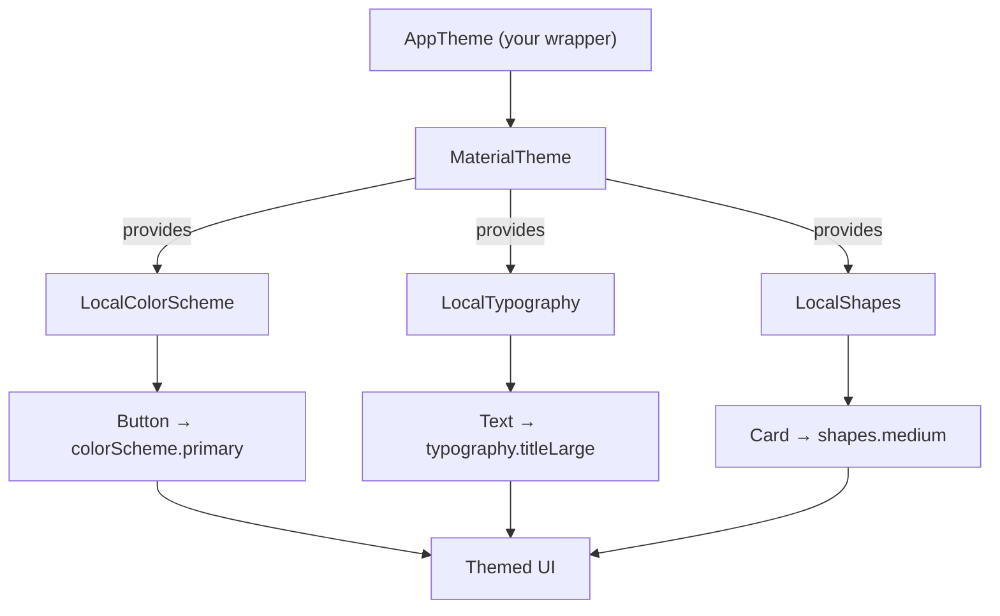

# Lesson 01 — The M3 Theming Model

> After this lesson you can explain how `MaterialTheme` provides color, typography, and shape to an entire subtree, read those values back with `MaterialTheme.colorScheme/typography/shapes`, and understand why theming in Compose is just CompositionLocal under the hood.

**Module:** 09 · **Lesson:** 01 · **Level:** 🟢🟡🔴 · **Est. time:** 60–75 min

---

## 1. Concept

### 🟢 For beginners — *what is it and why do I care?*

A **theme** is the set of design decisions that make your whole app look like *one* app: the brand colors, the fonts, how rounded the corners are. Without a theme you'd pass `color = Color(0xFF6750A4)` to every single `Text`, `Button`, and `Card` — and the day the brand color changes, you'd hunt through hundreds of files.

**Material 3 (M3)** is Google's design system, and Jetpack Compose ships it as the `androidx.compose.material3` library. The heart of it is one composable: **`MaterialTheme`**. You wrap your app in it once, hand it three things — a **color scheme**, a **typography** set, and a **shape** set — and every Material component *inside* that wrapper picks the right values automatically.

```kotlin
MaterialTheme(
    colorScheme = lightColorScheme(),   // the palette
    typography  = Typography(),          // the fonts & sizes
    shapes      = Shapes(),              // the corner roundings
) {
    // your whole app's UI goes here
}
```

A `Button` inside this block is already purple-on-white with rounded corners and the right label font — you didn't tell it any of that. That's the win: **define the look once, every component obeys.**

### 🟡 For intermediate devs — *the mechanism*

`MaterialTheme` is not magic styling. It is a **provider**: it puts three objects into the composition so that descendants can read them. Components like `Button` read those objects to style themselves.

The three slots:

| Slot | Type | Read it back with |
|---|---|---|
| Color | `ColorScheme` | `MaterialTheme.colorScheme` |
| Typography | `Typography` | `MaterialTheme.typography` |
| Shape | `Shapes` | `MaterialTheme.shapes` |

Reading is how *you* consume the theme in your own composables:

```kotlin
Text(
    text = "Title",
    color = MaterialTheme.colorScheme.primary,
    style = MaterialTheme.typography.titleLarge,
)
```

Two properties matter immediately:

1. **It's scoped to a subtree.** Whatever you put inside the `MaterialTheme { … }` lambda gets these values; siblings outside don't. You can even **nest** `MaterialTheme` to re-theme one section (a dark card inside a light screen).
2. **Reads are live.** If the provided `colorScheme` changes (e.g. the user toggles dark mode and you swap to `darkColorScheme()`), everything that read `MaterialTheme.colorScheme` recomposes with the new values — because, as you'll see, these are `CompositionLocal`s and a read is a subscription.

The convention in 2026 is to wrap `MaterialTheme` in **your own** theme composable — usually `AppTheme { … }` (Android Studio's template names it `YourAppNameTheme`). That wrapper decides *which* scheme to pass (light vs dark vs dynamic) so the rest of the app just says `AppTheme { … }` and never touches the raw schemes.

### 🔴 For senior devs — *trade-offs, edges, internals*

`MaterialTheme` is a thin composable built entirely on **`CompositionLocal`** (full treatment in [Module 07](../module-07-compositionlocal/README.md)). Its body is essentially three `CompositionLocalProvider` calls — `LocalColorScheme provides colorScheme`, `LocalTypography provides typography`, `LocalShapes provides shapes` — wrapping the content, plus a `LocalIndication`/ripple setup. `MaterialTheme.colorScheme` is just `LocalColorScheme.current`. There is no global singleton; the theme lives in the tree.

Consequences you design around:

- **Theming is a runtime read, not compile-time.** `MaterialTheme.colorScheme.primary` is resolved at the **call site** during composition. Refactor a composable to a different part of the tree and it may read a *different* theme. This is a feature (nested re-theming) and a footgun (a component styled correctly in one screen looks wrong when reused under a different `MaterialTheme`).
- **The locals backing color and typography are *dynamic* (not `staticCompositionLocalOf`).** That means a change to the scheme invalidates only the readers, surgically — but it also means every read is tracked, which has a (tiny) cost. Shapes is likewise dynamic. You almost never need to care, but it's why swapping the whole scheme at runtime is cheap and correct.
- **Reading the theme outside a `MaterialTheme` gives you defaults, not an error.** `LocalColorScheme` has a default value (`lightColorScheme()`), so a stray component still renders — just unthemed. Previews and tests that forget the wrapper silently use defaults, which hides theming bugs. Always wrap previews in `AppTheme`.
- **`MaterialTheme` is the *Material* opinion, not the only one.** You can build a custom design system with your own CompositionLocals (a `LocalSpacing`, a brand `LocalGradient`) *alongside* `MaterialTheme`. Extending the theme is covered in [Lesson 06](06-light-dark-custom-themes.md); the key insight is that M3 owns three slots, and anything beyond color/type/shape is yours to provide.
- **Content color is separate and crucial.** Beyond the three slots, M3 tracks a *current content color* via `LocalContentColor` so that text/icons automatically contrast their background (e.g. inside a `primary`-colored `Button`, content defaults to `onPrimary`). This is part of the theming system even though it isn't one of the three constructor parameters — and it's why you rarely set `Icon`/`Text` colors by hand inside surfaces.

### Analogy

A theme is the **CSS stylesheet** of your app — but reactive and scoped by the tree instead of by selectors. `MaterialTheme` is the `<style>` you wrap a section in; `MaterialTheme.colorScheme.primary` is reading a CSS variable like `var(--primary)`. Nest a second stylesheet and the inner section overrides the outer one, exactly like nested CSS scopes. Change the variable's value and everything referencing it restyles — no manual repaint.

### Mental model

> **`MaterialTheme` provides three objects (color, type, shape) into the subtree; components and your code read them by name. Theming is CompositionLocal: a read is a subscription, scoped to the tree.**

### Real-world example

Every Android app from the official **Now in Android** sample to a banking app wraps its root in an `AppTheme` that selects light/dark/dynamic and passes it to `MaterialTheme`. Open any screen and you'll see `MaterialTheme.colorScheme.surface` as a `Scaffold` background and `MaterialTheme.typography.bodyLarge` on list text — never a raw hex. That's the entire payoff: one decision at the root, consistent everywhere.

---

## 2. Visual Learning

**ASCII — provide at the top, read anywhere below:**
```text
            ┌──────────────────────── AppTheme ───────────────────────┐
            │   chooses scheme (light / dark / dynamic)                │
            │                                                          │
            │   MaterialTheme(                                         │
            │     colorScheme ─┐  typography ─┐  shapes ─┐             │
            │   ) {            │              │          │             │
            │                  ▼ provides     ▼ provides ▼ provides    │
            │        LocalColorScheme   LocalTypography  LocalShapes   │
            │                  │              │          │             │
            │   ┌──────────────┴──────────────┴──────────┴──────────┐  │
            │   │  Screen → Button reads colorScheme.primary        │  │
            │   │          Text   reads typography.titleLarge       │  │
            │   │          Card   reads shapes.medium               │  │
            │   └───────────────────────────────────────────────────┘  │
            └──────────────────────────────────────────────────────────┘
```

**Mermaid — the three slots flowing down the tree:**


**Illustration prompt (paste into an image generator):**
```text
Illustration: a clean modern app screen sitting inside three translucent stacked glass panels
labeled COLOR, TYPOGRAPHY, SHAPE, like nested lenses. Each panel tints/styles the UI passing
through it: the color lens paints buttons purple, the typography lens sets the fonts, the shape
lens rounds the corners. A single dial at the top labeled "MaterialTheme" feeds all three lenses.
Thin light-beams run from the dial down into every component. Caption: "Define the look once,
every component obeys." Soft gradients, vibrant, labeled, studio lighting.
```

---

## 3. Code

> We provide schemes here but don't dissect color *roles* yet — that's [Lesson 02](02-color-roles-schemes.md). For now, focus on the *structure*: wrap once, read by name.

### 🟢 Beginner — wrap your app and read the theme

```kotlin
@Composable
fun MyApp() {
    MaterialTheme {                       // defaults: light scheme, M3 type, M3 shapes
        Surface {                         // paints the themed background color
            Greeting(name = "Compose")
        }
    }
}

@Composable
fun Greeting(name: String) {
    Text(
        text = "Hello, $name",
        color = MaterialTheme.colorScheme.primary,   // read color from the theme
        style = MaterialTheme.typography.headlineSmall, // read a text style from the theme
    )
}
```

**Explanation.** `MaterialTheme {}` with no arguments provides Material's baseline color/type/shape. `Surface` reads the theme to paint its background and set a sensible content color. `Greeting` consumes the theme by name — `MaterialTheme.colorScheme.primary` and `MaterialTheme.typography.headlineSmall` — so it restyles automatically if the theme ever changes.

**Common mistakes.**
```kotlin
// ❌ Hardcoding what the theme already provides.
Text(text = "Hello", color = Color(0xFF6750A4), fontSize = 24.sp)
```
This duplicates a decision the theme owns. It won't adapt to dark mode, won't respond to a brand change, and ignores the type scale. If the value should be consistent app-wide, read it from `MaterialTheme`.

**Best practices.**
- Wrap the app **once** near the root in `MaterialTheme` (or your `AppTheme`).
- Inside `Surface`/`Scaffold`, let content color flow — don't set text/icon colors unless you mean to override.
- Read color/type/shape **by name** from `MaterialTheme`, never as literals.

---

### 🟡 Intermediate — your own `AppTheme` wrapper

```kotlin
@Composable
fun AppTheme(
    darkTheme: Boolean = isSystemInDarkTheme(),
    content: @Composable () -> Unit,
) {
    val colorScheme = if (darkTheme) darkColorScheme() else lightColorScheme()

    MaterialTheme(
        colorScheme = colorScheme,
        typography  = Typography(),   // customized in Lesson 04
        shapes      = Shapes(),       // customized in Lesson 05
        content     = content,
    )
}

// Usage — the rest of the app never touches raw schemes:
@Composable
fun Root() {
    AppTheme {
        Scaffold { padding ->
            HomeScreen(modifier = Modifier.padding(padding))
        }
    }
}
```

**Explanation.** `AppTheme` is the single place that *decides* the look. It reads `isSystemInDarkTheme()` and picks `darkColorScheme()` or `lightColorScheme()`, then forwards everything to `MaterialTheme`. Every screen just writes `AppTheme { … }` (or, more often, relies on the root wrapping). When you later add dynamic color or custom fonts, you change *one* function and the whole app follows.

**Common mistakes.**
```kotlin
// ❌ Re-deciding the theme in many places → drift and duplication.
@Composable
fun HomeScreen() {
    MaterialTheme(colorScheme = if (isSystemInDarkTheme()) darkColorScheme() else lightColorScheme()) {
        // ...
    }
}
@Composable
fun SettingsScreen() {
    MaterialTheme(colorScheme = lightColorScheme()) { // oops: forgot dark handling here
        // ...
    }
}
```
Scattering the light/dark decision means screens drift apart and one inevitably forgets a case. Centralize it in `AppTheme`.

**Best practices.**
- Have exactly **one** `AppTheme` that owns the light/dark/dynamic decision.
- Default `darkTheme` to `isSystemInDarkTheme()` but keep it a **parameter** so previews and user overrides can force a value.
- Pass `content` through as a trailing `@Composable () -> Unit` so call sites read naturally.

---

### 🔴 Production — a theme wrapper that also handles system bars and previews

```kotlin
@Composable
fun AppTheme(
    darkTheme: Boolean = isSystemInDarkTheme(),
    dynamicColor: Boolean = true,                 // Material You toggle (Lesson 03)
    content: @Composable () -> Unit,
) {
    val context = LocalContext.current
    val colorScheme = when {
        // Dynamic color is available on Android 12+ (API 31).
        dynamicColor && Build.VERSION.SDK_INT >= Build.VERSION_CODES.S ->
            if (darkTheme) dynamicDarkColorScheme(context) else dynamicLightColorScheme(context)
        darkTheme -> DarkColors        // your brand fallback scheme
        else      -> LightColors
    }

    MaterialTheme(
        colorScheme = colorScheme,
        typography  = AppTypography,
        shapes      = AppShapes,
        content     = content,
    )
}

// One preview helper so EVERY preview is correctly themed (no silent defaults).
@Composable
fun ThemedPreview(
    darkTheme: Boolean = false,
    content: @Composable () -> Unit,
) {
    AppTheme(darkTheme = darkTheme, dynamicColor = false) {
        Surface(color = MaterialTheme.colorScheme.background, content = content)
    }
}

@Preview(name = "Light") @Preview(name = "Dark", uiMode = UI_MODE_NIGHT_YES)
@Composable
private fun HomePreview() = ThemedPreview { HomeScreen() }
```

**Explanation.** Production `AppTheme` folds the dynamic-color decision (Material You, [Lesson 03](03-dynamic-color-material-you.md)) into the same single place, with a hardcoded brand scheme as the pre-Android-12 fallback. The `ThemedPreview` wrapper guarantees previews run *inside* the theme, so you never accidentally validate against `MaterialTheme`'s built-in defaults — and the paired `@Preview`s render light and dark side by side. System-bar/edge-to-edge handling now lives in the `Activity` via `enableEdgeToEdge()` (see [Module 15](../module-15-modern-android-2026/README.md)) rather than tinting bars from the theme, which is the current idiom.

**Common mistakes.**
```kotlin
// ❌ Previewing without the theme → you validate against M3 defaults, not your app.
@Preview
@Composable
private fun HomePreview() = HomeScreen()   // looks "fine" but unthemed; hides real bugs

// ❌ Tinting status bar by mutating window flags from a composable on every recomposition.
SideEffect { window.statusBarColor = colorScheme.primary.toArgb() } // deprecated path; use edge-to-edge
```
Unwrapped previews are the classic way theming bugs slip through review. And manually setting `statusBarColor` is deprecated in modern Android — go edge-to-edge instead.

**Best practices.**
- Centralize light/dark **and** dynamic into one `AppTheme`; provide explicit brand fallbacks.
- Ship a `ThemedPreview` wrapper and use it for *every* preview; pair light + dark previews.
- Handle system bars with `enableEdgeToEdge()` at the `Activity`, not from inside composables.
- Keep `typography`/`shapes` as named top-level values (`AppTypography`, `AppShapes`) so they're one obvious thing to evolve.

---

## 4. Interview Questions

**🟢 Beginner**

1. *What does `MaterialTheme` do?*
   > It provides three things — a `ColorScheme`, a `Typography`, and a `Shapes` set — to everything inside its content lambda, so Material components and your own composables can style themselves consistently without hardcoded values.
2. *How do you read the primary color or a text style from the theme?*
   > `MaterialTheme.colorScheme.primary` for color and `MaterialTheme.typography.titleLarge` (etc.) for a text style; `MaterialTheme.shapes.medium` for a shape.

**🟡 Intermediate**

3. *Why wrap `MaterialTheme` in your own `AppTheme` composable?*
   > To centralize the decision of *which* scheme to use (light/dark/dynamic) in one place, so screens just call `AppTheme { … }` and never duplicate or drift on that logic. It's also where you swap in custom typography/shapes later.
4. *What happens if you read `MaterialTheme.colorScheme` outside any `MaterialTheme`?*
   > You get the default value of the backing CompositionLocal (a default light scheme), not an error. That's why previews/tests that forget the wrapper silently use defaults and can hide theming bugs.

**🔴 Senior**

5. *How is theming implemented under the hood, and what follows from that?*
   > `MaterialTheme` is built on `CompositionLocal`: it provides `LocalColorScheme`/`LocalTypography`/`LocalShapes` and `MaterialTheme.colorScheme` is just `LocalColorScheme.current`. So theming is resolved at the **call site** at composition time — there's no global singleton. This enables nested re-theming and live recomposition on scheme change, but means a composable's appearance depends on *where* in the tree it's used.
6. *Why are the color/typography/shape CompositionLocals dynamic rather than static, and why does it matter?*
   > Because the scheme can change at runtime (dark-mode toggle, dynamic color). Dynamic locals track reads, so swapping the whole `colorScheme` invalidates exactly the composables that read it — cheap and correct. A `staticCompositionLocalOf` would recompose the entire subtree on any change. The tracking cost is negligible relative to the correctness it buys for live re-theming.
7. *Where does content color (e.g. `onPrimary` text inside a colored button) come from, given it isn't a `MaterialTheme` constructor argument?*
   > From `LocalContentColor`, which surfaces (`Surface`, `Button`, etc.) set based on their background color role, so text/icons automatically contrast. It's part of the theming system layered on top of the three slots; that's why you rarely set `Text`/`Icon` color by hand inside a colored container.

---

## 5. AI Assistant

**Prompt example (scaffolding a theme):**
```text
Generate a Compose Material 3 AppTheme composable for Kotlin 2.x / Compose 2026 BOM.
Requirements:
- one AppTheme(darkTheme = isSystemInDarkTheme(), dynamicColor = true, content)
- dynamic color on API 31+, brand fallback LightColors/DarkColors otherwise
- pass typography = AppTypography, shapes = AppShapes
- include a ThemedPreview helper and paired light/dark @Preview
Do NOT hardcode hex inside screens; everything reads MaterialTheme.* by name.
```

**AI workflow — where it helps on *this* topic.**
- ✅ Great for: generating the `AppTheme` + `ThemedPreview` boilerplate, converting an XML `styles.xml`/`themes.xml` into a Compose `ColorScheme`/`Typography`, and bulk-replacing hardcoded colors with `MaterialTheme.colorScheme.*`.
- ⚠️ Not for: deciding *which* role a given UI element should use (that's design judgment, Lesson 02), or whether you even want dynamic color. Models often wrap things in an *extra* `MaterialTheme` or forget the dark branch.

**Review workflow — check AI output against this lesson's *Common Mistakes*:**
- Is there exactly **one** theme wrapper, or did it nest a stray `MaterialTheme`?
- Are screens free of hardcoded hex/`fontSize`, reading `MaterialTheme.*` instead?
- Does every generated `@Preview` go through the themed wrapper (not bare)?
- Did it avoid deprecated `window.statusBarColor` tinting in favor of edge-to-edge?

**Validation workflow — prove it actually works:**
1. **Compile & run**; toggle the system theme — colors/typography should flip with no code change.
2. Render the **light + dark previews** together; confirm both look intentional, not defaulted.
3. Search the diff for `Color(0x`, `fontSize =`, and a second `MaterialTheme(` — there should be none in screen code.
4. In Layout Inspector, confirm a `Button`'s color matches `colorScheme.primary` (not a literal).

> **AI drafts, you decide.** Route every generated theme back through the checklist: one wrapper, no hardcoded values, themed previews.

---

## Recap / Key takeaways

- A **theme** = color + typography + shape decided once; `MaterialTheme` **provides** all three to its subtree.
- **Read** them by name: `MaterialTheme.colorScheme/typography/shapes` — never hardcode what the theme owns.
- Wrap `MaterialTheme` in **one** `AppTheme` that decides light/dark/dynamic; the rest of the app just calls it.
- Theming is **CompositionLocal**: resolved at the call site, scoped to the tree, recomposes readers live on change.
- Always wrap **previews** in the theme, or you validate against M3 defaults and hide bugs.

➡️ Next: **[Lesson 02 — Color Roles & Schemes](02-color-roles-schemes.md)** — what `primary`/`secondary`/`surface`/container roles actually mean, and why roles beat raw colors.
