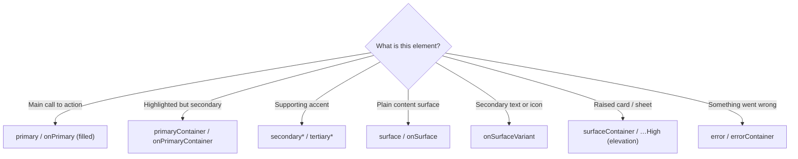

# Lesson 02 — Color Roles & Schemes

> After this lesson you can name the core Material 3 color roles, pair every background role with its matching `on*` content role, and explain why coding against *roles* (not raw hex) is what makes one theme work in light, dark, and dynamic at once.

**Module:** 09 · **Lesson:** 02 · **Level:** 🟢🟡🔴 · **Est. time:** 70–90 min

---

## 1. Concept

### 🟢 For beginners — *what is it and why do I care?*

In Material 3 you almost never say "make this button **purple**." You say "make this button the **primary** color." **Primary** is a *role* — a job a color does — not a fixed hex value. The actual purple lives in the theme's `ColorScheme`; the button just asks for `primary` and gets whatever the current scheme assigned to that role.

Why bother with the indirection? Because the *same* role swaps value automatically:

- In **light** mode, `primary` might be a deep purple.
- In **dark** mode, `primary` becomes a lighter purple (dark surfaces need lighter accents).
- In **dynamic** mode, `primary` is pulled from the user's wallpaper.

Your code never changes — it always asks for `primary`. The scheme decides the hex. That's the whole point of roles.

The second idea you need on day one: every background role has a partner **content** role named `on<Background>`. Text/icons drawn *on* a `primary` button use **`onPrimary`** so they're guaranteed to be readable. Pairs you'll use constantly:

```text
primary    → onPrimary       (label on a filled button)
surface    → onSurface       (text on a card/sheet)
background → onBackground     (text on the screen)
error      → onError          (text on an error banner)
```

**Rule of thumb:** if you set a container to a color role, draw its contents with the matching `on*` role.

### 🟡 For intermediate devs — *the mechanism*

A `ColorScheme` is a data class holding ~30 named slots. They come in **role families**, each typically a quartet:

| Family | Background role | Content on it | "Container" variant | Content on container |
|---|---|---|---|---|
| Primary | `primary` | `onPrimary` | `primaryContainer` | `onPrimaryContainer` |
| Secondary | `secondary` | `onSecondary` | `secondaryContainer` | `onSecondaryContainer` |
| Tertiary | `tertiary` | `onTertiary` | `tertiaryContainer` | `onTertiaryContainer` |
| Error | `error` | `onError` | `errorContainer` | `onErrorContainer` |

Plus the **neutral surface system** that most of your screen actually uses:

- `background` / `onBackground` — the screen behind everything.
- `surface` / `onSurface` — cards, sheets, menus.
- `surfaceVariant` / `onSurfaceVariant` — subtler fills; `onSurfaceVariant` is the go-to for secondary text and icons.
- `outline` / `outlineOutVariant` — borders and dividers.
- The **tonal surface ramp**: `surfaceContainerLowest`, `surfaceContainerLow`, `surfaceContainer`, `surfaceContainerHigh`, `surfaceContainerHighest` — M3's way of expressing elevation with *color* instead of shadows. Higher elevation = a step up the ramp.

How **strong** vs **container** differ in intent:

- `primary` + `onPrimary` = **high emphasis**. A filled button, a FAB. Loud.
- `primaryContainer` + `onPrimaryContainer` = **medium emphasis**. A tonal button, a selected chip, a highlighted card. Present but calmer.

You build a scheme with `lightColorScheme(...)` / `darkColorScheme(...)`, overriding only the roles you care about:

```kotlin
val LightColors = lightColorScheme(
    primary = Color(0xFF6750A4),
    onPrimary = Color(0xFFFFFFFF),
    primaryContainer = Color(0xFFEADDFF),
    onPrimaryContainer = Color(0xFF21005D),
    // ...secondary, tertiary, surfaces, error
)
```

You should not invent these by eye — generate a tonally correct, contrast-checked palette with the **Material Theme Builder** (more in Lesson 06) and paste the roles in.

### 🔴 For senior devs — *trade-offs, edges, internals*

- **Roles are an indirection that decouples "meaning" from "value."** This is what lets a single component definition render correctly across light/dark/dynamic *and* across a future rebrand. The cost is discipline: the moment someone writes `Color(0xFF…)` in a component, that component is frozen to one scheme and silently breaks dark mode and dynamic color. Treat raw hex in UI code as a lint-level smell.
- **Contrast is a *pairing* contract, not a per-color property.** M3's tonal palette guarantees that `onPrimary` meets WCAG contrast against `primary`, `onSurface` against `surface`, and so on — but only if you keep the pairs together. Mixing across families (`onSurface` text on a `primary` fill) voids the guarantee and routinely fails contrast. Accessibility here is mostly "don't break the pairs."
- **Elevation is color, not just shadow, in M3.** Where Material 2 used drop shadows to convey height, M3 uses **surface tones**. A `surfaceContainerHigh` card reads as "higher" partly through its tint. In **dark** themes this matters more: shadows are nearly invisible on dark backgrounds, so the tonal step *is* the elevation signal. Picking the wrong surface-container level makes hierarchy disappear in dark mode. (Legacy `surfaceColorAtElevation`/`tonalElevation` still exists, but prefer choosing an explicit `surfaceContainer*` role.)
- **`surfaceVariant` vs `surfaceContainer*` is a real decision.** `surfaceVariant` is a *fill/emphasis* color (e.g. a text-field background, a disabled track). The `surfaceContainer*` ramp is the *elevation* system. Using `surfaceVariant` to fake elevation, or a container role as a generic fill, leads to schemes that look fine in light and muddy in dark.
- **`inversePrimary`/`inverseSurface`/`inverseOnSurface` exist for a reason.** Snackbars and certain emphasis surfaces flip to the opposite luminance so they stand out against the current background. Hand-rolling those with literals is how you get a snackbar that's invisible in dark mode.
- **Don't confuse a `ColorScheme` with a brand palette.** Your brand may have "brand blue #1A73E8"; the scheme's job is to *map* brand intent onto roles with correct tones and contrast, often shifting the literal hue slightly per mode. The scheme is the contract the UI codes against; the brand palette is an input to generating it.

### Analogy

Color roles are **job titles**, not **people**. "The CEO" (`primary`) is a role; *who* fills it changes by company (scheme) and even by day (dynamic), but the org chart — who reports to whom, who speaks for the company — stays identical. You address the *role* ("ask the CEO"), not a specific person, so the org keeps working when staff changes. Hardcoding a hex is hiring one specific person and writing their name into every document — chaos when they leave.

### Mental model

> **Ask for the role, not the color. Every background role has an `on*` partner — keep the pair together and contrast takes care of itself.**

### Real-world example

Open **Gmail** or any modern Google app: the FAB is `primaryContainer`, the screen is `surface`/`background`, secondary metadata text is `onSurfaceVariant`, an error toast is `errorContainer`/`onErrorContainer`. Switch the device to dark mode and every one of those roles swaps to its dark value — the app code didn't change a line, because it codes against roles.

---

## 2. Visual Learning

**ASCII — role families and their `on*` partners:**
```text
   HIGH EMPHASIS                MEDIUM EMPHASIS               NEUTRAL / SURFACES
   ┌───────────────┐            ┌───────────────────┐         ┌───────────────────────┐
   │ primary       │ text uses  │ primaryContainer  │ text    │ background  onBackground│
   │   ↳ onPrimary │ ◀───────── │   ↳ onPrimaryCont.│ ◀────── │ surface     onSurface   │
   ├───────────────┤            ├───────────────────┤         │ surfaceVariant          │
   │ secondary     │            │ secondaryContainer│         │   ↳ onSurfaceVariant     │
   │   ↳ onSecondary            │   ↳ onSecondaryC. │         │ outline / outlineVariant │
   ├───────────────┤            ├───────────────────┤         │ surfaceContainerLow…High │
   │ error         │            │ errorContainer    │         │   (elevation ramp)       │
   │   ↳ onError   │            │   ↳ onErrorContainer        └───────────────────────┘
   └───────────────┘            └───────────────────┘
        loud                          calmer                       the bulk of the screen
```

**Mermaid — pick a role by emphasis:**


**Illustration prompt:**
```text
Illustration: an exploded "color role" diagram of a phone UI. Each component (FAB, button,
card, chip, error banner, body text) is pulled apart and connected by a labeled wire to a
swatch named for its ROLE, not its hex: primary, onPrimary, primaryContainer, surface,
onSurfaceVariant, errorContainer. A toggle in the corner labeled LIGHT/DARK shows the SAME
wires re-pointing to a different set of swatches — same roles, new values. Caption:
"Same roles, new values." Clean, modern, high-contrast labels, soft studio lighting.
```

---

## 3. Code

> Schemes are *provided* via `MaterialTheme` ([Lesson 01](01-the-m3-theming-model.md)); here we focus on *consuming roles* correctly and *defining* them.

### 🟢 Beginner — ask for roles, pair the `on*`

```kotlin
@Composable
fun PriceTag(price: String) {
    Surface(
        color = MaterialTheme.colorScheme.primaryContainer,   // container role
        shape = MaterialTheme.shapes.small,
    ) {
        Text(
            text = price,
            color = MaterialTheme.colorScheme.onPrimaryContainer, // its matching content role
            modifier = Modifier.padding(horizontal = 12.dp, vertical = 6.dp),
        )
    }
}
```

**Explanation.** The chip's fill is `primaryContainer`; its text is the partner `onPrimaryContainer`. Because they're a guaranteed-contrast pair, the tag stays readable in light *and* dark with zero extra work.

**Common mistakes.**
```kotlin
// ❌ Mixing families: onSurface text on a primary fill → contrast not guaranteed.
Surface(color = MaterialTheme.colorScheme.primary) {
    Text("Buy", color = MaterialTheme.colorScheme.onSurface) // wrong partner
}
```
`onSurface` is paired with `surface`, not `primary`. On a `primary` fill it can fail contrast (often badly in one mode). Use `onPrimary`.

**Best practices.**
- Set a container role, draw contents with its `on*` partner — never cross families.
- Inside a `Surface`/`Button`, you can often *omit* the content color and let `LocalContentColor` supply the right `on*` automatically.

---

### 🟡 Intermediate — choose emphasis with the right role

```kotlin
@Composable
fun ActionRow(onSave: () -> Unit, onDelete: () -> Unit) {
    Row(horizontalArrangement = Arrangement.spacedBy(8.dp)) {

        // High emphasis: the primary action → filled button uses primary/onPrimary by default.
        Button(onClick = onSave) { Text("Save") }

        // Medium emphasis: a secondary action → tonal button uses secondaryContainer.
        FilledTonalButton(onClick = onDelete) { Text("Discard") }

        // Destructive: communicate via the error role, not a raw red.
        OutlinedButton(
            onClick = onDelete,
            colors = ButtonDefaults.outlinedButtonColors(
                contentColor = MaterialTheme.colorScheme.error,
            ),
        ) { Text("Delete") }
    }
}
```

**Explanation.** Emphasis is expressed through *which role* a component uses. `Button` defaults to `primary` (loud), `FilledTonalButton` to `secondaryContainer` (calmer), and a destructive action borrows the `error` role for its content. The components already wire the matching `on*` colors internally — you just pick the role family that matches intent.

**Common mistakes.**
```kotlin
// ❌ Faking a destructive button with a literal red — breaks dark mode & dynamic color.
Button(
    onClick = onDelete,
    colors = ButtonDefaults.buttonColors(containerColor = Color.Red),
) { Text("Delete") }
```
`Color.Red` ignores the theme entirely: it won't shift in dark mode, won't follow dynamic color, and may not contrast its label. Use `MaterialTheme.colorScheme.error`/`errorContainer`.

**Best practices.**
- Map UI intent → role family: main action = `primary`, secondary = `secondary*`/tonal, destructive = `error*`.
- Reach for the component variant that *already* encodes emphasis (`FilledTonalButton`, `ElevatedCard`) before hand-setting colors.

---

### 🔴 Production — define a scheme + use the elevation ramp correctly

```kotlin
// Roles defined once (ideally generated by Material Theme Builder — Lesson 06).
private val md_primary = Color(0xFF6750A4)
private val md_onPrimary = Color(0xFFFFFFFF)
private val md_primaryContainer = Color(0xFFEADDFF)
private val md_onPrimaryContainer = Color(0xFF21005D)
private val md_error = Color(0xFFB3261E)
private val md_onError = Color(0xFFFFFFFF)
// ...neutrals, secondary, tertiary, surface ramp...

val LightColors = lightColorScheme(
    primary = md_primary,
    onPrimary = md_onPrimary,
    primaryContainer = md_primaryContainer,
    onPrimaryContainer = md_onPrimaryContainer,
    error = md_error,
    onError = md_onError,
    // surfaceContainer*, outline, etc. filled from the generated palette
)

@Composable
fun ElevatedInfoCard(title: String, body: String) {
    // Express elevation with a SURFACE role, not a hand-tuned shadow.
    Surface(
        color = MaterialTheme.colorScheme.surfaceContainerHigh, // a step up the tonal ramp
        shape = MaterialTheme.shapes.medium,
        modifier = Modifier.fillMaxWidth(),
    ) {
        Column(Modifier.padding(16.dp)) {
            Text(title, style = MaterialTheme.typography.titleMedium)              // onSurface (auto)
            Spacer(Modifier.height(4.dp))
            Text(
                body,
                style = MaterialTheme.typography.bodyMedium,
                color = MaterialTheme.colorScheme.onSurfaceVariant,  // secondary text role
            )
        }
    }
}
```

**Explanation.** The scheme is defined in *one* place from a contrast-checked palette, so every screen inherits correct light values (and a dark twin via `darkColorScheme`). The card conveys "raised" with `surfaceContainerHigh` — a tonal step — instead of a shadow, which keeps the hierarchy visible in **dark** mode where shadows vanish. The title rides on the surface's automatic `onSurface`; the body uses `onSurfaceVariant` to read as secondary.

**Common mistakes.**
```kotlin
// ❌ Faking elevation with a shadow only → invisible hierarchy in dark mode.
Surface(
    color = MaterialTheme.colorScheme.surface,
    modifier = Modifier.shadow(8.dp),     // shadow barely shows on dark backgrounds
) { /* ... */ }

// ❌ Using surfaceVariant as an "elevated" color — it's an emphasis fill, not the elevation ramp.
Surface(color = MaterialTheme.colorScheme.surfaceVariant) { /* "raised" card? no */ }
```
Shadow-only elevation disappears on dark surfaces; `surfaceVariant` is for fills/emphasis, not height. Use the `surfaceContainer*` ramp for elevation.

**Best practices.**
- Define the scheme **once** from a generated, contrast-verified palette; never hand-pick tones by eye.
- Express elevation with the **`surfaceContainer*` ramp**; keep `surfaceVariant` for emphasis fills.
- Use `onSurfaceVariant` for secondary text/icons; `outline`/`outlineVariant` for borders/dividers.
- Provide `inverse*` roles so snackbars/emphasis surfaces stay legible in both modes.

---

## 4. Interview Questions

**🟢 Beginner**

1. *What is a "color role" in Material 3?*
   > A named job a color does (e.g. `primary`, `surface`, `error`) rather than a fixed hex. Components ask for the role and the active `ColorScheme` supplies the actual value, so the same code works in light, dark, and dynamic.
2. *What is an `on*` color, like `onPrimary`?*
   > The content color meant to be drawn *on top of* its background role. Text/icons on a `primary` surface use `onPrimary` so they're guaranteed readable. Each background role has a matching `on*` partner.

**🟡 Intermediate**

3. *When do you use `primary` vs `primaryContainer`?*
   > `primary`/`onPrimary` is high emphasis — filled buttons, FABs. `primaryContainer`/`onPrimaryContainer` is medium emphasis — tonal buttons, selected chips, highlighted cards. Pick by how loud the element should be.
4. *Why is hardcoding `Color(0xFF…)` in a component a problem?*
   > It freezes that component to one scheme: it won't adapt to dark mode or dynamic color, may break contrast, and resists rebranding. Coding against roles keeps a single component correct across all schemes.
5. *How does Material 3 express elevation differently from Material 2?*
   > M3 uses **surface tone** (the `surfaceContainer*` ramp) in addition to/instead of shadows. Higher elevation maps to a higher tonal surface, which is especially important in dark mode where shadows are nearly invisible.

**🔴 Senior**

6. *How does the role system guarantee accessible contrast, and how can you accidentally void it?*
   > M3's tonal palette is generated so each `on*` role meets WCAG contrast against its paired background role. The guarantee holds **only within a pair** — mixing families (e.g. `onSurface` text on a `primary` fill) breaks it and often fails contrast in one mode. Keeping background/`on*` pairs together is the contract.
7. *Explain the difference between `surfaceVariant` and the `surfaceContainer*` roles, and when each is wrong.*
   > `surfaceVariant` is an *emphasis/fill* color (text-field backgrounds, disabled tracks). The `surfaceContainer*` ramp encodes *elevation*. Using `surfaceVariant` to imply height, or a container role as a generic fill, produces schemes that look fine in light but muddy in dark. Match the role to its intent.
8. *What problem do `inversePrimary`/`inverseSurface` solve?*
   > They flip to the opposite luminance so emphasis surfaces (notably snackbars) stand out against the current background. Hand-rolling those with literals tends to produce surfaces that are invisible in one mode; the inverse roles keep them legible in both.

---

## 5. AI Assistant

**Prompt example (generate a scheme from a brand color):**
```text
I have brand color #1A73E8. Produce a Material 3 ColorScheme for Compose (Kotlin 2.x):
- full lightColorScheme(...) and darkColorScheme(...) with primary/secondary/tertiary/error
  families (role + on-role + container + on-container), neutrals, and the surfaceContainer* ramp
- ensure each on* role meets WCAG AA contrast against its paired background role
- output as Kotlin val LightColors / DarkColors with one Color(0x..) per role
Then list any pair that is below AA so I can fix it. Do not use raw hex inside components.
```

**AI workflow.**
- ✅ Good for: expanding a single brand color into a full role set, converting an existing palette into `lightColorScheme/darkColorScheme`, and bulk-rewriting `Color(0x…)` usages to the correct role.
- ⚠️ Watch: models invent tones that *look* plausible but fail contrast, mismatch `on*` partners, or treat `surfaceVariant` as an elevation color. They also tend to skip the dark scheme. Prefer the **Material Theme Builder** for the actual tonal generation and use AI to wire it in.

**Review workflow — map to *Common Mistakes*:**
- Are background/`on*` **pairs** kept together (no cross-family mixing)?
- Any raw `Color(0x…)`/`Color.Red` left inside components instead of role reads?
- Is elevation expressed via `surfaceContainer*` (not shadow-only, not `surfaceVariant`)?
- Does a **dark** scheme exist with sensibly lighter accents, and `inverse*` roles set?

**Validation workflow:**
1. **Run in light and dark**; confirm every surface/text pair is legible in both (not just light).
2. Spot-check contrast with a checker (or Android Studio's accessibility scanner) on `primary/onPrimary`, `surface/onSurface`, `errorContainer/onErrorContainer`.
3. Enable **dynamic color** ([Lesson 03](03-dynamic-color-material-you.md)) and verify components still pick roles (no literals leaking through).
4. Grep the diff for `Color(0x` and `Color.` inside UI files — there should be none.

> **AI drafts, you decide.** Let a tool generate tones, but personally verify each `on*` pairing and that no literal color survived in component code.

---

## Recap / Key takeaways

- **Roles, not hex:** ask for `primary`/`surface`/`error`, and the active scheme supplies the value across light/dark/dynamic.
- Every background role has an **`on*` partner**; keep the pair together and contrast is guaranteed.
- Emphasis = role choice: `primary` (loud) vs `*Container` (medium) vs `surface`/`onSurfaceVariant` (neutral/secondary).
- M3 encodes **elevation as surface tone** (`surfaceContainer*` ramp) — critical in dark mode where shadows vanish.
- Define the scheme **once** from a contrast-checked palette; raw `Color(0x…)` in a component is a smell.

➡️ Next: **[Lesson 03 — Dynamic Color (Material You)](03-dynamic-color-material-you.md)** — wiring wallpaper-based color with a correct pre-Android-12 fallback.
