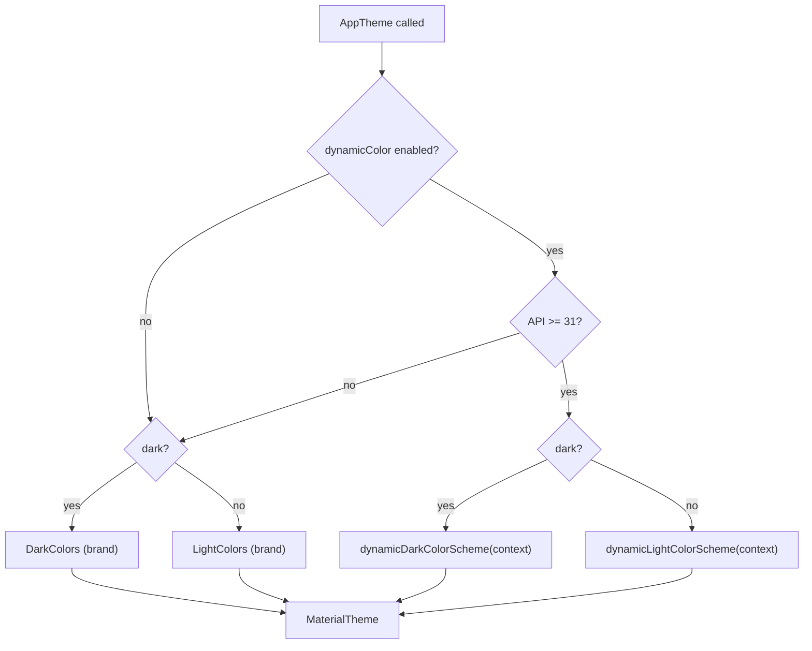

# Lesson 03 — Dynamic Color (Material You)

> After this lesson you can wire wallpaper-derived **Material You** color with `dynamicLightColorScheme`/`dynamicDarkColorScheme`, gate it correctly on Android 12+, supply a brand fallback below that, and reason about when dynamic color helps versus hurts your brand.

**Module:** 09 · **Lesson:** 03 · **Level:** 🟢🟡🔴 · **Est. time:** 70–90 min

---

## 1. Concept

### 🟢 For beginners — *what is it and why do I care?*

**Dynamic color** (Google's marketing name is **Material You**) lets your app borrow colors from the user's **wallpaper**. Android extracts a palette from their background image and the system offers it to apps. If you opt in, your buttons, highlights, and surfaces tint to match the phone the user has personalized — so your app feels like it *belongs* on their device instead of imposing its own colors.

You opt in by building your `ColorScheme` from the system instead of your own hex values:

```kotlin
val context = LocalContext.current
val scheme = dynamicLightColorScheme(context)   // colors derived from the wallpaper
```

There's one catch you must handle: **dynamic color only exists on Android 12 (API 31) and newer.** On older phones the functions aren't available, so you need a **fallback** — your own brand scheme from [Lesson 02](02-color-roles-schemes.md). The pattern is always: *use dynamic if the OS supports it, otherwise use my brand colors.*

### 🟡 For intermediate devs — *the mechanism*

The four entry points (all in `androidx.compose.material3`):

```kotlin
dynamicLightColorScheme(context): ColorScheme
dynamicDarkColorScheme(context): ColorScheme
// (and the rarely-used "vibrant"/"expressive" variants on newer versions)
```

They take a `Context` because the palette comes from system resources seeded by the wallpaper. They return a **complete, valid `ColorScheme`** — every role (`primary`, `surface`, `onSurfaceVariant`, the whole `surfaceContainer*` ramp, `inverse*`, …) is filled and contrast-correct, because Android generates it from a tonal palette. You then hand that scheme to `MaterialTheme` exactly like a static one.

The canonical wiring, folded into your `AppTheme`:

```kotlin
@Composable
fun AppTheme(
    darkTheme: Boolean = isSystemInDarkTheme(),
    dynamicColor: Boolean = true,
    content: @Composable () -> Unit,
) {
    val context = LocalContext.current
    val colorScheme = when {
        dynamicColor && Build.VERSION.SDK_INT >= Build.VERSION_CODES.S ->
            if (darkTheme) dynamicDarkColorScheme(context) else dynamicLightColorScheme(context)
        darkTheme -> DarkColors      // your brand fallback (Lesson 02)
        else      -> LightColors
    }
    MaterialTheme(colorScheme = colorScheme, typography = AppTypography, shapes = AppShapes, content = content)
}
```

Notice the **order of the `when`**: dynamic first (and only if both the user toggle *and* the OS version allow it), then dark fallback, then light fallback. Because dynamic schemes already include light/dark twins, you pick `dynamicDark…` vs `dynamicLight…` by the same `darkTheme` flag you use everywhere else.

The big behavioral consequence: **because dynamic color codes against roles, you get it almost for free** — *if* your UI already asks for `primary`/`surface`/`onSurfaceVariant` rather than hex. Every hardcoded color is a hole dynamic color can't fill.

### 🔴 For senior devs — *trade-offs, edges, internals*

- **Dynamic color is a *brand* decision, not just a technical one.** Material You makes the app feel native to the user's device, but it **surrenders brand color control**: your "purple" app turns teal under a teal wallpaper. For a strong-identity brand (a bank, a game, a recognizable consumer product), that's often unacceptable for `primary`. A common compromise: keep brand `primary` fixed but let **neutral surfaces** follow the wallpaper, or expose dynamic color as a *user setting* (default on for utility apps, off for brand-forward ones).
- **The version gate is mandatory and easy to get subtly wrong.** Calling `dynamicLightColorScheme` on API < 31 fails. Guard with `Build.VERSION.SDK_INT >= Build.VERSION_CODES.S`. Don't gate on `minSdk` assumptions — your `minSdk` may be 24 while you *run* on a 21st-century phone; the check is runtime, per-device.
- **Dynamic schemes are generated and not literally controllable.** You can influence *whether* and *which mode*, but not "make the dynamic primary a bit darker." If you need to tweak, you've effectively left dynamic color and should fall back to a static scheme. Newer Android versions expose **contrast levels** and additional palette styles (vibrant/expressive), but the core promise stands: you take the system's palette as-is.
- **It interacts with theme switching and recomposition.** The scheme is read from `Context` inside composition, so a wallpaper change (which the system surfaces via a configuration/resource update) flows through normal recomposition — readers of `MaterialTheme.colorScheme` update. You don't manually listen for wallpaper changes; you let the theme recompute.
- **Testing must cover both worlds.** Screenshot/preview your screens with **dynamic on** *and* **dynamic off (brand fallback)**, in light and dark. A bug class unique to dynamic color: a screen that looks great on your test device's wallpaper but has poor internal contrast under an unusual wallpaper — because you leaned on a *specific* expected hue (e.g. assumed `primary` is always dark enough for white text you hardcoded). Always use the paired `on*` roles so contrast holds for *any* generated palette.
- **Widgets, notifications, and theming parity.** If you ship a home-screen widget, Android also themes it dynamically (via `@android:color/system_*`/`DynamicColors` on the View side). Keeping the app and its widget consistent is a real concern; the app side is Compose `dynamic*ColorScheme`, the widget side may use the platform dynamic color attributes.

### Analogy

Dynamic color is **adaptive camouflage**. A static theme is a fixed-pattern uniform — instantly recognizable, same everywhere. Material You is camo that samples the surrounding environment (the wallpaper) and blends in, so the app feels part of the user's habitat. The trade-off is identity: great when you *want* to blend (a system-feeling utility), wrong when you *need* to stand out (a flagship brand). And like real adaptive camo, it only works if every surface can re-tint — one hardcoded patch ruins the blend.

### Mental model

> **Dynamic color = the system hands you a full, contrast-correct `ColorScheme` from the wallpaper, on API 31+. Use it if allowed, fall back to brand colors otherwise — and it only works as far as your UI codes against roles.**

### Real-world example

The Android **Settings** app, **Google Clock**, and **Files** all adopt Material You: their accents shift with your wallpaper. By contrast, **Spotify** and most banking apps keep their brand color fixed — they deliberately *don't* adopt dynamic `primary` because green/their-blue *is* the brand. Many apps land in between, offering a "Use wallpaper colors" toggle in settings.

---

## 2. Visual Learning

**ASCII — the decision pipeline inside AppTheme:**
```text
                       ┌─────────────────────────────┐
   user toggle ───────▶│ dynamicColor == true ?      │── no ──┐
                       └──────────────┬──────────────┘        │
                                      │ yes                   │
                       ┌──────────────▼──────────────┐        │
                       │ SDK_INT >= S (API 31) ?      │── no ──┤
                       └──────────────┬──────────────┘        │
                                      │ yes                   ▼
                ┌─────────────────────┴────────┐   ┌────────────────────────┐
   darkTheme ─▶ │ dynamicDark / dynamicLight   │   │ darkTheme ? DarkColors  │
                │   ColorScheme(context)       │   │           : LightColors │
                └──────────────┬───────────────┘   └───────────┬────────────┘
                               └──────────────► MaterialThemes ◄┘
```

**Mermaid — choose the scheme:**


**Illustration prompt:**
```text
Illustration: a smartphone whose colorful wallpaper sends thin paint-streams upward into the
app UI on top of it — the buttons and highlights soak up the wallpaper's hues (a teal wallpaper
makes teal buttons). Beside it, a SECOND identical phone runs an older OS with a small "API < 31"
badge; its app instead pulls color from a labeled BRAND swatch jar. A central switch labeled
"Use wallpaper colors" routes between the two. Caption: "Borrow the wallpaper, or fall back to
brand." Modern, vibrant, clearly labeled, soft gradients.
```

---

## 3. Code

> Schemes are *provided* via `MaterialTheme` ([Lesson 01](01-the-m3-theming-model.md)) and built from roles ([Lesson 02](02-color-roles-schemes.md)). Here we focus on *deriving* the scheme dynamically with a safe fallback.

### 🟢 Beginner — opt into dynamic color (guarded)

```kotlin
@Composable
fun DynamicGreeting() {
    val context = LocalContext.current
    val scheme = if (Build.VERSION.SDK_INT >= Build.VERSION_CODES.S) {
        dynamicLightColorScheme(context)        // from the wallpaper (API 31+)
    } else {
        lightColorScheme()                      // fallback for older devices
    }

    MaterialTheme(colorScheme = scheme) {
        Surface {
            Text("Hello", color = MaterialTheme.colorScheme.primary)
        }
    }
}
```

**Explanation.** The `Build.VERSION.SDK_INT` check is the gate: on Android 12+ we derive colors from the wallpaper; otherwise we use a static scheme. The `Text` reads `primary` as always — so it gets the *wallpaper's* primary on new devices and the fallback's primary on old ones, with no other code change.

**Common mistakes.**
```kotlin
// ❌ Calling the dynamic API unconditionally → crashes / unresolved on API < 31.
val scheme = dynamicLightColorScheme(LocalContext.current)  // no version guard
```
Without the runtime SDK check this fails on older devices. The guard is not optional.

**Best practices.**
- Always gate `dynamic*ColorScheme` behind `Build.VERSION.SDK_INT >= Build.VERSION_CODES.S`.
- Provide a concrete fallback scheme for the `else` branch — never leave older devices unthemed.

---

### 🟡 Intermediate — the production `AppTheme` with a user toggle

```kotlin
@Composable
fun AppTheme(
    darkTheme: Boolean = isSystemInDarkTheme(),
    dynamicColor: Boolean = true,        // expose as a setting for brand-sensitive apps
    content: @Composable () -> Unit,
) {
    val context = LocalContext.current
    val colorScheme = when {
        dynamicColor && Build.VERSION.SDK_INT >= Build.VERSION_CODES.S ->
            if (darkTheme) dynamicDarkColorScheme(context) else dynamicLightColorScheme(context)
        darkTheme -> DarkColors
        else      -> LightColors
    }
    MaterialTheme(
        colorScheme = colorScheme,
        typography  = AppTypography,
        shapes      = AppShapes,
        content     = content,
    )
}
```

**Explanation.** One `when` makes the full decision: dynamic only when *both* the user toggle and the OS allow it, then dark/light brand fallbacks. Exposing `dynamicColor` as a parameter (driven by a DataStore setting) lets brand-forward apps default it `false` while utility apps default it `true`.

**Common mistakes.**
```kotlin
// ❌ Branch order wrong: dark fallback chosen before dynamic is ever considered.
val scheme = when {
    darkTheme -> DarkColors                                   // dynamic never reached in dark!
    dynamicColor && Build.VERSION.SDK_INT >= 31 -> dynamicLightColorScheme(context)
    else -> LightColors
}
```
Here a dark-mode user *never* gets dynamic color, because `darkTheme` matches first. Put the dynamic check **before** the light/dark fallbacks and select the dynamic light/dark twin inside it.

**Best practices.**
- Order the `when` as **dynamic → dark fallback → light fallback**.
- Make `dynamicColor` a real parameter wired to a persisted user setting; choose its default by brand strategy.

---

### 🔴 Production — dynamic color + persisted setting, brand-safe, previewable

```kotlin
// A user-controlled toggle (persisted via DataStore — see Module 15 for DataStore details).
@Composable
fun AppTheme(
    themeSettings: ThemeSettings,                  // collected from a settings repo
    content: @Composable () -> Unit,
) {
    val darkTheme = when (themeSettings.mode) {
        ThemeMode.SYSTEM -> isSystemInDarkTheme()
        ThemeMode.LIGHT  -> false
        ThemeMode.DARK   -> true
    }
    val supportsDynamic = Build.VERSION.SDK_INT >= Build.VERSION_CODES.S
    val context = LocalContext.current

    val colorScheme = when {
        themeSettings.useDynamicColor && supportsDynamic ->
            if (darkTheme) dynamicDarkColorScheme(context) else dynamicLightColorScheme(context)
        darkTheme -> DarkColors
        else      -> LightColors
    }

    MaterialTheme(
        colorScheme = colorScheme,
        typography  = AppTypography,
        shapes      = AppShapes,
        content     = content,
    )
}

// Previews must exercise BOTH worlds, since previews can't read real wallpaper.
@Preview(name = "Brand · Light")
@Composable private fun BrandLight() =
    AppTheme(ThemeSettings(useDynamicColor = false, mode = ThemeMode.LIGHT)) { Gallery() }

@Preview(name = "Brand · Dark", uiMode = UI_MODE_NIGHT_YES)
@Composable private fun BrandDark() =
    AppTheme(ThemeSettings(useDynamicColor = false, mode = ThemeMode.DARK)) { Gallery() }
```

**Explanation.** The theme is now driven by a `ThemeSettings` value (mode + dynamic toggle) that a settings screen persists, so users in regions/brands that want control have it. `darkTheme` is computed from an explicit tri-state (`SYSTEM/LIGHT/DARK`) rather than only the system flag. Previews force `useDynamicColor = false` because **the preview environment has no wallpaper** — so they exercise the brand fallback deterministically; you validate the *dynamic* path on a real device/emulator with a known wallpaper.

**Common mistakes.**
```kotlin
// ❌ Trying to preview the dynamic path → previews have no wallpaper context, results are misleading.
@Preview
@Composable private fun DynamicPreview() =
    AppTheme(ThemeSettings(useDynamicColor = true, mode = ThemeMode.LIGHT)) { Gallery() }

// ❌ Assuming a specific dynamic hue and hardcoding contrast around it.
Text("Buy", color = Color.White)   // breaks if the wallpaper makes primary light
```
Previews can't sample a wallpaper, so a "dynamic" preview is unreliable — test it on-device. And never assume the generated `primary` is dark/light; always use the paired `on*` role so contrast survives any wallpaper.

**Best practices.**
- Drive theme from a **persisted `ThemeSettings`** (mode + dynamic toggle); compute `darkTheme` from an explicit tri-state.
- Preview the **fallback** (dynamic off) deterministically; validate **dynamic** on a real device with varied wallpapers.
- Lean entirely on `on*` roles so contrast holds for *any* generated palette — never hardcode around an assumed hue.
- Decide brand strategy explicitly: dynamic-on-by-default for utilities, off-by-default (or surfaces-only) for brand-forward apps.

---

## 4. Interview Questions

**🟢 Beginner**

1. *What is Material You / dynamic color?*
   > A feature where the app derives its `ColorScheme` from the user's wallpaper (via `dynamicLightColorScheme`/`dynamicDarkColorScheme`), so its accents and surfaces match the user's personalized device.
2. *Which Android version is required for dynamic color?*
   > Android 12, API level 31 (`Build.VERSION_CODES.S`). On older versions you must fall back to a static brand scheme.

**🟡 Intermediate**

3. *How do you safely opt into dynamic color?*
   > Build the scheme inside a runtime check `Build.VERSION.SDK_INT >= Build.VERSION_CODES.S`; use `dynamicDark…`/`dynamicLight…` based on dark mode, and provide brand `lightColorScheme`/`darkColorScheme` in the `else`. Calling the dynamic API unconditionally fails on older devices.
4. *Why does dynamic color "just work" once you adopt it — and when doesn't it?*
   > Because components and your code read **roles** (`primary`, `surface`, …) and the dynamic scheme fills all roles. It *doesn't* work for any element that hardcodes a hex — that element won't follow the wallpaper.
5. *Why must the dynamic branch come before the light/dark fallback in your `when`?*
   > If a `darkTheme -> DarkColors` branch is first, a dark-mode user never reaches the dynamic check. Put the dynamic condition first and pick the dynamic light/dark twin inside it.

**🔴 Senior**

6. *What are the brand trade-offs of dynamic color, and how do teams reconcile them?*
   > Dynamic color surrenders control of brand hues (your purple may turn teal). Strong-identity apps often keep brand `primary` fixed, let only neutral surfaces follow the wallpaper, or expose dynamic color as a user setting (default chosen by brand strategy). It's a product decision, not only an engineering one.
7. *How do you test dynamic color, and what bug class is unique to it?*
   > Test both worlds (dynamic on / brand fallback) in light and dark, on real devices with varied wallpapers — previews can't sample a wallpaper. The unique bug class is contrast failures under an unusual wallpaper when code assumed a specific generated hue; using the paired `on*` roles prevents it.
8. *Can you fine-tune a dynamic scheme (e.g. darken its primary)?*
   > Not directly — dynamic schemes are system-generated; you can choose mode and, on newer versions, contrast level/palette style, but not arbitrary per-role tweaks. If you need precise control you've effectively left dynamic color and should use a static scheme.

---

## 5. AI Assistant

**Prompt example (wiring dynamic color with fallback):**
```text
Write a Compose Material 3 AppTheme (Kotlin 2.x, 2026 BOM) that:
- uses dynamicLightColorScheme/dynamicDarkColorScheme on API >= 31 (runtime Build.VERSION check)
- falls back to my brand LightColors/DarkColors below API 31
- takes dynamicColor: Boolean and darkTheme: Boolean params (dynamicColor wired to a user setting)
- orders the when as: dynamic -> dark fallback -> light fallback
Also generate paired light/dark @Preview that force dynamicColor=false (previews have no wallpaper).
Explain why each branch is ordered that way.
```

**AI workflow.**
- ✅ Good for: generating the guarded `when`, the `AppTheme` signature with a toggle, and fallback wiring; converting an existing static theme to add a dynamic branch.
- ⚠️ Watch: models frequently **omit the version guard**, **order the `when` wrong** (dark before dynamic), generate "dynamic" previews that can't work, or hardcode contrast assuming a hue. They may also forget the dark dynamic twin.

**Review workflow — map to *Common Mistakes*:**
- Is `dynamic*ColorScheme` gated by a **runtime** `SDK_INT >= S` check?
- Is the `when` ordered **dynamic → dark → light**, with a dynamic *dark* branch present?
- Are previews forcing **fallback** (dynamic off), not pretending to render dynamic?
- Did it avoid hardcoding colors that assume a specific generated hue (uses `on*` roles)?

**Validation workflow:**
1. **Run on an emulator/device with API 31+** and change the wallpaper to two very different images; confirm accents shift and contrast holds.
2. **Run on an API < 31 emulator** (or force the toggle off); confirm the brand fallback renders, no crash.
3. Toggle the in-app **dynamic setting** and dark mode in all combinations; verify no impossible/illegible surfaces.
4. Screenshot-test the **fallback** path in CI (deterministic); validate dynamic manually.

> **AI drafts, you decide.** Confirm the version guard and `when` order yourself — these are exactly where models slip, and they cause crashes or silently-disabled dynamic color.

---

## Recap / Key takeaways

- **Dynamic color (Material You)** derives a full, contrast-correct `ColorScheme` from the wallpaper via `dynamicLight/DarkColorScheme(context)`.
- It's **API 31+ only** — guard with `Build.VERSION.SDK_INT >= Build.VERSION_CODES.S` and provide a **brand fallback**.
- Order the decision **dynamic → dark fallback → light fallback**, and pick the dynamic light/dark twin by the same `darkTheme` flag.
- It "just works" **only as far as your UI codes against roles**; every hardcoded hex is a hole.
- It's a **brand trade-off** — consider a user toggle; test both worlds on real devices since previews have no wallpaper.

➡️ Next: **[Lesson 04 — Typography System](04-typography-system.md)** — the M3 type scale, reading `MaterialTheme.typography`, and adding custom fonts.
