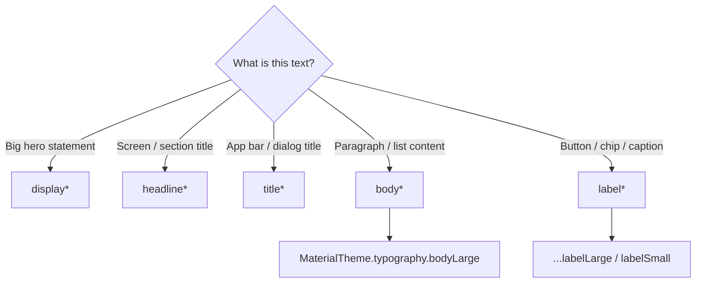

# Lesson 04 — Typography System

> After this lesson you can use the Material 3 **type scale** by role (`displayLarge` … `labelSmall`), read styles from `MaterialTheme.typography`, plug in a custom font with a `FontFamily`, and build a brand `Typography` that keeps text consistent and accessible.

**Module:** 09 · **Lesson:** 04 · **Level:** 🟢🟡🔴 · **Est. time:** 70–90 min

---

## 1. Concept

### 🟢 For beginners — *what is it and why do I care?*

Just like colors have **roles** ([Lesson 02](02-color-roles-schemes.md)), text has roles too. Instead of saying "make this 24sp bold," Material 3 lets you say "this is a **headline**" or "this is **body** text," and the theme decides the exact size, weight, line height, and letter spacing. That collection of named text styles is the **type scale**.

You read a style from the theme and hand it to `Text`:

```kotlin
Text("Welcome", style = MaterialTheme.typography.headlineMedium)
Text("Some supporting copy.", style = MaterialTheme.typography.bodyMedium)
```

Why roles again? Consistency and one-place control. Every "headline" across your app looks identical, and if you decide headlines should be a little bigger, you change the theme once — not 50 screens. You also get sensible defaults that already follow Material's typographic guidelines.

The M3 type scale has **five families, three sizes each**:

```text
Display  → displayLarge / displayMedium / displaySmall      (big, expressive — hero text)
Headline → headlineLarge / headlineMedium / headlineSmall    (section titles)
Title    → titleLarge / titleMedium / titleSmall             (smaller titles, app bar)
Body     → bodyLarge / bodyMedium / bodySmall                (paragraphs, the workhorse)
Label    → labelLarge / labelMedium / labelSmall             (buttons, captions, chips)
```

### 🟡 For intermediate devs — *the mechanism*

`MaterialTheme.typography` is a `Typography` object: a data class with one `TextStyle` per role (15 of them). A `TextStyle` bundles `fontFamily`, `fontSize`, `fontWeight`, `lineHeight`, `letterSpacing`, and more.

You customize by constructing your own `Typography` and passing it to `MaterialTheme` (the wiring from [Lesson 01](01-the-m3-theming-model.md)):

```kotlin
val AppTypography = Typography(
    headlineMedium = TextStyle(
        fontFamily = BrandFontFamily,
        fontWeight = FontWeight.SemiBold,
        fontSize = 28.sp,
        lineHeight = 36.sp,
    ),
    bodyMedium = TextStyle(
        fontFamily = BrandFontFamily,
        fontSize = 14.sp,
        lineHeight = 20.sp,
    ),
    // any role you omit keeps the Material default
)
```

To use a custom font, you build a `FontFamily`. Two common sources:

- **Bundled fonts** in `res/font/`:
  ```kotlin
  val BrandFontFamily = FontFamily(
      Font(R.font.inter_regular, FontWeight.Normal),
      Font(R.font.inter_semibold, FontWeight.SemiBold),
      Font(R.font.inter_bold, FontWeight.Bold),
  )
  ```
- **Downloadable Google Fonts** via `GoogleFont` + a `provider` (no APK bloat; fetched at runtime).

A critical detail: **sizes use `sp`, not `dp`.** `sp` (scale-independent pixels) respects the user's system font-size setting; `dp` does not. Text sized in `dp` won't grow when a low-vision user enlarges their font — an accessibility failure.

### 🔴 For senior devs — *trade-offs, edges, internals*

- **`fontSize` in `sp` scales with the user's font preference; `lineHeight` should too.** If you set `fontSize` in `sp` but `lineHeight` in `dp` (or forget `lineHeight`), large accessibility font scales clip or overlap lines. Keep both in `sp` so they scale together. M3 also supports **non-linear font scaling** on newer Android — large sizes scale less aggressively than small ones, which Compose honors automatically when you use `sp`.
- **Downloadable fonts are asynchronous; plan for the first frame.** A `GoogleFont` is fetched (and cached) at runtime. Before it arrives Compose shows a fallback; if you don't supply a sensible fallback chain the first frame can flash the system font or, worse, blank. Provide `FontFamily` fallbacks and consider preloading critical fonts. Bundled fonts avoid the flash at the cost of APK size.
- **`letterSpacing` and `lineHeight` are part of the brand, and easy to get wrong.** Designers hand off in `px`/`%`; translating to `sp`/`em` matters. M3 defaults encode researched tracking values per role; overriding only `fontSize` while leaving default tracking often looks off at brand fonts. Override the whole `TextStyle` per role rather than poking one field.
- **`Typography` interacts with `LocalTextStyle` and content color.** `Text` merges three things: the explicit `style` you pass, the ambient `LocalTextStyle`, and the current `LocalContentColor`. Inside a `ProvideTextStyle` (e.g. a list item slot) your `Text` inherits that style. Knowing the merge order prevents "why is my text the wrong size in this slot" confusion.
- **Variable fonts and emphasis.** Modern variable fonts expose weight/width axes; Compose supports `FontVariation` settings. For **Material 3 Expressive**, type plays a bigger role in conveying emphasis (heavier display weights, more contrast between roles). Treat the type scale as a brand instrument, not just sizes.
- **Don't fight the scale with one-off styles.** Ad-hoc `TextStyle`s scattered in screens are the typographic equivalent of hardcoded hex: they drift and can't be tuned centrally. If a design needs a style the scale lacks, add it to the theme (or use the closest role) rather than inlining.

### Analogy

The type scale is a **set of named heading levels in a document template** — `H1`, `H2`, body, caption. A writer never sets point sizes by hand; they tag a paragraph as "Heading 2" and the template renders it consistently. Change the template's H2 definition and every H2 in the document updates. Inlining a `TextStyle` is like manually formatting one heading to 18pt bold — it looks right until the template changes and that one heading is now out of step.

### Mental model

> **Tag text by role (headline / title / body / label), not by size. Size in `sp` so it respects the user; customize the whole `Typography` once, not per screen.**

### Real-world example

**Twitter/X**, **Reddit**, and Google's apps all run a small, strict type scale: one body style for posts, one title style for headers, one label style for buttons/metadata. The reason your feed feels coherent as you scroll thousands of items is that every item uses the *same* `bodyLarge`/`labelSmall` from one `Typography` — not bespoke sizes per card.

---

## 2. Visual Learning

**ASCII — the five families, large→small:**
```text
   DISPLAY   ████████████████  displayLarge   (hero / marketing)
             ████████████      displayMedium
             ██████████        displaySmall
   HEADLINE  ████████          headlineLarge  (section titles)
             ███████           headlineMedium
             ██████            headlineSmall
   TITLE     █████             titleLarge      (app bar, dialog title)
             ████              titleMedium
             ███               titleSmall
   BODY      ███               bodyLarge       (paragraphs — the workhorse)
             ██▌               bodyMedium
             ██                bodySmall
   LABEL     ██                labelLarge      (buttons)
             █▌                labelMedium     (chips, captions)
             █                 labelSmall
```

**Mermaid — pick a type role:**


**Illustration prompt:**
```text
Illustration: a vertical "type ladder" floating in a clean studio. Each rung is a labeled
text sample shrinking as it descends: DISPLAY at top in big expressive letters, then HEADLINE,
TITLE, BODY, LABEL at the bottom. A single control panel labeled "Typography" has sliders
(font family, weight, size in sp) wired to every rung, showing one change cascading to all
samples of that role. A small accessibility slider labeled "user font scale" gently enlarges
the whole ladder. Caption: "Tag by role, size in sp." Modern, vibrant, crisp labels.
```

---

## 3. Code

> Typography is *provided* through `MaterialTheme(typography = …)` ([Lesson 01](01-the-m3-theming-model.md)). Here we consume roles and define a custom scale.

### 🟢 Beginner — use type roles instead of raw sizes

```kotlin
@Composable
fun ArticleHeader(title: String, subtitle: String) {
    Column {
        Text(title, style = MaterialTheme.typography.headlineSmall)
        Text(
            subtitle,
            style = MaterialTheme.typography.bodyMedium,
            color = MaterialTheme.colorScheme.onSurfaceVariant,  // secondary text role
        )
    }
}
```

**Explanation.** Title and subtitle are tagged by *role*, so they match every other header/subtitle in the app and respect the user's font scale. The subtitle also uses the `onSurfaceVariant` color role to read as secondary — type and color roles working together.

**Common mistakes.**
```kotlin
// ❌ Hardcoded size/weight — drifts from the scale, ignores accessibility intent.
Text(title, fontSize = 22.sp, fontWeight = FontWeight.Bold)
// ❌ Worse: size in dp — won't scale with the user's font setting at all.
Text(title, style = TextStyle(fontSize = 22.dp.value.sp))  // confused units; avoid
```
Inlined sizes drift from the scale and can't be tuned centrally; sizing in anything but `sp` breaks accessibility scaling.

**Best practices.**
- Tag text by role (`headlineSmall`, `bodyMedium`, …); don't set raw `fontSize`/`fontWeight` ad hoc.
- Use `onSurfaceVariant` (not a lighter hardcoded gray) for secondary text.

---

### 🟡 Intermediate — a custom font + brand `Typography`

```kotlin
// 1) Define the font family (bundled in res/font/).
val Inter = FontFamily(
    Font(R.font.inter_regular, FontWeight.Normal),
    Font(R.font.inter_medium, FontWeight.Medium),
    Font(R.font.inter_semibold, FontWeight.SemiBold),
)

// 2) Start from M3 defaults and override per role with the brand font.
private val default = Typography()
val AppTypography = Typography(
    headlineMedium = default.headlineMedium.copy(fontFamily = Inter, fontWeight = FontWeight.SemiBold),
    titleLarge     = default.titleLarge.copy(fontFamily = Inter, fontWeight = FontWeight.Medium),
    bodyLarge      = default.bodyLarge.copy(fontFamily = Inter),
    bodyMedium     = default.bodyMedium.copy(fontFamily = Inter),
    labelLarge     = default.labelLarge.copy(fontFamily = Inter, fontWeight = FontWeight.Medium),
)

// 3) Wire into the theme (Lesson 01): MaterialTheme(typography = AppTypography, ...)
```

**Explanation.** Building from `Typography()` defaults and `.copy(...)`-ing each role preserves Material's researched `fontSize`/`lineHeight`/`letterSpacing` while swapping in the brand font and weights. This keeps tracking and line height correct instead of resetting them by accident.

**Common mistakes.**
```kotlin
// ❌ Overriding only fontFamily/size and dropping the tuned lineHeight & letterSpacing.
val bad = Typography(
    bodyLarge = TextStyle(fontFamily = Inter, fontSize = 16.sp) // no lineHeight/tracking → looks cramped
)
```
Constructing a bare `TextStyle` discards the role's carefully tuned line height and letter spacing. Prefer `default.bodyLarge.copy(...)`.

**Best practices.**
- Build from `Typography()` defaults with `.copy(...)`; don't reconstruct `TextStyle`s from scratch unless intentional.
- Keep `lineHeight` and `letterSpacing` aligned to the brand and in `sp`/`em`.
- Provide the weights you actually reference (`Normal`/`Medium`/`SemiBold`) in the `FontFamily`.

---

### 🔴 Production — downloadable Google Font with a safe fallback

```kotlin
// Runtime-downloaded font: no APK bloat, but asynchronous → must handle the first frame.
private val provider = GoogleFont.Provider(
    providerAuthority = "com.google.android.gms.fonts",
    providerPackage = "com.google.android.gms",
    certificates = R.array.com_google_android_gms_fonts_certs,
)

private val interGF = GoogleFont("Inter")

val InterDownloadable = FontFamily(
    Font(googleFont = interGF, fontProvider = provider, weight = FontWeight.Normal),
    Font(googleFont = interGF, fontProvider = provider, weight = FontWeight.Medium),
    Font(googleFont = interGF, fontProvider = provider, weight = FontWeight.SemiBold),
)

private val base = Typography()
val AppTypography = Typography(
    displaySmall   = base.displaySmall.copy(fontFamily = InterDownloadable, fontWeight = FontWeight.SemiBold),
    headlineMedium = base.headlineMedium.copy(fontFamily = InterDownloadable, fontWeight = FontWeight.SemiBold),
    titleLarge     = base.titleLarge.copy(fontFamily = InterDownloadable, fontWeight = FontWeight.Medium),
    bodyLarge      = base.bodyLarge.copy(fontFamily = InterDownloadable),
    bodyMedium     = base.bodyMedium.copy(fontFamily = InterDownloadable),
    labelLarge     = base.labelLarge.copy(fontFamily = InterDownloadable, fontWeight = FontWeight.Medium),
)

@Composable
fun ScalableHeadline(text: String) {
    // lineHeight in sp scales WITH fontSize for accessibility; role already encodes both.
    Text(text, style = MaterialTheme.typography.headlineMedium, maxLines = 2)
}
```

**Explanation.** The Google Font provider fetches Inter at runtime (cached after first load), so the APK stays small. Because the family lists the weights it needs, Compose can fall back per weight while loading. Building each role from `base.*.copy(...)` keeps tuned `lineHeight`/`letterSpacing` in `sp`, so text scales correctly when the user enlarges their system font. The headline caps at two lines to stay robust at large font scales.

**Common mistakes.**
```kotlin
// ❌ No fallback / not declaring weights → first-frame flash or wrong weight before download.
val risky = FontFamily(Font(googleFont = GoogleFont("Inter"), fontProvider = provider))
// only Normal declared; SemiBold usages synthesize-bold or flash

// ❌ Mixing sp fontSize with a dp/absent lineHeight → lines overlap at large accessibility scales.
TextStyle(fontFamily = InterDownloadable, fontSize = 28.sp /* lineHeight missing */)
```
Under-declaring weights causes synthetic bolding/flashes; mismatched or missing `lineHeight` breaks at large font scales.

**Best practices.**
- For downloadable fonts, **declare every weight** you use and rely on `.copy()` to keep `lineHeight` in `sp`.
- Test at **largest accessibility font scale**; cap lines and verify no clipping/overlap.
- Prefer **bundled** fonts when a flash-free first frame matters; **downloadable** when APK size matters.
- Treat the whole `TextStyle` (family + weight + size + line height + tracking) as the brand unit.

---

## 4. Interview Questions

**🟢 Beginner**

1. *What is the Material 3 type scale?*
   > A set of named text styles grouped into five families — display, headline, title, body, label — each with large/medium/small. You tag text by role (`bodyMedium`, `headlineSmall`) and the theme supplies size, weight, line height, and tracking.
2. *How do you apply a type style to `Text`?*
   > Pass it via `style`, e.g. `Text("Hi", style = MaterialTheme.typography.titleLarge)`.

**🟡 Intermediate**

3. *Why size text in `sp` rather than `dp`?*
   > `sp` respects the user's system font-size setting (accessibility); `dp` does not. Text sized in `dp` won't enlarge for low-vision users, which is an accessibility failure.
4. *How do you apply a custom font across the app?*
   > Build a `FontFamily` (bundled `Font(R.font.…)` or downloadable `GoogleFont`), then construct a `Typography` overriding roles with that family — usually via `Typography().<role>.copy(fontFamily = …)` — and pass it to `MaterialTheme(typography = …)`.
5. *Why prefer `default.bodyLarge.copy(...)` over a fresh `TextStyle`?*
   > `.copy` preserves the role's tuned `lineHeight` and `letterSpacing`; a bare `TextStyle` discards them, often making text look cramped or off-brand.

**🔴 Senior**

6. *What goes wrong with downloadable (Google) fonts, and how do you mitigate it?*
   > They load asynchronously, so the first frame may flash a fallback or synthesize a missing weight. Mitigate by declaring every weight in the `FontFamily`, providing sensible fallbacks, optionally preloading critical fonts, or bundling fonts when a flash-free first frame is required.
7. *How does font scaling interact with `lineHeight`, and how do you keep large scales legible?*
   > If `fontSize` is in `sp` but `lineHeight` is in `dp` or missing, large accessibility scales clip/overlap lines because they don't scale together. Keep both in `sp` (Compose also applies non-linear scaling for large sizes). Cap `maxLines` and test at the largest scale.
8. *How does `Text` resolve its final style when you pass `style`, and there's an ambient `LocalTextStyle`?*
   > `Text` merges the explicit `style` over the ambient `LocalTextStyle`, and applies `LocalContentColor` for color if unset. So a `Text` inside a `ProvideTextStyle`/list-item slot inherits that slot's style unless overridden — understanding the merge order avoids surprising sizes in component slots.

---

## 5. AI Assistant

**Prompt example (build a brand type scale):**
```text
Create a Material 3 Typography for Compose (Kotlin 2.x, 2026 BOM) using the "Inter" font as a
DOWNLOADABLE Google Font. Requirements:
- declare Normal/Medium/SemiBold weights in the FontFamily with the GMS provider
- override display/headline/title/body/label roles by .copy()-ing from Typography() defaults
  (keep tuned lineHeight & letterSpacing; sizes in sp)
- expose AppTypography to pass into MaterialTheme(typography = …)
Then list any role where you changed lineHeight and why. Don't construct bare TextStyles.
```

**AI workflow.**
- ✅ Good for: scaffolding the `FontFamily`/provider setup, generating a full `Typography` by `.copy()`-ing defaults, and converting an XML `TextAppearance` set into roles.
- ⚠️ Watch: models build bare `TextStyle`s (losing line height/tracking), forget to declare all weights for downloadable fonts, and occasionally size in `dp` or omit `lineHeight`.

**Review workflow — map to *Common Mistakes*:**
- Are roles built via `Typography().<role>.copy(...)` (keeping `lineHeight`/tracking), not fresh `TextStyle`s?
- For downloadable fonts, are **all referenced weights declared** with a provider and fallback?
- Is every size in **`sp`** (never `dp`), with `lineHeight` present and in `sp`?
- Do screens use **roles**, not ad-hoc `fontSize`/`fontWeight`?

**Validation workflow:**
1. **Run** and switch system font size to **largest**; confirm no clipping/overlap and that text actually grows.
2. For downloadable fonts, test on a **fresh install / airplane mode** to observe first-frame fallback behavior.
3. Grep the diff for `fontSize =` and `dp` near text — confirm sizes come from roles and use `sp`.
4. Compare a screen's headings against the type scale in the **layout preview** to catch drift.

> **AI drafts, you decide.** Re-check that every role kept its tuned line height and that nothing slipped into `dp` — those two are the silent accessibility breakers.

---

## Recap / Key takeaways

- **Type roles, not raw sizes:** tag text `display/headline/title/body/label` and read from `MaterialTheme.typography`.
- Size in **`sp`** (and keep `lineHeight` in `sp`) so text honors the user's accessibility font scale.
- Customize once via a brand `Typography`, ideally `.copy()`-ing M3 defaults to **preserve tuned line height/tracking**.
- **Bundled** fonts = flash-free but bigger APK; **downloadable** Google Fonts = small APK but async (declare all weights, provide fallbacks).
- Ad-hoc `TextStyle`s in screens are the typographic version of hardcoded hex — add to the theme instead.

➡️ Next: **[Lesson 05 — Shape System](05-shape-system.md)** — the M3 shape scale, per-component shapes, and how corners signal hierarchy.
