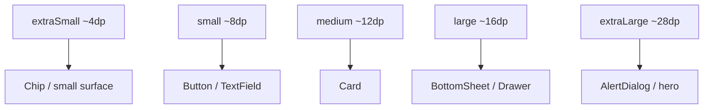

# Lesson 05 — Shape System

> After this lesson you can use the Material 3 **shape scale** (`extraSmall` … `extraLarge`), read shapes from `MaterialTheme.shapes`, override a single component's corners, and reason about which components own which shape role.

**Module:** 09 · **Lesson:** 05 · **Level:** 🟢🟡🔴 · **Est. time:** 60–80 min

---

## 1. Concept

### 🟢 For beginners — *what is it and why do I care?*

The third pillar of a Material theme — after color and type — is **shape**: how rounded the corners of your buttons, cards, sheets, and dialogs are. Like color and type, shape uses **named roles** so you don't sprinkle `RoundedCornerShape(12.dp)` everywhere.

The M3 **shape scale** has five named sizes:

```text
extraSmall  → ~4dp   (chips, small surfaces)
small       → ~8dp   (buttons, text fields)
medium      → ~12dp  (cards)
large       → ~16dp  (bottom sheets, large cards, navigation drawer)
extraLarge  → ~28dp  (big surfaces, hero containers, dialogs)
```

You read a shape from the theme and hand it to a `Surface`, `Card`, or `Modifier.clip`:

```kotlin
Surface(shape = MaterialTheme.shapes.medium) { /* a card-like surface */ }
```

Why roles for shape? The same reasons as color and type: **consistency** (every card has identical corners) and **one-place control** (round all your cards a bit more by editing the theme once). Corner roundness also quietly communicates hierarchy — bigger, more important surfaces tend to use larger corner radii.

### 🟡 For intermediate devs — *the mechanism*

`MaterialTheme.shapes` is a `Shapes` object: a data class with five `CornerBasedShape` slots (`extraSmall`, `small`, `medium`, `large`, `extraLarge`). Each is usually a `RoundedCornerShape`, but can be a `CutCornerShape` for an angular brand.

You customize by constructing your own `Shapes` and passing it to `MaterialTheme` ([Lesson 01](01-the-m3-theming-model.md)):

```kotlin
val AppShapes = Shapes(
    extraSmall = RoundedCornerShape(4.dp),
    small      = RoundedCornerShape(8.dp),
    medium     = RoundedCornerShape(16.dp),   // rounder cards
    large      = RoundedCornerShape(24.dp),
    extraLarge = RoundedCornerShape(32.dp),
)
```

Each Material component has a **default shape role** it reads from the theme:

| Component | Default shape role |
|---|---|
| `Button`, `TextField` | `small` (buttons are actually fully-rounded by default in M3, but tonal/card-like surfaces use `small`) |
| `Card` | `medium` |
| `BottomSheet`, `NavigationDrawer` | `large` |
| `AlertDialog` | `extraLarge` |
| `Chip` | `small` |

So changing `MaterialTheme.shapes.medium` reshapes **every card** at once. You can also override one component locally by passing an explicit `shape =` — that overrides the role for that instance only.

Two useful tools:

- **Per-corner control:** `RoundedCornerShape(topStart = 16.dp, topEnd = 16.dp, bottomStart = 0.dp, bottomEnd = 0.dp)` for sheets that round only the top.
- **`Modifier.clip(shape)`** to clip arbitrary content (e.g. an image) to a theme shape.

### 🔴 For senior devs — *trade-offs, edges, internals*

- **Shape carries meaning; treat it as a design token, not decoration.** In M3, corner radius correlates with surface size/importance and with **state** — e.g. a button or FAB may *morph* its corner radius on press, and Material 3 Expressive leans heavily on **shape morphing** for personality. If you hardcode `RoundedCornerShape` per component you lose the ability to express these systematically (and to animate them).
- **`CornerSize` can be `dp`, percent, or px — and percent behaves differently.** `RoundedCornerShape(50)` (percent) makes a **pill/stadium** that stays fully rounded regardless of height, which is how M3 buttons and FABs read as fully rounded. `RoundedCornerShape(50.dp)` is a fixed radius that looks wrong if the component is shorter than 100dp. Know which you want: percent for shape-that-tracks-size, `dp` for fixed radius.
- **Clipping vs shadow vs outline must agree.** A `Surface`/`Card` clips content, draws the shadow, and draws the border all to the *same* shape. If you instead `Modifier.clip(A)` then `Modifier.border(B)`, the border and clip diverge and you get visual seams. Prefer the component's `shape =` parameter so clip+shadow+border stay coherent; reach for raw modifiers only when you must.
- **Order of clip/background/padding in a `Modifier` chain matters.** `Modifier.background(color).clip(shape)` clips *after* painting → the background ignores the corners. The correct order is `clip(shape)` (or `Modifier.clip` before `background`) so paint respects the shape. This is a frequent "my rounded corners show a square background" bug.
- **Performance: clipping isn't free at scale.** Each `clip` introduces a render-node clip; thousands of clipped list items can add overhead. Often a `Surface`/`Card` (which clips efficiently and only when needed) or drawing a rounded background is cheaper than stacking multiple `clip`s. Profile if a list with heavy rounding janks ([Module 11](../module-11-performance/README.md)).
- **Shape and accessibility/touch target are independent.** Rounding corners doesn't shrink the touch target; keep the **48dp** minimum touch size regardless of visual radius. A small, very-rounded chip still needs adequate hit area.

### Analogy

The shape scale is the **corner-radius design token** in a design system, like a CSS `--radius-md` variable. Designers don't decide per-button whether it's 10px or 12px; they say "use the medium radius," and changing `--radius-md` reshapes everything tagged with it. Hardcoding `RoundedCornerShape(12.dp)` is like writing `border-radius: 12px` inline on every element — fine until the brand wants rounder corners and you're editing hundreds of rules.

### Mental model

> **Tag surfaces by shape role (small/medium/large…), not by literal radius. Bigger, more important surfaces get bigger corners; change the role once to reshape everything that uses it.**

### Real-world example

In **Material You** apps the size hierarchy is visible: chips and text fields use small corners, content **cards** use medium, **bottom sheets** and the **navigation drawer** use large, and **dialogs** use extra-large. Google's redesigned apps (Photos, Files, Settings) all follow this so the "weight" of a surface reads partly from its corner radius — and they morph corners on press for tactility.

---

## 2. Visual Learning

**ASCII — the shape scale, small→large corners:**
```text
   extraSmall (~4dp)   ▕▔▔▔▔▔▏      chips, tiny surfaces
                       ▕▁▁▁▁▁▏

   small (~8dp)        ╭─────╮       buttons, text fields
                       ╰─────╯

   medium (~12dp)      ╭───────╮     cards
                       │       │
                       ╰───────╯

   large (~16dp)       ╭─────────╮   bottom sheets, drawers
                       │         │
                       ╰─────────╯

   extraLarge (~28dp)  ╭───────────╮  dialogs, hero containers
                       │           │
                       ╰───────────╯
   ── corner radius grows with surface size & importance ──▶
```

**Mermaid — component → shape role:**


**Illustration prompt:**
```text
Illustration: five stacked surfaces of increasing size, each with progressively rounder corners,
labeled extraSmall, small, medium, large, extraLarge — a chip, a button, a card, a bottom sheet,
a dialog. A single control knob labeled "Shapes" is wired to all five; turning it rounds every
surface of that role at once. One button is mid-press, its corners visibly morphing rounder, with
a small "state morph" tag. Caption: "Corners are a design token." Modern, clean, soft studio light.
```

---

## 3. Code

> Shapes are *provided* via `MaterialTheme(shapes = …)` ([Lesson 01](01-the-m3-theming-model.md)). Here we consume roles and define a brand scale.

### 🟢 Beginner — use a shape role

```kotlin
@Composable
fun PhotoCard(label: String) {
    Card(shape = MaterialTheme.shapes.medium) {   // 'medium' is also Card's default
        Column(Modifier.padding(12.dp)) {
            Box(
                Modifier
                    .size(120.dp)
                    .clip(MaterialTheme.shapes.small)             // clip image to a theme shape
                    .background(MaterialTheme.colorScheme.surfaceVariant)
            )
            Spacer(Modifier.height(8.dp))
            Text(label, style = MaterialTheme.typography.labelLarge)
        }
    }
}
```

**Explanation.** The card uses the `medium` shape role and the inner image box is clipped to `small` — both come from the theme, so every card and thumbnail across the app share corners. Change the theme once and they all update together.

**Common mistakes.**
```kotlin
// ❌ Hardcoded radius — drifts from the scale, can't be tuned centrally.
Card(shape = RoundedCornerShape(12.dp)) { /* ... */ }

// ❌ Wrong modifier order: background painted before clip → square corners show through.
Box(Modifier.background(color).clip(MaterialTheme.shapes.small))
```
Hardcoded radii drift from the scale; painting `background` before `clip` ignores the corners (a classic "rounded box with a square fill" bug — clip first).

**Best practices.**
- Use `MaterialTheme.shapes.<role>` for component shapes and `Modifier.clip(shape)` for content.
- In a modifier chain, `clip` **before** `background` so paint respects the corners.

---

### 🟡 Intermediate — define a brand shape scale + a top-rounded sheet

```kotlin
val AppShapes = Shapes(
    extraSmall = RoundedCornerShape(4.dp),
    small      = RoundedCornerShape(8.dp),
    medium     = RoundedCornerShape(16.dp),   // rounder cards = brand choice
    large      = RoundedCornerShape(24.dp),
    extraLarge = RoundedCornerShape(28.dp),
)

@Composable
fun TopRoundedSheet(content: @Composable ColumnScope.() -> Unit) {
    Surface(
        color = MaterialTheme.colorScheme.surfaceContainerHigh,
        // Per-corner override: round only the top, square at the bottom edge.
        shape = RoundedCornerShape(topStart = 24.dp, topEnd = 24.dp, bottomStart = 0.dp, bottomEnd = 0.dp),
    ) {
        Column(Modifier.fillMaxWidth().padding(16.dp), content = content)
    }
}
```

**Explanation.** `AppShapes` becomes the single source of corner radii once wired into `MaterialTheme`. The sheet shows the per-corner tool: `RoundedCornerShape(topStart, topEnd, bottomStart, bottomEnd)` rounds the top only — the right look for a bottom sheet that meets the screen edge.

**Common mistakes.**
```kotlin
// ❌ Fixed dp radius on something that should be a pill → looks wrong if it's short.
Button(onClick = {}, shape = RoundedCornerShape(50.dp)) { Text("Go") } // 50dp ≠ pill on a 40dp-tall button
```
For a stadium/pill that stays fully rounded at any height, use a **percent** corner (`RoundedCornerShape(50)` or `CircleShape`), not a fixed `dp`.

**Best practices.**
- Define `AppShapes` once; override per-corner only when a component genuinely needs it (sheets, headers).
- Use **percent** corners (`RoundedCornerShape(50)`/`CircleShape`) for pills/FABs that must stay fully rounded.

---

### 🔴 Production — shape that morphs on interaction (state-aware)

```kotlin
@Composable
fun MorphingActionButton(
    text: String,
    onClick: () -> Unit,
) {
    val interactions = remember { MutableInteractionSource() }
    val pressed by interactions.collectIsPressedAsState()

    // Corner radius animates between resting (pill) and pressed (squarer) — M3 Expressive flavor.
    val radius by animateDpAsState(
        targetValue = if (pressed) 12.dp else 28.dp,
        label = "corner",
    )

    Surface(
        onClick = onClick,
        interactionSource = interactions,
        shape = RoundedCornerShape(radius),                 // animated shape
        color = MaterialTheme.colorScheme.primaryContainer,
        contentColor = MaterialTheme.colorScheme.onPrimaryContainer,
    ) {
        Text(
            text,
            style = MaterialTheme.typography.labelLarge,
            modifier = Modifier.padding(horizontal = 24.dp, vertical = 14.dp),
        )
    }
}
```

**Explanation.** Corner radius is driven by interaction state: resting it's a soft 28dp, on press it morphs to 12dp via `animateDpAsState` ([Module 10](../module-10-animations/README.md) covers the animation APIs). This is the M3 Expressive idea — shape conveys feedback. Because the `Surface` owns the `shape`, clip + ripple + (any) elevation stay coherent through the morph. Content color is set via the surface so the label automatically uses `onPrimaryContainer`.

**Common mistakes.**
```kotlin
// ❌ Animating clip on a child while the Surface keeps its own static shape → ripple/clip mismatch.
Surface(shape = RoundedCornerShape(28.dp)) {
    Box(Modifier.clip(RoundedCornerShape(radius))) { /* ripple still uses 28dp; seams appear */ }
}
```
Animating a child's clip while the surface keeps a static shape desyncs the ripple/clip/shadow. Drive the **surface's** `shape` so everything morphs together.

**Best practices.**
- Drive shape changes through the **component's `shape`** so clip, ripple, shadow, and border stay in sync.
- Animate corners with `animateDpAsState`/`Animatable` rather than swapping discrete shapes for smoothness.
- Keep the **48dp touch target** regardless of visual radius; rounding never excuses a tiny hit area.

---

## 4. Interview Questions

**🟢 Beginner**

1. *What is the Material 3 shape scale?*
   > Five named corner sizes — `extraSmall`, `small`, `medium`, `large`, `extraLarge` — read from `MaterialTheme.shapes`. You tag components by shape role instead of hardcoding a radius, so corners stay consistent and centrally tunable.
2. *How do you give a `Card` rounded corners from the theme?*
   > `Card(shape = MaterialTheme.shapes.medium)` (medium is also its default). For arbitrary content use `Modifier.clip(MaterialTheme.shapes.medium)`.

**🟡 Intermediate**

3. *Why use shape roles instead of `RoundedCornerShape(12.dp)` everywhere?*
   > Consistency and one-place control: every card shares corners and you can reshape all of them by editing the theme once. Hardcoded radii drift and can't be tuned centrally — the shape equivalent of hardcoded hex.
4. *What's the difference between `RoundedCornerShape(50)` and `RoundedCornerShape(50.dp)`?*
   > `50` is a **percent** corner → a pill/stadium that stays fully rounded at any height (used for buttons/FABs). `50.dp` is a fixed radius that looks wrong on short components. Use percent for size-tracking roundness, `dp` for fixed.
5. *Why does `Modifier.background(color).clip(shape)` show square corners?*
   > Modifiers apply in order: the background is painted before the clip, so it ignores the shape. Put `clip` first (`Modifier.clip(shape).background(color)`).

**🔴 Senior**

6. *Why prefer a component's `shape =` over chaining `clip` + `border` yourself?*
   > A `Surface`/`Card` clips content, draws the shadow, and draws the border to the **same** shape, so they stay coherent. Separate `clip`/`border` modifiers can diverge and create seams. Use raw modifiers only when no component fits.
7. *What are the performance considerations of clipping at scale?*
   > Each `clip` adds a render-node clip; thousands of clipped list items add overhead. Prefer the efficient clipping a `Surface`/`Card` already does, or a rounded background, over stacking multiple `clip`s, and profile lists with heavy rounding.
8. *How does shape express state in Material 3 Expressive, and how do you implement it cleanly?*
   > Components morph corner radius on interaction (press, selection) for tactility. Implement by animating the **surface's** `shape` (e.g. `animateDpAsState` on the corner size) so clip/ripple/shadow morph together — not by animating a child's clip independently, which desyncs them.

---

## 5. AI Assistant

**Prompt example (define a brand shape scale):**
```text
Create a Material 3 Shapes object for Compose (Kotlin 2.x, 2026 BOM):
- extraSmall 4dp, small 8dp, medium 16dp (rounder cards), large 24dp, extraLarge 28dp
- expose AppShapes for MaterialTheme(shapes = …)
Then show: (1) a bottom sheet that rounds only the top corners via per-corner RoundedCornerShape,
(2) a pill button using a percent corner (not fixed dp). Don't hardcode radii inside screens —
read MaterialTheme.shapes.<role>.
```

**AI workflow.**
- ✅ Good for: generating the `Shapes` object, per-corner sheet shapes, and clip wiring; converting hardcoded `RoundedCornerShape(x.dp)` usages to roles.
- ⚠️ Watch: models hardcode radii in components, use fixed `dp` where a percent pill is intended, and get **modifier order** wrong (`background` before `clip`). For morphing shapes they may animate a child's clip instead of the surface shape.

**Review workflow — map to *Common Mistakes*:**
- Do components read `MaterialTheme.shapes.<role>` instead of literal radii?
- Is `clip` **before** `background` in modifier chains?
- Are pills/FABs using **percent** corners (`RoundedCornerShape(50)`/`CircleShape`), not fixed `dp`?
- For morphing shapes, is the **surface's** `shape` animated (clip+ripple coherent)?

**Validation workflow:**
1. **Run** and visually compare cards/sheets/dialogs to the intended scale; round the theme up and confirm all update.
2. Check the **square-background bug** is absent (rounded surfaces show no square fill).
3. Press interactive surfaces; confirm ripple stays within the (possibly morphing) corners.
4. Grep the diff for `RoundedCornerShape(` inside screens — most should be theme reads; flag literals.

> **AI drafts, you decide.** The two silent shape bugs are wrong modifier order and fixed-`dp` "pills" — verify both before merging.

---

## Recap / Key takeaways

- **Shape roles, not literal radii:** tag surfaces `extraSmall/small/medium/large/extraLarge` from `MaterialTheme.shapes`.
- Each component has a **default shape role** (Card = medium, sheet = large, dialog = extraLarge); change the role to reshape all instances.
- Use **percent** corners (`RoundedCornerShape(50)`/`CircleShape`) for pills/FABs; `dp` for fixed radius; per-corner for top-rounded sheets.
- Drive shape through the **component's `shape`** so clip + ripple + shadow + border stay coherent (and morph together).
- Mind **modifier order** (`clip` before `background`), **clipping cost** at scale, and the **48dp touch target**.

➡️ Next: **[Lesson 06 — Light/Dark & Custom Themes](06-light-dark-custom-themes.md)** — building and testing both modes, extending the theme, and Material 3 Expressive notes.
