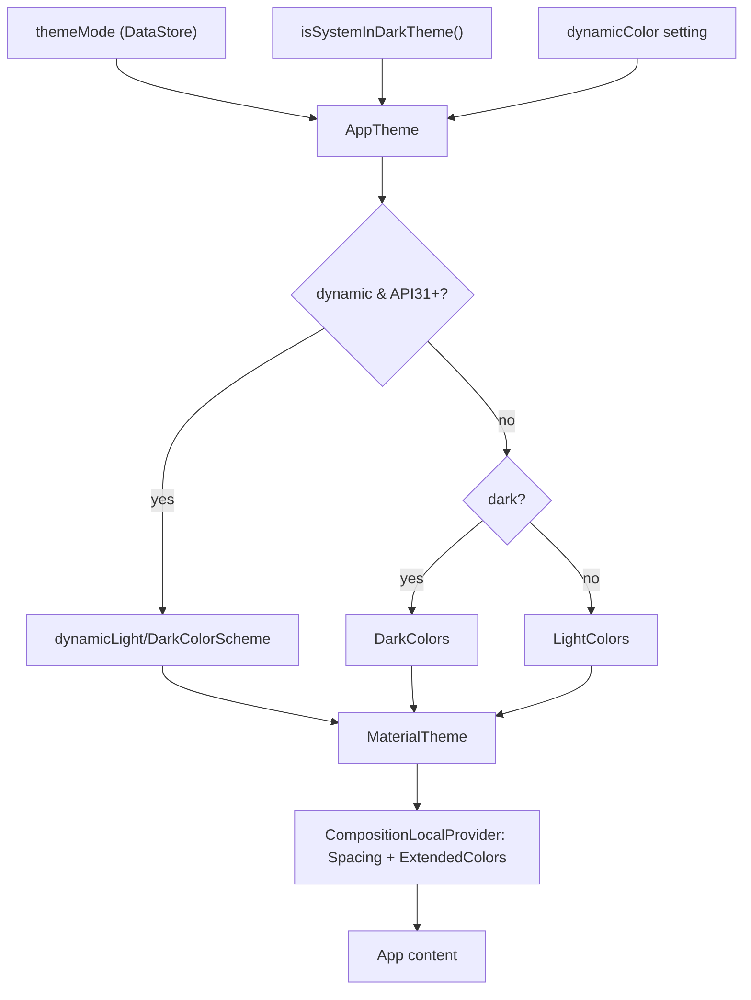
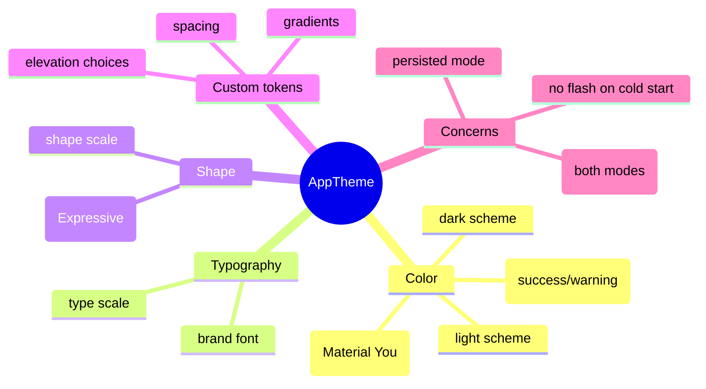

# Lesson 06 — Light/Dark & Custom Themes

> After this lesson you can ship a complete theme (light, dark, dynamic), test both modes deterministically, **extend** Material 3 with your own design tokens via CompositionLocal, and apply Material 3 **Expressive** ideas — all from a single `AppTheme`.

**Module:** 09 · **Lesson:** 06 · **Level:** 🟢🟡🔴 · **Est. time:** 90–110 min

---

## 1. Concept

### 🟢 For beginners — *what is it and why do I care?*

This lesson ties the whole module together. You've seen color ([Lesson 02](02-color-roles-schemes.md)), dynamic color ([Lesson 03](03-dynamic-color-material-you.md)), type ([Lesson 04](04-typography-system.md)), and shape ([Lesson 05](05-shape-system.md)). Now you assemble them into one **`AppTheme`** that supports **light mode** and **dark mode** and lets the user choose.

The good news: if you've coded against **roles** the entire time, dark mode is almost done. You provide two schemes — a `lightColorScheme` and a `darkColorScheme` — and switch between them based on the system setting:

```kotlin
val colorScheme = if (darkTheme) DarkColors else LightColors
```

Because every component reads `MaterialTheme.colorScheme.surface` (a role) rather than `Color.White` (a literal), flipping the scheme flips the whole app. The work that remains is **getting the dark *values* right** and **testing** that both modes actually look good — dark mode is not "invert the colors," it's its own designed palette.

### 🟡 For intermediate devs — *the mechanism*

A finished `AppTheme` makes three decisions in one place:

1. **Mode** — light/dark/follow-system (usually a persisted user setting).
2. **Dynamic vs brand** — Material You on supported devices, brand fallback otherwise.
3. **Which scheme/typography/shapes** to hand `MaterialTheme`.

```kotlin
@Composable
fun AppTheme(
    darkTheme: Boolean = isSystemInDarkTheme(),
    dynamicColor: Boolean = true,
    content: @Composable () -> Unit,
) {
    val context = LocalContext.current
    val colorScheme = when {
        dynamicColor && Build.VERSION.SDK_INT >= Build.VERSION_CODES.S ->
            if (darkTheme) dynamicDarkColorScheme(context) else dynamicLightColorScheme(context)
        darkTheme -> DarkColors
        else      -> LightColors
    }
    MaterialTheme(colorScheme, shapes = AppShapes, typography = AppTypography, content = content)
}
```

**Generating correct schemes.** Don't hand-pick dark values. Use the **Material Theme Builder** (the official web tool, also a Figma plugin): enter a seed/brand color, and it outputs a tonally correct, contrast-checked `lightColorScheme()` *and* `darkColorScheme()` as ready-to-paste Kotlin. That's your `LightColors`/`DarkColors`.

**Extending the theme.** Material owns exactly three slots — color, type, shape. Anything else your design system needs (spacing tokens, a brand gradient, custom semantic colors like `success`/`warning`) you provide yourself with a **`CompositionLocal`** ([Module 07](../module-07-compositionlocal/README.md)), layered *inside* `AppTheme`:

```kotlin
data class Spacing(val xs: Dp = 4.dp, val sm: Dp = 8.dp, val md: Dp = 16.dp, val lg: Dp = 24.dp)
val LocalSpacing = staticCompositionLocalOf { Spacing() }

@Composable
fun AppTheme(/* … */ content: @Composable () -> Unit) {
    MaterialTheme(/* … */) {
        CompositionLocalProvider(LocalSpacing provides Spacing()) { content() }
    }
}

// Read it like the built-in theme:
val spacing = LocalSpacing.current
```

A common pattern is to expose these through an `object AppTheme { val spacing @Composable get() = LocalSpacing.current }` so call sites read `AppTheme.spacing.md` symmetrically with `MaterialTheme.colorScheme`.

### 🔴 For senior devs — *trade-offs, edges, internals*

- **Dark mode is a design artifact, not an inversion.** Naively inverting light values produces harsh pure-black-on-pure-white, blown-out brand colors, and broken elevation. M3's dark palette **desaturates and lightens accents**, uses **elevated surface tones** (the `surfaceContainer*` ramp) instead of shadows, and avoids pure `#000`/`#FFF`. Generate it; then *review it* — automated tools get tonal values right but not brand feel.
- **Semantic colors that aren't in M3 need a strategy.** `success`/`warning`/`info` aren't Material roles. Options: (a) map them onto `tertiary`/`error` families, (b) add them to a custom `CompositionLocal` color holder that *also* swaps light/dark, or (c) extend the scheme via an `extendedColors` data class. Whatever you choose, they must have **light and dark variants** and contrast-checked `on*` partners — exactly like the built-ins. The frequent bug: a hardcoded green "success" that's illegible in dark mode.
- **`staticCompositionLocalOf` vs `compositionLocalOf` for custom tokens.** Spacing/shape tokens that *never change at runtime* should be **static** (no per-read tracking, cheaper). Custom *colors* that swap with the theme should arguably be **dynamic** (so a theme switch invalidates readers) — or you provide a *new* `Spacing`/color holder instance on switch, which a static local also recomposes through because the provided value changes identity. Know why you picked each.
- **Theme switching and process death.** A user-chosen theme mode must be **persisted** (DataStore) and read **before first composition** to avoid a flash of the wrong theme on cold start. Reading it asynchronously and defaulting to light causes a visible flicker into dark. Hoist the setting high (often in the `Activity`/a top-level state holder), and consider a brief splash or a sensible synchronous default.
- **Don't duplicate the theme decision.** The anti-pattern that re-emerges at scale: feature modules each wrapping their own `MaterialTheme`, or reading the system dark flag independently. There must be **one** `AppTheme`; everything else just consumes it. Nested `MaterialTheme` is legitimate *only* for intentional local re-theming (a deliberately dark hero on a light screen).
- **Material 3 Expressive** (the 2025+ evolution) pushes **more dynamic color roles, shape morphing, and motion-as-emphasis**. Practically: newer M3 versions add color roles and expressive components; you adopt them by updating the Compose BOM and using the new role names/components rather than hand-rolling. Treat the theme as a living contract you bump with the BOM, not a frozen file.
- **Testing both modes is non-negotiable and should be automated.** Screenshot tests parameterized over `{light, dark} × {brand, dynamic-off}` catch contrast regressions and "this looks fine in light only" bugs that humans miss. This is the single highest-leverage test for a theme ([Module 14](../module-14-testing/README.md)).

### Analogy

A finished theme is a **building's lighting system with day and night modes**. Daytime and nighttime aren't the same scene with the brightness inverted — night uses warmer, dimmer, *purpose-chosen* lighting so the space stays usable and pleasant. One master control (the `AppTheme`) switches modes; every fixture (component) is wired to the *system*, not hardcoded to a single bulb. And when you add a new wing (custom tokens), you wire it into the same control — you don't give it its own private switchboard.

### Mental model

> **One `AppTheme` decides mode + dynamic and provides color/type/shape — plus your own tokens via CompositionLocal. Dark mode is a designed palette, not an inversion. Generate schemes, then test both modes.**

### Real-world example

**Now in Android** (Google's reference app) ships exactly this: a single `NiaTheme` that switches light/dark, supports dynamic color, and provides custom `LocalGradientColors`/`LocalBackgroundTheme` on top of M3 — all generated and screenshot-tested. Your `AppTheme` is the same shape: one wrapper, generated schemes, custom tokens layered in, both modes verified.

---

## 2. Visual Learning

**ASCII — the full theme assembly:**
```text
   ┌──────────────────────────── AppTheme (ONE place) ───────────────────────────┐
   │  inputs: themeMode (persisted) · dynamicColor · isSystemInDarkTheme()        │
   │                                                                              │
   │  ┌── decide colorScheme ─────────────────────────────────────────────────┐  │
   │  │ dynamic? & API31+ → dynamicLight/Dark   else dark? DarkColors:LightColors│ │
   │  └──────────────────────────────────────────────────────────────────────┘  │
   │                                                                              │
   │  MaterialTheme(colorScheme, AppTypography, AppShapes) {                      │
   │      CompositionLocalProvider(                                               │
   │          LocalSpacing provides Spacing(),                                    │
   │          LocalExtendedColors provides extended(dark)   ← custom tokens       │
   │      ) { content() }                                                         │
   │  }                                                                           │
   └──────────────────────────────────────────────────────────────────────────────┘
        readers:  MaterialTheme.colorScheme.*   AppTheme.spacing.*   AppTheme.colors.success
```

**Mermaid — mode + dynamic + custom tokens:**


**Mind map — what 'theme' covers:**


**Illustration prompt:**
```text
Illustration: a single master light-switch panel labeled "AppTheme" mounted on a wall, with a
day/night toggle and a "wallpaper colors" toggle. From it, neatly bundled wires fan out to a
furnished room rendered TWICE side by side — once in warm daylight (light mode), once in soft
designed night lighting (dark mode, NOT just dimmed). Extra labeled wires read "spacing",
"gradient", "success color" feeding the same room. Caption: "One switch, two designed modes,
your own tokens." Modern, vibrant, clearly labeled, soft studio gradients.
```

---

## 3. Code

> This lesson assembles Lessons 01–05. Schemes come from the Material Theme Builder; we focus on the *complete wrapper*, *extension*, and *testing*.

### 🟢 Beginner — light + dark from one switch

```kotlin
// Generated by Material Theme Builder (paste output), shown abbreviated.
val LightColors = lightColorScheme(primary = Color(0xFF6750A4), /* …roles… */)
val DarkColors  = darkColorScheme(primary = Color(0xFFD0BCFF),  /* …lighter accents… */)

@Composable
fun AppTheme(
    darkTheme: Boolean = isSystemInDarkTheme(),
    content: @Composable () -> Unit,
) {
    MaterialTheme(
        colorScheme = if (darkTheme) DarkColors else LightColors,
        typography  = AppTypography,
        shapes      = AppShapes,
        content     = content,
    )
}
```

**Explanation.** Two generated schemes, one `if`. Because the app reads roles everywhere, this single switch reskins the entire UI for dark mode. Note `DarkColors`' `primary` is **lighter** than light mode's — correct for dark surfaces.

**Common mistakes.**
```kotlin
// ❌ "Dark mode" by inverting the light scheme — harsh, blown-out, broken contrast.
val DarkColors = LightColors.copy(
    background = Color.Black, surface = Color.Black, onBackground = Color.White,
)
```
Inversion gives pure-black surfaces, over-saturated accents, and dead elevation. Generate a real dark scheme instead.

**Best practices.**
- Generate both schemes from a tool; never invert light to fake dark.
- Default `darkTheme` to `isSystemInDarkTheme()` but keep it a parameter for overrides/previews.

---

### 🟡 Intermediate — persisted user mode + dynamic, no flash

```kotlin
enum class ThemeMode { SYSTEM, LIGHT, DARK }

@Composable
fun AppTheme(
    themeMode: ThemeMode,            // hoisted from a settings state holder (DataStore-backed)
    dynamicColor: Boolean,
    content: @Composable () -> Unit,
) {
    val darkTheme = when (themeMode) {
        ThemeMode.SYSTEM -> isSystemInDarkTheme()
        ThemeMode.LIGHT  -> false
        ThemeMode.DARK   -> true
    }
    val context = LocalContext.current
    val colorScheme = when {
        dynamicColor && Build.VERSION.SDK_INT >= Build.VERSION_CODES.S ->
            if (darkTheme) dynamicDarkColorScheme(context) else dynamicLightColorScheme(context)
        darkTheme -> DarkColors
        else      -> LightColors
    }
    MaterialTheme(colorScheme, typography = AppTypography, shapes = AppShapes, content = content)
}

// At the top of the app, read the setting BEFORE composing content to avoid a wrong-theme flash.
setContent {
    val settings by themeSettingsStore.settings.collectAsStateWithLifecycle(initialValue = null)
    if (settings != null) {
        AppTheme(settings!!.mode, settings!!.dynamicColor) { AppNavHost() }
    } // else: keep the splash; don't render content in a guessed theme
}
```

**Explanation.** Theme mode is an explicit tri-state persisted in DataStore and **hoisted** to the entry point. Rendering waits until the setting is known (`settings != null`), so the app never flashes light before snapping to dark on cold start. Dynamic color is folded into the same single decision.

**Common mistakes.**
```kotlin
// ❌ Rendering content immediately with a default while the real setting loads async → flash.
val mode = remember { mutableStateOf(ThemeMode.LIGHT) }   // shows light, then jumps to dark
LaunchedEffect(Unit) { mode.value = store.read() }        // too late — first frame was wrong
```
Defaulting and patching later produces a visible flicker. Gate first content on the loaded setting (or hold a splash).

**Best practices.**
- Persist mode + dynamic toggle (DataStore); **hoist** them to the entry point.
- Avoid the cold-start flash: hold the splash until the setting resolves, or use a synchronous default that matches the most common case.

---

### 🔴 Production — extend the theme with custom tokens + screenshot tests

```kotlin
// 1) Custom semantic colors NOT in M3, with light/dark variants & on* partners.
@Immutable
data class ExtendedColors(
    val success: Color, val onSuccess: Color,
    val warning: Color, val onWarning: Color,
)
private val LightExtended = ExtendedColors(
    success = Color(0xFF2E7D32), onSuccess = Color(0xFFFFFFFF),
    warning = Color(0xFF8A6D00), onWarning = Color(0xFFFFFFFF),
)
private val DarkExtended = ExtendedColors(
    success = Color(0xFF7DDB8A), onSuccess = Color(0xFF00390C),   // lighter for dark surfaces
    warning = Color(0xFFE6C200), onWarning = Color(0xFF3A2E00),
)
val LocalExtendedColors = staticCompositionLocalOf { LightExtended }

// 2) Spacing tokens (never change at runtime → static).
@Immutable data class Spacing(val sm: Dp = 8.dp, val md: Dp = 16.dp, val lg: Dp = 24.dp)
val LocalSpacing = staticCompositionLocalOf { Spacing() }

// 3) One wrapper provides M3 + the custom tokens; symmetric read surface.
@Composable
fun AppTheme(
    themeMode: ThemeMode = ThemeMode.SYSTEM,
    dynamicColor: Boolean = true,
    content: @Composable () -> Unit,
) {
    val darkTheme = when (themeMode) {
        ThemeMode.SYSTEM -> isSystemInDarkTheme(); ThemeMode.LIGHT -> false; ThemeMode.DARK -> true
    }
    val context = LocalContext.current
    val colorScheme = when {
        dynamicColor && Build.VERSION.SDK_INT >= Build.VERSION_CODES.S ->
            if (darkTheme) dynamicDarkColorScheme(context) else dynamicLightColorScheme(context)
        darkTheme -> DarkColors
        else      -> LightColors
    }
    CompositionLocalProvider(
        LocalExtendedColors provides if (darkTheme) DarkExtended else LightExtended,
        LocalSpacing provides Spacing(),
    ) {
        MaterialTheme(colorScheme, typography = AppTypography, shapes = AppShapes, content = content)
    }
}

// 4) Symmetric accessors: read like the built-ins.
object AppTheme {
    val colors: ExtendedColors @Composable @ReadOnlyComposable get() = LocalExtendedColors.current
    val spacing: Spacing @Composable @ReadOnlyComposable get() = LocalSpacing.current
}

// 5) Usage:
@Composable
fun SyncBadge() = Surface(
    color = AppTheme.colors.success, contentColor = AppTheme.colors.onSuccess,
    shape = MaterialTheme.shapes.small,
) { Text("Synced", Modifier.padding(AppTheme.spacing.sm)) }
```

```kotlin
// 6) Screenshot test BOTH modes — the highest-leverage theme test (Module 14).
@RunWith(ParameterizedRobolectricTestRunner::class)
class ThemeScreenshotTest(private val dark: Boolean) {
    companion object {
        @JvmStatic @ParameterizedRobolectricTestRunner.Parameters
        fun modes() = listOf(false, true)
    }

    @get:Rule val paparazzi = Paparazzi()

    @Test fun gallery() = paparazzi.snapshot {
        AppTheme(themeMode = if (dark) ThemeMode.DARK else ThemeMode.LIGHT, dynamicColor = false) {
            ComponentGallery()
        }
    }
}
```

**Explanation.** Material owns color/type/shape; the custom `ExtendedColors` (with real light/dark variants and `on*` partners) and `Spacing` are provided alongside it via `CompositionLocalProvider`. The `AppTheme` object gives a **symmetric read API** (`AppTheme.colors.success`, `AppTheme.spacing.sm`) so custom tokens feel native next to `MaterialTheme.colorScheme`. The parameterized screenshot test renders a `ComponentGallery` in **both** modes, turning "looks fine in light" regressions into CI failures. `dynamicColor = false` keeps screenshots deterministic (no wallpaper).

**Common mistakes.**
```kotlin
// ❌ Custom semantic color with no dark variant → illegible in dark mode.
val success = Color(0xFF2E7D32)   // dark green on a dark surface = unreadable
Text("Synced", color = success)

// ❌ Two themes: a feature module wrapping its own MaterialTheme with its own dark check.
@Composable fun FeatureScreen() = MaterialTheme(if (isSystemInDarkTheme()) DarkColors else LightColors) { /*…*/ }
```
A single-variant custom color breaks in dark mode; a second `MaterialTheme` duplicates the decision and drifts. Provide light/dark variants and keep **one** `AppTheme`.

**Best practices.**
- Extend M3 with `CompositionLocal` tokens that have **light/dark variants** and contrast-checked `on*` partners.
- Use **`staticCompositionLocalOf`** for tokens that don't change at runtime; provide a *new* instance on theme switch so readers recompose.
- Expose a **symmetric `AppTheme` object** so custom tokens read like built-ins.
- **Screenshot-test both modes** (and brand vs dynamic-off) in CI — it's the cheapest insurance for a theme.
- Keep exactly **one** `AppTheme`; reserve nested `MaterialTheme` for deliberate local re-theming.

---

## 4. Interview Questions

**🟢 Beginner**

1. *How do you support dark mode in a Compose app?*
   > Provide a `darkColorScheme` alongside `lightColorScheme`, pick one based on `isSystemInDarkTheme()` (or a user setting), and pass it to `MaterialTheme`. Because components read color *roles*, switching the scheme reskins the app.
2. *Why isn't dark mode just inverting the light colors?*
   > Dark mode is a designed palette: accents are desaturated/lightened, surfaces use tonal elevation instead of shadows, and it avoids pure black/white. Inversion produces harsh, low-quality, often low-contrast results.

**🟡 Intermediate**

3. *How do you let users choose light/dark/system, without a flash on cold start?*
   > Persist a tri-state `ThemeMode` (DataStore), hoist it to the entry point, and **wait** to render content until the setting loads (hold the splash) so you don't show a default then snap to the real theme.
4. *Material 3 only themes color/type/shape. How do you add custom tokens like spacing or a `success` color?*
   > Provide your own `CompositionLocal`s (e.g. `LocalSpacing`, `LocalExtendedColors`) inside `AppTheme` and expose symmetric accessors (`AppTheme.spacing`, `AppTheme.colors.success`). Custom colors must have light/dark variants and `on*` partners.
5. *Where do you generate correct light/dark schemes?*
   > The Material Theme Builder (web tool / Figma plugin): seed a brand color and it emits contrast-checked `lightColorScheme()`/`darkColorScheme()` Kotlin to paste in.

**🔴 Senior**

6. *`staticCompositionLocalOf` vs `compositionLocalOf` for custom theme tokens — how do you choose?*
   > Use `static` for tokens that don't change at runtime (spacing, shape) — no per-read tracking, cheaper, but changing the value recomposes the whole subtree. Use dynamic (or provide a new instance) for values that swap with the theme (custom colors) so only readers recompose. Match the local's nature to how often the value changes.
7. *How do you guarantee a theme works in both modes as it evolves?*
   > Parameterized **screenshot tests** over `{light, dark} × {brand, dynamic-off}` rendering a component gallery, run in CI. They catch contrast regressions and "looks fine in light only" bugs that manual testing misses — the highest-leverage theme test.
8. *What is Material 3 Expressive and how do you adopt it?*
   > The 2025+ evolution emphasizing more dynamic color roles, **shape morphing**, and motion-as-emphasis. You adopt it by bumping the Compose BOM and using the new roles/components and morphing shapes — treating the theme as a versioned contract, not a frozen file.
9. *A feature team wraps its screen in its own `MaterialTheme`. Why is that usually wrong, and when is nesting valid?*
   > It duplicates the light/dark/dynamic decision and drifts from the app theme. There should be one `AppTheme`. Nested `MaterialTheme` is valid only for **intentional** local re-theming (e.g. a deliberately dark hero section on a light screen), not as a per-feature default.

---

## 5. AI Assistant

**Prompt example (assemble the full theme):**
```text
Assemble a complete Material 3 AppTheme for Compose (Kotlin 2.x, 2026 BOM):
- light + dark schemes (I'll paste Material Theme Builder output as LightColors/DarkColors)
- dynamic color on API 31+ with brand fallback; tri-state ThemeMode (SYSTEM/LIGHT/DARK)
- extend with LocalSpacing and LocalExtendedColors(success/warning) that have light AND dark
  variants + on* partners; expose a symmetric AppTheme object (AppTheme.colors / AppTheme.spacing)
- show how to gate first content on a DataStore setting to avoid a cold-start theme flash
Also generate a parameterized screenshot test rendering a gallery in light AND dark (dynamicColor=false).
Keep ONE AppTheme; no per-screen MaterialTheme.
```

**AI workflow.**
- ✅ Good for: assembling the wrapper, wiring custom `CompositionLocal` tokens + accessors, scaffolding screenshot tests, and converting a legacy `themes.xml`/`-night` resource set into light/dark schemes.
- ⚠️ Watch: models **invert** light to fake dark, give custom colors **no dark variant**, drop the cold-start gate (flash), use `compositionLocalOf` where static is right, and sometimes nest a second `MaterialTheme`.

**Review workflow — map to *Common Mistakes*:**
- Are `LightColors`/`DarkColors` **generated** (not inverted), with lighter dark accents?
- Do custom semantic colors have **light AND dark** variants and `on*` partners?
- Is there a **single** `AppTheme`, no stray nested `MaterialTheme` per feature?
- Is first content **gated** on the loaded theme setting (no flash)?
- Are screenshot tests covering **both modes** (and `dynamicColor = false` for determinism)?

**Validation workflow:**
1. **Run** and toggle system + in-app theme through all combinations (light/dark/system × dynamic on/off); confirm no illegible surfaces and no cold-start flash.
2. Run the **parameterized screenshot tests**; review the light *and* dark goldens for the gallery.
3. Verify custom tokens: `AppTheme.colors.success` is legible in **dark** mode specifically.
4. Grep for extra `MaterialTheme(` and for hardcoded `Color(0x…)`/single-variant semantic colors; there should be none in feature code.

> **AI drafts, you decide.** The two failure modes that ship silently are *inverted* dark palettes and *single-variant* custom colors — verify both, and let the dual-mode screenshot test be the gate.

---

## Recap / Key takeaways

- One **`AppTheme`** decides mode (light/dark/system) + dynamic, then provides color/type/shape — the rest of the app just consumes roles.
- **Dark mode is a designed palette, not an inversion**: generate `light/darkColorScheme` (Material Theme Builder), then review for brand feel.
- **Extend** M3's three slots with your own `CompositionLocal` tokens (spacing, `success`/`warning`) — each needing light/dark variants and `on*` partners; expose a symmetric `AppTheme` accessor.
- **Persist** the theme mode and **gate first content** on it to avoid a cold-start flash; keep exactly one `AppTheme`.
- **Screenshot-test both modes** (and dynamic-off) in CI — the highest-leverage guarantee a theme stays correct as it evolves toward Material 3 **Expressive**.

You've now built a complete, themable design system: color roles, dynamic color, type, shape, and a tested light/dark/custom theme — the foundation every screen in the rest of the course builds on.

➡️ Next module: **[Module 10 — Animations Masterclass](../module-10-animations/README.md)** — bring the themed UI to life with the right animation API for each job, including the shape-morphing and color transitions this module set up.
