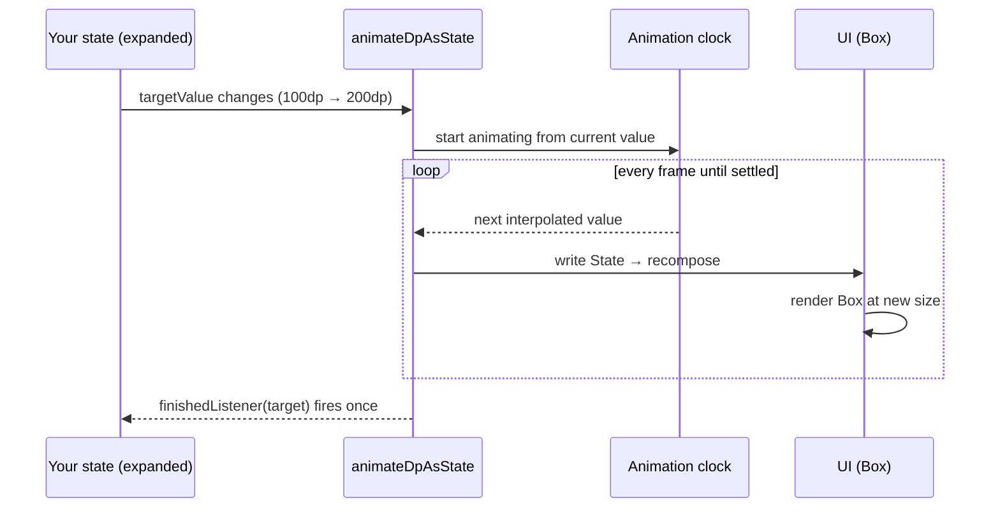

# Lesson 01 — `animate*AsState`

> After this lesson you can take any value that changes in your UI — a color, a size, an offset — and make it glide to its new value with a single line, and explain exactly what Compose is doing behind that line.

**Module:** 10 · **Lesson:** 01 · **Level:** 🟢🟡🔴 · **Est. time:** 60–75 min

---

## 1. Concept

### 🟢 For beginners — *what is it and why do I care?*

When state changes, Compose normally **snaps** to the new value. A box that's 100.dp becomes 200.dp *instantly* on the next frame. That's correct, but it can feel abrupt — things in the real world don't teleport, they *move*.

`animate*AsState` is the simplest way to fix that. You give it a **target value**, and instead of jumping, it returns a value that **walks from the old number to the new one over time**. You read that returned value like normal state, and the UI smoothly follows.

```kotlin
val size by animateDpAsState(targetValue = if (expanded) 200.dp else 100.dp)
Box(Modifier.size(size))   // size glides between 100 and 200
```

The mental shift: you **don't describe the animation frame by frame**. You just change the target (`expanded = true`), and Compose figures out every in-between value for you. It's *fire-and-forget* — set the destination, walk away, the animation runs itself.

There's a whole family, one per type:
- `animateDpAsState` — sizes, offsets, padding.
- `animateColorAsState` — colors (from `androidx.compose.animation`).
- `animateFloatAsState` — alpha, rotation, scale, progress.
- `animateIntAsState`, `animateOffsetAsState`, `animateDpAsState`, and more.

### 🟡 For intermediate devs — *the mechanism*

`animate*AsState` is a thin, declarative wrapper around a lower-level engine (`Animatable`, covered in [Lesson 04](04-animatable-and-gestures.md)). Here's the loop it sets up for you:

1. You pass a `targetValue`. Internally it's remembered.
2. When `targetValue` **changes** between recompositions, a `LaunchedEffect`-style coroutine starts animating from the *current* value toward the new target.
3. Each frame, the coroutine reads the next value from the **animation clock** and writes it into a backing `State<T>`.
4. Because you read that `State<T>` via `by`, your composable recomposes every frame — that's how the UI follows the value.

```text
targetValue changes ──▶ animation coroutine runs ──▶ writes State each frame ──▶ you recompose
```

The second parameter is the **`animationSpec`** — the *personality* of the motion. The default is a `spring()` (physics-based, no fixed duration). You can swap in `tween(durationMillis = 300, easing = FastOutSlowInEasing)` for a timed curve, or `snap()` to disable animation conditionally.

```kotlin
val alpha by animateFloatAsState(
    targetValue = if (visible) 1f else 0f,
    animationSpec = tween(durationMillis = 250),
    label = "alpha",
)
```

The optional `label` is for the Animation Inspector in Android Studio — name your animations and you can scrub them in the tooling.

There's also a `finishedListener: (T) -> Unit` callback that fires once when the animation **settles** on its target — handy for chaining work after motion completes.

### 🔴 For senior devs — *trade-offs, edges, internals*

`animate*AsState` is **the** right tool when the value is **fully derived from state** and you don't need to control the animation imperatively. Where it breaks down — and what to watch:

- **It's interruptible *toward a new target*, not pausable.** If `targetValue` changes mid-flight, the spring/tween retargets smoothly from wherever it currently is (springs especially carry **velocity** into the new animation — that's why they feel alive). But you can't pause, reverse on demand, or drive it from a gesture. The moment you need a finger dragging the value, you've outgrown `animate*AsState` and want `Animatable` ([Lesson 04](04-animatable-and-gestures.md)).

- **Every frame is a recomposition** by default, *at the scope that reads the animated value*. If you read `size` directly in a big composable, the **whole** composable recomposes ~60–120×/sec during the animation. The senior move is to **defer the read into a later phase**: pass a lambda to a `Modifier` (e.g. `graphicsLayer { alpha = animatedAlpha }`, `offset { … }`) so the animated value is read in **layout/draw**, not composition. The animation then runs without recomposing your tree at all — covered deeply in [Module 11](../module-11-performance/README.md).

- **`spring` vs `tween` is a correctness-of-feel decision, not just taste.** A `tween` has a fixed duration, so a retarget *restarts the clock* and can look like it stutters/slows. A `spring` is duration-less and **velocity-preserving**, so rapidly changing targets (e.g. a value that tracks a fast-updating input) stay fluid. For anything that can be interrupted, prefer `spring`. Reserve `tween` for one-shot, uninterrupted transitions where you want a precise timing/easing.

- **Equality gates the animation.** If `targetValue` is `==` to the current target, nothing re-animates. For custom types make sure `equals` is meaningful, or you'll get missed or spurious animations.

- **`animateColorAsState` interpolates in a color space.** It doesn't naïvely lerp ARGB channels; it animates through Oklab/the specified `ColorSpace`, which avoids muddy grey midpoints. Don't roll your own ARGB lerp and expect the same result.

### Analogy

A **self-driving car with a destination, not a route.** With a plain state write you *teleport* to the address. With `animate*AsState` you punch the destination into the GPS (the `targetValue`) and the car drives there itself, choosing every intermediate position. Change the destination mid-trip and a good car (a **spring**) doesn't stop dead and start over — it curves smoothly toward the new address, carrying its momentum. A rigid one (a **tween**) re-plans from scratch on a fresh timer.

### Mental model

> **Set the destination, not the path.** `animate*AsState` turns "the value *is* X" into "the value is *heading to* X," and gives you each in-between frame for free.

### Real-world example

A **theme toggle**. Tapping dark mode shouldn't snap the whole screen from white to black — it should cross-fade. `animateColorAsState` on the background and content colors makes the switch feel deliberate. Or a **"like" heart** that scales up with `animateFloatAsState` on a tap, or an **expandable card** whose height glides with `animateDpAsState`.

---

## 2. Visual Learning

**ASCII — snap vs. animate:**
```text
  Plain state write:    100dp ┃                          ┏━━ 200dp   (instant jump on next frame)
                              ┃__________________________┛

  animateDpAsState:     100dp ┃        ____......----━━━━ 200dp   (interpolated every frame)
                              ┃_..--``
                              └─────────── time ───────────▶
```

**Mermaid — the fire-and-forget loop:**


**Illustration prompt (paste into an image generator):**
```text
Illustration: a car-GPS metaphor for animation. On the left, a glowing dashboard with a single
input field labeled "targetValue = 200dp". A sleek car drives along a smooth curved road whose
intermediate mile-markers are labeled 120, 145, 170, 190 — the in-between frames. The destination
pin is labeled "200dp". A small inset shows a rigid alternative car that teleports (dashed,
faded) labeled "plain state = snap". Modern, vibrant, soft gradients, clear labels, tech-illustration style.
```

---

## 3. Code

### 🟢 Beginner — one animated value

```kotlin
@Composable
fun ExpandingBox() {
    var expanded by remember { mutableStateOf(false) }

    // The returned `size` glides between the two targets — we never compute frames ourselves.
    val size by animateDpAsState(
        targetValue = if (expanded) 200.dp else 100.dp,
        label = "boxSize",
    )

    Box(
        Modifier
            .size(size)                         // reads the animated value
            .background(MaterialTheme.colorScheme.primary)
            .clickable { expanded = !expanded } // just flip state; the animation is automatic
    )
}
```

**Explanation.** We only ever change `expanded`. `animateDpAsState` notices its `targetValue` changed and animates `size` from the current value to the new one, frame by frame. The `Box` reads `size`, so it recomposes each frame and grows smoothly.

**Common mistakes.**
```kotlin
// ❌ Animating, then ignoring the result. `size` is the animated value — USE it, not the raw target.
val size by animateDpAsState(if (expanded) 200.dp else 100.dp)
Box(Modifier.size(if (expanded) 200.dp else 100.dp))  // snaps! you bypassed the animation
```
The number you must place into the modifier is the **returned** `size`, not the conditional you fed in. Feeding the raw `if` back into `.size(...)` re-introduces the snap and makes the animation invisible.

**Best practices.**
- Change *state*; let the animated value follow. Never hand-roll the in-betweens.
- Always read the **returned** value, not the target expression.
- Add a `label` so the animation shows up by name in the Animation Inspector.

---

### 🟡 Intermediate — multiple coordinated values + a spec

```kotlin
@Composable
fun ExpandableCard(title: String, body: String) {
    var expanded by remember { mutableStateOf(false) }

    val rotation by animateFloatAsState(
        targetValue = if (expanded) 180f else 0f,
        animationSpec = tween(durationMillis = 250, easing = FastOutSlowInEasing),
        label = "chevronRotation",
    )
    val elevation by animateDpAsState(
        targetValue = if (expanded) 8.dp else 1.dp,
        label = "cardElevation",
    )

    Card(
        onClick = { expanded = !expanded },
        elevation = CardDefaults.cardElevation(defaultElevation = elevation),
    ) {
        Row(verticalAlignment = Alignment.CenterVertically) {
            Text(title, Modifier.weight(1f).padding(16.dp), style = MaterialTheme.typography.titleMedium)
            Icon(
                Icons.Default.ExpandMore,
                contentDescription = if (expanded) "Collapse" else "Expand",
                modifier = Modifier.rotate(rotation),   // chevron spins as it opens
            )
        }
        if (expanded) {
            Text(body, Modifier.padding(horizontal = 16.dp).padding(bottom = 16.dp))
        }
    }
}
```

**Explanation.** Two `animate*AsState` calls run **independently and concurrently** — the chevron rotates on a timed `tween`, the elevation lifts on the default `spring`. Each is driven by the same `expanded` flag but has its own personality. This is the bread-and-butter pattern for component micro-interactions.

**Common mistakes.**
- **Using `tween` for something that gets interrupted rapidly.** If `expanded` can be toggled fast, the `tween` restarts its clock each time and looks janky; a `spring` would carry momentum. Match the spec to whether the value can change mid-flight.
- **Forgetting the chevron's `contentDescription` changes too.** Accessibility should reflect the new state, not a static label.

**Best practices.**
- One `animate*AsState` per independently-animating value; let them overlap.
- Choose `tween` for deliberate, one-shot timing; `spring` for anything interruptible.
- Keep the *content* swap (`if (expanded) { … }`) separate from the *value* animations — for animating the content itself, reach for [`AnimatedVisibility`](02-animatedvisibility.md) (Lesson 02).

---

### 🔴 Production — performance-aware: defer the read into draw

```kotlin
@Composable
fun PressableTile(
    label: String,
    onClick: () -> Unit,
    modifier: Modifier = Modifier,
) {
    val interactionSource = remember { MutableInteractionSource() }
    val pressed by interactionSource.collectIsPressedAsState()

    // Animate scale + alpha as a press feedback.
    val scale by animateFloatAsState(
        targetValue = if (pressed) 0.96f else 1f,
        animationSpec = spring(stiffness = Spring.StiffnessMediumLow),
        label = "pressScale",
    )

    Surface(
        onClick = onClick,
        interactionSource = interactionSource,
        modifier = modifier
            // ✅ Read the animated value INSIDE graphicsLayer → it's applied in the draw phase.
            // The animation runs without recomposing this composable every frame.
            .graphicsLayer {
                scaleX = scale
                scaleY = scale
            },
        shape = MaterialTheme.shapes.medium,
        tonalElevation = 2.dp,
    ) {
        Box(Modifier.padding(24.dp), contentAlignment = Alignment.Center) {
            Text(label, style = MaterialTheme.typography.titleMedium)
        }
    }
}
```

**Explanation.** Press feedback should feel instant and cost nothing. We drive `scale` from the `InteractionSource` (so it tracks real press/release), then read it inside **`graphicsLayer { }`**. That lambda runs in the **draw phase**, so the per-frame value change does **not** invalidate composition — only the cheap draw layer updates. This is the production default for any high-frequency animation: keep the animated read out of composition.

**Common mistakes.**
```kotlin
// ❌ Reading the animated value in composition → recomposes the whole Surface ~60×/sec.
Surface(modifier = Modifier.scale(scale)) { … }   // Modifier.scale reads `scale` in composition
```
`Modifier.scale(scale)` looks identical but reads `scale` *eagerly in composition*, so every animation frame recomposes the composable. For a tile in a list, multiply that by every visible tile. Prefer the `graphicsLayer { }` lambda form, which reads in draw.

```kotlin
// ❌ Animating layout size on every press for "feedback" → triggers relayout each frame (expensive).
val size by animateDpAsState(if (pressed) 92.dp else 96.dp)
Box(Modifier.size(size))   // size changes re-run layout for the whole subtree
```
Scale via `graphicsLayer` is a draw-only transform; animating `size` forces **layout** every frame. For pure visual feedback, transform in draw, don't resize.

**Best practices.**
- For frequent/continuous animations, **defer the read** with a lambda modifier (`graphicsLayer { }`, `offset { }`, `drawBehind { }`) so it lands in layout/draw, not composition.
- Drive feedback from `InteractionSource` so the animation matches the real gesture lifecycle.
- Prefer draw-phase transforms (`scaleX/Y`, `alpha`, `translationX/Y`, `rotationZ`) over layout-affecting properties (`size`, `padding`) when you only need a *visual* change.

---

## 4. Interview Questions

**🟢 Beginner**

1. *What does `animate*AsState` do?*
   > It returns a `State<T>` that animates smoothly from its current value to a new `targetValue` whenever that target changes, computing every in-between frame for you. You change state; the value glides instead of snapping.
2. *Name three members of the `animate*AsState` family.*
   > `animateDpAsState` (sizes/offsets), `animateColorAsState` (colors), `animateFloatAsState` (alpha/rotation/scale). Also `animateIntAsState`, `animateOffsetAsState`, etc.

**🟡 Intermediate**

3. *What is the `animationSpec` parameter, and what's the default?*
   > It defines the motion's personality — physics or timing. The default is `spring()` (duration-less, velocity-aware). You can pass `tween(durationMillis, easing)` for a timed curve, or `snap()` to skip animation.
4. *Your target changes mid-animation. What happens with a `spring` vs a `tween`?*
   > A `spring` retargets smoothly from the current value **and velocity**, so it stays fluid. A `tween` restarts its fixed-duration clock from the current value, which can look like it stutters or slows. Prefer `spring` for interruptible values.

**🔴 Senior**

5. *`animate*AsState` recomposes every frame at the read site. How do you animate without recomposing your tree?*
   > Defer the state read into a later phase: read the animated value inside a lambda modifier such as `graphicsLayer { alpha = … }` or `offset { … }`, which runs in layout/draw. Composition isn't invalidated; only the draw layer updates each frame — critical for list items and continuous animations.
6. *When would you reach past `animate*AsState` to `Animatable`?*
   > When you need imperative control the declarative wrapper can't give: driving the value from a gesture (drag), pausing/stopping, snapping to a value then animating, reading/seeding velocity, or coordinating with `suspend` logic. `animate*AsState` is for values fully derived from state; `Animatable` is for values you control over time.
7. *Why doesn't `animateColorAsState` just lerp ARGB channels?*
   > Naïve ARGB interpolation passes through muddy/grey midpoints. `animateColorAsState` interpolates in a perceptual color space (e.g. Oklab) within the specified `ColorSpace`, producing natural transitions. Hand-rolling ARGB lerp won't match.

---

## 5. AI Assistant

**Prompt example (generating a micro-interaction):**
```text
Write a Compose (2026 BOM, Kotlin 2.x, Material 3) expandable card. Use animate*AsState for
a chevron rotation (tween 250ms, FastOutSlowInEasing) and card elevation (default spring).
Toggle on click. The animated value must be READ into the modifier (not the raw target).
Add an accessibility contentDescription that reflects expanded/collapsed. No ViewModel.
```

**AI workflow — where it helps on *this* topic.**
- ✅ Great for: scaffolding micro-interactions, picking starter `tween` durations/easings, converting a "snap" UI into an animated one, generating a family of `animate*AsState` calls for several properties.
- ⚠️ Not yet: deciding *spring vs tween* for interruptible motion, and choosing whether to **defer the read** for performance. Models default to `Modifier.scale(value)` / `Modifier.size(value)` read in composition — fine for a demo, wrong for a hot path.

**Review workflow — check AI output against this lesson's *Common Mistakes*:**
- Does the modifier read the **returned** animated value, not the raw `if` target?
- For frequent/continuous animation, is the read **deferred** into `graphicsLayer { }`/`offset { }` rather than `Modifier.scale`/`Modifier.size`?
- Is the spec appropriate — `spring` for interruptible, `tween` for one-shot?
- Does any `contentDescription` update with state?

**Validation workflow — prove it actually works:**
1. **Compile & run**; trigger the state change and confirm the value glides (not snaps).
2. Open **Android Studio → Animation Inspector**, find your `label`, and scrub the timeline to inspect the curve.
3. Enable **Layout Inspector → recomposition counts**: if the animated composable's count climbs every frame, move the read into `graphicsLayer { }` and confirm the count stops climbing.
4. Rapidly toggle the trigger; verify a `spring` stays smooth where a `tween` restarts — pick accordingly.

> **AI drafts, you decide.** If the model reads the animated value in composition on a list item, that's a perf bug it won't feel in a preview — you move it to draw.

---

## Recap / Key takeaways

- `animate*AsState` is **fire-and-forget**: set a `targetValue`, read the returned `State`, and the value glides through every in-between frame.
- One function per type — `animateDpAsState`, `animateColorAsState`, `animateFloatAsState`, … — each takes an `animationSpec` (`spring` default, or `tween`/`snap`).
- **`spring`** is duration-less and velocity-aware (best for interruptible values); **`tween`** is timed (best for one-shot, precise transitions).
- It recomposes at the read site every frame — **defer the read** into `graphicsLayer { }`/`offset { }` to animate without recomposing your tree.
- Reach for [`Animatable`](04-animatable-and-gestures.md) when you need imperative or gesture-driven control.

➡️ Next: **[Lesson 02 — `AnimatedVisibility`](02-animatedvisibility.md)** — animating things as they enter and leave the screen, with composable enter/exit transitions.
