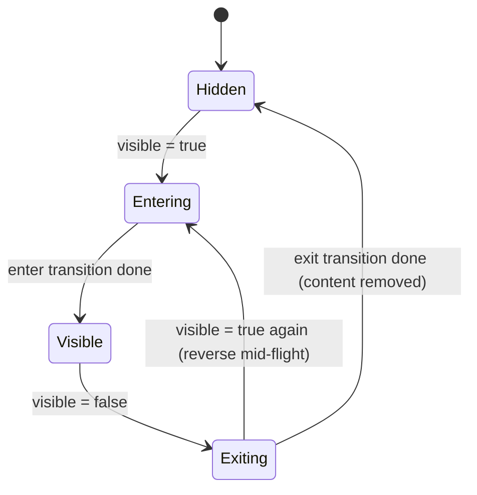
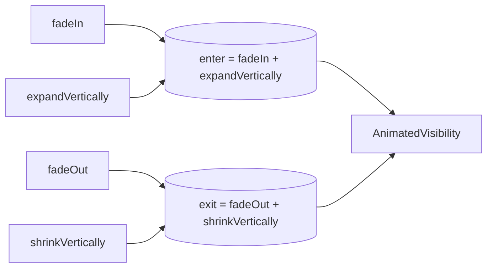

# Lesson 02 — `AnimatedVisibility`

> After this lesson you can make composables animate *in* when they appear and *out* before they leave — instead of popping in and vanishing — and compose your own enter/exit transitions.

**Module:** 10 · **Lesson:** 02 · **Level:** 🟢🟡🔴 · **Est. time:** 60–80 min

---

## 1. Concept

### 🟢 For beginners — *what is it and why do I care?*

In plain Compose, showing or hiding something is an `if`:

```kotlin
if (visible) { Banner() }   // appears and disappears INSTANTLY
```

When `visible` flips, the `Banner` simply pops into existence or blinks out. No grace, no motion.

`AnimatedVisibility` is the drop-in upgrade. You wrap the content, hand it the same boolean, and it **animates the appearance and the disappearance**:

```kotlin
AnimatedVisibility(visible = visible) {
    Banner()   // fades + expands in; fades + shrinks out
}
```

The crucial, easy-to-miss detail: when `visible` becomes `false`, the content **doesn't leave immediately**. `AnimatedVisibility` keeps it on screen and runs the **exit** animation first, *then* removes it. That "stay alive long enough to animate out" behavior is the whole reason a plain `if` can't do this — an `if` removes the content the instant the condition is false, so there's nothing left to animate.

### 🟡 For intermediate devs — *the mechanism*

`AnimatedVisibility` takes two transition descriptions:

- `enter: EnterTransition` — how content appears.
- `exit: ExitTransition` — how content leaves.

These are **composable values you combine with `+`**:

```kotlin
AnimatedVisibility(
    visible = visible,
    enter = fadeIn() + expandVertically(),
    exit  = fadeOut() + shrinkVertically(),
) { Banner() }
```

Building blocks:
- **Fade:** `fadeIn()` / `fadeOut()` (alpha).
- **Slide:** `slideInHorizontally()` / `slideOutVertically()` / `slideIn()` / `slideOut()` (translation).
- **Expand/shrink:** `expandIn()` / `shrinkOut()` / `expandVertically()` / `shrinkHorizontally()` (animates the *size*, pushing siblings).
- **Scale:** `scaleIn()` / `scaleOut()`.

Each accepts an `animationSpec` (`tween`, `spring`, …) and alignment/initial-offset parameters, so you control timing and direction. There are sensible defaults if you pass nothing.

Inside the content lambda you get an **`AnimatedVisibilityScope`**. That scope unlocks two things: per-child entrance choreography via `Modifier.animateEnterExit(...)`, and — important later — it's the scope shared-element transitions hook into ([Lesson 07](07-shared-element-transitions.md)).

You can also drive it from a `MutableTransitionState` instead of a plain boolean, which lets you (a) animate the **very first appearance** on composition, and (b) read `isIdle`/`currentState` to know when the transition finished.

### 🔴 For senior devs — *trade-offs, edges, internals*

- **`AnimatedVisibility` *is* a `Transition` under the hood.** It manages a `Transition<Boolean>` (visible/not) and runs all the child enter/exit animations as that transition's children — which is why multiple effects (`fadeIn() + slideIn()`) stay perfectly **in sync** and why a mid-flight reversal is smooth. Understanding this connects it to [`updateTransition`](06-updatetransition.md) (Lesson 06): same engine, different ergonomics.

- **Exit holds the slot; layout still reserves space *unless* the size animates.** A `fadeOut()` alone fades the content but its box still occupies layout space until removal — siblings don't reflow during the fade. If you want neighbors to **close the gap as it leaves**, you need a size-changing exit (`shrinkVertically()` / `shrinkOut()`), which animates the measured size to zero. Mixing the two intentionally (fade the pixels, shrink the box) is the usual "collapse a banner" recipe.

- **`enter`/`exit` combine, they don't conflict — but order/mismatch matters.** `fadeIn() + slideInVertically()` runs both concurrently. A *common bug* is asymmetry you didn't intend — e.g. `expandVertically()` enter but `fadeOut()` (no shrink) exit — so it grows in but pops out, leaving a gap. Keep enter/exit *conceptually mirrored* unless asymmetry is the design.

- **Children can stagger with `animateEnterExit`.** Each child in the content can declare its **own** enter/exit via `Modifier.animateEnterExit(...)`, and by giving them different specs/delays you get a **choreographed** reveal (header slides, then list fades) — all governed by the parent's single transition. This is how you build polished onboarding/expand panels without nesting many `AnimatedVisibility`s.

- **It removes content after exit — mind `remember` and effects inside.** While exiting, the content is still composed, so its `LaunchedEffect`s are still active until removal. If the content kicks off work, it keeps running through the exit animation. For one-shot effects gated on visibility, key them carefully (see [Module 06](../module-06-side-effects/README.md)).

- **For animating *between two contents* (A↔B), this is the wrong tool** — that's [`AnimatedContent`](03-animatedcontent.md) (Lesson 03). `AnimatedVisibility` is strictly *present ↔ absent* for **one** subtree.

### Analogy

A **stage actor with an entrance and an exit, versus a light switch.** A plain `if` is a light switch: the actor is either fully lit or instantly gone. `AnimatedVisibility` is proper theatre — when it's time to leave, the actor doesn't blink out; they **walk off into the wings** (the exit animation plays) *before* the stage is cleared. And when they arrive, they **walk on from offstage** rather than materializing center-stage.

### Mental model

> **A plain `if` removes content the instant the condition is false; `AnimatedVisibility` keeps it alive to play an *exit*, then removes it.** Enter and exit are composable values you add together with `+`.

### Real-world example

A **snackbar / inline error banner** that fades+slides down on appear and fades+slides up on dismiss. A **floating action button** that `scaleIn`/`scaleOut`s when you scroll. A **search bar** that `expandVertically` opens under the toolbar. A **"new messages" pill** that pops in and out as you scroll a chat.

---

## 2. Visual Learning

**ASCII — `if` vs `AnimatedVisibility` on hide:**
```text
   visible = false

   if (visible) {…}          AnimatedVisibility(visible) {…}
   ┌───────────┐  →  (gone)  ┌───────────┐ → ┌────────┐ → ┌──┐ → (gone)
   │  Banner   │             │  Banner   │   │ Banner │   │..│
   └───────────┘  instant    └───────────┘   └────────┘   └──┘  exit plays first
```

**Mermaid — the enter/exit lifecycle:**


**Mermaid — composing a transition:**


**Illustration prompt:**
```text
Illustration: a theatre stage viewed head-on, split into three time-lapse panels left to right.
Panel 1: an actor labeled "Banner" walking ON from the left wing (arrow + motion blur), caption
"enter = slideIn + fadeIn". Panel 2: actor centered, fully lit, caption "Visible". Panel 3: the
same actor walking OFF into the right wing, fading, caption "exit = slideOut + fadeOut". Above the
stage a small inset shows a light switch labeled "plain if = instant on/off" crossed out.
Modern, vibrant, theatrical lighting, clear labels, tech-illustration style.
```

---

## 3. Code

### 🟢 Beginner — fade in / fade out

```kotlin
@Composable
fun DismissibleHint() {
    var visible by remember { mutableStateOf(true) }

    Column {
        AnimatedVisibility(visible = visible) {     // default enter/exit (fade + expand/shrink)
            AssistChip(
                onClick = { visible = false },
                label = { Text("Tap to dismiss this hint") },
            )
        }
        Button(onClick = { visible = true }) { Text("Show hint") }
    }
}
```

**Explanation.** Wrapping the chip in `AnimatedVisibility` means that when `visible` flips to `false`, the chip plays its **exit** before being removed — no pop. The defaults already fade and resize, so even with no `enter`/`exit` arguments it looks polished.

**Common mistakes.**
```kotlin
// ❌ A plain if can't animate out — content is gone before any exit could run.
if (visible) {
    AssistChip(onClick = { visible = false }, label = { Text("…") })  // blinks out
}
```
The instant `visible` is `false`, the `if` body is removed from composition. There's no content left to animate, so an exit transition is impossible. This is *the* reason `AnimatedVisibility` exists.

**Best practices.**
- Reach for `AnimatedVisibility` whenever appearing/disappearing should feel intentional.
- Trust the defaults first; only customize `enter`/`exit` when the design calls for it.

---

### 🟡 Intermediate — composed transitions + a banner that collapses

```kotlin
@Composable
fun ErrorBanner(message: String?, onRetry: () -> Unit) {
    // visible is derived from whether there's a message.
    AnimatedVisibility(
        visible = message != null,
        enter = fadeIn() + expandVertically(animationSpec = tween(220)),
        exit  = fadeOut() + shrinkVertically(animationSpec = tween(180)),  // siblings reflow as it shrinks
    ) {
        // Cache the last non-null message so it stays during the exit animation.
        val shownMessage = remember(message) { message ?: "" }
        Surface(color = MaterialTheme.colorScheme.errorContainer) {
            Row(Modifier.padding(16.dp), verticalAlignment = Alignment.CenterVertically) {
                Icon(Icons.Default.Warning, contentDescription = null)
                Text(shownMessage, Modifier.weight(1f).padding(start = 12.dp))
                TextButton(onClick = onRetry) { Text("Retry") }
            }
        }
    }
}
```

**Explanation.** The banner appears by fading **and** expanding (so the layout opens up), and leaves by fading **and** shrinking (so neighbors close the gap). Because `shrinkVertically()` animates the measured size to zero, content below it slides up smoothly instead of jumping. The `remember(message)` keeps text stable through the exit, since `message` becomes `null` the moment we start hiding.

**Common mistakes.**
- **Asymmetric size animation:** `expandVertically()` in, but only `fadeOut()` out (no shrink) → it grows on entry but leaves a hole on exit. Mirror size changes unless asymmetry is intended.
- **Reading the just-nulled value inside:** if you render `message!!` directly, it can flash empty/crash as it animates out. Snapshot it with `remember`.

**Best practices.**
- Mirror enter/exit conceptually (fade↔fade, expand↔shrink) for cohesive motion.
- Use **size-changing** transitions (`expand`/`shrink`) when you want siblings to reflow; use fade/slide when you don't.
- Snapshot content that's derived from the visibility trigger so it survives the exit.

---

### 🔴 Production — choreographed reveal with `animateEnterExit` + first-frame animation

```kotlin
@Composable
fun OnboardingPanel(
    state: MutableTransitionState<Boolean>,   // lets the FIRST appearance animate
    onGetStarted: () -> Unit,
    modifier: Modifier = Modifier,
) {
    AnimatedVisibility(
        visibleState = state,
        enter = fadeIn(tween(200)),
        exit  = fadeOut(tween(150)),
        modifier = modifier,
    ) {
        // `this` is AnimatedVisibilityScope → children get their own staggered enter/exit.
        Column(
            Modifier
                .fillMaxWidth()
                .padding(24.dp),
            verticalArrangement = Arrangement.spacedBy(16.dp),
        ) {
            Text(
                "Welcome",
                style = MaterialTheme.typography.headlineMedium,
                modifier = Modifier.animateEnterExit(
                    enter = slideInVertically { -it / 2 } + fadeIn(),   // header drops in first
                    exit  = fadeOut(),
                ),
            )
            Text(
                "Track your habits and build streaks.",
                modifier = Modifier.animateEnterExit(
                    enter = fadeIn(tween(220, delayMillis = 90)),       // body follows, slightly later
                ),
            )
            Button(
                onClick = onGetStarted,
                modifier = Modifier.animateEnterExit(
                    enter = scaleIn(spring(stiffness = Spring.StiffnessLow), initialScale = 0.8f)
                        + fadeIn(tween(delayMillis = 160)),             // CTA pops in last
                ),
            ) { Text("Get started") }
        }
    }
}

@Composable
fun OnboardingHost(onGetStarted: () -> Unit) {
    // remember + targetState = true on first composition → the panel animates IN immediately.
    val state = remember { MutableTransitionState(false).apply { targetState = true } }
    OnboardingPanel(state = state, onGetStarted = onGetStarted)
}
```

**Explanation.** The parent `AnimatedVisibility` owns one transition; each child opts into it with `Modifier.animateEnterExit(...)` and a **staggered** spec (delays of 0 / 90 / 160 ms) so the panel **choreographs** — header, then body, then CTA. Driving it with a `MutableTransitionState` whose `targetState` is set `true` after composition makes the very first appearance animate (a plain `visible = true` literal would start already-visible). `isIdle`/`currentState` on the state let you sequence follow-up work.

**Common mistakes.**
```kotlin
// ❌ Passing a literal `true` → the panel is visible from frame 0; the first reveal never animates.
AnimatedVisibility(visible = true) { … }
```
With a constant `true`, there's no transition from hidden → visible to play. Use a `MutableTransitionState(false)` then flip `targetState`, or hoist a boolean that starts `false`.

```kotlin
// ❌ Nesting an AnimatedVisibility per child to stagger → transitions are independent and drift.
Column {
    AnimatedVisibility(visible) { Header() }
    AnimatedVisibility(visible) { Body() }   // separate clocks, no shared choreography
}
```
Each nested `AnimatedVisibility` runs its **own** transition, so they can desync. `animateEnterExit` keeps every child on the **parent's** single timeline.

**Best practices.**
- For staggered reveals, use **one** `AnimatedVisibility` + `Modifier.animateEnterExit` per child, not nested visibilities.
- Drive first-appearance animations with `MutableTransitionState`; read `isIdle` to chain.
- Keep per-child delays small (50–200 ms) — choreography should feel crisp, not slow.

---

## 4. Interview Questions

**🟢 Beginner**

1. *Why can't a plain `if (visible) { … }` animate content out?*
   > The instant `visible` is `false`, the `if` body is removed from composition, so there's nothing left to animate. `AnimatedVisibility` keeps the content alive to play its **exit** transition, then removes it.
2. *How do you specify how content appears and disappears?*
   > Via the `enter: EnterTransition` and `exit: ExitTransition` parameters, built from `fadeIn()`, `slideIn*()`, `expandIn()`, `scaleIn()` (and their exit counterparts), combined with `+`.

**🟡 Intermediate**

3. *What's the difference between `fadeOut()` and `shrinkVertically()` for an exit, regarding siblings?*
   > `fadeOut()` only changes alpha — the box keeps its layout space until removal, so siblings don't reflow during the fade. `shrinkVertically()` animates the measured *size* to zero, so neighbors slide up to fill the gap as it leaves.
4. *How do you make the very first appearance of a composable animate?*
   > Drive `AnimatedVisibility` with a `MutableTransitionState(false)` and set `targetState = true` after composition (via `remember { … apply { targetState = true } }`). A literal `visible = true` starts already-visible with no transition to play.

**🔴 Senior**

5. *How would you choreograph a staggered reveal of several children?*
   > Use a single `AnimatedVisibility` and give each child `Modifier.animateEnterExit(...)` with different specs/delays. They all ride the parent's one transition, so they stay coordinated. Nesting an `AnimatedVisibility` per child gives independent clocks that drift.
6. *What runs inside `AnimatedVisibility` while it's exiting, and why care?*
   > The content is still composed until the exit completes, so its `LaunchedEffect`s and other effects remain active through the exit. Long-running or one-shot work gated on visibility can keep firing during the animation; key effects carefully so they don't repeat or leak.
7. *When is `AnimatedVisibility` the wrong choice?*
   > When you're swapping between two different contents (A↔B) rather than toggling one subtree's presence. That's `AnimatedContent`'s job. `AnimatedVisibility` only models present ↔ absent for a single subtree.

---

## 5. AI Assistant

**Prompt example (an animated error banner):**
```text
Write a Compose (2026 BOM, Material 3) error banner using AnimatedVisibility. It's visible when
`message: String?` is non-null. Enter = fadeIn + expandVertically (tween 220); exit = fadeOut +
shrinkVertically (tween 180) so content below reflows. Snapshot the message so it survives the
exit animation. Include a Retry TextButton. No ViewModel.
```

**AI workflow — where it helps on *this* topic.**
- ✅ Great for: assembling `enter`/`exit` combinations, generating staggered `animateEnterExit` choreography, converting an `if`-toggle into an animated one.
- ⚠️ Watch: models frequently use **`fadeOut()` only** when the design wants siblings to reflow (needs `shrink*`), pass a **literal `true`** so first appearance never animates, and **nest `AnimatedVisibility`** per child instead of `animateEnterExit`.

**Review workflow — map to this lesson's *Common Mistakes*:**
- Are enter/exit **conceptually mirrored** (fade↔fade, expand↔shrink), or is the asymmetry intentional?
- If neighbors should reflow on hide, is the exit **size-changing** (`shrink*`), not just `fadeOut`?
- Is first-appearance animation driven by `MutableTransitionState`, not a literal `true`?
- Is staggering done with **one** `AnimatedVisibility` + `animateEnterExit`, not nested visibilities?
- Is content derived from the trigger **snapshotted** so it survives the exit?

**Validation workflow — prove it actually works:**
1. **Compile & run**; toggle visibility and confirm the content animates *out* (not blinks) and neighbors reflow if expected.
2. In **Animation Inspector**, scrub the enter/exit; confirm staggered children have the intended offsets.
3. Toggle rapidly mid-animation; confirm a clean reversal (no flicker/jump).
4. For first-appearance, cold-launch the screen and confirm the entrance plays once.

> **AI drafts, you decide.** A model's banner that only `fadeOut`s looks fine in isolation — you decide whether the layout should *close the gap*, and switch to `shrink*` if so.

---

## Recap / Key takeaways

- A plain `if` removes content instantly; **`AnimatedVisibility` keeps it alive to play an exit**, then removes it.
- `enter`/`exit` are **composable** `EnterTransition`/`ExitTransition` values built from `fadeIn`/`slideIn`/`expandIn`/`scaleIn` (+ exits) and combined with `+`.
- **Size-changing** transitions (`expand`/`shrink`) reflow siblings; fade/slide don't — choose deliberately and mirror them.
- Stagger children with **one** `AnimatedVisibility` + `Modifier.animateEnterExit`; drive first-appearance with `MutableTransitionState`.
- For swapping *between two contents*, use [`AnimatedContent`](03-animatedcontent.md), not `AnimatedVisibility`.

➡️ Next: **[Lesson 03 — `AnimatedContent`](03-animatedcontent.md)** — animating the transition *between* two different pieces of content.
