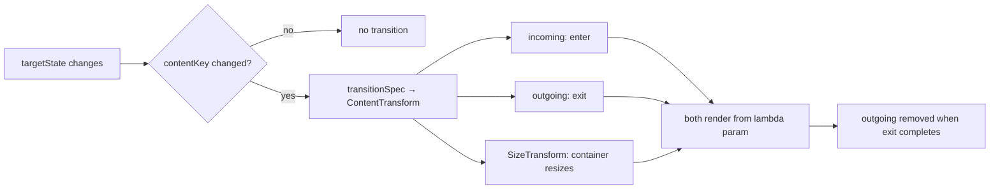
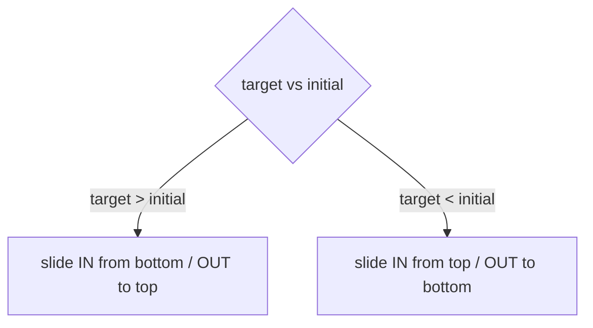

# Lesson 03 — `AnimatedContent`

> After this lesson you can animate the transition *between two different pieces of content* — a number changing, a tab swapping, a loading→loaded handoff — with directional, content-aware motion.

**Module:** 10 · **Lesson:** 03 · **Level:** 🟢🟡🔴 · **Est. time:** 65–85 min

---

## 1. Concept

### 🟢 For beginners — *what is it and why do I care?*

[`AnimatedVisibility`](02-animatedvisibility.md) animated **one** thing appearing or disappearing. But often you're not hiding content — you're **swapping** it for *different* content:

- a counter going from `3` to `4`,
- a screen going from a spinner to a loaded list,
- a button label going from "Follow" to "Following".

If you just write `Text("$count")`, the old number is replaced by the new one with a hard cut. `AnimatedContent` makes the **outgoing** content animate away while the **incoming** content animates in — at the same time:

```kotlin
AnimatedContent(targetState = count) { value ->
    Text("$value")   // old number fades/slides out, new number fades/slides in
}
```

You give it a `targetState`, and a lambda that produces UI **for that state**. Whenever the state changes, it runs the lambda for the *new* value, animates the new content in, and animates the *old* content out. You think in terms of "what does the UI look like *for this value*," and it handles the crossover.

### 🟡 For intermediate devs — *the mechanism*

`AnimatedContent` keeps **both** the outgoing and incoming content composed during the transition and runs them through a `ContentTransform`:

```kotlin
AnimatedContent(
    targetState = count,
    transitionSpec = {
        // direction-aware: slide up if increasing, down if decreasing
        if (targetState > initialState) {
            slideInVertically { it } + fadeIn() togetherWith
                slideOutVertically { -it } + fadeOut()
        } else {
            slideInVertically { -it } + fadeIn() togetherWith
                slideOutVertically { it } + fadeOut()
        }.using(SizeTransform(clip = false))
    },
    label = "counter",
) { value -> Text("$value", style = MaterialTheme.typography.displayMedium) }
```

Key pieces:
- **`transitionSpec`** returns a `ContentTransform`, built with **`togetherWith`** (infix): `enter togetherWith exit`. Inside it you have `initialState` and `targetState` to make motion **directional**.
- **`SizeTransform`** animates the container's size when the two contents differ in size (e.g. "Follow" → "Following"). With `clip = false` content isn't clipped mid-resize.
- The **content lambda** receives the state value to render. *Always render from that parameter*, not the outer state (see Common Mistakes).
- A **`contentKey`** lets you tell it which state changes should actually trigger a transition (e.g. animate on `id` but not on every unrelated field).

It's built on the same `Transition` engine as `AnimatedVisibility`, so the enter and exit stay in lockstep and reversals are smooth.

### 🔴 For senior devs — *trade-offs, edges, internals*

- **The content lambda parameter is load-bearing for correctness.** During the transition, the lambda is composed **twice** — once for `initialState` (the outgoing frame) and once for `targetState` (the incoming frame). If you read the *outer* state instead of the lambda's parameter, **both** copies render the *new* value and the exit animation shows the wrong content (you'll see the new text sliding out). Always render from the parameter.

- **`SizeTransform` is what prevents the "jump" when contents differ in size.** Without it, the container snaps to the new content's size immediately and the outgoing content gets clipped/repositioned abruptly. `SizeTransform { initial, target -> … }` lets you choose the size animation spec and even sequence it (resize *after* the text settles). This is the difference between a polished label swap and a janky one.

- **Default transition fades + scales slightly and the container resizes.** It's a reasonable default, but for *semantically directional* changes (next/previous, increment/decrement, forward/back navigation) you should make motion **directional** using `initialState`/`targetState` — up for "more," forward for "next." Motion that contradicts meaning feels wrong even if users can't articulate why.

- **Both contents are alive during the transition.** Effects in *both* run; if the outgoing content holds a `LaunchedEffect` doing work, it continues until the exit finishes. For expensive content, keep the transition short, or gate work so the outgoing copy doesn't re-trigger it.

- **`contentKey` controls *when* to animate.** If `targetState` is a big object that changes often but you only want to animate when its identity changes, pass `contentKey = { it.id }`. Otherwise every field change re-runs the transition — wasteful and visually noisy.

- **It's the engine behind animated navigation and `Crossfade`.** `Crossfade` is essentially `AnimatedContent` with a fixed fade `transitionSpec`. Type-safe Navigation's `composable` destinations animate with the same machinery. Knowing `AnimatedContent` means you can customize those instead of accepting defaults.

### Analogy

A **revolving stage** in a theatre. The current scene doesn't get struck and rebuilt while the audience waits in the dark (a hard cut). Instead the stage **rotates**: as the old set turns away into the wings, the new set turns into view — both visible during the swap, moving in a coordinated direction. `AnimatedContent` is that turntable: outgoing and incoming on stage together, choreographed across the change. `SizeTransform` is the stage **growing or shrinking** to fit the new set.

### Mental model

> **`AnimatedContent` = a transition *between two states' UIs*.** Render from the lambda's parameter (so the outgoing frame shows the *old* value), make the motion **directional** with `initialState`/`targetState`, and add **`SizeTransform`** when the contents differ in size.

### Real-world example

A **stepper/counter** where digits roll up on increment, down on decrement. A **tab content area** sliding left/right to match swipe direction. A **loading → content** handoff that cross-fades a skeleton into the real list. A **follow button** that morphs "Follow" → "Following" with the pill resizing. A **wizard** whose steps slide forward/back.

---

## 2. Visual Learning

**ASCII — crossover during a state change (3 → 4, increasing):**
```text
                 frame t0          frame t (mid)        frame t1
   incoming "4":  (below, hidden)   4  ↑ sliding up      4  (settled)
                                    ─────────────
   outgoing "3":  3  (settled)      3  ↑ sliding out     (removed)
                  ▲ both contents composed during the transition ▲
```

**Mermaid — the swap pipeline:**


**Mermaid — directional decision:**


**Illustration prompt:**
```text
Illustration: a theatrical revolving stage seen from above, mid-rotation. The left half (turning
away into the wings) holds a large glowing "3" labeled "outgoing (initialState)". The right half
(turning into view) holds a large "4" labeled "incoming (targetState)". A curved arrow shows the
rotation direction labeled "directional: increasing → slide up". The circular stage floor has a
dashed ring labeled "SizeTransform: stage resizes to fit". Modern, vibrant, theatrical spotlights,
clear labels, tech-illustration style.
```

---

## 3. Code

### 🟢 Beginner — animate a changing number

```kotlin
@Composable
fun AnimatedCounter() {
    var count by remember { mutableIntStateOf(0) }

    Column(horizontalAlignment = Alignment.CenterHorizontally) {
        AnimatedContent(targetState = count, label = "count") { value ->
            // Render from `value`, NOT from `count`, so the outgoing frame shows the old number.
            Text("$value", style = MaterialTheme.typography.displayLarge)
        }
        Button(onClick = { count++ }) { Text("Increment") }
    }
}
```

**Explanation.** Each time `count` changes, `AnimatedContent` composes the lambda for the new value, fades/scales it in, and animates the previous number out. We render `"$value"` (the parameter), so the outgoing copy correctly shows the *old* number while it leaves.

**Common mistakes.**
```kotlin
// ❌ Reading the outer state inside the lambda → both copies show the NEW value.
AnimatedContent(targetState = count) { _ ->
    Text("$count")   // outgoing frame ALSO renders the new number → looks broken
}
```
The lambda runs for both the outgoing and incoming states. Ignoring the parameter and reading `count` makes the exit animation display the *new* value, which looks like a glitch.

**Best practices.**
- **Always render from the lambda parameter**, never the outer state.
- Add a `label` for the Animation Inspector.

---

### 🟡 Intermediate — directional motion + `SizeTransform`

```kotlin
@Composable
fun FollowButton(following: Boolean, onToggle: () -> Unit) {
    AnimatedContent(
        targetState = following,
        transitionSpec = {
            // fade + slight slide; resize the pill smoothly between "Follow" and "Following"
            (fadeIn(tween(180)) + slideInHorizontally { it / 2 })
                .togetherWith(fadeOut(tween(120)) + slideOutHorizontally { -it / 2 })
                .using(SizeTransform(clip = false))
        },
        label = "followLabel",
    ) { isFollowing ->                         // render from this parameter
        FilledTonalButton(onClick = onToggle) {
            if (isFollowing) {
                Icon(Icons.Default.Check, contentDescription = null)
                Spacer(Modifier.width(8.dp))
                Text("Following")
            } else {
                Text("Follow")
            }
        }
    }
}
```

**Explanation.** The two labels differ in width, so `SizeTransform(clip = false)` animates the pill's width during the swap instead of snapping. The content slides+fades, and we read `isFollowing` (the parameter). This is the canonical "morphing button" micro-interaction.

**Common mistakes.**
- **Omitting `SizeTransform` when contents differ in size** → the container jumps to the new width instantly and the outgoing label gets clipped. Add `.using(SizeTransform(...))`.
- **Non-directional motion for a directional concept** (e.g. a stepper that always slides the same way) → feels disconnected from the action.

**Best practices.**
- Add `SizeTransform` whenever the two states render different sizes.
- Use `initialState`/`targetState` to make motion match meaning (up/forward for "more/next").
- Keep exit slightly faster than enter so the new content leads.

---

### 🔴 Production — a loading→content state machine with `contentKey`

```kotlin
sealed interface ScreenState {
    data object Loading : ScreenState
    data class Error(val message: String) : ScreenState
    data class Content(val items: List<Article>) : ScreenState
}

@Composable
fun ArticlesScreen(
    state: ScreenState,
    onRetry: () -> Unit,
    modifier: Modifier = Modifier,
) {
    AnimatedContent(
        targetState = state,
        // Only transition when the *kind* of state changes, not on every Content data update.
        contentKey = { it::class },
        transitionSpec = {
            fadeIn(tween(220)) togetherWith fadeOut(tween(160)) using
                SizeTransform(clip = false) { _, _ -> tween(220) }
        },
        label = "screenState",
        modifier = modifier,
    ) { target ->                              // exhaustive render per state
        when (target) {
            ScreenState.Loading -> LoadingSkeleton()
            is ScreenState.Error -> ErrorView(target.message, onRetry)   // read from `target`
            is ScreenState.Content -> ArticleList(target.items)
        }
    }
}
```

**Explanation.** A sealed `ScreenState` makes the three UIs exhaustive and mutually exclusive. `AnimatedContent` cross-fades between Loading/Error/Content and resizes via `SizeTransform`. Crucially, `contentKey = { it::class }` means scrolling/refreshing *within* `Content` (same class, new list) does **not** re-run the whole transition — only a change of state **kind** does. We render from `target`, so each frame shows the correct state's UI.

**Common mistakes.**
```kotlin
// ❌ No contentKey → every new Content(items=…) value re-triggers a full cross-fade.
AnimatedContent(targetState = state) { … }   // refreshing the list flashes the whole screen
```
Without a `contentKey`, any change to `state` (including a fresh `Content` with new items) is treated as a transition, so a routine list update fades the entire screen. Key on `it::class` (or a stable id) to animate only meaningful changes.

```kotlin
// ❌ Reading outer `state` in the lambda → outgoing frame renders the incoming state.
AnimatedContent(targetState = state) { _ ->
    when (state) { … }   // both frames show the new state
}
```

**Best practices.**
- Model the states as a **sealed type**; render exhaustively from the **lambda parameter**.
- Use **`contentKey`** to animate only on meaningful changes (state kind / id), not every data tick.
- Add **`SizeTransform`** so differently-sized states resize gracefully.
- Keep the cross-fade short (≤ 250 ms) so loading→content feels responsive, not sluggish.

---

## 4. Interview Questions

**🟢 Beginner**

1. *What problem does `AnimatedContent` solve that `AnimatedVisibility` doesn't?*
   > `AnimatedVisibility` animates one subtree appearing/disappearing. `AnimatedContent` animates the transition *between two different contents* for a changing state — both the outgoing and incoming content animate during the swap.
2. *Inside the content lambda, what should you render from?*
   > The lambda's **parameter** (the state value), not the outer state — so the outgoing frame shows the old value and the incoming frame shows the new one.

**🟡 Intermediate**

3. *What is `SizeTransform` and when do you need it?*
   > It animates the container's size when the outgoing and incoming contents differ in size (e.g. "Follow" → "Following"). Without it, the container snaps to the new size and clips/jumps the outgoing content. Pass `clip = false` to avoid clipping mid-resize.
4. *How do you make `AnimatedContent` motion directional?*
   > Inside `transitionSpec` you have `initialState` and `targetState`; branch on them (e.g. `if (targetState > initialState) slide up else slide down`) so the motion matches the semantic direction of the change.

**🔴 Senior**

5. *Why might a routine list refresh cause an unwanted full-screen cross-fade, and how do you fix it?*
   > Because any change to `targetState` triggers a transition by default. If your state is `Content(items)` and the list updates, that's a new value → a cross-fade of the whole screen. Set `contentKey = { it::class }` (or a stable id) so only a change in state *kind/identity* animates.
6. *What happens to effects in the outgoing content during a transition?*
   > Both outgoing and incoming content stay composed until the exit completes, so the outgoing content's `LaunchedEffect`s keep running through the animation. For expensive content, keep transitions short or gate the work so the leaving copy doesn't re-trigger it.
7. *How are `Crossfade`, animated Navigation, and `AnimatedContent` related?*
   > `Crossfade` is `AnimatedContent` with a fixed fade `transitionSpec`; type-safe Navigation animates destinations with the same `Transition`/`ContentTransform` machinery. Mastering `AnimatedContent` lets you customize all of them rather than accept defaults.

---

## 5. AI Assistant

**Prompt example (a state-machine screen):**
```text
Write a Compose (2026 BOM, Material 3) screen that animates between a sealed ScreenState
(Loading / Error(message) / Content(items)). Use AnimatedContent with: a fade togetherWith fade
transitionSpec, SizeTransform(clip=false), and contentKey = { it::class } so list refreshes inside
Content do NOT re-trigger the cross-fade. Render exhaustively from the lambda parameter. No ViewModel.
```

**AI workflow — where it helps on *this* topic.**
- ✅ Great for: building the `transitionSpec` with `togetherWith`/`SizeTransform`, directional branching on `initialState`/`targetState`, scaffolding sealed-state screens.
- ⚠️ Watch: models very often **read the outer state** inside the lambda (not the parameter), **omit `SizeTransform`** for differently-sized content, and **forget `contentKey`**, causing full-screen flashes on every data change.

**Review workflow — map to this lesson's *Common Mistakes*:**
- Does the content lambda render from the **parameter**, never the outer state?
- Is there a **`SizeTransform`** when the states render different sizes?
- Is there a **`contentKey`** so only meaningful changes animate?
- Is the motion **directional** when the change is semantically directional?

**Validation workflow — prove it actually works:**
1. **Compile & run**; trigger the change and watch the outgoing frame — it must show the **old** value (proves you read the parameter).
2. Swap between differently-sized states; confirm the container **resizes** smoothly (proves `SizeTransform`).
3. Update data *within* one state (e.g. refresh the list) and confirm **no** full cross-fade (proves `contentKey`).
4. In **Animation Inspector**, scrub the `ContentTransform` to verify enter/exit/resize timing.

> **AI drafts, you decide.** If the model's exit animation shows the *new* value, it read the outer state — you point it back to the lambda parameter.

---

## Recap / Key takeaways

- `AnimatedContent` animates the transition **between two states' UIs** — outgoing and incoming animate together.
- **Render from the lambda parameter**, never the outer state, or the exit shows the wrong content.
- Build the `transitionSpec` with **`togetherWith`** (`enter togetherWith exit`) and make it **directional** using `initialState`/`targetState`.
- Add **`SizeTransform(clip = false)`** when contents differ in size; use **`contentKey`** to animate only on meaningful changes.
- `Crossfade` and animated Navigation are the same engine with simpler defaults.

➡️ Next: **[Lesson 04 — `Animatable` & gestures](04-animatable-and-gestures.md)** — dropping below the declarative wrappers for precise, interruptible, finger-driven motion.
