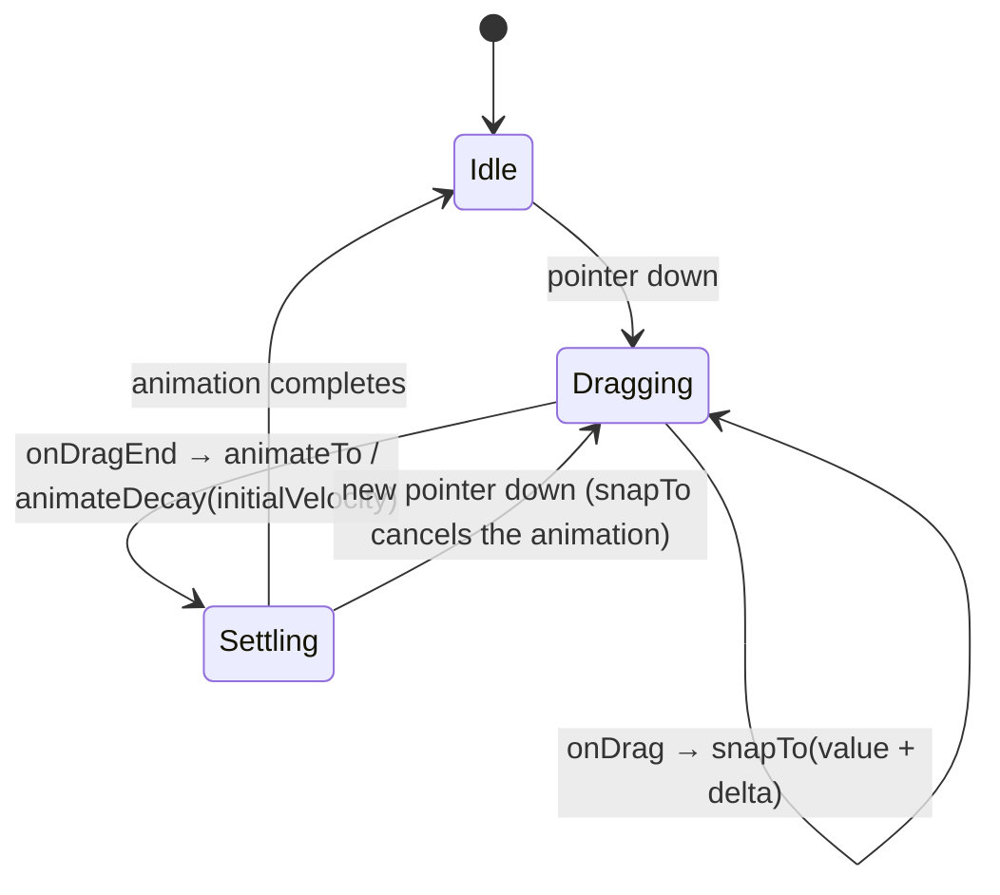
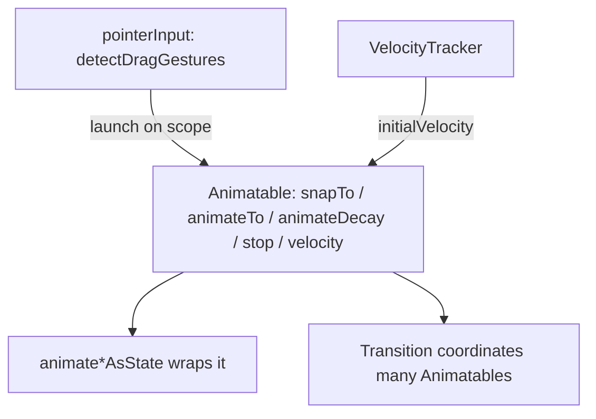

# Lesson 04 — `Animatable` & gestures

> After this lesson you can drive animations imperatively — following a finger, snapping, stopping, decaying with a fling — and explain why `Animatable` is the engine beneath every `animate*AsState`.

**Module:** 10 · **Lesson:** 04 · **Level:** 🟡🔴 · **Est. time:** 80–100 min

---

## 1. Concept

### 🟢 For beginners — *what is it and why do I care?*

[`animate*AsState`](01-animate-as-state.md) is *fire-and-forget*: you set a destination and Compose drives the value there. That's perfect when the value is fully decided by state. But sometimes **you** need to be the driver:

- A card you can **drag** with your finger, and that **springs back** when released.
- A swipe-to-dismiss row that follows the touch, then **flings** off-screen.
- A pull-to-refresh that tracks the pull, then **animates** to a resting position.

For these you need to (a) set the value **instantly** as the finger moves, and (b) **animate** it when the gesture ends — and be able to **interrupt** an in-flight animation the moment a new touch starts. That's `Animatable`.

`Animatable` is a value holder you control from a coroutine. It gives you two verbs:
- **`snapTo(value)`** — jump immediately (use while dragging).
- **`animateTo(value)`** — glide there with a spec (use on release).

```kotlin
val offsetX = remember { Animatable(0f) }
// in a drag:    offsetX.snapTo(offsetX.value + dragAmount)
// on release:   offsetX.animateTo(0f, spring())     // springs back
```

### 🟡 For intermediate devs — *the mechanism*

`Animatable<T, V>` wraps a single animating value with a current `value`, a `targetValue`, and a `velocity`. Its mutating methods are **`suspend`** — they run inside a coroutine and **cooperatively cancel**:

- `snapTo(target)` — set instantly, no animation.
- `animateTo(target, animationSpec, initialVelocity)` — animate; **suspends** until it finishes *or* is interrupted.
- `animateDecay(initialVelocity, decayAnimationSpec)` — fling: decelerate from a velocity (no explicit target).
- `stop()` — halt the current animation, keeping the current value/velocity.
- `snapTo`/`animateTo` automatically **cancel** any animation already running on that `Animatable` — interruption is built in.

You typically pair it with gestures from `Modifier.pointerInput` (`detectDragGestures`, `detectTapGestures`) and a `rememberCoroutineScope()` to launch the animations:

```kotlin
val scope = rememberCoroutineScope()
Modifier.pointerInput(Unit) {
    detectHorizontalDragGestures(
        onHorizontalDrag = { _, dragAmount ->
            scope.launch { offsetX.snapTo(offsetX.value + dragAmount) }
        },
        onDragEnd = {
            scope.launch { offsetX.animateTo(0f, spring()) }   // settle
        },
    )
}
```

For `Float` there's `Animatable(0f)`; for other types you supply a `TwoWayConverter` (most common ones exist: `Color.VectorConverter`, `Dp.VectorConverter`, `Offset.VectorConverter`, …). You can clamp with `updateBounds(lowerBound, upperBound)`.

### 🔴 For senior devs — *trade-offs, edges, internals*

- **`animate*AsState` is literally an `Animatable` + a `LaunchedEffect`.** The declarative API remembers an `Animatable`, and on target change launches `animateTo`. Knowing this demystifies everything: when you need to *also* `snapTo`, read `velocity`, or `stop()`, you've outgrown the wrapper and should hold the `Animatable` yourself.

- **Velocity continuity is the whole point of gesture polish.** A natural fling hands the gesture's **release velocity** into `animateDecay`/`animateTo` so motion continues seamlessly instead of restarting from zero. Capture velocity with a `VelocityTracker` (or the value provided by higher-level gesture APIs) and pass it as `initialVelocity`. Dropping velocity is the difference between "buttery" and "dead."

- **Cancellation is cooperative and ordering matters.** Because the methods suspend, a *new* `snapTo` from an incoming touch cancels a running `animateTo` automatically — which is exactly why a finger can "catch" a moving card mid-spring. But if you `launch` each gesture event in a **fresh** coroutine without care, you can race: prefer launching follow-up animations such that the latest one wins (the built-in mutual-exclusion via the same `Animatable` handles most of this, since each `animateTo`/`snapTo` cancels the prior).

- **`Animatable` mutations must run on a coroutine you control** — usually `rememberCoroutineScope()` for gesture callbacks, or a `LaunchedEffect` for state-driven runs. Calling them off a random thread, or forgetting they suspend, leads to "nothing animates" or `IllegalState` surprises.

- **Bounds prevent overshoot/rubber-banding bugs.** `updateBounds(min, max)` clamps the value so a spring can't fling a draggable past its track. For rubber-band/edge resistance you implement the easing yourself in the drag handler before `snapTo`.

- **It's single-value.** For several values that must stay coordinated (a transition with size + color + alpha together), don't juggle multiple `Animatable`s by hand — that's what [`updateTransition`](06-updatetransition.md) (Lesson 06) is for. Use `Animatable` for *one* finely-controlled value (often an offset) and let a `Transition` coordinate sets.

- **Threading vs the main thread.** The animation runs on the frame clock (main thread) but does almost no work per frame; the danger is *your* drag handler doing heavy work (allocations, layout reads) every event. Keep gesture callbacks lean — read the value, compute an offset, `snapTo`.

### Analogy

**Cruise control vs. your hands on the wheel.** `animate*AsState` is cruise control: pick a speed, the car maintains it. `Animatable` is **driving manually** — you feel the road and steer moment to moment (`snapTo` while dragging), and when you let go on a curve the car's **momentum carries it** and you ease back to center (`animateTo`/`animateDecay` with the release velocity). You can also slam the brakes mid-maneuver (`stop()`), and grab the wheel again at any instant (a new `snapTo` cancels the in-flight motion).

### Mental model

> **`Animatable` = a value you drive from a coroutine.** `snapTo` while a finger is down, `animateTo`/`animateDecay` when it lifts — carrying the **velocity** across — and any new command **interrupts** the last. It's the engine `animate*AsState` hides.

### Real-world example

**Swipe-to-dismiss** list rows (follow finger, fling off or spring back). **Pull-to-refresh** (track the pull, settle to the spinner). **Draggable bottom sheets** and **snap-to-anchor** chips. **A draggable FAB** that snaps to the nearest edge. Material's own `SwipeToDismissBox` and `AnchoredDraggable` are built on this machinery.

---

## 2. Visual Learning

**ASCII — drag (snapTo) then release (animateTo):**
```text
   finger down ──────────── dragging ──────────── finger up ──────── settling
        │                                              │
   snapTo(value)  snapTo  snapTo  snapTo  snapTo       │ animateTo(0f, spring, v=release)
        ▼            ▼       ▼       ▼       ▼          ▼   ...---``  (velocity carried in)
   x=0          x=20    x=55    x=90   x=130   ──────▶ x decays/springs back to 0
   ◀── value tracks the finger exactly ──▶        ◀── physics finishes the motion ──▶
```

**Mermaid — the gesture state machine:**


**Mermaid — where `Animatable` sits:**


**Illustration prompt:**
```text
Illustration: a steering-wheel metaphor split into two halves. Left half "manual driving" shows
hands on a wheel and a finger dragging a card on a phone, labeled "snapTo — value follows finger".
Right half "release" shows the hands letting go and the car curving with a momentum trail back to
center, labeled "animateTo / animateDecay — velocity carried in". A small dashboard inset reads
"velocity" with a needle. A faded 'cruise control' button labeled "animate*AsState (fire-and-forget)"
sits in the corner for contrast. Modern, vibrant, motion trails, clear labels, tech-illustration style.
```

---

## 3. Code

### 🟢 Beginner — drive a value by hand: snap, then animate

```kotlin
@Composable
fun TapToNudge() {
    val offsetX = remember { Animatable(0f) }     // a value WE control over time
    val scope = rememberCoroutineScope()           // Animatable methods are suspend → need a scope

    Box(
        Modifier
            .offset { IntOffset(offsetX.value.roundToInt(), 0) }   // read in layout, not composition
            .size(80.dp)
            .background(MaterialTheme.colorScheme.primary, CircleShape)
            .clickable {
                scope.launch {
                    offsetX.snapTo(120f)                 // jump instantly to the right…
                    offsetX.animateTo(0f, spring())      // …then glide back to the start
                }
            }
    )
}
```

**Explanation.** Unlike `animate*AsState`, *we* tell the value what to do: `snapTo(120f)` sets it immediately, then `animateTo(0f)` animates it home. Because these are `suspend` functions, we run them inside a coroutine from `rememberCoroutineScope()`. We read `offsetX.value` in `Modifier.offset { }` (a lambda → layout phase) so moving it doesn't recompose the box.

**Common mistakes.**
```kotlin
// ❌ Calling suspend animation methods outside a coroutine → won't compile / nothing animates.
Modifier.clickable { offsetX.animateTo(0f) }   // animateTo is suspend; must be launched
```
`snapTo`/`animateTo` suspend — call them from `scope.launch { … }` (gesture callbacks) or a `LaunchedEffect`, never directly in a click lambda.

**Best practices.**
- Hold the `Animatable` in `remember`; mutate it from a remembered coroutine scope.
- `snapTo` for instant, `animateTo` for animated — and read the value in a lambda modifier (`offset { }`).

---

### 🟡 Intermediate — draggable chip that springs back

```kotlin
@Composable
fun SpringBackChip(label: String) {
    val offsetX = remember { Animatable(0f) }
    val scope = rememberCoroutineScope()

    AssistChip(
        onClick = {},
        label = { Text(label) },
        modifier = Modifier
            .offset { IntOffset(offsetX.value.roundToInt(), 0) }   // read in layout → no recompose
            .pointerInput(Unit) {
                detectHorizontalDragGestures(
                    onHorizontalDrag = { _, dragAmount ->
                        // snapTo while the finger is down: the chip tracks the touch exactly.
                        scope.launch { offsetX.snapTo(offsetX.value + dragAmount) }
                    },
                    onDragEnd = {
                        // animate back to rest on release.
                        scope.launch { offsetX.animateTo(0f, spring(stiffness = Spring.StiffnessLow)) }
                    },
                )
            },
    )
}
```

**Explanation.** During the drag we `snapTo` so the chip follows the finger 1:1. On release we `animateTo(0f)` with a soft spring, so it eases home. A new touch mid-spring issues a fresh `snapTo`, which **cancels** the spring automatically — the user can grab it again. We read `offsetX.value` inside `Modifier.offset { }` (a lambda → layout phase), so dragging doesn't recompose the chip.

**Common mistakes.**
```kotlin
// ❌ animateTo while dragging → fights the finger; motion lags and feels rubbery.
onHorizontalDrag = { _, dragAmount ->
    scope.launch { offsetX.animateTo(offsetX.value + dragAmount) }  // should be snapTo
}
```
While the finger is down the value must track *exactly* — that's `snapTo`. `animateTo` introduces an easing curve per event, so the chip lags behind the touch.

```kotlin
// ❌ Reading offsetX.value in composition → recomposes every drag frame.
Modifier.offset(x = offsetX.value.dp)   // eager read in composition
```

**Best practices.**
- **`snapTo` during the gesture, `animateTo`/`animateDecay` on release.**
- Read the animated value in a **lambda modifier** (`offset { }`) to keep it off the composition path.
- Launch mutations on `rememberCoroutineScope()`; let new commands cancel old ones.

---

### 🔴 Production — swipe-to-dismiss with velocity-aware fling + bounds

```kotlin
@Composable
fun SwipeToDismissRow(
    onDismissed: () -> Unit,
    modifier: Modifier = Modifier,
    content: @Composable () -> Unit,
) {
    val offsetX = remember { Animatable(0f) }
    val scope = rememberCoroutineScope()
    val decay = rememberSplineBasedDecay<Float>()
    var width by remember { mutableFloatStateOf(0f) }
    val velocityTracker = remember { VelocityTracker() }

    Box(
        modifier
            .onSizeChanged { width = it.width.toFloat() }
            .offset { IntOffset(offsetX.value.roundToInt(), 0) }
            .pointerInput(Unit) {
                detectHorizontalDragGestures(
                    onDragStart = { velocityTracker.resetTracking() },
                    onHorizontalDrag = { change, dragAmount ->
                        velocityTracker.addPosition(change.uptimeMillis, change.position)
                        scope.launch { offsetX.snapTo(offsetX.value + dragAmount) }
                    },
                    onDragEnd = {
                        val velocity = velocityTracker.calculateVelocity().x
                        scope.launch {
                            // Where would a fling at this velocity land?
                            val target = decay.calculateTargetValue(offsetX.value, velocity)
                            if (abs(target) >= width / 2f) {
                                // Far enough → fling off-screen, then notify.
                                offsetX.updateBounds(lowerBound = -width, upperBound = width)
                                offsetX.animateDecay(velocity, decay)
                                onDismissed()
                            } else {
                                // Not far enough → spring back, carrying the release velocity.
                                offsetX.animateTo(0f, spring(), initialVelocity = velocity)
                            }
                        }
                    },
                )
            },
    ) { content() }
}
```

**Explanation.** We track touch positions in a `VelocityTracker`, then on release compute where a *fling* would naturally land (`decay.calculateTargetValue`). If that projected landing passes the halfway threshold, we **`animateDecay`** off-screen at the real release velocity and report dismissal; otherwise we **`animateTo(0f)`** *with* that same velocity so the spring-back feels continuous, not reset. `updateBounds` clamps the off-screen fling. This is the actual recipe behind production swipe-to-dismiss.

**Common mistakes.**
```kotlin
// ❌ Ignoring velocity → flings feel dead; a fast flick that should dismiss just springs back.
onDragEnd = { scope.launch { offsetX.animateTo(0f) } }   // no velocity, no decay projection
```
Without the release velocity, a quick flick that *should* dismiss snaps back, and a slow drag past halfway might over- or under-shoot. Project the fling with the velocity and decide from that.

```kotlin
// ❌ Deciding dismiss purely on current offset, not the projected landing.
if (abs(offsetX.value) > width / 2) onDismissed()   // ignores momentum
```
A user can flick fast with a *small* offset and still intend to dismiss. Decide on `decay.calculateTargetValue(...)`, which accounts for momentum.

**Best practices.**
- Capture release **velocity** and feed it into `animateDecay`/`animateTo(initialVelocity = …)`.
- Decide outcomes on the **projected** fling target, not the instantaneous offset.
- Clamp with `updateBounds`; keep drag callbacks allocation-light.
- For most apps, prefer Material's `SwipeToDismissBox`/`AnchoredDraggable` (built on this) — hand-roll only when you need bespoke behavior.

---

## 4. Interview Questions

**🟢 Beginner**

1. *What's the difference between `snapTo` and `animateTo` on an `Animatable`?*
   > `snapTo` sets the value instantly (no animation) — used while a finger is dragging. `animateTo` glides to the value with an `animationSpec` — used on release. Both are `suspend` functions.
2. *Why is `Animatable` used for gestures but `animate*AsState` usually isn't?*
   > Gestures need to set the value *instantly* (`snapTo`), animate on release, carry velocity, and interrupt mid-flight — imperative control `animate*AsState` doesn't expose. `animate*AsState` is for values fully derived from state.

**🟡 Intermediate**

3. *Why must `Animatable` mutations run in a coroutine?*
   > Its methods (`snapTo`, `animateTo`, `animateDecay`) are `suspend` — they animate over time and cooperatively cancel. You launch them on `rememberCoroutineScope()` (gesture callbacks) or run them in a `LaunchedEffect` (state-driven).
4. *How does interruption work when a new touch lands mid-animation?*
   > A new `snapTo`/`animateTo` on the same `Animatable` automatically cancels the running animation, keeping the current value (and velocity for `animateTo`). That's why a finger can "catch" a card mid-spring.

**🔴 Senior**

5. *Explain the relationship between `Animatable` and `animate*AsState`.*
   > `animate*AsState` is a thin wrapper: it `remember`s an `Animatable` and launches `animateTo` whenever the target changes. When you need `snapTo`, `stop`, `animateDecay`, velocity, or bounds, you drop to holding the `Animatable` yourself.
6. *How do you implement a velocity-aware swipe-to-dismiss decision?*
   > Track positions with a `VelocityTracker`; on release compute the fling landing via `decayAnimationSpec.calculateTargetValue(current, velocity)`. If it passes a threshold, `animateDecay` off-screen at that velocity and dismiss; else `animateTo(rest, initialVelocity = velocity)`. Deciding on the *projected* target (not the instantaneous offset) respects momentum.
7. *When should you NOT use a raw `Animatable`?*
   > When several values must animate **together** as one logical transition (size + color + alpha). Coordinating multiple `Animatable`s by hand drifts; use `updateTransition`. Use `Animatable` for a single finely-controlled value.

---

## 5. AI Assistant

**Prompt example (swipe-to-dismiss):**
```text
Write a Compose (2026 BOM) swipe-to-dismiss row using a raw Animatable<Float> (NOT
SwipeToDismissBox). Track velocity with VelocityTracker; on drag use snapTo; on release, use
decay.calculateTargetValue to decide: if past half width, animateDecay off-screen and call
onDismissed(); else animateTo(0f) carrying the release velocity. Read the offset in Modifier.offset { }
(layout phase). Launch on rememberCoroutineScope. Clamp with updateBounds.
```

**AI workflow — where it helps on *this* topic.**
- ✅ Great for: wiring `pointerInput` + `Animatable`, the velocity-projection math, and the snapTo/animateTo split.
- ⚠️ Watch: models frequently use **`animateTo` during the drag** (should be `snapTo`), **ignore velocity** entirely, **read the value in composition** (`offset(x = value.dp)`) instead of a lambda, and forget `rememberCoroutineScope`/launching.

**Review workflow — map to this lesson's *Common Mistakes*:**
- Is it **`snapTo` while dragging** and **`animateTo`/`animateDecay` on release**?
- Is **release velocity** captured and fed into the settle/fling?
- Is the offset read in a **lambda modifier** (`offset { }`), not composition?
- Are mutations launched on a remembered scope, and does the dismiss decision use the **projected** target?

**Validation workflow — prove it actually works:**
1. **Run on a device** (not just preview — gestures need touch). Drag slowly: the row tracks your finger 1:1 (proves `snapTo`).
2. Flick fast with a small offset: it should still dismiss (proves velocity-based decision).
3. Grab a row mid-spring-back: it should catch under your finger (proves interruption).
4. Check **Layout Inspector → recomposition counts** during a drag: the row should *not* recompose every frame (proves the offset read is deferred to layout).

> **AI drafts, you decide.** If the model's drag uses `animateTo`, the row will feel laggy on-device — you switch it to `snapTo` and add velocity on release.

---

## Recap / Key takeaways

- **`Animatable`** is a value you drive from a coroutine: **`snapTo`** while dragging, **`animateTo`/`animateDecay`** on release, **`stop()`** to halt, plus `velocity` and `updateBounds`.
- New commands **interrupt** in-flight animations automatically — that's how a finger catches a moving element.
- **Carry release velocity** into the settle/fling, and decide outcomes on the **projected** landing, not the instantaneous offset.
- Read the animated value in a **lambda modifier** (`offset { }`) to keep gestures off the composition path.
- `animate*AsState` is just an `Animatable` + `LaunchedEffect`; for coordinating *many* values together, use [`updateTransition`](06-updatetransition.md).

➡️ Next: **[Lesson 05 — Infinite transitions](05-infinite-transitions.md)** — endless, looping motion for loaders, pulses, and shimmer.
