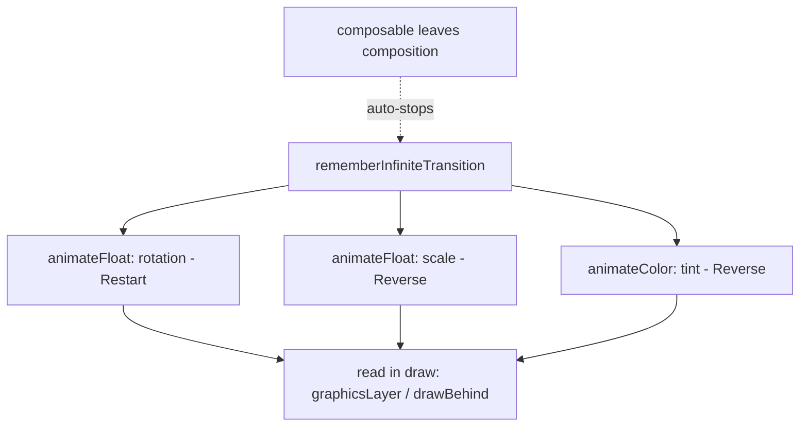
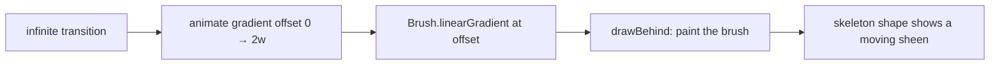

# Lesson 05 — Infinite transitions

> After this lesson you can build motion that loops forever — pulses, spinners, shimmer placeholders — with `rememberInfiniteTransition`, and do it without burning battery or jank.

**Module:** 10 · **Lesson:** 05 · **Level:** 🟢🟡🔴 · **Est. time:** 55–75 min

---

## 1. Concept

### 🟢 For beginners — *what is it and why do I care?*

Some animations have a clear start and end — a card expands, a banner slides in. Others are meant to run **continuously until you stop looking at them**:

- a **loading spinner** that rotates endlessly,
- a **pulsing dot** that breathes to draw attention,
- a **shimmer** sweeping across a placeholder while content loads.

You *could* fake these with repeated `animate*AsState` calls, but Compose has a purpose-built tool: **`rememberInfiniteTransition`**. You ask it for an animated value that loops between two bounds forever:

```kotlin
val transition = rememberInfiniteTransition(label = "pulse")
val scale by transition.animateFloat(
    initialValue = 1f,
    targetValue = 1.2f,
    animationSpec = infiniteRepeatable(tween(600), RepeatMode.Reverse),
    label = "scale",
)
Box(Modifier.graphicsLayer { scaleX = scale; scaleY = scale })
```

It animates `1f → 1.2f → 1f → 1.2f …` forever — a gentle pulse — with no manual restarting.

### 🟡 For intermediate devs — *the mechanism*

`rememberInfiniteTransition()` returns an `InfiniteTransition`. You attach one or more animated values to it:

- `animateFloat(initialValue, targetValue, animationSpec)`
- `animateColor(...)`, `animateValue(..., typeConverter)`

The spec is always an **`infiniteRepeatable`**:

```kotlin
infiniteRepeatable(
    animation = tween(durationMillis = 1000, easing = LinearEasing),
    repeatMode = RepeatMode.Restart,   // or RepeatMode.Reverse
)
```

- **`RepeatMode.Restart`** — jumps back to the start each cycle (good for **rotation**: 0°→360°→0°…).
- **`RepeatMode.Reverse`** — bounces back and forth (good for **pulse/breathe**: 1→1.2→1→1.2…).

You can attach **several** animated values to **one** `InfiniteTransition` so they share the same lifecycle — start together, stop together when the composable leaves. The transition **automatically stops** when the composable is removed from composition (no manual cleanup), and resumes when it re-enters.

A loop runs forever by design, so the rule is: keep each frame's read **cheap** and **deferred** (draw phase), because it runs ~60–120 times a second for as long as it's on screen.

### 🔴 For senior devs — *trade-offs, edges, internals*

- **Infinite ≠ free.** A looping animation is a permanent stream of frames. The danger isn't the math — it's **what each frame triggers**. If the looping value is read in **composition** (e.g. `Modifier.rotate(angle)`), you recompose that subtree ~60–120×/sec **forever**, and if it's inside a list item, ×N. Read looping values in **draw** (`graphicsLayer { rotationZ = angle }`, `drawWithContent`) so the loop costs a cheap redraw, not recomposition. This is the single biggest infinite-animation perf mistake.

- **Battery & accessibility: respect "reduce motion."** Endless motion drains battery and can be physically unpleasant for users with vestibular disorders. Production code should **gate** decorative loops (shimmer, parallax, bouncing) and either stop them or swap to a static state when the system's reduced-motion / animator-duration-scale is off. A spinner that conveys *progress* may stay; purely decorative motion should yield.

- **Choose the spec to match the topology.** `Restart` for cyclic values where start==end conceptually (rotation 0→360 is the same as 0). `Reverse` for ping-pong values (scale/alpha). Using `Restart` on a pulse causes a visible **jump** from 1.2 back to 1 each cycle; using `Reverse` on rotation makes it spin backward half the time. Pick deliberately.

- **Phase offsets create richer motion cheaply.** Multiple values on one transition with **different durations or `initialStartOffset`** produce staggered, organic effects (e.g. three dots pulsing out of phase) without extra machinery. `infiniteRepeatable(initialStartOffset = StartOffset(150))` delays one value's phase.

- **Shimmer is a moving gradient, not an opacity flash.** A convincing skeleton shimmer animates a **translation** of a `Brush.linearGradient` across the shape (read in `drawBehind`/`graphicsLayer`), not a fading box. Implement it as a `Modifier` that animates the gradient's start/end offset.

- **`InfiniteTransition` vs a hand-rolled `Animatable` loop.** You *can* `while (true) { animatable.animateTo(...) }` in a `LaunchedEffect`, but `InfiniteTransition` integrates with the composition lifecycle (auto start/stop), shows in the Animation Inspector, and coordinates multiple values. Prefer it for declarative loops; reserve the manual loop for cases needing per-cycle logic.

- **It still pauses with the host.** Like other Compose animations, the frame clock is tied to the window; when the app is backgrounded the loop isn't drawing. But it *will* resume — don't rely on it as a timer, and don't do real work per frame.

### Analogy

A **lighthouse beam.** Once lit, it sweeps around and around with no one cranking it each turn — a self-sustaining loop (`rememberInfiniteTransition` + `Restart`). A **buoy bobbing** on the waves is the other mode: up, down, up, down, reversing at each extreme (`Reverse`). And like a real lighthouse, you turn it **off when no ships are near** (stop decorative motion when it's not needed) so you don't waste fuel (battery).

### Mental model

> **`rememberInfiniteTransition` is a self-restarting loop between two bounds.** `Restart` to cycle (rotation), `Reverse` to ping-pong (pulse). Read the looping value in **draw**, and **gate** decorative loops for battery and accessibility.

### Real-world example

A **circular progress spinner** (rotation, `Restart`, linear). A **"recording" dot** that pulses (scale/alpha, `Reverse`). A **skeleton/shimmer** placeholder list while data loads (translating gradient). A **typing indicator** with three dots out of phase. A **breathing CTA** that gently scales to invite a tap.

---

## 2. Visual Learning

**ASCII — Restart vs Reverse:**
```text
   RepeatMode.Restart (rotation 0°→360°):
   0 ─ 90 ─ 180 ─ 270 ─ 360 │ 0 ─ 90 ─ 180 …   (snaps back to start; invisible for cyclic values)

   RepeatMode.Reverse (scale 1.0↔1.2):
   1.0 ─ 1.1 ─ 1.2 ─ 1.1 ─ 1.0 ─ 1.1 ─ 1.2 …   (bounces; smooth for ping-pong values)
```

**Mermaid — one transition, many synced values:**


**Mermaid — shimmer pipeline:**


**Illustration prompt:**
```text
Illustration: a lighthouse at night on a cliff, its beam drawn as a sweeping arc of light going
around in a loop, labeled "RepeatMode.Restart (rotation)". In the foreground water, a buoy bobs up
and down with a small vertical double-arrow labeled "RepeatMode.Reverse (pulse)". A subtle power
gauge near the lighthouse base reads "battery — off when no ships", hinting at gating decorative
motion. Modern, vibrant, night palette with warm beam glow, clear labels, tech-illustration style.
```

---

## 3. Code

### 🟢 Beginner — a pulsing dot

```kotlin
@Composable
fun PulsingDot() {
    val transition = rememberInfiniteTransition(label = "pulse")
    val scale by transition.animateFloat(
        initialValue = 1f,
        targetValue = 1.3f,
        animationSpec = infiniteRepeatable(
            animation = tween(600, easing = FastOutSlowInEasing),
            repeatMode = RepeatMode.Reverse,        // bounce 1 ↔ 1.3
        ),
        label = "scale",
    )

    Box(
        Modifier
            .size(16.dp)
            .graphicsLayer { scaleX = scale; scaleY = scale }   // read in draw, not composition
            .background(MaterialTheme.colorScheme.primary, CircleShape)
    )
}
```

**Explanation.** One `InfiniteTransition` drives `scale` between `1f` and `1.3f`, bouncing because of `RepeatMode.Reverse`. We apply it inside `graphicsLayer { }` so the breathing is a draw-only transform — the composable never recomposes for the animation. It auto-stops when `PulsingDot` leaves the screen.

**Common mistakes.**
```kotlin
// ❌ RepeatMode.Restart on a pulse → jarring jump from 1.3 back to 1.0 each cycle.
infiniteRepeatable(tween(600), RepeatMode.Restart)
```
A pulse should ease back down; `Restart` teleports from the top value to the bottom, producing a visible flicker every cycle. Use `Reverse`.

**Best practices.**
- `Reverse` for ping-pong values (scale/alpha); `Restart` for cyclic ones (rotation).
- Apply the value in `graphicsLayer { }` (draw), not `Modifier.scale(value)` (composition).
- Always pass a `label` so it appears in the Animation Inspector.

---

### 🟡 Intermediate — a rotating spinner + coordinated values

```kotlin
@Composable
fun BrandedSpinner(modifier: Modifier = Modifier) {
    val transition = rememberInfiniteTransition(label = "spinner")

    val angle by transition.animateFloat(
        initialValue = 0f,
        targetValue = 360f,
        animationSpec = infiniteRepeatable(tween(1000, easing = LinearEasing)),  // Restart implied
        label = "angle",
    )
    // Second value on the SAME transition → shares lifecycle, stays in sync.
    val alpha by transition.animateFloat(
        initialValue = 0.4f,
        targetValue = 1f,
        animationSpec = infiniteRepeatable(tween(1000), RepeatMode.Reverse),
        label = "alpha",
    )

    Canvas(modifier.size(48.dp)) {
        rotate(degrees = angle) {                         // rotation read in draw scope
            drawArc(
                color = Color(0xFF6750A4).copy(alpha = alpha),
                startAngle = 0f, sweepAngle = 270f, useCenter = false,
                style = Stroke(width = 6.dp.toPx(), cap = StrokeCap.Round),
            )
        }
    }
}
```

**Explanation.** Linear `tween` + (default) `Restart` gives constant-speed rotation. A second value (`alpha`) attached to the *same* `InfiniteTransition` pulses opacity in sync, and because both live on one transition they start/stop together. Everything is read inside the `Canvas` draw scope, so there's zero recomposition while it spins.

**Common mistakes.**
- **Non-linear easing on a spinner** (`FastOutSlowIn`) → it speeds up and slows each revolution, which reads as stuttering. Use `LinearEasing` for constant rotation.
- **Separate transitions for values that should be coordinated** → extra objects and possible drift; attach them to one `InfiniteTransition`.

**Best practices.**
- Linear easing for continuous rotation; ease only ping-pong values.
- Coordinate related loops on **one** `InfiniteTransition`.
- Draw in `Canvas`/`graphicsLayer` so the loop is draw-only.

---

### 🔴 Production — an accessible shimmer modifier that respects reduced motion

```kotlin
fun Modifier.shimmer(
    enabled: Boolean = true,
): Modifier = composed {
    if (!enabled) return@composed this

    // Respect the system animation scale: if motion is disabled, show a static placeholder tint.
    val context = LocalContext.current
    val animationsOn = remember {
        Settings.Global.getFloat(
            context.contentResolver,
            Settings.Global.ANIMATOR_DURATION_SCALE,
            1f,
        ) != 0f
    }

    val base = MaterialTheme.colorScheme.surfaceVariant
    val highlight = MaterialTheme.colorScheme.surface

    if (!animationsOn) {
        // Static fallback — no perpetual motion for reduced-motion users.
        return@composed drawBehind { drawRect(base) }
    }

    val transition = rememberInfiniteTransition(label = "shimmer")
    val translate by transition.animateFloat(
        initialValue = 0f,
        targetValue = 1f,
        animationSpec = infiniteRepeatable(tween(1200, easing = LinearEasing)),
        label = "translate",
    )

    drawWithCache {
        val widthPx = size.width
        val sweep = widthPx * 2f
        val start = -sweep + (sweep * 2f) * translate     // gradient slides across the shape
        val brush = Brush.linearGradient(
            colors = listOf(base, highlight, base),
            start = Offset(start, 0f),
            end = Offset(start + sweep, 0f),
        )
        onDrawBehind { drawRect(brush) }                  // painted in the DRAW phase only
    }
}

@Composable
fun ArticlePlaceholder() {
    Column(Modifier.padding(16.dp), verticalArrangement = Arrangement.spacedBy(12.dp)) {
        Box(Modifier.fillMaxWidth().height(20.dp).clip(MaterialTheme.shapes.small).shimmer())
        Box(Modifier.fillMaxWidth(0.7f).height(20.dp).clip(MaterialTheme.shapes.small).shimmer())
        Box(Modifier.fillMaxWidth().height(120.dp).clip(MaterialTheme.shapes.medium).shimmer())
    }
}
```

**Explanation.** The shimmer is a **translating gradient** painted in `drawWithCache`/`onDrawBehind` — pure draw work, no recomposition. Crucially, it checks `ANIMATOR_DURATION_SCALE`: when the user has disabled animations (accessibility/battery), it renders a **static** tinted placeholder instead of looping forever. That gate is what separates production code from a demo.

**Common mistakes.**
```kotlin
// ❌ Shimmer as a fading box → looks like a flashing rectangle, not a sweep, and ignores a11y.
val alpha by transition.animateFloat(0.3f, 1f, infiniteRepeatable(tween(800), RepeatMode.Reverse))
Box(Modifier.alpha(alpha).background(base))   // reads alpha in composition + no reduced-motion check
```
A convincing skeleton **moves a highlight across** the shape; fading the whole box looks cheap. And reading `alpha` via `Modifier.alpha` recomposes every frame. Animate a gradient offset in draw, and gate it.

```kotlin
// ❌ Never stopping decorative motion → battery drain + vestibular discomfort.
// (no ANIMATOR_DURATION_SCALE / reduced-motion check at all)
```

**Best practices.**
- Implement shimmer as a **moving gradient** read in `drawBehind`/`drawWithCache`, never an opacity flash in composition.
- **Gate** decorative loops on the system animation scale (or a user preference) and provide a static fallback.
- Stop loops when content has loaded — don't shimmer behind already-present data.

---

## 4. Interview Questions

**🟢 Beginner**

1. *What does `rememberInfiniteTransition` do?*
   > It creates a transition whose attached values animate **forever** between bounds (via `infiniteRepeatable`), auto-starting and auto-stopping with the composable. Used for spinners, pulses, and shimmer.
2. *`RepeatMode.Restart` vs `RepeatMode.Reverse`?*
   > `Restart` jumps back to the start each cycle (good for rotation, where start and end are equivalent). `Reverse` bounces back and forth (good for pulse/breathe values like scale/alpha).

**🟡 Intermediate**

3. *Why read an infinitely-animating value in `graphicsLayer { }` rather than `Modifier.rotate(value)`?*
   > `Modifier.rotate(value)` reads the value in **composition**, so an endless animation recomposes that subtree ~60–120×/sec forever (×N in a list). `graphicsLayer { rotationZ = value }` reads in **draw**, so the loop is a cheap redraw with no recomposition.
4. *How do you coordinate several looping values so they stay in sync?*
   > Attach them all to **one** `InfiniteTransition` (multiple `animateFloat`/`animateColor` calls). They share the same lifecycle and start/stop together; separate transitions can drift and cost more.

**🔴 Senior**

5. *What are the costs of an infinite animation, and how do you mitigate them?*
   > A perpetual frame stream: battery, and recomposition if read in composition. Mitigate by reading in **draw**, keeping per-frame work allocation-free, **stopping** the loop when not needed (content loaded), and **gating** decorative motion on reduced-motion/animation-scale settings.
6. *How would you build a convincing, accessible shimmer?*
   > Animate a `Brush.linearGradient`'s offset across the shape, painted in `drawBehind`/`drawWithCache` (draw-only). Check `Settings.Global.ANIMATOR_DURATION_SCALE` (or a user setting); if animations are off, render a **static** placeholder instead of looping. Stop it once real content arrives.
7. *When would you hand-roll a loop with `Animatable` instead of `InfiniteTransition`?*
   > When each cycle needs custom logic (e.g. vary the target per iteration, await a condition between cycles). `InfiniteTransition` is best for declarative, lifecycle-managed, inspector-visible loops; a `LaunchedEffect { while (true) { animatable.animateTo(...) } }` is for per-cycle control.

---

## 5. AI Assistant

**Prompt example (an accessible shimmer modifier):**
```text
Write a Compose (2026 BOM, Material 3) `Modifier.shimmer()` that animates a linearGradient sweep
across the shape using rememberInfiniteTransition + infiniteRepeatable(LinearEasing). Paint it in
drawWithCache/onDrawBehind (draw phase only). Check Settings.Global.ANIMATOR_DURATION_SCALE: if
animations are disabled, render a static surfaceVariant fill instead of looping. Provide an
ArticlePlaceholder using it.
```

**AI workflow — where it helps on *this* topic.**
- ✅ Great for: spinner/pulse boilerplate, gradient-shimmer math, choosing `Restart` vs `Reverse`.
- ⚠️ Watch: models read looping values in **composition** (`Modifier.rotate`/`Modifier.alpha`), use **`Restart` for pulses**, implement shimmer as a **fading box**, and **omit the reduced-motion gate** entirely.

**Review workflow — map to this lesson's *Common Mistakes*:**
- Is the looping value read in **draw** (`graphicsLayer`/`drawBehind`/`Canvas`), not composition?
- Is the **repeat mode** correct (`Reverse` for pulse, `Restart` for rotation, linear easing for spin)?
- Is shimmer a **moving gradient**, not an opacity flash?
- Is there a **reduced-motion / animation-scale gate** and a static fallback? Does it **stop** when content loads?

**Validation workflow — prove it actually works:**
1. **Compile & run**; confirm the loop animates and a pulse eases (no per-cycle jump).
2. **Layout Inspector → recomposition counts**: the animating composable must **not** climb each frame — if it does, move the read into draw.
3. In Developer Options set **Animator duration scale = Off**; confirm decorative loops stop / fall back to static.
4. After data loads, confirm the shimmer/spinner is **removed** (no motion behind real content).

> **AI drafts, you decide.** A model's spinner that uses `Modifier.rotate(angle)` will quietly recompose forever — you move it to `graphicsLayer { rotationZ = angle }` and add the a11y gate.

---

## Recap / Key takeaways

- **`rememberInfiniteTransition` + `infiniteRepeatable`** create perpetual motion; attach multiple values to **one** transition to keep them synced.
- **`Restart`** for cyclic values (rotation, linear easing); **`Reverse`** for ping-pong (pulse/alpha).
- Infinite ≠ free — **read looping values in draw** (`graphicsLayer`/`drawBehind`), keep frames allocation-light.
- **Gate decorative loops** on reduced-motion / animation-scale and provide static fallbacks; **stop** loops when content has loaded.
- Shimmer = a **translating gradient** in the draw phase, not a fading box.

➡️ Next: **[Lesson 06 — `updateTransition`](06-updatetransition.md)** — coordinating several animated values that must move together as one state change.
