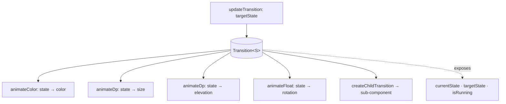
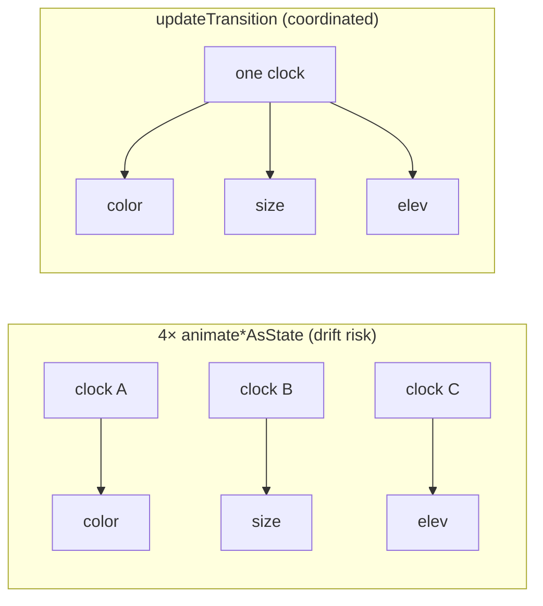

# Lesson 06 — `updateTransition`

> After this lesson you can animate *several* values off **one** state change so they stay perfectly in sync, and explain why this beats juggling many `animate*AsState` calls.

**Module:** 10 · **Lesson:** 06 · **Level:** 🟡🔴 · **Est. time:** 70–90 min

---

## 1. Concept

### 🟢 For beginners — *what is it and why do I care?*

You've seen [`animate*AsState`](01-animate-as-state.md) animate **one** value. But a single UI change often needs **many** values to move together. Selecting a chip might, all at once:

- change its **background color**,
- grow its **corner radius**,
- raise its **elevation**,
- rotate a small **checkmark**.

You *could* write four separate `animate*AsState` calls, all keyed off the same `selected` boolean. It works — but each is its own little animation with its own clock, and there's nothing tying them together as "one transition."

`updateTransition` gives you a **single `Transition` object** that represents "we are moving from state A to state B," and lets you derive **all** those values from it:

```kotlin
val transition = updateTransition(targetState = selected, label = "chip")
val color by transition.animateColor(label = "color") { sel -> if (sel) Blue else Gray }
val radius by transition.animateDp(label = "radius") { sel -> if (sel) 16.dp else 4.dp }
```

One state, one transition, many synced values.

### 🟡 For intermediate devs — *the mechanism*

`updateTransition(targetState)` returns a `Transition<S>` that tracks both `currentState` and `targetState`. You attach child animations to it; each one is a function **from the state to that property's target value**:

```kotlin
val transition = updateTransition(targetState = boxState, label = "box")

val color by transition.animateColor(
    transitionSpec = { tween(300) },         // per-property spec, optional
    label = "color",
) { state -> if (state == BoxState.Expanded) Color.Magenta else Color.Gray }

val size by transition.animateDp(label = "size") { state ->
    if (state == BoxState.Expanded) 200.dp else 100.dp
}
```

Key properties:
- The state can be **any type** — a `Boolean`, an `enum`, a sealed class. `animateColor`/`animateDp`/`animateFloat`/`animateInt`/`animateValue` derive each property from it.
- Each child can have its **own `transitionSpec`** (different durations/easings per property) yet they all **start from the same moment** and are governed by one transition — so they stay coherent and reverse together.
- The `Transition` exposes `currentState`, `targetState`, and `isRunning`, so you can branch logic on where it is.
- It composes: `transition.createChildTransition { … }` derives a sub-transition, and `AnimatedVisibility`/`AnimatedContent` are themselves transitions you can nest.

### 🔴 For senior devs — *trade-offs, edges, internals*

- **One `Transition` = one coordinated timeline.** All children share the same `currentState`/`targetState` and are invalidated together. That's the real difference from N independent `animate*AsState` calls: with separate animations, a rapid A→B→A can leave them at **inconsistent phases** (color mostly back, size still going). A single `Transition` keeps them coherent and reverses them as a unit. Use `updateTransition` whenever several values are *facets of the same state change*.

- **`transitionSpec` can branch on the edge (`initialState isTransitioningTo targetState`).** You can give the A→B direction a different spec than B→A — e.g. snappy open, gentle close. This per-direction control is something parallel `animate*AsState` calls can't express cleanly.

- **`createChildTransition` enables composition of state machines.** A parent transition over a high-level state can spawn child transitions for sub-components, all driven by the same clock. This is how you build a complex multi-part transition (a screen morph where header, list, and FAB all animate from one `ScreenState`) without desync.

- **It's the same engine as `AnimatedVisibility`/`AnimatedContent`.** Those are specialized transitions (`Transition<Boolean>` / `Transition<S>` with content swapping). Reaching for `updateTransition` is right when you need **arbitrary properties** animated off a state, not just enter/exit or content swap. They interoperate: you can nest an `AnimatedVisibility` inside a `Transition` content block via `transition.AnimatedVisibility { … }`.

- **Reads still cost what reads cost.** Each `animateX` returns a `State` you read; the same deferral rules apply — prefer reading the animated values in `graphicsLayer { }`/`offset { }` where possible to keep high-frequency transitions off the composition path (see [Module 11](../module-11-performance/README.md)). The transition coordinates *when* values change; *where* you read them still determines recomposition scope.

- **Spec mismatch is a feel bug, not a correctness bug.** Giving children wildly different durations (color 100 ms, size 800 ms) makes the change feel uncoordinated even though it's technically "one transition." Keep durations in a tight band unless the stagger is intentional.

- **Prefer `updateTransition` over a `MutableTransitionState` + manual flags** for state you already hold. Use `MutableTransitionState` mainly when you need the *initial* appearance to animate or to observe `isIdle`; for ongoing state-driven coordination, `updateTransition(state)` is cleaner.

### Analogy

An **orchestra conductor.** Four `animate*AsState` calls are four musicians each playing to their own metronome — close, but they drift, and if the piece suddenly reverses they won't turn together. `updateTransition` is the **conductor**: one downbeat (the state change) and every section — strings (color), brass (size), percussion (elevation) — moves **together**, each with its own part (`transitionSpec`) but all on the **same beat**. When the conductor signals a reversal, the whole orchestra turns as one.

### Mental model

> **One `Transition` derives many values from one state change.** Each property is `state -> value`; all children share a single timeline, so they start, run, and reverse **together** — coordination you don't get from separate `animate*AsState` calls.

### Real-world example

A **selectable card/chip** that, on select, changes color + corner radius + elevation + shows a check — all in lockstep. A **FAB↔toolbar morph** where shape, color, and icon animate from one `expanded` state. A **multi-step segmented control** where the thumb position, label color, and track tint move together. Material's own selection components coordinate exactly this way.

---

## 2. Visual Learning

**ASCII — one transition fans out to many values:**
```text
                       ┌─ animateColor  ─▶ background:  Gray ──▶ Blue
   selected = true ──▶ │  animateDp     ─▶ corner:      4dp  ──▶ 16dp     ALL on the
   (one state change)  │  animateDp     ─▶ elevation:   1dp  ──▶ 8dp      same timeline
                       └─ animateFloat  ─▶ check rotate: 0°   ──▶ 360°
```

**Mermaid — Transition coordinates children:**


**Mermaid — vs independent animations:**


**Illustration prompt:**
```text
Illustration: a conductor on a podium facing an orchestra, baton raised mid-downbeat. From the
baton, four glowing beams fan out to four labeled sections: "color (strings)", "size (brass)",
"elevation (percussion)", "rotation (woodwinds)", each beam the same length to show they move on
the SAME beat. A faded inset on the side shows four separate musicians each with their own tiny
metronome, slightly out of sync, labeled "4× animate*AsState (drift)". Modern, vibrant, concert
lighting, clear labels, tech-illustration style.
```

---

## 3. Code

### 🟢 Beginner — two values from one state change

```kotlin
@Composable
fun GrowingColorBox(selected: Boolean) {
    // One transition for the `selected` state…
    val transition = updateTransition(targetState = selected, label = "box")

    // …two values derived from it, sharing one timeline.
    val size by transition.animateDp(label = "size") { sel -> if (sel) 160.dp else 80.dp }
    val color by transition.animateColor(label = "color") { sel ->
        if (sel) MaterialTheme.colorScheme.primary else MaterialTheme.colorScheme.surfaceVariant
    }

    Box(
        Modifier
            .size(size)
            .background(color, MaterialTheme.shapes.medium)
    )
}
```

**Explanation.** `updateTransition(selected)` gives one `Transition`. Each `animateDp`/`animateColor` is a function `state -> value`, so when `selected` flips, **both** the size and color animate together on the same timeline — no separate clocks to drift apart.

**Common mistakes.**
```kotlin
// ❌ Reading the outer boolean instead of the lambda's state parameter.
val size by transition.animateDp { _ -> if (selected) 160.dp else 80.dp }   // ignores the param
```
Derive from the lambda's `state` parameter, not the captured outer variable — it's what keeps the value tied to the transition's current/target state (and matters once you nest child transitions).

**Best practices.**
- Put related values under **one** `updateTransition` and derive each from the **state parameter**.
- Give each child a `label` so it shows up in the Animation Inspector.

---

### 🟡 Intermediate — a selectable chip, coordinated

```kotlin
@Composable
fun SelectableTag(label: String, selected: Boolean, onClick: () -> Unit) {
    val transition = updateTransition(targetState = selected, label = "tag")

    val bg by transition.animateColor(label = "bg") { sel ->
        if (sel) MaterialTheme.colorScheme.primary else MaterialTheme.colorScheme.surfaceVariant
    }
    val fg by transition.animateColor(label = "fg") { sel ->
        if (sel) MaterialTheme.colorScheme.onPrimary else MaterialTheme.colorScheme.onSurfaceVariant
    }
    val radius by transition.animateDp(label = "radius") { sel -> if (sel) 16.dp else 8.dp }

    Surface(
        onClick = onClick,
        color = bg,
        contentColor = fg,
        shape = RoundedCornerShape(radius),
    ) {
        Row(
            Modifier.padding(horizontal = 16.dp, vertical = 8.dp),
            verticalAlignment = Alignment.CenterVertically,
        ) {
            // A child transition: the check fades+scales in, governed by the SAME transition.
            transition.AnimatedVisibility(visible = { it }) {
                Icon(Icons.Default.Check, contentDescription = null, Modifier.padding(end = 4.dp))
            }
            Text(label)
        }
    }
}
```

**Explanation.** One `updateTransition(selected)` drives background, foreground, and corner radius together, and even hosts a nested `transition.AnimatedVisibility` for the checkmark — so the icon's entrance is part of the *same* coordinated change, not a separate animation. Toggling `selected` moves all of it in lockstep, and a rapid double-tap reverses everything coherently.

**Common mistakes.**
```kotlin
// ❌ Four independent animate*AsState off the same boolean → no shared timeline; can drift on fast toggles.
val bg by animateColorAsState(if (selected) Blue else Gray)
val fg by animateColorAsState(if (selected) White else Black)
val radius by animateDpAsState(if (selected) 16.dp else 8.dp)
// works, but they're four animations, not one transition
```
For one or two values this is fine; once several facets describe **one** state change, a `Transition` keeps them coherent (and lets you branch specs per direction).

**Best practices.**
- Group facets of a single state change under **one** `updateTransition`.
- Nest `transition.AnimatedVisibility`/`AnimatedContent` to fold enter/exit into the same transition.
- Give every child a `label` for the Animation Inspector.

---

### 🔴 Production — an enum-driven FAB↔sheet morph with per-direction specs

```kotlin
enum class FabState { Collapsed, Expanded }

@Composable
fun ExpandingFab(
    state: FabState,
    onToggle: () -> Unit,
    modifier: Modifier = Modifier,
) {
    val transition = updateTransition(targetState = state, label = "fab")

    // Snappy on open, gentler on close — per-direction spec.
    val corner by transition.animateDp(
        transitionSpec = {
            if (FabState.Collapsed isTransitioningTo FabState.Expanded) {
                spring(stiffness = Spring.StiffnessMedium)        // opening
            } else {
                tween(durationMillis = 280, easing = FastOutSlowInEasing)  // closing
            }
        },
        label = "corner",
    ) { s -> if (s == FabState.Expanded) 20.dp else 28.dp }

    val width by transition.animateDp(label = "width") { s ->
        if (s == FabState.Expanded) 220.dp else 56.dp
    }
    val contentAlpha by transition.animateFloat(label = "labelAlpha") { s ->
        if (s == FabState.Expanded) 1f else 0f
    }

    Surface(
        onClick = onToggle,
        shape = RoundedCornerShape(corner),
        color = MaterialTheme.colorScheme.primaryContainer,
        modifier = modifier
            .height(56.dp)
            .width(width),
    ) {
        Row(
            Modifier.fillMaxSize().padding(horizontal = 16.dp),
            verticalAlignment = Alignment.CenterVertically,
            horizontalArrangement = Arrangement.Center,
        ) {
            Icon(Icons.Default.Edit, contentDescription = if (state == FabState.Expanded) null else "Compose")
            // Read the animated alpha in graphicsLayer (draw phase) → no per-frame recomposition.
            Text(
                "Compose",
                maxLines = 1,
                modifier = Modifier
                    .padding(start = 8.dp)
                    .graphicsLayer { alpha = contentAlpha },
            )
        }
    }
}
```

**Explanation.** A single `Transition<FabState>` coordinates corner radius, width, and label alpha. The `transitionSpec` **branches on direction** with `isTransitioningTo`, so opening springs and closing tweens — distinct feels from one declaration. The label's alpha is read inside `graphicsLayer { }`, keeping the fade in the draw phase. Because it's one transition, interrupting an open mid-flight to close reverses every property together.

**Common mistakes.**
```kotlin
// ❌ Mismatched durations across children → "one transition" that visibly tears.
val width by transition.animateDp(transitionSpec = { tween(800) }) { … }   // size crawls
val corner by transition.animateDp(transitionSpec = { tween(120) }) { … }  // corner snaps
// the shape finishes long before the width — feels uncoordinated
```
A `Transition` makes them *start* together, but wildly different durations still look disjointed. Keep specs in a tight band unless staggering on purpose.

```kotlin
// ❌ Reading the fade in composition → recomposes the FAB every frame of the morph.
Text("Compose", Modifier.alpha(contentAlpha))   // prefer graphicsLayer { alpha = … }
```

**Best practices.**
- Use an **enum/sealed state** for multi-state morphs; derive each property from it.
- Branch `transitionSpec` with **`isTransitioningTo`** for per-direction feel.
- Keep child durations coherent; **defer high-frequency reads** to `graphicsLayer`/`offset`.
- Let one transition own the whole morph so interruptions reverse cleanly.

---

## 4. Interview Questions

**🟢 Beginner**

1. *What does `updateTransition` give you over `animate*AsState`?*
   > A single `Transition` object for a state change, from which you derive **multiple** animated values that all share one timeline — so they start, run, and reverse together. `animate*AsState` animates one value with its own clock.
2. *How do you define an animated property on a `Transition`?*
   > With `transition.animateColor/animateDp/animateFloat/...`, passing a lambda that maps the **state** to that property's target value, e.g. `{ sel -> if (sel) Blue else Gray }`.

**🟡 Intermediate**

3. *Can each property on a `Transition` have a different spec? What's the benefit and risk?*
   > Yes — each child takes its own `transitionSpec`. Benefit: per-property timing/easing while staying coordinated and reversible as a unit. Risk: wildly different durations make the change look uncoordinated even though it's one transition.
4. *How do you give the A→B direction a different animation than B→A?*
   > Inside `transitionSpec`, branch on the edge: `if (StateA isTransitioningTo StateB) springOpen else tweenClose`. This per-direction control isn't cleanly expressible with separate `animate*AsState` calls.

**🔴 Senior**

5. *Why might four independent `animate*AsState` calls drift, while one `updateTransition` won't?*
   > Each `animate*AsState` is its own animation with its own clock. On a rapid A→B→A, they can be left at inconsistent phases (color nearly back, size still moving). One `Transition` shares `currentState`/`targetState` across all children, so they reverse and settle coherently as a unit.
6. *What is `createChildTransition` for?*
   > It derives a sub-transition from a parent transition, driven by the same clock — letting you compose a complex transition (e.g. a screen morph) where sub-components animate off a parent state without desync. It's how you scale coordination beyond a handful of properties.
7. *How does `updateTransition` relate to `AnimatedVisibility` and `AnimatedContent`?*
   > They're specialized transitions on the same engine (`Transition<Boolean>` / content-swapping `Transition<S>`). Use `updateTransition` when you need **arbitrary** properties animated off a state; nest `transition.AnimatedVisibility/AnimatedContent` to fold enter/exit or content swaps into the same coordinated transition.

---

## 5. AI Assistant

**Prompt example (coordinated selectable component):**
```text
Write a Compose (2026 BOM, Material 3) selectable tag that animates background color, content color,
and corner radius off a single `selected: Boolean` using updateTransition (NOT four separate
animate*AsState). Nest transition.AnimatedVisibility for a check icon so it's part of the same
transition. Give each child a label. Then add a FabState enum variant with a per-direction
transitionSpec (spring open, tween close) using isTransitioningTo.
```

**AI workflow — where it helps on *this* topic.**
- ✅ Great for: turning a pile of `animate*AsState` into one `updateTransition`, generating per-property `animateX` blocks, wiring `isTransitioningTo` branches.
- ⚠️ Watch: models default to **separate `animate*AsState`** calls (no shared timeline), give children **mismatched durations**, read animated values in **composition**, and rarely use `createChildTransition` or per-direction specs.

**Review workflow — map to this lesson's *Common Mistakes*:**
- Are facets of **one** state change under **one** `updateTransition` (not N separate animations)?
- Are child **durations coherent** (or intentionally staggered)?
- Are per-direction differences expressed with **`isTransitioningTo`** where needed?
- Are high-frequency reads **deferred** to `graphicsLayer`/`offset`?

**Validation workflow — prove it actually works:**
1. **Compile & run**; toggle the state and confirm all properties move **together**.
2. Toggle **rapidly** (A→B→A): confirm everything **reverses coherently** — no property left at a stale value (this is the payoff over separate animations).
3. In **Animation Inspector**, select the transition and verify each labeled child's curve/timing.
4. **Layout Inspector → recomposition counts**: confirm the morph doesn't recompose every frame (move reads into draw if it does).

> **AI drafts, you decide.** If the model hands you four `animate*AsState` for one selection state, collapse them into a single `updateTransition` so fast toggles can't desync.

---

## Recap / Key takeaways

- **`updateTransition`** turns one state change into **one `Transition`** that drives **many** values on a shared timeline — they start, run, and reverse **together**.
- Each property is `state -> value` via `animateColor/animateDp/animateFloat/...`, each with an optional **per-property `transitionSpec`**.
- Branch specs per direction with **`isTransitioningTo`**; compose complexity with **`createChildTransition`** and nested `AnimatedVisibility/AnimatedContent`.
- Prefer it over multiple `animate*AsState` whenever several values are **facets of the same state change** (avoids drift on fast reversals).
- Reads still follow phase rules — **defer** high-frequency reads to `graphicsLayer`/`offset`.

➡️ Next: **[Lesson 07 — Shared element transitions](07-shared-element-transitions.md)** — making an element fly between two layouts so navigation feels continuous.
