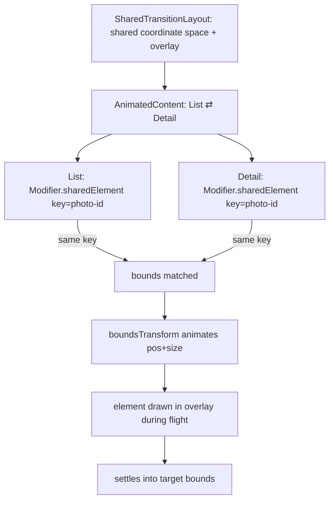
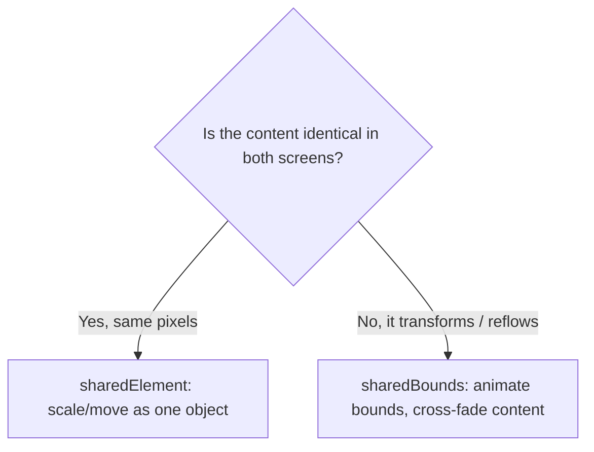

# Lesson 07 — Shared element transitions

> After this lesson you can make an element appear to *fly and morph* from one screen to another — the hallmark of native-feeling navigation — using `SharedTransitionLayout`, `sharedElement`, and matched bounds.

**Module:** 10 · **Lesson:** 07 · **Level:** 🔴 · **Est. time:** 90–110 min

---

## 1. Concept

### 🟢 For beginners — *what is it and why do I care?*

Open a photo grid, tap a thumbnail, and watch a polished app: the little thumbnail doesn't disappear and a new full-screen image fade in. The **same image grows and moves** into its detail position, as if it were one continuous object. That's a **shared element transition**.

The illusion: two screens each have "the same" element (the thumbnail and the big image). When you navigate, Compose animates the element from **where it was** (small, top-left) to **where it's going** (large, centered) — size, position, and shape all interpolating. The user's eye never loses the object, so the navigation feels *connected* instead of a jarring swap.

In Compose you do this by:
1. wrapping both screens in a **`SharedTransitionLayout`**,
2. tagging the element on each screen with the **same key** via `Modifier.sharedElement(...)`,
3. letting an `AnimatedContent`/Navigation transition drive the change.

### 🟡 For intermediate devs — *the mechanism*

The API (stable since Compose's 2024–2025 animation releases) has three parts:

```kotlin
SharedTransitionLayout {                              // 1. a coordinate space for matched elements
    AnimatedContent(targetState = screen) { target ->  // 2. the navigation/content transition
        when (target) {
            Screen.List -> ListScreen(
                animatedVisibilityScope = this@AnimatedContent,
                sharedTransitionScope = this@SharedTransitionLayout,
            )
            Screen.Detail -> DetailScreen(...)
        }
    }
}
```

On the element in **each** screen:

```kotlin
Modifier.sharedElement(
    sharedContentState = rememberSharedContentState(key = "photo-$id"),
    animatedVisibilityScope = animatedVisibilityScope,
)
```

What happens under the hood:
- `SharedTransitionLayout` provides a `SharedTransitionScope` — a shared **coordinate space** and an **overlay** layer where the flying element is drawn during the transition.
- `rememberSharedContentState(key)` registers the element by a **stable key**. When an element with the same key exists in both the outgoing and incoming content, the layout computes both their bounds.
- During the `AnimatedContent` transition, Compose animates the element's **bounds** (position + size) from source to target, drawing it in the overlay so it can cross layout boundaries.
- `sharedElement` is for elements that are conceptually the *same* object in both places; **`sharedBounds`** is the variant for elements that *transform* (different content that should still morph between bounds, e.g. a card becoming a screen background).

You also tune it with `boundsTransform` (the spec for the bounds animation), `OverlayClip`, `enter`/`exit` for the non-shared parts, and `resizeMode` for `sharedBounds`.

### 🔴 For senior devs — *trade-offs, edges, internals*

- **`sharedElement` vs `sharedBounds` is the central design decision.** `sharedElement` assumes the **same content** in both states and cross-fades/scales it as one object — ideal for an image that's literally identical. `sharedBounds` animates the **container bounds** while letting the *content* differ and cross-fade — ideal for a title that reflows, a card expanding into a page, or text changing size/weight. Choosing `sharedElement` for differing content causes ugly stretching; choosing `sharedBounds` for identical content adds needless cross-fade. Match the tool to whether the *pixels* are the same.

- **Keys must be stable and unique across both screens — and not collide.** The match is by `key`. A list of photos needs `key = "photo-$id"` (stable id), never the list index (reorders break the match) and never a shared constant across different items (two elements claiming one key is undefined). Key collisions are the #1 "it jumps to the wrong place" bug.

- **The element is drawn in an overlay during flight, which interacts with clipping and z-order.** Because the shared element is lifted into `SharedTransitionLayout`'s overlay, it can render **above** other content mid-transition. Use `OverlayClip`/`clipInOverlayDuringTransition` to keep it within rounded corners or a bounding shape, and order `Modifier.sharedElement` correctly relative to `clip`/`background` so the *right* visual travels.

- **`boundsTransform` is where jank hides.** The default spring is good, but for large bounds changes you often want a tuned spring (or an arc-based path via a custom `BoundsTransform`) so the element travels a natural curve rather than a straight diagonal. A too-stiff spring on a big size change overshoots; a too-loose one feels laggy. This is a per-transition tuning, and it's where "almost native" becomes "native."

- **Layout reads happen in a lookahead pass.** Shared elements rely on the **lookahead** mechanism (full treatment in [Lesson 08](08-lookaheadscope.md)): the layout is measured at its *target* first so the system knows where the element is going, then animates from current to target. Understanding lookahead explains *why* shared elements can know their destination bounds before the destination is "really" placed.

- **Performance: it's bounds + draw, but content matters.** The transition animates bounds cheaply, but if the shared content is an expensive subtree (a heavy image decode, a complex `Canvas`), that cost is paid in the overlay each frame. Keep the shared content light, pre-decode images at the right size ([Module 11](../module-11-performance/README.md)), and avoid recomposing the subtree during flight.

- **State must survive the navigation.** The two composables are *different* nodes; the shared element is a visual bridge, not shared state. Anything the detail needs (the full image URL, the id) must be passed through type-safe Navigation args or a shared source of truth — the transition doesn't carry data, only appearance.

- **Skipping/interruption.** If the user navigates back mid-transition, the bounds animation reverses. Ensure keys remain consistent on the way back so the element re-matches; a key that depends on transient state can break the return leg.

### Analogy

A **theatre spotlight following one actor between two sets.** The actor (the shared element) doesn't exit stage-left and a body-double appear on the new set. The **spotlight tracks the same actor** as they walk from the old set to the new one, and the scenery rebuilds around them. The actor is briefly **lifted onto a turntable above both sets** (the overlay) so they can cross the boundary cleanly. With `sharedBounds`, it's more like the actor changing **costume** as they walk — same journey, transformed appearance.

### Mental model

> **Tag the *same* element in both screens with the *same stable key* inside a `SharedTransitionLayout`; Compose animates its bounds from source to target through an overlay.** `sharedElement` for identical content, `sharedBounds` for content that transforms.

### Real-world example

A **photo grid → photo detail** (thumbnail flies and grows). A **product list → product page** (the product image and title morph into the header). A **playlist → now-playing** (album art expands to the player). A **contact chip → profile** (avatar and name travel). Google Photos, Play Store, and most polished apps lean on this pattern for continuity.

---

## 2. Visual Learning

**ASCII — the element flies across the boundary:**
```text
   LIST SCREEN                         (transition)                 DETAIL SCREEN
   ┌──────────────────┐                                            ┌──────────────────┐
   │ [img] [img] [img]│      ┌───────┐  ──grows & moves──▶ ┌─────┐ │ ┌──────────────┐ │
   │ [IMG]◀── tapped   │  ──▶ │ IMG   │   (drawn in overlay) │ IMG │ │ │     IMG      │ │
   │ [img] [img] [img]│      └───────┘                      └─────┘ │ │              │ │
   └──────────────────┘     small bounds  ─────────────▶  big bounds│ └──────────────┘ │
                                  same key: "photo-42"               └──────────────────┘
```

**Mermaid — the matching + overlay flow:**


**Mermaid — choosing the variant:**


**Illustration prompt:**
```text
Illustration: a two-stage theatre. On the left set, a grid of framed photos with one highlighted.
A single spotlight beam lifts that one photo onto a glass turntable hovering above both sets
(labeled "overlay"), and a curved motion path carries it to the right set where it lands large and
centered (labeled "detail"). The travelling photo keeps a glowing tag "key = photo-42". A small
side note shows two icons: "sharedElement = same actor" and "sharedBounds = actor changes costume".
Modern, vibrant, theatrical spotlights, motion path with arc, clear labels, tech-illustration style.
```

---

## 3. Code

> Shared-element APIs are marked `@OptIn(ExperimentalSharedTransitionApi::class)` in current BOMs even though the feature is stable in practice — keep the opt-in until your BOM drops it.

### 🟢 Beginner — the three ingredients, minimal

```kotlin
@OptIn(ExperimentalSharedTransitionApi::class)
@Composable
fun MiniSharedDemo() {
    var open by remember { mutableStateOf(false) }

    SharedTransitionLayout {                                   // 1. shared coordinate space
        AnimatedContent(targetState = open, label = "mini") { isOpen ->   // 2. the swap
            if (!isOpen) {
                // Small square in the corner.
                Box(
                    Modifier
                        .size(64.dp)
                        .sharedElement(                        // 3. same key on both states
                            rememberSharedContentState(key = "swatch"),
                            animatedVisibilityScope = this@AnimatedContent,
                        )
                        .background(MaterialTheme.colorScheme.primary)
                        .clickable { open = true }
                )
            } else {
                // The "same" square, now big — it flies/grows between the two.
                Box(
                    Modifier
                        .fillMaxWidth()
                        .height(240.dp)
                        .sharedElement(
                            rememberSharedContentState(key = "swatch"),    // identical key
                            animatedVisibilityScope = this@AnimatedContent,
                        )
                        .background(MaterialTheme.colorScheme.primary)
                        .clickable { open = false }
                )
            }
        }
    }
}
```

**Explanation.** The three ingredients in their simplest form: a `SharedTransitionLayout`, an `AnimatedContent` that swaps small↔big, and the **same key** (`"swatch"`) on the element in both states. Tapping animates the square's bounds from the small corner box to the large one — it appears to be one object growing, not two boxes swapping.

**Common mistakes.**
```kotlin
// ❌ Different keys on the two states → no match, so it just fades/swaps with no fly.
.sharedElement(rememberSharedContentState(key = "small"), …)   // and "big" on the other → never matches
```
The match is **by key**. The key on both states must be **identical** (and stable) or the element won't be recognized as the same object.

**Best practices.**
- Always: one `SharedTransitionLayout` + a content swap + **the same key** on both ends.
- Keep the opt-in annotation until your BOM removes it.

---

### 🟡 Intermediate — a list↔detail image that flies

```kotlin
@OptIn(ExperimentalSharedTransitionApi::class)
@Composable
fun PhotoFlow() {
    var selectedId by remember { mutableStateOf<Int?>(null) }

    SharedTransitionLayout {                                  // shared coordinate space
        AnimatedContent(
            targetState = selectedId,
            label = "photoFlow",
        ) { id ->
            if (id == null) {
                PhotoGrid(
                    onOpen = { selectedId = it },
                    sharedScope = this@SharedTransitionLayout,
                    visibilityScope = this@AnimatedContent,
                )
            } else {
                PhotoDetail(
                    id = id,
                    onBack = { selectedId = null },
                    sharedScope = this@SharedTransitionLayout,
                    visibilityScope = this@AnimatedContent,
                )
            }
        }
    }
}

@OptIn(ExperimentalSharedTransitionApi::class)
@Composable
private fun PhotoGrid(
    onOpen: (Int) -> Unit,
    sharedScope: SharedTransitionScope,
    visibilityScope: AnimatedVisibilityScope,
) = with(sharedScope) {
    LazyVerticalGrid(columns = GridCells.Fixed(3)) {
        items(photoIds, key = { it }) { id ->
            Image(
                painter = painterResource(thumbFor(id)),
                contentDescription = null,
                contentScale = ContentScale.Crop,
                modifier = Modifier
                    .padding(2.dp)
                    .aspectRatio(1f)
                    .sharedElement(
                        rememberSharedContentState(key = "photo-$id"),   // STABLE per-item key
                        animatedVisibilityScope = visibilityScope,
                    )
                    .clickable { onOpen(id) },
            )
        }
    }
}

@OptIn(ExperimentalSharedTransitionApi::class)
@Composable
private fun PhotoDetail(
    id: Int,
    onBack: () -> Unit,
    sharedScope: SharedTransitionScope,
    visibilityScope: AnimatedVisibilityScope,
) = with(sharedScope) {
    Column(Modifier.fillMaxSize()) {
        Image(
            painter = painterResource(fullFor(id)),
            contentDescription = null,
            contentScale = ContentScale.Crop,
            modifier = Modifier
                .fillMaxWidth()
                .aspectRatio(1f)
                .sharedElement(
                    rememberSharedContentState(key = "photo-$id"),       // SAME key as the grid
                    animatedVisibilityScope = visibilityScope,
                ),
        )
        TextButton(onClick = onBack) { Text("Back") }
    }
}
```

**Explanation.** Both the grid thumbnail and the detail image use `key = "photo-$id"` inside one `SharedTransitionLayout`. When `selectedId` flips, `AnimatedContent` swaps screens and the matched element's bounds animate from the small grid cell to the large detail position — drawn in the overlay so it crosses the layout boundary smoothly. The `key { it }` on `items` keeps list identity stable so the right thumbnail matches.

**Common mistakes.**
```kotlin
// ❌ Key by list index → reorders/insertions break the match; the wrong photo flies.
itemsIndexed(photoIds) { index, _ ->
    Modifier.sharedElement(rememberSharedContentState(key = "photo-$index"), …)   // unstable
}
```
The key must be tied to the item's **identity** (its id), not its position. Index-based keys silently mismatch after any list change.

```kotlin
// ❌ Forgetting SharedTransitionLayout → sharedElement has no shared space; nothing flies.
AnimatedContent(targetState = selectedId) { … }   // no SharedTransitionLayout wrapper
```

**Best practices.**
- One `SharedTransitionLayout` around the screens that share elements.
- **Stable, unique keys** tied to item identity, identical on both screens.
- Keep `contentScale` consistent so the image doesn't visually pop as it morphs.

---

### 🔴 Production — type-safe Navigation, `sharedBounds`, tuned `boundsTransform`, overlay clipping

```kotlin
@Serializable data object Feed
@Serializable data class Article(val id: String)

@OptIn(ExperimentalSharedTransitionApi::class)
@Composable
fun AppNav() {
    val nav = rememberNavController()
    SharedTransitionLayout {                                   // wraps the whole NavHost
        NavHost(navController = nav, startDestination = Feed) {
            composable<Feed> {
                FeedScreen(
                    onOpen = { id -> nav.navigate(Article(id)) },
                    sharedScope = this@SharedTransitionLayout,
                    visibilityScope = this,                     // AnimatedVisibilityScope from composable{}
                )
            }
            composable<Article> { backStackEntry ->
                val args = backStackEntry.toRoute<Article>()
                ArticleScreen(
                    id = args.id,
                    sharedScope = this@SharedTransitionLayout,
                    visibilityScope = this,
                )
            }
        }
    }
}

@OptIn(ExperimentalSharedTransitionApi::class)
@Composable
private fun FeedCard(
    id: String,
    title: String,
    onOpen: () -> Unit,
    sharedScope: SharedTransitionScope,
    visibilityScope: AnimatedVisibilityScope,
) = with(sharedScope) {
    val boundsSpec = remember {
        BoundsTransform { _, _ -> spring(dampingRatio = 0.9f, stiffness = Spring.StiffnessMediumLow) }
    }
    Card(
        onClick = onOpen,
        modifier = Modifier
            // The whole CARD morphs into the article header → sharedBounds (content differs).
            .sharedBounds(
                rememberSharedContentState(key = "article-$id"),
                animatedVisibilityScope = visibilityScope,
                boundsTransform = boundsSpec,
                resizeMode = SharedTransitionScope.ResizeMode.ScaleToBounds(),
                clipInOverlayDuringTransition = OverlayClip(MaterialTheme.shapes.large),
            ),
    ) {
        Column(Modifier.padding(16.dp)) {
            Text(
                title,
                style = MaterialTheme.typography.titleMedium,
                modifier = Modifier.sharedElement(            // the TITLE is identical → sharedElement
                    rememberSharedContentState(key = "title-$id"),
                    animatedVisibilityScope = visibilityScope,
                ),
            )
            Text("Tap to read", style = MaterialTheme.typography.bodySmall)
        }
    }
}
```

**Explanation.** The card-to-header morph uses **`sharedBounds`** because the *content* differs (a small card vs. a full header) — it animates the bounds and cross-fades content, with `ScaleToBounds` resizing and an `OverlayClip` keeping the rounded corners during flight. The **title**, which is the *same* text in both places, uses **`sharedElement`**. A tuned `BoundsTransform` (a well-damped spring) gives a natural travel curve. Everything rides type-safe Navigation, with the `id` passed as a serialized route arg (the transition carries *appearance*, Navigation carries *data*).

**Common mistakes.**
```kotlin
// ❌ Using sharedElement for content that differs → the small card's pixels stretch into the big header.
Modifier.sharedElement(rememberSharedContentState("article-$id"), …)   // should be sharedBounds here
```
When the two states aren't the same pixels, `sharedElement` stretches one into the other. Use `sharedBounds` so the bounds animate while content cross-fades.

```kotlin
// ❌ No overlay clip → the rounded card renders as a hard rectangle while flying (corners pop).
.sharedBounds(rememberSharedContentState("article-$id"), animatedVisibilityScope = vis)  // missing clip
```

```kotlin
// ❌ Relying on the transition to pass data → DetailScreen has no id/content.
nav.navigate(Article)   // forgot the id; shared element flies but the page is empty
```

**Best practices.**
- **`sharedBounds`** when content transforms; **`sharedElement`** when it's identical — often both in one transition (card bounds + identical title).
- Provide an **`OverlayClip`** matching the shape so corners/clipping survive the flight.
- Tune **`boundsTransform`** (damping/stiffness, or an arc) for large bounds changes.
- Pass real data via **type-safe Navigation args**; the transition is visual only.
- Keep shared content **light** and pre-sized to avoid per-frame cost in the overlay.

---

## 4. Interview Questions

**🟢 Beginner**

1. *What is a shared element transition?*
   > An animation where an element appears to travel and morph from its position on one screen to its position on another — size, position, and shape interpolating — so navigation feels continuous instead of a hard swap.
2. *What three pieces does the Compose API need?*
   > A `SharedTransitionLayout` (shared coordinate space + overlay), a transition that swaps content (`AnimatedContent` or Navigation), and `Modifier.sharedElement(...)` with the **same key** on the element in both screens.

**🟡 Intermediate**

3. *`sharedElement` vs `sharedBounds` — when each?*
   > `sharedElement` for content that's **identical** in both states (the same image/text) — it scales/moves as one object. `sharedBounds` for content that **transforms** (a card expanding into a page, reflowing text) — it animates the bounds and cross-fades differing content.
4. *Why must keys be stable and tied to identity, not list index?*
   > The transition matches elements by key across screens. Index-based keys mismatch after reorders/insertions, so the wrong element flies (or none matches). Use a stable id like `"photo-$id"`, identical on both screens.

**🔴 Senior**

5. *Why is the shared element drawn in an overlay, and what does that imply?*
   > To cross layout boundaries it's lifted into `SharedTransitionLayout`'s overlay, so it can render above other content and travel between containers. Implications: you must manage clipping (`OverlayClip`/`clipInOverlayDuringTransition`) and z-order so corners and stacking look right mid-flight.
6. *How do shared elements relate to the lookahead pass?*
   > They rely on lookahead: the layout is measured at its **target** first, so the system knows the destination bounds, then animates from current to target. That's how the flying element knows where it's going before the destination is finally placed (see Lesson 08).
7. *What are the performance and data caveats of shared transitions?*
   > Bounds animation is cheap, but heavy shared content (large image decodes, complex canvases) is paid each frame in the overlay — keep it light and pre-sized. And the transition carries only *appearance*: the destination must receive its data via Navigation args or a shared source of truth, not via the animation.

---

## 5. AI Assistant

**Prompt example (a navigation shared element):**
```text
Write a Compose (2026 BOM, Material 3) photo grid → detail using SharedTransitionLayout +
AnimatedContent. Tag the thumbnail and the detail image with Modifier.sharedElement and a STABLE
key "photo-$id" (id-based, NOT index). Keep contentScale consistent. Then add a variant where a
feed CARD morphs into an article header using sharedBounds (ScaleToBounds + OverlayClip(shapes.large))
while the identical title uses sharedElement. Tune boundsTransform with a damped spring. Use type-safe
Navigation (@Serializable routes, toRoute) to pass the id.
```

**AI workflow — where it helps on *this* topic.**
- ✅ Great for: scaffolding the `SharedTransitionLayout` + `AnimatedContent`/`NavHost` wiring and the matched `sharedElement` modifiers.
- ⚠️ Watch: models routinely **key by index**, **misuse `sharedElement` for differing content** (should be `sharedBounds`), **omit `OverlayClip`** so corners pop, forget the **opt-in annotation**, and **forget to pass the id** through Navigation (empty detail).

**Review workflow — map to this lesson's *Common Mistakes*:**
- Are keys **id-based, stable, unique**, and **identical on both screens**?
- Is it **`sharedBounds`** where content transforms and **`sharedElement`** only where pixels match?
- Is there an **`OverlayClip`** matching the shape, and a tuned **`boundsTransform`**?
- Does the destination receive its **data via Navigation args**, not the transition?

**Validation workflow — prove it actually works:**
1. **Run on a device**; tap an item and confirm the element **flies and morphs** (not fade+swap), landing exactly on the target bounds.
2. **Reorder/insert** list items, then navigate — confirm the **correct** element still flies (proves id-based keys).
3. Navigate **back mid-flight**; confirm the element reverses and re-matches cleanly.
4. Check rounded shapes during flight — corners should **not** pop (proves `OverlayClip`); tune `boundsTransform` until the travel curve feels natural.
5. **Layout Inspector / profiling** during the transition: confirm the shared subtree isn't re-decoding/recomposing every frame.

> **AI drafts, you decide.** If the model keys by index or stretches a card with `sharedElement`, the transition will look wrong on the second navigation — you switch to id keys and `sharedBounds`.

---

## Recap / Key takeaways

- A shared element transition makes an element **fly and morph** between screens for continuous-feeling navigation.
- Wrap screens in **`SharedTransitionLayout`**, tag the element in both with **`Modifier.sharedElement`/`sharedBounds`** using the **same stable, id-based key**, and drive it with `AnimatedContent`/Navigation.
- **`sharedElement`** = identical content (scale/move as one object); **`sharedBounds`** = transforming content (animate bounds, cross-fade) — often both in one transition.
- The element flies in an **overlay** — manage **`OverlayClip`**/z-order; tune **`boundsTransform`** for natural travel.
- The transition carries **appearance only**; pass data via **type-safe Navigation**. It rides the **lookahead** pass (next lesson).

➡️ Next: **[Lesson 08 — `LookaheadScope`](08-lookaheadscope.md)** — the pass that lets layouts know their *future* size/position, and how to animate layout changes themselves.
