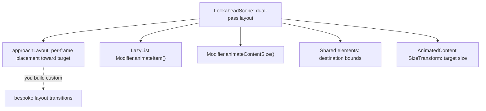
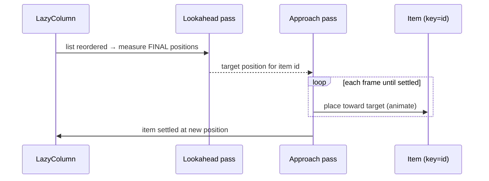

# Lesson 08 — `LookaheadScope`

> After this lesson you can animate *layout changes themselves* — items reflowing, a node moving between containers — by letting Compose measure the **future** layout first, and you'll understand the pass that powers shared elements.

**Module:** 10 · **Lesson:** 08 · **Level:** 🔴 · **Est. time:** 90–120 min

---

## 1. Concept

### 🟢 For beginners — *what is it and why do I care?*

Every animation so far moved a value you controlled — a size you set, an offset you dragged. But some of the nicest motion is the layout **rearranging itself**: chips reflowing when one is removed, a card sliding to a new position when the list reorders, an item smoothly traveling when it moves from a row into a column.

The problem: normally Compose computes the new layout and **places everything there instantly**. There's no "old position to new position" to animate, because by the time you can react, the item is already in its new spot. To animate the *change*, something needs to know **both** where the item is **now** and where it's **about to be** — *before* it actually moves.

`LookaheadScope` is that "something." It runs an extra **lookahead measurement** that figures out the **final** layout ahead of time. Then your content can animate from its current position toward that known target. It's the machinery that lets layout changes glide instead of snap.

You'll rarely call its primitives directly — higher-level tools sit on top:
- `Modifier.animateItem()` in `LazyColumn`/`LazyRow` (item add/remove/move),
- shared elements ([Lesson 07](07-shared-element-transitions.md)),
- `Modifier.animateContentSize()` (a box growing/shrinking).

But understanding `LookaheadScope` is what lets you reason about all of them — and build custom ones.

### 🟡 For intermediate devs — *the mechanism*

Compose's layout is normally a single measure/place pass. Inside a `LookaheadScope`, layout runs **twice**:

```text
1) Lookahead pass  → measure & place at the FINAL (target) state. (Not drawn.)
2) Approach/main pass → measure & place for THIS frame, with access to the lookahead result,
   so a node can animate from its current spot toward the known target.
```

The primitives:
- **`LookaheadScope { … }`** establishes the scope and the dual-pass behavior.
- **`Modifier.approachLayout { … }`** (the modern replacement for the old `intermediateLayout`) lets a node, on each frame, compute its placement *toward* the lookahead target — returning `true`/`false` to say "I'm still approaching" vs "settled, just use lookahead."
- Inside it you can read **`lookaheadSize`** and convert coordinates with **`lookaheadScopeCoordinates` / `localLookaheadPositionOf(...)`** to know the delta between *now* and *target*.

Higher-level APIs wrap this:

```kotlin
LazyColumn {
    items(rows, key = { it.id }) { row ->
        RowItem(row, Modifier.animateItem())   // add/remove fade + move animation, lookahead-powered
    }
}
```

```kotlin
Box(Modifier.animateContentSize()) { /* content whose size changes */ }
```

`animateItem()` (the 2024+ replacement for the older `animateItemPlacement`) animates appearance, disappearance, and **movement** of keyed items. `animateContentSize()` animates a composable's own size change. Both rely on knowing the target via lookahead.

### 🔴 For senior devs — *trade-offs, edges, internals*

- **Lookahead is a *second full layout pass* — it isn't free.** For most screens it's negligible, but nesting many lookahead scopes, or wrapping huge subtrees, doubles measurement work for that region every frame the layout is changing. Scope it to the part that actually needs to animate its layout, not the whole tree. Measure with profiling ([Module 11](../module-11-performance/README.md)) if you suspect layout cost.

- **`approachLayout` replaces `intermediateLayout`; know the contract.** `approachLayout { measurable, constraints -> … }` runs in the **approach** (main) pass with the lookahead result available. Its boolean return — `isLookingAhead`-style completion via the `approachComplete`/lambda — tells Compose whether the node has reached its target. Returning "complete" too early snaps; never returning complete animates forever. Getting this predicate right is the crux of a custom layout animation.

- **Keys are as load-bearing here as in shared elements.** `animateItem()` matches items across recompositions by **key** to know "this is the same item that moved." Unstable/index keys make adds look like moves and vice-versa — items teleport or double-animate. Stable identity keys are mandatory.

- **It explains shared elements and `AnimatedContent` resizing.** Shared elements compute destination bounds in the lookahead pass (that's how the flying element knows where it's going). `AnimatedContent`'s `SizeTransform` likewise measures the target content's size ahead. `LookaheadScope` is the substrate; those are consumers. Understanding it turns those features from magic into mechanism.

- **Coordinate spaces matter.** Animating a node moving *between containers* requires expressing both positions in a **common** coordinate space — `lookaheadScopeCoordinates` and `localLookaheadPositionOf` give you that. Mixing local and lookahead coordinates is a classic source of "it jumps by exactly the parent's offset" bugs.

- **Interaction with deferred reads still applies.** Reading the animated placement should happen in the **layout** phase (you're literally in a layout modifier), and you should avoid triggering recomposition per frame. The whole point is to move nodes via **placement**, not by recomposing them.

- **When to drop to primitives vs. use the wrappers.** Use `animateItem`/`animateContentSize` for the 95% case. Reach for raw `LookaheadScope` + `approachLayout` when you need a *bespoke* layout transition: a custom container where children animate between arbitrary positions, a morphing toolbar that reflows, a "magic move" between two custom layouts that the built-ins don't cover.

### Analogy

A **chess grandmaster thinking one move ahead.** A naïve player moves a piece and *then* sees the new board (snap). The grandmaster first **visualizes the board after the move** (the lookahead pass) and *then* slides the piece smoothly toward that already-known square (the approach pass). Knowing the destination *before* committing the visible move is exactly what lets the motion be continuous instead of a teleport. Shared elements are the same grandmaster moving a piece **to another board** entirely — possible only because they pictured where it lands first.

### Mental model

> **`LookaheadScope` measures the *future* layout first, then animates from *now* toward that known target.** It's the dual-pass substrate beneath `animateItem`, `animateContentSize`, and shared elements; `approachLayout` is where you hook a node's per-frame placement to the lookahead result.

### Real-world example

A **filter chip group** where removing a chip reflows the rest smoothly (`animateItem`). A **reorderable list** where dragging settles items into place. An **expandable text/card** that grows with `animateContentSize`. A **responsive layout** where, on rotation, items animate from grid positions to list positions ("magic move") via a custom `LookaheadScope`. And every **shared-element navigation**, under the hood.

---

## 2. Visual Learning

**ASCII — the dual pass:**
```text
   layout change requested
        │
        ▼
   ┌──────────────────────────┐   measures where everything ENDS UP
   │  (1) LOOKAHEAD pass       │   (final size + position) — not drawn
   └──────────────────────────┘
        │  target known
        ▼
   ┌──────────────────────────┐   each frame: place toward the target
   │  (2) APPROACH/MAIN pass   │   approachLayout decides "still moving?" / "settled"
   └──────────────────────────┘
        │
        ▼   item glides from current → target instead of snapping
```

**Mermaid — substrate and consumers:**


**Mermaid — animateItem move:**


**Illustration prompt:**
```text
Illustration: a chess grandmaster at a board, head-and-shoulders, with a translucent "thought
bubble" board floating above showing the position AFTER the next move (labeled "lookahead pass:
future layout"). On the real board below, a knight glides along a dotted arc toward the square that
matches the thought-bubble (labeled "approach pass: animate toward known target"). To the side, a
second smaller board connected by a bridge shows the same piece moving across boards, labeled
"shared elements use the same foresight". Modern, vibrant, strategic mood, clear labels, tech-illustration style.
```

---

## 3. Code

> `approachLayout`/`LookaheadScope` are stable in current BOMs; some signatures evolved from the older `intermediateLayout`. Verify exact parameter names against your BOM and keep any required opt-ins.

### 🟢 Beginner — animate a size change with one modifier

```kotlin
@Composable
fun ExpandingNote() {
    var expanded by remember { mutableStateOf(false) }

    Surface(
        tonalElevation = 2.dp,
        shape = MaterialTheme.shapes.medium,
        modifier = Modifier
            .clickable { expanded = !expanded }
            .animateContentSize(),          // the box's height glides as its content changes
    ) {
        Column(Modifier.padding(16.dp)) {
            Text("Tap to ${if (expanded) "collapse" else "expand"}")
            if (expanded) {
                Spacer(Modifier.height(8.dp))
                Text("Here is the longer body that appears when expanded, and the card grows smoothly to fit it instead of snapping.")
            }
        }
    }
}
```

**Explanation.** `Modifier.animateContentSize()` is the friendliest door into lookahead: it measures the content's **target** size (the future layout) and animates the box from its current size toward it. Adding the extra text would normally make the card jump taller; here it **glides**. You never compute heights yourself.

**Common mistakes.**
```kotlin
// ❌ Pinning the size before animateContentSize → there's no size change left to animate.
Modifier.height(120.dp).animateContentSize()   // height is fixed; the modifier does nothing
```
`animateContentSize()` animates the size **measured below it** in the chain. If a fixed-size modifier comes first, you've already locked the size.

**Best practices.**
- Reach for `animateContentSize()` for a single composable that grows/shrinks — no manual height math.
- Mind modifier order: it must wrap the content whose size actually changes.

---

### 🟡 Intermediate — reflowing list items & growing content (the wrappers)

```kotlin
// (a) Animate add / remove / move in a lazy list — powered by lookahead.
@Composable
fun ChipList(chips: List<Chip>, onRemove: (String) -> Unit) {
    LazyColumn {
        items(chips, key = { it.id }) { chip ->            // STABLE key → moves are tracked
            AssistChip(
                onClick = { onRemove(chip.id) },
                label = { Text(chip.label) },
                modifier = Modifier
                    .padding(4.dp)
                    .animateItem(                          // fade in/out + smooth move on reorder/remove
                        fadeInSpec = tween(220),
                        fadeOutSpec = tween(160),
                        placementSpec = spring(stiffness = Spring.StiffnessMediumLow),
                    ),
            )
        }
    }
}

// (b) Animate a composable's OWN size change.
@Composable
fun ExpandableBio(text: String) {
    var expanded by remember { mutableStateOf(false) }
    Column(
        Modifier
            .clickable { expanded = !expanded }
            .animateContentSize(),                          // height glides as text expands/collapses
    ) {
        Text(
            text,
            maxLines = if (expanded) Int.MAX_VALUE else 2,
            overflow = TextOverflow.Ellipsis,
        )
    }
}
```

**Explanation.** `animateItem()` uses lookahead to know each keyed item's **final** position, so removing one makes the others **slide** up instead of jumping; adds fade in. `animateContentSize()` measures the content's target size (again via lookahead) and animates the box's size toward it. You write no manual offsets — the dual pass supplies the target.

**Common mistakes.**
```kotlin
// ❌ Index/unstable key → reorders look like remove+add; items teleport or double-animate.
items(chips) { chip -> AssistChip(..., Modifier.animateItem()) }   // no key
```
`animateItem` needs stable identity keys to recognize a *moved* item versus a new one. Without `key = { it.id }`, motion is wrong.

```kotlin
// ❌ animateContentSize AFTER a fixed-size modifier → there's no size change left to animate.
Modifier.height(120.dp).animateContentSize()   // height is pinned; nothing animates
```
Order matters: `animateContentSize()` animates the size *measured below it*. Pinning the size first defeats it.

**Best practices.**
- Always pass **stable keys** to lazy items you animate.
- Place `animateContentSize()` so it wraps the content whose size actually changes (mind modifier order).
- Tune `placementSpec` to a spring for natural reflow; keep fades short.

---

### 🔴 Production — a custom "magic move" with `LookaheadScope` + `approachLayout`

```kotlin
// A node that smoothly animates to wherever the lookahead pass says it will be —
// even if it moves between different parent layouts.
fun Modifier.animatePlacementInScope(lookaheadScope: LookaheadScope): Modifier =
    composed {
        // Remembered animatables for the current placement offset.
        val offset = remember { Animatable(IntOffset.Zero, IntOffset.VectorConverter) }
        var targetOffset by remember { mutableStateOf<IntOffset?>(null) }
        val scope = rememberCoroutineScope()

        with(lookaheadScope) {
            this@composed.approachLayout(
                isMeasurementApproachInProgress = { false },          // size isn't animating here
                isPlacementApproachInProgress = { lookaheadCoordinates ->
                    // Compare where we ARE to where lookahead says we'll BE.
                    val target = lookaheadScopeCoordinates
                        .localLookaheadPositionOf(lookaheadCoordinates)
                        .round()
                    if (target != targetOffset) {
                        targetOffset = target
                        scope.launch { offset.animateTo(target, spring(stiffness = Spring.StiffnessMediumLow)) }
                    }
                    !offset.isRunning                                  // true while still approaching
                },
            ) { measurable, constraints ->
                val placeable = measurable.measure(constraints)
                layout(placeable.width, placeable.height) {
                    val current = lookaheadScopeCoordinates
                        .localPositionOf(coordinates!!, Offset.Zero)
                        .round()
                    val target = offset.value
                    // Place at an offset that walks from current toward the animated target.
                    val delta = target - current
                    placeable.place(delta.x, delta.y)
                }
            }
        }
    }

@Composable
fun MagicMoveDemo() {
    var rowLayout by remember { mutableStateOf(true) }

    LookaheadScope {                                                  // the dual-pass scope
        val items = @Composable {
            listOf(Color.Red, Color.Green, Color.Blue).forEach { c ->
                Box(
                    Modifier
                        .padding(6.dp)
                        .size(56.dp)
                        .animatePlacementInScope(this@LookaheadScope)  // each item animates to its new slot
                        .background(c, MaterialTheme.shapes.medium)
                )
            }
        }
        Column(Modifier.clickable { rowLayout = !rowLayout }.padding(16.dp)) {
            if (rowLayout) Row { items() } else Column { items() }    // layout topology changes
        }
    }
}
```

**Explanation.** Toggling `rowLayout` changes the *topology* (a `Row` becomes a `Column`), so each box's target position changes. The lookahead pass computes those **final** positions; our `approachLayout` reads the lookahead coordinate, animates an `Animatable<IntOffset>` toward it, and **places** the box at the interpolated delta each frame. The result is a "magic move" — items glide between row and column slots, the kind of bespoke transition the built-ins don't provide. The `isPlacementApproachInProgress` predicate returns `true` while the offset animation is still running and `false` when settled, so Compose knows when to stop approaching.

**Common mistakes.**
```kotlin
// ❌ Returning "approach complete" immediately → no animation; the node snaps to target.
isPlacementApproachInProgress = { false }   // says "always settled" → instant jump
```
The completion predicate must report **in progress** while the value is still animating. Returning settled instantly defeats the whole mechanism.

```kotlin
// ❌ Mixing local and lookahead coordinates → the node jumps by exactly the parent's offset.
val target = lookaheadCoordinates.positionInParent()   // wrong space
```
Cross-container movement must be expressed in the **lookahead scope's** coordinate space via `localLookaheadPositionOf`/`lookaheadScopeCoordinates`. Using a local/parent space mismatches the delta.

```kotlin
// ❌ Wrapping a huge subtree in LookaheadScope for one small animation → double layout cost everywhere.
LookaheadScope { EntireScreen() }   // scope it to the animating region instead
```

**Best practices.**
- **Scope `LookaheadScope` tightly** to the region that animates its layout — it costs a second pass.
- Express cross-container positions in the **lookahead coordinate space**; never mix spaces.
- Make the **completion predicate** truthfully reflect "still animating"; drive placement via an `Animatable`.
- Prefer `animateItem`/`animateContentSize`/shared elements first; hand-roll only for bespoke transitions.

---

## 4. Interview Questions

**🟢 Beginner**

1. *What does `LookaheadScope` let you do that normal layout can't?*
   > It measures the **final** layout ahead of time (a lookahead pass), so content can animate from its current position toward that known target — letting layout *changes* (reflow, movement, resize) animate instead of snapping.
2. *Name two higher-level APIs built on lookahead.*
   > `Modifier.animateItem()` for lazy-list add/remove/move, and `Modifier.animateContentSize()` for a composable's own size change. Shared elements also use it.

**🟡 Intermediate**

3. *Describe the two passes inside a `LookaheadScope`.*
   > (1) The **lookahead** pass measures and places everything at its target/final state (not drawn). (2) The **approach/main** pass measures for the current frame with access to the lookahead result, so a node can place itself toward the known target — producing the animation.
4. *Why does `animateItem()` require stable keys?*
   > It matches items across recompositions by key to recognize a **moved** item versus a new/removed one. Unstable or index keys make moves look like add+remove, so items teleport or double-animate.

**🔴 Senior**

5. *What is `approachLayout` and what is its completion predicate for?*
   > `approachLayout` runs in the approach pass with the lookahead result available, letting a node compute its per-frame placement toward the target. Its in-progress predicate tells Compose whether the node is **still approaching** (keep animating) or **settled** (use the lookahead placement). Reporting settled too early snaps; never reporting settled animates forever.
6. *How do `LookaheadScope` and shared element transitions relate?*
   > Shared elements compute their **destination bounds** in the lookahead pass — that's how the flying element knows where it's going before the destination is finally placed. `LookaheadScope` is the substrate; shared elements (and `AnimatedContent`'s `SizeTransform`) are consumers.
7. *What are the costs and coordinate-space pitfalls of lookahead?*
   > It's a **second full layout pass** for the scoped region — scope it tightly or you double measurement work. For nodes moving between containers, you must express positions in the **lookahead scope's** coordinate space (`localLookaheadPositionOf`); mixing local/parent spaces causes the node to jump by the parent's offset.

---

## 5. AI Assistant

**Prompt example (custom magic-move):**
```text
Write a Compose (2026 BOM) "magic move" where three boxes animate between a Row and a Column layout
when toggled. Use LookaheadScope + Modifier.approachLayout. Read the target via
lookaheadScopeCoordinates / localLookaheadPositionOf, drive an Animatable<IntOffset> toward it, and
place each box at the interpolated delta. The placement completion predicate must report in-progress
while the offset animates. Scope LookaheadScope tightly to the items. Also show the simpler
Modifier.animateItem() and animateContentSize() wrappers for comparison.
```

**AI workflow — where it helps on *this* topic.**
- ✅ Great for: the `animateItem`/`animateContentSize` wrappers, and the *shape* of an `approachLayout` block.
- ⚠️ Watch: models often get the **completion predicate wrong** (snap or infinite), **mix coordinate spaces**, **omit stable keys**, **pin size before `animateContentSize`**, and wrap **too large** a subtree in `LookaheadScope`. The `approachLayout` signature also drifted from the old `intermediateLayout` — verify against the BOM.

**Review workflow — map to this lesson's *Common Mistakes*:**
- Do animated lazy items have **stable keys**? Is `animateContentSize()` wrapping the **size-changing** content (correct modifier order)?
- In custom code: is the **completion predicate** truthful (in-progress while animating)?
- Are cross-container positions in the **lookahead coordinate space**, not a local/parent one?
- Is `LookaheadScope` **scoped tightly** to the animating region?

**Validation workflow — prove it actually works:**
1. **Run**; trigger the layout change and confirm items **glide** to new positions (not snap).
2. **Reorder/insert/remove** lazy items and confirm correct **move vs add/remove** motion (proves stable keys).
3. For custom code, toggle the topology repeatedly — confirm it **settles** each time (predicate correct) and doesn't jump by a fixed offset (coordinate space correct).
4. **Profile layout** ([Module 11](../module-11-performance/README.md)) when the change is occurring; confirm the lookahead double-pass isn't wrapping more of the tree than necessary.

> **AI drafts, you decide.** If the model's `approachLayout` always reports "complete," the move snaps — you fix the predicate to track the running animation, and verify the coordinate space.

---

## Recap / Key takeaways

- **`LookaheadScope`** runs layout **twice** — a lookahead pass measures the **final** layout, then the approach pass animates from current toward that known target — so layout *changes* can animate.
- It's the substrate beneath **`animateItem()`**, **`animateContentSize()`**, and **shared elements** — reach for those wrappers first.
- For bespoke transitions, hook **`Modifier.approachLayout`**: read the target via the **lookahead coordinate space**, drive an `Animatable`, and make the **completion predicate** truthful.
- **Stable keys** are mandatory for `animateItem`; **coordinate spaces** must not be mixed; **scope tightly** because lookahead is a second layout pass.
- This pass is *why* shared elements and `AnimatedContent` resizing know their destinations ahead of time.

🎉 **Module 10 complete.** You can now pick the right animation API for any job — value, visibility, content, gesture, infinite, coordinated, shared-element, or layout — and build motion that feels native without sacrificing performance or accessibility.

➡️ Next module: **[Module 11 — Performance Optimization](../module-11-performance/README.md)** — measure recomposition and frame timing, cut needless work, and prove your wins (including your animations') with Macrobenchmark.
