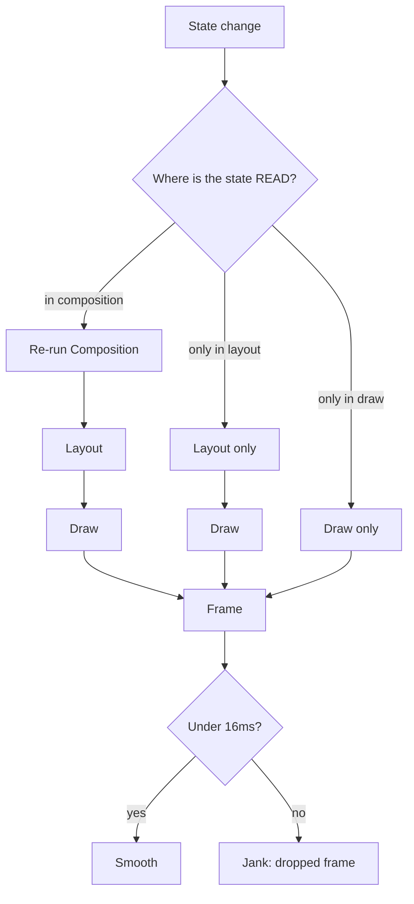

# Lesson 01 — The Cost Model

> After this lesson you can name the three Compose phases, say what each one costs, and reason about *where* a performance problem actually lives before you touch a profiler.

**Module:** 11 · **Lesson:** 01 · **Level:** 🟢🟡🔴 · **Est. time:** 60–75 min

---

## 1. Concept

### 🟢 For beginners — *what is it and why do I care?*

Every frame your app draws goes through **three phases**, in order:

1. **Composition** — Compose runs your `@Composable` functions to figure out *what* to show (which UI elements exist, with what data).
2. **Layout** — for everything that exists, Compose measures how big each thing is and decides *where* it goes.
3. **Drawing** — Compose paints the pixels onto the screen.

Think of it like building a page in a magazine: first you decide *what articles and photos go on the page* (composition), then you *measure and arrange them into columns* (layout), then the printer *puts ink on paper* (drawing).

Why care? Because **a smooth app produces a new frame every ~16 milliseconds** (60 frames per second; on 120 Hz screens you have ~8 ms). All three phases must finish inside that budget. If they don't, the frame is late — the user sees **jank** (a stutter or dropped frame). Knowing which of the three phases is slow tells you *what* to fix. Optimizing the wrong phase is wasted effort.

### 🟡 For intermediate devs — *the mechanism*

The phases are not just a mental model; Compose **runs them as distinct passes** and, crucially, **each phase can run without the ones before it**. That independence is the whole point of the cost model:

- A **state change read in composition** invalidates **composition** → which forces layout → which forces draw. Most expensive: you re-run code.
- A **state change read only in layout** (e.g., an offset computed in a `Modifier.layout {}` or `Modifier.offset { }` lambda) **skips composition** and re-runs only **layout → draw**.
- A **state change read only in draw** (e.g., a color or progress read inside `Modifier.drawBehind {}` or `graphicsLayer {}`) **skips composition and layout** and re-runs only **draw**.

```text
Phase:     Composition  ──▶   Layout   ──▶   Draw
Reads in:  composition       layout         draw
Invalidates:
  comp read →  [ comp ] ──▶ [ layout ] ──▶ [ draw ]   (most work)
  layout read →            [ layout ] ──▶ [ draw ]   (skips comp)
  draw read   →                          [ draw ]    (cheapest)
```

This is why "**defer the read to the latest phase that needs it**" is the single highest-leverage performance technique in Compose — you literally do less work per frame. Lesson 05 is dedicated to it.

A second mechanism: **composition is incremental.** Compose doesn't re-run your whole tree every frame. It re-runs only the **restartable groups** (composable functions and certain lambdas) that read state which changed. The unit of work is the group, not the screen — which is why a 1,000-row list can recompose a single row.

### 🔴 For senior devs — *trade-offs, edges, internals*

The cost model has subtleties that decide whether your "optimization" helps or hurts:

- **Per-frame budget is a hard wall, not an average.** 60 fps = 16.67 ms; 90 fps = 11.1 ms; 120 fps = 8.33 ms. Frame timing is what users *feel*, and it's bimodal — a single 40 ms frame is a visible hitch even if your average is 4 ms. This is why you optimize **the worst frames** (P99 frame time), not the mean. Macrobenchmark (Lesson 09) reports `frameDurationCpuMs` percentiles for exactly this reason.

- **The phases have asymmetric cost profiles.** Composition cost scales with *how much code re-runs* and *allocation pressure* (new lambdas, boxed values, new lists → GC). Layout cost scales with *tree depth and measurement complexity* (intrinsic measurements, nested weights, `SubcomposeLayout`). Draw cost scales with *overdraw and bitmap work*. A screen can be janky for entirely different reasons — diagnosing **which phase** dominates is step one (Lesson 02).

- **Composition is not free even when it "skips."** A skipped composable still costs a parameter comparison. Strong Skipping (default in 2026) lets Compose skip composables even with unstable parameters by comparing them by *instance*, but comparison itself has a cost, and *unstable* parameters force restarts. The cheapest recomposition is the one that never gets scheduled — which is a **stability** problem (Lessons 03, and the full theory in [Module 12](../module-12-internals/README.md)).

- **Two different "slow" symptoms, two different tools.** *Scroll/interaction jank* is usually a **runtime composition or layout** problem — measure with Layout Inspector recomposition counts and system traces. *Slow first launch* is a **JIT/class-loading** problem — fixed with **baseline profiles**, measured with Macrobenchmark startup timing. They are not interchangeable; a baseline profile won't fix a list that recomposes every frame, and stability fixes won't speed up cold start.

- **Main-thread safety underpins all of it.** The three phases run on the **UI thread**. Any blocking work you sneak into the composition path (parsing JSON, decoding a bitmap, a synchronous DB read) stalls *all three phases* regardless of how stable your composables are (Lesson 07).

### Analogy

A **restaurant kitchen plating a dish** under a strict ticket time. **Composition** = the chef decides *which components go on the plate* (this protein, that sauce, these garnishes). **Layout** = arranging them in the right positions and portions. **Drawing** = the final wipe-and-garnish that makes it look right. If tickets back up (you blow the 16 ms), you find *which station* is slow — re-deciding the menu every ticket (composition), re-plating from scratch (layout), or fussing with garnish (draw) — and fix *that* station. Speeding up garnish won't help if the chef re-invents the menu every order.

### Mental model

> **State change → Composition → Layout → Draw.** Push every state read to the *latest* phase that needs it, and do the *least* work in each. The cheapest frame re-runs nothing it doesn't have to.

### Real-world example

A scrolling chat screen with a "scroll to bottom" FAB that fades in. Naive version: the FAB's alpha is derived from scroll position and **read in composition**, so every scroll pixel recomposes the FAB subtree → layout → draw. Optimized version: alpha is read inside `graphicsLayer { this.alpha = … }`, a **draw-phase** read. Scrolling now skips composition and layout for the FAB entirely and only re-runs draw — the difference between a janky list and a buttery one, with identical visual output.

---

## 2. Visual Learning

**ASCII — the three-phase pipeline and where reads invalidate:**
```text
            STATE CHANGES
                 │
                 ▼
   ┌─────────────────────────┐
   │      COMPOSITION        │  "what shows?"   ← read here = most work
   │  run @Composable funcs  │
   └───────────┬─────────────┘
               ▼
   ┌─────────────────────────┐
   │         LAYOUT          │  "how big / where?"  ← read here skips composition
   │   measure + place       │
   └───────────┬─────────────┘
               ▼
   ┌─────────────────────────┐
   │          DRAW           │  "paint pixels"   ← read here skips comp + layout
   │   record draw ops       │
   └───────────┬─────────────┘
               ▼
        FRAME ON SCREEN  (must finish within ~16 ms / ~8 ms @120Hz)
```

**Mermaid — invalidation blast radius by read location:**


**Illustration prompt (paste into an image generator):**
```text
Illustration: a three-station assembly line inside a glass-walled studio, left to right.
Station 1 labeled "COMPOSITION" shows a chef-robot choosing parts from bins (data → UI elements).
Station 2 labeled "LAYOUT" shows a robot arm measuring and placing those parts onto a grid.
Station 3 labeled "DRAW" shows a paint-sprayer applying color to the placed parts.
A glowing conveyor connects them, with a large stopwatch overhead reading "16 ms".
Three colored wires labeled "comp read / layout read / draw read" tap into the line at
different stations, showing that a draw-read only restarts the last station.
Modern, vibrant, clean labels, soft studio lighting, sense of speed.
```

---

## 3. Code

> This lesson is about *seeing* the cost, not fixing it yet — the fixes get their own lessons. Each tier below makes the three phases observable so the model becomes concrete.

### 🟢 Beginner — make the three phases visible

```kotlin
@Composable
fun PhaseDemo() {
    var n by remember { mutableIntStateOf(0) }

    Column(Modifier.padding(16.dp)) {
        // COMPOSITION read: this Text reads n during composition,
        // so changing n re-runs composition → layout → draw for this subtree.
        Text("Value: $n", style = MaterialTheme.typography.headlineSmall)

        Spacer(Modifier.height(12.dp))

        Button(onClick = { n++ }) { Text("Increment") }
    }
}
```

**Explanation.** Reading `n` inside the `Text` makes this a **composition-phase** read. Each tap re-runs the composable (composition), re-measures (layout), and repaints (draw) — the full pipeline. That's correct here because the *text content itself* changes, which genuinely needs composition.

**Common mistakes.**
```kotlin
// ❌ Believing "the whole screen redraws every frame."
// It doesn't — only readers of changed state recompose. But people "fix"
// imaginary problems by caching things that were never the bottleneck.
@Composable
fun Misguided(n: Int) {
    val expensive = remember(n) { (0..n).sum() } // fine, but premature if n is tiny
    Text("$expensive")
}
```
Optimizing before measuring (Lesson 02) is the original sin of performance work. The cost model tells you *what could* be expensive; the profiler tells you *what is*.

**Best practices.**
- Internalize the order: **composition → layout → draw**. Say it out loud.
- A value that changes text/content legitimately needs composition; don't fight that.
- Don't optimize a phase you haven't measured.

---

### 🟡 Intermediate — same value, three different phase costs

```kotlin
@Composable
fun OffsetThreeWays(offset: Float) {
    Box(Modifier.fillMaxWidth().height(120.dp)) {

        // ❗ COMPOSITION read: offset is read in the composition path.
        // Every change re-runs composition for this Box subtree.
        Box(
            Modifier
                .offset(x = offset.dp)            // reads offset during composition
                .size(48.dp)
                .background(Color.Red)
        )

        // ✅ LAYOUT read: the lambda overload reads offset during LAYOUT, not composition.
        // Composition is skipped; only layout + draw re-run.
        Box(
            Modifier
                .offset { IntOffset(offset.dp.roundToPx(), 0) } // lambda → layout-phase read
                .size(48.dp)
                .background(Color.Green)
        )

        // ✅✅ DRAW read: graphicsLayer reads offset during DRAW only.
        // Composition AND layout are skipped; only draw re-runs.
        Box(
            Modifier
                .graphicsLayer { translationX = offset.dp.toPx() } // draw-phase read
                .size(48.dp)
                .background(Color.Blue)
        )
    }
}
```

**Explanation.** All three boxes move identically on screen, but they cost wildly different amounts. The red box pays for all three phases on every change; the green box skips composition; the blue box skips composition *and* layout. When `offset` is driven by an animation (a value changing every frame), this is the difference between smooth and janky. Lesson 05 generalizes this into a technique.

**Common mistakes.**
```kotlin
// ❌ Animating with a composition-phase modifier (state read in composition).
val x by animateDpAsState(if (toggled) 200.dp else 0.dp)
Box(Modifier.offset(x = x))         // re-runs composition every animation frame
// ✅ Defer to layout:
Box(Modifier.offset { IntOffset(x.roundToPx(), 0) })
```

**Best practices.**
- Match the modifier overload to the *latest phase* that can do the job: `offset(x)` (composition) vs `offset { }` (layout) vs `graphicsLayer { }` (draw).
- For frequently-changing values (animations, scroll-driven), prefer **draw-phase** reads.
- Identical visuals can have a 3× phase-cost difference — choose deliberately.

---

### 🔴 Production — measuring the budget you're spending

```kotlin
// A reusable, ZERO-COST-IN-RELEASE recomposition counter for debugging.
// Wrap any composable to log how many times it recomposes during an interaction.
class RecompositionCounter {
    var value = 0
}

@Composable
fun LogRecompositions(tag: String, content: @Composable () -> Unit) {
    if (BuildConfig.DEBUG) {
        val counter = remember { RecompositionCounter() }
        // SideEffect runs after every successful recomposition (Module 06).
        SideEffect {
            counter.value++
            Log.d("Recompose", "$tag recomposed ${counter.value}x")
        }
    }
    content()
}

@Composable
fun PricingRow(item: CartItem, modifier: Modifier = Modifier) {
    LogRecompositions(tag = "PricingRow:${item.id}") {
        Row(modifier.fillMaxWidth(), horizontalArrangement = Arrangement.SpaceBetween) {
            Text(item.name)
            // Derived value is computed, not stored — see Module 03 Lesson 06.
            Text(formatCurrency(item.unitPrice * item.qty))
        }
    }
}
```

**Explanation.** You cannot manage what you cannot see. This helper makes recomposition counts visible during development and **compiles out in release** (the `BuildConfig.DEBUG` guard plus R8 strip the branch). It's a fast first signal — "this row recomposed 60× while I scrolled once" — before you reach for Layout Inspector or a system trace in Lesson 02. The real win is cultural: you start *expecting* a recomposition budget and noticing when you blow it.

**Common mistakes.**
```kotlin
// ❌ Leaving logging / counters in the composition path in release builds.
SideEffect { Log.d("Recompose", "ran") } // unguarded → ships in production, adds work

// ❌ Doing real work (allocation, I/O) inside the measurement helper itself,
//    which changes the very timing you're trying to measure (observer effect).
```

**Best practices.**
- Guard all debug instrumentation behind `BuildConfig.DEBUG` so it never ships.
- Treat the recomposition count of a scroll/interaction as a number you *budget*.
- Use lightweight counters as a triage signal, then confirm with proper tools (Lesson 02) — a log line is a hint, not proof.
- Keep derived values (totals) computed; storing them invites both bugs and extra state writes.

---

## 4. Interview Questions

**🟢 Beginner**

1. *What are the three phases of a Compose frame, in order?*
   > **Composition** (run composables to decide what to show), **Layout** (measure and place), **Draw** (paint pixels). They run in that order, every frame.
2. *What is "jank"?*
   > A dropped or late frame — the three phases didn't finish within the per-frame budget (~16 ms at 60 fps), so the user sees a stutter.

**🟡 Intermediate**

3. *Why does where you read a state value matter for performance?*
   > Because the read location determines the invalidation blast radius. A read in composition re-runs composition → layout → draw. A read only in layout skips composition. A read only in draw skips composition and layout. Deferring the read to a later phase means less work per frame.
4. *You have an animation that moves a box. Why prefer `Modifier.offset { }` or `graphicsLayer` over `Modifier.offset(x)`?*
   > `offset(x)` reads the value during composition, so every animation frame recomposes the subtree. `offset { }` reads during layout (skips composition) and `graphicsLayer { translationX = … }` reads during draw (skips composition and layout) — far cheaper for a value that changes every frame.

**🔴 Senior**

5. *Your average frame time is 5 ms but users report stutter. What's going on and how do you approach it?*
   > Frame timing is bimodal — a few very long frames (high P99) cause visible hitches even with a low mean. You optimize the *worst* frames, not the average. Capture a system trace or Macrobenchmark `frameDurationCpuMs` percentiles, find the slow frames, and identify which phase (composition/layout/draw) or which off-thread stall (decode, I/O) dominates *those* frames specifically.
6. *Cold-start is slow but runtime scrolling is smooth. Would stability fixes or deferred reads help? What would?*
   > No — those target runtime composition/layout cost, not startup. Slow cold start is a JIT/class-loading problem. The fix is a **baseline profile** (AOT-compile the critical startup path), generated and verified with Macrobenchmark startup timing (Lesson 09). Choosing the wrong tool for the symptom is a classic senior-level mistake.

---

## 5. AI Assistant

**Prompt example (locating the costly phase):**
```text
This Compose screen janks while scrolling. Here is the composable and its modifiers:
[paste code]
Targeting Compose 2026 BOM, Kotlin 2.x, Strong Skipping on. For each state read, tell me
which PHASE it invalidates (composition / layout / draw) and whether it can be deferred to a
later phase without changing the visuals. Do NOT add caching or remember() until we've located
the phase. List the reads in a table: [value | current phase | can defer to | how].
```

**AI workflow — where it helps on *this* topic.**
- ✅ Great for: classifying which phase a given modifier/read hits, suggesting the deferred-read equivalent (`offset(x)` → `offset { }` → `graphicsLayer`), and explaining the three-phase model with your code as the example.
- ⚠️ Not for: deciding *whether* there's a real problem. AI can't see your frame timings. It will confidently "optimize" code that was never the bottleneck. Measure first (Lesson 02), then let AI help with the transform.

**Review workflow — check AI output against this lesson's *Common Mistakes*:**
- Did it optimize a phase **without** any profiling evidence? (Reject premature optimization.)
- For animations, did it move reads to layout/draw, or leave them in composition?
- Did any debug instrumentation it added get guarded behind `BuildConfig.DEBUG`?
- Did it preserve identical visuals while changing the phase?

**Validation workflow — prove it actually helped:**
1. **Before:** record recomposition counts (Layout Inspector) and/or a system trace for the interaction.
2. Apply the change.
3. **After:** re-record the same interaction; confirm the phase you targeted does less work (fewer recompositions, shorter layout/draw spans).
4. Confirm the **visuals are unchanged** with a screenshot or preview.
5. Remove any temporary logging before committing.

> **AI drafts, you decide.** The cost model tells you *what to look for*; only your profiler tells you *what's real*. Never ship an "optimization" that has no before/after number.

---

## Recap / Key takeaways

- Every frame runs **Composition → Layout → Draw**, and each phase must fit the per-frame budget (~16 ms / ~8 ms @120 Hz).
- **Where you read state decides the blast radius:** composition-read re-runs all three phases; layout-read skips composition; draw-read skips composition and layout.
- **Defer the read to the latest phase that needs it** — the highest-leverage Compose perf lever (Lesson 05).
- Optimize the **worst frames (P99)**, not the average; jank is bimodal.
- **Match the symptom to the tool:** runtime jank → recomposition/phase work; slow cold start → baseline profiles. They're not interchangeable.
- **Measure before optimizing.** The cost model is a map; the profiler is the territory.

➡️ Next: **[Lesson 02 — Profiling](02-profiling.md)** — Layout Inspector recomposition counts, composition tracing, and system traces, so you stop guessing and start measuring.
