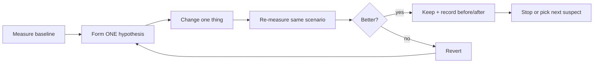

# Lesson 02 — Profiling

> After this lesson you can measure recomposition counts, capture a composition-aware system trace, and read frame timing — so every optimization you make is backed by a *before* and *after* number, not a hunch.

**Module:** 11 · **Lesson:** 02 · **Level:** 🟢🟡🔴 · **Est. time:** 75–90 min

---

## 1. Concept

### 🟢 For beginners — *what is it and why do I care?*

**Profiling means measuring how your app actually behaves while it runs**, instead of guessing. For Compose, the two questions you'll ask most are:

1. **"How many times did this part of the screen recompose?"** — too many recompositions is the #1 Compose performance bug.
2. **"How long did this frame take?"** — if a frame takes longer than ~16 ms, the user sees a stutter.

Android Studio gives you tools that answer both. The most beginner-friendly is the **Layout Inspector**: connect to a running app, and it shows a live tree of your UI with two numbers next to every node — **how many times it recomposed** and **how many times it was skipped**. You interact with the app, watch the counts climb, and instantly see which composable is doing too much work.

Why care? Because **optimization without measurement is superstition.** You might spend an hour "fixing" a composable that was already fine, while the real culprit recomposes 200 times per scroll right next to it. The profiler points you at the real problem.

### 🟡 For intermediate devs — *the mechanism*

You have a layered toolkit; reach for the lightest tool that answers your question.

| Tool | Answers | Cost to set up |
|---|---|---|
| **Recomposition logging** (a `SideEffect` counter) | "does this recompose more than I expect?" | trivial, in-code |
| **Layout Inspector** (recomposition counts) | "which node recomposes/skips, and how often?" | none — built into Studio |
| **Composition tracing** (system trace + `runtime-tracing`) | "which *named composables* ran in this trace, and for how long?" | one dependency |
| **CPU profiler / system trace (Perfetto)** | "what's the app doing across all threads this frame?" | none |
| **Macrobenchmark** (Lesson 09) | "what's my startup/scroll frame timing, repeatably?" | a benchmark module |

**Layout Inspector** is your everyday tool. In the Component Tree, two columns appear per node: **recomposition count** and **skip count**. A node that recomposes a lot while you *aren't* changing its data is a red flag — usually an **unstable parameter** (Lesson 03) or **state read too high** in the tree (Module 03 Lesson 01).

**Composition tracing** upgrades a raw system trace so it shows *your composable function names* on the timeline, not anonymous frames. Add `androidx.compose.runtime:runtime-tracing`, capture a system trace, and you see `LazyColumn`, `PricingRow`, etc., with durations. Requires API 30+ on the test device.

**Frame timing** is the ground truth for "is it smooth." A trace in **Perfetto** shows each frame and flags the slow ones (jank). Macrobenchmark turns this into a repeatable number (`frameDurationCpuMs` percentiles) you can put in CI.

### 🔴 For senior devs — *trade-offs, edges, internals*

- **The observer effect is real.** Layout Inspector and debuggable builds *change* the timing you're measuring — recomposition highlighting, tracing instrumentation, and a non-optimized (debuggable) build all add overhead. Use these tools to find *what* recomposes and *relative* costs. For **absolute frame-timing numbers you trust**, use **Macrobenchmark against a release-like (`profileable`, R8-optimized) build** — never quote ms from a debug build.

- **Recomposition count is a proxy, not the goal.** The goal is frame time. A composable that recomposes 100×/scroll but does almost nothing each time may be fine; one that recomposes 3× but decodes a bitmap each time is not. Use counts to *locate* suspects, then confirm with a trace that those recompositions actually cost frame time. Don't chase a count to zero for its own sake.

- **Debug vs. release behavior diverges in ways that matter.** R8 strips logging, applies Strong Skipping consistently, and AOT-compiles via baseline profiles. A debug build with no baseline profile will show *worse* startup and different skipping than production. Always ask: *am I measuring the build my users run?*

- **Composition tracing has a sampling/overhead trade-off.** It's invaluable for attributing time to named composables, but the instrumentation itself adds cost and only works API 30+. Treat its durations as comparative (A vs B), and corroborate hot paths with the Layout Inspector counts and the CPU profiler's thread view.

- **System traces reveal cross-thread truth that recomposition counts hide.** A frame can be janky with *zero* extra recompositions because the main thread is blocked on a synchronous decode, a binder call, or GC. The Perfetto thread timeline is where you see that — recomposition counts alone would send you chasing a phantom.

- **The disciplined loop is non-negotiable:** *measure → hypothesize → change one thing → re-measure.* Changing several things at once means you can't attribute the win (or regression). Seniors keep a saved "before" trace next to the "after."

### Analogy

A **doctor diagnosing chest pain**. You don't start cutting because a symptom *might* be the heart. You take vitals (recomposition counts — quick, cheap, points you to the right area), then an ECG (composition trace — names the specific signal), then if needed an angiogram (full system trace — sees the whole system). Each test is more invasive/expensive than the last. And you never declare a cure without re-running the test that showed the problem.

### Mental model

> **Measure first, then change exactly one thing, then measure again.** Recomposition counts *locate* the suspect; a trace *convicts* it; Macrobenchmark on a release build gives the *number you quote*.

### Real-world example

A team ships a feed where scrolling feels "heavy." Layout Inspector shows the `AuthorHeader` recomposing on every scroll frame though the author never changes — the smoking gun is an unstable `List<Tag>` parameter. They fix stability (Lesson 03), counts drop to 1, and a Macrobenchmark scroll test confirms P99 `frameDurationCpuMs` fell from 22 ms to 9 ms. *That number* — not "it feels smoother" — is what ships in the PR description.

---

## 2. Visual Learning

**ASCII — the profiling decision tree:**
```text
   "Something feels slow"
            │
            ▼
   Is it STARTUP or RUNTIME?
     │                 │
  STARTUP            RUNTIME
     │                 │
     ▼                 ▼
 Macrobenchmark   Layout Inspector
 startup timing   (recomposition + skip counts)
 + baseline           │
 profile (L09)        ▼
                 Too many recompositions?
                  │              │
                 YES            NO (but still janky)
                  │              │
                  ▼              ▼
            Composition      System trace (Perfetto)
            tracing          → find main-thread stall
            (name the        (decode / I/O / GC / binder)
             culprit)
                  │              │
                  └──────┬───────┘
                         ▼
              Change ONE thing → re-measure
```

**Mermaid — the measure/change/verify loop:**


**Illustration prompt (paste into an image generator):**
```text
Illustration: a developer at a desk wearing a doctor's stethoscope, examining a glowing
phone that displays a UI tree. Next to each branch of the tree float two small counters:
a green "recomposed: 1" and a red "recomposed: 214". On a second monitor, a horizontal
timeline (Perfetto-style) shows frame bars, most short and green, one tall and red labeled
"JANK 24ms". A magnifying glass hovers over the red bar revealing "bitmap decode on main thread".
Caption: "Diagnose before you operate." Modern, vibrant, clean labels, soft studio lighting.
```

---

## 3. Code

> Profiling is mostly *tooling*, but the code you write to make work *observable* matters. These tiers go from in-code counters to trace markers you can attribute on a Perfetto timeline.

### 🟢 Beginner — a recomposition counter you can read in Logcat

```kotlin
@Composable
fun RecompositionLogger(tag: String) {
    if (BuildConfig.DEBUG) {
        val count = remember { intArrayOf(0) }       // survives recomposition, mutable
        SideEffect {                                  // runs after each successful recomposition
            count[0]++
            Log.d("Recompose", "$tag → ${count[0]}")
        }
    }
}

@Composable
fun ProfileHeader(name: String) {
    RecompositionLogger("ProfileHeader")
    Text(name, style = MaterialTheme.typography.titleLarge)
}
```

**Explanation.** `remember { intArrayOf(0) }` gives a tiny mutable holder that survives recomposition. `SideEffect` fires after every successful recomposition, so the log line counts them. Scroll or interact, watch Logcat — if `ProfileHeader` logs on every scroll frame though `name` never changed, you've found a suspect. Guarded by `BuildConfig.DEBUG` so it never ships.

**Common mistakes.**
```kotlin
// ❌ Using a plain var captured in the body — reset to 0 on every recomposition, always logs 1.
@Composable
fun Bad(tag: String) {
    var count = 0
    SideEffect { count++; Log.d("Recompose", "$tag $count") } // always 1
}
// ❌ No DEBUG guard → logging ships to production and adds per-frame work.
```

**Best practices.**
- Hold the counter in `remember` (or a `remember`ed object) so it persists across recompositions.
- Always guard debug instrumentation with `BuildConfig.DEBUG`.
- Treat the count as a *hint* to investigate, not a verdict.

---

### 🟡 Intermediate — naming spans for a composition trace

```kotlin
// Requires: androidx.compose.runtime:runtime-tracing (and a system trace capture).
// Custom trace sections show up on the Perfetto timeline with YOUR labels.

@Composable
fun FeedList(posts: ImmutableList<Post>) {
    LazyColumn {
        items(posts, key = { it.id }) { post ->
            // trace { } marks a named section; attribute its cost on the timeline.
            trace("FeedRow") {
                FeedRow(post)
            }
        }
    }
}

// For non-composable hot paths (e.g., a mapping function), mark them too:
fun List<PostDto>.toUiModels(): List<Post> = trace("toUiModels") {
    map { it.toUi() }
}
```

**Explanation.** Composition tracing automatically labels composable functions, but **explicit `trace("…")` sections** let you bracket exactly the work you care about and find it instantly on a Perfetto timeline. Capture a *system trace* (Android Studio Profiler → System Trace, or `Debug.startMethodTracing`-style), interact, and look for your `FeedRow` / `toUiModels` spans. Wide spans = hot paths. This converts "the list is slow" into "`FeedRow` is 6 ms each because `toUiModels` runs inside composition."

**Common mistakes.**
```kotlin
// ❌ Leaving heavy trace instrumentation in release with no guard — adds overhead.
// ❌ Tracing only the composable but not the data transform it triggers,
//    so the timeline shows "FeedRow is slow" without revealing WHY (the mapping).
// ❌ Measuring a debug build and quoting its span durations as production numbers.
```

**Best practices.**
- Add the `runtime-tracing` dependency; require API 30+ on the trace device.
- Bracket both the composable *and* the work it kicks off, so the timeline tells a story.
- Use trace durations comparatively (before/after), not as absolute production ms.

---

### 🔴 Production — a release-honest measurement harness (Macrobenchmark preview)

```kotlin
// build.gradle.kts (app): make a release-like build measurable.
android {
    buildTypes {
        create("benchmark") {
            initWith(getByName("release"))   // R8 on, like production
            isDebuggable = false
            // profileable so the OS can capture traces without full debuggability:
            // <profileable android:shell="true" /> in the benchmark manifest
            matchingFallbacks += listOf("release")
        }
    }
}
```

```kotlin
// macrobenchmark module: measure SCROLL frame timing on the benchmark build.
@RunWith(AndroidJUnit4::class)
class FeedScrollBenchmark {
    @get:Rule val rule = MacrobenchmarkRule()

    @Test
    fun scrollFeed() = rule.measureRepeated(
        packageName = "com.example.app",
        metrics = listOf(FrameTimingMetric()),         // emits frameDurationCpuMs P50/P90/P99
        iterations = 10,
        compilationMode = CompilationMode.Partial(),    // uses the shipped baseline profile
        startupMode = StartupMode.WARM,
    ) {
        startActivityAndWait()
        val list = device.findObject(By.res("feed_list"))
        list.setGestureMargin(device.displayWidth / 5)
        repeat(3) { list.fling(Direction.DOWN) }        // a deterministic scroll
    }
}
```

**Explanation.** This is the measurement you **quote in a PR**. It runs against a `benchmark` build type that mirrors release (R8 on, not debuggable, `profileable`), so timings reflect what users experience. `FrameTimingMetric` reports `frameDurationCpuMs` percentiles — you compare P99 before vs after a change. `CompilationMode.Partial()` exercises the real baseline profile (Lesson 09). Unlike Layout Inspector, these numbers are **repeatable and CI-able**.

**Common mistakes.**
```kotlin
// ❌ Benchmarking a debuggable build → numbers are slower and unrepresentative.
isDebuggable = true
// ❌ CompilationMode.None() when you actually ship a baseline profile → measures a state
//    no user is in. Use Partial() to reflect production AOT.
// ❌ Non-deterministic interaction (random scroll distances) → noisy, uncomparable runs.
```

**Best practices.**
- Always benchmark a **release-like, non-debuggable, `profileable`** build.
- Make the interaction **deterministic** (fixed flings, `setGestureMargin`) so runs compare.
- Report **percentiles** (P50/P90/P99), and keep the "before" run for the PR.
- Wire the benchmark into CI so regressions fail the build, not the user.

---

## 4. Interview Questions

**🟢 Beginner**

1. *What does the Layout Inspector tell you about Compose performance?*
   > It shows a live UI tree with, per node, the **recomposition count** and the **skip count**. You interact with the app and see which composables recompose too often — the fastest way to locate a recomposition problem.
2. *Why measure before optimizing?*
   > Because the real bottleneck is often not where you'd guess. Without a measurement you can spend effort "fixing" code that was already fine while the real culprit goes untouched. Measurement points you at the actual problem.

**🟡 Intermediate**

3. *A composable recomposes on every scroll frame even though its data didn't change. What are the top two causes and how do you confirm?*
   > Likely an **unstable parameter** (e.g., `List` instead of `ImmutableList`) or **state read too high** in the tree. Confirm with Layout Inspector recomposition counts (high count, zero skips), then a composition trace to see it firing, then inspect the parameters/reads.
4. *What does composition tracing add over a plain system trace?*
   > It labels the timeline with your **composable function names** (and custom `trace("…")` sections) instead of anonymous slices, so you can attribute frame time to specific composables. It needs the `runtime-tracing` dependency and API 30+.

**🔴 Senior**

5. *Why shouldn't you quote frame-time numbers from a debug build?*
   > Debug builds are non-optimized (no R8), have no baseline profile, run with tracing/inspection overhead, and skip differently than release. The numbers are slower and unrepresentative. For trustworthy timing, benchmark a **release-like `profileable` build** with Macrobenchmark.
6. *Recomposition counts look fine but the screen still janks. Where do you look?*
   > A **system trace in Perfetto** at the main-thread timeline. Jank with no extra recompositions usually means the UI thread is blocked on something outside composition — a synchronous bitmap **decode**, a blocking **I/O**/binder call, or **GC** pauses from allocation pressure. Recomposition counts can't see those; the thread view can.

---

## 5. AI Assistant

**Prompt example (planning a measurement, not a fix):**
```text
I think this Compose screen janks on scroll, but I haven't measured yet. Targeting Compose 2026
BOM, Kotlin 2.x. Give me a step-by-step PROFILING plan, lightest tool first: (1) what to add for
recomposition logging, (2) how to read Layout Inspector counts, (3) what runtime-tracing spans to
add and where, (4) a Macrobenchmark FrameTimingMetric scroll test against a release-like build.
For each step say what number I should record. Do NOT propose code changes to the UI yet.
```

**AI workflow — where it helps on *this* topic.**
- ✅ Great for: generating the Macrobenchmark harness and `benchmark` build type, writing `trace("…")` instrumentation, explaining how to read a Perfetto trace, and drafting a measurement checklist.
- ⚠️ Not for: telling you *what's slow* (it can't see your traces) or declaring a fix worked (it has no numbers). It will happily invent an "optimization" with no evidence.

**Review workflow — check AI output against this lesson's *Common Mistakes*:**
- Is debug instrumentation guarded by `BuildConfig.DEBUG`?
- Is the benchmark build **non-debuggable** and `profileable`, with `CompilationMode.Partial()`?
- Is the benchmarked interaction **deterministic**?
- Did it report **percentiles**, not a single average?
- Did it avoid proposing UI fixes *before* a baseline measurement exists?

**Validation workflow — prove the measurement is sound:**
1. Capture a **baseline** (recomposition counts + a Macrobenchmark run) and save it.
2. Make exactly **one** change.
3. Re-run the **same** scenario; compare counts and P99 frame time.
4. Confirm the build under test is **release-like**, not debug.
5. Put the before/after numbers in the PR; revert if no improvement.

> **AI drafts, you decide.** Let AI build the harness; let the harness — not the model — decide whether you got faster.

---

## Recap / Key takeaways

- **Profile, don't guess.** Recomposition counts *locate* suspects; traces *convict* them; Macrobenchmark gives the *number you quote*.
- **Layout Inspector** shows per-node recomposition and skip counts — your everyday Compose tool.
- **Composition tracing** (`runtime-tracing`, API 30+) labels the timeline with your composable/`trace()` names.
- For **trustworthy frame timing**, benchmark a **release-like, non-debuggable, `profileable`** build — never quote debug-build ms.
- Counts are a **proxy** for the real goal (frame time); confirm with a trace, and watch for **main-thread stalls** that counts can't see.
- The loop: **measure → change one thing → measure again**, keeping the "before".

➡️ Next: **[Lesson 03 — Stability & Skipping (applied)](03-stability-skipping.md)** — why a composable restarts, and the quick wins that drop those recomposition counts you just learned to read.
