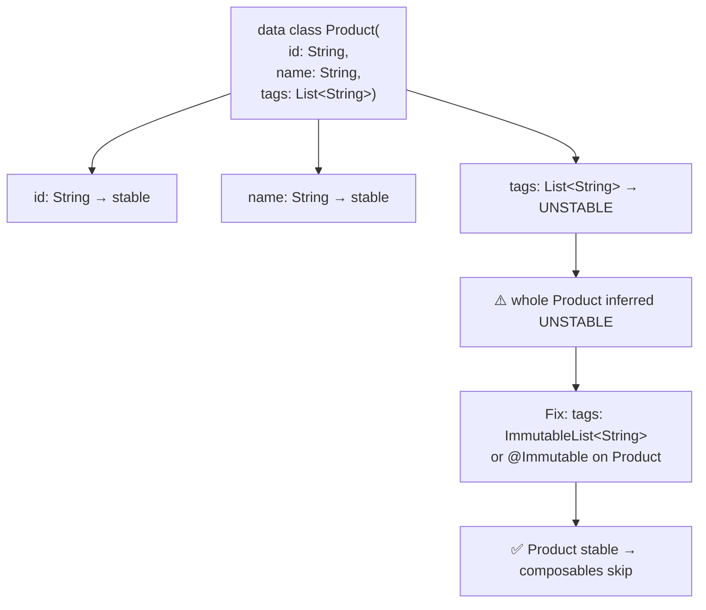

# Lesson 03 — Stability & Skipping (applied)

> After this lesson you can explain why a composable *restarts* instead of *skipping*, recognize the unstable-parameter trap in real code, and apply the four practical fixes that drop recomposition counts — saving the full compiler theory for Module 12.

**Module:** 11 · **Lesson:** 03 · **Level:** 🟢🟡🔴 · **Est. time:** 75–90 min

---

## 1. Concept

### 🟢 For beginners — *what is it and why do I care?*

When state changes, Compose wants to re-run as little as possible. For each composable whose parent recomposed, it asks one question: **"did this composable's inputs change?"**

- If the inputs are **the same as last time**, Compose can **skip** it — don't re-run, reuse last frame's result. Free.
- If the inputs **might have changed**, Compose **restarts** (re-runs) it.

To answer "did the inputs change?", Compose compares each parameter to its previous value. But it can only trust that comparison if the type is **stable** — meaning Compose can rely on its `equals` and trust that the object won't change behind its back.

The problem: some very common types are treated as **unstable**, the most infamous being **`List`**. A `List` parameter makes Compose say "I can't be sure this didn't change, so I'd better re-run to be safe." That composable then recomposes constantly — even when nothing actually changed. Recognizing and fixing this is one of the highest-value performance skills in Compose.

> Note: Modern Compose has **Strong Skipping** on by default (2026), which lets Compose skip even composables with *unstable* parameters by comparing them *by instance*. It rescues many cases — but **not** when you pass a freshly-built unstable object every time. You still need to understand stability.

### 🟡 For intermediate devs — *the mechanism*

A composable is **skippable** when Compose can prove its parameters are unchanged. The decision rests on **type stability**:

- **Stable types** Compose trusts: primitives (`Int`, `Boolean`, `Float`…), `String`, function types, and any type annotated `@Stable`/`@Immutable` (or inferred stable — e.g., a `data class` whose properties are all stable `val`s).
- **Unstable types** Compose can't trust: `List`/`Set`/`Map` interfaces (the runtime type *might* be mutable), `var` properties of otherwise-stable classes, types from modules the compiler can't analyze, and `Any`.

**What Strong Skipping changed (default in 2026):** Compose now compares **unstable** parameters by **instance equality** (`===`) and can skip if the instance is the same as last frame. So if you pass the *same* `List` instance across recompositions, it skips. The trap that survives: passing a **new instance every time** (a fresh `list.filter { … }`, `items + newItem`, or `listOf(a, b)` built inline) — a new instance never `===` the old one, so it always restarts.

The four practical fixes (the meat of this lesson):

1. **Use immutable collection types** — `kotlinx.collections.immutable`'s `ImmutableList`/`PersistentList`. These are marked stable, so Compose compares them structurally and skips properly.
2. **Annotate your models** `@Immutable` (truly unchanging) or `@Stable` (changes only through observable state) when inference can't see it.
3. **Hoist/`remember` constructed objects** so you pass the *same instance* instead of rebuilding one every recomposition.
4. **Don't pass unstable params you don't need** — pass the `id` and the field, not the whole unstable object.

### 🔴 For senior devs — *trade-offs, edges, internals*

- **Strong Skipping is a safety net, not a license to ignore stability.** It rescues "same instance, unstable type." It does *nothing* for "new instance every recomposition." And instance-comparison has a subtle cost and correctness implication: a memoized lambda capturing changing values needs the right keys, and `@Stable`/`@Immutable` are **promises you must keep** — lie to the compiler and you get *stale UI* (skipped when it shouldn't have).

- **`@Immutable` vs `@Stable` is a contract, enforced by you, not the compiler.** `@Immutable`: "no public property ever changes after construction." `@Stable`: "`equals` is consistent, and any property change is signaled via Compose `State`." The compiler *believes* you and skips accordingly. A `@Stable` class with a sneaky `var` mutated outside snapshot state → UI that silently doesn't update. This is the dangerous failure mode: not a crash, but wrong pixels.

- **Inference is positional and module-bounded.** A `data class` is inferred stable only if *all* properties are stable. One `List` field, one `var`, or one field of a type the compiler can't analyze (e.g., a class in a module without the Compose compiler) infects the whole class as unstable. Multi-module apps hit this constantly — a model in a `:core:model` module without Compose compiler config is unstable everywhere it's used. Fixes: annotate the model, enable the compiler's stability config file, or wrap at the UI boundary.

- **Lambdas: stable, but capture matters.** Function types are stable, and Compose memoizes lambdas. But a lambda that captures an unstable value, or `{ vm.onEvent(it) }` recreated with a new captured reference, can still cause restarts. Method references (`vm::onEvent`) and lambdas capturing only stable values are the safe forms.

- **The stability config file** (`stabilityConfigurationFile`) lets you mark third-party or unannotated types (e.g., `java.time.LocalDate`, `kotlinx.collections.immutable.*`) as stable globally without touching their source — the pragmatic escape hatch for code you don't own.

- **Don't over-rotate on stability.** Marking everything `@Immutable` to "fix" recompositions you never measured is cargo-culting. Stability matters where the **Layout Inspector shows high recomposition with zero skips** on a hot path. Measure (Lesson 02), then stabilize the proven offender.

### Analogy

A **customs officer (Compose) deciding whether to re-inspect a shipping container (composable)**. If the container has a **tamper-proof seal** (a stable type), the officer trusts "same seal = same contents" and waves it through (**skip**). If it's an **open crate** (an unstable `List` — anyone could have changed it), the officer must re-inspect every time (**restart**). Strong Skipping is the officer photographing the crate: "if it's the *exact same crate* I saw last time (same instance), I'll wave it through." But if you hand over a **brand-new crate every time** (a fresh `filter` result), the photo never matches — re-inspection forever. The fix is to ship in **sealed containers** (immutable types).

### Mental model

> **Stable + unchanged = skip (free); unstable or new-instance = restart (work).** `List` is unstable; pass `ImmutableList`, annotate your models, and `remember` constructed objects so the instance stays the same.

### Real-world example

A product card takes `tags: List<String>`. The screen rebuilds tags with `product.tags.map { it.uppercase() }` inline on every recomposition. Each scroll frame produces a *new* list instance → the card restarts every frame though the product is identical. Switching the parameter to `ImmutableList<String>` and computing it once (in the ViewModel/`remember`) makes the card **skip** on scroll — recomposition count drops from "every frame" to 1.

---

## 2. Visual Learning

**ASCII — the skip-or-restart decision:**
```text
   Parent recomposed; should the CHILD re-run?
                    │
                    ▼
        Are the child's params "the same"?
                    │
         ┌──────────┴───────────┐
         │                      │
   Type is STABLE?         Type is UNSTABLE
         │                      │
   compare by equals      Strong Skipping:
         │                compare by INSTANCE (===)
   ┌─────┴─────┐                │
 same?       changed?     ┌─────┴──────┐
   │           │        same instance? new instance?
  SKIP       RESTART        │              │
 (free)      (re-run)      SKIP         RESTART
                          (free)        (re-run)  ← the common trap
```

**Mermaid — stability infection in a data class:**


**Illustration prompt (paste into an image generator):**
```text
Illustration: a customs checkpoint conveyor with shipping containers moving through.
Sealed silver containers stamped "STABLE" glide past a relaxed officer who waves them on,
each tagged "SKIP". An open wooden crate labeled "List<>" jams the line; the officer
re-inspects it every pass, stamping "RESTART". To the side, a worker is sealing crates into
silver containers labeled "ImmutableList" so they sail through next time. A small photo board
labeled "Strong Skipping: same crate?" sits at the checkpoint. Modern, vibrant, clear labels.
```

---

## 3. Code

> These tiers walk the exact lifecycle of a stability bug: see it, fix it with immutable types, then make a real model stable in a multi-module app.

### 🟢 Beginner — the unstable `List` that won't skip

```kotlin
// ❌ Smallest reproduction: a new list instance every recomposition.
@Composable
fun TagRow(allTags: List<String>) {
    Row {
        allTags.forEach { tag -> AssistChip(onClick = {}, label = { Text(tag) }) }
    }
}

@Composable
fun ProductScreen(product: Product) {
    Column {
        Text(product.name)
        // Fresh list built inline EVERY recomposition → TagRow restarts every time.
        TagRow(allTags = product.tags.map { it.uppercase() })
    }
}
```

**Explanation.** `product.tags.map { … }` allocates a **new `List` instance** on every recomposition. Because `List` is unstable, Strong Skipping compares by instance — and a new instance is never the same — so `TagRow` restarts on every parent recomposition. Layout Inspector would show `TagRow` recomposing constantly with zero skips.

**Common mistakes.**
```kotlin
// ❌ "Fixing" it by adding remember WITHOUT a key (or the wrong key) → stale tags.
val tags = remember { product.tags.map { it.uppercase() } } // never updates when product changes
```

**Best practices.**
- Don't build collections inline in the composition path on a hot screen.
- If you must derive, key the `remember` on the source: `remember(product.tags) { … }`.
- Suspect the unstable-`List` trap whenever a child recomposes "for no reason."

---

### 🟡 Intermediate — fix with immutable collections + memoized derivation

```kotlin
import kotlinx.collections.immutable.ImmutableList
import kotlinx.collections.immutable.toImmutableList

@Composable
fun TagRow(tags: ImmutableList<String>) {   // stable parameter → skippable
    Row {
        tags.forEach { tag -> AssistChip(onClick = {}, label = { Text(tag) }) }
    }
}

@Composable
fun ProductScreen(product: Product) {
    // Derive ONCE per change of product.tags, not per recomposition,
    // and expose it as a stable ImmutableList.
    val tags = remember(product.tags) {
        product.tags.map { it.uppercase() }.toImmutableList()
    }
    Column {
        Text(product.name)
        TagRow(tags = tags)   // same instance across recompositions → TagRow SKIPS
    }
}
```

**Explanation.** Two fixes combine: (1) the parameter type is now `ImmutableList`, which is **stable**, so Compose compares structurally and can skip; (2) `remember(product.tags)` computes the uppercased list **once per change** of the source, so the *same instance* is passed across recompositions. Result: `TagRow` skips on every scroll frame and only recomposes when the tags genuinely change.

**Common mistakes.**
```kotlin
// ❌ Typing the param as List but passing an ImmutableList — the PARAMETER type is what
//    the compiler checks. Declare the param as ImmutableList.
fun TagRow(tags: List<String>)            // still unstable at the call site
// ❌ toImmutableList() inside the composition path with no remember → new instance each time.
TagRow(product.tags.toImmutableList())    // allocates every recomposition
```

**Best practices.**
- Type **parameters** (not just values) as `ImmutableList`/`PersistentList`.
- Pair immutable types with `remember(key)` so you also pass a stable instance.
- Add `kotlinx.collections.immutable` and use `persistentListOf()` / `toImmutableList()`.

---

### 🔴 Production — a stable model across modules, the honest way

```kotlin
// :core:model — a module WITHOUT the Compose compiler. By default this class is
// inferred UNSTABLE everywhere it's used (the compiler can't analyze it here).
@Immutable                                   // explicit contract: nothing mutates post-construction
data class Product(
    val id: String,
    val name: String,
    val priceCents: Long,
    val tags: ImmutableList<String>,         // stable collection, not List
)
```

```kotlin
// Alternative for types you DON'T own (third-party), without touching their source:
// compose_compiler_config.conf  (referenced via stabilityConfigurationFile in build.gradle)
//
//   kotlinx.collections.immutable.ImmutableList
//   kotlinx.collections.immutable.ImmutableSet
//   java.time.LocalDate
//   com.thirdparty.Money
```

```kotlin
// UI consumes a guaranteed-stable model → cards skip on scroll.
@Composable
fun ProductCard(product: Product, onClick: (String) -> Unit, modifier: Modifier = Modifier) {
    ElevatedCard(onClick = { onClick(product.id) }, modifier = modifier) {
        Column(Modifier.padding(16.dp)) {
            Text(product.name, style = MaterialTheme.typography.titleMedium)
            Text(formatCents(product.priceCents))
            TagRow(product.tags)
        }
    }
}
```

**Explanation.** In multi-module apps, models often live in a pure-Kotlin module the Compose compiler doesn't process, so they're treated as unstable *at every UI call site*. Two production fixes: **annotate the model `@Immutable`** (a contract you keep — no post-construction mutation), and/or list third-party types in a **stability configuration file** so the compiler trusts them globally without you editing their source. `onClick` is a stable function type; passing `product.id` keeps it from capturing the whole object.

**Common mistakes.**
```kotlin
// ❌ Lying to the compiler: @Immutable on a class with a mutable field → STALE UI (skipped wrongly).
@Immutable
data class Cart(var items: MutableList<Item>) // mutated in place; UI silently won't update

// ❌ Annotating everything @Immutable as a blanket "fix" without measuring — cargo-culting,
//    and risks the stale-UI bug above on classes that actually do change.
```

**Best practices.**
- Use `@Immutable` only when the contract is *truly* upheld (no post-construction mutation); otherwise `@Stable` with changes via observable state.
- For unowned types, prefer the **stability config file** over wrapping or lying.
- Stabilize the **proven** offender (Layout Inspector: high recompose, zero skips) — not the whole codebase.
- Keep collections immutable end-to-end; replace, don't mutate (Module 03 Lesson 06).

---

## 4. Interview Questions

**🟢 Beginner**

1. *What's the difference between a composable that "skips" and one that "restarts"?*
   > Skipping means Compose reuses last frame's result because the inputs are unchanged — free. Restarting means it re-runs the composable because the inputs might have changed — work. Maximizing skips is the goal.
2. *Why is a `List` parameter a performance hazard in Compose?*
   > `List` is an interface whose runtime type might be mutable, so Compose treats it as **unstable** and can't trust it didn't change — which can defeat skipping and cause needless recomposition. Use an `ImmutableList` instead.

**🟡 Intermediate**

3. *Strong Skipping is on by default. Does that mean I can stop caring about stability?*
   > No. Strong Skipping rescues *unstable params passed as the same instance* by comparing by instance. It does **not** help when you build a new instance every recomposition (a fresh `filter`/`map`, `list + item`, or inline `listOf(...)`). You still need immutable types and `remember`ed instances.
4. *What makes a `data class` stable, and what's one field that breaks it?*
   > It's inferred stable if **all** properties are stable `val`s (primitives, `String`, other stable types). A single `var`, a `List`/`Map`/`Set` field, or a field whose type the compiler can't analyze makes the whole class unstable.

**🔴 Senior**

5. *What's the danger of annotating a class `@Immutable` to fix recompositions?*
   > `@Immutable`/`@Stable` are contracts the compiler trusts but doesn't verify. If the class actually mutates (e.g., a `var` or in-place list mutation), Compose will **skip when it shouldn't**, producing **stale UI** — a silent correctness bug, not a crash. Only annotate when the immutability contract truly holds.
6. *A model in a shared `:core:model` module is unstable at every UI call site though it looks fine. Why, and what are your options?*
   > That module likely lacks the Compose compiler, so the compiler can't analyze the class and defaults it to unstable wherever it's used. Options: annotate the model `@Immutable`/`@Stable`, add the Compose compiler/stability config to that module, list the type in a **stability configuration file**, or wrap/convert to a stable type at the UI boundary.

---

## 5. AI Assistant

**Prompt example (diagnosing a restart):**
```text
This composable recomposes on every scroll frame though its data doesn't change (confirmed in
Layout Inspector: high recompositions, zero skips). Targeting Compose 2026 BOM, Kotlin 2.x,
Strong Skipping ON. Identify every UNSTABLE parameter and every place a NEW instance is created
in the composition path. Then propose the minimal fix using kotlinx.collections.immutable and
@Immutable/@Stable where appropriate. Explain why Strong Skipping doesn't already rescue it.
[paste composable + the data classes it takes]
```

**AI workflow — where it helps on *this* topic.**
- ✅ Great for: spotting unstable params, suggesting `ImmutableList`/`@Immutable` conversions, finding inline collection-building in the composition path, drafting a stability config file entry.
- ⚠️ Not for: deciding *whether* a type's immutability contract is truly safe to promise (`@Immutable` on a class that mutates is a correctness bug only you can rule out), or deciding it's worth fixing without your Layout Inspector numbers.

**Review workflow — check AI output against this lesson's *Common Mistakes*:**
- Did it change the **parameter type** to `ImmutableList`, not just the value passed?
- Did it `remember(key)` derived collections so the **instance** is stable?
- Did it slap `@Immutable` on anything that actually **mutates** (stale-UI risk)?
- Did it justify the fix against *measured* recomposition counts, not vibes?

**Validation workflow — prove the skip happens:**
1. **Before:** Layout Inspector recomposition + skip counts for the suspect node (expect high recompose, zero skips).
2. Apply the stability fix.
3. **After:** counts should flip to skipping during the interaction (recompose drops to ~1).
4. Verify with the **Compose compiler stability report** (the generated metrics) that the class is now marked stable.
5. Confirm **no stale UI**: change the data for real and ensure it updates.

> **AI drafts, you decide.** A stability annotation is a promise; only you can confirm the code keeps it. Route every suggestion back through the Layout Inspector counts and the "does it still update?" check.

---

## Recap / Key takeaways

- Compose **skips** a composable when its params are **stable and unchanged**; otherwise it **restarts** (work).
- **`List`/`Map`/`Set` are unstable;** a single unstable field infects a whole `data class`.
- **Strong Skipping** (default) compares unstable params by **instance** — it rescues "same instance," not "new instance every recomposition" (the common trap).
- **Four fixes:** immutable collection types, `@Immutable`/`@Stable` models, `remember`ed/hoisted instances, and passing only the fields you need.
- `@Immutable`/`@Stable` are **contracts you must keep** — lying causes **stale UI**, a silent bug.
- **Measure first** (Layout Inspector: high recompose + zero skips), then stabilize the proven offender. Full compiler theory: [Module 12](../module-12-internals/README.md).

➡️ Next: **[Lesson 04 — Lazy List Optimization](04-lazy-list-optimization.md)** — keys, `contentType`, and stable items to keep long scrolling lists skipping instead of re-running.
