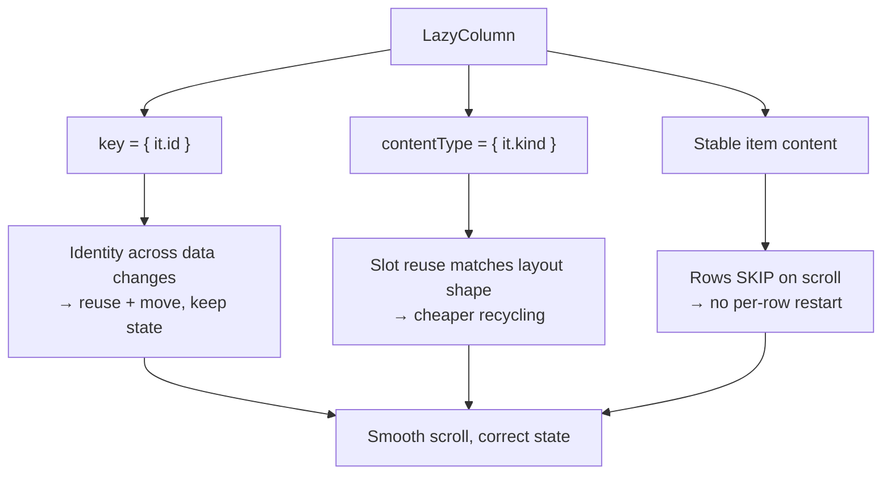

# Lesson 04 — Lazy List Optimization

> After this lesson you can make a `LazyColumn`/`LazyRow` scroll smoothly through thousands of items by giving items stable **keys**, declaring **`contentType`**, keeping item content stable, and avoiding full-list invalidation.

**Module:** 11 · **Lesson:** 04 · **Level:** 🟢🟡🔴 · **Est. time:** 75–90 min

---

## 1. Concept

### 🟢 For beginners — *what is it and why do I care?*

A `LazyColumn` is Compose's efficient scrolling list. "Lazy" means it only composes the items currently **on screen** (plus a small buffer) — not all 10,000 of them. As you scroll, items leaving the top are recycled to build the items entering the bottom.

For this to be smooth, Compose needs help with one question: **"is the item that just appeared the *same* item I had before, or a *different* one?"** By default Compose tracks items by their **position** (index 0, 1, 2…). That's fine until the list *changes* — you insert a row at the top, delete one, or reorder. Now every item shifts position, and Compose thinks *everything* changed, so it re-composes the whole visible list and loses per-item state (like a half-typed text field or a scroll position inside a row).

The fix is a **`key`**: you tell Compose "this item's identity is its `id`, not its position." Now when the list reorders, Compose matches items by identity, moves them, and keeps their state. **Keys are the single most important Lazy-list optimization** and a correctness feature too.

### 🟡 For intermediate devs — *the mechanism*

Three levers, in order of impact:

1. **`key`** — `items(list, key = { it.id })`. Compose uses the key as the item's identity across recompositions and data changes. Without it, an insert at index 0 invalidates every following item; with it, Compose reuses and *moves* existing items and only composes the genuinely new one. Keys also preserve `rememberSaveable` state per item across reorders.

2. **`contentType`** — `items(list, key = { it.id }, contentType = { it.type })`. In a heterogeneous list (headers, ads, posts, footers), this tells Compose which items have the *same structure*. Compose reuses composition slots **only between items of the same `contentType`**, so a "post" slot isn't wastefully reused to build an "ad." Matching content types means cheaper recomposition when recycling.

3. **Stable item content** — everything from Lesson 03 applies *per item*. If your row composable takes an unstable `List` param or you build objects inline, each row restarts on scroll. Stable params + immutable data let off-screen-bound rows skip.

```text
items(list, key = { it.id }, contentType = { it.kind }) { item -> Row(item) }
              └─ identity ──┘        └─ slot-reuse class ─┘     └ keep stable ┘
```

The fourth lever is **avoiding full-list invalidation**: don't read a frequently-changing state at the `LazyColumn` level (it recomposes the whole list builder), and don't replace the entire list instance when one item changes.

### 🔴 For senior devs — *trade-offs, edges, internals*

- **Keys must be stable, unique, and saveable.** Using the **index** as a key is the same as no key. Using a `hashCode()` that changes, or a non-unique key, causes crashes or visual glitches (duplicate keys throw). Keys are persisted to support `rememberSaveable`, so they must be `Bundle`-compatible (primitives, `String`, `Parcelable`) — don't key on a whole non-`Parcelable` object.

- **`contentType` is about slot *reuse*, not correctness.** Mismatched/absent content types don't break anything; they make recycling less effective because Compose can't reuse a slot built for a different layout shape and must compose from scratch more often. In a uniform list it's a no-op; in a mixed feed it's a real win. The default `contentType` is `null`, meaning "all items reuse together," which is suboptimal for heterogeneous lists.

- **The `LazyListScope` block is itself a recomposition scope.** Reading state *inside* `LazyColumn { … }` (e.g., `if (someFrequentlyChangingState) item { … }`) re-runs the **item-provider lambda**, which can be surprisingly costly. Read such state inside the *item content*, or derive a stable structure. A classic bug: reading `listState.firstVisibleItemIndex` at the list scope to conditionally add an item.

- **Don't put a `LazyColumn` inside a vertically-scrolling `Column`** (`verticalScroll`). It forces the lazy list to be measured with infinite height, defeating laziness — every item composes at once. Use a single `LazyColumn` with `item`/`items` blocks (and `stickyHeader`) instead, or `contentPadding`.

- **`itemsIndexed` and unstable lambdas re-introduce instability.** A common regression: `items(list, key = { it.id }) { item -> Row(item) { onClick(item) } }` — the trailing lambda captures `item`, but if `onClick` itself is a new instance each recomposition, rows restart. Hoist event lambdas as method references or remember them.

- **Nested scrollables and `contentPadding` over `Modifier.padding`.** Use `contentPadding` so the first/last items can scroll under system bars while still being fully reachable; outer `padding` clips the scroll area. For sticky headers and section lists, prefer the lazy DSL's `stickyHeader` over hand-rolled logic.

- **Pre-fetching and `beyondBoundsItemCount`.** Compose pre-composes a small buffer beyond the viewport. For heavy items you can tune how aggressively, but the better fix is to make items cheap (stable, deferred reads, async images — Lesson 06) so the default buffer is plenty.

### Analogy

A **valet parking system at a busy hotel**. Without keys, the valet tracks cars **by parking spot** ("the car in spot 3"). The moment someone leaves and everyone shuffles forward, the valet thinks every car is a different car and re-checks them all — chaos, and your custom seat position is lost. With **keys**, every car has a **license plate** (id); the valet matches by plate, just moves the car to a new spot, and your seat stays where you left it. **`contentType`** is the valet keeping **sedans, SUVs, and motorcycles in separate lanes** so the right-sized space is reused. Keys = identity; contentType = right-shaped reuse.

### Mental model

> **Give every item an `id` key so Compose tracks identity, not position; add `contentType` in mixed lists so slot reuse matches shape; keep each row's params stable so off-screen churn skips.**

### Real-world example

A chat screen prepends new messages to the top of a `LazyColumn`. Without keys, every incoming message shifts all indices → the whole visible list recomposes and any in-progress "message reactions" animation resets. With `key = { it.messageId }`, Compose inserts just the new row, keeps everyone else's state and position, and the list stays smooth even under a burst of incoming messages.

---

## 2. Visual Learning

**ASCII — insert-at-top, with and without keys:**
```text
WITHOUT KEY (tracked by index):                 WITH KEY (tracked by id):
  before     insert "X" at 0     after            before    insert "X"    after
  [0]=A        [0]=X  (new!)      ALL shift        A(id=a)     X(id=x)     X  ← only new one composed
  [1]=B        [1]=A  ("changed") → every          B(id=b)     A(id=a)     A  ← reused, moved
  [2]=C        [2]=B  ("changed")   visible row    C(id=c)     B(id=b)     B  ← reused, moved
               [3]=C  ("changed")   recomposes                 C(id=c)     C  ← reused, moved
                                  + state lost                            state kept
```

**Mermaid — the three levers feeding a smooth scroll:**


**Illustration prompt (paste into an image generator):**
```text
Illustration: a valet parking garage shown as a vertical list of cars. Each car has a glowing
license plate labeled "key = id". Three lanes are color-coded and labeled "contentType: sedan /
SUV / motorcycle". A new car is being inserted at the top; an overlay shows the valet matching
plates and simply sliding existing cars down one spot (not re-checking them), with a small badge
"state preserved". A side panel reads "no key = re-check every car". Modern, vibrant, clear labels,
soft lighting, sense of efficient motion.
```

---

## 3. Code

> These tiers go from a broken keyless list, to a correct keyed list, to a production heterogeneous feed with `contentType`, stable rows, and no full-list invalidation.

### 🟢 Beginner — add a key (identity, not position)

```kotlin
@Composable
fun MessageList(messages: ImmutableList<Message>) {
    LazyColumn {
        // ✅ key gives each item a stable identity across inserts/removes/reorders.
        items(messages, key = { it.id }) { message ->
            MessageRow(message)
        }
    }
}
```

**Explanation.** `key = { it.id }` tells Compose the item's identity is its `id`. Now prepending a message inserts only the new row; existing rows are reused, moved, and keep any per-item state. The `messages` parameter is an `ImmutableList` (Lesson 03), so the list builder itself stays stable.

**Common mistakes.**
```kotlin
// ❌ No key → tracked by index; any insert/reorder invalidates all following items + loses state.
items(messages) { MessageRow(it) }

// ❌ Index as key → identical to no key; index isn't identity.
itemsIndexed(messages) { index, m -> key(index) { MessageRow(m) } }
```

**Best practices.**
- Give every `items(...)` a stable, unique `key` (a domain `id`).
- Never use the index as a key.
- Keep the list parameter an `ImmutableList`.

---

### 🟡 Intermediate — `contentType` for a mixed list + stable rows

```kotlin
sealed interface FeedItem {
    val id: String
    data class Header(override val id: String, val title: String) : FeedItem
    data class Article(override val id: String, val post: Post) : FeedItem
    data class Ad(override val id: String, val ad: AdModel) : FeedItem
}

@Composable
fun Feed(items: ImmutableList<FeedItem>, onOpen: (String) -> Unit) {
    LazyColumn(contentPadding = PaddingValues(vertical = 8.dp)) {
        items(
            items = items,
            key = { it.id },
            contentType = { it::class },     // reuse slots only among same-shaped items
        ) { item ->
            when (item) {
                is FeedItem.Header  -> SectionHeader(item.title)
                is FeedItem.Article -> ArticleRow(item.post, onOpen)   // stable params
                is FeedItem.Ad      -> AdRow(item.ad)
            }
        }
    }
}
```

**Explanation.** `contentType = { it::class }` lets Compose reuse a recycled "Article" slot to build another Article (same layout shape) instead of rebuilding from scratch — meaningful in a mixed feed. Each row composable takes **stable** params (a `data class` + a hoisted `onOpen` callback), so rows skip when their data is unchanged. `contentPadding` lets the first/last items scroll under bars without being clipped.

**Common mistakes.**
```kotlin
// ❌ Reading frequently-changing state at the LazyListScope level → re-runs the item provider.
LazyColumn {
    if (listState.firstVisibleItemIndex > 0) item { ScrollHint() } // reads on every scroll px
    items(items, key = { it.id }) { ArticleRow(it.post, onOpen) }
}
// ❌ Passing an unstable List into a row, or a fresh lambda per item:
items(items, key = { it.id }) { ArticleRow(it.tags.toList()) { onOpen(it.id) } } // row restarts
```

**Best practices.**
- Add `contentType` whenever items have **different layouts**.
- Read scroll-derived state inside item *content* or via `derivedStateOf` outside the list builder.
- Keep row params stable; hoist event lambdas (method references) so rows can skip.

---

### 🔴 Production — keyed, typed, state-preserving feed without full-list invalidation

```kotlin
@Composable
fun ArticleFeed(
    state: FeedUiState,                       // single immutable UiState (Module 03 L05)
    onOpen: (String) -> Unit,
    onToggleSave: (String) -> Unit,
    modifier: Modifier = Modifier,
) {
    val listState = rememberLazyListState()

    // Scroll-derived signal computed with derivedStateOf → flips rarely, no full-list reads.
    val showJumpTop by remember {
        derivedStateOf { listState.firstVisibleItemIndex > 10 }
    }

    Box(modifier) {
        LazyColumn(
            state = listState,
            contentPadding = PaddingValues(bottom = 88.dp),
        ) {
            items(
                items = state.items,                 // ImmutableList<FeedItem>
                key = { it.id },                     // identity → reuse/move, keep state
                contentType = { it::class },         // shape-matched slot reuse
            ) { item ->
                when (item) {
                    is FeedItem.Header  -> SectionHeader(item.title)
                    is FeedItem.Article -> ArticleRow(
                        post = item.post,
                        // Stable lambdas: pass id, don't capture the whole item;
                        // remember per-id to keep the same instance across recompositions.
                        onOpen = remember(item.id) { { onOpen(item.id) } },
                        onToggleSave = remember(item.id) { { onToggleSave(item.id) } },
                    )
                    is FeedItem.Ad      -> AdRow(item.ad)
                }
            }
            if (state.isLoadingMore) {
                item(key = "loading", contentType = "loading") { LoadingFooter() }
            }
        }

        AnimatedVisibility(
            visible = showJumpTop,
            modifier = Modifier.align(Alignment.BottomEnd).padding(16.dp),
        ) {
            val scope = rememberCoroutineScope()
            FloatingActionButton(onClick = { scope.launch { listState.animateScrollToItem(0) } }) {
                Icon(Icons.Filled.KeyboardArrowUp, contentDescription = "Jump to top")
            }
        }
    }
}
```

**Explanation.** Everything composes: a **single immutable `FeedUiState`** drives the list (so updating one item replaces only that element, not the list instance if you use a persistent collection); **keys** preserve identity and per-row state across data changes; **`contentType`** matches slot reuse to layout shape; **stable, per-id remembered lambdas** let rows skip; and the "jump to top" signal uses **`derivedStateOf`** so reading scroll position doesn't recompose the whole list builder. The loading footer is its own keyed item, not a flag read at list scope.

**Common mistakes.**
```kotlin
// ❌ Rebuilding the whole list instance on every item change → list builder fully re-runs.
_state.update { it.copy(items = (it.items + changed).toImmutableList()) } // new instance each edit
//    Prefer a persistent collection updated in place: items.set(index, changed) on a PersistentList.

// ❌ New lambda instances per row (no remember) → ArticleRow can't skip on scroll.
onOpen = { onOpen(item.id) }   // fresh instance each recomposition

// ❌ Nesting LazyColumn in Modifier.verticalScroll → infinite height, laziness lost, all items compose.
```

**Best practices.**
- Drive the list from one immutable `UiState`; update items with a **persistent collection** to minimize invalidation.
- `key` + `contentType` on every `items(...)`; keyed `item { }` for footers/headers.
- `remember(id)` event lambdas so rows stay skippable.
- Use `derivedStateOf` for scroll-derived UI; never read hot scroll state at list scope.
- Never nest a lazy list inside a scrolling `Column`.

---

## 4. Interview Questions

**🟢 Beginner**

1. *Why does a `LazyColumn` need a `key`?*
   > By default items are tracked by position (index). When the list changes (insert/remove/reorder), positions shift and Compose thinks every item changed, recomposing them all and losing per-item state. A `key` gives each item a stable identity so Compose can reuse, move, and preserve state.
2. *What's wrong with using the list index as a key?*
   > The index isn't identity — it changes when the list reorders, so it behaves exactly like having no key. Use a stable unique value like a domain `id`.

**🟡 Intermediate**

3. *What does `contentType` do, and when does it matter?*
   > It tells Compose which items share the same layout shape so it can reuse composition slots only among matching types. It matters in **heterogeneous** lists (headers/ads/posts) where reusing a slot built for one layout to build a different one is wasteful. In a uniform list it's a no-op.
4. *Your rows restart on every scroll though the data didn't change. Name two likely causes.*
   > (1) An **unstable parameter** to the row (e.g., a `List`), or (2) a **new lambda instance** per row each recomposition that the row captures. Fix with immutable types and `remember`ed/method-reference callbacks.

**🔴 Senior**

5. *Why must keys be stable, unique, and saveable, and what breaks if they aren't?*
   > Keys are item identity *and* are persisted to restore `rememberSaveable` state, so they must be `Bundle`-compatible (primitives/`String`/`Parcelable`) and unique. Non-unique keys throw (duplicate keys); changing/unstable keys lose state and cause visual glitches; non-saveable keys break state restoration.
6. *How can reading scroll state cause a whole list to recompose, and how do you avoid it?*
   > Reading frequently-changing scroll state (e.g., `firstVisibleItemIndex`) at the **`LazyListScope`** level re-runs the item-provider lambda on every scroll pixel. Avoid it by computing scroll-derived UI with **`derivedStateOf`** outside the list builder (so it only changes when the *result* flips) and reading other state inside item content.

---

## 5. AI Assistant

**Prompt example (auditing a list):**
```text
Audit this LazyColumn for performance and correctness. Targeting Compose 2026 BOM, Kotlin 2.x.
Check for: (1) missing or index-based keys, (2) missing contentType in a heterogeneous list,
(3) unstable row parameters or per-row lambda instances that prevent skipping, (4) frequently-
changing state read at the LazyListScope level, (5) a lazy list nested in a scrolling Column.
For each finding, show the minimal fix and say what it improves. [paste list + row composables + data classes]
```

**AI workflow — where it helps on *this* topic.**
- ✅ Great for: adding correct `key`/`contentType`, spotting index-keys and inline lambdas, converting row params to immutable types, suggesting `derivedStateOf` for scroll signals.
- ⚠️ Not for: choosing your **identity** field (only you know which id is truly unique and stable) or deciding whether `contentType` granularity (`::class` vs a custom enum) matches your real layouts.

**Review workflow — check AI output against this lesson's *Common Mistakes*:**
- Every `items(...)` has a **stable, unique** `key` (not the index)?
- `contentType` present where layouts differ?
- Row params **stable**, event lambdas `remember`ed/method-references?
- No hot scroll state read at **list scope**; `derivedStateOf` used instead?
- No `LazyColumn` inside `verticalScroll`?

**Validation workflow — prove the list is smooth:**
1. **Reorder/insert test:** mutate the data and confirm per-item state (text fields, animations) is preserved — proves keys work.
2. **Layout Inspector:** scroll and confirm rows **skip** (recompose ~once), not restart every frame.
3. **Macrobenchmark** (Lesson 09): a deterministic fling with `FrameTimingMetric`; compare P99 before/after on a release-like build.
4. Confirm no duplicate-key crash and no visual glitches under rapid data changes.

> **AI drafts, you decide.** Let AI wire up keys and `contentType`; you verify the *identity* is real and the rows actually skip in Layout Inspector.

---

## Recap / Key takeaways

- A `LazyColumn` only composes visible items; help it by declaring **identity** and **reuse shape**.
- **`key = { it.id }`** is the top lever: identity over position → reuse/move items and **preserve per-item state**; never key on the index.
- **`contentType`** matches slot reuse to layout shape — a real win in **heterogeneous** lists.
- Keep **row params stable** and **event lambdas remembered** so rows skip on scroll (Lesson 03 applied per item).
- Avoid **full-list invalidation**: don't read hot scroll state at list scope (use `derivedStateOf`), don't rebuild the whole list instance per edit (use a persistent collection), and never nest a lazy list in `verticalScroll`.
- Keys must be **stable, unique, and saveable**.

➡️ Next: **[Lesson 05 — Deferring State Reads](05-deferring-state-reads.md)** — lambda modifiers, `graphicsLayer`, and reading in draw instead of composition to make per-frame values nearly free.
