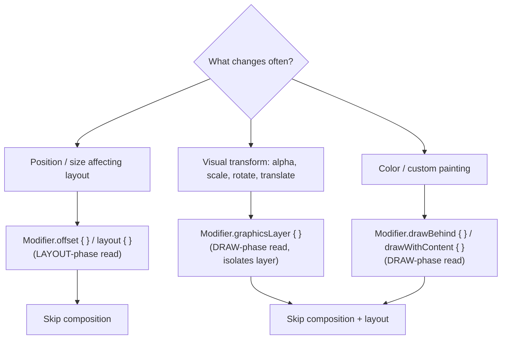

# Lesson 05 — Deferring State Reads

> After this lesson you can move a frequently-changing state read out of composition and into **layout** or **draw** using lambda modifiers and `graphicsLayer`, turning a per-frame recomposition into nearly-free work.

**Module:** 11 · **Lesson:** 05 · **Level:** 🟢🟡🔴 · **Est. time:** 75–90 min

---

## 1. Concept

### 🟢 For beginners — *what is it and why do I care?*

Recall the three phases from Lesson 01: **Composition → Layout → Draw**. The big idea of this lesson:

> **Where you *read* a state value decides how much work a change causes.**

If you read a value during **composition**, changing it re-runs composition *and* layout *and* draw. If you read it only during **draw**, changing it re-runs **just draw**. Same visual result — a fraction of the cost.

This matters most for values that change **a lot**: a scroll offset (changes every pixel), an animation (changes every frame), a drag position (changes constantly). If those are read in composition, you recompose 60+ times a second. If you "defer the read" to draw, scrolling barely costs anything.

The good news: Compose gives you **lambda-based modifiers** that read inside a function which runs *later*. `Modifier.offset { … }` reads in layout; `Modifier.graphicsLayer { … }` reads in draw. The lambda is the trick — Compose remembers the lambda once (composition), then *calls* it each frame in the later phase, so changing the value inside it doesn't touch composition.

### 🟡 For intermediate devs — *the mechanism*

A modifier comes in two flavors:

- **Value (state) form** — `Modifier.offset(x = myOffset.dp)`. The argument is evaluated **during composition**, so reading `myOffset` *there* subscribes the composition scope. Change `myOffset` → recompose.
- **Lambda (deferred) form** — `Modifier.offset { IntOffset(myOffset.roundToPx(), 0) }`. The lambda is captured during composition but **invoked during layout**. Reading `myOffset` happens in the lambda, so the subscription is to the **layout** phase. Change `myOffset` → skip composition, re-run layout + draw only.

The phase ladder for a moving box:

```text
Modifier.offset(x = v.dp)            → reads v in COMPOSITION  (comp + layout + draw)
Modifier.offset { IntOffset(v..) }   → reads v in LAYOUT       (layout + draw)
Modifier.graphicsLayer { translationX = v }  → reads v in DRAW (draw only)
```

The same pattern applies broadly:
- **Position/size that changes often** → `Modifier.offset { }`, `Modifier.layout { }` (layout-phase read).
- **Alpha, scale, rotation, translation, clip, shadow** → `Modifier.graphicsLayer { }` (draw-phase read).
- **Custom painting from changing state** → `Modifier.drawBehind { }` / `drawWithContent { }` (draw-phase read).
- **Background color that changes often** → `Modifier.drawBehind { drawRect(color) }` instead of `Modifier.background(color)` (which reads in composition).

A reliable signal you should defer: you're passing a **scroll offset, animation value, or gesture delta** straight into a value-form modifier.

### 🔴 For senior devs — *trade-offs, edges, internals*

- **`graphicsLayer` is special: it isolates draw into a layer.** Reading a value inside `graphicsLayer { }` not only defers to the draw phase, it also lets Compose re-issue the layer with new properties **without re-recording draw commands** for the content — the GPU re-composites the existing layer with a new alpha/transform. That's why animating `alpha`/`translationX`/`scale` via `graphicsLayer` is dramatically cheaper than via composition-phase modifiers. The trade-off: each layer has memory/compositing cost, so don't wrap thousands of tiny items each in their own layer.

- **The lambda's *capture* is what defers the read — not the modifier name.** `Modifier.offset { IntOffset(state.value, 0) }` defers because `state.value` is read *inside* the lambda. If you compute `val x = state.value` in the composable body and then write `Modifier.offset { IntOffset(x, 0) }`, you've **already read it in composition** — the deferral is lost. The read must physically happen *inside* the deferred lambda.

- **`derivedStateOf` and deferral are complementary, not the same.** `derivedStateOf` reduces *how often* a value changes (noisy input → quiet output); deferral reduces *what phase* a change invalidates. For a "show shadow when scrolled" effect, the best version often uses **both**: `derivedStateOf` to flip a boolean rarely, *and* a draw-phase read so even the flip is cheap. For a continuous parallax, deferral alone (read raw offset in draw) is right.

- **Layout-phase reads still re-measure.** `offset { }` skips composition but re-runs layout for that node and its placement. For pure visual transforms (translate/scale/alpha) prefer **draw-phase** `graphicsLayer` — it skips layout *too*. Use `offset { }` only when the change genuinely affects layout/placement of siblings.

- **Beware accidental composition reads via `remember` keys or `if` branches.** Wrapping deferred logic in `if (state > threshold) { … }` in the composable body reads `state` in composition, defeating the purpose. Keep the *branching* in the lambda or move it behind a `derivedStateOf`d boolean that flips rarely.

- **Lambda modifiers allocate a lambda; that's fine, but don't recreate captured state needlessly.** The lambda instance is cheap and Compose handles it; the cost you avoid (whole-subtree recomposition every frame) dwarfs it. Don't "optimize" by hoisting reads back into composition.

### Analogy

A **theater with a spotlight on a moving actor**. The **composition** is the script and casting — who's on stage and what they say. The **layout** is the blocking — where each actor stands. The **draw** is the lighting. If the actor just walks across the stage (a position that changes every moment), you don't **rewrite the script** every step (composition) — you **move the spotlight** (draw). Reading the actor's position inside the *lighting cue* (`graphicsLayer`) instead of the *script* (composition modifier) means the play doesn't restart every footstep; only the light follows.

### Mental model

> **Read changing values in the latest phase that can use them.** Position → layout lambda (`offset { }`); visual transform/alpha/color → draw (`graphicsLayer`/`drawBehind`). The read must happen *inside* the deferred lambda, or you've already paid for composition.

### Real-world example

A collapsing toolbar that fades and shrinks its title as you scroll. Naive: title `alpha`/`scale` are computed from scroll offset and applied with composition-phase modifiers → every scroll frame recomposes the toolbar subtree. Deferred: `Modifier.graphicsLayer { alpha = …; scaleX = …; scaleY = … }` reads the offset in the **draw** phase → scrolling skips composition *and* layout for the title, and the collapse animates at a fraction of the cost with identical visuals.

---

## 2. Visual Learning

**ASCII — the deferral ladder (same box, three costs):**
```text
  VALUE FORM  (composition read)          read happens in:  COMPOSITION
  Modifier.offset(x = v.dp)               re-runs:  ▣ comp  ▣ layout  ▣ draw

  LAYOUT LAMBDA  (layout read)            read happens in:  LAYOUT
  Modifier.offset { IntOffset(v,0) }      re-runs:  ░ comp  ▣ layout  ▣ draw

  DRAW LAMBDA  (draw read)                read happens in:  DRAW
  Modifier.graphicsLayer{ translationX=v} re-runs:  ░ comp  ░ layout  ▣ draw   ← cheapest

  legend:  ▣ = work   ░ = skipped
```

**Mermaid — choosing the deferral target:**


**Illustration prompt (paste into an image generator):**
```text
Illustration: a theater stage seen from above with an actor walking left to right along a glowing
path. Three control booths are stacked at the back, labeled top to bottom "COMPOSITION (script)",
"LAYOUT (blocking)", "DRAW (lighting)". A spotlight beam from the DRAW booth follows the actor,
with a label "graphicsLayer reads position here". The COMPOSITION and LAYOUT booths are dimmed
with a small "skipped" tag. A caption reads "Move the light, don't rewrite the play."
Modern, vibrant, theatrical lighting, clear labels.
```

---

## 3. Code

> These tiers go from a janky composition-read animation, to a deferred layout/draw read, to a production scroll-driven collapsing header that stays in the draw phase.

### 🟢 Beginner — defer a position read from composition to layout

```kotlin
@Composable
fun SlidingBox(toggled: Boolean) {
    val x by animateDpAsState(targetValue = if (toggled) 240.dp else 0.dp, label = "x")

    // ✅ Deferred: the read of x happens INSIDE the layout lambda, not in composition.
    Box(
        Modifier
            .offset { IntOffset(x.roundToPx(), 0) }   // layout-phase read → skips composition
            .size(64.dp)
            .background(MaterialTheme.colorScheme.primary)
    )
}
```

**Explanation.** `animateDpAsState` changes `x` every frame. By reading `x` *inside* `offset { … }`, the subscription is to the **layout** phase, so each animation frame re-runs layout + draw but **not** composition. Identical motion, far less work.

**Common mistakes.**
```kotlin
// ❌ Value-form modifier reads x in COMPOSITION → recomposes every animation frame.
Box(Modifier.offset(x = x).size(64.dp))

// ❌ "Deferred" in name only: x is read in the body, the lambda just uses a captured Int.
val px = x.roundToPx()                 // ← read happens HERE, in composition
Box(Modifier.offset { IntOffset(px, 0) })
```

**Best practices.**
- The state read must be **physically inside** the lambda to defer it.
- Use `offset { }` for animated/scroll-driven position.
- Confirm the deferral with Layout Inspector (composition count should stay flat while animating).

---

### 🟡 Intermediate — visual transforms in the draw phase with `graphicsLayer`

```kotlin
@Composable
fun PulsingFavorite(progress: () -> Float) {   // progress passed as a lambda, read lazily
    Icon(
        imageVector = Icons.Filled.Favorite,
        contentDescription = "Favorite",
        modifier = Modifier.graphicsLayer {
            // DRAW-phase reads: scale + alpha change without re-recording draw or re-measuring.
            val p = progress()
            scaleX = 1f + 0.2f * p
            scaleY = 1f + 0.2f * p
            alpha = 0.6f + 0.4f * p
        },
    )
}
```

**Explanation.** `graphicsLayer { }` runs in the **draw** phase and isolates the icon into a layer. Reading `progress()` inside it means scale/alpha changes skip composition *and* layout — Compose just re-composites the existing layer with new properties. Passing `progress` as a **lambda** (`() -> Float`) rather than a `Float` value keeps even the *caller* from reading it in composition. This is the cheapest way to animate transforms.

**Common mistakes.**
```kotlin
// ❌ Passing the changing value as a plain Float → caller reads it in composition.
@Composable fun PulsingFavorite(progress: Float) { /* every change recomposes the caller */ }

// ❌ Using composition-phase modifiers for transforms:
Modifier.scale(scale).alpha(alpha)     // both read in composition → recompose every frame

// ❌ Wrapping thousands of list items each in their own graphicsLayer → layer/compositing bloat.
```

**Best practices.**
- Use `graphicsLayer { }` for alpha/scale/rotation/translation that changes frequently.
- Pass frequently-changing values as **lambdas** (`() -> Float`) to defer the read at the call site too.
- Reserve dedicated layers for things that actually animate; don't blanket-wrap static items.

---

### 🔴 Production — a scroll-driven collapsing header that stays in draw

```kotlin
@Composable
fun CollapsingHeader(
    listState: LazyListState,
    title: String,
    modifier: Modifier = Modifier,
) {
    val maxCollapsePx = with(LocalDensity.current) { 160.dp.toPx() }

    // A lambda that computes collapse fraction on demand — NOT read in composition here.
    val collapseFraction: () -> Float = {
        val offset = if (listState.firstVisibleItemIndex == 0)
            listState.firstVisibleItemScrollOffset.toFloat() else maxCollapsePx
        (offset / maxCollapsePx).coerceIn(0f, 1f)
    }

    Box(
        modifier
            .fillMaxWidth()
            .graphicsLayer {                       // DRAW-phase reads for the whole header visual
                val f = collapseFraction()
                alpha = 1f - 0.3f * f
                translationY = -maxCollapsePx * 0.25f * f
            }
            .background(MaterialTheme.colorScheme.surface),
    ) {
        Text(
            text = title,
            style = MaterialTheme.typography.headlineMedium,
            modifier = Modifier
                .padding(16.dp)
                .graphicsLayer {
                    val f = collapseFraction()
                    val scale = 1f - 0.25f * f
                    scaleX = scale; scaleY = scale
                    transformOrigin = TransformOrigin(0f, 1f)  // shrink toward bottom-left
                },
        )
    }
}
```

**Explanation.** Scroll offset changes on every pixel. By packaging the offset read in a `collapseFraction` **lambda** and invoking it only inside `graphicsLayer { }`, **all** the header's scroll-reactive visuals (alpha, translate, scale) are **draw-phase** reads — scrolling skips composition and layout for the header entirely. The header animates continuously at minimal cost, with the exact same look as a composition-based version that would recompose 60×/second.

**Common mistakes.**
```kotlin
// ❌ Reading the offset in composition then feeding modifiers → recomposes the header every scroll px.
val f = (listState.firstVisibleItemScrollOffset / maxCollapsePx).coerceIn(0f, 1f) // composition read!
Box(Modifier.alpha(1f - 0.3f * f).offset(y = (-40 * f).dp))

// ❌ Using derivedStateOf for a CONTINUOUS value (it changes as often as its input → no benefit,
//    and adds overhead). derivedStateOf is for noisy-in/quiet-out booleans, not parallax.
```

**Best practices.**
- For **continuous** scroll/animation visuals, read inside `graphicsLayer`/draw lambdas — not composition, and not `derivedStateOf`.
- Bundle the changing read in a single lambda and call it from each draw block.
- Use `derivedStateOf` only for **discrete** scroll signals (e.g., "show divider when scrolled"), then optionally still apply it in draw.
- Verify with Layout Inspector: composition count for the header stays flat during scroll.

---

## 4. Interview Questions

**🟢 Beginner**

1. *What does "deferring a state read" mean in Compose?*
   > Moving where a value is read from an earlier phase (composition) to a later one (layout or draw), so changing the value re-runs less work. E.g., reading a scroll offset inside `graphicsLayer { }` (draw) instead of a composition-phase modifier.
2. *Which modifier reads its value in the draw phase: `Modifier.offset(x)` or `Modifier.graphicsLayer { translationX = x }`?*
   > `graphicsLayer { }` reads in the draw phase. `offset(x)` (the value form) reads in composition.

**🟡 Intermediate**

3. *Why is animating `alpha` via `graphicsLayer` cheaper than via `Modifier.alpha(value)` driven by composition state?*
   > `graphicsLayer` reads the value in the **draw** phase and isolates the content into a layer, so a change re-composites the existing layer with new alpha without re-running composition or layout. The composition-driven `alpha` re-runs composition (then layout, then draw) on every change.
4. *You wrote `Modifier.offset { IntOffset(x, 0) }` but it still recomposes every frame. Why?*
   > Because `x` is being **read in composition** before the lambda — e.g., `val x = state.value` in the body, or `x` is a value computed from state outside the lambda. The read must happen *inside* the deferred lambda; otherwise you've already subscribed the composition scope.

**🔴 Senior**

5. *When would you use a layout-phase read (`offset { }`) vs a draw-phase read (`graphicsLayer`)?*
   > Use a **layout-phase** read when the change genuinely affects measurement/placement (it shifts siblings, changes size). Use a **draw-phase** read for pure visual transforms (translate/scale/rotate/alpha/clip) that don't affect layout — it skips layout too, so it's cheaper. Prefer `graphicsLayer` for visual-only motion.
6. *How do `derivedStateOf` and deferred reads differ, and when do you combine them?*
   > `derivedStateOf` reduces *how often* a value changes (noisy input → quiet output, recomputes only when the result differs). Deferred reads reduce *which phase* a change invalidates. They're orthogonal: for a **discrete** scroll effect ("show shadow when scrolled past N"), `derivedStateOf` flips a boolean rarely, and you can still apply it in draw. For a **continuous** effect (parallax), skip `derivedStateOf` (it'd change every pixel anyway) and just read raw offset in the draw phase.

---

## 5. AI Assistant

**Prompt example (deferring a hot read):**
```text
This composable reads a scroll offset / animation value in composition and janks. Targeting
Compose 2026 BOM, Kotlin 2.x. Rewrite it so the frequently-changing value is read in the LATEST
phase that preserves the visuals: layout via offset { }/layout { } if it affects placement, or
draw via graphicsLayer/drawBehind for pure visual transforms. Ensure the read happens INSIDE the
deferred lambda (not in the body). Keep the visuals identical. [paste code]
```

**AI workflow — where it helps on *this* topic.**
- ✅ Great for: converting value-form modifiers to lambda forms, moving transforms into `graphicsLayer`, restructuring a value into a `() -> Float` lambda passed to a child.
- ⚠️ Not for: judging whether a layer's compositing cost is worth it at scale (thousands of items), or whether a change is continuous (defer) vs discrete (`derivedStateOf`) — that's your call from real profiling.

**Review workflow — check AI output against this lesson's *Common Mistakes*:**
- Is the changing value **read inside** the deferred lambda, not pre-read in the body?
- Did it use a **draw-phase** read for pure visual transforms (not a layout/composition modifier)?
- Did it avoid wrapping huge numbers of items each in their own `graphicsLayer`?
- Did it avoid using `derivedStateOf` for a **continuous** value (no benefit, adds overhead)?

**Validation workflow — prove the deferral worked:**
1. **Layout Inspector:** trigger the scroll/animation; the target's **composition count stays flat** (only draw/layout updates).
2. **Visual diff:** screenshot/preview before and after — motion must look identical.
3. **System trace:** confirm the per-frame work shifted out of composition into layout/draw.
4. **Macrobenchmark** (Lesson 09): scroll/animation `FrameTimingMetric` improves at P99 on a release-like build.

> **AI drafts, you decide.** Deferral is easy to get *almost* right (the read leaks back into composition). Always confirm with a flat composition count, not the model's say-so.

---

## Recap / Key takeaways

- **Where you read a value sets its cost:** composition read → all three phases; layout read → skip composition; draw read → skip composition *and* layout.
- Use **lambda-form modifiers** to defer: `offset { }`/`layout { }` (layout), `graphicsLayer { }`/`drawBehind { }` (draw).
- `graphicsLayer` is best for **visual transforms** (alpha/scale/rotate/translate) — it isolates a layer and re-composites cheaply.
- The read must be **physically inside** the deferred lambda; pre-reading in the body (or via a captured `val`) defeats it.
- **Continuous** values → defer to draw; **discrete** signals → `derivedStateOf` (they're complementary, not the same).
- Verify with a **flat composition count** in Layout Inspector and identical visuals.

➡️ Next: **[Lesson 06 — Image Loading](06-image-loading.md)** — Coil configuration, correct sizing, and avoiding decode jank so images don't stall the main thread.
