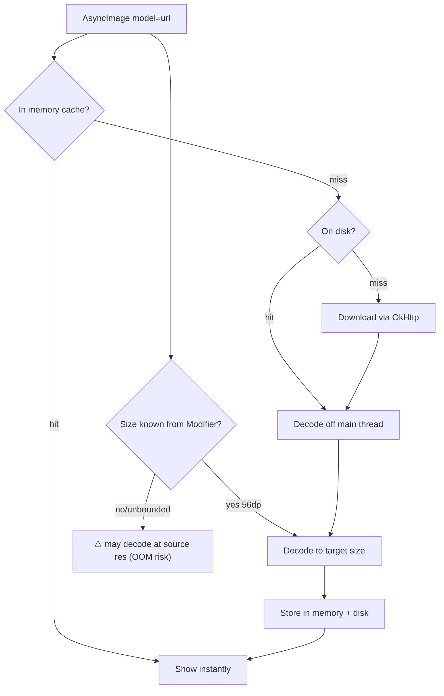

# Lesson 06 — Image Loading

> After this lesson you can load images with Coil without jank: correctly sized decodes, memory/disk caching, crossfade and placeholders, and keeping bitmap work off the main thread in a `LazyColumn`.

**Module:** 11 · **Lesson:** 06 · **Level:** 🟢🟡🔴 · **Est. time:** 70–85 min

---

## 1. Concept

### 🟢 For beginners — *what is it and why do I care?*

Images are the #1 cause of jank and out-of-memory crashes in real apps. A single photo from a phone camera can be 4000×3000 pixels. If you load that into a 100×100 dp thumbnail **at full size**, you waste enormous memory and spend time **decoding** (turning the compressed JPEG/PNG into a raw bitmap) — and if that decode happens on the **main thread**, the UI freezes.

**Coil** (Coroutine Image Loader) is the standard Compose image library in 2026. It handles the hard parts for you:
- **Downloads** the image (or reads it from a file/resource),
- **Decodes** it **off the main thread**,
- **Resizes** it to the space it'll occupy (so you don't hold a 12-megapixel bitmap for a thumbnail),
- **Caches** it in memory and on disk so the next time is instant.

You use it via `AsyncImage` (one composable) or `rememberAsyncImagePainter`. The key skill is **configuring it right** — wrong sizing and missing caches turn a smooth list into a stutter-fest.

### 🟡 For intermediate devs — *the mechanism*

The basic call:

```kotlin
AsyncImage(
    model = imageUrl,
    contentDescription = "Profile photo",
    modifier = Modifier.size(56.dp),
    contentScale = ContentScale.Crop,
)
```

What you must get right:

1. **Sizing.** Coil decodes to the target size by default when it can infer it from the `Modifier` constraints (e.g., `Modifier.size(56.dp)`). If the size is unbounded (e.g., inside a `wrapContentSize` with no constraint), Coil may decode at original resolution — wasteful. Give it a bounded size, or set an explicit `ImageRequest.size(...)`.

2. **Caching.** Coil maintains a **memory cache** (decoded bitmaps, fast) and a **disk cache** (encoded bytes, survives restarts). Defaults are sensible, but on image-heavy apps you tune the memory cache (`maxSizePercent`) and ensure the disk cache is enabled. A `memoryCacheKey` lets you share a decoded bitmap between a list thumbnail and a detail screen.

3. **Placeholders & crossfade.** A `placeholder`, `error` drawable, and `crossfade(true)` prevent layout jumps and flashes. Without a placeholder, the row's height can jump when the image arrives (a relayout) — visible jank.

4. **Off-main-thread by default.** Coil decodes on a background dispatcher. Your job is to **not** undo that — e.g., don't synchronously decode bitmaps yourself, and don't force `allowHardware(false)` without reason (hardware bitmaps save memory).

### 🔴 For senior devs — *trade-offs, edges, internals*

- **Decode size is the lever that prevents OOM and jank.** A bitmap's memory is `width × height × 4 bytes` (ARGB_8888). A 4000×3000 image is ~48 MB *decoded*, regardless of its 2 MB JPEG size. Decoding to the 56 dp target (~150×150 px at xxhdpi ≈ 90 KB) is a ~500× memory reduction. In a list of 20 thumbnails that's the difference between ~2 MB and ~1 GB. **Always bound the size**; never let a list decode at source resolution.

- **Hardware bitmaps vs. software bitmaps.** Coil prefers **hardware bitmaps** (`Bitmap.Config.HARDWARE`) — they live in graphics memory, not the Java heap, reducing GC pressure and OOM risk. The catch: hardware bitmaps can't be read back on the CPU (e.g., to extract a palette, or to draw into a software `Canvas`/`Modifier.drawBehind` that reads pixels, or for some `graphicsLayer` blur paths). When you need CPU access, set `allowHardware(false)` for *that* request only — not globally.

- **A single shared `ImageLoader`.** Construct **one** `ImageLoader` (ideally provided via Hilt) and reuse it. Multiple loaders mean multiple caches, multiple OkHttp clients, wasted memory, and duplicate downloads. Configure crossfade, caches, and OkHttp once there.

- **Stable `model` keys to avoid reloads.** If the `model` you pass changes identity every recomposition (e.g., a freshly-built `ImageRequest` with a new instance each time), Coil may reissue the request. Pass a stable URL/`data` or a `remember`ed `ImageRequest`, and set an explicit `memoryCacheKey` when the URL isn't a good cache key (e.g., signed URLs whose query string changes).

- **List-specific care.** In a `LazyColumn`, recycled rows trigger new image requests as items scroll into view. The win comes from: bounded decode size, an effective memory cache (so the same images on quick back-scroll are instant), a placeholder to avoid relayout, and **not** reading image-load state high in the tree. Coil cancels in-flight requests for rows that scroll away before completing — don't fight that with manual loading.

- **`contentScale` and aspect ratio.** `ContentScale.Crop` fills and clips; pair with a fixed `size`/`aspectRatio` so the layout is stable before the image loads. Letting the image dictate size after load causes a relayout jump. For full-bleed hero images, set an `aspectRatio` placeholder.

- **Don't block the main thread elsewhere.** Coil's async decode is undone if you do *other* synchronous image work — e.g., `BitmapFactory.decodeStream` on the main thread for a "quick" icon, or applying a heavy `RenderEffect`/blur synchronously. Keep all bitmap work off the UI thread (Lesson 07).

### Analogy

A **restaurant kitchen receiving deliveries**. A whole side of beef arrives (the 12-megapixel source). You don't store the entire side in the tiny prep fridge (the heap) — the butcher (Coil's decoder) **portions it to exactly what the dish needs** (decode to target size) **in the back** (off the main thread), keeps frequently-used cuts in the **reach-in fridge** (memory cache) and the rest in the **walk-in** (disk cache). Try to butcher a whole cow on the **dining-room table** during service (decode on the main thread at full size) and the whole restaurant freezes.

### Mental model

> **Decode to the size you'll show, off the main thread, and cache it.** One shared `ImageLoader`, bounded sizes, a placeholder, crossfade — and never decode at source resolution for a thumbnail.

### Real-world example

A social feed with avatars and post images. Avatars are decoded to 40 dp (~tiny), post images to the screen width with a fixed 16:9 `aspectRatio` placeholder so rows don't jump. A shared Hilt-provided `ImageLoader` with a 25%-heap memory cache makes back-scrolling instant, and `crossfade(true)` hides network latency. The result: a feed that scrolls at 120 Hz instead of stuttering whenever an image lands.

---

## 2. Visual Learning

**ASCII — the Coil pipeline, on/off the main thread:**
```text
   AsyncImage(model = url, Modifier.size(56.dp))
              │
              ▼   (main thread: just records the request)
   ┌───────────────── ImageLoader (shared) ─────────────────┐
   │  memory cache?  ──hit──▶ decoded bitmap ──▶ show (fast) │
   │      │ miss                                             │
   │      ▼                                                  │
   │  disk cache?    ──hit──▶ decode @target ──▶ memcache ──▶ show
   │      │ miss          (BACKGROUND dispatcher)            │
   │      ▼                                                  │
   │  network (OkHttp) ──▶ disk ──▶ decode @target ──▶ caches ──▶ show
   └────────────────────────────────────────────────────────┘
        ▲ decode sized to 56dp, OFF the main thread, hardware bitmap
```

**Mermaid — request resolution & sizing:**


**Illustration prompt (paste into an image generator):**
```text
Illustration: a professional kitchen. A huge side of beef labeled "4000x3000 source" arrives at a
back prep station where a butcher-robot slices it into a small, perfectly portioned cut labeled
"56dp decode". Two fridges are labeled "memory cache (reach-in)" and "disk cache (walk-in)". A
swinging door separates the back prep area (labeled "background thread") from the dining room
(labeled "main thread / UI"), emphasizing the heavy work stays in back. A plated dish in the
dining room shows a crisp thumbnail. Modern, vibrant, clear labels, warm lighting.
```

---

## 3. Code

> These tiers go from a naive (jank-prone) load, to a correctly sized/cached one, to a production shared `ImageLoader` with a stable list setup.

### 🟢 Beginner — a correctly sized `AsyncImage`

```kotlin
@Composable
fun Avatar(url: String, modifier: Modifier = Modifier) {
    AsyncImage(
        model = url,
        contentDescription = "User avatar",
        modifier = modifier
            .size(40.dp)                  // bounded → Coil decodes to ~40dp, not source res
            .clip(CircleShape),
        contentScale = ContentScale.Crop, // fill + clip the square/circle
    )
}
```

**Explanation.** `Modifier.size(40.dp)` gives Coil a bounded target, so it decodes a tiny bitmap instead of the full image — low memory, fast decode (off the main thread automatically). `ContentScale.Crop` fills the circle without distortion. This one composable handles download, decode, and display.

**Common mistakes.**
```kotlin
// ❌ Unbounded size → Coil may decode at SOURCE resolution (megabytes per thumbnail → OOM).
AsyncImage(model = url, contentDescription = null, modifier = Modifier.wrapContentSize())

// ❌ Synchronous, full-size decode on the main thread (freezes UI):
val bmp = BitmapFactory.decodeStream(URL(url).openStream())  // never do this in Compose
Image(bitmap = bmp.asImageBitmap(), contentDescription = null)
```

**Best practices.**
- Always give the image a **bounded size**.
- Use `AsyncImage`/Coil — never decode bitmaps yourself on the main thread.
- Match `contentScale` to the shape (`Crop` for avatars/thumbnails).

---

### 🟡 Intermediate — placeholder, crossfade, and a stable request

```kotlin
@Composable
fun PostImage(url: String, modifier: Modifier = Modifier) {
    // remember the request so its identity is stable across recompositions (no reload).
    val context = LocalContext.current
    val request = remember(url) {
        ImageRequest.Builder(context)
            .data(url)
            .crossfade(true)                       // fade in → hides latency, no flash
            .placeholderMemoryCacheKey(url)        // reuse a low-res cached version if present
            .build()
    }

    AsyncImage(
        model = request,
        contentDescription = "Post image",
        modifier = modifier
            .fillMaxWidth()
            .aspectRatio(16f / 9f),                // fixed box BEFORE load → no relayout jump
        contentScale = ContentScale.Crop,
        placeholder = ColorPainter(MaterialTheme.colorScheme.surfaceVariant),
        error = ColorPainter(MaterialTheme.colorScheme.errorContainer),
    )
}
```

**Explanation.** The `aspectRatio` reserves the row's height *before* the image arrives, so there's no layout jump (a common jank source). `crossfade(true)` fades the image in. `remember(url)` keeps the `ImageRequest` instance stable so a recomposition doesn't reissue the request. A `placeholder`/`error` painter keeps the UI coherent during load and failure.

**Common mistakes.**
```kotlin
// ❌ Building a NEW ImageRequest every recomposition → identity changes → possible reload/flicker.
AsyncImage(model = ImageRequest.Builder(context).data(url).build(), ...) // no remember

// ❌ No fixed size/aspectRatio → the row jumps height when the image lands (relayout jank).
AsyncImage(model = url, modifier = Modifier.fillMaxWidth()) // height unknown until loaded
```

**Best practices.**
- Reserve space with `aspectRatio`/fixed `size` so loading never relayouts the list.
- `remember(url)` the `ImageRequest` to keep its identity stable.
- Provide `placeholder` and `error`; enable `crossfade`.

---

### 🔴 Production — one shared `ImageLoader` (Hilt) + list-safe usage

```kotlin
// A single, app-wide ImageLoader: one cache, one OkHttp client, sensible memory budget.
@Module
@InstallIn(SingletonComponent::class)
object ImageModule {
    @Provides @Singleton
    fun imageLoader(@ApplicationContext context: Context): ImageLoader =
        ImageLoader.Builder(context)
            .memoryCache {
                MemoryCache.Builder(context)
                    .maxSizePercent(0.25)            // 25% of app heap for decoded bitmaps
                    .build()
            }
            .diskCache {
                DiskCache.Builder()
                    .directory(context.cacheDir.resolve("image_cache"))
                    .maxSizeBytes(256L * 1024 * 1024) // 256 MB encoded bytes, survives restarts
                    .build()
            }
            .crossfade(true)
            .build()
}
```

```kotlin
// Provide it to Coil composables via a CompositionLocal (set once, near the app root).
@Composable
fun AppRoot(imageLoader: ImageLoader, content: @Composable () -> Unit) {
    CompositionLocalProvider(LocalImageLoader provides imageLoader) { content() }
}

// List row: bounded decode, stable model, placeholder — recycles cleanly under fast scroll.
@Composable
fun FeedRow(post: Post, modifier: Modifier = Modifier) {
    Row(modifier.fillMaxWidth().padding(12.dp), verticalAlignment = Alignment.CenterVertically) {
        AsyncImage(
            model = post.authorAvatarUrl,
            contentDescription = null,                 // decorative; name is the a11y label
            imageLoader = LocalImageLoader.current,     // the ONE shared loader
            modifier = Modifier.size(40.dp).clip(CircleShape),
            contentScale = ContentScale.Crop,
        )
        Spacer(Modifier.width(12.dp))
        Column(Modifier.weight(1f)) {
            Text(post.authorName, style = MaterialTheme.typography.titleSmall)
            AsyncImage(
                model = post.imageUrl,
                contentDescription = post.caption,      // meaningful → describe it
                imageLoader = LocalImageLoader.current,
                modifier = Modifier.fillMaxWidth().aspectRatio(16f / 9f),
                contentScale = ContentScale.Crop,
                placeholder = ColorPainter(MaterialTheme.colorScheme.surfaceVariant),
            )
        }
    }
}
```

**Explanation.** A **single** Hilt-provided `ImageLoader` (one memory cache, one disk cache, one OkHttp client) is provided down the tree so every `AsyncImage` shares caches — back-scrolling is instant and no image downloads twice. Rows are list-safe: bounded decode sizes, stable `model` keys (the URLs), fixed/aspect-ratio boxes so loads don't relayout, and decorative vs. meaningful `contentDescription` set correctly for accessibility. Coil cancels requests for rows scrolled away mid-flight automatically.

**Common mistakes.**
```kotlin
// ❌ Creating an ImageLoader per screen/row → duplicate caches, duplicate downloads, memory waste.
val loader = ImageLoader.Builder(context).build()   // inside a composable → new each time

// ❌ allowHardware(false) globally "to be safe" → loses hardware-bitmap memory savings everywhere.
//    Set it only on the specific request that needs CPU pixel access (palette/blur readback).

// ❌ Reading per-image load state high in the tree (e.g., hoisting AsyncImagePainter.state up),
//    causing the whole list/screen to recompose as images resolve.
```

**Best practices.**
- Exactly **one** shared `ImageLoader` (provide via Hilt + a CompositionLocal).
- Tune `maxSizePercent` (memory) and disk cache size for image-heavy apps.
- Keep `model` keys stable; use `memoryCacheKey` for signed/changing URLs.
- `allowHardware(false)` only per-request when you truly need CPU pixel access.
- Set `contentDescription` correctly: `null` for decorative, meaningful text otherwise.

---

## 4. Interview Questions

**🟢 Beginner**

1. *Why shouldn't you load a full-resolution image into a small thumbnail?*
   > A decoded bitmap costs `width × height × 4 bytes` regardless of file size; a 12-megapixel image is ~48 MB in memory. For a small thumbnail that wastes memory (risking OOM) and decode time. Decode to the display size instead — Coil does this when you give it a bounded `Modifier` size.
2. *What does Coil do for you that a manual `BitmapFactory.decode` doesn't?*
   > It downloads, decodes **off the main thread**, resizes to the target, caches in memory and disk, and handles placeholders/crossfade/cancellation — all the things that otherwise cause jank or crashes if done by hand.

**🟡 Intermediate**

3. *How do you prevent a list row from "jumping" when its image finishes loading?*
   > Reserve the space before load with a fixed `size` or `aspectRatio` and a `placeholder`, so the layout is stable and the arriving image doesn't trigger a relayout.
4. *Why pass a `remember`ed `ImageRequest` (or a stable URL) instead of building a new request inline?*
   > If the `model`'s identity changes every recomposition, Coil may reissue the request (flicker, wasted work). A stable URL or a `remember(url)`'d `ImageRequest` keeps the identity constant so the cached result is reused.

**🔴 Senior**

5. *What are hardware bitmaps, and when must you disable them?*
   > `Bitmap.Config.HARDWARE` bitmaps live in graphics memory (off the Java heap), reducing GC pressure and OOM risk; Coil prefers them. You must disable them (`allowHardware(false)`) **only for requests that need CPU pixel access** — extracting a color palette, drawing the bitmap into a software canvas, or certain blur/`graphicsLayer` readback paths — and only for those requests, not globally.
6. *Why use a single shared `ImageLoader`, and what goes wrong with multiple?*
   > One loader means one memory cache, one disk cache, and one OkHttp connection pool — shared across the app, so images load once and back-scroll is instant. Multiple loaders create duplicate caches and downloads, multiply memory use, and prevent cache hits between screens. Provide one via Hilt.

---

## 5. AI Assistant

**Prompt example (auditing image loading):**
```text
Review this Compose image-loading code for jank and memory. Targeting Compose 2026 BOM, Kotlin 2.x,
Coil. Check for: (1) unbounded decode sizes / source-resolution decodes, (2) missing fixed size or
aspectRatio causing relayout on load, (3) ImageRequest rebuilt every recomposition, (4) more than one
ImageLoader instance, (5) any synchronous/main-thread bitmap work, (6) global allowHardware(false).
Show the minimal fix for each and explain the memory/jank impact. [paste code]
```

**AI workflow — where it helps on *this* topic.**
- ✅ Great for: writing the shared `ImageLoader` + Hilt module, adding placeholders/crossfade/aspect-ratio, spotting unbounded sizes and inline `ImageRequest` rebuilds.
- ⚠️ Not for: choosing cache budgets for *your* device matrix and image mix, or deciding when a request genuinely needs `allowHardware(false)` (depends on whether you read pixels back).

**Review workflow — check AI output against this lesson's *Common Mistakes*:**
- Are decode sizes **bounded** (no source-resolution thumbnails)?
- Is space **reserved** (fixed size/`aspectRatio`) so loads don't relayout?
- Is the `ImageRequest`/`model` **stable** across recompositions?
- Exactly **one** shared `ImageLoader`?
- No synchronous main-thread bitmap work; `allowHardware(false)` only where justified?

**Validation workflow — prove it doesn't jank:**
1. **Memory:** Android Studio Memory Profiler — confirm bitmap memory is proportional to *display* size, not source (scroll a list of large images; heap should stay modest).
2. **Jank:** scroll with Layout Inspector/system trace — no relayout when images land; no main-thread decode spikes.
3. **Cache:** scroll down then back up — images reappear instantly (memory-cache hits).
4. **Macrobenchmark** (Lesson 09): scroll `FrameTimingMetric` on a release-like build; P99 stays within budget with images present.

> **AI drafts, you decide.** AI can wire Coil correctly, but cache sizes and hardware-bitmap choices depend on your real images and devices — verify in the Memory Profiler, not in the chat.

---

## Recap / Key takeaways

- **Decode to display size, off the main thread, and cache** — Coil's job; your job is to configure it right.
- A bitmap costs `w × h × 4` bytes — **bound the size** so thumbnails don't decode at source resolution (OOM/jank).
- **Reserve space** (fixed `size`/`aspectRatio` + placeholder) so loading never relayouts the list.
- Keep the **`model`/`ImageRequest` stable** (`remember(url)`) to avoid reloads.
- Use **one shared `ImageLoader`** (Hilt + CompositionLocal); tune memory/disk caches for image-heavy apps.
- Prefer **hardware bitmaps**; disable them only per-request when you need CPU pixel access.

➡️ Next: **[Lesson 07 — Overdraw & Main-Thread Safety](07-overdraw-main-thread.md)** — flatten layers, cut overdraw, and keep all heavy work off the UI thread.
