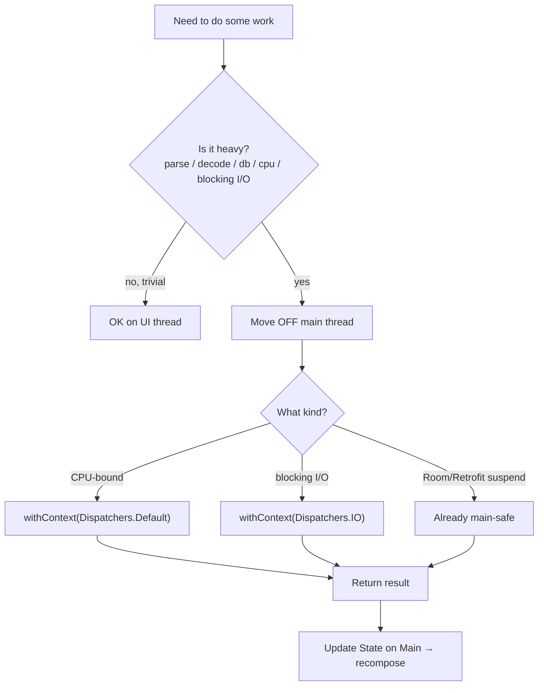

# Lesson 07 — Overdraw & Main-Thread Safety

> After this lesson you can spot and eliminate overdraw (pixels painted multiple times per frame), flatten redundant layers, and guarantee that no heavy work ever blocks the UI thread.

**Module:** 11 · **Lesson:** 07 · **Level:** 🟢🟡🔴 · **Est. time:** 70–85 min

---

## 1. Concept

### 🟢 For beginners — *what is it and why do I care?*

Two separate "draw phase / UI thread" problems, both causing jank:

**Overdraw** is painting the **same pixel more than once** in a single frame. Imagine a screen with a window background, then a card background on top, then a row background, then the text. The pixels under the text might get painted 3–4 times — but the user only ever sees the top layer. Every redundant paint is wasted GPU work. A little overdraw is normal; a lot of it makes scrolling stutter.

**Main-thread safety** means: the UI thread (which runs Composition, Layout, and Draw) must **never** do slow work. Parsing JSON, reading a database synchronously, decoding a big bitmap, doing heavy math — if any of that runs on the UI thread, **every frame freezes** until it finishes. The user sees the app hang. The rule: heavy work goes to a **background thread** (via coroutines and the right `Dispatcher`), and only the *result* comes back to update state.

Why care? These are the two ways a frame blows its ~16 ms budget *outside* of recomposition. You can have perfectly stable, perfectly keyed composables and still jank because the GPU is overdrawing or the main thread is blocked.

### 🟡 For intermediate devs — *the mechanism*

**Overdraw sources in Compose:**
- **Stacked opaque backgrounds** — a `Surface`/`Box` with a background color inside another with the same color. The inner one repaints pixels the outer already covered.
- **`Modifier.background()` on every level** of a nested layout.
- **Full-screen scrims/gradients** drawn over already-painted content.
- **Large `Card`/`Surface` elevations** (shadows add a layer).

Fixes: **flatten** — set the background **once** at the highest level that owns it; remove redundant child backgrounds; avoid painting a color you'll fully cover. Use the **GPU Overdraw debug overlay** (Developer Options → "Debug GPU overdraw") to *see* it: blue = 1×, green = 2×, light red = 3×, dark red = 4×+. Aim for mostly blue/green.

**Main-thread safety in Compose:**
- **Never** call blocking I/O or heavy CPU work inside a composable body (it runs in the composition path — Lesson 01).
- Do heavy work in a **`ViewModel`** coroutine with the right dispatcher: `withContext(Dispatchers.Default)` for CPU work, `Dispatchers.IO` for blocking I/O. Room/Retrofit suspend functions are **main-safe** already (they switch dispatchers internally).
- Effects that do work (`LaunchedEffect`) run in a coroutine, but **you** must still move heavy work off the main dispatcher inside them.

```text
UI thread (16ms budget):  Composition → Layout → Draw   ← keep LIGHT
heavy work (decode/parse/db/cpu):  → Dispatchers.Default / IO   ← OFF the UI thread
                                    → result → update State → recompose
```

### 🔴 For senior devs — *trade-offs, edges, internals*

- **Overdraw is a draw-phase cost; it's invisible to recomposition counts.** A screen can recompose perfectly (count = 1) and still drop frames because the GPU fills the same pixels 5×. Diagnose with the **overdraw overlay** and a **system trace** (look at the GPU/RenderThread, not just the main thread). The fix is structural — fewer opaque layers — not stability.

- **"Flatten" has limits; don't break correctness.** You can't always remove a background (a card *needs* its surface color for contrast/elevation). The goal is removing *redundant* paints: a child background identical to its parent, a scrim over fully-opaque content, a gradient drawn then covered. Tools like `Modifier.drawBehind` let you paint exactly what's needed without an extra `Surface` layer. Custom layouts (Module 05) can also reduce nesting depth, which reduces both layout and draw cost.

- **`clipToBounds`/rounded corners and layers.** Rounded-corner clips and `graphicsLayer` introduce offscreen buffers/compositing. Usually worth it, but stacking many clipped layers (nested rounded cards) multiplies compositing cost. Measure before adding decorative depth.

- **Main-thread stalls are the jank that profiling-by-recomposition misses entirely.** A 30 ms synchronous JSON parse in a `LaunchedEffect` (without `withContext`) blocks the frame just as hard as on the main thread, because `LaunchedEffect`'s default dispatcher is `Dispatchers.Main`. The senior reflex: *any* CPU-heavy or blocking call gets an explicit `withContext(Dispatchers.Default/IO)`. Verify on a **system trace**: the main thread should show idle gaps between frames, not long unbroken work blocks.

- **Dispatcher discipline & cancellation.** Background work tied to a screen belongs in `viewModelScope` (auto-cancelled). Work tied to a composable belongs in `rememberCoroutineScope`/`LaunchedEffect` (cancelled with the composable). Leaking work to `GlobalScope` causes wasted CPU (still costing battery/heat) and stale updates. Use `Dispatchers.Default.limitedParallelism(...)` for bounded CPU pools when needed.

- **StrictMode catches accidental main-thread I/O in debug.** Enable `StrictMode` (disk/network reads on main) during development to *crash on* accidental blocking calls before they reach users — cheaper than finding them in a trace later.

- **Frame pacing vs. throughput.** Even off-thread work can hurt if it floods the main thread with **state updates** (each triggering recomposition). Batch/debounce emissions (e.g., `conflate`, `sample`) so the UI updates at a sustainable rate, not faster than it can draw.

### Analogy

**Overdraw** is **repainting a wall five times in five colors when only the top coat shows** — you pay for paint and labor nobody sees; do one coat where it matters. **Main-thread safety** is a **single-lane checkout counter (the UI thread)**: if the cashier stops to **unload an entire delivery truck** (parse/decode/db) mid-transaction, *every customer in line waits*. The fix is a **back room** (background dispatchers) where deliveries are unpacked, while the cashier only ever does fast register work and hands over the finished bag (the result/state update).

### Mental model

> **Paint each pixel as few times as possible (flatten layers), and never let the UI thread do slow work (push it to `Dispatchers.Default`/`IO`, bring back only the result).** Recomposition counts can't see either problem — use the overdraw overlay and a system trace.

### Real-world example

A dashboard card stack feels heavy on scroll though recomposition counts are clean. The overdraw overlay is dark red under the cards: a window `Surface`, a section `Surface`, and per-card `Surface` all paint the same background color. Removing the two redundant backgrounds (keep only the card's) drops overdraw to green and scrolling smooths out. Separately, a "share" action that synchronously rendered a bitmap on the main thread froze for 200 ms; moving the render to `Dispatchers.Default` and showing a spinner fixes the hang.

---

## 2. Visual Learning

**ASCII — overdraw (stacked opaque layers) vs. flattened:**
```text
OVERDRAW (4× under text):                 FLATTENED (1× background):
 ┌──────────────────────────┐              ┌──────────────────────────┐
 │ window bg     (paint 1)   │             │ window bg   (paint 1)      │
 │  ┌──────────────────────┐ │             │   text      (paint 2 only  │
 │  │ section bg (paint 2)  │ │             │             where needed)  │
 │  │  ┌────────────────┐   │ │             │                            │
 │  │  │ card bg (paint3)│  │ │             │  no redundant section/card │
 │  │  │  TEXT (paint 4) │  │ │             │  backgrounds of same color │
 │  │  └────────────────┘   │ │             │                            │
 │  └──────────────────────┘ │             │                            │
 └──────────────────────────┘              └──────────────────────────┘
  GPU fills same pixels 4×                   GPU fills them ~1–2×
```

**Mermaid — main-thread safety decision:**


**Illustration prompt (paste into an image generator):**
```text
Illustration: split scene. LEFT: a painter rolling a wall with five stacked coats of different
colors, sweating, labeled "OVERDRAW — paid for, never seen", with a small overlay legend
blue/green/red showing draw counts. RIGHT: a supermarket checkout with one lane labeled
"UI thread"; behind a door labeled "background dispatchers" workers unload a delivery truck
labeled "parse / decode / DB". The cashier smoothly hands a finished bag labeled "result/state"
to a happy customer. Caption: "One coat. Keep the cashier free." Modern, vibrant, clear labels.
```

---

## 3. Code

> These tiers go from a small overdraw fix, to moving heavy work off the main thread, to a production screen that's both flat and main-safe with batched updates.

### 🟢 Beginner — flatten redundant backgrounds

```kotlin
// ❌ Overdraw: three opaque layers paint the same surface color.
@Composable
fun OverdrawnCard(text: String) {
    Surface(color = MaterialTheme.colorScheme.surface) {            // paint 1
        Box(Modifier.background(MaterialTheme.colorScheme.surface)) { // paint 2 (redundant)
            Card(colors = CardDefaults.cardColors(MaterialTheme.colorScheme.surface)) { // paint 3
                Text(text, Modifier.padding(16.dp))
            }
        }
    }
}

// ✅ Flattened: the background lives in ONE place that owns it.
@Composable
fun FlatCard(text: String) {
    Card(Modifier.padding(8.dp)) {                 // Card provides its own surface — one layer
        Text(text, Modifier.padding(16.dp))
    }
}
```

**Explanation.** The first version paints the same `surface` color three times for the same pixels — pure waste the user never sees. The flattened version lets the `Card` own its surface and removes the redundant outer backgrounds. Same look, a third of the fill cost under the card.

**Common mistakes.**
```kotlin
// ❌ Adding Modifier.background(color) at every nesting level "for safety".
Column(Modifier.background(bg)) { Row(Modifier.background(bg)) { /* same color, double paint */ } }
```

**Best practices.**
- Set an opaque background **once**, at the level that owns it.
- Don't repaint a color a child will fully cover.
- Use the **GPU overdraw overlay** (Developer Options) to *see* redundant paints — aim for blue/green.

---

### 🟡 Intermediate — move heavy work off the UI thread

```kotlin
class ReportViewModel(
    private val repo: ReportRepository,
) : ViewModel() {
    private val _state = MutableStateFlow(ReportUiState())
    val state = _state.asStateFlow()

    fun generate(raw: String) {
        viewModelScope.launch {
            _state.update { it.copy(isLoading = true) }
            // CPU-heavy parsing runs on Dispatchers.Default, NOT the main thread.
            val parsed = withContext(Dispatchers.Default) { heavyParse(raw) }
            _state.update { it.copy(isLoading = false, report = parsed) }  // result back on Main
        }
    }
}

@Composable
fun ReportScreen(vm: ReportViewModel = viewModel()) {
    val state by vm.state.collectAsStateWithLifecycle()
    when {
        state.isLoading -> CircularProgressIndicator()
        state.report != null -> ReportView(state.report)
        else -> Button(onClick = { vm.generate(loadRaw()) }) { Text("Generate") }
    }
}
```

**Explanation.** `heavyParse` could take tens of milliseconds — on the main thread that's a guaranteed dropped-frame hang. Wrapping it in `withContext(Dispatchers.Default)` runs it on a background thread; only the lightweight **state update** returns to the main thread to drive recomposition. The UI shows a spinner instead of freezing.

**Common mistakes.**
```kotlin
// ❌ Heavy work in the composition path → blocks Composition/Layout/Draw, freezes the frame.
@Composable
fun Bad(raw: String) {
    val parsed = heavyParse(raw)   // runs on the UI thread, every recomposition
    ReportView(parsed)
}

// ❌ LaunchedEffect without withContext → still runs on Dispatchers.Main, still blocks.
LaunchedEffect(raw) { val parsed = heavyParse(raw); /* blocked the main thread */ }
```

**Best practices.**
- Heavy CPU → `Dispatchers.Default`; blocking I/O → `Dispatchers.IO`; Room/Retrofit suspend fns are already main-safe.
- Do work in `viewModelScope` (auto-cancel); return only the result to update state.
- Never call blocking/heavy code in a composable body or an unswitched `LaunchedEffect`.

---

### 🔴 Production — flat, main-safe, and batched updates

```kotlin
class LiveMetricsViewModel(
    private val source: MetricsSource,        // emits frequently (e.g., sensor / socket)
) : ViewModel() {

    // Heavy mapping off the main thread; conflate so we don't flood the UI faster than it draws.
    val state: StateFlow<MetricsUiState> =
        source.rawUpdates
            .conflate()                                   // drop intermediate values under load
            .map { withContext(Dispatchers.Default) { it.toUiModel() } } // CPU work off-main
            .map { MetricsUiState(metrics = it) }
            .flowOn(Dispatchers.Default)                  // upstream runs off the main thread
            .stateIn(viewModelScope, SharingStarted.WhileSubscribed(5_000), MetricsUiState())
}

@Composable
fun MetricsDashboard(vm: LiveMetricsViewModel = viewModel()) {
    val state by vm.state.collectAsStateWithLifecycle()

    // ONE owning background; children draw exactly what they need, no redundant layers.
    Surface(color = MaterialTheme.colorScheme.background) {
        LazyColumn(contentPadding = PaddingValues(12.dp)) {
            items(state.metrics, key = { it.id }, contentType = { it.kind }) { metric ->
                // drawBehind paints the accent without an extra opaque Surface layer.
                Row(
                    Modifier
                        .fillMaxWidth()
                        .drawBehind { drawRect(metric.accent, alpha = 0.08f) }  // light, no new layer
                        .padding(12.dp),
                ) {
                    Text(metric.label, Modifier.weight(1f))
                    Text(metric.value)
                }
            }
        }
    }
}
```

**Explanation.** Three production concerns, handled together: (1) **main-thread safety** — the heavy `toUiModel()` mapping runs off-main via `withContext`/`flowOn`, and `conflate()` prevents flooding the UI with more updates than it can draw; (2) **flattened drawing** — a single owning `Surface` background, and a per-row accent painted with `drawBehind` (a draw-phase op) instead of a nested opaque `Surface`, avoiding overdraw and an extra compositing layer; (3) **lifecycle** — `WhileSubscribed` stops upstream work when the screen is backgrounded.

**Common mistakes.**
```kotlin
// ❌ Mapping on the collecting (main) thread + no conflation → UI thread does heavy work and
//    is hammered by every emission → sustained jank.
source.rawUpdates.map { it.toUiModel() }  // no flowOn, no conflate

// ❌ Per-row opaque Surface with elevation for a subtle tint → overdraw + extra layers per row.
Surface(tonalElevation = 2.dp) { Row { ... } }   // when a drawBehind tint would do
```

**Best practices.**
- Push heavy mapping upstream with `flowOn(Dispatchers.Default)`; `conflate`/`sample` to match draw rate.
- Use `WhileSubscribed` so background work pauses when no one's collecting.
- Prefer `drawBehind`/`drawWithContent` for light accents over extra opaque `Surface`/elevation layers.
- One owning background; verify with the overdraw overlay and a system trace (idle gaps between frames).

---

## 4. Interview Questions

**🟢 Beginner**

1. *What is overdraw?*
   > Painting the same pixel more than once in a single frame — e.g., stacked opaque backgrounds where only the top is visible. The redundant paints are wasted GPU work that can cause jank.
2. *Why can't you do heavy work (like parsing) inside a composable or on the main thread?*
   > The UI thread runs Composition, Layout, and Draw within a ~16 ms budget. Blocking it with heavy work freezes every frame until the work finishes — the app visibly hangs. Heavy work belongs on a background dispatcher.

**🟡 Intermediate**

3. *How do you detect and reduce overdraw?*
   > Detect with Developer Options → "Debug GPU overdraw" (blue=1×…dark red=4×+); aim for blue/green. Reduce by flattening: set opaque backgrounds once at the owning level, remove redundant child backgrounds, and avoid painting colors that will be fully covered.
4. *Which dispatcher for CPU-heavy work vs. blocking I/O, and what about Room/Retrofit?*
   > `Dispatchers.Default` for CPU-bound work, `Dispatchers.IO` for blocking I/O. Room and Retrofit suspend functions are already **main-safe** (they switch dispatchers internally), so you can call them from `viewModelScope` without wrapping.

**🔴 Senior**

5. *Recomposition counts are clean but the screen still janks on scroll. Name two non-recomposition causes and how you'd confirm.*
   > (1) **Overdraw** — confirm with the GPU overdraw overlay and the RenderThread in a system trace. (2) **Main-thread stalls** — a synchronous decode/parse/I/O blocking the frame; confirm with a system trace showing long unbroken work blocks on the main thread (no idle gaps). Neither shows up in recomposition counts.
6. *A `LaunchedEffect` does a 30 ms parse and still drops frames. Why, and what's the fix?*
   > `LaunchedEffect`'s coroutine runs on `Dispatchers.Main` by default, so the parse blocks the UI thread just like a direct call. Wrap the heavy part in `withContext(Dispatchers.Default)` so only the lightweight result returns to the main thread to update state.

---

## 5. AI Assistant

**Prompt example (auditing for overdraw + main-thread safety):**
```text
Review this Compose screen for (A) overdraw — stacked opaque backgrounds, redundant Surface/Card
layers, scrims over opaque content — and (B) main-thread safety — any heavy parse/decode/db/CPU
work running in the composition path, in an unswitched LaunchedEffect, or on the collecting thread.
Targeting Compose 2026 BOM, Kotlin 2.x. For each finding show the minimal fix (flatten the layer
or move work to Dispatchers.Default/IO) and explain the impact. [paste code + ViewModel]
```

**AI workflow — where it helps on *this* topic.**
- ✅ Great for: spotting redundant backgrounds, suggesting `drawBehind` over extra `Surface` layers, wrapping heavy work in `withContext`, adding `conflate`/`flowOn`.
- ⚠️ Not for: judging the *acceptable* overdraw level for your design (some layering is intentional) or which work is "heavy enough" to offload without your trace data.

**Review workflow — check AI output against this lesson's *Common Mistakes*:**
- Did it remove **redundant** opaque backgrounds (not break a needed surface)?
- Is heavy work on `Dispatchers.Default`/`IO`, with only the **result** on Main?
- Did it avoid the **unswitched `LaunchedEffect`** trap?
- For frequent emissions, did it add `conflate`/`flowOn`/`WhileSubscribed`?

**Validation workflow — prove both problems are gone:**
1. **Overdraw overlay:** the screen is mostly blue/green, not red — and visuals are unchanged.
2. **System trace:** main thread shows **idle gaps** between frames (no long work blocks); RenderThread isn't overdraw-bound.
3. **StrictMode:** enable in debug; confirm no main-thread disk/network violations fire.
4. **Macrobenchmark** (Lesson 09): scroll/interaction `FrameTimingMetric` P99 within budget on a release-like build.

> **AI drafts, you decide.** Overdraw acceptability and "is this work heavy?" are judgment calls backed by the overlay and a trace — not by the model's confidence.

---

## Recap / Key takeaways

- **Overdraw** = painting the same pixel multiple times; **flatten** by setting opaque backgrounds once and using `drawBehind` over extra layers. See it with the **GPU overdraw overlay**.
- **Main-thread safety**: the UI thread runs Composition/Layout/Draw on a tight budget — never block it. Heavy CPU → `Dispatchers.Default`, blocking I/O → `Dispatchers.IO`; Room/Retrofit suspend fns are main-safe.
- `LaunchedEffect` defaults to `Dispatchers.Main` — **still wrap heavy work** in `withContext`.
- For frequent emissions, **batch** with `conflate`/`sample` and `flowOn`, and pause with `WhileSubscribed`.
- Both problems are **invisible to recomposition counts** — diagnose with the overdraw overlay and a **system trace**.

➡️ Next: **[Lesson 08 — movableContentOf](08-movablecontentof.md)** — move a subtree to a new position *without* losing its state or re-running it.
