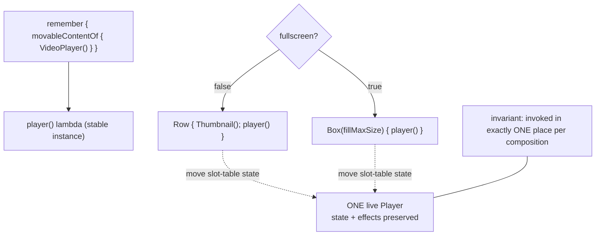

# Lesson 08 — movableContentOf

> After this lesson you can move a composable subtree to a *different position* in the tree — across a layout swap, a reorder, or a list/grid toggle — **without** destroying and recreating its state or re-running expensive setup.

**Module:** 11 · **Lesson:** 08 · **Level:** 🟡🔴 · **Est. time:** 60–75 min

---

## 1. Concept

### 🟢 For beginners — *what is it and why do I care?*

Compose normally identifies a composable by **where it is in the code/tree** (its position). If a composable moves to a *different* place — say it was inside a `Row` and now it's inside a `Column` — Compose sees the old one disappear and a brand-new one appear. It **throws away the old state** (`remember`ed values, animations, scroll position, a half-typed text field) and starts fresh.

That's usually fine. But sometimes you genuinely want the *same* component to **move** and **keep everything**:
- A video player that should keep playing as it moves from a list thumbnail into a full-screen position.
- A "now playing" mini-bar that becomes the expanded player — same state, new location.
- Switching a content area between a one-column and two-column layout, keeping each item's expanded/scroll state.

`movableContentOf` solves exactly this: you declare a chunk of UI **once**, and you can call it from **different positions** in the tree. Compose treats it as the *same* instance moving, so its state and `remember`s come along for the ride.

### 🟡 For intermediate devs — *the mechanism*

You wrap content in `movableContentOf { … }` (or `movableContentWithReceiverOf`), store the resulting lambda in `remember`, and then **invoke it** wherever you want it to appear:

```kotlin
val player = remember {
    movableContentOf {
        VideoPlayer(/* its remember{} state moves with it */)
    }
}

if (fullscreen) {
    Box(Modifier.fillMaxSize()) { player() }     // call it here…
} else {
    Row { Thumbnail(); player() }                // …or here — same instance, state preserved
}
```

The rule Compose enforces: at any given composition, the movable content is invoked **in exactly one place** (or a consistent set of places). When the call site changes between recompositions, Compose **moves the existing nodes and their state** from the old location to the new one instead of disposing and recreating them.

Without `movableContentOf`, the `if/else` above would dispose the player in one branch and create a fresh one in the other — playback restarts, buffering resets. With it, the player keeps playing.

This is distinct from a `LazyColumn` **key** (Lesson 04): keys preserve state for items that *stay in the same list* as the data reorders. `movableContentOf` preserves state for a subtree that moves to a *structurally different* place in the tree (different parent, different layout).

### 🔴 For senior devs — *trade-offs, edges, internals*

- **It moves slot-table state, not just `remember`.** Under the hood, the movable content's **group in the slot table** (its `remember`ed values, nested composables' state, even active effects) is relocated rather than discarded and rebuilt ([Module 12](../module-12-internals/README.md) covers the slot table). That's why animations, coroutines started in `LaunchedEffect`, and scroll positions survive — the *identity* persists. This also means side effects are **not** re-run on move (no `onDispose`/relaunch), which is usually what you want but occasionally surprising.

- **Exactly-one-call-site invariant.** Movable content must be emitted in **one** location per composition (you may move it between compositions). Invoking the *same* movable lambda **twice simultaneously** is undefined/broken — Compose can't have one identity in two places. If you need it in N places at once, you need N movable instances (e.g., a keyed map of them).

- **`remember` the movable lambda, and key it correctly.** The lambda from `movableContentOf` must itself be `remember`ed so it's the same instance across recompositions. If you parameterize it, use `movableContentOf { param -> … }` and pass args at the call site, or key the `remember` on identity — otherwise you recreate the movable wrapper and lose the benefit.

- **It's not a free perf win — it's a *state-preservation* tool that *avoids* re-setup cost.** The performance benefit is **not paying to recreate** an expensive subtree (re-init a player, re-decode, re-run effects, lose warm caches). If the subtree is cheap and stateless, `movableContentOf` adds complexity for no gain. Reach for it when **identity must survive a structural move** and recreation is costly or visibly wrong.

- **Interaction with shared-element / look-ahead transitions.** Modern Compose shared-element transitions and `LookaheadScope` handle *animating* a move; `movableContentOf` handles *preserving the instance/state* across the move. They compose: shared-element for the visual interpolation, movable content so the thing being animated is the *same* stateful node, not a clone. Know which problem you're solving — visual tween vs. state identity.

- **Lists/grids toggle.** Switching a `LazyColumn` to a `LazyVerticalGrid` (different parent type) normally rebuilds every item. Wrapping each item's content in movable content keyed by id lets per-item state (expanded, in-progress edits) survive the layout switch — a high-impact, non-obvious use.

- **Debugging gotcha.** If state *isn't* preserved when you expected it to be, the usual cause is: the movable lambda wasn't `remember`ed (recreated each recomposition), or it's invoked at two sites, or the surrounding `key`/identity changed. Verify the lambda instance is stable and emitted exactly once.

### Analogy

A **food truck (a self-contained, stateful unit) versus a pop-up stall rebuilt from scratch each day.** Normally, when the market reorganizes (the tree changes), Compose **tears down the stall and builds a new one** at the new spot — the half-cooked food, the warm grill, the cash in the till (state) are gone. `movableContentOf` is putting the kitchen in a **food truck**: when the market moves it to a new location, you just **drive the truck over** — the grill stays hot, the orders in progress continue, nothing is rebuilt. Same truck, new parking spot.

### Mental model

> **`movableContentOf` lets one stateful subtree change its position in the tree without losing identity.** Declare it once, `remember` it, invoke it in exactly one place at a time — Compose *moves* its slot-table state instead of disposing and recreating it.

### Real-world example

A media app's "now playing" experience: a `VideoPlayer` lives in a small docked bar while you browse, and expands to full-screen when tapped. Wrapped in `movableContentOf` and `remember`ed, the *same* player instance moves between the docked `Row` and the full-screen `Box` — **playback never stops, buffering never resets**, the seek position is intact. Without it, every expand/collapse would restart the video.

---

## 2. Visual Learning

**ASCII — same instance moves vs. dispose+recreate:**
```text
WITHOUT movableContentOf:                 WITH movableContentOf:
  collapsed:        expanded:               collapsed:        expanded:
  Row                Box                     Row                Box
   └ Player(A) ❌──▶ └ Player(B) (new!)       └ player() ───────▶ └ player()
        dispose A         create B                 (same instance moves)
   state LOST, video restarts                state KEPT, video keeps playing
```

**Mermaid — one declaration, two call sites, one live instance:**


**Illustration prompt (paste into an image generator):**
```text
Illustration: a food truck labeled "stateful subtree (VideoPlayer)" with a glowing hot grill and
an order ticket reading "playing 1:23 / buffered". Two parking spots are shown: a small one
labeled "docked Row" and a large one labeled "fullscreen Box". A curved arrow shows the SAME truck
driving from the small spot to the large spot, with a badge "state preserved — grill stays hot".
A faded ghost shows the WRONG way: a stall being demolished and rebuilt, labeled "dispose + recreate".
Modern, vibrant, clear labels, soft lighting, sense of smooth motion.
```

---

## 3. Code

> No "beginner" tier here — `movableContentOf` is inherently intermediate+. We go from a clear two-call-site move, to a keyed list/grid toggle, to a production docked↔fullscreen player.

### 🟡 Intermediate — keep state across a layout swap

```kotlin
@Composable
fun ReorderablePair(swapped: Boolean) {
    // Each card owns internal state (an expanded toggle) we want to KEEP when positions swap.
    val cardA = remember { movableContentOf { ExpandableCard(title = "A") } }
    val cardB = remember { movableContentOf { ExpandableCard(title = "B") } }

    if (!swapped) {
        Column { cardA(); cardB() }     // A above B
    } else {
        Column { cardB(); cardA() }     // B above A — but each keeps its expanded state
    }
}

@Composable
private fun ExpandableCard(title: String) {
    var expanded by rememberSaveable { mutableStateOf(false) }  // this state survives the swap
    ElevatedCard(Modifier.fillMaxWidth().padding(8.dp).clickable { expanded = !expanded }) {
        Column(Modifier.padding(16.dp)) {
            Text(title, style = MaterialTheme.typography.titleMedium)
            if (expanded) Text("Details for $title")
        }
    }
}
```

**Explanation.** Each card is declared once as movable content and `remember`ed. When `swapped` flips, the cards change order — but because they're movable, Compose **moves** each card's slot-table state (the `expanded` flag) to the new position instead of recreating the card. An expanded card stays expanded after the swap.

**Common mistakes.**
```kotlin
// ❌ Not remembering the movable lambda → recreated each recomposition → state lost anyway.
val cardA = movableContentOf { ExpandableCard("A") }   // no remember

// ❌ Invoking the same movable content in BOTH branches at once (or twice) → undefined behavior.
Column { cardA(); if (swapped) cardA() }   // two simultaneous call sites — broken
```

**Best practices.**
- Always `remember { movableContentOf { … } }`.
- Invoke each movable instance in **exactly one** place per composition.
- Use it when child state must **survive a structural reorder/swap**.

---

### 🔴 Production (a) — list ↔ grid toggle keeping per-item state

```kotlin
@Composable
fun AdaptiveGallery(
    items: ImmutableList<Photo>,
    asGrid: Boolean,
    modifier: Modifier = Modifier,
) {
    // One movable cell per id; remembered in a keyed map so the SAME cell instance is reused
    // whether it's rendered in a LazyColumn or a LazyVerticalGrid.
    val cells = remember(items) {
        items.associate { photo ->
            photo.id to movableContentOf { PhotoCell(photo) }
        }
    }

    if (asGrid) {
        LazyVerticalGrid(columns = GridCells.Fixed(2), modifier = modifier) {
            items(items, key = { it.id }, contentType = { "photo" }) { photo ->
                cells.getValue(photo.id).invoke()      // same cell instance as in list mode
            }
        }
    } else {
        LazyColumn(modifier) {
            items(items, key = { it.id }, contentType = { "photo" }) { photo ->
                cells.getValue(photo.id).invoke()
            }
        }
    }
}

@Composable
private fun PhotoCell(photo: Photo) {
    var liked by rememberSaveable(photo.id) { mutableStateOf(false) }  // survives the layout switch
    Box {
        AsyncImage(model = photo.url, contentDescription = photo.caption,
            modifier = Modifier.fillMaxWidth().aspectRatio(1f), contentScale = ContentScale.Crop)
        IconToggleButton(checked = liked, onCheckedChange = { liked = it },
            modifier = Modifier.align(Alignment.TopEnd)) {
            Icon(if (liked) Icons.Filled.Favorite else Icons.Outlined.FavoriteBorder, null)
        }
    }
}
```

**Explanation.** Toggling between a `LazyColumn` and a `LazyVerticalGrid` swaps the parent type, which would normally rebuild every cell from scratch (losing `liked`, restarting any per-cell animation/decode). By keeping **one movable instance per id** in a `remember`ed map and invoking the matching one in either layout, each cell's state survives the switch. Note each id's movable content is still emitted exactly once per composition (only the active layout renders).

**Common mistakes.**
```kotlin
// ❌ Rebuilding the movable map every recomposition (wrong/no key) → instances recreated, state lost.
val cells = items.associate { it.id to movableContentOf { PhotoCell(it) } } // no remember

// ❌ Rendering BOTH layouts at once (e.g., for a crossfade) → each cell invoked twice → broken.
//    For a visual transition, use a look-ahead/shared-element approach, not double-emission.
```

**Best practices.**
- `remember(items) { … }` the map of movable cells so instances are stable.
- Emit each id's movable content **once** — never render both layouts simultaneously.
- Combine with `key`/`contentType` so the lazy containers also recycle well.

---

### 🔴 Production (b) — docked ↔ fullscreen player, never restarts

```kotlin
@Composable
fun PlayerHost(
    media: MediaItem,
    isFullscreen: Boolean,
    onCollapse: () -> Unit,
    content: @Composable () -> Unit,   // the browsing UI behind the docked bar
) {
    // Declare the player ONCE. Its ExoPlayer/remember state moves with it.
    val player = remember(media.id) {
        movableContentOf {
            VideoSurface(media = media)   // holds the player instance in remember {}
        }
    }

    if (isFullscreen) {
        Box(Modifier.fillMaxSize().background(Color.Black)) {
            player()                                  // full-screen position
            IconButton(onClick = onCollapse, modifier = Modifier.align(Alignment.TopStart)) {
                Icon(Icons.Filled.Close, contentDescription = "Collapse")
            }
        }
    } else {
        Column(Modifier.fillMaxSize()) {
            Box(Modifier.weight(1f)) { content() }    // the app content
            Surface(tonalElevation = 3.dp) {
                Row(Modifier.fillMaxWidth().height(64.dp), verticalAlignment = Alignment.CenterVertically) {
                    Box(Modifier.size(56.dp)) { player() }   // docked mini position — SAME instance
                    Text(media.title, Modifier.padding(start = 12.dp).weight(1f))
                }
            }
        }
    }
}
```

**Explanation.** The `VideoSurface` (which owns the actual player in its own `remember`) is wrapped once in movable content keyed by `media.id`. Whether it's rendered full-screen or in the 56 dp docked bar, it's the **same instance** — so toggling never disposes the player: **playback continues, the seek position holds, buffering isn't lost**. This is the canonical, user-visible payoff of `movableContentOf`. The `media.id` key means switching to a *different* media correctly creates a new player.

**Common mistakes.**
```kotlin
// ❌ Two separate VideoSurface(...) call sites in the two branches → two players; expand/collapse
//    disposes one and creates the other → video restarts and re-buffers every toggle.
if (isFullscreen) VideoSurface(media) else Row { VideoSurface(media) }  // NOT movable → restarts

// ❌ No media.id key on remember → switching tracks reuses the old player state for new media.
```

**Best practices.**
- Wrap the stateful subtree once; key the `remember` on the identity that *should* reset it (`media.id`).
- Render the movable content in exactly one branch at a time.
- Use this whenever recreating the subtree is **costly or visibly wrong** (players, maps, camera, warm caches).

---

## 4. Interview Questions

**🟡 Intermediate**

1. *What problem does `movableContentOf` solve?*
   > It lets a stateful composable subtree move to a structurally different position in the tree (a different parent/layout) **without** losing its state or re-running its setup. Compose moves the subtree's identity instead of disposing and recreating it.
2. *How is `movableContentOf` different from a `LazyColumn` item `key`?*
   > A `key` preserves item state as data reorders *within the same list*. `movableContentOf` preserves a subtree's state when it moves to a *different place in the tree* (e.g., from a `Row` into a full-screen `Box`, or from a `LazyColumn` into a `LazyVerticalGrid`). Different scopes of "move."

**🔴 Senior**

3. *What's the key invariant when using `movableContentOf`, and what happens if you break it?*
   > It must be invoked in **exactly one** place per composition (it may move between compositions). Invoking the same movable content at two call sites simultaneously is undefined/broken — a single identity can't exist in two locations. For N simultaneous places you need N movable instances.
4. *Why must the lambda from `movableContentOf` be `remember`ed, and what breaks if it isn't?*
   > If not `remember`ed, a new movable wrapper is created on each recomposition, so there's no stable identity to move — Compose recreates the content and the state is lost, defeating the purpose. `remember` (keyed appropriately) keeps the same instance across recompositions.
5. *Is `movableContentOf` primarily a performance optimization?*
   > It's primarily a **state-preservation** tool; the performance benefit is *avoiding* the cost of recreating an expensive subtree (re-init a player, re-decode, re-run effects, lose warm state). For cheap, stateless subtrees it adds complexity with no payoff. Use it when identity must survive a structural move and recreation is costly or visibly wrong.
6. *How does `movableContentOf` relate to shared-element/look-ahead transitions?*
   > They're complementary. Shared-element/`LookaheadScope` animate the *visual* move (interpolating bounds); `movableContentOf` preserves the *same stateful instance* across the move. Used together, you animate a single live node rather than crossfading between a disposed original and a fresh clone.

---

## 5. AI Assistant

**Prompt example (preserving state across a move):**
```text
I have a VideoPlayer that should keep playing while moving between a docked mini-bar and a
full-screen layout. Right now each layout has its own VideoSurface call site, so toggling restarts
playback. Targeting Compose 2026 BOM, Kotlin 2.x. Refactor to use movableContentOf so it's the SAME
instance in both positions: declare it once, remember it (keyed by media.id), and invoke it in
exactly one branch at a time. Point out where the exactly-one-call-site invariant matters. [paste code]
```

**AI workflow — where it helps on *this* topic.**
- ✅ Great for: converting two-call-site patterns to a single `remember { movableContentOf { … } }`, building a keyed map of movable cells for a list/grid toggle, explaining why state was being lost.
- ⚠️ Not for: deciding whether the complexity is *worth it* (cheap subtrees don't need it), or whether you actually want a shared-element *animation* instead of/alongside state preservation.

**Review workflow — check AI output against this lesson's *Common Mistakes*:**
- Is the movable lambda `remember`ed (and keyed on the right identity)?
- Is it invoked in **exactly one** place per composition (no double-emission, no rendering both branches)?
- Does the `remember` key reset the subtree when it *should* (e.g., `media.id` change)?
- Did it avoid using `movableContentOf` where a plain key or nothing would do?

**Validation workflow — prove state is preserved:**
1. **Functional:** start the player/animation, toggle the layout — confirm it **continues** (playback position holds, no re-buffer, animation doesn't restart).
2. **Identity reset:** change the keyed identity (`media.id`) — confirm a fresh instance is created (state *does* reset, as intended).
3. **Layout Inspector:** confirm the subtree isn't disposed/recreated on toggle (no new composition for it).
4. **Negative test:** temporarily remove `movableContentOf` and observe the restart — proves the fix is doing the work.

> **AI drafts, you decide.** The exactly-one-call-site invariant is subtle; verify by actually toggling and watching state persist — not by trusting the generated structure looks right.

---

## Recap / Key takeaways

- Compose identifies composables by **position**; moving one to a new place normally **disposes and recreates** it, losing state.
- **`movableContentOf`** lets a stateful subtree change position while keeping its identity — Compose **moves its slot-table state** (remembers, effects, animations) instead of rebuilding.
- **`remember`** the movable lambda (keyed appropriately) and invoke it in **exactly one** place per composition.
- It's a **state-preservation** tool; the perf win is *avoiding* costly recreation — skip it for cheap/stateless subtrees.
- Canonical uses: **docked↔fullscreen player**, **list↔grid toggles**, reorderable stateful cards.
- Pairs with shared-element/look-ahead transitions: those **animate** the move, this **preserves the instance**.

➡️ Next: **[Lesson 09 — Baseline Profiles & Macrobenchmark](09-baseline-profiles-macrobenchmark.md)** — generate, ship, and *measure* startup and jank wins so your optimizations are backed by numbers.
