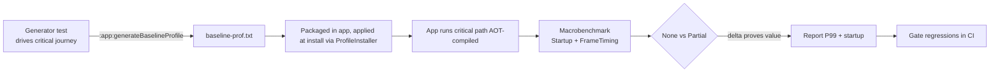

# Lesson 09 — Baseline Profiles & Macrobenchmark

> After this lesson you can generate and ship a **baseline profile** to speed up startup and first-scroll, and use **Macrobenchmark** to measure startup and frame timing with repeatable, CI-able numbers.

**Module:** 11 · **Lesson:** 09 · **Level:** 🟡🔴 · **Est. time:** 80–95 min

---

## 1. Concept

### 🟢 For beginners — *what is it and why do I care?*

When your app first runs, Android executes your code through an **interpreter** and gradually compiles the hot parts to native machine code **as it runs** (Just-In-Time, JIT). So the **first few seconds** — app launch, first screen, first scroll — are the **slowest**, because the most important code hasn't been compiled yet. Users feel this as a sluggish cold start and a janky first scroll.

A **baseline profile** fixes this. It's a list of the exact methods and classes that matter for startup and key journeys. You ship it inside your app; at install time, Android **compiles those methods ahead of time (AOT)**. Now the critical path is already native machine code on the very first launch — startup is faster and the first scroll is smoother, for free, with no code changes to your features.

**Macrobenchmark** is the measuring tool. It launches your *real* app (not a unit test), performs an interaction (cold start, scroll a list), and reports **how long each frame took** and **how long startup took** — as numbers you can compare before and after. It's how you *prove* a baseline profile (or any optimization) actually helped, instead of guessing.

The pairing: **Macrobenchmark measures; baseline profiles improve.** Together they turn "feels faster" into "P99 frame time dropped from 22 ms to 9 ms; cold start dropped 180 ms."

### 🟡 For intermediate devs — *the mechanism*

**Baseline profiles:**
- You define a benchmark that drives the **critical user journey** (launch → land on home → scroll the feed). The **Baseline Profile Gradle plugin** runs it and records which methods executed, producing `baseline-prof.txt`.
- That profile is packaged with the app. **ProfileInstaller** (or Play at install) applies it so those methods are AOT-compiled.
- You generate it with the Gradle task `:app:generateBaselineProfile` (or `generate<Variant>BaselineProfile`).

```kotlin
// The generator: drive the journey you want compiled.
@Test
fun generate() = baselineProfileRule.collect(packageName = "com.example.app") {
    startActivityAndWait()
    device.findObject(By.res("feed_list")).fling(Direction.DOWN)  // exercise first scroll
}
```

**Macrobenchmark:**
- Lives in its own `com.android.test` module. Uses `MacrobenchmarkRule` + UiAutomator to drive the app.
- Metrics: `StartupTimingMetric` (time to initial display) and `FrameTimingMetric` (`frameDurationCpuMs` percentiles — your jank signal).
- `CompilationMode` controls how the app is compiled for the run: `None()` (no AOT), `Partial()` (uses the baseline profile — what you ship), `Full()` (everything AOT — an upper bound). You compare `None()` vs `Partial()` to *prove the baseline profile's value*.
- `StartupMode`: `COLD` (process killed, worst case), `WARM`, `HOT`.

You run benchmarks against a **release-like, non-debuggable, `profileable`** build (Lesson 02) so the numbers reflect production.

### 🔴 For senior devs — *trade-offs, edges, internals*

- **What a baseline profile does and doesn't fix.** It removes **JIT/interpreter** overhead on the **covered** code paths — huge for cold start and first-journey jank. It does **nothing** for steady-state jank caused by unstable composables, overdraw, main-thread stalls, or oversized image decodes (Lessons 03–07). Don't reach for a baseline profile to fix a list that recomposes every frame — fix the recomposition. Match the tool to the symptom.

- **Profile quality = journey coverage.** The profile only AOT-compiles what your generator *exercised*. A generator that just launches and idles produces a thin profile that misses the scroll path. Cover the **real critical journeys** (launch, first scroll, common navigation). But don't over-cover — AOT-compiling everything bloats install size/compile time and dilutes the win; the point is the *hot* path.

- **`CompilationMode.Partial()` is what you measure, because it's what users get.** Benchmarking with `Full()` flatters your numbers (nobody ships fully-AOT) and `None()` is the pessimistic floor. Quote `Partial()` for production-representative timing, and use the `None()`→`Partial()` delta as the *evidence the profile works*.

- **Frame timing is the honest jank metric; report percentiles.** `FrameTimingMetric` gives P50/P90/P99 `frameDurationCpuMs`. Optimize and report **P99** (the worst frames users feel), not the mean — jank is bimodal (Lesson 01). A change that lowers P99 from 24 ms to 10 ms matters even if P50 was already fine.

- **Determinism is everything for CI.** Non-deterministic interactions (random fling distances, network variance, animations mid-measure) make runs incomparable. Pin the scroll (`setGestureMargin`, fixed fling count), disable or account for animations, mock/seed network where possible, and run enough `iterations` to get stable percentiles. Flaky benchmarks get ignored, defeating the purpose.

- **Where it runs.** Prefer a **physical device** or a configured **Gradle-Managed Device (GMD)** for representative numbers; emulators are okay for relative comparisons but not absolute targets. For baseline-profile generation on CI, GMDs with `useConnectedDevices = false` make it reproducible.

- **Regression gating.** The real power is **CI**: capture a baseline, then fail the build if `frameDurationCpuMs` P99 or startup regresses beyond a threshold. This catches a perf regression in review, not in a user's hands. Treat perf budgets like test assertions.

- **Startup metric nuance.** `StartupTimingMetric` measures time-to-initial-display; pair it with `reportFullyDrawn()` in your app so "fully drawn" (data loaded, not just first frame) is also measured — otherwise you optimize the empty shell, not the usable screen.

### Analogy

**Baseline profile = pre-heating the oven and prepping mise en place before service.** Without it, the first orders are slow because the oven's cold and nothing's chopped (JIT warming up). Ship the profile and the kitchen opens **hot and prepped** — the very first dish comes out fast. **Macrobenchmark = the kitchen's ticket-time stopwatch**: it times real orders (cold start, first scroll) and reports the slowest tickets (P99), so you *know* whether prepping the kitchen actually sped up service rather than just hoping it did.

### Mental model

> **Baseline profiles AOT-compile your critical path so the first launch/scroll is fast; Macrobenchmark measures startup and frame timing (P99) on a release-like build to prove it.** Measure `None()` vs `Partial()` to quantify the profile; gate regressions in CI.

### Real-world example

A shopping app's cold start feels slow and the first feed scroll stutters. The team writes a baseline-profile generator covering launch → feed → first fling, ships the profile, and a Macrobenchmark shows cold `timeToInitialDisplay` dropped ~20% and first-scroll P99 `frameDurationCpuMs` fell from 21 ms to 9 ms (`None()` vs `Partial()` confirms the profile is the cause). They wire the benchmark into CI with a P99 budget so a future regression fails the PR.

---

## 2. Visual Learning

**ASCII — first launch, without vs. with a baseline profile:**
```text
WITHOUT baseline profile (JIT warms up):       WITH baseline profile (AOT pre-compiled):
  launch ─▶ interpret ─▶ JIT-compile hot code     launch ─▶ run NATIVE code immediately
            (slow)        (slow first runs)                   (fast first run)
  │■■■■■■■■■■■■■■■■■■| time-to-usable               │■■■■■■■| time-to-usable
   first scroll: janky (uncompiled)                 first scroll: smooth (compiled)
```

**Mermaid — the generate → ship → measure loop:**


**Illustration prompt (paste into an image generator):**
```text
Illustration: a professional kitchen at "opening time". LEFT panel "no baseline profile": a cold
dark oven, unchopped vegetables, a frazzled chef — a stopwatch reads a long time. RIGHT panel
"with baseline profile": a glowing pre-heated oven, neat mise-en-place trays, a calm chef plating
the first dish fast — the stopwatch reads a short time. A large overhead "ticket-time stopwatch"
labeled "Macrobenchmark — P99" presides over both. Caption: "Open hot. Then time it."
Modern, vibrant, clear labels, warm lighting.
```

---

## 3. Code

> These tiers go from a minimal Macrobenchmark, to a baseline-profile generator, to a production CI-gated startup + scroll benchmark proving the profile's value.

### 🟡 Beginner/Intermediate — a startup Macrobenchmark

```kotlin
// macrobenchmark module (com.android.test). Measures COLD startup time.
@RunWith(AndroidJUnit4::class)
class StartupBenchmark {
    @get:Rule val rule = MacrobenchmarkRule()

    @Test
    fun coldStartup() = rule.measureRepeated(
        packageName = "com.example.app",
        metrics = listOf(StartupTimingMetric()),     // time-to-initial-display
        iterations = 10,                              // enough for stable percentiles
        startupMode = StartupMode.COLD,               // worst case: fresh process
        compilationMode = CompilationMode.Partial(),  // production-representative (ships the profile)
    ) {
        pressHome()
        startActivityAndWait()                        // launch + wait for first frame
    }
}
```

**Explanation.** This launches the real app from a cold process 10 times and reports startup timing percentiles. `CompilationMode.Partial()` mirrors what users get (the shipped baseline profile applied). Running it on a release-like build gives a number you can trust and compare across changes.

**Common mistakes.**
```kotlin
// ❌ Benchmarking a debuggable build → slow, unrepresentative numbers.
// ❌ iterations = 1 → noisy; percentiles need repetition.
// ❌ CompilationMode.None() while you actually ship a baseline profile → measures a state no user is in.
```

**Best practices.**
- Run against a **release-like, non-debuggable, `profileable`** build.
- Use enough `iterations` for stable percentiles; measure `StartupMode.COLD` for the worst case.
- Use `CompilationMode.Partial()` to reflect production.

---

### 🔴 Production (a) — generate the baseline profile from the real journey

```kotlin
// baselineprofile module: drive the CRITICAL journey so it gets AOT-compiled.
@RunWith(AndroidJUnit4::class)
class FeedBaselineProfile {
    @get:Rule val rule = BaselineProfileRule()

    @Test
    fun generate() = rule.collect(
        packageName = "com.example.app",
        // Cover startup AND the first scroll — the profile only compiles what you exercise.
        profileBlock = {
            pressHome()
            startActivityAndWait()
            val feed = device.findObject(By.res("feed_list"))
            feed.setGestureMargin(device.displayWidth / 5)   // deterministic gesture
            repeat(3) { feed.fling(Direction.DOWN) }
            feed.fling(Direction.UP)
        },
    )
}
```

```kotlin
// build.gradle.kts (app): wire the plugin so the profile is generated & packaged.
plugins {
    id("androidx.baselineprofile")
}
dependencies {
    baselineProfile(project(":baselineprofile"))
}
// Generate with:  ./gradlew :app:generateBaselineProfile
// On CI with a Gradle-Managed Device, set useConnectedDevices = false in the baselineprofile module.
```

**Explanation.** The generator exercises the journey you want fast — launch *and* the first feed scroll — so `generateBaselineProfile` records exactly those hot methods. The plugin packages the resulting `baseline-prof.txt` into the app; ProfileInstaller applies it at install so that path is AOT-compiled on first run. The deterministic gesture (`setGestureMargin`, fixed flings) keeps generation reproducible.

**Common mistakes.**
```kotlin
// ❌ A generator that only launches and idles → thin profile, first scroll stays janky (not covered).
profileBlock = { startActivityAndWait() }   // missing the scroll journey

// ❌ Over-covering everything (deep navigation through the whole app) → bloated profile, diluted win.
// ❌ Forgetting to package it (no baselineProfile(project(...)) dependency) → profile generated but unused.
```

**Best practices.**
- Cover the **real critical journeys** (launch + first scroll + common nav) — not nothing, not everything.
- Keep gestures **deterministic** for reproducible generation.
- Verify the profile is actually **packaged and applied** (not just generated).

---

### 🔴 Production (b) — prove the win + gate regressions in CI

```kotlin
// Compare None vs Partial to QUANTIFY the baseline profile, and measure first-scroll jank.
@RunWith(AndroidJUnit4::class)
class FeedScrollBenchmark {
    @get:Rule val rule = MacrobenchmarkRule()

    // Run the SAME scenario under both compilation modes → the delta is the profile's value.
    @Test fun scroll_noProfile() = scroll(CompilationMode.None())
    @Test fun scroll_withProfile() = scroll(CompilationMode.Partial())

    private fun scroll(mode: CompilationMode) = rule.measureRepeated(
        packageName = "com.example.app",
        metrics = listOf(FrameTimingMetric()),        // frameDurationCpuMs P50/P90/P99
        iterations = 15,
        startupMode = StartupMode.WARM,
        compilationMode = mode,
    ) {
        startActivityAndWait()
        val feed = device.findObject(By.res("feed_list"))
        feed.setGestureMargin(device.displayWidth / 5)
        repeat(4) { feed.fling(Direction.DOWN); device.waitForIdle() }  // deterministic
    }
}
```

```kotlin
// CI gate (pseudo-config): fail the build if P99 frame time or startup regresses past budget.
// macrobenchmark output (JSON) → parsed in CI:
//   frameDurationCpuMs P99 must be <= 12.0
//   timeToInitialDisplay (COLD) must be <= 600 ms
// A PR that regresses either fails review — perf budget treated like a test assertion.
```

**Explanation.** Running the identical scroll under `None()` and `Partial()` isolates the baseline profile's contribution — the `frameDurationCpuMs` P99 difference *is* the proof it works. `FrameTimingMetric` reports the percentiles you quote (P99 = the worst frames users feel). Feeding the output into a CI gate turns performance into a guardrail: a future change that regresses startup or P99 fails the PR instead of shipping. Determinism (`setGestureMargin`, `waitForIdle`, fixed flings) keeps the numbers comparable run-to-run.

**Common mistakes.**
```kotlin
// ❌ Reporting only the average frameDurationCpuMs → hides the bimodal jank users actually feel.
// ❌ Non-deterministic scrolling (random distances, no waitForIdle) → noisy, uncomparable runs.
// ❌ No CI gate → a regression slips in silently; the benchmark becomes decoration.
```

**Best practices.**
- Compare `None()` vs `Partial()` to **quantify** the profile; quote `Partial()` for production timing.
- Report and gate on **P99** frame time and **COLD** startup, not averages.
- Keep interactions deterministic; run enough iterations for stable percentiles.
- **Gate in CI** so perf regressions fail the build.

---

## 4. Interview Questions

**🟡 Intermediate**

1. *What is a baseline profile and what does it speed up?*
   > A list of classes/methods on your critical path, shipped with the app and **AOT-compiled at install**, so the first launch and first key journeys run as native code instead of being interpreted/JIT-compiled. It speeds up **cold start and first-scroll/journey**, not steady-state behavior.
2. *What does Macrobenchmark measure, and how is it different from a unit test?*
   > It launches the **real app** and drives interactions with UiAutomator, reporting **startup timing** and **frame timing** (`frameDurationCpuMs` percentiles). Unlike a unit test, it measures end-to-end runtime performance on a device, against a release-like build.

**🔴 Senior**

3. *Why benchmark with `CompilationMode.Partial()` rather than `Full()` or `None()`?*
   > `Partial()` applies the baseline profile — exactly what users get — so the numbers are production-representative. `Full()` AOT-compiles everything (flattering, unshipped) and `None()` has no AOT (pessimistic). You quote `Partial()`, and use the `None()`→`Partial()` delta as the evidence the profile actually helps.
4. *A baseline profile didn't fix your list's scroll jank. Why might that be?*
   > Baseline profiles remove JIT/interpreter overhead on covered paths — they don't fix jank from **unstable composables, overdraw, main-thread stalls, or oversized decodes**. If the list recomposes every frame or decodes huge bitmaps, fix *that* (Lessons 03–07). Also, the profile only helps code the generator **exercised** — if it didn't scroll, the scroll path wasn't compiled.
5. *Why report P99 frame time instead of the average, and why is determinism critical?*
   > Jank is bimodal — a few very long frames cause visible hitches even with a low mean, so P99 reflects what users feel. Determinism (fixed flings, `waitForIdle`, seeded data) makes runs comparable; non-deterministic benchmarks produce noisy percentiles that can't detect regressions, so they get ignored.
6. *How do you turn Macrobenchmark into a guardrail rather than a one-off?*
   > Wire it into **CI** with budgets: parse the output and fail the build if P99 `frameDurationCpuMs` or COLD `timeToInitialDisplay` regresses past a threshold. Run on a physical device or GMD for representative numbers. This catches regressions in review instead of in production — perf budgets treated like test assertions.

---

## 5. AI Assistant

**Prompt example (standing up the harness):**
```text
Set up performance measurement for my app (package com.example.app). Targeting Compose 2026 BOM,
Kotlin 2.x. Generate: (1) a baselineprofile module with a BaselineProfileRule generator that covers
launch + first feed scroll (deterministic gestures), wired via the androidx.baselineprofile plugin;
(2) a macrobenchmark module with a StartupTimingMetric COLD test and a FrameTimingMetric scroll test
that runs the SAME scenario under CompilationMode.None() and Partial() to quantify the profile;
(3) the benchmark build type (release-like, non-debuggable, profileable). Report P99, not averages.
```

**AI workflow — where it helps on *this* topic.**
- ✅ Great for: scaffolding the baselineprofile + macrobenchmark modules, the Gradle plugin wiring, the `benchmark` build type, and deterministic UiAutomator interactions.
- ⚠️ Not for: deciding which **journeys** are critical for *your* app, choosing your P99/startup **budgets**, or interpreting whether a delta is meaningful — those need your product/profiling context.

**Review workflow — check AI output against this lesson's *Common Mistakes*:**
- Is the build under test **release-like, non-debuggable, `profileable`**?
- Does the generator cover the **real critical journey** (launch + scroll), and is the profile **packaged**?
- Does it compare **`None()` vs `Partial()`** and report **P99**, not averages?
- Are interactions **deterministic** (`setGestureMargin`, fixed flings, `waitForIdle`) with enough iterations?

**Validation workflow — prove the numbers are real:**
1. Generate the profile (`:app:generateBaselineProfile`) and confirm it's **packaged** in the build.
2. Run the scroll benchmark under `None()` and `Partial()`; confirm `Partial()` improves **P99** — that delta proves the profile.
3. Run the COLD `StartupTimingMetric`; pair with `reportFullyDrawn()` so "usable" is measured, not just first frame.
4. **Gate in CI** with P99/startup budgets; verify a deliberately-regressing change fails.

> **AI drafts, you decide.** AI builds the harness fast; only your measured `None()`→`Partial()` delta and P99 numbers decide whether the optimization shipped a real win.

---

## Recap / Key takeaways

- **Baseline profiles** AOT-compile your **critical path** at install, speeding up **cold start and first journeys** — they don't fix steady-state jank (that's Lessons 03–07).
- A profile only compiles what the **generator exercised**: cover launch + first scroll + common nav, deterministically.
- **Macrobenchmark** measures **startup** and **frame timing** on a **release-like** build; report **P99** `frameDurationCpuMs`, not averages.
- Compare **`CompilationMode.None()` vs `Partial()`** to *quantify* the profile; quote `Partial()` as production-representative.
- Keep interactions **deterministic** and **gate regressions in CI** — perf budgets as test assertions.
- **Macrobenchmark measures; baseline profiles improve** — together they turn "feels faster" into a number.

➡️ Next: **[Module 12 — Jetpack Compose Internals](../module-12-internals/README.md)** — go under the hood: the compiler, the slot table, the snapshot system, and *why* stability and skipping work the way you applied them here.
