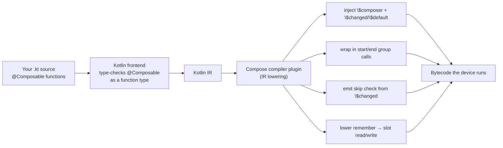

# Lesson 01 — The Compose Compiler

> After this lesson you can explain what the Compose compiler plugin rewrites your `@Composable` functions into — the injected `$composer`, the group calls that wrap every call site, and why a composable's signature is *not* the function you wrote.

**Module:** 12 · **Lesson:** 01 · **Level:** 🟢🟡🔴 · **Est. time:** 75–95 min

---

## 1. Concept

### 🟢 For beginners — *what is it and why do I care?*

You write this:

```kotlin
@Composable
fun Greeting(name: String) {
    Text("Hello $name")
}
```

…but the function the device actually runs is **not** the function you typed. Between your source and the running app sits the **Compose compiler plugin** — a piece of code that hooks into the Kotlin compiler and *rewrites* every `@Composable` function. It adds hidden parameters, wraps your code in bookkeeping calls, and teaches the function how to **remember what it did last time** so it can skip work on the next frame.

Why care? Because almost every "why did this recompose?" or "why didn't `remember` keep my value?" question is answered by **what the compiler generated**. The runtime (next lesson) is the engine; the compiler is the factory that builds engine-compatible parts out of your ordinary-looking Kotlin. Once you can picture the rewritten function, Compose stops being magic and becomes mechanical.

The one idea to hold onto: **`@Composable` is not a normal function annotation — it changes the function's calling convention.** A composable can only be called from another composable because it needs something passed in that only the runtime can provide.

### 🟡 For intermediate devs — *the mechanism*

The Compose compiler is a **Kotlin compiler plugin** (registered via the `org.jetbrains.kotlin.plugin.compose` Gradle plugin since Kotlin 2.0; it ships *with* Kotlin and is version-locked to it). It runs as part of normal `kotlinc`, primarily in the IR (Intermediate Representation) lowering phase, and does four jobs:

1. **Adds an implicit `Composer` parameter** to every `@Composable` function. Your `Greeting(name: String)` becomes, roughly, `Greeting(name: String, $composer: Composer?, $changed: Int)`. The `$composer` is the handle to the runtime's slot table; `$changed` is a bitmask telling the function which parameters changed since last time.
2. **Wraps the body in group calls.** Calls like `$composer.startRestartGroup(key)` … `$composer.endRestartGroup()` bracket the function, and `startReplaceGroup`/`startMovableGroup` bracket conditional and keyed regions. These groups are how the runtime tracks *position* (more in Lessons 02–03).
3. **Generates the skip check.** Using `$changed`, it emits `if (params unchanged && composer.skipping) { composer.skipToGroupEnd() }` so an unchanged composable can bail out without re-executing its body.
4. **Rewrites `remember` and friends** into positional slot reads/writes against `$composer`, and tracks **stability** of types to decide what can be compared (Lesson 05).

A useful mental split: the **frontend** Kotlin compiler still does type-checking on the source you wrote (so `@Composable`-ness is enforced in the type system — a `@Composable` lambda has a different type than a normal lambda). The **backend** plugin then lowers that into the `$composer`-threaded code.

### 🔴 For senior devs — *trade-offs, edges, internals*

The details that matter when you're reading a decompiled build or chasing a recomposition bug:

- **`@Composable` is a *calling-convention* change, enforced by the type system.** The compiler treats `@Composable () -> Unit` as a distinct type from `() -> Unit`; you cannot pass one where the other is expected. This is why you can't call a composable from a regular function, store composables in a generic `List<() -> Unit>` without the annotation, or `map { it() }` over them naively. The annotation is checked in the frontend (it's part of the function type), then realized in the backend as the extra parameters.

- **Two parameter families are injected: `$changed` and `$default`.** `$changed` is a packed `Int` (or several, for many params) where each parameter gets a few bits encoding "same / different / static / uncertain." Default arguments add a `$default` bitmask so the function can decide, per call, whether the caller supplied each argument — which is why a default value can be treated as **static** (compile-time constant) and contribute to skippability.

- **Restart groups are the unit of recomposition.** `startRestartGroup` returns a scope; `endRestartGroup()?.updateScope { … }` registers a **recompose lambda** that the runtime can invoke to re-run *just this function* later. A function whose result depends only on its parameters gets a restart group; functions the compiler proves never need to restart (e.g. inline, or returning a value) may get a *replaceable* group instead. The presence/absence of a restart scope is exactly what determines whether a composable is independently restartable.

- **Skippability and restartability are separate properties the compiler infers.** *Restartable* = "can be re-invoked on its own." *Skippable* = "if its inputs are equal, the runtime may skip its body." A composable that takes an **unstable** parameter is restartable but **not skippable** — every parent recomposition re-runs it. **Strong Skipping** (default since Compose Compiler 1.5.4+ / the 2024+ line, and the standard in 2026) changed this: composables become skippable even with unstable parameters by falling back to **instance (referential) equality** for those params, and lambdas are auto-`remember`ed. This is the single biggest behavioral shift to understand when reading modern generated code.

- **Composable inline functions don't get their own group/composer thread the same way.** `inline` composables (like `Column`, `Row`, `Box` content lambdas) are inlined into the caller, so they don't introduce a separate restart scope — their content recomposes with the caller's scope. This is why wrapping work in a `Column { }` doesn't, by itself, create a skip boundary.

- **Positional keys are structural, not value-based.** The compiler assigns each call site a compile-time **key** derived from its source position (and function identity). Two calls to `Text(...)` at different source locations get different keys; the same call inside a loop gets the *same* key each iteration unless you wrap it in `key(...)`. This is the root cause of "state jumped between rows" bugs (fixed by `key`, Lesson 03).

### Analogy

Think of a **tax-prep service** that rewrites your plain spoken request into an official filing. You say "I earned X, I have a kid" (your `@Composable` function). The service silently attaches **forms and reference numbers** to everything — a tracking ID for your case (`$composer`), checkboxes marking what changed since last year (`$changed`), and a cover sheet noting which fields you left blank so defaults apply (`$default`). You never see the paperwork, but every downstream office (the runtime) relies on it. Submit the same info as last year and they **stamp "no change, skip review"** (`skipToGroupEnd`).

### Mental model

> **The compiler turns each `@Composable` into a "re-runnable, position-aware" function by threading a `$composer` through it and bracketing it with group calls.** Your function's real signature has hidden parameters you never typed.

### Real-world example

You open the **Kotlin bytecode / IR** of a release build to investigate why a `ProductCard` recomposes on every scroll. You find that the generated `ProductCard` has no early `skipToGroupEnd` branch — the compiler couldn't prove its `product: Product` parameter stable, so it never emitted the skip. That single observation (the *missing* skip in the generated code) tells you to make `Product` stable, and the recompositions vanish. Reading the compiler's output is a real debugging tool, not trivia.

---

## 2. Visual Learning

**ASCII — source → rewritten function:**
```text
   YOU WRITE                         COMPILER EMITS (conceptually)
   ─────────                         ─────────────────────────────
   @Composable                       fun Greeting(
   fun Greeting(name) {        ─▶        name: String,
       Text("Hi $name")                  $composer: Composer?,   ← runtime handle
   }                                      $changed: Int           ← what changed bitmask
                                     ) {
                                       $composer.startRestartGroup(key)
                                       if ($changed unchanged && skipping)
                                           $composer.skipToGroupEnd()   ← SKIP path
                                       else
                                           Text("Hi $name", $composer, …) ← real work
                                       $composer.endRestartGroup()
                                           ?.updateScope { Greeting(name, it, $changed) }
                                     }
```

**Mermaid — the compiler plugin in the build pipeline:**


**Illustration prompt (paste into an image generator):**
```text
Illustration: a clean factory conveyor belt. On the left, a plain paper labeled
"@Composable fun" enters a glowing machine labeled "COMPOSE COMPILER PLUGIN".
Inside the machine, robotic arms attach small colored tags to the paper:
a blue tag "$composer", a yellow tag "$changed", a green "group { }" bracket clamp,
and a red "skip?" stamp. On the right, the paper exits as a circuit-board-style
"runnable function" with the tags fused in. Caption: "The function you run is not the
function you wrote." Modern, vibrant, soft studio lighting, clear labels.
```

---

## 3. Code

> You normally **never** write `$composer` by hand — the compiler does. The snippets below show *generated-equivalent* shapes so you can recognize them in decompiled output and reason about skip behavior. Treat the "generated" code as pseudo-Kotlin: real output is bytecode/IR.

### 🟢 Beginner — what your function becomes

```kotlin
// ── What you write ───────────────────────────────────────────
@Composable
fun Label(text: String) {
    Text(text)
}

// ── What the compiler emits (conceptual, simplified) ─────────
fun Label(text: String, $composer: Composer?, $changed: Int) {
    $composer.startRestartGroup(0xA1B2 /* positional key */)
    // bit math elided: did `text` change since last time?
    if ($changed and 0b0011 != 0b0010 || !$composer.skipping) {
        Text(text, $composer, 0)     // do the work; pass composer down
    } else {
        $composer.skipToGroupEnd()   // inputs equal → skip the body
    }
    $composer.endRestartGroup()?.updateScope { c, _ ->
        Label(text, c, $changed or 1)   // how the runtime re-invokes just this fn
    }
}
```

**Explanation.** Every composable is bracketed by `startRestartGroup`/`endRestartGroup`. The `$changed` bitmask lets the function decide between **doing the work** and **`skipToGroupEnd()`**. The `updateScope { … }` lambda is the **recompose handle**: when state read inside `Label` changes, the runtime calls this lambda to re-run *only* `Label`.

**Common mistakes.**
```kotlin
// ❌ Calling a composable from a non-composable function. There is no $composer
//    to pass, so this simply won't compile.
fun renderTitle() {
    Label("Hi")   // error: @Composable invocations can only happen from a @Composable
}
```
The error is not stylistic — `renderTitle` literally has no `$composer` to thread in. The fix is to make the caller `@Composable` (or call it from one).

**Best practices.**
- Treat `@Composable` as "this function needs the runtime threaded through it" — that's why it's call-site restricted.
- Don't try to "escape" the restriction by reflection or lambda tricks; you'll desync the slot table.

---

### 🟡 Intermediate — skippable vs. not (reading the difference)

```kotlin
// Skippable: String is a stable type → compiler emits a skip path.
@Composable
fun PriceTag(label: String, amount: Int) {
    Text("$label: $amount")
}

// NOT skippable (pre-Strong-Skipping): List is unstable, so the compiler
// historically could not prove equality and emitted no skip branch.
@Composable
fun TagList(tags: List<String>) {
    Column { tags.forEach { Text(it) } }
}
```

**Explanation.** `String` and `Int` are stable, so the compiler can compare old vs. new and emit `skipToGroupEnd()` when they're equal — `PriceTag` skips for free. `List<String>` is **unstable** (an interface; an implementation could be a mutable list), so historically `TagList` got *no* skip branch and re-ran on every parent recomposition. With **Strong Skipping** (the 2026 default) `TagList` becomes skippable too, but it compares the `tags` parameter by **instance identity** — pass a *new* list each frame and it still re-runs. The lesson: *which type you pass changes the generated code.*

**Common mistakes.**
```kotlin
// ❌ Allocating a fresh list inline on every call → even with Strong Skipping,
//    a new instance each frame means TagList can't skip.
TagList(tags = items.map { it.name })   // new List instance every recomposition
```
**Best practices.**
- Prefer **stable/immutable** parameter types (`ImmutableList`, `@Immutable` data classes) so the compiler emits structural-equality skips, not identity fallbacks.
- Hoist/`remember` derived collections so you don't hand the composable a brand-new instance each frame.
- Read the **compiler stability report** (Lesson 05 / the `composeCompiler { reportsDestination = … }` option) to see which params the compiler marked unstable.

---

### 🔴 Production — generating & reading the compiler reports

You can't merge "I think it's skippable." You **prove** it by turning on the compiler's metrics. Add this to the module's Gradle (Kotlin DSL), then read the generated `*-composables.txt`.

```kotlin
// build.gradle.kts (Kotlin 2.x — the compose compiler is bundled with Kotlin)
plugins {
    id("org.jetbrains.kotlin.plugin.compose")   // version follows your Kotlin version
}

composeCompiler {
    // Emit per-composable metrics + stability classes for the whole module.
    reportsDestination = layout.buildDirectory.dir("compose_reports")
    metricsDestination = layout.buildDirectory.dir("compose_metrics")
    // Optional: stabilityConfigurationFile = rootProject.file("stability.conf")
}
```

```text
# build/compose_reports/<module>-composables.txt  (excerpt)
restartable skippable scheme("[androidx.compose.ui.UiComposable]") fun PriceTag(
  stable label: String
  stable amount: Int
)
restartable scheme("[androidx.compose.ui.UiComposable]") fun TagList(
  unstable tags: List<String>     # ← the smoking gun: NOT marked skippable here
)
```

**Explanation.** `restartable skippable` means the compiler emitted both a restart scope **and** a skip path — the composable can be re-run alone and skipped when inputs are equal. `PriceTag` qualifies; both params are `stable`. `TagList` is `restartable` but **not** `skippable`, and `tags` is flagged `unstable` — that one word explains a whole class of recomposition problems. (Under Strong Skipping the runtime still *can* skip it via identity, but the report shows why structural skipping isn't available — the type is unstable.)

**Common mistakes.**
```kotlin
// ❌ "Optimizing" by sprinkling remember everywhere without checking the report.
@Composable
fun Screen(user: User) {
    val name = remember(user) { user.fullName() }   // pointless if User is already stable
    // …and useless if the real problem is an unstable param upstream.
}
```
Guessing wastes effort and adds noise. The report tells you *exactly* which parameter is unstable; fix that, don't cargo-cult `remember`.

**Best practices.**
- Turn on **reports + metrics** in CI for performance-sensitive modules; diff them on PRs to catch a newly-introduced `unstable` param.
- Fix instability at the **type** level (make the class `@Immutable`/`@Stable`, use `ImmutableList`, or add a `stabilityConfigurationFile` for types you can't annotate) rather than patching call sites.
- Re-generate after dependency bumps — a library type going from stable to unstable can silently cost you skips.
- Never commit `$composer`-level hacks; influence the compiler through **types and stability config**, the supported levers.

---

## 4. Interview Questions

**🟢 Beginner**

1. *What does the Compose compiler plugin add to a `@Composable` function?*
   > Hidden parameters — chiefly a `Composer` (`$composer`) and a `$changed` bitmask (plus `$default` when there are default args) — and it wraps the body in group calls (`startRestartGroup`/`endRestartGroup`) so the runtime can track position and skip unchanged work.
2. *Why can a `@Composable` function only be called from another `@Composable` function?*
   > Because it needs the `$composer` threaded in, which only the runtime provides. `@Composable` is a calling-convention change enforced by the type system, so a normal function has nothing to pass.

**🟡 Intermediate**

3. *What's the difference between "restartable" and "skippable"?*
   > Restartable = the composable has its own restart scope and can be re-invoked independently. Skippable = if its inputs are equal, the runtime may skip executing its body. A composable can be restartable but not skippable (e.g. an unstable parameter the compiler can't compare structurally).
4. *Why does passing a `List` parameter often hurt skipping, and what changed with Strong Skipping?*
   > `List` is an unstable interface type, so the compiler historically couldn't emit a structural-equality skip and the composable re-ran every parent recomposition. Strong Skipping (the 2026 default) makes such composables skippable by falling back to **referential** equality for unstable params (and auto-remembering lambdas) — so they skip only if you pass the *same instance*, not a freshly allocated one.

**🔴 Senior**

5. *You see a composable in the compiler report marked `restartable` but not `skippable`, with one parameter flagged `unstable`. Walk through what's happening in the generated code and how you'd fix it.*
   > The compiler emitted a restart scope (so it can re-run alone) but **no skip branch**, because it couldn't prove that parameter's equality — an unstable type means a write *might* differ even when `==`, so structural comparison is unsafe. In generated terms, there's no `skipToGroupEnd()` guarded by `$changed` for that param. Fix at the type level: annotate the class `@Immutable`/`@Stable` if its public properties are truly stable, switch a `List` to `ImmutableList`, or add the type to a `stabilityConfigurationFile` if it's third-party. Re-run reports to confirm it flips to `skippable`.
6. *Why don't inline composables like `Column { … }` create a skip boundary around their content?*
   > Because they're `inline` — their content lambda is inlined into the caller, so it doesn't get its own restart group/composer scope. The content recomposes with the caller's scope. To create an independent restart boundary you need a *non-inline* `@Composable` function (its own `startRestartGroup`), which is why extracting work into a separate composable can change skip behavior.
7. *How does the compiler use the `$default` bitmask, and why does it matter for skippability?*
   > For each parameter with a default value, a bit in `$default` records whether the caller supplied an argument. When a default is used, the compiler can treat that value as **static** (a compile-time constant), which counts as "definitely unchanged" and contributes positively to the skip decision — so leaning on stable defaults can make a composable more skippable than passing the same value explicitly through an unstable path.

---

## 5. AI Assistant

**Prompt example (decoding generated/decompiled output):**
```text
Here is the Compose compiler report for a screen (and the relevant composables):
[paste <module>-composables.txt excerpt + the @Composable source]
Target: Kotlin 2.x, Compose 2026 BOM, Strong Skipping ON.
For each composable, tell me: (1) is it restartable and skippable? (2) which params
are unstable and WHY (be specific about the type), (3) the minimal type-level fix
to make it skippable — prefer @Immutable / ImmutableList / stability config over
sprinkling remember. Do not suggest $composer hacks.
```

**AI workflow — where it helps on *this* topic.**
- ✅ Great for: **explaining** a stability report line-by-line, translating a decompiled snippet back into "what behavior to expect," and suggesting which type to annotate.
- ⚠️ Not for: deciding whether a type is *actually* immutable (only you know if a property is mutated under the hood) or hand-editing generated code. AI will confidently call a class stable that secretly holds a `var` — verify against the report, not the model's opinion.

**Review workflow — check AI output against this lesson's *Common Mistakes*:**
- Did it fix instability at the **type level** (`@Immutable`/`@Stable`/`ImmutableList`/stability config) rather than cargo-culting `remember`?
- Did it avoid claiming a composable is skippable without pointing at the report's `skippable` flag?
- Did it remember Strong Skipping uses **referential** equality for unstable params (so a new instance each frame still re-runs)?
- Did it refrain from suggesting you write or edit `$composer` calls directly?

**Validation workflow — prove it actually works:**
1. **Generate reports/metrics** (`composeCompiler { reportsDestination/metricsDestination }`) before and after the change.
2. **Diff the `*-composables.txt`**: confirm the target composable flipped from `restartable` to `restartable skippable` and the param from `unstable` → `stable`.
3. **Decompile** (Android Studio → *Tools ▸ Kotlin ▸ Show Kotlin Bytecode ▸ Decompile*) and verify a `skipToGroupEnd()` branch now exists for that function.
4. **Confirm at runtime** with Layout Inspector recomposition counts (Module 11) — the composable should stop recomposing when its inputs are unchanged.

> **AI drafts, you decide.** The compiler report is ground truth; if the model's explanation contradicts the `unstable`/`skippable` flags, trust the report.

---

## Recap / Key takeaways

- The **Compose compiler plugin** rewrites every `@Composable`: it injects `$composer` (+ `$changed`/`$default`), wraps the body in **group calls**, and emits a **skip check**.
- `@Composable` is a **calling-convention change** enforced by the type system — that's why it's call-site restricted.
- **Restartable ≠ skippable**: a composable can re-run alone yet still execute every time if a parameter is **unstable**.
- **Strong Skipping** (2026 default) makes unstable-param composables skippable via **referential** equality and auto-remembers lambdas — so *new instances each frame* still break skipping.
- You influence the compiler through **types and stability config**, never by touching generated `$composer` code — and you **verify** with the compiler reports + decompiled bytecode.

➡️ Next: **[Lesson 02 — The Runtime & Slot Table](02-runtime-slot-table.md)** — the gap buffer that *is* your UI's memory, and how `$composer` reads and writes it.
