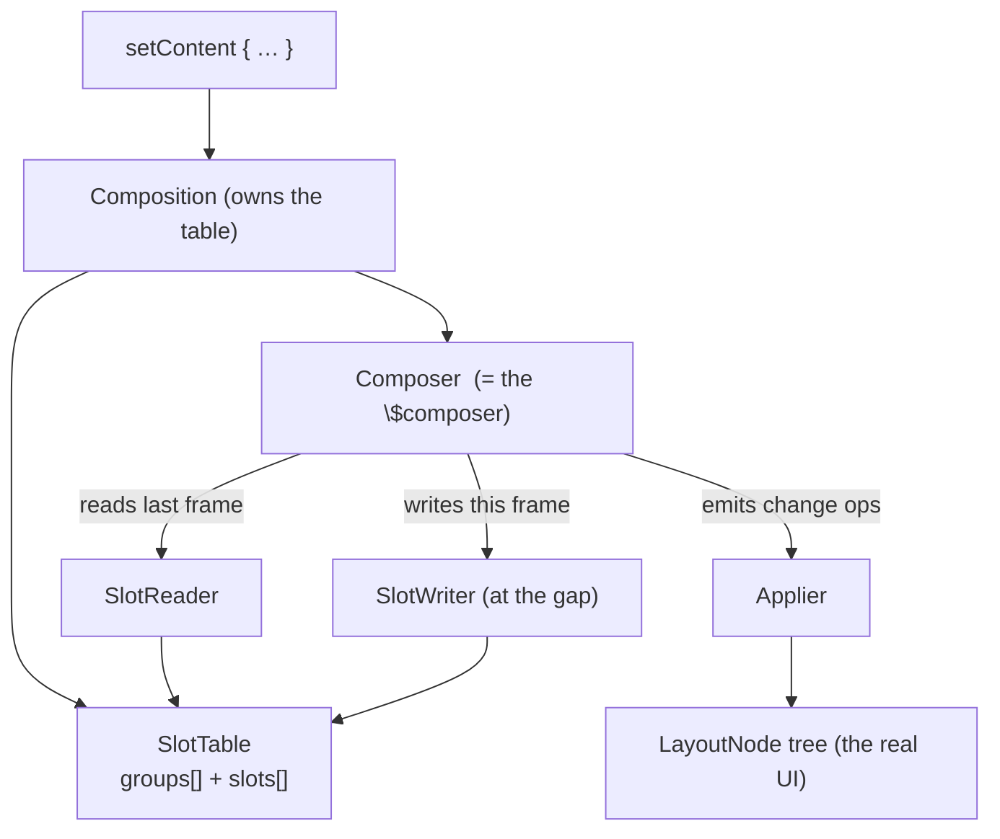

# Lesson 02 — The Runtime & Slot Table

> After this lesson you can explain what the slot table is, why it's a *gap buffer*, how the `Composer` reads and writes it during composition, and how Compose's "memory of the last frame" is physically stored.

**Module:** 12 · **Lesson:** 02 · **Level:** 🟢🟡🔴 · **Est. time:** 80–100 min

---

## 1. Concept

### 🟢 For beginners — *what is it and why do I care?*

When a composable runs, it produces UI — but it also has to **remember things between frames**: the value inside `remember { … }`, which children it created, where each one sits. Where does that memory live? Not in your function's local variables (those vanish when the function returns). It lives in a single big data structure the runtime owns, called the **slot table**.

Picture a very long ribbon of numbered boxes. As your composables run top to bottom, the runtime walks along the ribbon, **writing into the boxes** ("here's a group for `Greeting`," "here's the remembered value `0`," "here's its child `Text`"). On the next frame, it walks the *same* ribbon again, this time **reading** the boxes to recall what was there — and only rewrites the parts that changed.

Why care? Because the slot table is the reason `remember` works, the reason recomposition can be surgical, and the reason a misplaced `if` can make state "jump" between UI elements. Almost every deep Compose behavior is "the runtime walking the slot table." It is Compose's RAM for your UI.

The single idea: **`remember` doesn't store a value in your function — it stores it in the slot table at this exact position.** Same position next frame → same value handed back.

### 🟡 For intermediate devs — *the mechanism*

The runtime has three core players:

- **`Composition`** — the live instance of a composable tree (created by `setContent`). It owns the slot table and a `Composer`.
- **`Composer`** — the cursor/driver. The `$composer` the compiler threaded into your functions (Lesson 01) *is* this object. It reads from one structure and writes to another during a pass.
- **`SlotTable`** — the backing store. It's split into two parallel arrays:
  - a `groups` int-array (structural skeleton: group keys, sizes, parent/child offsets, slot counts), and
  - a `slots` Any?-array (the actual data: remembered values, `State` objects, node references).

A composition pass uses two cursors over that store: a **`SlotReader`** (reads last frame's data) and a **`SlotWriter`** (writes this frame's). The reader/writer model is why composition can compare "what's there" with "what I'm producing now" and only emit changes.

The slot table is a **gap buffer** — the same structure a text editor uses for the cursor. There's a contiguous "gap" of empty space in the array; inserts happen at the gap (O(1) amortized) and the gap *moves* to wherever the writer currently is. This makes the common case — re-running a composable and writing roughly the same shaped data back in the same place — extremely cheap, while still allowing inserts/deletes when the tree changes.

Crucially, the slot table stores the **composition** (the bookkeeping), which is *separate* from the **node tree** (the actual `LayoutNode`s the UI is made of). Composition emits change instructions; an **Applier** applies them to the real node tree. We'll formalize that split in Lesson 07.

### 🔴 For senior devs — *trade-offs, edges, internals*

The details that decide correctness and cost:

- **Two arrays, two reasons.** Keeping structure (`groups`, packed ints) separate from data (`slots`, objects) means the runtime can traverse the *shape* of the tree (skip a whole subtree by reading its group size) without touching every object, and it keeps the hot structural data primitive-packed and cache-friendly. A group's int record encodes its key, whether it has a node, its parent anchor, and the **number of slots and child groups** it spans — so "skip this group" is a pointer jump, not a walk.

- **The gap buffer optimizes the *steady state*.** Frame-to-frame, most compositions re-run with the **same structure**, writing the same number of slots in the same order. The writer's gap sits right where work is happening, so updates are local and allocation-free. Cost appears only when the **shape changes** (a new item, a branch flips), which moves the gap and shifts elements — the analog of typing in the middle of a huge document.

- **Positional memoization lives here.** `remember` is, mechanically, "read the next slot; if this is a fresh group, compute and store; else return the stored value." The "position" is the group's location in the slot table, derived from the compile-time key (Lesson 01) plus runtime structure. This is why moving a `remember` across an `if` boundary, or reordering siblings without `key`, hands back the *wrong* slot — the position changed, so the runtime returns the value that lives at the new position. (Lesson 03 is entirely this.)

- **Anchors give stable references into a moving array.** Because the gap buffer shifts elements, you can't keep a raw index into the table. The runtime uses **`Anchor`** objects that track a logical location and survive moves — that's how a recompose scope, or `movableContentOf`, can point back into the right place even after inserts/deletes elsewhere.

- **`SlotReader`/`SlotWriter` are not concurrently open arbitrarily.** A composition coordinates reader and writer passes; the writer mutates the table, then changes are finalized. Mishandling this is impossible from user code (you don't touch it directly) but it explains why composition is single-threaded per composition and why state writes during composition are routed through snapshots (Lesson 04) rather than mutating the table mid-read.

- **The slot table is not the UI.** It holds composition state. The UI is the **`LayoutNode`** tree built by the **`Applier`** from change operations the composition records. Recomposition can rewrite slot-table data and emit *zero* node changes (e.g. a text value updates a node property without restructuring the tree). Conflating the two leads to wrong mental models of "what recomposition costs."

### Analogy

A **theater stage manager's prompt book**. Down the left margin are numbered cues (the `groups` array — the structure of the show). Beside each cue are the notes for that moment: props in hand, which actor, the line (the `slots` array — the data). Each performance, the stage manager runs a finger down the *same* book (the `SlotReader`) and, where blocking changed, pencils edits in place (the `SlotWriter`). The book has a few **blank pages tucked at the current scene** so inserts don't require recopying the whole binder — that's the **gap**. The book is not the play you watch on stage (the node tree); it's the manager's memory of how to *produce* it.

### Mental model

> **The slot table is Compose's tape of "what I did last frame," indexed by position.** The `Composer` walks it: read the old, write the new, in place. `remember` = "the value parked at this slot."

### Real-world example

A chat screen with a `LazyColumn` of messages. As a new message arrives and the list recomposes, the runtime walks the slot table, finds the groups for existing rows **unchanged** (their structure and remembered values match), and only **inserts** new group/slot records for the new row — the gap buffer absorbs the insert near the write cursor. The 200 old rows aren't recopied; their slot-table records simply stay put. That locality is why adding one item to a long list is cheap.

---

## 2. Visual Learning

**ASCII — the slot table as two parallel arrays with a gap:**
```text
   groups[] (structure: key | size | #slots | parent)        slots[] (data)
   ┌────────┬────────┬────────┬───────────┬───────┐          ┌──────────────┐
   │ App    │ Column │ Text   │  ░ GAP ░  │ Button│  ◀──┐     │ rememberedInt│
   │ k=…    │ k=…    │ k=…    │  (writer  │ k=…   │     │     │ State(query) │
   │ size 9 │ size 6 │ size 2 │   here)   │ size 3│     │     │ node ref →   │
   └────────┴────────┴────────┴───────────┴───────┘     │     └──────────────┘
        │        │        └─ child of Column            │
        │        └─ child of App                        └─ SlotWriter inserts
        └─ root group                                      at the gap → O(1)
```

**Mermaid — Composition, Composer, and the two cursors:**


**Illustration prompt (paste into an image generator):**
```text
Illustration: a long horizontal ribbon of numbered slot-boxes stretching across a
dark studio, glowing teal. The top track of boxes is labeled "GROUPS (structure)";
a parallel lower track is labeled "SLOTS (data: remembered values, state, node refs)".
A bright cursor labeled "Composer" sits mid-ribbon; just ahead of it is a shaded
empty stretch labeled "GAP" where a new box is being slotted in. Faint arrows show
a "SlotReader" finger reading boxes behind the cursor and a "SlotWriter" hand placing
a box into the gap. Off to the right, a separate small tree labeled "LayoutNodes (the
real UI)" is connected by a thin arrow labeled "Applier". Caption: "Compose's memory
of last frame." Modern, vibrant, soft gradients, crisp labels.
```

---

## 3. Code

> You don't allocate or index the slot table yourself — the compiler/runtime do. These examples show the **observable consequences** of how it works, which is what you actually reason about. The last tier uses the low-level `Composer` API (`currentComposer`) only to *demonstrate* the mechanism; you would not ship it.

### 🟢 Beginner — `remember` is a slot, tied to position

```kotlin
@Composable
fun Stamp() {
    // The runtime stores this value in the slot table at THIS position.
    // Same position next frame → the same instance is handed back.
    val createdAt = remember { System.currentTimeMillis() }
    Text("Created at $createdAt")   // never changes on recomposition — it's parked in a slot
}
```

**Explanation.** `remember { … }` runs the lambda **once** (when this group is first created in the slot table) and on every later recomposition returns the parked value from the same slot. The timestamp is fixed for the life of this composable's slot — proof that the value lives in the table, not in the function call.

**Common mistakes.**
```kotlin
// ❌ Expecting a plain local to persist. Locals live on the call stack and die
//    when the function returns; only the slot table survives between frames.
@Composable
fun BadStamp() {
    val createdAt = System.currentTimeMillis()   // recomputed every recomposition
    Text("Created at $createdAt")                 // jumps around, never stable
}
```
**Best practices.**
- If a value must survive recomposition, it must be in a **slot** (`remember`/`rememberSaveable`/`State`), not a bare local.
- Don't put side effects in a `remember` lambda — it runs at slot-creation time, not on a lifecycle you control (use effect APIs).

---

### 🟡 Intermediate — structure decides which slot you get

```kotlin
@Composable
fun Toggle(showFirst: Boolean) {
    if (showFirst) {
        // Group A: gets its own slot for `count`.
        val count = remember { mutableStateOf(0) }
        Counter("First", count)
    } else {
        // Group B: a DIFFERENT slot. Switching branches does not carry `count` over.
        val count = remember { mutableStateOf(0) }
        Counter("Second", count)
    }
}
```

**Explanation.** The `if`/`else` creates two distinct **replaceable groups** in the slot table. Each branch's `remember` parks its `count` in *its own* slot. Flipping `showFirst` tears down one group's slots and builds the other's — which is exactly why the counter resets when you switch. The slot table's structure (which groups exist) determines which remembered value you can possibly get back.

**Common mistakes.**
```kotlin
// ❌ Believing `count` is shared across the branches because it has the same name.
//    Names are irrelevant; POSITION in the slot table is what matters.
```
- Reordering siblings in a list without `key { }` shifts every following item's slots — state appears to "follow position," not identity (the core of Lesson 03).

**Best practices.**
- Reason about **groups and position**, not variable names, when predicting whether state persists.
- If state must survive a structural change (branch flip, reorder), hoist it **above** the changing structure or use `key`/`movableContentOf`.

---

### 🔴 Production — observing the mechanism (diagnostic only)

You rarely touch `Composer` directly, but seeing it once cements the model. Below, a tiny diagnostic composable reads low-level identity to demonstrate that the *same* composition instance and slot identity persist across recompositions — then we contrast with the supported way to express the same intent.

```kotlin
import androidx.compose.runtime.currentCompositeKeyHash
import androidx.compose.runtime.currentComposer

@Composable
fun SlotIdentityProbe(tag: String) {
    // currentCompositeKeyHash: a stable hash of THIS call's position in the table.
    // It stays constant across recompositions of the same slot, and differs per position.
    val positionHash = currentCompositeKeyHash

    // remember keyed on nothing → created once at this slot; survives recomposition.
    val slotBornFrame = remember { FrameClock.now() }

    Text("[$tag] pos=#${positionHash.toString(16)} bornAt=$slotBornFrame")
    // Recompose this 100 times: positionHash and slotBornFrame are constant →
    // both are reading the SAME slot-table location. That's positional memoization.
}
```

```kotlin
// ✅ Supported, idiomatic equivalent of "give this subtree a stable identity slot":
@Composable
fun Items(users: List<User>) {
    Column {
        users.forEach { user ->
            key(user.id) {                 // ties the slot to identity, not position
                UserRow(user)              // state inside survives reorders/inserts
            }
        }
    }
}
```

**Explanation.** `currentCompositeKeyHash` exposes the runtime's **positional key** for the current call site — constant across recompositions of that slot, different per position. Pairing it with a one-time `remember` proves both read the same slot-table location frame after frame: positional memoization in action. The second snippet is what you actually ship — `key(user.id)` overrides *positional* identity with *logical* identity, so each row's slots track the user even when the list reorders (full treatment next lesson).

**Common mistakes.**
```kotlin
// ❌ Reaching into currentComposer to read/write slots manually in production code.
//    You will desynchronize the reader/writer and corrupt the table.
@Composable
fun Hack() {
    val c = currentComposer
    c.startReplaceGroup(123)   // unmatched start/end, hand-rolled keys → undefined behavior
    // …
}
```
- Treating `currentCompositeKeyHash` as a *unique id* (it's a position hash — collisions are possible and it's not meant for keys; use real ids with `key`).

**Best practices.**
- Use **`key(...)`** and **`movableContentOf`** (supported APIs) to control slot identity — never hand-roll `startGroup`/`endGroup`.
- Keep diagnostics (`currentCompositeKeyHash`, recomposition logging) **out of production builds**; they're for understanding, not shipping.
- When you need "this expensive subtree should keep its state as it moves," reach for `movableContentOf` (Module 11) — it relocates slot-table contents wholesale.

---

## 4. Interview Questions

**🟢 Beginner**

1. *What is the slot table?*
   > The runtime data structure that stores a composition's memory between frames — group structure and per-position data (remembered values, `State`, node references). It's how `remember` and recomposition "know" what happened last frame.
2. *Where does the value from `remember { … }` actually live?*
   > In the slot table, at the position of that call — not in the function's local variables. That's why it survives recomposition while a plain local does not.

**🟡 Intermediate**

3. *Why is the slot table implemented as a gap buffer?*
   > Because frame-to-frame the structure is mostly unchanged, so updates happen at one location; a gap buffer keeps free space at the write cursor, making in-place updates and local inserts/deletes O(1) amortized while still supporting structural changes when the tree shape shifts.
4. *What's the difference between the slot table and the LayoutNode tree?*
   > The slot table is the **composition's** bookkeeping (state, structure, positions); the LayoutNode tree is the **actual UI**. The composition records change operations that an Applier applies to the node tree — recomposition can update slots and emit zero node changes.

**🔴 Senior**

5. *Why are groups stored as packed ints separate from the data slots, and what does that buy the runtime?*
   > Structure (`groups`: key, size, slot/child counts, parent anchor) is hot, traversal-heavy, and benefits from primitive packing and cache locality; data (`slots`: arbitrary objects) is accessed only when needed. The split lets the runtime skip an entire subtree by reading a group's size from the int array without touching its objects, and keeps structural traversal allocation-free.
6. *The slot table is a moving array, yet recompose scopes and `movableContentOf` keep stable references into it. How?*
   > Via **`Anchor`** objects: logical handles that track a location and are updated as the gap buffer shifts elements. A raw index would break on any insert/delete; anchors survive moves, which is how a recompose scope re-enters the correct slot and how movable content can be relocated intact.
7. *Mechanically, what does `remember` do against the slot table, and why does moving it across an `if` change its value?*
   > It reads the next slot of the current group; if the group is being created, it computes and stores the value; otherwise it returns the stored one. The "position" is the group's slot-table location (from the compile-time key + runtime structure). Crossing an `if` boundary changes which group/position the call belongs to, so the runtime returns the value parked at the *new* position — i.e., a different (or fresh) slot.

---

## 5. AI Assistant

**Prompt example (predicting state persistence from structure):**
```text
Given this composable, tell me — based on the SLOT TABLE / positional memoization model —
whether `count` survives when `showDetails` flips, and whether reordering the list resets
row state. Explain in terms of groups, positions, and slots (not vague "Compose magic").
Then show the minimal change (hoist / key / movableContentOf) to get the behavior I want:
[paste code + desired behavior]
Target: Compose 2026 BOM, Kotlin 2.x.
```

**AI workflow — where it helps on *this* topic.**
- ✅ Great for: explaining *why* state reset/persisted in a given tree, recommending `key`/hoisting/`movableContentOf`, and turning "it behaves weird" into a structural explanation.
- ⚠️ Not for: writing low-level `Composer`/slot code (models will happily emit unmatched `startGroup`/`endGroup` that corrupts the table). If AI proposes touching `currentComposer`, reject it — that's never the answer in app code.

**Review workflow — check AI output against this lesson's *Common Mistakes*:**
- Did it reason about **position/groups**, not variable names, when claiming state persists?
- For lists, did it use **`key(id)`** (logical identity) instead of relying on order?
- Did it avoid hand-rolling slot/group calls or treating `currentCompositeKeyHash` as a unique id?
- Did it keep diagnostics out of the shipped path?

**Validation workflow — prove it actually works:**
1. **Run the screen** and exercise the structural change (flip the branch / reorder the list); observe whether state persists as predicted.
2. Add a temporary `remember { Any() }` identity probe (or log `currentCompositeKeyHash`) to *see* whether a given subtree kept its slot across the change — then remove it.
3. For lists, toggle ordering and confirm per-row state (scroll offset, expanded flag, text field) tracks the **item**, not the position.
4. Use **Layout Inspector** to confirm the node tree restructured (or didn't) the way your slot-table reasoning predicted.

> **AI drafts, you decide.** If the model's explanation conflicts with "state is parked at a slot identified by position," trust the slot-table model — and verify by actually moving the structure.

---

## Recap / Key takeaways

- The **slot table** is Compose's memory of the last frame: parallel **`groups`** (structure, packed ints) and **`slots`** (data) arrays owned by the `Composition`.
- It's a **gap buffer** — free space at the write cursor makes the steady state (same shape each frame) fast, with O(1) amortized local inserts/deletes when the shape changes.
- `remember` parks a value at a **position** in the table; the `Composer` reads last frame's data (`SlotReader`) and writes this frame's (`SlotWriter`).
- **Position, not name**, decides which remembered value you get — crossing an `if` or reordering siblings without `key` changes the slot.
- The slot table is **not the UI**: composition records changes that an **Applier** turns into `LayoutNode`s. Control identity with **`key`**/**`movableContentOf`**, never raw `Composer` calls.

➡️ Next: **[Lesson 03 — Groups & Positional Memoization](03-groups-positional-memoization.md)** — how the runtime finds last frame's value, and why `key` exists.
