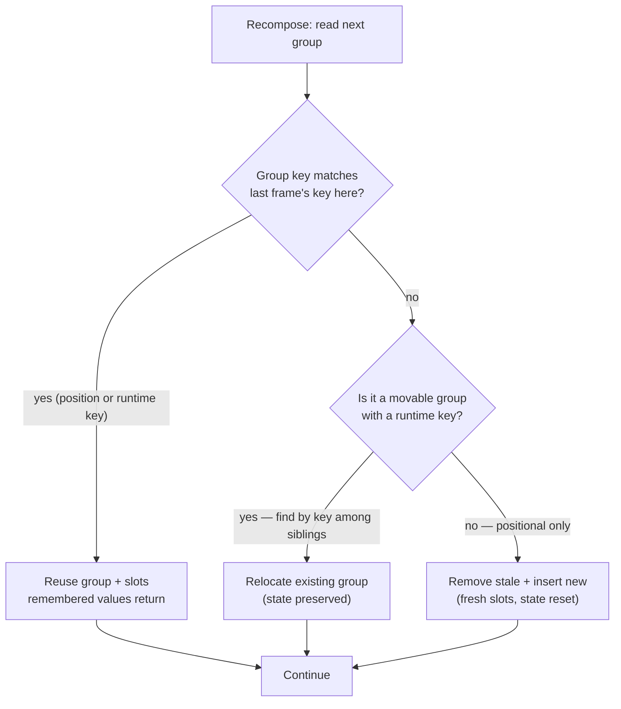

# Lesson 03 — Groups & Positional Memoization

> After this lesson you can explain how Compose locates "last frame's value" by **position**, why state appears to follow position instead of identity, and exactly when and how to use `key { }` and `movableContentOf` to fix it.

**Module:** 12 · **Lesson:** 03 · **Level:** 🟢🟡🔴 · **Est. time:** 80–100 min

---

## 1. Concept

### 🟢 For beginners — *what is it and why do I care?*

In Lesson 02 you learned that remembered values live in the slot table, indexed by **position**. This lesson is about what "position" really means — and the surprising bug it causes.

**Positional memoization** is Compose's rule for matching this frame's composables to last frame's stored values: *"the composable at the same place in the tree gets the same remembered slot."* It's how `remember` knows which value is "yours." Compose doesn't track your composables by name or by `id` — it tracks them by **where they sit** in the call structure.

That's brilliant for performance and 99% invisible — until you have a **list**. Imagine three expandable cards: A (collapsed), B (expanded), C (collapsed). You delete A. Now B slides up into "position 0," C into "position 1." Compose, matching by position, hands position 0's old state (A's "collapsed") to B — so **B suddenly collapses and C loses its scroll**, even though you only deleted A. The state followed the *slot*, not the card.

The fix is to tell Compose "match these by identity, not position" — that's what `key { }` is for. Why care? Because *every* dynamic list, reorderable UI, or tab swap in your career will hit this, and the symptom ("state jumped to the wrong row") is baffling until you understand positional memoization.

The one idea: **by default, state belongs to a position; `key` makes it belong to an identity.**

### 🟡 For intermediate devs — *the mechanism*

The compiler assigns every call site a **group key** from its source position (Lesson 01). At runtime, groups nest to form the tree's structure in the slot table. When a composable re-runs, the runtime walks the **`SlotReader`** and, for each group, asks: *does the key here match the key I stored last frame?*

- **Match** → reuse the existing group and its slots (your `remember`ed values come back). This is positional memoization succeeding.
- **No match** → the structure changed; the runtime **inserts** a new group (fresh slots) and/or **removes** the stale one.

Three group flavors do different jobs:

- **Restart group** — wraps a restartable `@Composable`; can be recomposed independently.
- **Replaceable group** (`startReplaceGroup`) — wraps a region that may be *replaced* wholesale, e.g. each branch of an `if`. Flip the branch and the whole group is swapped (old slots discarded).
- **Movable group** (`startMovableGroup`) — emitted by `key(...)` (and `movableContentOf`). It carries an **explicit runtime key** (your `user.id`) instead of relying purely on position, so the runtime can *match by that key even if it moved*.

So `key(item.id) { Row(item) }` tells the runtime: "this group's identity is `item.id`. If you see the same id next frame — even at a different position — reuse its slots." That's how per-row state (expanded flag, scroll, text field) tracks the item through reorders and inserts.

`LazyColumn`'s `items(list, key = { it.id })` does the same thing for list items: the `key` lambda gives each item a stable identity so add/remove/reorder don't scramble state and animations.

### 🔴 For senior devs — *trade-offs, edges, internals*

The precision points that separate "I sprinkle `key`" from "I know what `key` does":

- **Default identity is structural, derived from compile-time position — not value.** Two calls at different source locations have different keys; the same call in a loop has the **same** compile-time key every iteration, so iterations are distinguished only by **order**. That's the entire reason unkeyed lists bind state to index: nothing else distinguishes iteration 0 from iteration 1.

- **`key(...)` emits a movable group with a runtime key; matching becomes id-based within that parent.** The runtime can find a group by its key among siblings, which lets it **reorder slot-table contents** instead of tearing down and rebuilding. Without it, a reorder is "delete everything from the change point down, re-insert" — losing state and defeating item animations.

- **`movableContentOf` is the heavy-duty version.** `key` keeps a child's state when it moves *among siblings under the same parent*. `movableContentOf` (and `movableContentWithReceiverOf`) lets you move an entire subtree **between different parents / call sites** while preserving its slot-table contents (state, even the underlying nodes). Use it when the same content appears in, say, a `Row` on tablets but a `Column` on phones, and you don't want it to reset across the switch. It's more expensive and rarer than `key` — reach for it deliberately.

- **Keys must be stable and unique among siblings; instability is its own bug.** A key derived from the item's *index* (`key(index)`) is pointless — it *is* the position. A key that changes when unrelated fields change (e.g. hashing the whole object) defeats matching. A duplicate key among siblings is undefined/likely-wrong. Good keys are stable domain identities (`item.id`).

- **`remember(key1)` is a different mechanism — don't confuse them.** `remember(inputs) { … }` recomputes its value when `inputs` change *at the same position*; it does **not** change the composable's identity in the tree. `key(...) { … }` changes the **group identity** of everything inside it. One controls *recompute-on-input-change*; the other controls *which slot you are*. Mixing them up ("I'll use `remember(id)` to fix my list") is a classic mistake — it recomputes a value but doesn't stop state from following position.

- **Over-keying has a cost.** Each `key` group adds structure and prevents the runtime from treating a region as a simple positional sequence; keying things that never move (a fixed header/footer) is wasted bookkeeping. Key the things that **reorder, insert, or move** — not everything.

### Analogy

**Numbered hotel rooms vs. guests.** Positional memoization is housekeeping that cleans "room 204" the same way every day — it tracks **rooms** (positions), not **guests**. If guest A checks out of 204 and guest B is moved from 205 into 204, housekeeping applies "204's standing instructions" (extra towels) to B — wrong, because they were A's preferences. Giving each guest a **loyalty number** (`key = guest.id`) tells the hotel to follow the *guest*: B keeps B's preferences even when their room changes. `movableContentOf` is upgrading the guest to a different floor entirely while their room — furniture and all — travels with them.

### Mental model

> **Unkeyed = "the thing in this slot." Keyed = "the thing with this id, wherever it is."** State follows the slot until you give it an identity.

### Real-world example

A reorderable to-do list with per-row swipe-to-reveal and an inline editing `TextField`. Drag row 3 to the top: with `items(tasks, key = { it.id })`, each row's reveal offset and editing text **travel with the task**; without the key, the row now at the top shows the *previous* top row's half-open swipe and text — state smeared across positions. Same code, one `key` lambda, completely different correctness.

---

## 2. Visual Learning

**ASCII — delete an item: positional vs. keyed:**
```text
   FRAME 1 (A,B,C)            DELETE A            FRAME 2 — UNKEYED (by position)
   pos0: A  state=collapsed                       pos0: B  ← gets A's old slot ⇒ collapsed! ✗
   pos1: B  state=EXPANDED      ─────▶            pos1: C  ← gets B's old slot ⇒ EXPANDED ✗
   pos2: C  state=collapsed                       (state smeared down by one)

                                                  FRAME 2 — KEYED key=id (by identity)
                                                  id=B  state=EXPANDED  ✓ (found by key, moved)
                                                  id=C  state=collapsed ✓
```

**Mermaid — the group-matching decision:**


**Illustration prompt (paste into an image generator):**
```text
Illustration: two side-by-side columns of stacked cards in a clean studio.
LEFT column titled "BY POSITION": three numbered slots (0,1,2); a hand removes the
top card, and the cards below slide up — each card now wears the WRONG glowing
state-badge that belonged to the slot above it (a confused, red-tinted look).
RIGHT column titled "BY KEY (id)": same removal, but each card carries a small
luminous id-tag; the remaining cards keep their OWN green state-badges as they slide,
matched by tag, not slot. Between the columns, a label "key { } follows identity, not position".
Modern, vibrant, soft gradients, crisp labels.
```

---

## 3. Code

### 🟢 Beginner — the bug, then `key`

```kotlin
// ❌ Unkeyed: per-row state follows POSITION, so deleting/reordering smears it.
@Composable
fun TodoListBuggy(tasks: List<Task>) {
    Column {
        tasks.forEach { task ->
            var done by remember { mutableStateOf(false) }   // bound to position!
            TaskRow(task.title, done) { done = !done }
        }
    }
}

// ✅ Keyed: per-row state follows the TASK identity.
@Composable
fun TodoList(tasks: List<Task>) {
    Column {
        tasks.forEach { task ->
            key(task.id) {                                   // movable group, id-based
                var done by remember { mutableStateOf(false) }
                TaskRow(task.title, done) { done = !done }
            }
        }
    }
}
```

**Explanation.** In the buggy version, each iteration's `remember` is distinguished only by **order**, so removing a task shifts every following row's `done` up by one. Wrapping the body in `key(task.id)` gives each row a **runtime identity**; the runtime matches rows by id, so `done` stays with its task through deletes and reorders.

**Common mistakes.**
```kotlin
key(tasks.indexOf(task)) { … }   // ❌ index IS position — keying by it changes nothing
```
**Best practices.**
- Wrap each dynamic row's content in `key(stableDomainId)`.
- Never key by index/position; that's what you're trying to escape.

---

### 🟡 Intermediate — `LazyColumn` keys (and why they also fix animations)

```kotlin
@Composable
fun MessageList(messages: List<Message>, onReact: (String) -> Unit) {
    LazyColumn {
        items(
            items = messages,
            key = { it.id },              // stable identity per item
            contentType = { it.kind },    // bonus: better recycling (Module 11)
        ) { message ->
            // remembered/animated state here now tracks the message across insert/reorder
            var reactionsOpen by rememberSaveable { mutableStateOf(false) }
            MessageRow(
                message = message,
                reactionsOpen = reactionsOpen,
                onToggleReactions = { reactionsOpen = !reactionsOpen },
                modifier = Modifier.animateItem(),   // item animations rely on stable keys
            )
        }
    }
}
```

**Explanation.** `items(key = { it.id })` is positional-memoization control for lazy lists: state (`reactionsOpen`), scroll restoration, and `Modifier.animateItem()` reordering all depend on each item having a **stable identity**. Without the key, inserting a message at the top would visually reset every row's expanded state and break move animations, because Compose would re-bind by position.

**Common mistakes.**
```kotlin
items(messages) { … }                       // ❌ no key → state/anim bound to index
items(messages, key = { it.hashCode() }) {} // ❌ unstable if equals/hashCode covers mutable fields
```
**Best practices.**
- Always pass `key` for lists whose contents can change order/length.
- Use a **stable domain id**; add `contentType` to help recycling, and `Modifier.animateItem()` for free reorder/insert animations.

---

### 🔴 Production — `movableContentOf` to preserve state across a layout switch

`key` keeps state when an item moves among siblings. When the **same subtree** must move between *different parents* (phone `Column` ↔ tablet `Row`) without resetting, use `movableContentOf`.

```kotlin
@Composable
fun AdaptivePlayer(
    isWide: Boolean,
    track: Track,
) {
    // Declare the movable content ONCE. Its slot-table contents (incl. state & nodes)
    // travel with it wherever it's invoked — so switching layouts doesn't reset it.
    val artwork = remember {
        movableContentOf {
            // Stateful subtree: a zoom gesture state we DON'T want to lose on rotation/layout change.
            var zoom by remember { mutableStateOf(1f) }
            AlbumArtwork(
                track = track,
                zoom = zoom,
                onZoom = { zoom = it },
            )
        }
    }

    if (isWide) {
        Row(verticalAlignment = Alignment.CenterVertically) {
            artwork()                 // same content, now under a Row…
            Spacer(Modifier.width(24.dp))
            TrackControls(track)
        }
    } else {
        Column(horizontalAlignment = Alignment.CenterHorizontally) {
            artwork()                 // …and here under a Column — state preserved across the switch
            Spacer(Modifier.height(24.dp))
            TrackControls(track)
        }
    }
}
```

**Explanation.** Normally, moving a composable from a `Row` call site to a `Column` call site is a *different position* → the runtime tears down the old group and builds a new one, **resetting `zoom`**. `movableContentOf` packages the subtree so the runtime **relocates its existing slot-table contents** to the new call site instead of rebuilding — `zoom` (and the underlying nodes) survive the layout switch. This is positional memoization with an explicit "this content is portable" escape hatch.

**Common mistakes.**
```kotlin
// ❌ Re-creating the movable content on every recomposition defeats the point —
//    it must be remembered so the SAME instance is moved.
val artwork = movableContentOf { … }   // not remembered → new each frame, state lost

// ❌ Reaching for movableContentOf when plain `key` (same-parent reorder) suffices —
//    over-engineering; key is cheaper.
```
**Best practices.**
- `remember { movableContentOf { … } }` — always remember it, or it isn't "the same" content to move.
- Use it only for **cross-parent / cross-call-site** moves where you must preserve state or expensive nodes; for same-list reordering, **`key`** is the right, cheaper tool.
- Keep the moved subtree's state genuinely worth preserving (zoom, scroll, playback) — don't add complexity for trivially recreatable UI.

---

## 4. Interview Questions

**🟢 Beginner**

1. *What is positional memoization?*
   > Compose's rule for matching this frame's composables to last frame's stored slots **by their position** in the call tree. It's how `remember` finds "your" value — and why, by default, state is tied to a position rather than an identity.
2. *Why does deleting the first item in an unkeyed list sometimes mess up the other rows' state?*
   > Because state is bound to position. Removing item 0 shifts the rest up, so each row inherits the previous slot's remembered state. Adding a stable `key` per item makes state follow the item's identity instead.

**🟡 Intermediate**

3. *What does `key(id) { … }` actually do at the runtime level?*
   > It emits a **movable group** carrying an explicit runtime key. The runtime can then match that group by id among its siblings — reusing/relocating its slots when the item moves — instead of matching purely by position, which preserves the contained `remember`ed state across reorders and inserts.
4. *What's the difference between `remember(id) { … }` and `key(id) { … }`?*
   > `remember(id)` recomputes a **value** when `id` changes, at the *same* position — it doesn't change identity in the tree. `key(id)` changes the **group identity** of everything inside it. One controls recompute-on-input; the other controls which slot you are. Only `key` stops state from following position.

**🔴 Senior**

5. *When do you reach for `movableContentOf` instead of `key`, and what does it preserve that `key` can't?*
   > `key` preserves state for a child moving **among siblings under the same parent**. `movableContentOf` preserves a subtree's slot-table contents (state and even the underlying nodes) when it moves **between different parents or call sites** — e.g. the same content rendered in a `Row` on wide screens and a `Column` on narrow ones. It must be `remember`ed so the same instance is relocated rather than rebuilt; it's heavier than `key`, so use it only for genuine cross-call-site moves.
6. *Why is keying a list by item index pointless, and what makes a good key?*
   > The index *is* the position positional memoization already uses, so keying by it changes nothing. A good key is a **stable, unique-among-siblings domain identity** (e.g. `item.id`) that doesn't change when unrelated fields mutate and isn't shared by two siblings — anything else either no-ops or breaks matching.
7. *What's the cost of over-keying, and what should you key vs. not key?*
   > Each `key`/movable group adds structural bookkeeping and stops the runtime from treating a region as a plain positional sequence. Key the things that **reorder, insert, remove, or move** (list items, swappable panels); don't key static, never-moving regions (fixed headers/footers) — that's wasted overhead with no correctness benefit.

---

## 5. AI Assistant

**Prompt example (diagnosing smeared list state):**
```text
This list resets/scrambles per-row state (expanded flag + inline TextField text) when I
delete or reorder items. Explain in terms of POSITIONAL MEMOIZATION why it happens, then
fix it with the right tool: `key` for same-parent reordering, or `movableContentOf` if a
subtree moves between different parents. Use stable domain ids, not index. Keep item
animations working (Modifier.animateItem). Target: Compose 2026 BOM, Kotlin 2.x.
[paste code]
```

**AI workflow — where it helps on *this* topic.**
- ✅ Great for: spotting missing `key`s, recommending `items(key = …)` + `contentType`, and explaining the position-vs-identity cause.
- ⚠️ Watch: models frequently "fix" list state with `remember(id)` (wrong mechanism), key by **index**, or over-reach for `movableContentOf` where a simple `key` suffices. They may also forget to `remember { movableContentOf { … } }`.

**Review workflow — check AI output against this lesson's *Common Mistakes*:**
- Did it use **`key(stableId)`** (not index, not `remember(id)`) for the list-state problem?
- For `LazyColumn`, did it pass `key = { it.id }` and preserve `Modifier.animateItem()`?
- If it used `movableContentOf`, is it wrapped in `remember`, and is a cross-parent move actually the case (vs. plain `key` being enough)?
- Are keys **stable and unique** among siblings (not whole-object hashes over mutable fields)?

**Validation workflow — prove it actually works:**
1. **Reorder and delete** items at runtime; confirm each row's expanded flag, swipe offset, scroll, and TextField text track the **item**, not the slot.
2. Insert an item at the **top**; verify no other row visually resets and move/insert animations play.
3. For `movableContentOf`, switch the layout (rotate / resize to the other breakpoint) and confirm the preserved state (zoom/scroll/playback) survives the switch; remove the `remember` temporarily to *see* it break, then restore.
4. With **Layout Inspector**, confirm the runtime relocated groups (state preserved) rather than rebuilding (state reset).

> **AI drafts, you decide.** If the model proposes `remember(id)` or index keys for a list-state bug, that's the tell it doesn't grasp positional memoization — route it back to `key`/`movableContentOf`.

---

## Recap / Key takeaways

- **Positional memoization** matches composables to stored slots by **position**; that's why unkeyed list state follows the slot, not the item.
- Groups come in **restart / replaceable / movable** flavors; `key(...)` emits a **movable group** with a runtime id so the runtime matches by **identity**, preserving state across reorders/inserts.
- `LazyColumn` `items(key = { it.id })` is the same lever for lazy lists — and it's what makes per-item state, scroll restoration, and `animateItem()` correct.
- `remember(id)` (recompute value) is **not** `key(id)` (change identity) — don't confuse them.
- `movableContentOf` (always `remember`ed) preserves a subtree's state/nodes across **cross-parent** moves; use `key` for cheaper same-parent reordering, and don't over-key static regions.

➡️ Next: **[Lesson 04 — The Snapshot System](04-snapshot-system.md)** — MVCC for state: how reads subscribe, writes stay isolated, and changes are applied atomically.
