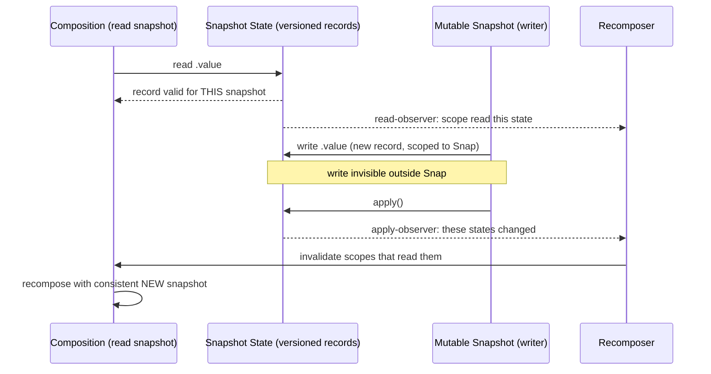

# Lesson 04 — The Snapshot System

> After this lesson you can explain how Compose's snapshot system gives state **MVCC-style isolation** — how a state *read* records a subscription, how a *write* stays invisible until **apply**, and why this is what makes recomposition correct and thread-safe.

**Module:** 12 · **Lesson:** 04 · **Level:** 🟢🟡🔴 · **Est. time:** 90–110 min

---

## 1. Concept

### 🟢 For beginners — *what is it and why do I care?*

You already know (Module 03) that reading state *subscribes* and writing it *recomposes*. The **snapshot system** is the machinery that makes that true — and makes it safe.

Here's the problem it solves. Composition reads lots of state to build the UI. Meanwhile, a background coroutine might be writing new state at the same time. If composition saw values **changing mid-build**, it could render a half-updated, inconsistent screen ("loading is false but the data isn't there yet"). The snapshot system prevents that by giving each piece of work a **consistent, frozen view of all state** — a *snapshot* — like a photograph. Composition reads from its photograph; nothing it sees changes underneath it.

When you write state, you're not editing the shared value directly. You're scribbling on **your own copy**. Only when you **apply** (commit) your snapshot do those changes become visible to everyone else — atomically, all at once. Think "save your edits," not "type directly into the live document."

Why care? This is *why* `mutableStateOf` is safe to read in composition and write from anywhere, why you don't get torn UI, and why Compose can move work off the main thread without locks everywhere. It's the quiet foundation under all of state management.

The one idea: **state lives in versioned snapshots; you read a consistent view and your writes are private until you apply them.**

### 🟡 For intermediate devs — *the mechanism*

A **`Snapshot`** is an isolated view of all snapshot state at a point in time. Compose state objects (`mutableStateOf`, `mutableStateListOf`, etc.) don't hold a single value — they hold a **linked list of versioned records**, one per snapshot that wrote them. When you read `state.value`, the system returns the record **valid for your current snapshot** (the newest one your snapshot is allowed to see). This is **Multi-Version Concurrency Control (MVCC)** — the same idea databases use so readers never block writers.

Two snapshot kinds matter:

- **Read-only snapshot** — a frozen view; you can read but not write. Composition takes one so the whole pass sees a consistent world.
- **Mutable snapshot** — you can write; changes are recorded in **new records** scoped to *this* snapshot and are invisible outside it until `snapshot.apply()`.

Two observers wire state to the runtime:

1. **Read observer** — while composition reads state, the system records *which state each scope read*. That's the subscription that drives recomposition. (`Snapshot.takeMutableSnapshot(readObserver, writeObserver)` and `Snapshot.observe { … }` are the hooks; the Compose runtime sets these up for you.)
2. **Write observer / global apply observer** — when a snapshot applies, the system notifies observers which state objects changed, so the `Recomposer` can invalidate the scopes that read them.

The everyday `state.value = x` you write outside an explicit snapshot goes through the **global snapshot**, which is advanced and its changes broadcast via `Snapshot.sendApplyNotifications()` (the runtime calls this on the frame clock). That's the bridge from "I wrote a value" to "the readers get invalidated."

### 🔴 For senior devs — *trade-offs, edges, internals*

The details that decide correctness, performance, and concurrency:

- **MVCC via per-record versioning.** Each state object holds `StateRecord`s tagged with a snapshot id. Reading resolves to the highest-id record `≤` your snapshot's id that isn't invalid for you. Writing in a mutable snapshot either reuses a record already owned by that snapshot or **creates a new one**. Old records are garbage-collected once no live snapshot can see them. This is why reads are cheap and lock-free and why a long-lived snapshot can pin memory (it keeps old records alive).

- **Isolation = no torn reads, ever.** Within one snapshot, the set of values is **internally consistent**: you can read ten interdependent states and they all reflect the same logical moment. Composition relies on this to avoid rendering impossible combinations even while other threads write. It's the lower-level guarantee that "one immutable `UiState`" (Module 03/13) gives at the app layer.

- **Apply can conflict — and the policy decides.** Two mutable snapshots that both modified the *same* state object **conflict** on apply. The result depends on the state's **`SnapshotMutationPolicy`**: `structuralEqualityPolicy` (default) treats writes equal by `==` as non-conflicting; a custom policy can *merge* changes (e.g. `mutableStateListOf` and `SnapshotStateMap` define merge semantics so concurrent independent edits can both succeed). Unresolvable conflicts make `apply()` return `SnapshotApplyResult.Failure`, and the snapshot is discarded — the caller must retry. App code rarely sees this because most writes go through the single global snapshot, but it's the foundation of safe concurrent state.

- **Nested & transparent snapshots.** Snapshots nest: a child mutable snapshot's apply merges into its parent, not straight to global. The runtime uses this so a composition can speculatively build, and so effects/derivations compose. `derivedStateOf` (Module 03) is built on snapshot reads: it records the states its calculation reads and only recomputes/invalidates when *those* change — implemented with the same read-observer machinery.

- **`Snapshot.withMutableSnapshot { }` for atomic multi-state writes.** Wrapping several writes in one mutable snapshot makes them **all-or-nothing and atomically visible** — readers never see a partial update across the batch. This is the precise tool when several `State`s must change together and you're *not* funneling them through a single `UiState` object.

- **Thread-safety model.** Snapshot state is safe to **read** from any thread (each gets a consistent view) and safe to **write** from background threads *as long as* you respect snapshot boundaries (e.g. enter a snapshot, write, apply). The classic bug is mutating snapshot state from a background thread and expecting the main-thread composition to see it without an apply/notification — it won't until apply notifications run. Compose's own dispatch handles the main-thread case; for manual background writes use a mutable snapshot and `apply()`.

- **Snapshots are not React's virtual DOM.** No diffing of a shadow tree; it's transactional *state* versioning. Recomposition invalidation comes from **recorded reads**, not from comparing two renderings.

### Analogy

A **database transaction (MVCC)**. When you `BEGIN`, you get a consistent view of the whole database as of that instant; other transactions' uncommitted writes are invisible to you, and yours are invisible to them. You make changes in your transaction's private space and `COMMIT` to publish them atomically. If two transactions edited the same row, the database either merges or makes one fail to commit (retry). Compose state **is** this, applied to UI: composition is a read transaction over a consistent snapshot; a write is a tiny transaction you commit (`apply`).

### Mental model

> **Read a snapshot = read a consistent photo of all state; write = scribble on your private copy; apply = publish atomically.** Recomposition fires because the system *recorded which photo cells each scope read*.

### Real-world example

A form screen updates three fields (`firstName`, `lastName`, `fullName`) where `fullName` must equal the other two combined. A background validation coroutine reads them while the user types. Thanks to snapshot isolation, the validator never sees `firstName` updated but `lastName` stale within one read; and if you wrap the three writes in `Snapshot.withMutableSnapshot { … }`, every reader sees either all-old or all-new — never a torn in-between. No locks, no half-updated UI.

---

## 2. Visual Learning

**ASCII — read consistent view, write private, apply publishes:**
```text
   GLOBAL STATE (versioned records per state object)
        firstName: [v1 "Ada"]   lastName: [v1 "L"]   fullName: [v1 "Ada L"]
                         ▲ reads resolve to newest record ≤ my snapshot id
   ┌──────────────── Snapshot A (composition, read-only) ────────────────┐
   │  reads firstName,lastName,fullName  →  sees a CONSISTENT photo (v1)  │
   │  read-observer records: "scope X read firstName, lastName, fullName" │
   └─────────────────────────────────────────────────────────────────────┘
   ┌──────────────── Snapshot B (mutable, the typist) ───────────────────┐
   │  writes firstName="Ada ", lastName="Lovelace", fullName="Ada Lovelace"│
   │  → new records v2 visible ONLY inside B                              │
   │  B.apply()  ─────────────▶ publish v2 atomically + notify observers   │
   └─────────────────────────────────────────────────────────────────────┘
                                  │
                                  ▼  Recomposer invalidates scope X (it read those states)
```

**Mermaid — the read/write/apply lifecycle:**


**Illustration prompt (paste into an image generator):**
```text
Illustration: a split scene styled like a glowing database. In the center, stacks of
translucent "record cards" float for each state variable, each card tagged with a version
number (v1, v2). On the LEFT, a figure labeled "Composition" looks through a camera that
freezes a single consistent layer of v1 cards — a thought-bubble shows the recorded reads
("read: firstName, lastName"). On the RIGHT, a figure labeled "Writer" scribbles on a
PRIVATE copy (v2 cards in a sealed glass box labeled "Mutable Snapshot — invisible until
apply"). A big lever labeled "apply()" publishes the v2 cards into the center stack, and
sparks fly to a small gear labeled "Recomposer → invalidate readers". Caption:
"MVCC for UI state." Modern, vibrant, soft gradients, crisp labels.
```

---

## 3. Code

### 🟢 Beginner — read subscribes, write notifies (no snapshot API needed)

```kotlin
@Composable
fun NameBadge() {
    // mutableStateOf is snapshot state. Reading .value here records a subscription.
    var name by remember { mutableStateOf("Ada") }

    Column {
        Text("Hello, $name")                      // read → this scope subscribes
        Button(onClick = { name = "Grace" }) {    // write → global snapshot advances → notify
            Text("Rename")
        }
    }
}
```

**Explanation.** You never touch the snapshot system explicitly here — but it's doing all the work. Reading `name` in `Text` registers this scope as a reader (via the read observer the runtime installed). The button's write goes through the global snapshot; when apply notifications fire on the frame clock, the system tells the `Recomposer` that `name` changed, and only the reading scope recomposes.

**Common mistakes.**
```kotlin
// ❌ Mutating a non-snapshot field and expecting recomposition.
class Holder { var name = "Ada" }                 // plain field, not snapshot state
val holder = remember { Holder() }
Button(onClick = { holder.name = "Grace" }) { … } // no record, no read-tracking → nothing recomposes
```
**Best practices.**
- UI-driving data must be **snapshot state** (`mutableStateOf`/`mutableStateListOf`/…), or the system can't track reads/writes.
- Read state where it's displayed so the *right* (smallest) scope subscribes.

---

### 🟡 Intermediate — atomic multi-state writes with `withMutableSnapshot`

```kotlin
class NameState {
    var first by mutableStateOf("Ada")
    var last by mutableStateOf("Lovelace")
    var full by mutableStateOf("Ada Lovelace")
}

fun NameState.rename(newFirst: String, newLast: String) {
    // All three writes become visible to readers atomically — never a torn combination.
    Snapshot.withMutableSnapshot {
        first = newFirst
        last = newLast
        full = "$newFirst $newLast"
    }
}
```

**Explanation.** Without the snapshot wrapper, a reader (composition, or a background validator) could observe `first` updated but `full` still stale for a frame — a torn read. `Snapshot.withMutableSnapshot { }` opens a mutable snapshot, runs all three writes inside it, and applies once: every observer sees **either all-old or all-new**. This is the precise tool when several states must move together and you're not already funneling them through one `UiState`.

**Common mistakes.**
```kotlin
// ❌ Three separate writes outside a snapshot → observers can see an inconsistent mix.
first = newFirst
last  = newLast
full  = "$newFirst $newLast"   // for one frame, `full` may disagree with first/last
```
**Best practices.**
- When several `State`s have an invariant between them, write them in one `withMutableSnapshot { }` (or model them as one immutable object).
- Prefer a single immutable `UiState` at the app layer; use explicit snapshots for lower-level, local invariants.

---

### 🔴 Production — background writes + observing changes (custom integration)

Two senior-grade tools: writing snapshot state safely from a **background thread**, and using the **global apply observer** to react to state changes (e.g. autosave) outside composition.

```kotlin
// (1) Background write that the main thread will see, via an explicit mutable snapshot.
suspend fun importContacts(state: ContactsState, repo: ContactsRepo) = withContext(Dispatchers.IO) {
    val fresh = repo.fetch()                       // heavy work off the main thread
    Snapshot.withMutableSnapshot {                 // enter a snapshot to write state safely
        state.items = fresh.toImmutableList()      // applied atomically; observers notified
        state.lastSync = Clock.System.now()
    }
    // No manual sendApplyNotifications() needed: withMutableSnapshot applies + notifies.
}

// (2) React to ANY snapshot apply (e.g. autosave a draft) without being in composition.
fun observeForAutosave(scope: CoroutineScope, draft: DraftState, save: suspend (DraftState) -> Unit) {
    val handle = Snapshot.registerApplyObserver { changedStates, _ ->
        // changedStates is the set of state objects modified by the applied snapshot.
        if (draft.bodyState in changedStates || draft.titleState in changedStates) {
            scope.launch { save(draft) }
        }
    }
    // Remember to dispose: handle.dispose() when the scope ends.
}
```

**Explanation.** (1) Background writes are safe **inside a mutable snapshot**: open it, write, let `apply()` publish atomically and fire notifications so the main-thread composition invalidates correctly — no locks, no torn UI. (2) `registerApplyObserver` is the low-level hook the runtime itself uses: it hands you the **set of state objects that changed** on every apply, letting you trigger work (autosave, logging, analytics) from outside the composition. You must `dispose()` the handle to avoid leaks.

**Common mistakes.**
```kotlin
// ❌ Mutating snapshot state on a background thread WITHOUT a snapshot, then assuming
//    composition sees it immediately. Until apply/notifications run, it may not — and
//    you've also lost atomicity across multiple writes.
withContext(Dispatchers.IO) { state.items = fresh }   // no snapshot boundary
```
```kotlin
// ❌ Registering an apply observer and never disposing it → permanent global callback (leak).
Snapshot.registerApplyObserver { _, _ -> /* … */ }    // handle dropped, never disposed
```
**Best practices.**
- Wrap **background writes** in `Snapshot.withMutableSnapshot { }` (or write on the main thread); never assume cross-thread visibility without an apply.
- Always **`dispose()`** observer/read handles you register; tie them to a lifecycle/scope.
- Prefer routing state through a ViewModel `StateFlow`/`UiState` for app code — reserve raw snapshot APIs for libraries, custom state holders, and genuinely atomic multi-write cases.

---

## 4. Interview Questions

**🟢 Beginner**

1. *What does the snapshot system give you when composition reads state?*
   > A **consistent, isolated view** of all state for that pass (a snapshot), plus **read tracking** — the system records which state each scope read, which is the subscription that later triggers recomposition. Composition never sees values change mid-build.
2. *When you write `state.value = x` in a click handler, why does the UI update?*
   > The write goes through the global snapshot; on the frame clock the system sends apply notifications listing the changed state, and the `Recomposer` invalidates the scopes that read it, so they recompose with the new value.

**🟡 Intermediate**

3. *Why is the snapshot system described as MVCC?*
   > Each state object keeps **multiple versioned records**, one per snapshot that wrote it. A read resolves to the record valid for the reader's snapshot, so readers never block writers and never see uncommitted changes — exactly like database MVCC. Writes create new records that are private until apply.
4. *When would you use `Snapshot.withMutableSnapshot { }`?*
   > When several `State` objects share an invariant and must change **atomically**, so no reader (composition or a background thread) can observe a torn, partially-updated combination. All writes inside it become visible together on apply.

**🔴 Senior**

5. *Two mutable snapshots both modified the same state object. What happens on apply, and what controls the outcome?*
   > It's a **conflict**, resolved by the state's `SnapshotMutationPolicy`. With the default `structuralEqualityPolicy`, writes that are `==` don't conflict; collection states (`mutableStateListOf`, `SnapshotStateMap`) define **merge** semantics so independent edits can both apply. If the conflict can't be resolved, `apply()` returns `Failure`, the snapshot is discarded, and the caller must retry. App code rarely hits this because most writes go through the single global snapshot.
6. *How can a long-lived snapshot cause a memory problem?*
   > Because of MVCC: old `StateRecord`s can only be garbage-collected once **no live snapshot** can still see them. A snapshot held open (e.g. never applied/disposed) pins those old versions, preventing reclamation — a leak of historical state records. Take, apply (or dispose), and don't hold snapshots across long operations.
7. *How do you safely write snapshot state from a background thread so composition sees a consistent result?*
   > Enter a **mutable snapshot** (`Snapshot.withMutableSnapshot { … }`), perform the writes, and let `apply()` publish them atomically and fire notifications. Don't mutate snapshot state on a background thread *without* a snapshot boundary and expect immediate, consistent visibility on the main thread — visibility happens at apply, and you'd also lose atomicity across multiple writes.

---

## 5. AI Assistant

**Prompt example (atomic state + thread safety):**
```text
I have three related States (first, last, full) that must stay consistent, and a background
coroutine that both writes them after a network fetch and is read during composition.
Using Compose's SNAPSHOT system, show how to: (1) make the three writes atomic so readers
never see a torn combination, and (2) perform the background write safely so the main-thread
composition observes a consistent result. Explain in terms of snapshots/apply/MVCC. Target:
Compose 2026 BOM, Kotlin 2.x, Coroutines. Don't introduce locks.
[paste code]
```

**AI workflow — where it helps on *this* topic.**
- ✅ Great for: explaining read-tracking/MVCC, recommending `withMutableSnapshot` for atomic writes, and structuring background writes correctly.
- ⚠️ Not for: blindly reaching for `synchronized`/`Mutex` (defeats the lock-free design), or claiming a plain class field will trigger recomposition. Models also forget to **dispose** apply/read observers and sometimes call `sendApplyNotifications()` manually where `withMutableSnapshot` already handles it.

**Review workflow — check AI output against this lesson's *Common Mistakes*:**
- Is UI-driving data **snapshot state**, not a plain field?
- Are multi-state writes wrapped in **one** `withMutableSnapshot { }` when an invariant exists?
- Are background writes inside a **snapshot boundary** (not raw cross-thread mutation)?
- Are any registered **observers disposed**? Did it avoid adding locks that fight the snapshot model?

**Validation workflow — prove it actually works:**
1. **Stress the invariant**: trigger rapid writes + a concurrent reader; assert no frame shows a torn combination (log the trio together; they must always agree).
2. **Background path**: run the IO write; confirm the UI updates *after* apply, consistently — not partially.
3. **Conflict/policy** (library code): unit-test two snapshots editing the same state to see your policy/merge behavior, including the `Failure`+retry path.
4. **Leak check**: verify every `registerApplyObserver`/read handle is `dispose()`d (LeakCanary / a lifecycle test); confirm no snapshot is held open across long operations.

> **AI drafts, you decide.** If the model adds a lock or a plain mutable field "to be safe," that's the tell it didn't reach for snapshots — route it back to `mutableStateOf` + `withMutableSnapshot`.

---

## Recap / Key takeaways

- The **snapshot system** gives state **MVCC isolation**: each state object keeps **versioned records**, and every read sees a **consistent view** — no torn UI.
- A **read records a subscription** (read observer); a **write** creates private records visible only after **`apply()`**, which **notifies** the `Recomposer` to invalidate readers.
- Everyday `state.value = x` goes through the **global snapshot**, broadcast via apply notifications on the frame clock.
- Use **`Snapshot.withMutableSnapshot { }`** for **atomic multi-state writes**; wrap **background writes** in a snapshot so the main thread sees a consistent result.
- Apply **conflicts** are resolved by **`SnapshotMutationPolicy`** (default structural equality; collections merge); long-held snapshots **pin old records** (a leak), and registered observers must be **disposed**.

➡️ Next: **[Lesson 05 — Stability & Immutability](05-stability-immutability.md)** — `@Stable`/`@Immutable`, the inference rules, and why the compiler marks `List` unstable but `ImmutableList` stable.
