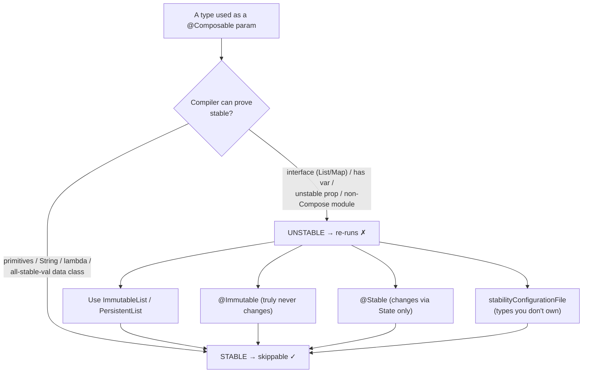

# Lesson 05 — Stability & Immutability

> After this lesson you can explain exactly what "stable" means to the Compose compiler, how stability is **inferred** (and when it can't be), the difference between `@Stable` and `@Immutable`, and why `List` is unstable but `ImmutableList` is stable.

**Module:** 12 · **Lesson:** 05 · **Level:** 🟢🟡🔴 · **Est. time:** 90–110 min

---

## 1. Concept

### 🟢 For beginners — *what is it and why do I care?*

Compose wants to do as little work as possible. When a parent recomposes, Compose would love to **skip** any child whose inputs haven't changed. But to skip a child, it must answer one question: *"are this child's parameters the same as last time?"*

A type is **stable** if Compose can trust the answer to that question. Concretely, stable means two promises:

1. If the type says it's `equals` to a previous value, Compose can trust that its **visible content didn't change**.
2. Its public properties **won't change without Compose being told** (i.e., they're either immutable or made of Compose's own observable `State`).

If a type keeps those promises, Compose marks it **stable** and can skip composables that take it. If a type might **silently mutate** behind Compose's back (like a plain `ArrayList` someone could `.add()` to without notice), Compose marks it **unstable** and refuses to skip — it re-runs the composable every time, just to be safe.

Why care? "Stable vs. unstable" is the *number one* lever for recomposition performance. A single unstable parameter on a hot composable can make it re-run on every frame. Most "my list scrolls janky / my screen recomposes constantly" problems trace back to a type the compiler couldn't trust.

The one idea: **stable = "I promise I won't change without telling you, and my `equals` is meaningful." Compose only skips work it can trust.**

### 🟡 For intermediate devs — *the mechanism*

The compiler classifies every type as **stable**, **unstable**, or (for generics) **conditionally stable**, and writes the verdict into the stability report (Lesson 01).

**What's stable by default:**
- Primitives (`Int`, `Boolean`, `Float`, …), `String`, and function types (lambdas).
- Enums and types with only stable, `val` properties of stable types.
- Types Compose owns and trusts, including `State`/`MutableState` (its mutations *are* the notification channel).

**What's unstable by default:**
- **Interfaces and abstract types** the compiler can't see into — `List`, `Map`, `Set`, `Flow`, `LocalDateTime` from other modules, etc. The declared type `List<T>` *could* be backed by a mutable `ArrayList`, so the compiler must assume the worst.
- `data class`es with any `var`, or any property of an unstable type.
- Types from **other modules that weren't compiled with the Compose compiler** (it can't infer them, so it assumes unstable) — a frequent surprise with domain models in a non-Compose `:core` module.

**How you fix instability:**
- `@Immutable` — a stronger promise: *all* public properties are `val` and won't change after construction; deep content is constant. Use for value objects (`Money`, `Theme`, a fully-immutable `data class`).
- `@Stable` — a weaker promise: the instance's identity is stable and *if* properties change, they do so through Compose `State` (so reads are tracked). Use for holders that contain `State`.
- Swap `List` → `kotlinx.collections.immutable.ImmutableList`/`PersistentList`, which are annotated stable.
- For third-party types you can't annotate, add a **stability configuration file** (`composeCompiler { stabilityConfigurationFile = … }`) listing class names to treat as stable.

The payoff is **skippability** (Lesson 06): stable params let the compiler emit the skip branch; unstable params don't (or fall back to identity under Strong Skipping).

### 🔴 For senior devs — *trade-offs, edges, internals*

The decisions that matter at scale:

- **`@Immutable` vs `@Stable` is a contract about *how change happens*, not just whether it does.** `@Immutable`: the object never changes after construction — `equals` is fully meaningful and Compose can compare structurally and skip aggressively. `@Stable`: the object *may* change, but **only via Compose `State`**, and its `equals`/`hashCode` are consistent. Both make the type skippable; the difference is whether mutation is allowed (and, if so, that it must flow through tracked `State`). **Lying** in either annotation (mutating a field outside `State`) causes *missed recompositions* — the worst class of Compose bug, because the UI silently shows stale data.

- **Stability is transitive and structural.** A `data class` is stable only if **every** public property's type is stable. One `List<String>` field, or one property of an un-annotated cross-module type, taints the whole class. This is why a seemingly trivial model is reported `unstable`: trace the *property*, not the class.

- **Generics are conditionally stable.** `Box<T>` can be stable *for stable `T`*. The compiler emits stability that depends on the type argument, so `Pair<Int, String>` is stable while `Pair<Int, List<X>>` may not be. `@Immutable`/`@Stable` on a generic class assert stability **regardless** of `T` — only correct if the class truly doesn't depend on `T`'s mutability.

- **Strong Skipping changes the *consequence* of instability, not the *classification*.** Pre-Strong-Skipping, an unstable param meant "never skippable." With Strong Skipping (the 2026 default), such composables become skippable using **referential (instance) equality** for the unstable params, and lambdas are auto-`remember`ed. So instability now costs you when you **allocate a new instance each frame** rather than always. The fix is the same (make types stable / don't reallocate), but the failure mode shifts from "always recomposes" to "recomposes whenever a new instance is passed."

- **Annotating doesn't make it true.** `@Immutable` is a *promise the compiler trusts without verifying deeply*. If you annotate a class that holds a `var` or a mutable collection and then mutate it, you get **under-recomposition** (stale UI) — far harder to debug than over-recomposition. Annotations are an assertion you are responsible for keeping.

- **The stability config file is for types you don't own.** Java time types, third-party models, etc. can be declared stable by FQN (with wildcards) in the config without touching their source. This is the supported way to stabilize, e.g., `java.time.LocalDate` for your whole project — preferable to wrapping every such type.

- **`equals`/`hashCode` quality is part of stability.** A `data class` gets good structural `equals` for free; a class with a custom `equals` that ignores a visible field, or that includes a mutable field, will mis-report changes (over- or under-recompose). Stability assumes your equality reflects visible content.

### Analogy

**Sealed jar vs. open bowl.** An **`@Immutable`** value is a **sealed, labeled jar**: whatever's inside is fixed, the label (its `equals`) tells you the contents exactly, and two identical labels guarantee identical contents — so you can confidently say "same as before, skip re-checking." An **`@Stable`** holder is a **bowl with a sensor**: contents can change, but every change rings a bell (Compose `State`), so you're always notified. An **unstable** type is an **open bowl with no sensor**: anyone can swap the contents silently, so you must **re-check it every single time** — you can never trust "same as before." The compiler refuses to skip open bowls.

### Mental model

> **Stable = trustworthy `equals` + no silent mutation (changes, if any, go through `State`).** Compose skips only what it can trust; one untrusted parameter taints the whole composable.

### Real-world example

A `:core:model` Kotlin module (no Compose plugin) defines `data class Product(val tags: List<String>, …)`. In the `:feature:catalog` module, `ProductCard(product)` recomposes on every scroll. The stability report flags `product` **unstable** — partly because the module wasn't compiled with the Compose compiler, partly because `tags: List<String>` is an unstable interface. The senior fix: apply the Compose compiler config to `:core:model` (so it can infer), change `tags` to `ImmutableList<String>`, and mark `Product` `@Immutable`. `ProductCard` becomes skippable; the jank disappears. One type's stability fixed a whole screen.

---

## 2. Visual Learning

**ASCII — the stability decision for a parameter:**
```text
   Parameter type ──▶ Is it…                                     Verdict
   ───────────────    ───────────────────────────────────────   ───────
   Int / String /     primitive / String / function type   ───▶  STABLE  → skippable
   lambda
   data class with    every public prop is val & STABLE     ───▶  STABLE
   only stable vals
   data class with    has a `var`  OR  a prop of unstable   ───▶  UNSTABLE → not skippable
   var / List<…>      type (List, cross-module type, …)            (Strong Skipping: identity only)
   @Immutable X       you PROMISE never changes             ───▶  STABLE  (you must keep the promise!)
   @Stable Holder     changes only via Compose State        ───▶  STABLE
   List<T>            interface — could be mutable           ───▶  UNSTABLE  (use ImmutableList)
```

**Mermaid — inference + the four fixes:**


**Illustration prompt (paste into an image generator):**
```text
Illustration: three labeled containers on a clean shelf in a bright studio.
1) A SEALED GLASS JAR labeled "@Immutable" with a printed contents label — glowing
   calm green, a checkmark "trust equals, skip".
2) A BOWL WITH A LITTLE BELL/SENSOR on its rim labeled "@Stable" — contents visible,
   a bell ringing with a small "State" tag, glowing green "notified on change".
3) An OPEN BOWL labeled "List / unstable" — a shadowy hand swapping its contents
   unseen, glowing amber/red with a "re-check every time" stamp.
Above them a title: "Compose skips only what it can trust." Modern, vibrant, soft
gradients, crisp labels.
```

---

## 3. Code

### 🟢 Beginner — unstable param → stable type

```kotlin
// ❌ Unstable parameter: List is an interface; the compiler can't trust it.
@Composable
fun TagRow(tags: List<String>) {                     // reported `unstable tags`
    Row { tags.forEach { AssistChip(onClick = {}, label = { Text(it) }) } }
}

// ✅ Stable parameter: ImmutableList is annotated stable.
import kotlinx.collections.immutable.ImmutableList
import kotlinx.collections.immutable.persistentListOf

@Composable
fun TagRow(tags: ImmutableList<String>) {            // reported `stable tags` → skippable
    Row { tags.forEach { AssistChip(onClick = {}, label = { Text(it) }) } }
}
```

**Explanation.** `List<String>` is an interface — its runtime type could be a mutable `ArrayList`, so the compiler marks the parameter unstable and won't skip `TagRow`. Swapping to `ImmutableList<String>` (from `kotlinx.collections.immutable`) gives the compiler a type it trusts not to mutate, so the parameter is stable and the composable becomes skippable.

**Common mistakes.**
```kotlin
TagRow(tags = items.map { it.name })   // ❌ even with ImmutableList param, a NEW list each
                                       //    frame defeats skipping (Strong Skipping uses identity)
```
**Best practices.**
- Type collection parameters as **`ImmutableList`/`PersistentList`**, not `List`.
- `remember`/hoist derived lists so the *same instance* is passed across frames.

---

### 🟡 Intermediate — `@Immutable` vs `@Stable` (use the right one)

```kotlin
// @Immutable: a value object that never changes after construction.
@Immutable
data class Money(val amountMinor: Long, val currency: String)

@Immutable
data class ThemeSpec(val primary: Color, val corner: Dp, val tags: ImmutableList<String>)

// @Stable: a holder that DOES change, but only through Compose State.
@Stable
class FormController {
    var query by mutableStateOf("")          // mutation flows through State → tracked
    var page by mutableStateOf(0)
    val canSubmit: Boolean get() = query.isNotBlank()
}
```

**Explanation.** `Money`/`ThemeSpec` are pure values: every property is a `val` of a stable type (note `tags` is `ImmutableList`, not `List`), so `@Immutable` is the correct, strongest promise — Compose compares them structurally and skips confidently. `FormController` *changes*, but only via `mutableStateOf`, so `@Stable` is correct: Compose trusts that any change rings the `State` bell and will be observed.

**Common mistakes.**
```kotlin
@Immutable
data class Bad(val items: MutableList<String>)   // ❌ LIES: MutableList can change after construction
                                                 //    → under-recomposition (stale UI), worst bug class

@Stable
class AlsoBad { var count = 0 }                  // ❌ plain var, not State → changes aren't tracked
```
**Best practices.**
- `@Immutable` only when **all** public state is truly fixed and made of stable/immutable types (collections must be immutable).
- `@Stable` when the type mutates **exclusively** through Compose `State`.
- Never annotate to silence the report if the promise isn't actually true — you'll trade visible over-recomposition for invisible stale UI.

---

### 🔴 Production — stabilize a cross-module domain model end-to-end

The real-world case: a domain model in a non-Compose module, with collection fields, that taints a hot composable. Fix it at every layer.

```kotlin
// build.gradle.kts of the :core:model module — let the Compose compiler INFER stability here.
plugins {
    id("org.jetbrains.kotlin.plugin.compose")   // even non-UI modules can run the plugin for inference
}
composeCompiler {
    reportsDestination = layout.buildDirectory.dir("compose_reports")
    // For types we can't change (e.g. java.time), declare them stable project-wide:
    stabilityConfigurationFile = rootProject.file("compose_stability.conf")
}
```

```text
# compose_stability.conf — FQNs (wildcards allowed) treated as stable
java.time.LocalDate
java.time.Instant
com.acme.thirdparty.*
```

```kotlin
// :core:model — make the model genuinely stable, not just annotated.
import kotlinx.collections.immutable.ImmutableList
import kotlinx.collections.immutable.persistentListOf
import java.time.Instant

@Immutable
data class Product(
    val id: String,
    val name: String,
    val price: Money,                       // @Immutable value object (above)
    val tags: ImmutableList<String> = persistentListOf(),   // NOT List
    val updatedAt: Instant,                 // stable via the config file
)

// :feature:catalog — now skippable, because every param is stable.
@Composable
fun ProductCard(product: Product, onOpen: (String) -> Unit, modifier: Modifier = Modifier) {
    Card(onClick = { onOpen(product.id) }, modifier = modifier) {
        Text(product.name)
        Text(product.price.format())
        if (product.tags.isNotEmpty()) TagRow(product.tags)
    }
}
```

**Explanation.** Three coordinated moves make `Product` stable: (1) run the **Compose compiler in the `:core:model` module** so it can *infer* stability there (otherwise cross-module types are assumed unstable); (2) convert mutable-by-interface fields (`List` → `ImmutableList`) and reuse a stable value type (`Money`); (3) declare unowned types (`java.time.Instant`) stable via the **config file**. Now `ProductCard`'s `product` parameter is `stable`, the compiler emits the skip path, and the card stops recomposing while scrolling.

**Common mistakes.**
```kotlin
// ❌ Slapping @Immutable on Product while leaving `tags: List<String>` and a non-Compose module.
//    The annotation asserts stability the contents don't honor → risk of stale UI, and the
//    underlying List can still be a mutable instance.
@Immutable data class Product(val tags: List<String>, /* … */)
```
- Forgetting the module-level compiler plugin and wondering why annotated types are *still* reported unstable from another module.
- Wrapping every `java.time` type by hand instead of one config-file line.

**Best practices.**
- Fix stability at the **type and module** level; verify with the **report** (`stable product`), not by guessing.
- Use the **stability config file** for types you can't modify; wildcard whole packages where sensible.
- Keep collections **immutable** in models (`ImmutableList`), and keep `equals` honest (no mutable fields).
- Re-run reports after **dependency bumps** — a library type can flip stability and silently cost you skips.

---

## 4. Interview Questions

**🟢 Beginner**

1. *What does it mean for a type to be "stable" in Compose?*
   > Compose can trust two things: its `equals` reflects its visible content, and its public properties won't change without Compose being notified (they're immutable or backed by Compose `State`). Stable types let Compose **skip** composables whose inputs are unchanged.
2. *Why is `List` unstable but `ImmutableList` stable?*
   > `List` is an interface — its real type could be a mutable `ArrayList` that changes silently, so the compiler assumes the worst. `ImmutableList` (kotlinx.collections.immutable) is annotated as stable and guarantees it won't mutate, so the compiler trusts it.

**🟡 Intermediate**

3. *What's the difference between `@Immutable` and `@Stable`?*
   > `@Immutable` promises the object **never changes** after construction (deeply constant), so `equals` is fully meaningful. `@Stable` promises the object may change but **only through Compose `State`** (so reads are tracked) and has consistent `equals`/`hashCode`. Both make a type skippable; the difference is whether/how mutation is allowed.
4. *Your `data class` is reported unstable even though it looks simple. How do you find the cause?*
   > Stability is **transitive**: trace each public property's type. A single `var`, a `List`/`Map` field, or a property of a type from a module not compiled with the Compose compiler taints the whole class. Fix the offending property (immutable collection, stable type) or run the plugin in that module — don't just annotate the class.

**🔴 Senior**

5. *What's the danger of annotating a type `@Immutable` when it isn't?*
   > **Under-recomposition.** Compose trusts the annotation, compares by `equals`, and skips — but if a field actually mutated (e.g. a `MutableList`), the UI shows **stale data** with no error. That's worse than over-recomposition because it's silent and hard to trace. Annotations are an unverified promise you must keep.
6. *How did Strong Skipping change the impact of an unstable parameter?*
   > Before, an unstable param made a composable **non-skippable** (it always re-ran). With Strong Skipping (the 2026 default), such composables become skippable using **referential equality** for unstable params (and lambdas are auto-remembered). So instability now costs you only when you pass a **new instance each frame**, not always. The classification is unchanged; the consequence shifted from "always recompose" to "recompose on new instance."
7. *How do you stabilize a third-party type like `java.time.LocalDate` you can't annotate, and across module boundaries?*
   > Add it (by FQN, wildcards allowed) to a **stability configuration file** wired via `composeCompiler { stabilityConfigurationFile = … }`, so the whole project treats it as stable. For your own models in a non-Compose module, run the `org.jetbrains.kotlin.plugin.compose` plugin in that module so the compiler can **infer** their stability instead of assuming unstable. Verify with the stability report.

---

## 5. AI Assistant

**Prompt example (stabilizing a model):**
```text
This composable recomposes on every scroll. Here is the @Composable and its parameter
types (some from a :core module without the Compose plugin):
[paste composable + data classes + the compose report excerpt]
Target: Compose 2026 BOM (Strong Skipping ON), Kotlin 2.x, kotlinx.collections.immutable.
For each unstable parameter, tell me the exact cause (which property/type), then give the
minimal fix at the TYPE/MODULE level: ImmutableList, @Immutable vs @Stable (choose correctly),
or a stabilityConfigurationFile entry. Do NOT annotate types whose contents aren't actually
immutable, and don't just sprinkle remember.
```

**AI workflow — where it helps on *this* topic.**
- ✅ Great for: reading a stability report, pinpointing the tainting property, choosing `@Immutable` vs `@Stable`, and drafting the config-file entries.
- ⚠️ Not for: deciding whether a class is *truly* immutable — only you know if a field is mutated under the hood. Models love to slap `@Immutable` on classes with `var`/`MutableList` (which causes **stale UI**) and to fix instability with `remember` instead of fixing the type.

**Review workflow — check AI output against this lesson's *Common Mistakes*:**
- Did it pick `@Immutable` **only** for genuinely-constant types (collections immutable, no `var`)?
- Did it use `@Stable` for holders that mutate via `State` — and not annotate plain-`var` holders?
- Did it convert `List`/`Map` params to **immutable** collections rather than leaving interface types?
- For cross-module/third-party types, did it use the **module plugin** / **stability config**, not a band-aid?

**Validation workflow — prove it actually works:**
1. **Re-generate the stability report**; confirm each param flipped `unstable` → `stable` and the composable is `restartable skippable`.
2. **Decompile** (Module 11/Lesson 01) to confirm a skip branch now exists, or check **Layout Inspector recomposition counts** drop to ~0 on unrelated changes.
3. **Guard against the lie**: write a quick test that a type marked `@Immutable` truly can't mutate (no `var`, immutable collections) — ideally a lint/static check in CI.
4. **Re-run after dependency bumps**; a flipped library type should fail a stability-report diff in CI before it ships.

> **AI drafts, you decide.** The stability report is ground truth. If the model marks something `@Immutable` that holds a `var`, reject it — you'd be trading visible jank for invisible stale data.

---

## Recap / Key takeaways

- **Stable** = trustworthy `equals` + no silent mutation (any change flows through Compose `State`); it's what lets Compose **skip** unchanged composables.
- The compiler **infers** stability: primitives/`String`/lambdas and all-stable-`val` data classes are stable; **interfaces** (`List`/`Map`), `var` fields, and **non-Compose-module** types are unstable.
- `@Immutable` = never changes (strongest); `@Stable` = changes only via `State`. **Lying** in either causes **under-recomposition (stale UI)** — the worst bug class.
- Fix instability at the **type/module** level: `ImmutableList`/`PersistentList`, correct annotations, the **`stabilityConfigurationFile`** for types you don't own, and the compiler plugin in domain modules.
- **Strong Skipping** (2026 default) makes unstable-param composables skippable via **referential equality** — so reallocating a new instance each frame still breaks skipping. Verify everything with the **stability report**.

➡️ Next: **[Lesson 06 — How Skipping Works](06-how-skipping-works.md)** — the comparison, the skip decision, and what Strong Skipping changed end-to-end.
