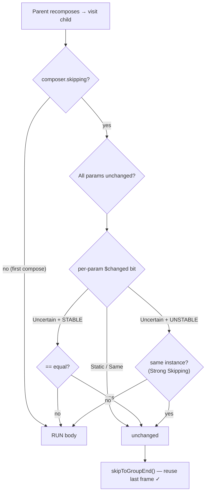

# Lesson 06 — How Skipping Works

> After this lesson you can trace the exact skip decision the runtime makes per composable — the `$changed` bitmask, the equality comparison, the `skipToGroupEnd()` branch — and explain precisely what Strong Skipping changed and why your composable might *still* not skip.

**Module:** 12 · **Lesson:** 06 · **Level:** 🟢🟡🔴 · **Est. time:** 85–105 min

---

## 1. Concept

### 🟢 For beginners — *what is it and why do I care?*

Recomposition is cheap *because Compose skips most of it.* When a parent recomposes, it doesn't blindly re-run every child. For each child it asks: *"are your inputs the same as last time? If yes, I'll skip you entirely."* **Skipping** is Compose not re-executing a composable's body because nothing it depends on changed.

This is the difference between a smooth app and a janky one. A screen might "recompose" when one number changes — but if 95% of its composables **skip** (their inputs didn't change), the actual work is tiny. When skipping *breaks* (composables re-run even though their inputs look identical), you get wasted work, dropped frames, and battery drain.

Skipping isn't automatic for every type, though. Compose can only skip a child if it can **compare** the child's inputs reliably — which depends on the **stability** you learned in Lesson 05. Stable inputs → comparable → skippable. Unstable inputs → historically not skippable.

Why care? "Why does this recompose every frame?" is the most common Compose performance question in interviews and in real apps. The answer is always some version of "the skip check failed." Understanding *how* the check works lets you fix it instead of guessing.

The one idea: **Compose skips a composable when it can prove its inputs are unchanged. Your job is to make inputs provably-unchanged (stable + same value/instance).**

### 🟡 For intermediate devs — *the mechanism*

Recall from Lesson 01 that the compiler injects a `$changed: Int` bitmask and wraps each restartable composable like this (conceptually):

```kotlin
$composer.startRestartGroup(key)
if (inputsUnchanged($changed) && $composer.skipping) {
    $composer.skipToGroupEnd()      // ← SKIP: don't run the body
} else {
    /* the real body */              // ← RUN
}
$composer.endRestartGroup()?.updateScope { … }
```

Two things must both be true to skip:

1. **`$composer.skipping` is true** — i.e., this is a *recomposition*, not the first composition (you can't skip something that was never composed) and the runtime is in a state where skipping is allowed.
2. **All parameters are unchanged.** The caller passes `$changed` bits describing each argument: *Static* (compile-time constant — definitely unchanged), *Same*, *Different*, or *Uncertain*. For *Uncertain* parameters, the runtime performs an **equality comparison** against the value stored in the slot table for that parameter.

The comparison used depends on **stability** (Lesson 05): for **stable** params, structural equality (`==`); the result is trustworthy, so the runtime can skip. For **unstable** params, the comparison can't be trusted — historically that forced a **RUN**.

If every parameter resolves to "unchanged," the runtime calls **`skipToGroupEnd()`**: it advances the slot reader past this group's contents *without executing them*, reusing last frame's output. That's the whole win.

### 🔴 For senior devs — *trade-offs, edges, internals*

The precise rules that explain real skip failures:

- **The `$changed` bitmask carries per-parameter knowledge from the caller.** When a parent recomposes, it already knows which arguments it's passing changed (it just (re)read or computed them). It encodes that into `$changed` so the child often doesn't even need to compare — a *Static* default or a parameter the parent knows is *Same* short-circuits to "unchanged." This caller-supplied knowledge is why skipping composes up the tree efficiently: unchanged subtrees prune cheaply.

- **Equality only runs for *Uncertain* + stable params.** If the parent can't characterize an argument (e.g. it's a value computed in the call), the bit is *Uncertain* and the child compares it against the slot. For **stable** types that comparison is `==` and decisive. For **unstable** types, pre-Strong-Skipping, there was no safe comparison → no skip branch was even emitted for that composable.

- **Strong Skipping (the 2026 default) changes the unstable case in two specific ways:**
  1. **Unstable parameters are compared by *instance* (referential) equality** instead of disqualifying the composable. So a composable with an unstable param **is** now skippable — it skips when you pass the *same instance* and runs when you pass a new one. This means *every restartable composable becomes skippable*; the question shifts from "is it skippable?" to "am I handing it a new instance each frame?"
  2. **Lambdas are automatically `remember`ed.** Before, an inline lambda (`onClick = { vm.foo() }`) allocated a new function instance each recomposition, making the lambda parameter "changed" and breaking skipping for the child. Strong Skipping auto-wraps such lambdas in `remember`, so a stable lambda doesn't break the child's skip. (This removed a giant class of accidental recompositions.)

- **`skipToGroupEnd()` is a slot-reader jump, not a no-op.** It moves the reader past the group's stored slots and children, *reusing* their last-frame state and emitted nodes. The subtree isn't re-run, re-measured, or re-laid-out due to composition (layout/draw have their own invalidation, Lesson 07). That's why a skipped subtree is genuinely free of composition cost.

- **Common reasons a composable *still* won't skip (even in 2026):**
  - **A new instance every frame** of an unstable param (`items.map { … }`, `Modifier`-chains rebuilt inline with unstable captures, a freshly constructed object). Strong Skipping uses identity; new identity ⇒ run.
  - **An unstable lambda that captures unstable state** in a way auto-remember can't stabilize, or a lambda passed through a non-Compose boundary.
  - **Reading state directly in the composable body** that changes — that's a legitimate reason to recompose (it's a subscriber), not a skip failure. Don't confuse "subscribed to changing state" with "should have skipped."
  - **`@Composable` inline functions don't introduce their own skip boundary** (Lesson 01/03) — their content recomposes with the caller's scope.
  - **A param of a type still reported `unstable`** that you keep reallocating.

- **Skippability vs. restartability, restated at the decision level.** *Restartable* = the runtime has a scope to re-invoke it. *Skippable* = there exists a `$changed`-guarded `skipToGroupEnd()` branch. With Strong Skipping virtually all restartable composables are also skippable; the lever you control is **whether the inputs actually compare equal** (stable types + stable instances), not whether the branch exists.

- **Don't over-optimize.** Skipping is already pervasive. Wrapping trivially-cheap composables in `remember`, or hand-stabilizing lambdas that auto-remember already handles, adds noise without measurable benefit. Optimize the composables that **profiling** (Module 11) shows recompose hot — not on a hunch.

### Analogy

**A passport-control fast lane.** Each traveler (composable) approaches the booth (the skip check). The officer first glances at a pre-cleared list the airline sent ahead (`$changed` bits from the caller): "this person is on the no-change list — wave them through." For travelers not on the list, the officer compares their passport to the photo on file (equality check). If the document is a **trusted, tamper-proof passport** (`stable` type), one glance settles it — *skip the interview*. If it's a **scribbled note anyone could have altered** (`unstable` type), the old rule was "no fast lane, full interview every time"; the new **Strong Skipping** rule is "fast-lane them *if it's literally the same physical note* (same instance) — but a fresh note means full interview." `skipToGroupEnd()` is the wave-through; the body is the interview.

### Mental model

> **Skip = "inputs provably unchanged → don't run the body, jump to group end."** Stable types compare by value; unstable types compare by *instance* (Strong Skipping). New value/instance ⇒ run.

### Real-world example

A `LazyColumn` of 50 `OrderRow(order, onTap)`s. You update one order's status. The list recomposes, but 49 rows receive the **same `order` instances and the same (auto-remembered) `onTap`**, so their `$changed`/equality checks say "unchanged" and they **`skipToGroupEnd()`** — only the one changed row runs its body. If `OrderRow` instead took `order.toUiModel()` computed inline, all 50 would get *new* instances each frame and *none* would skip — same code shape, 50× the composition work. Skipping, correctly fed, is what keeps the scroll smooth.

---

## 2. Visual Learning

**ASCII — the per-composable skip decision:**
```text
   Parent recomposes ──▶ for each child composable:
   ┌───────────────────────────────────────────────────────────────────┐
   │ 1. composer.skipping == true?  (a recomposition, not first compose) │ ──no──▶ RUN body
   │ 2. all params "unchanged"?                                          │
   │      • $changed bit = Static / Same      → unchanged (no compare)   │
   │      • $changed bit = Uncertain:                                    │
   │           - STABLE   param → compare with ==        (trustworthy)   │
   │           - UNSTABLE param → compare by INSTANCE   (Strong Skipping)│
   └───────────────────────────────────────────────────────────────────┘
              │ all unchanged                         │ any changed
              ▼                                       ▼
        skipToGroupEnd()  (reuse last frame)        RUN body (recompose)
```

**Mermaid — skip decision with Strong Skipping:**


**Illustration prompt (paste into an image generator):**
```text
Illustration: an airport passport-control scene rendered as a clean, modern diagram.
A queue of travelers (each a small card labeled "composable") approaches a booth labeled
"SKIP CHECK". An officer holds a clipboard labeled "$changed (caller's no-change list)".
Two lanes split from the booth: a green FAST LANE with a glowing "skipToGroupEnd()" archway
(travelers waved through), and a red FULL-INTERVIEW lane labeled "RUN body". One traveler
holds a sturdy holographic passport labeled "STABLE → compare by value"; another holds a
flimsy sticky note labeled "UNSTABLE → compare by instance (Strong Skipping)". Caption:
"Skip = inputs provably unchanged." Modern, vibrant, soft gradients, crisp labels.
```

---

## 3. Code

### 🟢 Beginner — make a child skippable by passing stable inputs

```kotlin
@Composable
fun OrderScreen(orders: ImmutableList<Order>, onTap: (String) -> Unit) {
    LazyColumn {
        items(orders, key = { it.id }) { order ->
            // order is a stable instance; onTap is a stable lambda (auto-remembered).
            // Unchanged rows hit skipToGroupEnd() → they don't re-run.
            OrderRow(order = order, onTap = onTap)
        }
    }
}

@Composable
private fun OrderRow(order: Order, onTap: (String) -> Unit) {
    ListItem(
        headlineContent = { Text(order.title) },
        supportingContent = { Text(order.status.label) },
        modifier = Modifier.clickable { onTap(order.id) },
    )
}
```

**Explanation.** Each `OrderRow` receives the same `order` instance and the same `onTap` across recompositions (the lambda is hoisted and, under Strong Skipping, auto-remembered). When you change one order, only that row's `order` differs; the other rows' params compare "unchanged" and the runtime calls `skipToGroupEnd()` on them. Stable inputs in → skipping out.

**Common mistakes.**
```kotlin
// ❌ New instance per frame: OrderRow gets a fresh UI model each recomposition → never skips.
items(orders, key = { it.id }) { order ->
    OrderRow(order = order.toUiModel(), onTap = { onTap(order.id) })  // new model + new lambda each frame
}
```
**Best practices.**
- Pass **stable instances**; compute UI models once (hoist/`remember`), not inline per item.
- Let lambdas be stable; Strong Skipping auto-remembers simple ones, but avoid capturing fresh objects.

---

### 🟡 Intermediate — see skipping with recomposition counts

```kotlin
@Composable
fun SkipDemo() {
    var ticker by remember { mutableStateOf(0) }
    var name by remember { mutableStateOf("Ada") }

    Column {
        Text("Ticker: $ticker")                 // subscribes to `ticker` → recomposes each tick
        Button(onClick = { ticker++ }) { Text("Tick") }

        // Stable param `name`; does NOT read `ticker`. Should SKIP on every tick.
        Greeting(name = name)
    }
}

@Composable
private fun Greeting(name: String) {
    // Put this composable under Layout Inspector → recomposition counts.
    // Tapping "Tick" must NOT increment Greeting's count (it skips); changing `name` must.
    Text("Hello, $name")
}
```

**Explanation.** `Greeting` takes a stable `String` and doesn't read `ticker`. Each "Tick" recomposes `SkipDemo` and the `Text("Ticker…")`, but `Greeting`'s only input (`name`) is unchanged, so the skip check passes and `Greeting` is **skipped** — visible as a flat recomposition count in Layout Inspector while `ticker` changes. This is the canonical way to *observe* skipping.

**Common mistakes.**
```kotlin
// ❌ Reading the ticker inside Greeting's scope (e.g. a stray Text("$ticker")) makes it a
//    subscriber → it recomposes every tick. That's correct behavior, NOT a skip failure.
```
**Best practices.**
- Verify skipping with **Layout Inspector recomposition counts**, not assumptions.
- Distinguish "subscribed to changing state" (should recompose) from "inputs unchanged" (should skip).

---

### 🔴 Production — diagnosing & fixing a row that won't skip

A real hot path: an item composable that recomposes on every list update. Walk the report → fix the cause → verify the skip branch.

```kotlin
// SYMPTOM: ProductRow recomposes for every row whenever ANY product changes.
// Compose report excerpt:
//   restartable scheme(...) fun ProductRow(
//     unstable product: Product            ← cause #1: unstable type
//     unstable onAddToCart: Function1<...> ← cause #2: lambda not stabilized across a boundary
//   )

// FIX #1 — make Product stable (Lesson 05): @Immutable + ImmutableList fields, plugin in :core.
// FIX #2 — hoist a STABLE event lambda instead of allocating per-row with fresh captures.

@Composable
fun ProductList(
    products: ImmutableList<Product>,            // stable collection
    onAddToCart: (String) -> Unit,               // single stable lambda, hoisted once
) {
    LazyColumn {
        items(products, key = { it.id }, contentType = { it.kind }) { product ->
            ProductRow(product = product, onAddToCart = onAddToCart)   // same instances → skips
        }
    }
}

@Composable
private fun ProductRow(product: Product, onAddToCart: (String) -> Unit) {
    Card {
        Text(product.name)
        Button(onClick = { onAddToCart(product.id) }) { Text("Add") }  // captures stable id only
    }
}
```

**Explanation.** The report names both causes: `product` is unstable and `onAddToCart` is an unstable function param. Fixing the **type** (`@Immutable Product` with `ImmutableList` fields, compiled with the plugin — Lesson 05) flips `product` to `stable`. Hoisting **one** stable `onAddToCart` lambda (instead of `{ vm.add(product.id) }` allocated per row with a fresh capture) lets the lambda param compare equal. Re-running the report now shows `restartable skippable` with both params `stable`, and unchanged rows hit `skipToGroupEnd()`.

**Common mistakes.**
```kotlin
// ❌ "Fixing" skipping by wrapping the row in remember — doesn't address the unstable PARAM,
//    and remember of a composable call isn't a thing. The fix is the type + the lambda.
// ❌ Passing a brand-new Modifier with unstable captures each frame:
ProductRow(product, onAddToCart, modifier = Modifier.background(randomColor()))  // new each frame
```
**Best practices.**
- Read the **compiler report** to find *which* param breaks skipping; fix the **type** and the **lambda**, not the call site cosmetics.
- Hoist event lambdas to a stable scope; capture only **stable** values (ids), not whole objects.
- Confirm with the report (`skippable`) **and** Layout Inspector counts; only chase composables profiling flags as hot.

---

## 4. Interview Questions

**🟢 Beginner**

1. *What does it mean for Compose to "skip" a composable?*
   > It doesn't re-execute that composable's body during recomposition because its inputs are unchanged — it reuses last frame's output via `skipToGroupEnd()`. Skipping is what keeps recomposition cheap.
2. *Roughly, how does Compose decide whether to skip a composable?*
   > If it's a recomposition (not the first compose) and **all** its parameters are unchanged — known from the caller's `$changed` bits or an equality comparison — it skips; otherwise it runs the body.

**🟡 Intermediate**

3. *What is the `$changed` bitmask and how does it help skipping?*
   > A compiler-injected `Int` (or several) where each parameter gets bits encoding Static/Same/Different/Uncertain. The caller fills it with what it already knows, so the child can often decide "unchanged" without comparing; only *Uncertain* params trigger an actual equality check.
4. *Why did inline lambdas like `onClick = { vm.foo() }` used to break skipping, and what changed?*
   > Each recomposition allocated a **new** function instance, so the lambda parameter looked "changed," forcing the child to recompose. **Strong Skipping** auto-`remember`s such lambdas, so a stable lambda no longer breaks the child's skip — eliminating a huge class of accidental recompositions.

**🔴 Senior**

5. *Under Strong Skipping, when does a composable with an unstable parameter still fail to skip?*
   > When you pass it a **new instance every frame**. Strong Skipping compares unstable params by **referential equality**, so the same instance skips but a freshly allocated one (`items.map { … }`, `obj.toUiModel()`, a rebuilt object) is "changed" and forces a run. The fix is to stabilize the type and/or stop reallocating the instance each frame.
6. *Distinguish "should skip but doesn't" from "correctly recomposes," using a concrete example.*
   > If a composable receives unchanged inputs yet re-runs (e.g. it got a new unstable instance, or its lambda wasn't stabilized), that's a **skip failure** to fix. If it re-runs because it **reads state that changed** (it's a subscriber — say it reads a `ticker` it displays), that's **correct**: it *must* recompose. The tell is whether the recomposition tracks a real input change or pure waste.
7. *What does `skipToGroupEnd()` actually do, and why is a skipped subtree "free"?*
   > It advances the slot reader past the group's stored slots and child groups **without executing them**, reusing last frame's remembered state and emitted nodes. No body runs, no nodes are recreated from composition, so the subtree incurs no composition cost (layout/draw have separate invalidation). That reader-jump is the mechanical payoff of skipping.

---

## 5. AI Assistant

**Prompt example (fixing a non-skipping row):**
```text
This item composable recomposes for every row whenever any item changes. Here are the
composable, its param types, and the Compose stability report:
[paste code + <module>-composables.txt excerpt]
Target: Compose 2026 BOM (Strong Skipping ON), Kotlin 2.x.
Identify exactly why it doesn't skip (per parameter: unstable type? new instance each frame?
unstable lambda?), then fix at the source: stabilize the type (Lesson 05), hoist a single
stable event lambda, and avoid per-frame instances. Confirm the param flips to `stable` and
the function to `skippable`. Don't wrap composable calls in remember.
```

**AI workflow — where it helps on *this* topic.**
- ✅ Great for: mapping a report's `unstable` flags to the precise cause, hoisting lambdas, and rewriting per-frame allocations into stable instances.
- ⚠️ Not for: deciding what's actually hot (profile first) or "fixing" skipping by wrapping calls in `remember`. Models also conflate **correct** state-subscription recomposition with a skip bug and try to suppress legitimate updates.

**Review workflow — check AI output against this lesson's *Common Mistakes*:**
- Did it fix the **type** (Lesson 05) and **hoist a stable lambda**, rather than cosmetic call-site changes?
- Did it stop **per-frame instance** creation (`map`/`toUiModel`/new `Modifier` with unstable captures inside item scope)?
- Did it avoid suppressing recompositions that are **correct** (genuine state reads)?
- Did it verify the claim against the **report** (`skippable`) and **recomposition counts**, not vibes?

**Validation workflow — prove it actually works:**
1. **Stability report** before/after: confirm the param `unstable → stable` and the function `restartable → restartable skippable`.
2. **Layout Inspector → recomposition counts**: change one item; confirm only that row's count increments while others stay flat (they skipped).
3. **Decompile** (Lesson 01) to verify a `$changed`-guarded `skipToGroupEnd()` branch exists for the composable.
4. **Macrobenchmark** the scroll (Module 11) before/after to prove the frame-time win — the point of skipping.

> **AI drafts, you decide.** If the model suppresses an update that's actually a correct state subscription, it misread the problem — only fix *waste*, and verify with counts + report.

---

## Recap / Key takeaways

- **Skipping** = the runtime not re-running a composable's body because its inputs are **provably unchanged**, via `skipToGroupEnd()` (a slot-reader jump that reuses last frame).
- The decision uses the caller's **`$changed` bits** (Static/Same/Different/Uncertain) plus an **equality check** for uncertain params: **structural** for stable types, **referential** for unstable ones.
- **Strong Skipping** (2026 default) makes essentially all restartable composables skippable (unstable params compared by **instance**) and **auto-`remember`s lambdas** — killing the classic "new lambda each frame" recomposition.
- A composable still won't skip if it gets a **new instance each frame**, a param of a type reported **unstable** that you keep reallocating, or an unstabilizable lambda — fix the **type** and the **lambda**, not the call-site cosmetics.
- Don't confuse a **skip failure** (wasted work) with a **correct state subscription** (must recompose). Verify with the **report** + **recomposition counts**, and optimize only what **profiling** flags.

➡️ Next: **[Lesson 07 — The Frame Lifecycle](07-frame-lifecycle.md)** — how a change flows through recompose → measure → place → draw, and where the snapshot applies.
