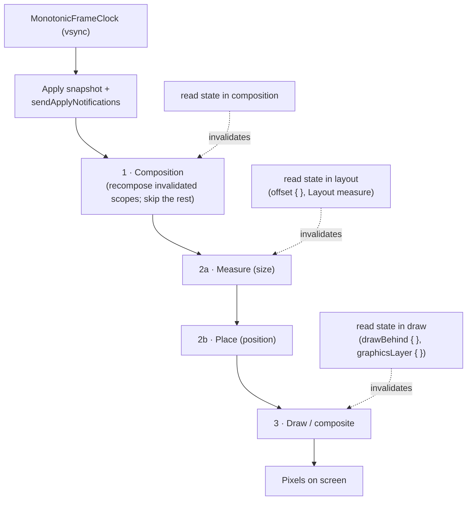

# Lesson 07 — The Frame Lifecycle

> After this lesson you can trace one frame end-to-end — apply snapshot → recompose → measure → place → draw — name what each phase reads and produces, and explain why a state read in layout or draw is cheaper than one in composition.

**Module:** 12 · **Lesson:** 07 · **Level:** 🟢🟡🔴 · **Est. time:** 90–110 min

---

## 1. Concept

### 🟢 For beginners — *what is it and why do I care?*

Everything you've learned in this module — the compiler, slot table, snapshots, stability, skipping — comes together **60 (or 120) times a second**, once per frame. A **frame** is one cycle of "figure out the UI and put pixels on screen." Understanding the order of operations in a frame is what lets you reason about *when* your code runs and *why* one approach is smoother than another.

Compose draws each frame in distinct **phases**, always in the same order:

1. **Composition** — run your `@Composable` functions to decide *what* UI exists (which nodes, what content). This is where recomposition and skipping happen.
2. **Layout** — for each node, **measure** how big it is, then **place** it at an x/y position. This decides *where* things go and *how large*.
3. **Drawing** — actually paint each node onto the screen (text, shapes, images).

Think: *what* exists (composition) → *how big and where* (layout) → *what it looks like* (draw). A state change can trigger all three, or — and this is the key insight — **just the later ones.** If only a position or a color changes, Compose can skip composition and layout entirely and just redraw. That's a huge performance lever.

Why care? "My animation drops frames," "scrolling is janky," "why is this slow even though nothing recomposes?" — all are answered by knowing which phase your work lands in. The cheapest change is one that only touches draw; the most expensive touches composition.

The one idea: **a frame runs composition → layout (measure, place) → draw, in that order, and the smartest code triggers the *latest* phase it can.**

### 🟡 For intermediate devs — *the mechanism*

A frame is driven by the **`MonotonicFrameClock`** (the Choreographer's vsync pulse, wrapped by Compose). On each pulse:

1. **Apply snapshot changes & dispatch.** Pending snapshot writes from the last frame are applied; **`Snapshot.sendApplyNotifications()`** runs (Lesson 04), telling the `Recomposer` which state changed.
2. **Recomposition.** The `Recomposer` re-runs the **invalidated** composable scopes (only those that read changed state — and even among those, **skipping** prunes unchanged ones, Lesson 06). Output: an updated **`LayoutNode`** tree (via the `Applier`, Lesson 02). *Nothing is drawn yet.*
3. **Layout pass — measure then place.** Compose walks the node tree: each node is **measured** (parent passes `Constraints` down; child returns a size up — single-pass, no multiple measure like nested weights in old Views), then **placed** (positioned by its parent). This is Compose's famously single-pass layout.
4. **Draw pass.** Each node records its drawing into the canvas/render layers; the result is composited to the screen.

The critical refinement: **state reads are tracked per phase.** A state read *in composition* invalidates composition (and everything after). A read *only in layout* (e.g. inside a `Modifier.offset { … }` lambda or a custom `Layout`'s measure block) invalidates **only layout + draw** — composition is skipped. A read *only in draw* (inside `Modifier.drawBehind { … }` or `graphicsLayer { … }`) invalidates **only draw**. The later you read changing state, the fewer phases you re-run.

```kotlin
Modifier.offset { IntOffset(scroll.value, 0) }   // reads scroll in LAYOUT → no recomposition
Modifier.graphicsLayer { alpha = fade.value }     // reads fade in DRAW → no recomposition/layout
```

### 🔴 For senior devs — *trade-offs, edges, internals*

The decisions that separate "it works" from "it's smooth at 120 Hz":

- **Phase-scoped invalidation is the master performance lever.** The single most effective Compose optimization is *moving a frequently-changing state read out of composition into layout or draw.* An animated scroll/offset/alpha that drives a lambda-based modifier never enters composition — so no recomposition, no skip checks, no node rebuilding; just a re-measure/place or a re-draw of an existing node. This is why `Modifier.offset { }` (lambda) is dramatically cheaper than `Modifier.offset(x.dp)` (value) for animations: the former defers the read to layout, the latter reads in composition and recomposes the caller. (Module 11 makes this the centerpiece of perf work.)

- **`graphicsLayer` is the draw-phase fast path.** Properties set in `Modifier.graphicsLayer { }` (alpha, translation, rotation, scale) are applied at the **render-node** level during draw/compositing — changing them re-runs neither composition nor layout, and often not even the draw of the layer's *contents* (the rasterized layer is reused and re-composited). That's why hardware-friendly animations animate `graphicsLayer` properties, not layout sizes.

- **The phases are ordered and one-directional within a frame, but feed the next frame.** Composition produces nodes; layout reads node content set by composition; draw reads geometry set by layout. You cannot "draw then recompose" within a frame. A state write *during* layout/draw that affects an earlier phase doesn't retroactively rewind this frame — it schedules work for the **next** frame (and can cause an extra frame / jank if you, say, write composition-affecting state during layout). Keep writes in their proper phase.

- **Single-pass layout has rules and escape hatches.** Compose measures each child **once** per layout pass (a deliberate contrast to View's multi-pass weight resolution). Constructs that need to know a sibling's size (e.g. `BoxWithConstraints`, `SubcomposeLayout` used by `LazyColumn`) **subcompose** — they run composition *inside* layout to produce children on demand. That's powerful but means those subtrees compose during the layout phase; over-using `SubcomposeLayout` (or `BoxWithConstraints`) can pull composition cost into layout and defeat skipping. Reach for it only when geometry genuinely must drive content.

- **Recomposition ≠ relayout ≠ redraw.** A recomposition that changes only a `Text` value updates a node property and triggers draw, but may not re-run layout if the size is unchanged (text that fits the same measured bounds). Conversely, an `offset { }` animation relayouts/redraws with **zero** recomposition. Reasoning about cost requires asking *which phases* a change actually triggers — not assuming "recompose = the whole pipeline."

- **The frame clock gates `withFrameNanos`.** Animations (`Animatable`, `animate*AsState`, `rememberInfiniteTransition`) are driven by `withFrameNanos`/the `MonotonicFrameClock`: they wake once per frame, compute the new value, and write it — ideally to a state read in layout/draw so the update stays off composition. This is why a well-built animation can run at display refresh rate without recomposing anything.

- **Where the snapshot fits.** The frame **begins** by applying the previous frame's snapshot mutations and notifying readers; recomposition then runs over a **consistent** snapshot (Lesson 04). So "apply" isn't a separate user step — it's the heartbeat that converts your `state.value = x` writes into the next frame's invalidations.

### Analogy

A **theatrical production staged anew every few milliseconds.** First the **script supervisor** decides which actors and props are on stage tonight (**composition** — *what* exists). Then the **blocking director** measures each actor and marks their spot on the floor (**layout: measure + place** — *how big, where*). Finally the **lighting and costume** crew make them look right (**draw** — *appearance*). If only the *lighting* changes between performances, you don't re-cast the play or re-block the scene — you just adjust the lights (**draw-only invalidation**). Re-casting (composition) is the most disruptive; a lighting tweak (draw) is the cheapest. The **stage manager's vsync whistle** (frame clock) starts each performance on the beat.

### Mental model

> **One frame = apply snapshot → recompose (what) → measure+place (where/size) → draw (looks).** Read changing state in the **latest** phase you can; later phase = fewer phases re-run.

### Real-world example

A parallax header that shrinks and fades as you scroll. Done naively, the scroll offset is read in composition (`Modifier.height(headerHeight.dp)` with `headerHeight` recomputed in the body) — every scroll pixel recomposes the header and its children: jank. Done right, the offset/alpha are read in **layout/draw**: `Modifier.layout { … place using scroll … }` and `Modifier.graphicsLayer { alpha = … }`. Now scrolling re-runs only measure/place and draw on the existing nodes — **zero recomposition** — and the header glides at 120 Hz. Same visual, opposite phase profile.

---

## 2. Visual Learning

**ASCII — one frame, phase by phase, with phase-scoped reads:**
```text
   vsync ─▶ ┌─────────── FRAME ───────────────────────────────────────────┐
            │ 0. apply snapshot + sendApplyNotifications  (Lesson 04)       │
            │ 1. COMPOSITION  → run @Composables → LayoutNode tree (what)    │  ← read here = recompose+all
            │ 2. LAYOUT       → measure (size) → place (x,y)        (where)  │  ← read here = layout+draw only
            │ 3. DRAW         → paint / composite render layers     (looks)  │  ← read here = draw only
            └───────────────────────────────────────────────────────────────┘
                       cheapest change touches only DRAW; costliest touches COMPOSITION
   defer reads:  offset { scroll.value } → LAYOUT      graphicsLayer { alpha=x } → DRAW
```

**Mermaid — the frame pipeline and phase-scoped invalidation:**


**Illustration prompt (paste into an image generator):**
```text
Illustration: a theater stage shown as three left-to-right stations under a glowing
"vsync whistle" clock. Station 1 "COMPOSITION": a script supervisor with a clipboard
choosing which actors/props appear (label: "what exists"). Station 2 "LAYOUT": a blocking
director with a measuring tape and floor-tape X marks (label: "measure + place — size & position").
Station 3 "DRAW": a lighting/costume crew making actors look right (label: "appearance").
Three colored arrows enter from the side labeled "state read in composition / layout / draw",
each pointing to its station to show how late reads trigger fewer stations. A small caption:
"Read state in the latest phase you can." Modern, vibrant, soft gradients, crisp labels.
```

---

## 3. Code

### 🟢 Beginner — the same animation in composition vs. draw

```kotlin
// ❌ Reads the animated value in COMPOSITION → recomposes every frame of the animation.
@Composable
fun PulseBad() {
    val scale by rememberInfiniteTransition(label = "pulse")
        .animateFloat(1f, 1.2f, infiniteRepeatable(tween(600), RepeatMode.Reverse), label = "s")
    Box(
        Modifier
            .size((100 * scale).dp)     // reads `scale` in composition → re-runs this composable each frame
            .background(Color.Magenta)
    )
}

// ✅ Reads the animated value in DRAW → no recomposition, no layout; just re-draw the layer.
@Composable
fun PulseGood() {
    val scale by rememberInfiniteTransition(label = "pulse")
        .animateFloat(1f, 1.2f, infiniteRepeatable(tween(600), RepeatMode.Reverse), label = "s")
    Box(
        Modifier
            .size(100.dp)
            .graphicsLayer { scaleX = scale; scaleY = scale }   // reads `scale` in DRAW phase only
            .background(Color.Magenta)
    )
}
```

**Explanation.** Both pulse identically, but the phase profile differs. `PulseBad` reads `scale` while building the modifier in the composition body, so every animation tick recomposes the composable (and re-lays-out the size). `PulseGood` reads `scale` inside `graphicsLayer { }`, which runs in the **draw** phase — the animation updates a render-layer property with **no recomposition and no relayout**.

**Common mistakes.**
```kotlin
Modifier.scale(scale)   // ❌ the value-based modifier reads `scale` in composition (recomposes)
```
**Best practices.**
- Animate via `graphicsLayer { }` (draw) or lambda modifiers (layout), not value-based modifiers read in the body.
- Ask of any animation: *which phase reads the moving value?*

---

### 🟡 Intermediate — defer a scroll read to the layout phase

```kotlin
@Composable
fun CollapsingHeader(scroll: ScrollState, content: @Composable () -> Unit) {
    Box {
        content()
        Text(
            "Featured",
            Modifier
                // ✅ Read scroll.value inside the layout lambda → invalidates LAYOUT, not composition.
                .offset { IntOffset(x = 0, y = -scroll.value / 2) }   // parallax, no recomposition
                .graphicsLayer {
                    // ✅ Fade read in DRAW phase only.
                    alpha = (1f - scroll.value / 600f).coerceIn(0f, 1f)
                }
        )
    }
}
```

**Explanation.** `offset { … }` (the lambda overload) reads `scroll.value` during **layout**, so scrolling re-runs measure/place for this node but **does not recompose** `CollapsingHeader`. The fade reads `scroll.value` in `graphicsLayer { }` during **draw**. The header reacts to every scroll pixel while composition stays idle — the difference between a janky and a buttery parallax.

**Common mistakes.**
```kotlin
// ❌ Value modifiers read scroll in COMPOSITION → recompose on every scroll pixel.
Modifier
  .offset(y = (-scroll.value / 2).dp)                 // composition read
  .alpha((1f - scroll.value / 600f).coerceIn(0f, 1f)) // composition read
```
**Best practices.**
- Prefer **lambda** modifier overloads (`offset { }`, `layout { }`) and `graphicsLayer { }` for values that change every frame.
- Keep per-frame state reads **out of the composition body**.

---

### 🔴 Production — a custom single-pass `Layout` that reads geometry late

When you need real custom positioning that animates, do measurement once and read the animated value in the **placement** step (layout phase), keeping composition untouched.

```kotlin
@Composable
fun OffsetStack(
    progress: () -> Float,                 // lambda → deferred read (NOT read in composition)
    modifier: Modifier = Modifier,
    content: @Composable () -> Unit,
) {
    Layout(content = content, modifier = modifier) { measurables, constraints ->
        // MEASURE once (single pass): size each child against the incoming constraints.
        val placeables = measurables.map { it.measure(constraints) }
        val width = placeables.maxOfOrNull { it.width } ?: 0
        val height = placeables.sumOf { it.height }

        layout(width, height) {
            // PLACE: read the animated progress HERE, in the layout phase.
            val p = progress()                                  // deferred read → layout-only invalidation
            var y = 0
            placeables.forEachIndexed { i, placeable ->
                val dx = (i * 24 * p).toInt()                   // staggered slide driven by progress
                placeable.placeRelative(x = dx, y = y)
                y += placeable.height
            }
        }
    }
}

// Usage: animate progress and pass it as a lambda so the read stays in layout.
@Composable
fun OffsetStackDemo() {
    val anim = remember { Animatable(0f) }
    LaunchedEffect(Unit) { anim.animateTo(1f, tween(500)) }
    OffsetStack(progress = { anim.value }) {        // lambda defers the read
        repeat(4) { Card { Text("Row $it") } }
    }
}
```

**Explanation.** `Layout` measures each child **once** (single-pass) and positions them in `layout(width, height) { … }`. Crucially, `progress` is a **lambda** and is invoked inside the placement block, so reading `anim.value` happens in the **layout phase** — the animation re-runs measure/place but **never recomposes** `OffsetStackDemo` or `OffsetStack`. If `progress` were a `Float` parameter read in the composition body, every animation frame would recompose the whole subtree.

**Common mistakes.**
```kotlin
// ❌ Passing the animated value as a plain Float read in composition → recomposes each frame.
OffsetStack(progress = anim.value) { … }    // read happens in composition, not layout

// ❌ Writing composition-affecting state during the layout/placement block → schedules extra work,
//    can cause an extra frame / "read in layout, write in composition" loops.
layout(w, h) { someComposeState.value = something; /* … */ }   // don't mutate composition state here
```
**Best practices.**
- Pass frequently-changing values as **lambdas** (`() -> Float`) so the read lands in layout/draw, not composition.
- Keep custom layout **single-pass**; subcompose (`SubcomposeLayout`/`BoxWithConstraints`) only when content genuinely depends on measured geometry — it pulls composition into layout.
- Don't **write** composition-affecting state during measure/place/draw; keep each phase's side of the contract.

---

## 4. Interview Questions

**🟢 Beginner**

1. *What are the phases of a Compose frame, in order?*
   > Composition (decide *what* UI exists), then Layout — measure (size) and place (position) — deciding *where/how big*, then Draw (paint *appearance*). They always run in that order within a frame.
2. *Which phase is the most expensive to trigger, and which is the cheapest?*
   > Triggering **composition** is the most expensive (it can cascade through layout and draw too); triggering **draw only** is the cheapest. So a change that only affects appearance (e.g. alpha via `graphicsLayer`) is far cheaper than one that recomposes.

**🟡 Intermediate**

3. *Why is `Modifier.offset { … }` (lambda) cheaper than `Modifier.offset(x.dp)` (value) for an animation?*
   > The lambda overload reads the value during the **layout** phase, so an animating offset re-runs measure/place but **not** composition. The value overload reads it in the composition body, so every animation frame recomposes the caller. Deferring the read to a later phase runs fewer phases.
4. *What kicks off a frame, and what's the first thing that happens?*
   > The `MonotonicFrameClock` (vsync) pulses; the frame begins by **applying pending snapshot writes and sending apply notifications**, which tells the `Recomposer` what state changed before recomposition runs over a consistent snapshot.

**🔴 Senior**

5. *Explain phase-scoped state-read invalidation and why it's the top performance lever.*
   > Compose tracks *where* a state read happens. A read in **composition** invalidates composition + layout + draw; a read **only in layout** (lambda modifier / custom `Layout`) invalidates layout + draw; a read **only in draw** (`drawBehind`/`graphicsLayer`) invalidates draw alone. Moving a frequently-changing read (scroll, animation) from composition into layout/draw eliminates recomposition and skip-checking for that change — the highest-impact optimization, because it removes whole phases of work per frame.
6. *Compose does single-pass layout. How do `BoxWithConstraints`/`LazyColumn` handle cases that need to know geometry before composing content, and what's the cost?*
   > They use **subcomposition** (`SubcomposeLayout`): they run composition **inside** the layout phase to produce children on demand once constraints are known. That enables geometry-driven content (and lazy item creation) but means those subtrees **compose during layout**, which is more expensive and can defeat normal skipping — so it's reserved for cases where content genuinely depends on measured size, not as a default.
7. *Why can't a state write during the draw phase retroactively change this frame's composition, and what's the practical hazard?*
   > Phases are ordered and one-directional within a frame: composition has already produced nodes and layout has already positioned them by the time draw runs, so a write that affects composition can't rewind them — it schedules work for the **next** frame. The hazard is writing composition/layout-affecting state from a later phase (e.g. mutating Compose state inside a placement or draw block), which causes extra frames, visible lag, or feedback loops. Keep each phase's writes within its contract.

---

## 5. AI Assistant

**Prompt example (moving a read to a later phase):**
```text
This scroll-driven header (or animation) recomposes on every frame and drops frames. Here's
the code:
[paste composable]
Target: Compose 2026 BOM, Kotlin 2.x. Rewrite it so the frequently-changing value (scroll/
animation progress) is read in the LAYOUT or DRAW phase instead of composition — use lambda
modifier overloads (offset { }, layout { }) and graphicsLayer { } for alpha/scale/translation,
and pass animated values as lambdas (() -> Float) so the read defers. Explain which phase each
read now lands in, and confirm composition no longer runs per frame.
```

**AI workflow — where it helps on *this* topic.**
- ✅ Great for: converting value-based modifiers to lambda/`graphicsLayer` forms, restructuring an animation to defer its read, and explaining the phase each read hits.
- ⚠️ Not for: deciding *whether* a change is hot enough to matter (profile first), or writing `SubcomposeLayout` casually — models reach for it when a single-pass `Layout` or a lambda read would do, importing composition cost into layout.

**Review workflow — check AI output against this lesson's *Common Mistakes*:**
- Did it use **lambda** modifier overloads / `graphicsLayer { }` instead of value modifiers read in the body?
- Are animated values passed as **lambdas** (`() -> Float`) so the read defers to layout/draw?
- Did it avoid **writing** composition/layout-affecting state inside measure/place/draw blocks?
- Did it keep custom layout **single-pass** and not reach for `SubcomposeLayout` without a geometry-dependency reason?

**Validation workflow — prove it actually works:**
1. **Layout Inspector → recomposition counts**: scroll/animate and confirm the composable's count **stays flat** (composition no longer runs per frame).
2. **Composition tracing / system trace** (Module 11): verify the per-frame work moved from composition to layout/draw and frames stay under budget (8.3 ms at 120 Hz).
3. **Macrobenchmark** the interaction before/after to quantify the jank reduction.
4. Sanity-check correctness: the visual result (parallax/fade/scale) is unchanged — only the phase profile improved.

> **AI drafts, you decide.** If the model "optimizes" by adding `SubcomposeLayout` or keeps reading the animated value in the composition body, it missed the point — push the read into layout/draw and verify counts stay flat.

---

## Recap / Key takeaways

- A **frame** runs in fixed order: **apply snapshot → composition (what) → layout: measure + place (size/where) → draw (looks)**, on the **`MonotonicFrameClock`** (vsync) heartbeat.
- **Phase-scoped invalidation** is the master lever: a read in **composition** re-runs everything; **layout** re-runs measure/place + draw; **draw** re-runs draw alone. Read changing state in the **latest** phase possible.
- Use **lambda** modifier overloads (`offset { }`, `layout { }`) and **`graphicsLayer { }`** to keep per-frame reads (scroll, animation) **out of composition** — the difference between janky and 120 Hz-smooth.
- Compose layout is **single-pass**; geometry-driven content uses **subcomposition** (`SubcomposeLayout`/`BoxWithConstraints`), which pulls composition into layout and should be used deliberately.
- Phases are **one-directional within a frame**: don't write composition/layout-affecting state from a later phase. **Recomposition ≠ relayout ≠ redraw** — cost depends on *which phases* a change triggers.

---

### 🎓 Module 12 complete

You can now explain, from the compiler down to the pixels, *why* a composable skips, restarts, or recomposes: the compiler rewrites your functions with a threaded `$composer`; the slot table is the gap-buffer memory keyed by position; the snapshot system gives state MVCC isolation; stability decides what's comparable; skipping reuses unchanged subtrees; and the frame lifecycle runs it all in phase order. This is the mental model that turns performance work from guesswork into diagnosis.

➡️ Next module: **[Module 13 — Architecture for Real Apps](../module-13-architecture/README.md)** — put this runtime knowledge to work behind clean boundaries.

⬅️ Back to the **[Module 12 hub](README.md)**.
