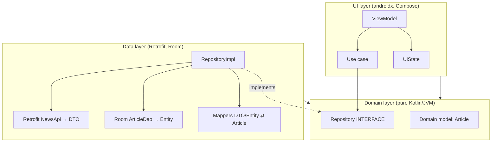

# Lesson 01 — Clean Architecture Layers

> After this lesson you can split a feature into UI, domain, and data layers, point every dependency inward, and explain why that one rule keeps a large app maintainable.

**Module:** 13 · **Lesson:** 01 · **Level:** 🟢🟡🔴 · **Est. time:** 75–90 min

---

## 1. Concept

### 🟢 For beginners — *what is it and why do I care?*

When an app is small, everything lives together: the screen reads the network, parses JSON, caches a value, and draws a button — all in one file. That feels fast at first. Then the app grows. A backend field is renamed and *seven* screens break. You want to test the "is this discount valid?" logic, but it's tangled inside a `@Composable` that needs a real device. Changing anything feels like defusing a bomb.

**Clean Architecture is a way of slicing your code into layers so that a change in one place doesn't ripple everywhere.** The three layers you'll use in almost every Android app:

- **UI layer** — what the user sees and touches: composables, `ViewModel`s, navigation. *"Show this, react to taps."*
- **Domain layer** — the business rules, in plain Kotlin: "a cart total is the sum of line items," "you can't check out an empty cart." No Android, no Compose, no Retrofit. *"Decide what's true."*
- **Data layer** — where data actually comes from and goes: the network, the local database, files. *"Fetch it, store it."*

The single most important rule: **dependencies point inward.** UI knows about domain; domain knows about *nothing* outside itself; data depends on domain (it implements interfaces the domain defines). The domain — the part that encodes what your app *means* — sits in the middle and depends on no framework. That's what lets you test it in milliseconds and swap a database without touching a single screen.

### 🟡 For intermediate devs — *the mechanism*

The mechanism that makes "dependencies point inward" possible is **dependency inversion**. The domain doesn't reach out to the data layer; instead the domain *declares an interface* and the data layer *implements* it.

```text
UI  ──depends on──▶  DOMAIN  ◀──depends on──  DATA
                       ▲
              (defines the interfaces both sides agree on)
```

Concretely:

- The **domain** owns pure models (`Article`, `CartItem`) and interfaces (`ArticleRepository`).
- The **data** layer provides the implementation (`ArticleRepositoryImpl`) plus framework-specific concerns: Retrofit DTOs, Room entities, mappers.
- The **UI** layer's `ViewModel` calls the domain (a repository interface or a use case), never the data implementation directly.

Each layer speaks its own model and **maps at the boundary**:

| Layer | Model | Concern |
|---|---|---|
| Data | `ArticleDto` (Retrofit), `ArticleEntity` (Room) | serialization, columns, nullability from the wire |
| Domain | `Article` | the clean, app-correct shape |
| UI | `ArticleUiState` | exactly what the screen renders (formatted dates, flags) |

Mapping is the boilerplate everyone groans about — and it's also the firewall. When the API renames `published_at` to `created_at`, you fix **one mapper**, and the domain/UI never know it happened.

### 🔴 For senior devs — *trade-offs, edges, internals*

- **The Dependency Rule is the only non-negotiable.** Source-code dependencies point only inward, toward higher-level policy. The number of layers is negotiable; the *direction* is not. On Android, "inward" means the domain has **no import of `androidx.*`, Retrofit, Room, or Compose.** Enforce it mechanically (Gradle module boundaries, ArchUnit/Konsist, or at minimum a lint rule) — conventions decay without enforcement.

- **Don't cargo-cult three layers onto a CRUD screen.** Clean Architecture buys you *testability and replaceability* at the cost of indirection and mapping code. For a settings toggle backed by DataStore, a thin `ViewModel → Repository` is plenty; a `ToggleSettingUseCase` is ceremony. The skill is calibrating depth to volatility: layer hard where business rules are rich and likely to change; stay flat where they aren't.

- **Models per layer prevent "leak coupling."** The subtlest failure is letting a Retrofit DTO (or a Room `@Entity`) travel up into the UI. It compiles, it works — and now your screen is coupled to your serialization format. A nullable field from a sloppy backend infects your composables with `?:` everywhere. The boundary mapper is what stops a data-format decision from becoming a UI decision.

- **The domain should be a Kotlin (JVM) module, not an Android library.** If `:domain` is `com.android.library`, nothing *stops* someone importing a `Context`. If it's `java-library` / `kotlin("jvm")`, the framework types literally aren't on the classpath — the compiler enforces purity for you. This is the cheapest, strongest boundary you can buy.

- **Layers vs. features is an *and*, not an *or*.** Clean Architecture is the *horizontal* cut (UI/domain/data). Real apps add a *vertical* cut by feature (`:feature:cart`, `:feature:profile`) — Lesson 06. The grid of (feature × layer) is the mature shape; this lesson establishes the horizontal axis.

### Analogy

A **restaurant**. The **dining room** (UI) is decorated for guests and changes with the seasons. The **kitchen** (domain) follows recipes — the actual rules of what the food *is* — and doesn't care whether tonight's tomatoes came from the garden or a supplier. The **suppliers / pantry** (data) deliver ingredients from wherever is cheapest today. The kitchen defines what it needs ("I need ripe tomatoes"); suppliers fulfill that contract. Swap the supplier, redecorate the dining room — the recipes are untouched. A kitchen that special-orders directly from one farm and prints that farm's logo on every plate is a kitchen that can't change suppliers without reprinting the menu.

### Mental model

> **Dependencies point inward; the domain depends on nothing.** UI and data are replaceable plugins around a framework-free core that encodes what your app *means*.

### Real-world example

A news reader. `ArticleRepository` (domain interface) is implemented by `ArticleRepositoryImpl` (data) that merges a Retrofit `NewsApi` and a Room `ArticleDao`. The `FeedViewModel` (UI) depends only on the repository interface (or a `GetFeedUseCase`). When the team migrates from REST to GraphQL, they rewrite the data layer and its mappers; the domain interface and every screen stay byte-for-byte identical.

---

## 2. Visual Learning

**ASCII — the dependency direction (arrows = "depends on"):**
```text
        ┌──────────────────────────── UI layer ────────────────────────────┐
        │  @Composable screens   ·   ViewModel   ·   UiState   ·   Nav      │
        └───────────────────────────────┬──────────────────────────────────┘
                                         │ depends on (calls use cases / repo iface)
                                         ▼
        ┌────────────────────────── DOMAIN layer ──────────────────────────┐
        │  pure models (Article)  ·  UseCases  ·  Repository INTERFACES     │
        │  (no androidx / no Retrofit / no Room / no Compose)               │
        └───────────────────────────────▲──────────────────────────────────┘
                                         │ implements the interfaces above
        ┌───────────────────────────────┴────────── DATA layer ────────────┐
        │  RepositoryImpl  ·  Retrofit DTO + Room Entity  ·  Mappers + DAO  │
        └───────────────────────────────────────────────────────────────────┘
   Direction of dependencies: ALWAYS inward (toward domain). Data flows both ways;
   *source-code dependencies* do not.
```

**Mermaid — layers, models, and the inversion at the data boundary:**


**Illustration prompt (paste into an image generator):**
```text
Illustration: three concentric rings like a planet's cross-section, viewed at a slight angle.
Innermost glowing core labeled "DOMAIN — pure rules, no framework" (small gears + a recipe card).
Middle ring labeled "DATA — Retrofit, Room, files" (database cylinders, network cloud, a cache box).
Outer ring labeled "UI — Compose, ViewModel" (phone screens, buttons).
Bold arrows on every ring point INWARD toward the core. One thin red arrow tries to point outward
from the core and is shown crossed out with an X. Clean, modern, soft gradients, clear labels.
Caption: "Dependencies point inward."
```

---

## 3. Code

> The examples build one feature — an article list — across the three layers. Imports are shown only where the *layer boundary* matters.

### 🟢 Beginner — three models, one mapper, one direction

```kotlin
// ---------- DOMAIN (pure Kotlin module: kotlin("jvm")) ----------
// No androidx, no Retrofit, no Room imports allowed here.
data class Article(
    val id: String,
    val title: String,
    val summary: String,
)

interface ArticleRepository {
    suspend fun getArticles(): List<Article>
}

// ---------- DATA (Android/Retrofit module) ----------
@Serializable
data class ArticleDto(            // the wire shape — owned by the data layer
    val id: String,
    val headline: String,        // note: API uses "headline", not "title"
    val body: String? = null,    // backend is sloppy and sometimes omits it
)

fun ArticleDto.toDomain(): Article = Article(   // the boundary mapper = the firewall
    id = id,
    title = headline,
    summary = body.orEmpty(),
)
```

**Explanation.** Three concerns, three types. `ArticleDto` reflects the messy reality of the API (`headline`, a nullable `body`). `Article` is the clean shape the rest of the app uses. `toDomain()` translates once, at the edge. If the API renames a field, only this mapper changes.

**Common mistakes.**
```kotlin
// ❌ Annotating the DOMAIN model with framework annotations couples it to the wire/DB.
@Serializable                     // Retrofit/serialization concern…
@Entity(tableName = "articles")   // …and a Room concern…
data class Article(               // …now the "pure" domain model depends on both.
    @PrimaryKey val id: String,
    val title: String,
)
```
This is the classic shortcut: "one model for everything." It compiles and saves typing today, and welds your domain to JSON *and* SQLite forever. Renaming a column or a JSON field now risks every screen.

**Best practices.**
- One model **per layer**; map at the boundary.
- Keep the domain model free of *all* framework annotations.
- The mapper lives in the **data** layer (it knows both sides); the domain must not import the DTO.

---

### 🟡 Intermediate — a repository implementation that hides its sources

```kotlin
// ---------- DATA ----------
class ArticleRepositoryImpl(
    private val api: NewsApi,            // Retrofit
    private val dao: ArticleDao,         // Room
) : ArticleRepository {                  // implements the DOMAIN interface

    override suspend fun getArticles(): List<Article> {
        return runCatching { api.fetchArticles() }     // List<ArticleDto>
            .onSuccess { dtos -> dao.upsertAll(dtos.map { it.toEntity() }) }
            .map { dtos -> dtos.map(ArticleDto::toDomain) }
            .getOrElse { dao.getAll().map(ArticleEntity::toDomain) } // fall back to cache
    }
}
```

**Explanation.** The repository is the *only* place that knows both Retrofit and Room exist. It fetches from the network, caches into Room, and returns **domain** `Article`s. On failure it falls back to the local copy. Callers receive `List<Article>` and have no idea whether it came from the wire or disk — that decision is fully encapsulated.

**Common mistakes.**
```kotlin
// ❌ ViewModel reaching into the data layer and DTOs directly — boundary leaked.
class FeedViewModel(private val api: NewsApi) : ViewModel() {
    suspend fun load(): List<ArticleDto> = api.fetchArticles()   // UI now speaks JSON
}
```
The `ViewModel` should depend on the **domain** (`ArticleRepository`), not on Retrofit and `ArticleDto`. Once a DTO reaches the UI, a serialization decision has become a UI decision.

**Best practices.**
- The `ViewModel` depends on the domain interface, never on `NewsApi`/`ArticleDao`.
- Concrete `Impl` classes are wired in by DI (Lesson on Hilt / Module references), so callers see only the interface.
- Caching/fallback policy belongs in the repository, not the screen.

---

### 🔴 Production — streaming domain data + DI binding + enforced purity

```kotlin
// ---------- DOMAIN ----------
interface ArticleRepository {
    fun observeArticles(): Flow<List<Article>>   // stream, so the UI reacts to cache writes
    suspend fun refresh()                         // explicit trigger; errors surface to caller
}

// ---------- DATA: Room is the single source of truth; network only refreshes it ----------
class OfflineFirstArticleRepository @Inject constructor(
    private val api: NewsApi,
    private val dao: ArticleDao,
    @IoDispatcher private val io: CoroutineDispatcher,
) : ArticleRepository {

    override fun observeArticles(): Flow<List<Article>> =
        dao.observeAll()                                   // Flow<List<ArticleEntity>>
            .map { entities -> entities.map(ArticleEntity::toDomain) }
            .flowOn(io)

    override suspend fun refresh() = withContext(io) {
        val fresh = api.fetchArticles().map(ArticleDto::toEntity)
        dao.replaceAll(fresh)                              // emits through observeAll() automatically
    }
}

// ---------- DI (Hilt) binds the interface to the impl; callers never see the Impl ----------
@Module
@InstallIn(SingletonComponent::class)
abstract class DataModule {
    @Binds
    abstract fun bindArticleRepository(
        impl: OfflineFirstArticleRepository,
    ): ArticleRepository
}
```

```kotlin
// ---------- UI ----------
@HiltViewModel
class FeedViewModel @Inject constructor(
    repository: ArticleRepository,           // depends only on the DOMAIN interface
) : ViewModel() {

    val uiState: StateFlow<FeedUiState> =
        repository.observeArticles()
            .map { FeedUiState(articles = it, isLoading = false) }
            .stateIn(
                scope = viewModelScope,
                started = SharingStarted.WhileSubscribed(5_000),
                initialValue = FeedUiState(isLoading = true),
            )
}
```

**Explanation.** The domain exposes a **stream**: the UI observes Room, the network only *refreshes* the source of truth, and any cache write flows to the screen automatically (the offline-first pattern of Lesson 07). DI's `@Binds` swaps the implementation behind the interface, so the `ViewModel` is constructed with an `ArticleRepository` and never learns the concrete type. `stateIn` + `WhileSubscribed` gives a lifecycle-friendly hot state.

**Common mistakes.**
- **`:domain` declared as `com.android.library`** — nothing then prevents importing `Context`/Compose. Make it `kotlin("jvm")` so purity is compiler-enforced.
- **Doing I/O on the caller's thread** — wrap data work with `flowOn`/`withContext(io)`; don't assume the ViewModel handles threading.
- **Leaking `Flow<List<ArticleEntity>>`** out of the repository — map to domain *inside* the data layer.

**Best practices.**
- Prefer `Flow` at the domain boundary for data that changes; `suspend` for one-shot commands like `refresh()`.
- Bind interfaces to impls via DI; depend on **abstractions**, construct **implementations** only in the DI graph.
- Enforce the Dependency Rule mechanically (JVM module for domain; ArchUnit/Konsist test that `:domain` has no `androidx` import).

---

## 4. Interview Questions

**🟢 Beginner**

1. *Name the three layers of Clean Architecture on Android and what each is responsible for.*
   > **UI** (composables, `ViewModel`, navigation — show state, handle events), **Domain** (pure business rules and models, framework-free), **Data** (network, database, files — fetch and persist). The domain sits in the middle.
2. *What is the Dependency Rule?*
   > Source-code dependencies point only **inward**, toward the domain. UI and data depend on the domain; the domain depends on neither — and on no framework.

**🟡 Intermediate**

3. *Why use a separate model per layer (DTO / entity / domain / UI) instead of one shared class?*
   > Each layer has different concerns: serialization, DB columns, business shape, and display formatting. Separate models let you change one (e.g. a renamed JSON field) by editing a single boundary mapper, instead of risking every consumer. It stops a data-format decision from leaking into the UI.
4. *How can the data layer "depend inward" when it clearly needs the domain's interfaces?*
   > Through **dependency inversion**: the domain *defines* the repository interface; the data layer *implements* it. The source-code dependency goes data → domain (data imports the interface), even though at runtime the domain calls into the implementation via DI.

**🔴 Senior**

5. *How do you mechanically enforce that the domain stays framework-free, and why isn't a code-review convention enough?*
   > Make `:domain` a pure JVM module (`kotlin("jvm")`/`java-library`) so `androidx`/Retrofit/Room aren't on its classpath — the compiler rejects the import. Add an architecture test (ArchUnit/Konsist) asserting no `androidx.*` dependency. Conventions rely on every reviewer catching every violation forever; mechanical enforcement fails the build the first time, which is the only thing that holds at scale.
6. *When is full Clean Architecture the wrong call, and how do you decide?*
   > When the feature is thin CRUD with no real business rules — the layering and mapping add indirection that buys little testability or replaceability. Decide by **volatility and rule richness**: layer deeply where logic is complex and likely to change; keep `ViewModel → Repository` flat for a settings toggle. Over-layering is as much a smell as under-layering.

---

## 5. AI Assistant

**Prompt example (scaffolding a feature slice):**
```text
Scaffold a Clean Architecture "article" feature for Compose, Kotlin 2.x.
Layers: (1) DOMAIN as a kotlin("jvm") module — Article model + ArticleRepository interface,
NO androidx/Retrofit/Room imports; (2) DATA — ArticleDto (kotlinx.serialization),
ArticleEntity (Room), mappers, and OfflineFirstArticleRepository implementing the interface;
(3) UI — FeedViewModel depending ONLY on ArticleRepository, exposing StateFlow<FeedUiState>.
Bind the interface to the impl with Hilt @Binds. Map at every boundary. Do not share one model
across layers.
```

**AI workflow — where it helps on *this* topic.**
- ✅ Great for: generating the per-layer models + boundary mappers (the repetitive part), the DI `@Binds` module, and the repository skeleton.
- ⚠️ Not for: deciding *how many* layers a feature deserves, or where a boundary should sit — those are judgment calls about volatility that AI tends to over-engineer (it will gladly add a use case per CRUD verb).

**Review workflow — check AI output against this lesson's *Common Mistakes*:**
- Is the domain model free of `@Serializable`/`@Entity`/any `androidx` import?
- Does the `ViewModel` depend on the **interface**, never on `NewsApi`/DTOs/DAOs?
- Is there a real mapper at each boundary (no DTO/entity leaking upward)?
- Is `:domain` a JVM module, not an Android library?

**Validation workflow — prove the boundaries hold:**
1. **Compile** — a pure `:domain` module *won't compile* if framework types sneaked in; that's the boundary working.
2. Add a **Konsist/ArchUnit test**: assert classes in `:domain` have no `androidx`/`retrofit`/`androidx.room` dependency.
3. **Unit-test the domain** with plain JUnit (no Robolectric, no device) — if it needs Android, the layering is wrong.
4. Swap the data source in a test (fake `ArticleRepository`) and confirm the UI compiles and runs unchanged.

> **AI drafts, you decide.** Generated layering is only correct if dependencies still point inward — paste the diagram from §2 into the prompt and make the model justify each import.

---

## Recap / Key takeaways

- **Three layers:** UI (Compose/ViewModel) → Domain (pure rules) ← Data (network/DB). The **domain depends on nothing**.
- **The Dependency Rule** is the one invariant: source-code dependencies point **inward**.
- **A model per layer** (DTO / entity / domain / UI) with **boundary mappers** is the firewall that stops format changes from rippling.
- The data layer "depends inward" via **dependency inversion**: domain defines the interface, data implements it, DI binds them.
- Make `:domain` a **JVM module** and add an **architecture test** so purity is enforced by the compiler/CI, not by hope.
- **Calibrate depth:** layer hard where rules are rich and volatile; stay flat for thin CRUD.

➡️ Next: **[Lesson 02 — MVVM in Compose](02-mvvm-in-compose.md)** — give the UI layer its shape: `ViewModel` + `StateFlow` + `collectAsStateWithLifecycle`.
