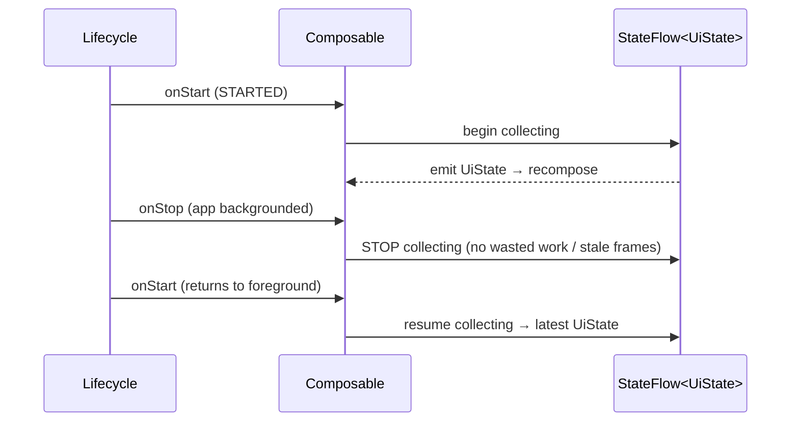
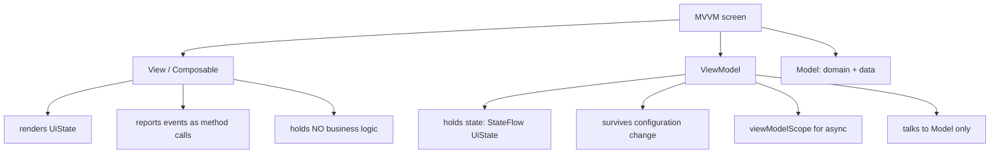

# Lesson 02 — MVVM in Compose

> After this lesson you can give the UI layer a `ViewModel` that exposes a single `StateFlow<UiState>`, collect it lifecycle-aware, and wire user actions back as method calls — the everyday shape of a Compose screen.

**Module:** 13 · **Lesson:** 02 · **Level:** 🟢🟡🔴 · **Est. time:** 80–100 min

---

## 1. Concept

### 🟢 For beginners — *what is it and why do I care?*

A screen needs a brain. Something has to remember what's on screen, survive the phone rotating, fetch data, and decide what happens when a button is tapped. If you put all of that *inside* a `@Composable`, two bad things happen: the work restarts every time the UI redraws, and everything resets when the user rotates the device.

**MVVM (Model–View–ViewModel)** is the pattern that gives the screen a proper brain:

- **Model** — your data and rules (the domain + data layers from Lesson 01).
- **View** — the composables. They *draw* state and *report* events. That's it. They hold no business logic.
- **ViewModel** — the brain. It holds the screen's state, survives rotation, talks to the Model, and exposes methods the View calls.

The View asks "what should I show?" and the ViewModel answers with **state**. The View says "the user tapped refresh," and the ViewModel handles it. The View never reaches into the database; it only ever talks to its ViewModel.

### 🟡 For intermediate devs — *the mechanism*

The 2026 idiom is precise and small:

1. The `ViewModel` holds state in a `MutableStateFlow<UiState>` and exposes it **read-only** as `StateFlow<UiState>`.
2. The composable collects it with **`collectAsStateWithLifecycle()`** — lifecycle-aware, so collection pauses when the app is backgrounded.
3. User actions are **method calls** on the ViewModel (`vm::refresh`, `vm.onQueryChange(q)`).

```kotlin
class FeedViewModel(private val repo: ArticleRepository) : ViewModel() {
    private val _uiState = MutableStateFlow(FeedUiState())
    val uiState: StateFlow<FeedUiState> = _uiState.asStateFlow()   // read-only outward

    fun refresh() { /* update _uiState, call repo in viewModelScope */ }
}

@Composable
fun FeedRoute(vm: FeedViewModel = viewModel()) {
    val state by vm.uiState.collectAsStateWithLifecycle()          // lifecycle-aware
    FeedScreen(state = state, onRefresh = vm::refresh)             // stateless View
}
```

The `ViewModel` lives in the `ViewModelStoreOwner` (the nav back-stack entry or the Activity), so it **outlives recomposition and configuration changes**. `viewModelScope` is a `CoroutineScope` that's cancelled automatically when the ViewModel is cleared, so your coroutines don't leak.

### 🔴 For senior devs — *trade-offs, edges, internals*

- **`collectAsStateWithLifecycle` vs `collectAsState`.** The lifecycle-aware collector starts/stops with the lifecycle (default `STARTED`), so a backgrounded screen stops collecting — no wasted recompositions, no stale frames when the user returns. `collectAsState` keeps collecting forever. On Android, lifecycle-aware is the correct default; the plain version is for non-Android targets or deliberately always-on flows.

- **`stateIn` and the `WhileSubscribed` timeout.** When you derive `uiState` from a cold upstream (`repo.observe…().map{…}.stateIn(...)`), `SharingStarted.WhileSubscribed(5_000)` keeps the upstream alive for 5s after the last collector leaves. That 5s window is deliberate: it survives a configuration change (collector detaches and re-attaches within milliseconds) **without** restarting the upstream flow, while still tearing down when the user actually navigates away. `Lazily`/`Eagerly` leak the subscription across the app's life; a 0ms timeout restarts work on every rotation. The 5s figure is the well-worn default.

- **One `StateFlow<UiState>` vs. many flows.** A single immutable `UiState` guarantees every frame is a **consistent snapshot** — you cannot accidentally render `isLoading = true` next to a stale `error`. Multiple independent flows can momentarily combine into impossible states (UI *tearing*). If state genuinely comes from several sources, `combine` them into one before exposing.

- **`StateFlow` vs `mutableStateOf` inside the ViewModel.** Both work. `StateFlow` is platform-agnostic (testable with Turbine, `combine`-able, usable off the main thread, decoupled from Compose). Compose `mutableStateOf` in a VM is ergonomic but couples the VM to the Compose runtime and the main thread. Most teams standardize on `StateFlow` + `collectAsStateWithLifecycle`; mixing both in one VM is a smell.

- **MVVM's known weakness: state sprawl.** MVVM tells you to "expose observable state and methods" but doesn't prescribe *how many* streams or *how* events are modeled. Left unchecked, a VM grows five `StateFlow`s and twelve public methods, and consistency erodes. **MVI** (Lesson 03) is MVVM with discipline bolted on: one state, sealed events, one reducer. Reach for MVI when a screen's state interactions get complex; plain MVVM is fine for simpler screens.

- **The VM must not hold Android UI references.** A `ViewModel` outlives the `Activity`/composition. Capturing a `Context`, `View`, `NavController`, or composable lambda in a field leaks the destroyed instance. Pass `applicationContext` if you truly need a context, and surface navigation as **events**, not by holding the navigator.

### Analogy

A **TV broadcast studio**. The **anchor desk on air** (the View) only shows what's fed to it. The **control room** (the ViewModel) decides what goes on air, switches segments, and survives even when one camera (a configuration change) is swapped out. The control room exposes a single clean **program feed** (`StateFlow<UiState>`) to the broadcast; it never lets the anchor desk wire itself directly into the satellite uplink (the database). Press a button on the desk (an event) and the control room reacts — the desk doesn't run the station.

### Mental model

> **The View renders one immutable `UiState` and reports events; the ViewModel is the only thing that produces the next state and the only thing that survives rotation.**

### Real-world example

A weather screen. `WeatherViewModel` exposes `WeatherUiState(isLoading, current, forecast, error)` as a `StateFlow`. `WeatherScreen` collects it with `collectAsStateWithLifecycle` and renders. Pull-to-refresh calls `vm::refresh`; rotating the phone keeps the loaded forecast because the VM (not the composable) holds it.

---

## 2. Visual Learning

**ASCII — the MVVM loop and what survives what:**
```text
   ┌───────────────────────── ViewModel (survives rotation) ─────────────────────┐
   │   _uiState: MutableStateFlow<UiState>   ──asStateFlow()──▶  uiState (RO)     │
   │        ▲ update()                                              │             │
   │        │                                            viewModelScope.launch    │
   │   onRefresh() / onQueryChange(q)  ───────────────▶  repo.observe()/refresh() │
   └────────┼──────────────────────────────────────────────────────┼─────────────┘
       events│ (method calls)                          state │ collectAsStateWithLifecycle
   ┌─────────┴───────────────────── Composable (View) ────────▼─────────────────────┐
   │   val state by vm.uiState.collectAsStateWithLifecycle()                        │
   │   renders state · buttons call vm::onRefresh        (no business logic here)   │
   └────────────────────────────────────────────────────────────────────────────────┘
```

**Mermaid — collection lifecycle (why `collectAsStateWithLifecycle` matters):**


**Mermaid — MVVM responsibilities (mind map):**


**Illustration prompt (paste into an image generator):**
```text
Illustration: a TV control room scene. Foreground: a sleek anchor desk labeled "VIEW (Composable)"
showing a single clean broadcast panel labeled "UiState". Behind glass: a control room labeled
"ViewModel" with a switcher board and one outgoing cable labeled "StateFlow" feeding the desk,
and an incoming button-cable labeled "events". A satellite uplink in the far back labeled
"Model / Repository" connects ONLY to the control room, never to the anchor desk (show that wire
blocked with a small X). One camera mid-swap labeled "configuration change" — the control room
keeps broadcasting. Modern, vibrant, clearly labeled, soft studio lighting.
```

---

## 3. Code

> Examples reuse `ArticleRepository` from Lesson 01. The View stays a separate stateless composable so it's previewable and testable.

### 🟢 Beginner — a minimal ViewModel + lifecycle-aware collection

```kotlin
class CounterViewModel : ViewModel() {
    private val _count = MutableStateFlow(0)
    val count: StateFlow<Int> = _count.asStateFlow()   // read-only to the View

    fun increment() = _count.update { it + 1 }         // atomic update
}

@Composable
fun CounterRoute(vm: CounterViewModel = viewModel()) {
    val count by vm.count.collectAsStateWithLifecycle()
    CounterScreen(count = count, onIncrement = vm::increment)
}

@Composable
private fun CounterScreen(count: Int, onIncrement: () -> Unit) {
    Button(onClick = onIncrement) { Text("Count: $count") }   // stateless View
}
```

**Explanation.** The VM owns the state and survives rotation; the View collects it lifecycle-aware and forwards the event as a method reference. `update {}` mutates atomically, which matters once concurrency enters the picture.

**Common mistakes.**
```kotlin
val count: MutableStateFlow<Int> = MutableStateFlow(0)        // ❌ exposes mutability to the View
val count by vm.count.collectAsState()                       // ❌ keeps collecting in the background
```
Exposing the `MutableStateFlow` lets the View overwrite your truth; `collectAsState` wastes work when backgrounded.

**Best practices.**
- Expose `asStateFlow()` (read-only). Collect with `collectAsStateWithLifecycle()`.
- Keep the View stateless; forward events as method references.

---

### 🟡 Intermediate — one immutable `UiState`, async via `viewModelScope`

```kotlin
data class FeedUiState(
    val isLoading: Boolean = false,
    val articles: List<Article> = emptyList(),
    val error: String? = null,
)

class FeedViewModel(private val repo: ArticleRepository) : ViewModel() {
    private val _uiState = MutableStateFlow(FeedUiState())
    val uiState: StateFlow<FeedUiState> = _uiState.asStateFlow()

    init { refresh() }

    fun refresh() {
        viewModelScope.launch {                            // cancelled when VM clears
            _uiState.update { it.copy(isLoading = true, error = null) }
            runCatching { repo.getArticles() }
                .onSuccess { list -> _uiState.update { it.copy(isLoading = false, articles = list) } }
                .onFailure { e -> _uiState.update { it.copy(isLoading = false, error = e.message) } }
        }
    }
}
```

**Explanation.** All screen state lives in one immutable object, updated with `copy`. Every emission is a coherent snapshot: `isLoading` and `error` change together, so the UI never shows a contradictory pair. Async work runs in `viewModelScope`, which is cancelled automatically when the VM is cleared — no leaks.

**Common mistakes.**
```kotlin
// ❌ Three independent flows → the View can render impossible combinations (tearing).
val isLoading = MutableStateFlow(false)
val articles  = MutableStateFlow(emptyList<Article>())
val error     = MutableStateFlow<String?>(null)

// ❌ Launching long work in GlobalScope → outlives the screen, leaks.
fun refresh() = GlobalScope.launch { /* ... */ }
```

**Best practices.**
- One `UiState`; update via `copy`; reset `error` when a new load starts.
- Always launch from `viewModelScope`; never `GlobalScope` from a VM.
- If state has multiple sources, `combine` them into one before exposing.

---

### 🔴 Production — Hilt-injected VM, `SavedStateHandle`, derived `stateIn` state

```kotlin
@HiltViewModel
class SearchViewModel @Inject constructor(
    private val repo: ArticleRepository,
    private val savedState: SavedStateHandle,            // survives process death
) : ViewModel() {

    // The query is restored after process death via SavedStateHandle's StateFlow.
    val query: StateFlow<String> = savedState.getStateFlow("query", "")

    @OptIn(ExperimentalCoroutinesApi::class)
    val uiState: StateFlow<SearchUiState> =
        query
            .debounce(300)                               // wait for typing to settle
            .distinctUntilChanged()
            .flatMapLatest { q ->                         // cancel the previous search
                if (q.isBlank()) flowOf(SearchUiState.Idle)
                else searchFlow(q)
            }
            .stateIn(
                scope = viewModelScope,
                started = SharingStarted.WhileSubscribed(5_000),  // survive rotation, stop on leave
                initialValue = SearchUiState.Idle,
            )

    fun onQueryChange(value: String) { savedState["query"] = value }

    private fun searchFlow(q: String): Flow<SearchUiState> = flow {
        emit(SearchUiState.Loading)
        emit(
            runCatching { repo.search(q) }
                .fold(
                    onSuccess = { SearchUiState.Results(it) },
                    onFailure = { SearchUiState.Error(it.message ?: "Search failed") },
                )
        )
    }
}

// Sealed UiState makes illegal combinations impossible to represent.
sealed interface SearchUiState {
    data object Idle : SearchUiState
    data object Loading : SearchUiState
    data class Results(val articles: List<Article>) : SearchUiState
    data class Error(val message: String) : SearchUiState
}
```

```kotlin
@Composable
fun SearchRoute(vm: SearchViewModel = hiltViewModel()) {
    val query by vm.query.collectAsStateWithLifecycle()
    val state by vm.uiState.collectAsStateWithLifecycle()
    SearchScreen(query = query, state = state, onQueryChange = vm::onQueryChange)
}
```

**Explanation.** State is **derived** reactively from the query: debounce while typing, `flatMapLatest` to cancel a superseded search, and `stateIn` to expose a hot `StateFlow` that survives rotation (5s window) but stops on real navigation. `SavedStateHandle` restores the query across **process death**. The sealed `SearchUiState` makes contradictory states (loading *and* results) unrepresentable. Hilt supplies both dependencies.

**Common mistakes.**
- **`Lazily`/`Eagerly` (or 0ms timeout) in `stateIn`** — leaks the subscription for the app's life or restarts work on every rotation. Use `WhileSubscribed(5_000)`.
- **Holding the query in plain `MutableStateFlow`** instead of `SavedStateHandle` — it's lost on process death.
- **`map` instead of `flatMapLatest`** for the search — old in-flight requests aren't cancelled, so a slow earlier result can overwrite a newer one.
- **Capturing a `Context`/`NavController`** in a VM field — leaks the destroyed Activity.

**Best practices.**
- Derive UI state from inputs with operators (`debounce`, `distinctUntilChanged`, `flatMapLatest`) and publish via `stateIn(WhileSubscribed(5_000))`.
- Restore user-entered, lightweight state via `SavedStateHandle`; rehydrate large data from the repository.
- Model `UiState` as a **sealed interface** when states are mutually exclusive.
- Inject with Hilt; never capture Android UI objects in the VM.

---

## 4. Interview Questions

**🟢 Beginner**

1. *What does the ViewModel do in MVVM, and what does the View do?*
   > The **ViewModel** holds the screen's state, survives configuration changes, talks to the Model, and exposes state + methods. The **View** (composables) renders that state and reports user events; it holds no business logic.
2. *What does a `ViewModel` give you over `remember`/`rememberSaveable`?*
   > It survives configuration changes by living in the `ViewModelStoreOwner`, provides `viewModelScope` for async work, and is the right home for screen logic and repository calls — not just value storage.

**🟡 Intermediate**

3. *`collectAsState` vs `collectAsStateWithLifecycle` — when each?*
   > `collectAsStateWithLifecycle` is the Android default: it pauses collection when the app is backgrounded (no wasted recompositions or stale frames). Use plain `collectAsState` only off-Android or for a flow you intentionally keep always-on.
4. *Why expose `StateFlow` instead of `MutableStateFlow`, and why one `UiState` instead of separate flows?*
   > Exposing the mutable type lets the View overwrite your source of truth — expose read-only via `asStateFlow()`. One immutable `UiState` guarantees a consistent snapshot per frame; separate flows can momentarily form impossible combinations (tearing).

**🔴 Senior**

5. *Explain `stateIn(SharingStarted.WhileSubscribed(5_000))`. Why that timeout instead of `Lazily` or `Eagerly`?*
   > `WhileSubscribed(5_000)` keeps the upstream alive 5s after the last collector unsubscribes. That bridges a configuration change (the collector re-attaches within milliseconds, so the flow isn't restarted) while still tearing down the upstream when the user truly leaves the screen. `Eagerly`/`Lazily` keep it alive for the app's lifetime (leaks/wasted work); a 0ms timeout restarts the upstream on every rotation.
6. *`StateFlow` vs `mutableStateOf` inside a ViewModel — trade-offs, and how does MVVM differ from MVI?*
   > `StateFlow` is platform-agnostic, testable (Turbine), `combine`-able, and decoupled from Compose; `mutableStateOf` is ergonomic but couples the VM to the Compose runtime/main thread. MVVM exposes observable state + methods but doesn't constrain *how many* streams or *how* events are modeled, which invites state sprawl; **MVI** adds discipline (one immutable state, sealed events through one reducer, effects on a channel). Reach for MVI as a screen's interactions grow complex.

---

## 5. AI Assistant

**Prompt example (generating a screen's VM):**
```text
Write a Compose MVVM ViewModel for an article feed, Kotlin 2.x, Hilt.
- Depend ONLY on an injected ArticleRepository (domain interface).
- Expose a single immutable FeedUiState (isLoading, articles, error) as StateFlow via asStateFlow().
- refresh() runs in viewModelScope, sets loading, then success/error.
- Provide a FeedRoute composable that collects with collectAsStateWithLifecycle and forwards a
  stateless FeedScreen(state, onRefresh). Do NOT expose MutableStateFlow or use collectAsState.
```

**AI workflow.**
- ✅ Good for: the VM skeleton, the `UiState` data class, the route/screen split, and `runCatching` plumbing.
- ⚠️ Watch: models routinely expose `MutableStateFlow`, default to `collectAsState`, scatter state across multiple flows, pick `stateIn(Lazily)`, or capture a `Context`/`NavController` in the VM.

**Review workflow — map to *Common Mistakes*:**
- Read-only exposure (`asStateFlow()`)? Lifecycle-aware collection (`collectAsStateWithLifecycle`)?
- One immutable `UiState` (or sealed) — not several parallel flows?
- `viewModelScope` (never `GlobalScope`); `stateIn` uses `WhileSubscribed(5_000)`?
- No Android UI object captured in the VM; query/lightweight state in `SavedStateHandle`?

**Validation workflow — prove it works:**
1. **Rotate** the device mid-load: state persists, and work doesn't restart (proves the VM holds state and `stateIn` survives).
2. **Background then foreground** the app and watch recomposition counts: collection should pause and resume (proves `collectAsStateWithLifecycle`).
3. **Unit-test the VM** with Turbine: assert `awaitItem()` goes loading → success/error; no Compose needed.
4. **Toggle "Don't keep activities"** to force process death; the query restores from `SavedStateHandle`, large data rehydrates from the repo.

> **AI drafts, you decide.** Route every generated VM back through the read-only / lifecycle-aware / single-state checklist before it ships.

---

## Recap / Key takeaways

- **MVVM split:** the **View** renders state and reports events; the **ViewModel** holds state, survives rotation, and owns async via `viewModelScope`.
- Expose **one immutable `UiState`** as a **read-only `StateFlow`** (`asStateFlow()`); collect with **`collectAsStateWithLifecycle()`**.
- Derive hot state with `stateIn(SharingStarted.WhileSubscribed(5_000))` so it survives rotation but stops on real navigation.
- Use **`SavedStateHandle`** for lightweight user input that must survive process death; rehydrate big data from the repository.
- Never capture a `Context`/`NavController`/`View` in a VM; surface navigation as **events**.
- MVVM is pragmatic but unconstrained — when state interactions get complex, graduate to **MVI** (next).

➡️ Next: **[Lesson 03 — MVI & Unidirectional State](03-mvi-unidirectional-state.md)** — add discipline: one state, sealed events in, one-shot effects out.
