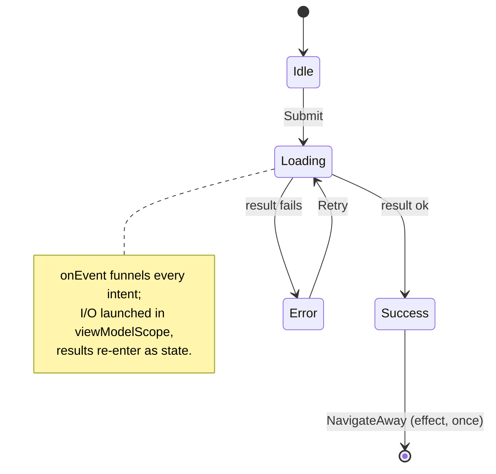
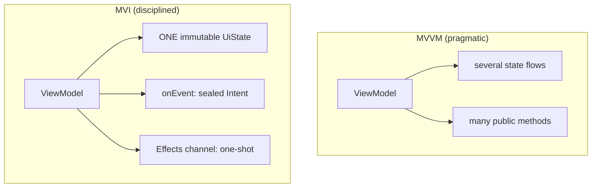

# Lesson 03 — MVI & Unidirectional State

> After this lesson you can model a screen as one immutable state, a sealed set of intents flowing into a single reducer, and one-shot effects flowing out a side channel — and explain exactly why this beats ad-hoc MVVM at scale.

**Module:** 13 · **Lesson:** 03 · **Level:** 🟢🟡🔴 · **Est. time:** 90–110 min

---

## 1. Concept

### 🟢 For beginners — *what is it and why do I care?*

In MVVM (Lesson 02) you exposed state and added methods. That works, but as a screen grows you accumulate several state flows and a dozen methods, and it gets hard to know what can change what. **MVI (Model–View–Intent)** is MVVM with three strict rules that keep big screens sane:

1. **One state.** The whole screen is described by a single immutable object — its `UiState`. At any instant the screen *is* exactly one `UiState`.
2. **Intents in.** Everything the user (or system) can do is a named **event** — `Refresh`, `Add(item)`, `Submit`. All events go into **one function**: `onEvent(event)`.
3. **Effects out.** One-time things — navigate, show a snackbar — are *not* stored in state. They go out a separate "side door" and happen exactly once.

The data flows in a single circle: state goes **down** to the screen, events go **up** to the reducer, the reducer produces the **next** state, which goes down again. That circle is **Unidirectional Data Flow (UDF)**. MVI is the strictest, most explicit way to implement it.

### 🟡 For intermediate devs — *the mechanism*

The four moving parts:

```text
   UiState (immutable)  ──renders──▶  View
        ▲                              │ user does something
        │ next state                   ▼
     Reducer  ◀────────────────────  Intent / Event   (one onEvent funnel)
        │
        └── one-shot ──▶ Effect (navigate / toast)  ──consumed once──▶ View
```

- **`UiState`** — a `data class` (coherent snapshot) or a `sealed interface` (mutually exclusive states). Derived values are **computed**, never stored.
- **`Intent`/`Event`** — a `sealed interface` enumerating every possible action.
- **`onEvent(event)`** — the **reducer**: a single entry point that maps `(currentState, event) → nextState`, launching async work as needed.
- **`Effect`** — a `sealed interface` for one-shot outputs, emitted on a `Channel`/`SharedFlow`, collected once in a lifecycle-aware collector.

The standard wiring: `MutableStateFlow<UiState>` exposed read-only; a `Channel<Effect>` exposed as `receiveAsFlow()`; the View collects state with `collectAsStateWithLifecycle` and effects in a `LaunchedEffect`.

### 🔴 For senior devs — *trade-offs, edges, internals*

- **One-shot events must never live in `UiState`.** This is *the* defining MVI rule and the most common bug when it's broken. If `navigateToCheckout: Boolean` is in state, it re-fires on every recomposition and again after process death restores the flag — you get double navigation and ghost snackbars. Effects belong on a `Channel` (single-consumer, buffered) or a `SharedFlow` (multi-consumer), consumed exactly once. If you remember one thing from this lesson, it's this.

- **`Channel` vs `SharedFlow` for effects — pick deliberately.** A `Channel(Channel.BUFFERED)` + `receiveAsFlow()` delivers each effect to **exactly one** collector and **buffers while nobody's listening** (so an effect emitted during a config change isn't dropped) — the safe default for navigation/snackbars. A `MutableSharedFlow(extraBufferCapacity = 1)` fans out to multiple collectors but **drops** emissions when there's no subscriber unless you buffer; it's right when several observers must see the effect. Plain `SharedFlow()` with no buffer + no subscriber = silently lost effects. Choose based on "one consumer or many" and "what happens if nobody's listening right now."

- **The reducer should be deterministic and ideally pure.** `(state, event) → state` with no I/O inside the transition is unit-testable without coroutines and without Compose. Side effects (network, DB) are *launched* from the reducer into `viewModelScope`; their **results** come back as new events/state updates, not as inline mutations. Keeping the pure state transition separate from the impure work is what makes MVI so testable.

- **Make illegal states unrepresentable.** A bag of nullable flags (`isLoading`, `data?`, `error?`) admits contradictions (`isLoading = true` *and* a non-null `error`). A `sealed interface UiState { Loading; Success(data); Error(msg) }` lets the compiler forbid them. The cost: partial updates are clumsier (you can't `copy` one field across variants). Many teams use a hybrid — a `data class` for the screen with a sealed `contentState` field for the part that's genuinely one-of-N.

- **MVI's costs are real.** More types (state + intent + effect), more ceremony per screen, and a learning curve. The payoff — a single funnel that's trivial to log, test, and time-travel — is worth it on **complex, stateful screens** and overkill on a static detail page. Calibrate: MVI for the checkout flow, plain MVVM for "About."

- **One reducer, easy observability.** Because every state change flows through `onEvent`, you can log every `(event → state)` transition in one place, replay them in tests, and reason about the screen as a state machine. That single-funnel property is the architectural prize, not the boilerplate.

### Analogy

**A vending machine.** You can't reach inside and rearrange the cans (you can't mutate `UiState` directly). You press a labeled button — an **Intent**. Internal logic walks through well-defined **states**: *Idle → Selecting → Dispensing → Done*, and the front display (the **UiState**) shows exactly one at a time. The *thunk* of the can dropping is a **one-shot effect** — it happens once and is not part of the persistent display; if you photograph the machine later, the can isn't still mid-drop. MVVM, by contrast, is a helpful shopkeeper exposing several live readouts you can poke at.

### Mental model

> **The screen is a state machine: one immutable state in the window, every action a typed event through one door, every one-time outcome a spark out the side that's caught exactly once.**

### Real-world example

A checkout screen. `CheckoutUiState(items, isSubmitting, validationError)` describes the screen. Tapping pay sends `CheckoutEvent.Submit` into `onEvent`, which validates, sets `isSubmitting`, calls the repository, and on success emits `CheckoutEffect.NavigateToConfirmation` once. Rotating the phone mid-submit keeps `isSubmitting` true but does **not** re-navigate, because navigation was an effect, not state.

---

## 2. Visual Learning

**ASCII — the MVI cycle with the effect side-channel:**
```text
        ┌──────────────────────── ViewModel ─────────────────────────┐
        │  state: StateFlow<UiState>   (immutable, ONE object)        │
        │      ▲                                                       │
        │  reduce(state, event) ──launch I/O──▶ viewModelScope        │
        │      ▲                          results feed back as state   │
        │  onEvent(event) ◀───────────────────────────────────┐       │
        │      │                                               │       │
        │  effects: Channel<Effect> ──receiveAsFlow()──┐       │       │
        └──────┼───────────────────────────────────────┼───────┼──────┘
        state ▼ collectAsStateWithLifecycle    effects ▼       │ events
        ┌──────┴─────────────────── View ───────────────┴───────┴──────┐
        │ renders UiState   ·   LaunchedEffect collects effects ONCE   │
        │ buttons → vm.onEvent(SomeEvent)                              │
        └──────────────────────────────────────────────────────────────┘
```

**Mermaid — MVI as a state machine:**


**Mermaid — MVVM vs MVI side by side:**


**Illustration prompt (paste into an image generator):**
```text
Illustration: a stylized vending machine, front view. A single large glowing display panel labeled
"UiState" cycles through Idle → Loading → Success. A vertical row of physical buttons labeled
"Intents" (Refresh, Add, Submit). A coin-return slot at the bottom emits a single one-time sparkle
labeled "one-shot effect: navigate". A thick arrow traces buttons → internal reducer wheel → display.
A hand trying to reach into the dispenser is shown blocked with a small X (you can't mutate state
directly). Modern, vibrant, clearly labeled, soft studio lighting.
```

---

## 3. Code

> Examples reuse the `ArticleRepository` domain interface from Lesson 01. We build a cart screen as the full MVI exemplar.

### 🟢 Beginner — state down, one event funnel, no effects yet

```kotlin
data class CounterUiState(val count: Int = 0)

sealed interface CounterEvent {
    data object Increment : CounterEvent
    data object Decrement : CounterEvent
    data object Reset : CounterEvent
}

class CounterViewModel : ViewModel() {
    private val _state = MutableStateFlow(CounterUiState())
    val state: StateFlow<CounterUiState> = _state.asStateFlow()

    fun onEvent(event: CounterEvent) = when (event) {         // the single funnel
        CounterEvent.Increment -> _state.update { it.copy(count = it.count + 1) }
        CounterEvent.Decrement -> _state.update { it.copy(count = it.count - 1) }
        CounterEvent.Reset     -> _state.update { it.copy(count = 0) }
    }
}

@Composable
fun CounterRoute(vm: CounterViewModel = viewModel()) {
    val state by vm.state.collectAsStateWithLifecycle()
    CounterScreen(state = state, onEvent = vm::onEvent)
}
```

**Explanation.** One immutable `CounterUiState`, one `sealed` event type, one `onEvent` reducer. The `when` is **exhaustive** (no `else`), so adding a new event becomes a compile error until you handle it — the compiler keeps the reducer complete.

**Common mistakes.**
```kotlin
fun increment() { /* ... */ }      // ❌ scattering public methods defeats the single funnel
fun decrement() { /* ... */ }      //    you lose one place to log/test every transition
```

**Best practices.**
- Funnel every action through `onEvent`; keep the `when` exhaustive (no `else`).
- One immutable state; update via `copy`/`update`.

---

### 🟡 Intermediate — derived values + async results re-entering as state

```kotlin
data class FeedUiState(
    val isLoading: Boolean = false,
    val articles: List<Article> = emptyList(),
    val error: String? = null,
) {
    val isEmpty: Boolean get() = !isLoading && error == null && articles.isEmpty()  // DERIVED
}

sealed interface FeedEvent {
    data object Refresh : FeedEvent
    data class ArticleClicked(val id: String) : FeedEvent
}

class FeedViewModel(private val repo: ArticleRepository) : ViewModel() {
    private val _state = MutableStateFlow(FeedUiState())
    val state: StateFlow<FeedUiState> = _state.asStateFlow()

    init { onEvent(FeedEvent.Refresh) }

    fun onEvent(event: FeedEvent) {
        when (event) {
            FeedEvent.Refresh -> refresh()
            is FeedEvent.ArticleClicked -> { /* effect in the next tier */ }
        }
    }

    private fun refresh() = viewModelScope.launch {
        _state.update { it.copy(isLoading = true, error = null) }
        runCatching { repo.getArticles() }
            .onSuccess { list -> _state.update { it.copy(isLoading = false, articles = list) } }
            .onFailure { e -> _state.update { it.copy(isLoading = false, error = e.message) } }
    }
}
```

**Explanation.** The reducer launches I/O in `viewModelScope`; the **result** flows back as a state update (`copy`), never as an inline UI mutation. `isEmpty` is **derived** from the other fields, so it can never disagree with them.

**Common mistakes.**
```kotlin
val isEmpty: Boolean = articles.isEmpty()    // ❌ stored as a separate field → drifts out of sync
```
- Forgetting to reset `error` on a new `Refresh`.
- Mutating the list in place (`articles.add(...)`) instead of emitting a new list via `copy`.

**Best practices.**
- Derive computed values (`isEmpty`, `total`) with `get()`; never store them.
- Keep the reducer's transition deterministic; launch I/O separately and feed results back as state.

---

### 🔴 Production — full MVI: sealed events, one-shot effects, the cart

```kotlin
// ---- State: derived values computed, never stored ----
data class CartUiState(
    val items: List<CartItem> = emptyList(),
    val isCheckingOut: Boolean = false,
) {
    val total: Long get() = items.sumOf { it.unitPrice * it.qty }   // single source of truth
    val isEmpty: Boolean get() = items.isEmpty()
}

// ---- Intents in ----
sealed interface CartEvent {
    data class Add(val product: Product) : CartEvent
    data class Remove(val id: String) : CartEvent
    data object Checkout : CartEvent
}

// ---- Effects out (one-shot, NEVER stored in state) ----
sealed interface CartEffect {
    data class ShowMessage(val text: String) : CartEffect
    data object NavigateToPayment : CartEffect
}

@HiltViewModel
class CartViewModel @Inject constructor(
    private val repo: CartRepository,
) : ViewModel() {

    private val _state = MutableStateFlow(CartUiState())
    val state: StateFlow<CartUiState> = _state.asStateFlow()

    // Channel: each effect delivered to exactly ONE collector, buffered if nobody's listening yet.
    private val _effects = Channel<CartEffect>(Channel.BUFFERED)
    val effects: Flow<CartEffect> = _effects.receiveAsFlow()

    fun onEvent(event: CartEvent) {
        when (event) {
            is CartEvent.Add    -> _state.update { it.copy(items = it.items.upsert(event.product)) }
            is CartEvent.Remove -> _state.update { it.copy(items = it.items.filterNot { i -> i.id == event.id }) }
            CartEvent.Checkout  -> checkout()
        }
    }

    private fun checkout() {
        if (_state.value.isEmpty) {
            _effects.trySend(CartEffect.ShowMessage("Your cart is empty"))
            return
        }
        _state.update { it.copy(isCheckingOut = true) }
        _effects.trySend(CartEffect.NavigateToPayment)
    }
}
```

```kotlin
@Composable
fun CartRoute(
    vm: CartViewModel = hiltViewModel(),
    onNavigateToPayment: () -> Unit,
) {
    val state by vm.state.collectAsStateWithLifecycle()
    val snackbar = remember { SnackbarHostState() }

    // Consume one-shot effects EXACTLY once; re-collected safely across recomposition.
    LaunchedEffect(Unit) {
        vm.effects.collect { effect ->
            when (effect) {
                is CartEffect.ShowMessage    -> snackbar.showSnackbar(effect.text)
                CartEffect.NavigateToPayment -> onNavigateToPayment()
            }
        }
    }

    CartScreen(state = state, onEvent = vm::onEvent, snackbarHostState = snackbar)
}
```

**Explanation.** One immutable `CartUiState` with `total` **derived** from `items`. Every action is a typed `CartEvent` through one `onEvent`. Navigation and messages are **one-shot effects** on a `Channel`, consumed once in a `LaunchedEffect` — so they don't re-fire on recomposition or after rotation. The reducer stays deterministic; the only async (`checkout` work) would be launched into `viewModelScope` and its result re-entered as state.

**Common mistakes.**
```kotlin
// ❌ One-shot event encoded as state → re-fires on every recomposition AND after process-death restore.
data class CartUiState(val navigateToPayment: Boolean = false)
LaunchedEffect(state.navigateToPayment) { if (state.navigateToPayment) onNavigateToPayment() }
```
- **Effects in `UiState`** — the canonical MVI bug (double navigation, ghost snackbars). Use a `Channel`/`SharedFlow`.
- **Storing `total`** as state — drifts from `items`. Derive it.
- **Exposing `MutableStateFlow`/`Channel`** directly — the View can corrupt your truth.
- **`SharedFlow()` with no buffer/subscriber** for effects — emissions silently lost.

**Best practices.**
- One immutable state; derive computed values; typed events through one reducer.
- One-shot effects via `Channel`(single consumer)/`SharedFlow`(many), consumed in a lifecycle-aware collector.
- Keep `onEvent` deterministic; launch I/O in `viewModelScope`, feed results back as state.
- Expose read-only `StateFlow`/`Flow`; persist only ids via `SavedStateHandle`.

---

## 4. Interview Questions

**🟢 Beginner**

1. *What are the three core ideas of MVI?*
   > One immutable `UiState` for the whole screen; user/system actions modeled as a sealed `Intent`/`Event` sent through a single reducer (`onEvent`); one-shot outcomes (navigate, toast) emitted as **effects** on a side channel, not stored in state.
2. *What is Unidirectional Data Flow?*
   > State flows down to the View; events flow up to the reducer, which produces the next state. Data moves in one direction, making the screen predictable.

**🟡 Intermediate**

3. *Why funnel all actions through one `onEvent` instead of many public methods?*
   > A single funnel gives you one place to log, test, and reason about every state transition; with an exhaustive `when`, adding an event is a compile error until handled. Scattered methods lose that single-source observability and make the screen's behavior harder to enumerate.
4. *Why must derived values like a cart total be computed, not stored?*
   > Stored duplicates drift out of sync with their source (`items`) the moment one updates without the other. Computing `total` with a `get()` guarantees it always matches the items — a single source of truth.

**🔴 Senior**

5. *How do you handle one-shot events like navigation in MVI, and why not put them in state?*
   > Emit them as **effects** on a `Channel` (or `SharedFlow`) and consume once in a lifecycle-aware collector. In `UiState`, a `navigate` flag re-fires on every recomposition and again after process-death restores the flag, causing double navigation / ghost toasts. Effects are ephemeral by definition; state is durable — they're different kinds of data.
6. *`Channel` vs `SharedFlow` for effects — how do you choose?*
   > `Channel(BUFFERED) + receiveAsFlow()` delivers each effect to exactly one collector and buffers while nobody's listening — the safe default for navigation/snackbars (an effect emitted during a config change isn't lost). `MutableSharedFlow(extraBufferCapacity = 1)` fans out to multiple collectors but drops emissions without a subscriber unless buffered. Choose by "one consumer vs many" and "what happens if no one is collecting at emit time." A bufferless `SharedFlow` with no subscriber silently loses effects.

---

## 5. AI Assistant

**Prompt example (refactor MVVM → MVI):**
```text
Refactor this ViewModel to MVI for Compose, Kotlin 2.x, Hilt:
1) collapse separate isLoading/data/error flows into ONE immutable UiState exposed as read-only
   StateFlow; keep derived values (total, isEmpty) computed with get(), not stored.
2) model every user action as a sealed CartEvent handled by a single onEvent reducer (exhaustive when).
3) move navigation/snackbar to one-shot effects on a Channel(BUFFERED) exposed via receiveAsFlow(),
   consumed once in a LaunchedEffect. Do NOT put one-shot events in UiState.
[paste code]
```

**AI workflow.**
- ✅ Good for: generating the `UiState`/`Event`/`Effect` triple, the reducer skeleton, and the route wiring.
- ⚠️ Watch: models routinely **put one-shot events in state**, store derived values, expose `MutableStateFlow`/`Channel`, and pick a bufferless `SharedFlow` for effects.

**Review workflow — map to *Common Mistakes*:**
- One immutable `UiState`; derived values **derived** with `get()`?
- One-shot effects on a `Channel`/`SharedFlow`, **not** booleans in state?
- Exhaustive `when` in `onEvent` (no `else`); read-only exposure of state/effects?
- Reducer deterministic; I/O in `viewModelScope` feeding results back as state?

**Validation workflow — prove it works:**
1. **Rotate** mid-flow: state persists; navigation/snackbar does **not** re-fire (proves effects aren't in state).
2. **Unit-test the reducer**: feed events, assert the next `UiState`. No Compose, no coroutines for the pure transition.
3. **Turbine** the `StateFlow`: `awaitItem()` through Idle → Loading → Success/Error.
4. **Turbine the effects flow**: emit `Checkout` on an empty cart, assert exactly one `ShowMessage`; on a full cart, exactly one `NavigateToPayment`.

> **AI drafts, you decide.** The fastest MVI review is a single question: *"Is anything one-shot living in `UiState`?"* If yes, send it back.

---

## Recap / Key takeaways

- **MVI = disciplined UDF:** one immutable `UiState`, sealed `Intent`s through a single `onEvent` reducer, one-shot `Effect`s out a side channel.
- **Never store one-shot events in state** — use a `Channel`(one consumer) or `SharedFlow`(many), consumed once in a lifecycle-aware collector. This is the defining rule.
- **Derive** computed values (`total`, `isEmpty`); never store duplicates that can drift.
- Keep the **reducer deterministic**; launch I/O in `viewModelScope` and re-enter results as state — that's what makes it unit-testable.
- **Make illegal states unrepresentable** with sealed types; the single funnel gives you one place to log, test, and reason.
- MVI's ceremony pays off on **complex screens**; plain MVVM is fine for simple ones.

➡️ Next: **[Lesson 04 — Repository Pattern](04-repository-pattern.md)** — give the Model a single source of truth that hides where data really comes from.
