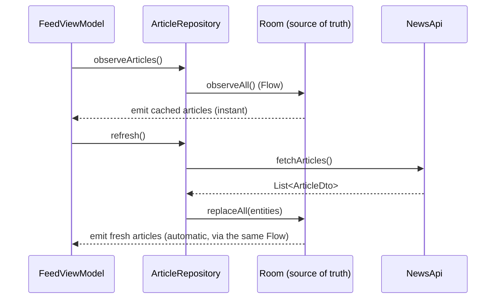
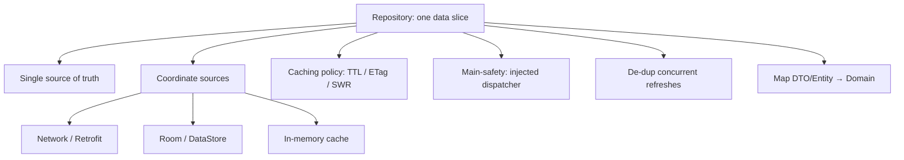

# Lesson 04 — Repository Pattern

> After this lesson you can design a repository that is the single source of truth for a slice of data, hides whether it came from network or disk, exposes domain models as streams, and coordinates caching without leaking any of it to the UI.

**Module:** 13 · **Lesson:** 04 · **Level:** 🟢🟡🔴 · **Est. time:** 80–100 min

---

## 1. Concept

### 🟢 For beginners — *what is it and why do I care?*

Data comes from many places: a REST API, a local database, an in-memory cache, files. If every screen decides *for itself* when to hit the network versus the cache, you get chaos — five screens, five different caching rules, bugs where one screen shows fresh data and another shows stale.

**A repository is a single object that owns one kind of data and answers questions about it.** `ArticleRepository` owns articles. Ask it for articles and it figures out the rest: maybe it returns the cached copy instantly, fetches a fresh one in the background, and saves it for next time. The screen doesn't know or care. It just asks the repository.

Two big wins:

- **One place decides the rules.** Caching, refresh, retries — all in the repository, not scattered across screens.
- **The UI is decoupled from the source.** Swap REST for GraphQL, or add an offline cache, and no screen changes — only the repository does.

### 🟡 For intermediate devs — *the mechanism*

A repository sits in the **data layer** and **implements a domain interface** (Lesson 01). The interface speaks **domain models**; the implementation orchestrates the concrete sources.

```kotlin
// DOMAIN (pure): the contract
interface ArticleRepository {
    fun observeArticles(): Flow<List<Article>>   // a stream the UI reacts to
    suspend fun refresh()                          // explicit one-shot command
}

// DATA: the orchestrator
class ArticleRepositoryImpl @Inject constructor(
    private val api: NewsApi,        // remote source
    private val dao: ArticleDao,     // local source
) : ArticleRepository { /* ... */ }
```

Key design choices:

- **`Flow` for data that changes, `suspend` for commands.** `observeArticles()` is a stream so the UI updates automatically when the cache changes; `refresh()` is a `suspend` one-shot.
- **The local store is usually the source of truth.** A common pattern: the UI observes the database; the network's only job is to update the database. (This is offline-first — Lesson 07.)
- **Map to domain inside the repository.** DTOs and entities never escape; callers always get `Article`.

### 🔴 For senior devs — *trade-offs, edges, internals*

- **"Single source of truth" is the whole point, and it's a design decision per repository.** For a feed you want, the **database** is the SoT: the network refreshes it, the UI observes it, and there's exactly one place the data "really" lives. The alternative — network as SoT with the cache as a side-effect — is simpler but offers no offline story and risks the UI and cache disagreeing. Decide explicitly which store is authoritative; don't let it be ambiguous.

- **Repositories should expose *intent-revealing* operations, not a generic CRUD facade.** `observeUnreadCount()`, `markAsRead(id)`, `refreshFeed()` communicate *what the app does*. A repository that's just `get/insert/update/delete<T>` has pushed all the actual logic back up into ViewModels — it's a DAO with extra steps. The repository is where data-access *policy* lives.

- **Threading & main-safety are the repository's job.** Callers shouldn't have to know that `refresh()` does I/O. Wrap blocking work with `withContext(ioDispatcher)`/`flowOn(ioDispatcher)` *inside* the repository, and **inject the dispatcher** (don't hardcode `Dispatchers.IO`) so it's swappable with a test dispatcher. Suspend functions must be main-safe by contract.

- **De-duplicate concurrent refreshes.** Two screens calling `refresh()` at once shouldn't fire two network calls. Patterns: a single shared in-flight `Deferred`, a `Mutex`, or modeling the fetch as a `SharedFlow` with `WhileSubscribed`. Naively launching per-call causes redundant traffic and write races on the cache.

- **Caching policy lives here, and it has teeth.** Time-based invalidation (TTL), conditional requests (ETag/`If-Modified-Since`), stale-while-revalidate, and pagination boundaries are all repository concerns. Getting them wrong shows up as either stale UIs or hammered backends — and the fix is always in one place if the repository owns the policy.

- **One repository per *aggregate*, not per table or per screen.** Group data that changes together and is consistent together (an `OrderRepository` covering orders + line items), not one repo per Room table and not one per screen. Per-table repos leak persistence structure; per-screen repos duplicate logic across screens that share data.

- **Don't let the repository become a god object.** When an `ArticleRepository` accretes auth, analytics, feature flags, and three APIs, split by responsibility or introduce **use cases** (Lesson 05) to compose multiple repositories. The repository owns *one data domain's* access; cross-domain orchestration is a use-case concern.

### Analogy

A **librarian**. You don't wander the stacks, the off-site archive, and the new-arrivals cart yourself. You ask the librarian for a book. She checks the shelf (cache), and if it's not there, retrieves it from the archive (network) and *also* puts a copy on the shelf for the next person. If two people ask for the same missing book at once, she fetches it once. You never learn where it physically came from — you just get the book. A library where every patron rummages the archive directly is a library with lost books and chaos.

### Mental model

> **A repository is the one place that owns a slice of data and decides where it comes from. The UI asks; the repository answers; nobody upstream knows about the network or the database.**

### Real-world example

An email app. `MailRepository` exposes `observeInbox(): Flow<List<Email>>` backed by Room, plus `sync()` that pulls from the server and writes to Room. The list screen observes the flow; pull-to-refresh calls `sync()`. Marking a message read (`markRead(id)`) updates Room immediately (instant UI) and queues a server update — all caching, optimistic update, and conflict logic encapsulated in the repository.

---

## 2. Visual Learning

**ASCII — the repository as the single funnel for one data slice:**
```text
   ┌──────────── UI layer ────────────┐
   │ FeedViewModel → ArticleRepository │  (depends on the DOMAIN interface only)
   └───────────────────┬───────────────┘
                       │ observeArticles() : Flow<List<Article>>   /   refresh()
                       ▼
   ┌──────────── ArticleRepositoryImpl (data layer) ─────────────┐
   │   decides: cache? network? merge?     SINGLE SOURCE OF TRUTH│
   │                                                             │
   │   observe ─▶ [ Room DAO ] ◀── write ── refresh() ◀─ [ NewsApi ]│
   │                  │ Flow                         (network)   │
   │            map Entity→Article                                │
   └─────────────────────────────────────────────────────────────┘
            UI sees domain models only — never DTOs/entities.
```

**Mermaid — offline-first read/refresh flow:**


**Mermaid — what the repository owns (mind map):**


**Illustration prompt (paste into an image generator):**
```text
Illustration: a friendly librarian at a central desk labeled "Repository". In front, a reader
labeled "ViewModel" hands over a request card "observeArticles()". Behind the librarian, three
zones connected only to her desk: a bookshelf labeled "Cache (Room)", an archive door labeled
"Network (API)", and a small cart labeled "in-memory". An arrow shows her fetching one missing book
from the archive and ALSO placing a copy on the shelf. Two readers requesting the same missing book
are served by a single fetch (one arrow). The reader never walks past the desk. Modern, vibrant,
clearly labeled, warm library lighting.
```

---

## 3. Code

> Built on the `Article` domain model and `ArticleRepository` interface from Lesson 01. Mappers (`toDomain`, `toEntity`) are assumed from there.

### 🟢 Beginner — a repository that hides two sources

```kotlin
class ArticleRepositoryImpl(
    private val api: NewsApi,
    private val dao: ArticleDao,
) : ArticleRepository {

    override suspend fun getArticles(): List<Article> {
        val fromNetwork = api.fetchArticles()                 // List<ArticleDto>
        dao.upsertAll(fromNetwork.map { it.toEntity() })      // cache for next time
        return fromNetwork.map(ArticleDto::toDomain)          // return DOMAIN models
    }
}
```

**Explanation.** The repository is the only code that knows both `NewsApi` and `ArticleDao` exist. It fetches, caches, and returns domain `Article`s. The caller asks one question and gets clean data.

**Common mistakes.**
```kotlin
// ❌ The repository returns DTOs — the wire format leaks upward into the UI.
suspend fun getArticles(): List<ArticleDto> = api.fetchArticles()
```
Now every consumer is coupled to your JSON shape; a renamed field breaks screens.

**Best practices.**
- Map to **domain** inside the repository; never return DTOs/entities.
- Keep source coordination (network + cache) inside the repository.

---

### 🟡 Intermediate — database as the source of truth (observe + refresh)

```kotlin
class ArticleRepositoryImpl @Inject constructor(
    private val api: NewsApi,
    private val dao: ArticleDao,
    @IoDispatcher private val io: CoroutineDispatcher,   // injected, swappable in tests
) : ArticleRepository {

    // UI observes the DB; it updates automatically whenever refresh() writes.
    override fun observeArticles(): Flow<List<Article>> =
        dao.observeAll()
            .map { entities -> entities.map(ArticleEntity::toDomain) }
            .flowOn(io)

    override suspend fun refresh() = withContext(io) {       // main-safe
        val fresh = api.fetchArticles().map(ArticleDto::toEntity)
        dao.replaceAll(fresh)                                 // one write → flow re-emits
    }
}
```

**Explanation.** The database is the **single source of truth**: the UI observes `dao.observeAll()`, and `refresh()` only updates that store. A successful refresh writes once and the `Flow` re-emits automatically — no manual "push to UI." All I/O is wrapped with the **injected** dispatcher, so the function is main-safe and the threading is swappable in tests.

**Common mistakes.**
```kotlin
override fun observeArticles() =
    dao.observeAll().map { it.map(ArticleEntity::toDomain) }   // ❌ no flowOn → mapping on caller's thread

override suspend fun refresh() {
    val fresh = api.fetchArticles()                            // ❌ hardcoded Dispatchers.IO elsewhere,
    withContext(Dispatchers.IO) { dao.replaceAll(/*...*/) }    //    not injected → untestable threading
}
```

**Best practices.**
- Pick a **single source of truth** (here, Room) and have the network feed it.
- **Inject the dispatcher**; wrap I/O with `flowOn`/`withContext`. Suspend functions are main-safe.
- Prefer `Flow` for changing data; one cache write should propagate to all observers.

---

### 🔴 Production — TTL caching, concurrent-refresh de-duplication, error surfacing

```kotlin
class ArticleRepositoryImpl @Inject constructor(
    private val api: NewsApi,
    private val dao: ArticleDao,
    private val clock: Clock,                              // injected → testable time
    @IoDispatcher private val io: CoroutineDispatcher,
    @AppScope private val appScope: CoroutineScope,        // outlives any single screen
) : ArticleRepository {

    private val refreshMutex = Mutex()
    private var inFlight: Deferred<Unit>? = null
    private val ttl = 5.minutes

    override fun observeArticles(): Flow<List<Article>> =
        dao.observeAll().map { it.map(ArticleEntity::toDomain) }.flowOn(io)

    /** Refresh only if stale; collapse concurrent callers into ONE network call. */
    override suspend fun refresh(force: Boolean) {
        if (!force && !isStale()) return
        val job = refreshMutex.withLock {
            inFlight?.takeIf { it.isActive }                 // someone already refreshing?
                ?: appScope.async(io) {                       // …no: start one shared fetch
                    try {
                        val fresh = api.fetchArticles().map { it.toEntity(fetchedAt = clock.now()) }
                        dao.replaceAll(fresh)
                    } finally {
                        refreshMutex.withLock { inFlight = null }
                    }
                }.also { inFlight = it }
        }
        job.await()                                           // all callers await the same result
    }

    private suspend fun isStale(): Boolean {
        val newest = dao.newestFetchedAt() ?: return true
        return clock.now() - newest > ttl
    }
}
```

**Explanation.** Three production concerns, all encapsulated: **TTL** (skip the network if the cache is fresh, unless `force`), **concurrent de-duplication** (a `Mutex` guards a single shared `Deferred`, so ten simultaneous `refresh()` calls trigger **one** request and all await it), and **injected `Clock`** so TTL logic is unit-testable without real time. The shared fetch runs in an injected `appScope` so it isn't cancelled if the triggering screen leaves mid-refresh. Errors propagate out of `refresh()` to the ViewModel, which decides how to surface them.

**Common mistakes.**
```kotlin
override suspend fun refresh(force: Boolean) {
    val fresh = api.fetchArticles()       // ❌ no de-dup → N screens = N identical network calls + write races
    dao.replaceAll(fresh.map { it.toEntity() })
}
// ❌ launching the fetch in viewModelScope inside the repo — cancelled when that screen dies mid-write
```
- Swallowing exceptions in the repository (`runCatching {}.getOrNull()`) so the UI can never show an error.
- Using `System.currentTimeMillis()` directly → TTL logic can't be tested deterministically.

**Best practices.**
- Encapsulate **caching policy** (TTL/ETag/SWR) in the repository; expose intent-revealing ops.
- **De-duplicate** concurrent refreshes (shared `Deferred`/`Mutex`).
- Run cross-screen work in an injected app-scope; inject `Clock`/dispatchers for testability.
- Let errors **propagate** to the caller; don't silently swallow them.

---

## 4. Interview Questions

**🟢 Beginner**

1. *What is the repository pattern and what problem does it solve?*
   > A repository is an object that owns one kind of data and hides where it comes from (network, database, cache) behind a clean interface. It centralizes data-access rules so screens don't each reinvent caching/refresh, and it decouples the UI from the data source.
2. *In a layered app, which layer does the repository live in, and what models does it expose?*
   > The **data** layer. It implements a domain interface and exposes **domain models** (mapping DTOs/entities at the boundary); the UI never sees DTOs or Room entities.

**🟡 Intermediate**

3. *What does "single source of truth" mean for a repository, and how is it usually implemented?*
   > One authoritative place where the data lives. Commonly the **local database**: the UI observes the DB via a `Flow`, and the network's job is only to update the DB. A cache write then propagates to every observer automatically — the UI and cache can't disagree.
4. *Why inject the `CoroutineDispatcher` instead of using `Dispatchers.IO` directly in the repository?*
   > To keep the repository main-safe *and* testable. Injecting the dispatcher lets tests substitute a `StandardTestDispatcher`/`UnconfinedTestDispatcher` for deterministic, fast execution; hardcoding `Dispatchers.IO` couples the repo to real threads and makes timing nondeterministic.

**🔴 Senior**

5. *Two screens call `refresh()` at the same time. What goes wrong with a naive implementation, and how do you fix it?*
   > Naively, each call fires its own network request and writes to the cache, causing redundant traffic and possible write races / flicker. Fix by **de-duplicating**: guard a single shared in-flight `Deferred` with a `Mutex` (or model the fetch as a `SharedFlow` with `WhileSubscribed`) so concurrent callers collapse into one request and all await the same result.
6. *How do you decide repository granularity — one per table, per screen, or something else?*
   > One per **aggregate**: group data that changes together and must stay consistent together (e.g., orders + their line items in one `OrderRepository`). Per-table repos leak persistence structure and force ViewModels to orchestrate joins; per-screen repos duplicate logic across screens sharing the same data. When a repo grows cross-cutting concerns, split by responsibility or compose repositories via use cases.

---

## 5. AI Assistant

**Prompt example (generating an offline-first repository):**
```text
Implement an offline-first ArticleRepositoryImpl in the DATA layer for Compose, Kotlin 2.x, Hilt.
- Implements the domain ArticleRepository { fun observeArticles(): Flow<List<Article>>; suspend fun refresh(force: Boolean) }.
- Room is the single source of truth: observeArticles() maps dao.observeAll() to domain via flowOn(injected io).
- refresh() fetches from NewsApi, maps DTO→entity, replaceAll into Room; add TTL (5 min) with an injected Clock,
  and de-duplicate concurrent refreshes with a Mutex + shared Deferred. Map at the boundary; never return DTOs/entities.
  Inject the dispatcher. Let errors propagate.
```

**AI workflow.**
- ✅ Good for: the observe/refresh skeleton, the mapper calls, the DI constructor, and the Room write plumbing.
- ⚠️ Watch: models often return DTOs, hardcode `Dispatchers.IO`, skip `flowOn`, **omit refresh de-duplication**, swallow errors, and use `System.currentTimeMillis()` instead of an injected clock.

**Review workflow — map to *Common Mistakes*:**
- Returns **domain** models (DTOs/entities mapped at the boundary)?
- **Injected** dispatcher + `flowOn`/`withContext` (main-safe), not hardcoded `Dispatchers.IO`?
- Concurrent `refresh()` **de-duplicated**; cross-screen work in an app-scope, not `viewModelScope`?
- Errors **propagate** (no silent `getOrNull()`); TTL uses an injected `Clock`?

**Validation workflow — prove it works:**
1. **Unit-test** the repo with a fake `NewsApi`, an in-memory Room DB, and a `TestDispatcher`; assert `observeArticles()` emits cached then fresh data.
2. **Concurrency test**: launch many `refresh()` calls; assert the fake API recorded **one** request (de-dup works).
3. **TTL test**: advance the injected `Clock` past the TTL; assert a refresh hits the network; within TTL, assert it skips.
4. **Error test**: make the API throw; assert the exception surfaces from `refresh()` and the cached `Flow` still emits.

> **AI drafts, you decide.** Generated repositories usually "work" on the happy path; the senior value is in the parts AI skips — de-dup, TTL, threading, and error propagation. Review those first.

---

## Recap / Key takeaways

- A **repository owns one data slice** and hides its sources behind a domain interface; the UI asks, the repository answers.
- Pick a **single source of truth** (usually Room): the UI observes it; the network feeds it; a cache write propagates to every observer.
- Expose **`Flow` for changing data**, **`suspend` for commands**; map DTOs/entities to **domain** at the boundary.
- Make the repo **main-safe** with an **injected dispatcher**; **de-duplicate** concurrent refreshes.
- **Caching policy** (TTL/ETag/SWR) lives in the repository; let **errors propagate** to the caller.
- One repository per **aggregate**, not per table or per screen; don't let it become a god object — compose with **use cases** next.

➡️ Next: **[Lesson 05 — Use Cases / Interactors](05-use-cases-interactors.md)** — where business rules that span repositories live.
