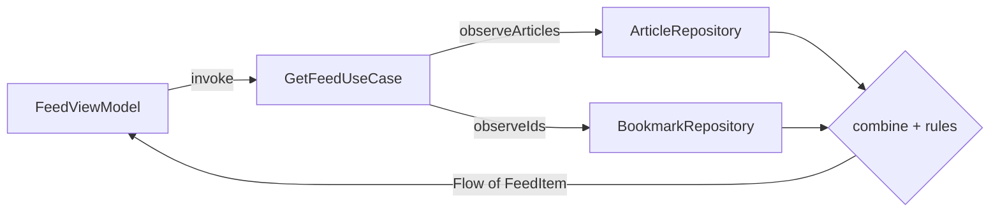
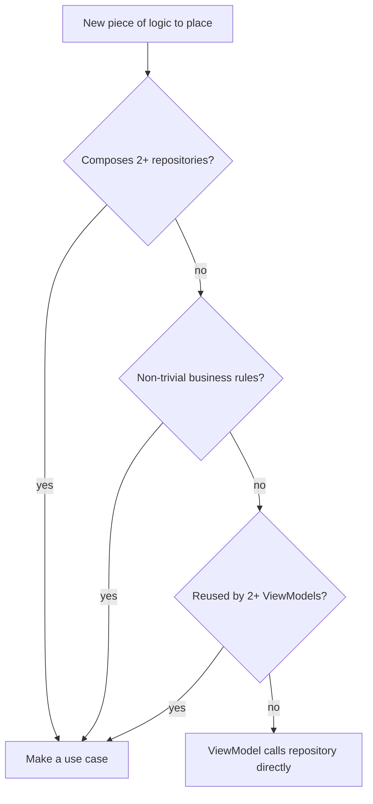

# Lesson 05 — Use Cases / Interactors

> After this lesson you can extract business rules into single-responsibility use cases that compose repositories, decide when a use case earns its keep, and write the idiomatic `operator fun invoke` form.

**Module:** 13 · **Lesson:** 05 · **Level:** 🟢🟡🔴 · **Est. time:** 75–90 min

---

## 1. Concept

### 🟢 For beginners — *what is it and why do I care?*

A repository (Lesson 04) owns *one* slice of data. But real features often need to combine several slices and apply rules. "Show the user's feed" might mean: get the articles, get the user's bookmarks, mark which articles are bookmarked, and sort them. Where does *that* logic go?

If you put it in the `ViewModel`, every screen that needs the same combination re-implements it — and your ViewModels balloon. If you put it in a repository, you've mixed "feed articles" with "bookmark" concerns in one class.

**A use case (also called an interactor) is a small object that does exactly one business task.** `GetFeedUseCase` knows how to assemble the feed by talking to the article and bookmark repositories and applying the rules. The ViewModel just calls it. One use case = one verb the app can do.

The payoff: business rules live in **named, reusable, testable** units — not buried in UI code or smeared across repositories.

### 🟡 For intermediate devs — *the mechanism*

A use case lives in the **domain layer** (pure Kotlin), depends on **repository interfaces**, and exposes a single operation. The Android-idiomatic form uses `operator fun invoke` so the use case *looks like a function*:

```kotlin
class GetFeedUseCase @Inject constructor(
    private val articles: ArticleRepository,
    private val bookmarks: BookmarkRepository,
) {
    operator fun invoke(): Flow<List<FeedItem>> =
        combine(articles.observeArticles(), bookmarks.observeIds()) { arts, marked ->
            arts.map { FeedItem(it, isBookmarked = it.id in marked) }
        }
}

// In the ViewModel — call it like a function:
class FeedViewModel @Inject constructor(getFeed: GetFeedUseCase) : ViewModel() {
    val uiState = getFeed()  // reads like a sentence
        .map { /* → UiState */ }
        .stateIn(/* ... */)
}
```

Conventions that signal "this is a use case":
- **Named after the action**, in `VerbNounUseCase` form (`GetFeed`, `ToggleBookmark`, `SubmitOrder`).
- **One public operation** (`invoke`), so there's no ambiguity about what it does.
- **Returns domain types** (`Flow<…>` or a `suspend` result), depends only on domain interfaces.

### 🔴 For senior devs — *trade-offs, edges, internals*

- **Use cases are optional, and over-applying them is a real anti-pattern.** A use case that just forwards one call to one repository — `class GetArticlesUseCase(val repo) { operator fun invoke() = repo.observeArticles() }` — adds a class, a DI binding, and a layer of indirection for **zero** logic. That's ceremony. Add a use case when it (a) **composes ≥2 repositories**, (b) holds **non-trivial business rules**, or (c) is **reused by multiple ViewModels**. Otherwise let the ViewModel call the repository directly. Teams that mandate "a use case for every repository call" generate hundreds of pass-through classes and call it architecture.

- **The `invoke` operator is convention, not magic — weigh readability vs. discoverability.** `getFeed()` reads beautifully and makes the use case substitutable for a lambda in tests. The cost: jump-to-definition is slightly less obvious than a named method, and a class with `operator fun invoke` plus other methods is confusing. Rule: a use case has **exactly one** operation, named `invoke`. If you need two operations, you have two use cases.

- **Use cases are where cross-repository transactions and orchestration belong.** "Place order" = reserve inventory, charge payment, create the order, clear the cart — touching several repositories with ordering and rollback concerns. That orchestration doesn't belong in any single repository (none owns all that data) nor in the ViewModel (it's business logic, not UI). The use case is the natural home; it can also enforce invariants ("can't order if KYC incomplete") in one testable place.

- **Threading: prefer making use cases main-safe, or delegate to repositories.** A common pattern (e.g. Now in Android) keeps use cases thin and lets repositories own dispatchers. If a use case does CPU-heavy combination, wrap it with an injected dispatcher itself. Either way, the ViewModel shouldn't need to know.

- **Use cases compose use cases — carefully.** A `GetFeedUseCase` might call a `FormatRelativeTimeUseCase`. That's fine, but deep use-case call chains become hard to trace; keep the graph shallow. If A only ever calls B, consider inlining.

- **Naming and granularity encode the ubiquitous language.** A package full of `GetFeed`, `ToggleBookmark`, `SubmitOrder`, `ObserveUnreadCount` reads as a **catalog of what the app does** — onboarding gold and a hedge against logic leaking back into UI. Treat the use-case list as living documentation of the product's capabilities.

### Analogy

A **recipe** in a professional kitchen. Ingredients come from suppliers (repositories). A line cook (the ViewModel) doesn't improvise how to make the signature sauce every service — they follow the **recipe card** (use case): combine these ingredients, in this order, with these rules. The recipe is written once, tested, and reused at every station. But you don't write a "recipe card" that says "open the jar of olives" — that's a single step, not a recipe. Recipe cards are for *combinations and rules*, not for handing someone one ingredient.

### Mental model

> **A use case is one verb the app can perform, written once as a pure unit that composes repositories — add it when there's logic worth naming and reusing, not as a reflex around every call.**

### Real-world example

A banking app's `TransferMoneyUseCase`: validates the amount against balance, checks daily limits, debits one account and credits another through the `AccountRepository`, records the transaction, and returns a typed result (`Success`/`InsufficientFunds`/`LimitExceeded`). Three different screens (quick transfer, scheduled transfer, bill pay) reuse it; its rules are unit-tested without any UI or network.

---

## 2. Visual Learning

**ASCII — where the use case sits and what it composes:**
```text
   ┌──────────── UI layer ────────────┐
   │  FeedViewModel  →  getFeed()      │   (depends on the use case)
   └───────────────────┬───────────────┘
                       │ invoke()
                       ▼
   ┌──────────── DOMAIN layer ─────────────────────────────┐
   │  GetFeedUseCase   (one verb: "get the feed")          │
   │      ├─ ArticleRepository.observeArticles()           │
   │      ├─ BookmarkRepository.observeIds()               │
   │      └─ rule: mark bookmarked + sort                  │
   └───────────────────┬───────────────────┬───────────────┘
                       ▼                   ▼
              ArticleRepositoryImpl   BookmarkRepositoryImpl   (data layer)
```

**Mermaid — a use case composing two repositories into one stream:**


**Mermaid — decision: do I need a use case? (flow diagram):**


**Illustration prompt (paste into an image generator):**
```text
Illustration: a professional kitchen pass. A line cook labeled "ViewModel" holds a single recipe
card labeled "GetFeedUseCase". The card lists steps that pull from two supply crates labeled
"ArticleRepository" and "BookmarkRepository", then a mixing bowl labeled "combine + rules" produces
a finished plate labeled "Flow<FeedItem>". To the side, a discarded card that just says "open the
olive jar" is crossed out with an X (don't make a use case for a single trivial step). Modern,
vibrant, clearly labeled, warm kitchen lighting.
```

---

## 3. Code

> Use cases live in the domain layer and depend on the repository interfaces from Lesson 04.

### 🟢 Beginner — a use case with one rule

```kotlin
// DOMAIN layer — pure Kotlin, depends on a repository interface.
class ToggleBookmarkUseCase @Inject constructor(
    private val bookmarks: BookmarkRepository,
) {
    suspend operator fun invoke(articleId: String) {
        if (bookmarks.isBookmarked(articleId)) bookmarks.remove(articleId)
        else bookmarks.add(articleId)
    }
}

// UI layer — call it like a function.
class FeedViewModel @Inject constructor(
    private val toggleBookmark: ToggleBookmarkUseCase,
) : ViewModel() {
    fun onBookmarkClicked(id: String) = viewModelScope.launch { toggleBookmark(id) }
}
```

**Explanation.** `ToggleBookmarkUseCase` encapsulates one rule ("toggle = remove if present, else add"). It's named after the action and exposes a single `invoke`. The ViewModel reads `toggleBookmark(id)` like a sentence and stays free of the toggle logic.

**Common mistakes.**
```kotlin
// ❌ Putting the toggle rule inline in the ViewModel — every screen re-implements it.
fun onBookmarkClicked(id: String) = viewModelScope.launch {
    if (bookmarks.isBookmarked(id)) bookmarks.remove(id) else bookmarks.add(id)
}
```

**Best practices.**
- Name use cases after the action (`ToggleBookmarkUseCase`); expose one `invoke`.
- Put even small *rules* (toggle semantics) in a use case if they recur.

---

### 🟡 Intermediate — composing two repositories into one stream

```kotlin
data class FeedItem(val article: Article, val isBookmarked: Boolean)

class GetFeedUseCase @Inject constructor(
    private val articles: ArticleRepository,
    private val bookmarks: BookmarkRepository,
) {
    operator fun invoke(): Flow<List<FeedItem>> =
        combine(
            articles.observeArticles(),
            bookmarks.observeIds(),
        ) { arts, markedIds ->
            arts
                .map { FeedItem(it, isBookmarked = it.id in markedIds) }
                .sortedByDescending { it.article.publishedAt }
        }
}

class FeedViewModel @Inject constructor(getFeed: GetFeedUseCase) : ViewModel() {
    val uiState: StateFlow<FeedUiState> =
        getFeed()
            .map { FeedUiState(items = it, isLoading = false) }
            .stateIn(viewModelScope, SharingStarted.WhileSubscribed(5_000), FeedUiState(isLoading = true))
}
```

**Explanation.** `GetFeedUseCase` does what no single repository can: it `combine`s two independent streams and applies the "mark bookmarked + sort newest first" rule. The result is one `Flow<List<FeedItem>>` the ViewModel maps to `UiState`. The composition logic is written once and unit-testable in isolation.

**Common mistakes.**
```kotlin
// ❌ Doing the combine in the ViewModel — now every screen that shows the feed repeats it.
val uiState = combine(articleRepo.observeArticles(), bookmarkRepo.observeIds()) { a, b -> /* ... */ }
```
- Using `combine` but forgetting it re-emits on *either* source changing (usually desired — just be aware).

**Best practices.**
- Use a use case when logic **spans repositories** or is **reused**.
- Return domain types (`Flow<FeedItem>`); keep the use case free of Compose/Android.

---

### 🔴 Production — orchestration with a typed result and invariants

```kotlin
// A sealed result makes every outcome explicit and testable — no exceptions for control flow.
sealed interface TransferResult {
    data class Success(val transactionId: String) : TransferResult
    data object InsufficientFunds : TransferResult
    data object DailyLimitExceeded : TransferResult
    data class Failed(val reason: String) : TransferResult
}

class TransferMoneyUseCase @Inject constructor(
    private val accounts: AccountRepository,
    private val transactions: TransactionRepository,
    private val limits: LimitRepository,
) {
    suspend operator fun invoke(
        fromId: String,
        toId: String,
        amount: Money,
    ): TransferResult {
        val from = accounts.get(fromId) ?: return TransferResult.Failed("Unknown account")

        // Business invariants live here — one tested place, not three screens.
        if (from.balance < amount) return TransferResult.InsufficientFunds
        if (limits.todayTotal(fromId) + amount > limits.dailyCap(fromId)) {
            return TransferResult.DailyLimitExceeded
        }

        return runCatching {
            accounts.transfer(fromId, toId, amount)             // repo handles the atomic debit/credit
            val id = transactions.record(fromId, toId, amount)
            TransferResult.Success(id)
        }.getOrElse { TransferResult.Failed(it.message ?: "Transfer failed") }
    }
}
```

```kotlin
// UI layer — the ViewModel maps the typed result to state/effects; it holds NO transfer rules.
class TransferViewModel @Inject constructor(private val transfer: TransferMoneyUseCase) : ViewModel() {
    fun onConfirm(from: String, to: String, amount: Money) = viewModelScope.launch {
        when (val result = transfer(from, to, amount)) {
            is TransferResult.Success        -> _effects.send(TransferEffect.NavigateToReceipt(result.transactionId))
            TransferResult.InsufficientFunds -> _state.update { it.copy(error = "Insufficient funds") }
            TransferResult.DailyLimitExceeded -> _state.update { it.copy(error = "Daily limit exceeded") }
            is TransferResult.Failed         -> _state.update { it.copy(error = result.reason) }
        }
    }
}
```

**Explanation.** `TransferMoneyUseCase` orchestrates **three repositories** and owns the **business invariants** (balance check, daily limit). It returns a **sealed `TransferResult`** instead of throwing, so every outcome is explicit and the ViewModel's `when` is exhaustive. The atomic debit/credit is delegated to `AccountRepository` (it owns that data and the transaction). All of this is reused by every transfer entry point and unit-tested without UI or network.

**Common mistakes.**
```kotlin
// ❌ Throwing exceptions for expected outcomes — the UI must guess what can be thrown.
suspend operator fun invoke(...): String {
    require(from.balance >= amount) { "Insufficient funds" }   // IllegalArgumentException as control flow
    // ...
}
// ❌ Putting the balance/limit checks in the ViewModel — business rules leak into UI, untested per-screen.
```
- Letting the use case touch Android/Compose types (it must stay pure).
- Two public methods on one use case (split into two use cases instead).

**Best practices.**
- Use cases own **cross-repository orchestration** and **invariants**; return **typed results**, not exceptions, for expected outcomes.
- Keep one operation per use case; keep it pure (no Android).
- Delegate atomic multi-table writes to the repository that owns the data.

---

## 4. Interview Questions

**🟢 Beginner**

1. *What is a use case (interactor) and where does it live?*
   > A small domain-layer object that performs exactly one business task, depending on repository interfaces and returning domain types. It keeps business rules out of the UI and out of repositories that shouldn't own them.
2. *Why is the `operator fun invoke` convention used for use cases?*
   > So the use case can be *called like a function* (`getFeed()`), reads naturally at the call site, and is easily substitutable for a lambda in tests. It signals "one operation."

**🟡 Intermediate**

3. *When should you add a use case versus calling the repository directly from the ViewModel?*
   > Add one when the logic **composes two or more repositories**, contains **non-trivial business rules**, or is **reused by multiple ViewModels**. For a one-to-one pass-through to a single repository, skip it — the ViewModel can call the repository directly.
4. *Why return a sealed result type from a use case instead of throwing exceptions?*
   > Expected outcomes (insufficient funds, limit exceeded) are part of the domain, not exceptional. A sealed result makes every outcome explicit and forces the caller's `when` to handle each — far safer than the UI guessing which exceptions might fly out.

**🔴 Senior**

5. *What's the anti-pattern of overusing use cases, and how do you avoid it?*
   > Generating a pass-through use case for every repository method — hundreds of classes that add a DI binding and indirection for zero logic. Avoid it with a rule: a use case must compose multiple sources, hold real rules, or be reused. Otherwise the ViewModel calls the repository directly. "A use case per call" is ceremony masquerading as architecture.
6. *Where do cross-repository transactions and orchestration belong, and why not in a repository or ViewModel?*
   > In a **use case**. A single repository owns one data slice, so it can't naturally coordinate inventory + payment + order + cart. The ViewModel is UI-layer and shouldn't hold business orchestration (it wouldn't be reusable or unit-testable off-device). The use case sits in the domain, composes the repositories, enforces invariants in one place, and is reused by every entry point — atomic multi-table writes still delegate to the owning repository.

---

## 5. AI Assistant

**Prompt example (extracting a use case):**
```text
Extract a GetFeedUseCase (domain layer, pure Kotlin) for Compose, Kotlin 2.x, Hilt.
- Depends on ArticleRepository and BookmarkRepository interfaces only (no Android/Compose).
- operator fun invoke(): Flow<List<FeedItem>> that combines observeArticles() and observeIds(),
  marks each article bookmarked, sorts newest-first.
- Then refactor FeedViewModel to call getFeed() and stateIn() into FeedUiState.
Only create the use case because it composes TWO repositories — do NOT generate pass-through use
cases for single-repository calls elsewhere.
```

**AI workflow.**
- ✅ Good for: writing the `combine`/orchestration body, the sealed result type, the DI constructor, and refactoring the VM to call `invoke()`.
- ⚠️ Watch: models love to generate a use case for **every** repository method (pass-through bloat), throw exceptions for expected outcomes, add multiple public methods to one use case, or import Android types into the domain.

**Review workflow — map to *Common Mistakes*:**
- Does the use case earn its keep (composes ≥2 repos / real rules / reused) — or is it a pass-through to delete?
- **One** public operation (`invoke`)? Pure (no Android/Compose imports)?
- Expected outcomes as a **sealed result**, not thrown exceptions?
- Cross-repository orchestration lives here, not in the ViewModel?

**Validation workflow — prove it works:**
1. **Unit-test** the use case with fake repositories: feed inputs, assert the combined/orchestrated output and each result branch. No Compose, no device.
2. For `Flow` use cases, drive the fakes with **Turbine**: change one source, assert the combined stream re-emits correctly.
3. **Exhaustiveness check**: the ViewModel's `when` over the sealed result must compile without an `else` — if it needs one, a branch is missing.
4. Grep the domain for `androidx`/`retrofit` imports — a use case must have none.

> **AI drafts, you decide.** Before accepting a generated use case, ask the model to justify *why it isn't a pass-through*. If it can't, inline it.

---

## Recap / Key takeaways

- A **use case** is one verb the app can do — a domain-layer unit that composes repositories and owns business rules.
- Use the **`operator fun invoke`** form so it reads like a function and substitutes for a lambda in tests; **one operation per use case**.
- **Add a use case** only when it composes ≥2 repositories, holds non-trivial rules, or is reused — pass-through use cases are an anti-pattern.
- Use cases are the home for **cross-repository orchestration and invariants**; return **sealed result types** for expected outcomes, not exceptions.
- Keep them **pure** (no Android/Compose); delegate atomic multi-table writes to the owning repository.
- The use-case list doubles as a **catalog of what the app does**.

➡️ Next: **[Lesson 06 — Feature Modularization](06-feature-modularization.md)** — turn these layers into Gradle modules with build-time boundaries.
